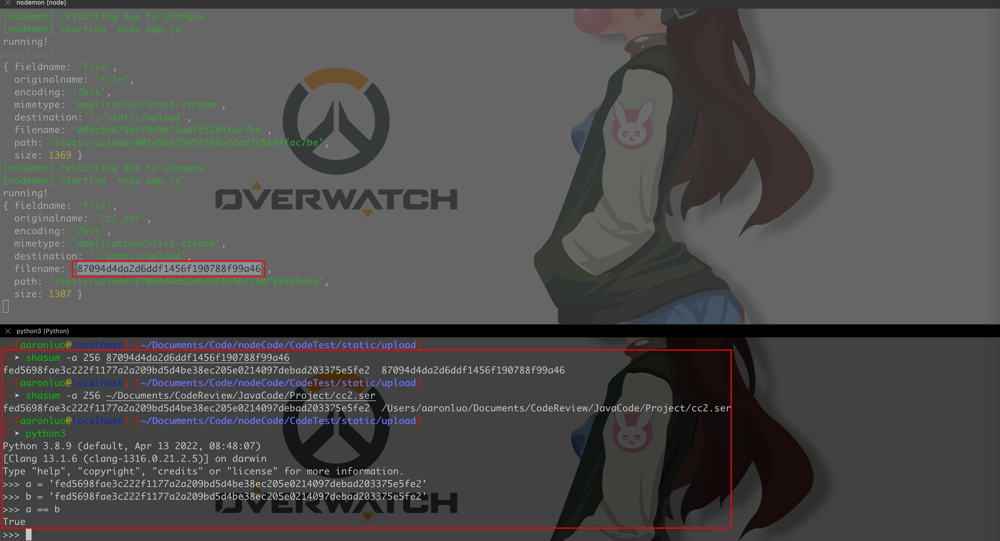

## 简介
由于在CC链的学习过程中，是使用的IO操作，模拟网络传输操作，在这里难免会不太理解如果是在web传输过程中，如何实现序列化数据在网络上传输，并且在网络传输过程中，序列化数据（二进制流）与源文件的hash值不等，以及文件特征丢失等等很奇怪的问题，目前找到原因就是编码问题，但是二进制流的会被篡改的问题还没有解决，但是在测试反序列化，就能知道有哪些需要注意的事项了
### 环境
| jdk | 8u181 |
| --- | --- |
| maven | 3.8.5 |
| springmvc | 4.3.18.RELEASE |
| tomcat | 8.5.79 |

## 搭建SpringMVC
web选取SpringMVC，关于SpringMVC的搭建过程，请参考[SpringMVC内存马#创建SpringMVC项目](/知识库/02.JAVA安全/12.Spring框架内存马入门/#创建spring-mvc项目)，Tomcat版本为8.5.79，目录结构如下所示


然后整体思路是，通过文件上传，上传已经序列化好的文件（可以通过ysoserial项目创建，也可以自己下载对应的Commons Collections包，进行序列化成文件)
为什么会用文件上传的形式？这个在后面提及，当然还有更好的方式，但是只是为了验证网络传输，所以也就选择了最简单的方式
但是文件上传需要用到中间件，依赖如下，添加到pom.xml中

```xml
<!--文件上传依赖包-->
<dependency>
  <groupId>commons-fileupload</groupId>
  <artifactId>commons-fileupload</artifactId>
  <version>1.3.1</version>
</dependency>
<dependency>
  <groupId>commons-io</groupId>
  <artifactId>commons-io</artifactId>
  <version>2.4</version>
</dependency>
```
并且在`dispatcher-servlet.xml`里添加bean，配置上传文件的最大值，以及默认的编码方式
```xml
<bean id="multipartResolver" class="org.springframework.web.multipart.commons.CommonsMultipartResolver">
  <property name="maxUploadSize" value="10485760"/>
  <property name="defaultEncoding" value="UTF-8" />
</bean>
```
### HelloController
`/hi`接口是返回前端的文件上传页面，`/ysoserial`接口则是处理传入的序列化的=数据，然后进行反序列化操作
```java
package com.spring.Controller;

import org.springframework.stereotype.Controller;
import org.springframework.web.bind.annotation.RequestMapping;
import org.springframework.web.bind.annotation.RequestParam;
import org.springframework.web.multipart.MultipartFile;
import java.io.*;

@Controller
public class HelloController {
    @RequestMapping(value = "/hi")
    public String ReturnJsp(){
        return "hello";
    }
    @RequestMapping(value = "/ysoserial")
    public String SerialTest(@RequestParam("file") MultipartFile f1) throws Exception{
        ByteArrayInputStream byteArrayInputStream = new ByteArrayInputStream(f1.getBytes());
        ObjectInputStream objectInputStream = new ObjectInputStream(byteArrayInputStream);
        objectInputStream.readObject();
        return "test";
    }
}

```
启动起来，效果如下：


这里上传对应的已经序列化过后的文件(比如CC7.ser)，即可执行命令


然后将它运行起来之后，就可以看到正常的网络传输过程中，在web中如何反序列化
这个靶场其实很简单，但是在其中的问题很多，所以才会有这一篇文章
在针对上传文件属实有点low了，这里将文件输出成base64编码，然后网络传输传递base64编码，然后再序列化

```java
// Base64EncodeTest
package com.myproject;
import sun.misc.BASE64Decoder;
import sun.misc.BASE64Encoder;

import java.io.File;
import java.io.FileInputStream;
import java.io.FileOutputStream;

public class Base64EncodeTest {
    public static String encodeBase64File(String path) throws Exception{
        File file = new File(path);
        FileInputStream fileInputStream = new FileInputStream(file);
        byte[] buffer = new byte[(int) file.length()];
        fileInputStream.read(buffer);
        fileInputStream.close();
        return new BASE64Encoder().encode(buffer);
    }
    public static  void decodeBase64File(String base64Encode,String targetPath) throws Exception{
        byte[] buffer = new BASE64Decoder().decodeBuffer(base64Encode);
        FileOutputStream outputStream = new FileOutputStream(targetPath);
        outputStream.write(buffer);
        outputStream.close();
    }
    public static void main(String[] args) throws Exception {
        String base64Code = encodeBase64File("cc7.ser");
        System.out.println(base64Code);
    }
}

```


然后我们对base64编码的二进制文件，base64解码还原来比较一下sha256

```java
// Base64EncodeTest
//...
public static void main(String[] args) throws Exception {
    String base64Code = encodeBase64File("cc7.ser");
    decodeBase64File(base64Code,"cc7base64Decode.ser");
}
```


可以发现是hash之后是相等的，那么最后需要更改的就是web接收的参数，为base64字符串，这个字符串当解码之后就是二进制流，需要存放在一个byte数组中，然后再存放在ByteArrayInputStream中，然后使用ObjectInputStream来读取，最后再readObject进行反序列化

```java
byte[] buff = new BASE64Decoder().decodeBuffer(request.getParameter("data"));
ByteArrayInputStream byteArrayInputStream = new ByteArrayInputStream(buff);
ObjectInputStream objectInputStream = new ObjectInputStream(byteArrayInputStream);
objectInputStream.readObject();
```
完整的Spring web Controller 如下，对应的接口为`/ysoserialBase64`
```java
package com.spring.Controller;

import org.springframework.stereotype.Controller;
import org.springframework.web.bind.annotation.RequestMapping;
import org.springframework.web.bind.annotation.RequestParam;
import org.springframework.web.multipart.MultipartFile;
import sun.misc.BASE64Decoder;

import java.io.*;
import javax.servlet.http.HttpServletRequest;

@Controller
public class HelloController {
    @RequestMapping(value = "/hi")
    public String ReturnJsp(){
        return "hello";
    }
    @RequestMapping(value = "/ysoserial")
    public String SerialTest(@RequestParam("file") MultipartFile f1) throws Exception{
        ByteArrayInputStream byteArrayInputStream = new ByteArrayInputStream(f1.getBytes());
        ObjectInputStream objectInputStream = new ObjectInputStream(byteArrayInputStream);
        objectInputStream.readObject();
        return "test";
    }
    @RequestMapping(value = "/ysoserialBase64")
    public String SerialBase64Test(HttpServletRequest request) throws IOException, ClassNotFoundException {
        byte[] buff = new BASE64Decoder().decodeBuffer(request.getParameter("data"));
        ByteArrayInputStream byteArrayInputStream = new ByteArrayInputStream(buff);
        ObjectInputStream objectInputStream = new ObjectInputStream(byteArrayInputStream);
        objectInputStream.readObject();
        return "test";
    }
}

```
在进行传输base64编码的时候，一定要注意，因为base64编码存在`+`,在web进行传输的时候`+`会被解码成空格则会导致解码失败，详情参考[Base64编码/解码原理](/知识库/03.主机安全/03.Base64编码解码原理.md)，**在这里需要将base64编码再进行一次URL编码放在burp里传输**，如下所示


## 相关问题
### 0x1 接收POST Body
最开始想如[Adobe ColdFusion AMF Deserialization Remote Command Execution (CVE-2017-3066)](https://vulhub.org/#/environments/coldfusion/CVE-2017-3066/)的漏洞利用这样，将反序列化的数据保存到文本文件，然后直接pasted from burp，将文本文件的二进制流传递给web服务器，但是在我使用node.js的时候发现无法接收到来自POST的请求体，因为在express里要接收对应的POST Body，都是由中间件解析完成，然而其实并不想太麻烦，所以最后使用上传文件的方式来将二进制文件流传入给服务端，然后立马就有了编码问题
### 0x2 编码问题
我在反复尝试后，将经过网络传输的文件保存下来，再利用模拟的IO操作进行反序列化，发现一直无法反序列化成功，因为在模拟IO操作的地方，我发现有crash，CC2本身在反序列化cc2.ser的时候程序就会crash，然后一直没去调试反序列化的过程，在这里浪费了许多时间
排查思路，需要拿到对应的文件进行判断，是否正常
我在这里选择使用node.js，因为轻便(使用java也行，只是我用node比较快)，简单来看一下问题
```shell
npm install express --save
npm install multer --save
```
```javascript
const express = require('express')
const app = new express()
const fs = require('fs')
const multer = require('multer')
let multerConfig = multer({
  dest: './static/upload',
})

app.get('/',(req,res)=>{
	res.send('hahaha')
})

app.post('/',multerConfig.single('file'),(req,res)=>{
	console.log(req.file)
	res.send('get Post')
})

app.listen(8081,()=>{
	console.log('running!')
})
```
此时通过burp构造一个`multipart/form-data`，然后对应将cc2.ser 粘贴到burp里


对其进行sha256，与源文件进行对比，发现并不能对上


并且可以看到如下对比，通过pasted from burp 上传到的文件，已经不符合java 序列化文件的类型了


那到底为什么会出现这种情况？我在[Adobe ColdFusion AMF Deserialization Remote Command Execution (CVE-2017-3066)](https://vulhub.org/#/environments/coldfusion/CVE-2017-3066/)复现过程遇到过，以前是用低版本burp能复现成功，最开始的时候没有探讨原因，后面在北京的时候问过大佬，说是因为编码问题，只要更改为utf-8就可以了，但是我把所有的编码方式都修改了，发现还是不行，包括还是修改对应的16进制码（只修改了一部分)，还是不行
然后写了一个静态页面，上传页面，注意后端需要修改同源策略，允许跨域访问

```html
<!DOCTYPE html>
<html>
<head>
	<meta charset="utf-8">
	<meta name="viewport" content="width=device-width, initial-scale=1">
	<title></title>
</head>
<body>
	<form action="http://127.0.0.1:8081/" method="post" enctype="multipart/form-data">
		<input type="file" name="file">
		<input type="submit" name="submit">
	</form>
</body>
</html>
```
```javascript
const express = require('express')
const app = new express()
const fs = require('fs')
const multer = require('multer')
let multerConfig = multer({
  dest: './static/upload',
})

app.all('*', function(req, res, next) {
  res.header('Access-Control-Allow-Origin', req.headers.origin) //需要显示设置来源
  // 'Access-Control-Allow-Headers', 'Content-Type'
  res.header(
    'Access-Control-Allow-Headers',
    'Origin, X-Requested-With, Content-Type, Accept, Authorization'
  )
  res.header('Access-Control-Allow-Methods', 'POST,GET,DELETE,OPTIONS')
  res.header('Access-Control-Allow-Credentials', true) //带cookies7
  res.header('Content-Type', 'application/json;charset=utf-8')

  if (req.method == 'OPTIONS') {
    res.sendStatus(200)
  } else {
    next()
  }
})

app.get('/',(req,res)=>{
	res.send('hahaha')
})

app.post('/',multerConfig.single('file'),(req,res)=>{
	console.log(req.file)
	res.send('get Post')
})

app.listen(8081,()=>{
	console.log('running!')
})
```
在此处上传文件发现，通过前端上传的文件，和源文件能相对应上



然后将两个包进行比较，发现序列化数据发生改变了，暂时还不知道如何解决，就是编码问题，从文件里获取的时候，文件内容其实就已经发生了变化


### 0x3 依赖
在CC链中，我们知道需要特定版本的Commons Collections才能触发反序列化的点，比如Commons Collections 1 需要配合使用JDK1.7 和 `Commons Collections 3.1-3.2.1`，然而当我直接把本地的jar包放上去之后，调试的时候竟然发现找不到对应的类，这个问题也是高了好久才发现，一直以为是哪个环节出了问题，最后在pom.xml中引入Commons Collections 组件解决问题
```xml
<dependency>
  <groupId>org.apache.commons</groupId>
  <artifactId>commons-collections4</artifactId>
  <version>4.0</version>
</dependency>
<dependency>
  <groupId>commons-collections</groupId>
  <artifactId>commons-collections</artifactId>
  <version>3.1</version>
</dependency>
```
## 参考链接
[https://zhuanlan.zhihu.com/p/386631799](https://zhuanlan.zhihu.com/p/386631799)

[Adobe ColdFusion AMF Deserialization Remote Command Execution (CVE-2017-3066)](https://vulhub.org/#/environments/coldfusion/CVE-2017-3066/)


