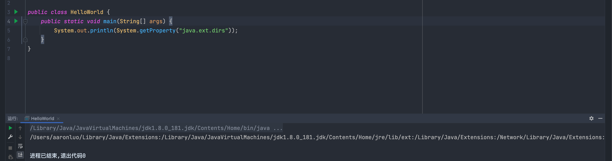

## 简介

ClassLoader就是类加载器，普通的Java开发其实利用得并不多，对于某些开发框架中却非常常见，理解ClassLoader的加载机制，有利于写出高效的代码。ClassLoader的具体作用就是将Class文件加载到JVM中，程序就可以正常运行了。但是JVM启动的时候，并不会一次性加载所有的Class文件，而是需要动态加载

## Class文件

Java程序是运行在虚拟机中，平常使用idea等工具编写的java代码为.java文件，这就是最基础的源码，但是这类文件是无法直接运行的，如下图所示


当在命令行中对java文件进行编译，然后就会生成class文件

```shell
javac HelloWorld.java
```


然后再执行

```shell
java HelloWorld
```


以上代码是一个示例，是入门`Java` 语言时的`Hello World`示例，可以看到class问及哦安是字节码格式文件，`Java`虚拟机并不能直接识别`.java`源文件，所以需要`javac` 将其转换成`.class`文件。另外，如果用`C`或者`Python`编写的程序正确转化成`.class`文件，`java`虚拟机也可以识别运行的

## 环境变量

### JAVA_HOME

指`Jdk` 安装的目录


### PATH

指将·`${JAVA_HOME}/bin`添加到系统`PATH`变量中，这样就可以任意位置调用`java`和`javac`命令，而不是使用绝对路径，或者在`${JAVA_HOME}/bin` 目录（相对路径）下执行`java`或者`javac`命令


### CLASSPATH

指向`jdk`中的`lib`包，可以理解为刚开始学C语言那会儿，需要安装VC++的库，然后就可以直接使用`#include<stdio.h>`这样，只不过C是直接在环境变量里可以直接调用，`jdk`的工具类需要单独引用


## JAVA类加载流程

`Java`自带3个类加载器

- **BootStrapClassLoader** 最顶层的加载类，主要加载核心类库，`${JAVA_HOME}/lib`下的`rt.jar`、`resource.jar`、`charsets.jar`和`class`等。另外需要注意的是可以通过启动`jvm`时指定`-Xbootclasspath`和路径来改变`BootStrap ClassLoader`的加载目录。比如`java -Xbootclasspath/a:path`被指定的文件追加到默认的`bootstrap`路径中
- **ExtentionClassLoader** 扩展的类加载器，加载目录`${JAVA_HOME}/lib/ext`目录下的`jar`包和`class`文件。还可以加载`-D java.ext.dirs`选项指定的目录
- **AppClassLoader** 也被称为**SystyemAppClass** 加载当前应用的`classpath`的所有类

以上3个类加载器，执行顺序如下所示

1. **BootStrap ClassLoader**
2. **Extention ClassLoader**
3. **AppClass Loader**

为了更好的理解，可以查看[源码](https://code.yawk.at/java/8/sun/misc/Launcher.java)，`sun.misc.Launcher`，它是以一个java虚拟机的入口应用

```java
public class Launcher {
    private static Launcher launcher = new Launcher();
    private static String bootClassPath =
        System.getProperty("sun.boot.class.path");

    public static Launcher getLauncher() {
        return launcher;
    }

    private ClassLoader loader;

    public Launcher() {
        // Create the extension class loader
        ClassLoader extcl;
        try {
            extcl = ExtClassLoader.getExtClassLoader();
        } catch (IOException e) {
            throw new InternalError(
                "Could not create extension class loader", e);
        }

        // Now create the class loader to use to launch the application
        try {
            loader = AppClassLoader.getAppClassLoader(extcl);
        } catch (IOException e) {
            throw new InternalError(
                "Could not create application class loader", e);
        }

        //设置AppClassLoader为线程上下文类加载器，这个文章后面部分讲解
        Thread.currentThread().setContextClassLoader(loader);
    }

    /*
     * Returns the class loader used to launch the main application.
     */
    public ClassLoader getClassLoader() {
        return loader;
    }
    /*
     * The class loader used for loading installed extensions.
     */
    static class ExtClassLoader extends URLClassLoader {}

/**
     * The class loader used for loading from java.class.path.
     * runs in a restricted security context.
     */
    static class AppClassLoader extends URLClassLoader {}

```

源码中有简化，但是可以看到

- Launcher 初始化了ExClassLoader 和 AppClassLoader
- Launcher 中并没有看到BootstrapClassLoader，但是通过`System.getProperty("sun.boot.class.path")` 得到了字符串`bootClassPath`，这个就是`BootStrapClassLoader`加载的`jar`包


可以看到在`${JAVA_HOEM}/jre/lib`目录下的`jar`包和`classes`

### ExClassLoader 源码

```java
/*
     * The class loader used for loading installed extensions.
     */
    static class ExtClassLoader extends URLClassLoader {

        static {
            ClassLoader.registerAsParallelCapable();
        }

        /**
         * create an ExtClassLoader. The ExtClassLoader is created
         * within a context that limits which files it can read
         */
        public static ExtClassLoader getExtClassLoader() throws IOException
        {
            final File[] dirs = getExtDirs();

            try {
                // Prior implementations of this doPrivileged() block supplied
                // aa synthesized ACC via a call to the private method
                // ExtClassLoader.getContext().

                return AccessController.doPrivileged(
                    new PrivilegedExceptionAction<ExtClassLoader>() {
                        public ExtClassLoader run() throws IOException {
                            int len = dirs.length;
                            for (int i = 0; i < len; i++) {
                                MetaIndex.registerDirectory(dirs[i]);
                            }
                            return new ExtClassLoader(dirs);
                        }
                    });
            } catch (java.security.PrivilegedActionException e) {
                throw (IOException) e.getException();
            }
        }

        private static File[] getExtDirs() {
            String s = System.getProperty("java.ext.dirs");
            File[] dirs;
            if (s != null) {
                StringTokenizer st =
                    new StringTokenizer(s, File.pathSeparator);
                int count = st.countTokens();
                dirs = new File[count];
                for (int i = 0; i < count; i++) {
                    dirs[i] = new File(st.nextToken());
                }
            } else {
                dirs = new File[0];
            }
            return dirs;
        }
 
......
    }

```

之前的内容可以指定`-D java.ext.dirs`参数来添加和改变ExtClassLoader的加载路径

```java
System.out.println(System.getProperty("java.ext.dirs"));
```



### APPClassLoader 源码

```java
/**
     * The class loader used for loading from java.class.path.
     * runs in a restricted security context.
     */
    static class AppClassLoader extends URLClassLoader {


        public static ClassLoader getAppClassLoader(final ClassLoader extcl)
            throws IOException
        {
            final String s = System.getProperty("java.class.path");
            final File[] path = (s == null) ? new File[0] : getClassPath(s);

     
            return AccessController.doPrivileged(
                new PrivilegedAction<AppClassLoader>() {
                    public AppClassLoader run() {
                    URL[] urls =
                        (s == null) ? new URL[0] : pathToURLs(path);
                    return new AppClassLoader(urls, extcl);
                }
            });
        }

        ......
    }

```

可以看到AppClassLoader加载的就是`java.class.path`的值

```java
System.out.println(System.getProperty("java.class.path"));
```


这个路径其实就是当前`Java`工程的目录，里面存放的是编译生成的`class`文件

> BootStrapClassLoader、ExtClassLoader、AppClassLoader实际就是查询相应的环境属性：`sun.boot.class.path`，`java.ext.dirs`，`java.class.path` 来加载源文件

然后再来探讨加载顺序，使用上例中的`HelloWorld.java`创建一个`ClassLoaderTest.java`文件

```java
// HelloWorld.java
public HelloWorld {}
```

```java
// ClassLoaderTest.java
public class ClassLoaderTest {
    public static void main(String[] args) {
        ClassLoader cl = HelloWorld.class.getClassLoader();
        System.out.println("ClassLoader is " + cl);
    }
}

```

```java
ClassLoader is sun.misc.Launcher$AppClassLoader@7f31245a
```

也就是说明`HelloWorld`就是由`AppClassLoader`加载的，如果是int.class，String.class的加载呢？

```java
// ClassLoaderTest.java

public class ClassLoaderTest {
    public static void main(String[] args) {
        ClassLoader cl = HelloWorld.class.getClassLoader();
        System.out.println("ClassLoader is " + cl.toString());
        cl = int.class.getClassLoader();
        System.out.println("ClassLoader is " + cl.toString());
    }
}

```

运行发现报错

```java
ClassLoader is sun.misc.Launcher$AppClassLoader@7f31245a
Exception in thread "main" java.lang.NullPointerException
	at com.test.ClassLoaderTest.main(ClassLoaderTest.java:8)
```

提示是空指针，因为`int.class` 是由`BootstrapClassLoader`，要想弄明白这些，首先得知道一个前提

### 每一个类加载器都有一个父加载器

每个类加载器都有一个父加载器，比如加载`HelloWorld.class`是由`AppClassLoader`完成，那么`AppClassLoader`也有一个父加载器，怎样获取呢？很简单，通过`getParent`方法

```java
// ClassLoaderTest.java
public class ClassLoaderTest {
    public static void main(String[] args) {
        ClassLoader cl = HelloWorld.class.getClassLoader();
        System.out.println("ClassLoader is " + cl.toString());
        System.out.println("ClassLoader's parent is " + cl.getParent().toString());
    }
}

```

运行结果如下

```java
ClassLoader is sun.misc.Launcher$AppClassLoader@7f31245a
ClassLoader's parent is sun.misc.Launcher$ExtClassLoader@45ee12a7
```

这个就说明`AppClassLoader`的父加载器是`ExtClassLoader`，再看示例

```java
// ClassLoaderTest.java
public class ClassLoaderTest {
    public static void main(String[] args) {
        ClassLoader cl = HelloWorld.class.getClassLoader();
        System.out.println("ClassLoader is " + cl.toString());
        System.out.println("ClassLoader's parent is " + cl.getParent().toString());
        System.out.println("ClassLoader's grandParent is " + cl.getParent().getParent().toString());
    }
}
```

运行结果如下：

```java
ClassLoader is sun.misc.Launcher$AppClassLoader@7f31245a
ClassLoader's parent is sun.misc.Launcher$ExtClassLoader@45ee12a7
Exception in thread "main" java.lang.NullPointerException
	at com.test.ClassLoaderTest.main(ClassLoaderTest.java:8)

进程已结束,退出代码1

```

又是一个空指针异常，这表明ExClassLoader没有父加载器？如果没有为什么标题要写每一个类加载器都有一个父加载器呢？

### 父加载器不是父类

在[源码处](#JAVA类加载流程)可以看到ExtClassLoader和AppClassLoader的代码

```java
static class ExtClassLoader extends URLClassLoader {}
static class AppClassLoader extends URLClassLoader {}
```

可以看见`ExtClassLoader`和`AppClassLoader`都是继承`URLClassLoader`，但是在上一节代码中，为什么调用`AppClassLoader`的`getParent()`代码会得到`ExtClassLoader`的实例呢？我们可以先从`URLCLassLoader`说起


`URLClassLoader`的源码中并没有找到`getParent()` 方法，这个方法在`ClassLoader.java`中

```java
public class Launcher {
    private static URLStreamHandlerFactory factory = new Factory();
    private static Launcher launcher = new Launcher();
    private static String bootClassPath =
            System.getProperty("sun.boot.class.path");

    public static Launcher getLauncher() {
        return launcher;
    }

    private ClassLoader loader;

    public Launcher() {
        // Create the extension class loader
        ClassLoader extcl;
        try {
            extcl = ExtClassLoader.getExtClassLoader();
        } catch (IOException e) {
            throw new InternalError(
                    "Could not create extension class loader", e);
        }

        // Now create the class loader to use to launch the application
        try {
            //将ExtClassLoader对象实例传递进去
            loader = AppClassLoader.getAppClassLoader(extcl);
        } catch (IOException e) {
            throw new InternalError(
                    "Could not create application class loader", e);
        }

        public ClassLoader getClassLoader () {
            return loader;
        }
        static class ExtClassLoader extends URLClassLoader {

            /**
             * create an ExtClassLoader. The ExtClassLoader is created
             * within a context that limits which files it can read
             */
            public static ExtClassLoader getExtClassLoader() throws IOException {
                final File[] dirs = getExtDirs();

                try {
                    // Prior implementations of this doPrivileged() block supplied
                    // aa synthesized ACC via a call to the private method
                    // ExtClassLoader.getContext().

                    return AccessController.doPrivileged(
                            new PrivilegedExceptionAction<ExtClassLoader>() {
                                public ExtClassLoader run() throws IOException {
                                    //ExtClassLoader在这里创建
                                    return new ExtClassLoader(dirs);
                                }
                            });
                } catch (java.security.PrivilegedActionException e) {
                    throw (IOException) e.getException();
                }
            }


            /*
             * Creates a new ExtClassLoader for the specified directories.
             */
            public ExtClassLoader(File[] dirs) throws IOException {
                super(getExtURLs(dirs), null, factory);

            }
        }
    }

```

可以看到`getParent()`方法其实就是返回一个`ClassLoader`对象的`parent`，parent的赋值是在ClassLoader对象的构造方法中，他有两个情况

1. 由外部类创建ClassLoader时直接指定一个ClassLoader为Parent
2. 由getSystemClaassLoader()方法生成，也就是在sun.misc.Launcher通过getClassLoader()获取，也就是AppClassLoader。直白的说，一个ClassLoader创建时如果没有指定parent，那么它的parent默认就是AppClassLoader

我们主要研究的是ExtClassLoader与AppClassLoader的parent的来源，正好它们与Launcher类有关

```java
public class Launcher {
    private static URLStreamHandlerFactory factory = new Factory();
    private static Launcher launcher = new Launcher();
    private static String bootClassPath =
            System.getProperty("sun.boot.class.path");

    public static Launcher getLauncher() {
        return launcher;
    }

    private ClassLoader loader;

    public Launcher() {
        // Create the extension class loader
        ClassLoader extcl;
        try {
            extcl = ExtClassLoader.getExtClassLoader();
        } catch (IOException e) {
            throw new InternalError(
                    "Could not create extension class loader", e);
        }

        // Now create the class loader to use to launch the application
        try {
            //将ExtClassLoader对象实例传递进去
            loader = AppClassLoader.getAppClassLoader(extcl);
        } catch (IOException e) {
            throw new InternalError(
                    "Could not create application class loader", e);
        }

        public ClassLoader getClassLoader () {
            return loader;
        }
        static class ExtClassLoader extends URLClassLoader {

            /**
             * create an ExtClassLoader. The ExtClassLoader is created
             * within a context that limits which files it can read
             */
            public static ExtClassLoader getExtClassLoader() throws IOException {
                final File[] dirs = getExtDirs();

                try {
                    // Prior implementations of this doPrivileged() block supplied
                    // aa synthesized ACC via a call to the private method
                    // ExtClassLoader.getContext().

                    return AccessController.doPrivileged(
                            new PrivilegedExceptionAction<ExtClassLoader>() {
                                public ExtClassLoader run() throws IOException {
                                    //ExtClassLoader在这里创建
                                    return new ExtClassLoader(dirs);
                                }
                            });
                } catch (java.security.PrivilegedActionException e) {
                    throw (IOException) e.getException();
                }
            }


            /*
             * Creates a new ExtClassLoader for the specified directories.
             */
            public ExtClassLoader(File[] dirs) throws IOException {
                super(getExtURLs(dirs), null, factory);

            }
        }
    }


```

可以看到，AppClassLoader的parent是一个ExtClassLoader实例

```java
ClassLoader extcl;
extcl = ExtClassLoader.getExtClassLoader();
loader = AppClassLoader.getAppClassLoader(extcl)
```

ExtClassLoader并没有直接找到对应的parent赋值，它调用了它的父类也就是URLCLassLoader的构造方法并传递了3个参数

```java
public ExtClassLoader(File[] dirs) throws IOException {
    super(getExtURLs(dirs), null, factory);
}
```

```java
public  URLClassLoader(URL[] urls, ClassLoader parent, URLStreamHandlerFactory factory) {
     super(parent);
}
```

在这里可以看到ExtClassLoader的parent为null，但是ExtClassLoader的父加载器为null，但是BootStrapClassLoader却可以当成他的父加载器

> BootStrapClassLoader 是由C/C++编写的，它本身是虚拟机的一部分，所以它并不是Java类，也就是无法在java代码中获取它的引用，JVM启动时是通过BootStrap类加载器加载rt.jar等核心jar包中的class文件，之前的int.class，String.class都是由它加载。在前面我们知道JVM初始化sun.misc.Launcher并创建ExtClassLoader和AppClassLoader实例，并将ExtClassLoader设置为AppClassLoader的父加载器。BootStrap没有父加载器，但是它却可以作用一个ClassLoader的父加载器。比如ExtClassLoader。这也可以解释之前通过ExtClassLoader的getParent方法取为NUll的现象

### 双亲委托

一个类加载器查找class和resource时，是通过“委托模式”进行的，它首先判断这个class是否已经加载成功，如果没有的话，它并不是自己进行查找，而是先通过父加载器，然后递归下去，知道BootStrapClassloader，如果BootStrapClassloader找到了，直接返回，乳沟没有找到，则一级一级返回，最后到达自身去查找这些对象，这种机制就叫做双亲委托

整个流程如下图所示


1. 一个AppClassLoader查找资源时，先看看缓存是否有，缓存有从缓存中获取，否则委托给父加载器。
2. 递归，重复第1部的操作。
3. 如果ExtClassLoader也没有加载过，则由Bootstrap ClassLoader出面，它首先查找缓存，如果没有找到的话，就去找自己的规定的路径下，也就是`sun.mic.boot.class`下面的路径。找到就返回，没有找到，让子加载器自己去找。
4. Bootstrap ClassLoader如果没有查找成功，则ExtClassLoader自己在`java.ext.dirs` 路径中去查找，查找成功就返回，查找不成功，再向下让子加载器找。
5. ExtClassLoader查找不成功，AppClassLoader就自己查找，在`java.class.path`路径下查找。找到就返回。如果没有找到就让子类找，如果没有子类就会抛出各种异常。

### 重要方法

#### loadClass()

JDK文档是这样写的，通过指定的全限定类名加载class，通过同名的loadClass(String,boolean)方法

```java
protected Class<?> loadClass(String name, boolean resolve)
                      throws ClassNotFoundException

```

一般实现这个方法的步骤是

1. 执行`findLoadedClass(String)` 去检测这个class是不是已经加载过了
2. 执行父加载器的loadClass方法。如果父加载器为null，则jvm哪值的加载器去替代，也就是BootStrapClassLoader，这也解释了ExtClassLoader的parent为null，但仍然说BootStrapClassLoader是它的父加载器
3. 如果向上委托父加载器没有加载成功，则通过findClass(String)查找

如果class在前面两步中找到吗参数resolve又是true的话，那么loadClass()又会调用resolveClass(class)这个方法来生成最终的Class对象

```java
protected Class<?> loadClass(String name, boolean resolve)
        throws ClassNotFoundException
    {
        synchronized (getClassLoadingLock(name)) {
            // 首先，检测是否已经加载
            Class<?> c = findLoadedClass(name);
            if (c == null) {
                long t0 = System.nanoTime();
                try {
                    if (parent != null) {
                    	//父加载器不为空则调用父加载器的loadClass
                        c = parent.loadClass(name, false);
                    } else {
                    	//父加载器为空则调用Bootstrap Classloader
                        c = findBootstrapClassOrNull(name);
                    }
                } catch (ClassNotFoundException e) {
                    // ClassNotFoundException thrown if class not found
                    // from the non-null parent class loader
                }

                if (c == null) {
                    // If still not found, then invoke findClass in order
                    // to find the class.
                    long t1 = System.nanoTime();
                    //父加载器没有找到，则调用findclass
                    c = findClass(name);

                    // this is the defining class loader; record the stats
                    sun.misc.PerfCounter.getParentDelegationTime().addTime(t1 - t0);
                    sun.misc.PerfCounter.getFindClassTime().addElapsedTimeFrom(t1);
                    sun.misc.PerfCounter.getFindClasses().increment();
                }
            }
            if (resolve) {
            	//调用resolveClass()
                resolveClass(c);
            }
            return c;
        }
    }

```

代码解释了双亲委托

另外，要注意的是如果要编写一个classLoader的子类，也就是定义一个classloader，建议覆盖`findClass()`方法，而不要直接修改`loadClass()`方法

```java
if (parent != null) {
	//父加载器不为空则调用父加载器的loadClass
    c = parent.loadClass(name, false);
} else {
	//父加载器为空则调用Bootstrap Classloader
    c = findBootstrapClassOrNull(name);
}
```

前面说过ExtClassLoader的parent为null，所以它向上委托时，系统会为它指定Bootstrap ClassLoader。

## 自定义ClassLoader

不管是BootStrapClassLoader还是ExtClassLoader，这些类加载器都只是加载指定目录下的jar包或者资源。那如果需要动态加载一些资源呢？

### 自定义步骤

1. 编写一个类继承ClassLoader类
2. 复写他的findClass() 方法
3. 在findClass()方法中调用defineClass()

### defineClass()

这个方法在编写自定义classloader的时候非常重要，他能将class二进制内容转换成Class对象，如果不符合要求则会抛出各种异常

> 一个ClassLoader创建时如果没有指定parent，那么他的parent默认就是AppClassloader

上面说的是，如果自定义一个ClassLoader，默认的parent父加载器是AppClassLoader，因为这样就能够保证它能访问系统内置加载器加载成功的class文件。

### 示例

假设我们需要一个自定义的classloader，默认路径为`~/Desktop/lib`下的jar包和资源

首先编写一个测试类`Test.java`

```java
package com.test;
public class Test{
    public void say(){
        System.out.println("Say Hello");
    }
}
```

然后将其编译成class文件 `Test.class`放到`~/Desktop/lib`目录下

```java
package com.test;

import java.io.*;

public class ClassLoaderTest extends ClassLoader {
    private String mLibPath;

    public ClassLoaderTest(String path) {
        this.mLibPath = path;
    }

    protected Class<?> findClass(String name) throws ClassNotFoundException {
        String filename = getFileName(name);
        File file = new File(mLibPath, filename);
        try {
            FileInputStream fileInputStream = new FileInputStream(file);
            ByteArrayOutputStream byteArrayOutputStream = new ByteArrayOutputStream();
            int len = 0;
            try {
                while ((len = fileInputStream.read()) != -1) {
                    byteArrayOutputStream.write(len);
                }
            } catch (IOException e) {
                e.printStackTrace();
            }
            byte[] bytes = byteArrayOutputStream.toByteArray();
            fileInputStream.close();
            byteArrayOutputStream.close();

            return defineClass(name, bytes, 0, bytes.length);
        } catch (IOException e) {
            e.printStackTrace();
        }
        return super.findClass(name);
    }

    private String getFileName(String name) {
        int index = name.lastIndexOf('.');
        if (index == -1) {
            return name + ".class";
        } else {
            return name.substring(index + 1) + ".class";
        }

    }
}

```

我们在`findClass()`方法中定义了查找class的方法，然后数据通过`defineClass()`生成了Class对象。

### 测试

现在编写测试代码。我们知道如果调用一个Test对象的say方法，它会输出"Say Hello"这条字符串。但现在是我们把Test.class放置在应用工程所有的目录之外，我们需要加载它，然后执行它的方法。

```java
package com.test;

import java.lang.reflect.InvocationTargetException;
import java.lang.reflect.Method;

public class Main {
    public static void main(String[] args) {
        ClassLoaderTest classLoaderTest = new ClassLoaderTest("~/Desktop/lib");
        try {
            Class c = classLoaderTest.loadClass("com.test.Test");
            if (c != null) {
                Object object = c.newInstance();
                Method method = c.getDeclaredMethod("say",null);
                method.invoke(object,null);
            }
        } catch (ClassNotFoundException | NoSuchMethodException | InstantiationException | IllegalAccessException e) {
            e.printStackTrace();
        } catch (InvocationTargetException e) {
            throw new RuntimeException(e);
        }
    }
}

```

执行之后，可以看到，在`~/Desktop/lib/Test.class`被加载了


突破了JDK系统内置加载路径的限制之后，我们就可以编写自定义ClassLoader，然后剩下的就叫给开发者你自己了。你可以按照自己的意愿进行业务的定制，将ClassLoader玩出花样来。

## 总结

1. ClassLoader是用来加载class文件的
2. 系统内置的ClassLoader通过双亲委托来加载指定路径下的class和资源
3. 可以自定义ClassLoader一般覆盖findClass方法
4. ContextClassLoader与线程相关，可以获取设置，可以绕过双亲委托机制

## 参考

https://blog.csdn.net/briblue/article/details/54973413
