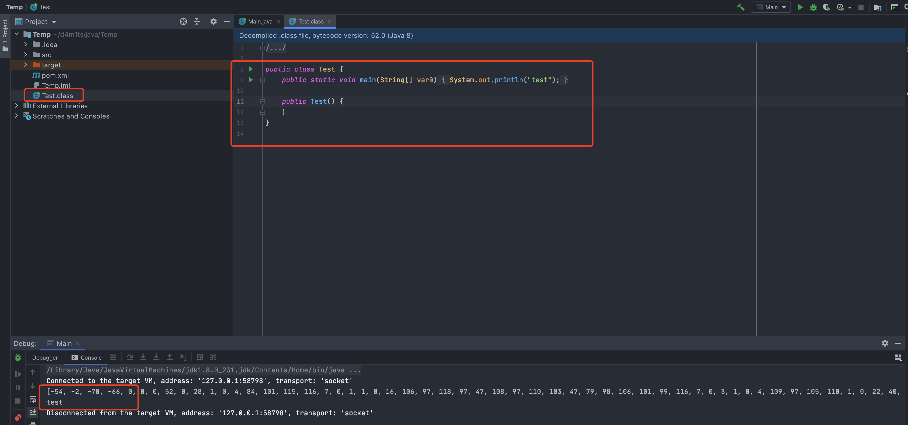

## 介绍
**`javassist` 是一个开源的分析、编辑和创建Java字节码的类库，通过javassist提供的API可以在java程序运行时编辑一个类的字节码信息，改变该类的结构信息。**说简单点，就是一个用来处理Java字节码的类库。
除了Javassist，常见的字节码编程工具有`ASM`和`byte-buddy`，这两个工具相对来说更加偏向于底层，需要了解关于jvm的指令；使用`javassist`可以不需要了解jvm指令，只需使用javassist类库提供的API接口就可以实现字节码编程。

## 使用
### 常用类
javassist字节码编程常用的类：

- `ClassPool`：ClassPool 类可以控制的类的字节码，例如创建一个类或加载一个类，与JVM类装载器类似；它是基于哈希表（`Hashtable`）实现的`CtClass`对象容器，其中键名是类名称，值是表示该类的`CtClass`对象（`Hashtable`和`Hashmap`类似都是实现map接口，hashmap可以接收null的值，但是Hashtable不行）。
```java
public static synchronized ClassPool getDefault() // 返回默认的类池对象。
public ClassPath insertClassPath(String pathname) // 在搜索路径的开头插入目录或jar（或zip）文件。
public ClassPath insertClassPath(ClassPath cp) // ClassPath在搜索路径的开头插入一个对象。
public ClassLoader getClassLoader() // 获取类加载器toClass()，getAnnotations()在 CtClass等
public CtClass get(String classname) // 从源中读取类文件，并返回对CtClass 表示该类文件的对象的引用。
public ClassPath appendClassPath(ClassPath cp) // 将ClassPath对象附加到搜索路径的末尾。
public CtClass makeClass(String classname) // 创建一个新的public类
```

- `CtClass`： CtClass表示编译时的一个类，它提供了类的操作，如在类中动态添加新字段、方法和构造函数、以及改变类、父类和接口的方法
```java
public void setSuperclass(CtClass clazz) // 更改超类，除非此对象表示接口。
public Class<?> toClass(Lookup lookup) // 将此类转换为java.lang.Class对象。
public byte[] toBytecode() // 将该类转换为字节码数组。
public void writeFile() // 将由此CtClass对象表示的类文件写入当前目录。
public void writeFile(String directoryName) // 将由此CtClass 对象表示的类文件写入本地磁盘。
public CtConstructor makeClassInitializer() // 制作一个空的类初始化程序（静态构造函数）。
```

- `CtMethod`：表示类中的方法，通过它可以给类创建新的方法，还可以修改返回类型，访问修饰符等，甚至还可以修改方法体内容代码
- `CtField`：类的属性，通过它可以给类创建新的属性，还可以修改已有的属性的类型，访问修饰符等
- `CtConstructor`：用于访问类的构造，与CtMethod类的作用类似
```java
public void setBody(String src) // 设置构造函数主体
public void setBody(CtConstructor src, ClassMap map) // 从另一个构造函数复制一个构造函数主体。
public CtMethod toMethod(String name, CtClass declaring, ClassMap map) // 复制此构造函数并将其转换为方法
```

- `ClassClassPath`：该类作用是用于通过`getResourceAsStream()`在`java.lang.Class`中获取类文件的搜索路径。
```java
public ClassClassPath(Class<?> c) // 构造函数，创建一个搜索路径
public URL find(String classname) // 获取指定类文件的URL
public InputStream openClassfile(String classname) // 通过getResourceAsStream()获取类
```
### 依赖
```xml
<!-- https://mvnrepository.com/artifact/org.javassist/javassist -->
<dependency>
    <groupId>org.javassist</groupId>
    <artifactId>javassist</artifactId>
    <version>3.28.0-GA</version>
</dependency>
```
### 举例

- 创建对象Test，并创建`public static void main( String[] )`方法，最后反射调用
```java
import javassist.*;
import java.io.IOException;
import java.lang.reflect.InvocationTargetException;
import java.util.Arrays;
public class Main {
    public static void main(String[] args) throws NotFoundException, CannotCompileException, IOException, IllegalAccessException, InstantiationException, NoSuchMethodException, InvocationTargetException {
        //创建classPool类池对象
        ClassPool classPool = ClassPool.getDefault();
        // 通过classPool创建一个新的类Test
        CtClass test = classPool.makeClass("Test");
        // 创建 void main() 方法，（方法的返回值类型你，方法名，方法的参数类型，方法所属的类）
        CtMethod mainMethod = new CtMethod(CtClass.voidType, "main", new CtClass[]{classPool.get(String[].class.getName())}, test);
        // 设置main方法的访问修饰符 public static
        mainMethod.setModifiers(Modifier.PUBLIC + Modifier.STATIC);
        // 设置方法内容
        mainMethod.setBody("System.out.println(\"test\");");
        // 添加方法
        test.addMethod(mainMethod);
        // 写入当前目录，运行后会在当前项目的根目录生成 Test.class 文件
        test.writeFile();
        // 讲test转换为字节码数组输出
        System.out.println(Arrays.toString(test.toBytecode()));
        // 生成Class对象，反射调用main方法
        Class<?> aClass = test.toClass();
        Object o = aClass.newInstance();
        aClass.getDeclaredMethod("main", String[].class).invoke(o, new String[1]);
    }
}
```



- 创建构造函数，和刚才的差不多，微改即可
```java
import javassist.*;
import java.io.IOException;
import java.lang.reflect.InvocationTargetException;
public class Main {
    public static void main(String[] args) throws NotFoundException, CannotCompileException, IOException, IllegalAccessException, InstantiationException, NoSuchMethodException, InvocationTargetException {
        //创建classPool类池对象
        ClassPool classPool = ClassPool.getDefault();
        // 通过classPool创建一个新的类Test
        CtClass test = classPool.makeClass("Test");
        // 创建构造函数
        CtConstructor constructor = new CtConstructor(null, test);
        // 设置main方法的访问修饰符 public
        constructor.setModifiers(Modifier.PUBLIC);
        // 设置方法内容
        constructor.setBody("System.out.println(\"test\");");
        // 添加方法
        test.addConstructor(constructor);
        // 写入当前目录，运行后会在当前项目的根目录生成 Test.class 文件
        test.writeFile();
        // 生成Class对象，然后生成实例
        Class<?> aClass = test.toClass();
        Object o = aClass.newInstance();
    }
}
```
## 参考

- [10-java安全基础——javassist字节码编程](https://blog.csdn.net/qq_35733751/article/details/118944928)
- [Java安全之Javassist动态编程](8f831bce04e38effa474cc846ef19078)
