## 前言
代码审计过程中肯定是需要下断点让程序暂停进行分析的，所以很重要！！！
**调试技能重要性甚⾄超过学习⼀门语⾔**

> 本文主要是针对IDEA进行断点调试，IDEA YYDS

在调试代码的时候，你的项目得debug模式启动，也就是点那个绿色的甲虫启动服务器，然后，就可以在代码里面断点调试啦。
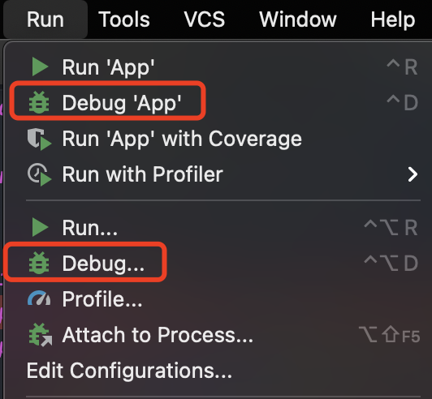

## 控制面板
> 参考[https://blog.csdn.net/f641385712/article/details/93145454](https://blog.csdn.net/f641385712/article/details/93145454)
> 大多数说明图片就直接Copy过来的，不足点再添加补充说明

进入断点管理界面
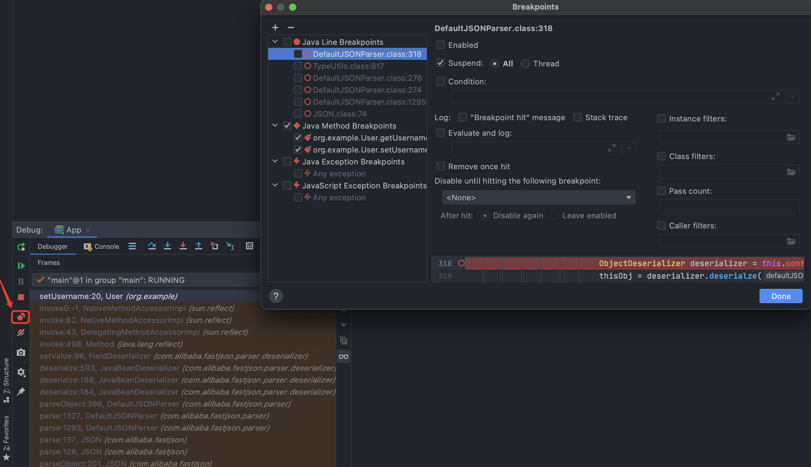
说明
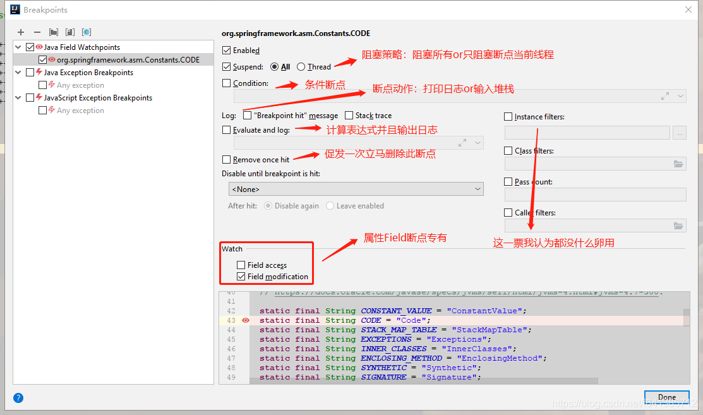
## 断点
### 什么是断点
断点你可能天天都在使用，但是若真要你对它下定义，估计一时间还有点懵逼呢有木有？
`断点`：是一种**附加在源代码上面**的特殊标记，**在**`**调试模式(debug模式)**`**下可以触发**`**特定的动作**`，比如打印线程调用栈信息、计算值、打印指定表达式的值等等。
> Tips：断点一但设置就会一直保存在工程中直到手动删除~

### 断点参数（断点属性）
断点并不是仅仅是孤立的存在的，它也可以通过`参数`进行定制化，这些叫`断点参数`。
**不同类型的断点支持的断点参数也不尽相同**，在下面具体介绍时会详细说明~
### 断点的种类
据我粗略调查，`80%`的小伙伴打断点只会采用**代码行左边鼠标单击**这种最基础的方式打断点然后调试。其实在现实场景中，有非常非常多的情况下，这种方式将很难`快速定位`到问题所在，因此了解断点分类、调试技巧就显得有点必须了
殊不知，`IDEA`给我们提供了丰富的断点类型，让我们能够在不同的调试场景下，使用不同的断点类型来**大大提高**我们的调试效率，毕竟`效率就是时间`，而`时间就是生命`。
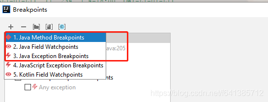
从idea断点对话框里也能够看出断点是分类的。然后下面我对断点的分类讲解不是完全按此分类，我的分类会更加详细如下：

1. `Line breakpoint（行断点）`：在指定代码行设置断点，属于行级别的断点
2. `Temporary line breakpoint（临时行断点）`：与行断点类似，不同之处在于该类型的断点在被激活之后会被立即删除
3. `Field watchpoint（属性断点）`：`读取`或者`修改`属性时会激活属性断点
4. `Method breakpoint（方法断点）`：它是标记在方法那一行的断点，有自己特有的属性参数
5. `Exception breakpoint（异常断点）`：当程序抛出指定异常时会激活异常断点。与行断点不同，异常断点不需要与源代码映射（不需要打在具体某一行代码上），因为**异常断点应用程序级别的**
#### `Line breakpoint（行断点）`
这是使用得**最为广泛**的一种断点。示例操作“视频“：
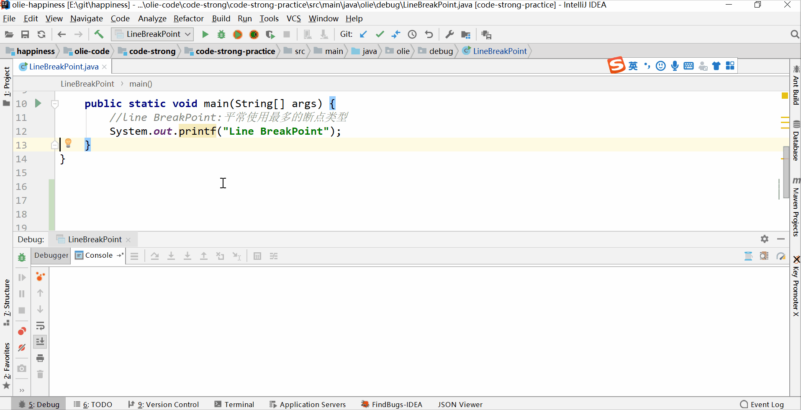
**断点参数**
作为第一个介绍的断点类型，这里有必要全面的解释一下上面行断点操作的断点参数：

- `Suspend`：有没有让你诧异到，它竟然是个复选框并且还**可以不被选中**。若它不被选中的话断点的相关动作**依然激活执行**，只是线程不会被组塞了而已。它的两种阻塞策略如下：
   - `All`：阻塞该程序内**所有线程**（默认）
   - `Thread`：只阻塞当前断点所在线程（在多线程调试、远程调试中**强烈建议**使用这种方式）
- `Condition`：这就是所谓的条件断点，只有书写的表达式返回true时候断点才会被激活
- `Log`：
   - 勾选"Breakpoint hit message"：断点激活时输出提示日志
   - 勾选"Stack trace"：断点激活时输出程序调用栈信息
   - 勾选"Evaluate and log"：并在下面的输入框中输入"args"，断点激活时会计算并输出变量 args 的值
   - 可以同时选中
#### `Temporary line breakpoint（临时行断点）`
创建方法不说了，同上。和上面的唯一区别是：把`Remove once hit`这个复选框给勾选上（此类型断点其实使用较少）。
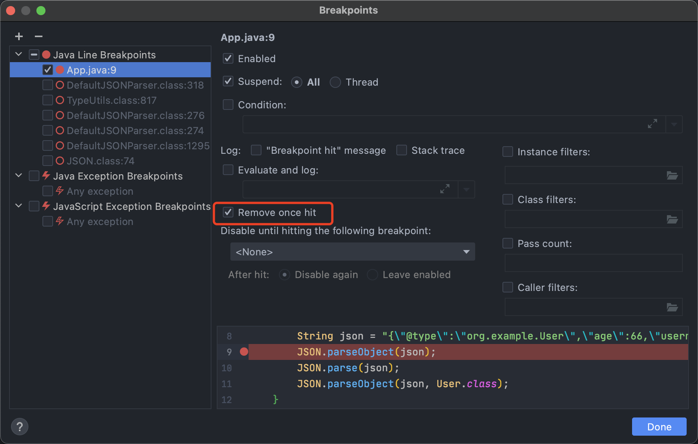
#### `Field watchpoint（属性断点）`
创建的方式和上无差异。（目前发现是针对的类中定义的变量）
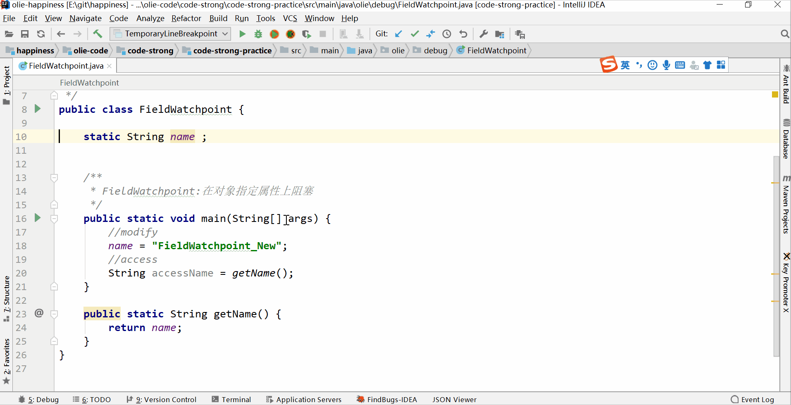
**断点参数**
由于绝大多数参数第一个已经讲述了，so这里只剩一个它**独有的**参数：

- `Watch`：选中"Filed Access" 读取的时候都会断住。选中"Filed madification"表示修改的时候都会断住
#### `Method breakpoint（方法断点）`
打断点方式同上，只是它是**必须把断点打在方法那一行上**。
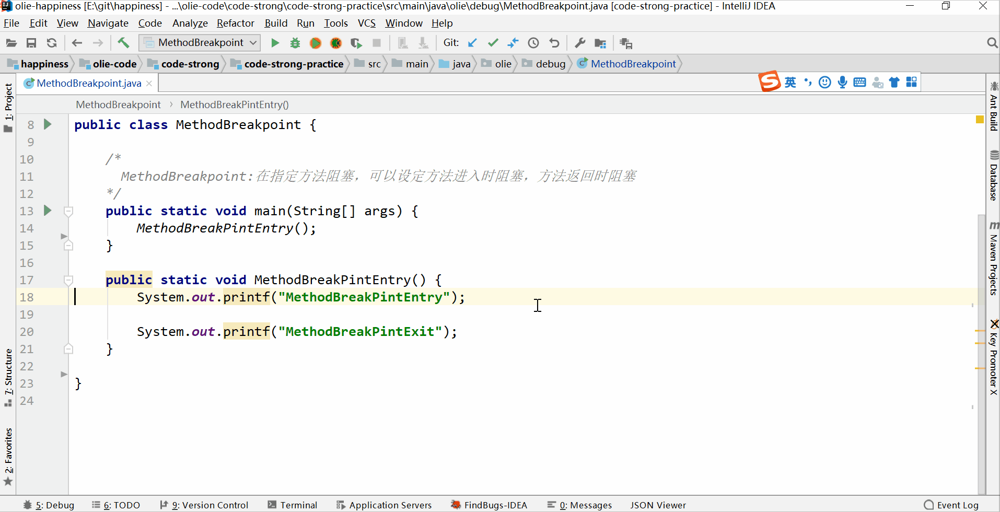
它也有一个自己**独有的**参数：

- `Watch`：
- “Method entry”：进入方法时激活断点
- “Method exit”：出去方法时激活断点
- “Emulated”：目前发现没啥卵用（求小伙伴不要喷我~）
#### `Exception breakpoint（异常断点）`
异常断点属于非常特殊的一种断点类型，`它不对应任何一行代码`，因为它属于**程序级别的断点**。
它不能像上面在代码处直接创建，只能通过上面的断点对话框来创建。
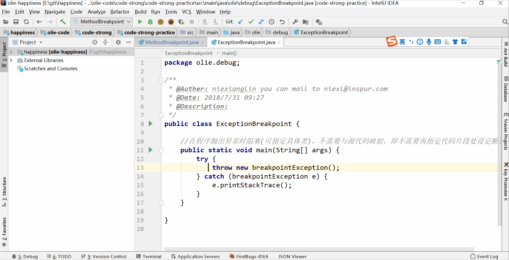
此处注意：异常断点中很多选项就是不能使用的（灰色）如下图示：
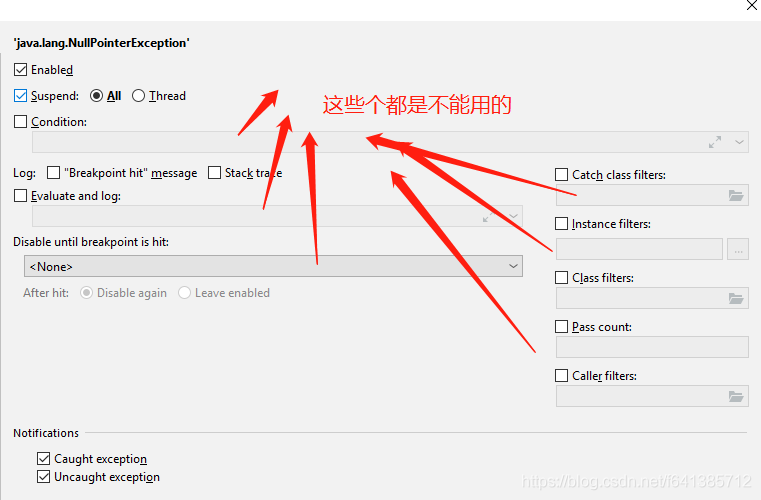
**断点参数**
但是同理，它也提供一个特有的断点参数：

- `Notification`：
- “Catch excetion”：程序在捕获（Try Catch）这个异常时激活断点
- “Uncatch excetion”：不catch捕获异常时激活断点

**小细节**：对于不同类型的断点，打桩后我们看到的**图标**也是有差异的，如图：
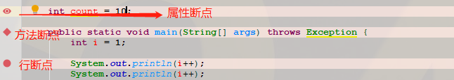
### 条件断点
就是断点在满足条件的时候才会阻塞，不过一般也只能书写一些较简单的判定
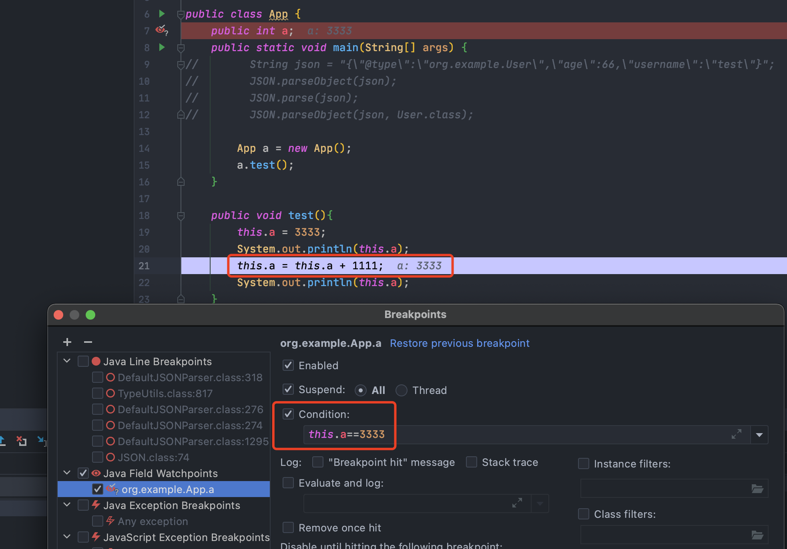
