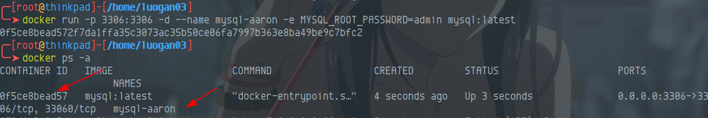
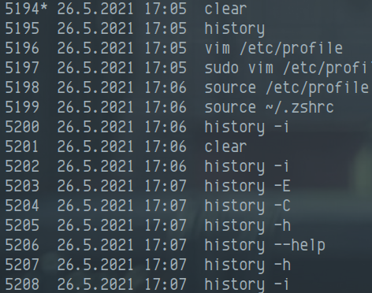
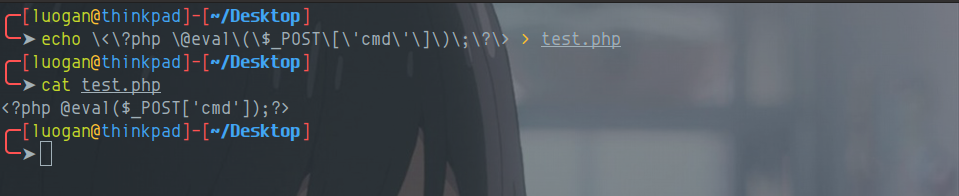
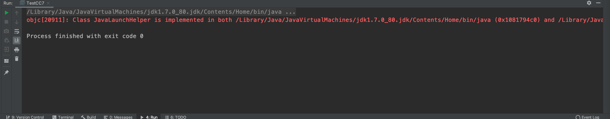
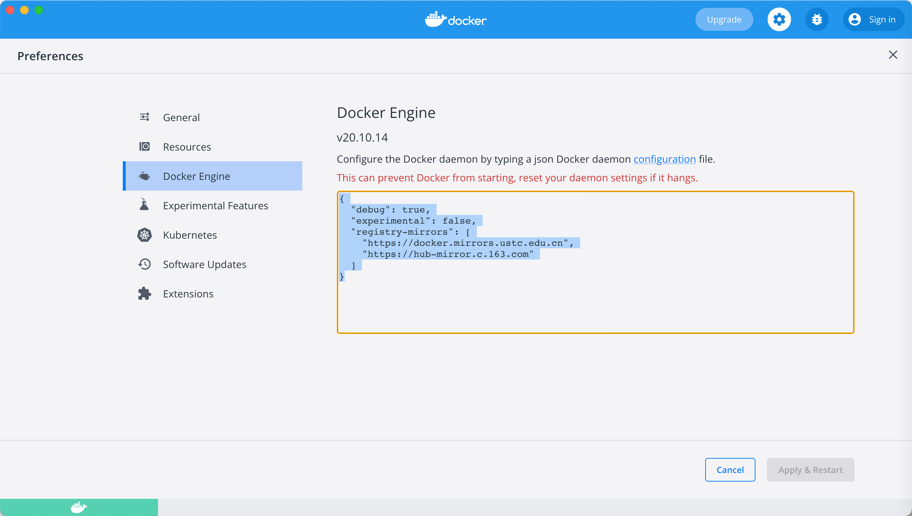

### CentOS 7 编译安装nginx，如何将其加入到服务（nginx.service）？
```shell
# 默认编译安装到/usr/local/nginx
# 在 /usr/lib/systemd/system/目录下创建服务
cd /usr/lib/systemd/system/
touch nginx.service
vim nginx.service
# 添加如下内容
[Unit]
Description=nginx - high performance web server
Documentation=http://nginx.org/en/docs/
After=network.target remote-fs.target nss-lookup.target
  
[Service]
Type=forking
PIDFile=/usr/local/nginx/logs/nginx.pid
ExecStartPre=/usr/local/nginx/sbin/nginx -t -c /usr/local/nginx/conf/nginx.conf
ExecStart=/usr/local/nginx/sbin/nginx -c /usr/local/nginx/conf/nginx.conf
ExecReload=/bin/kill -s HUP $MAINPID
ExecStop=/bin/kill -s QUIT $MAINPID
PrivateTmp=true
  
[Install]
WantedBy=multi-user.target
```
### Linux 写入/usr/lib/systemd/system/xxx.service 不生效解决办法
```shell
systemctl daemon-reload
```
### nginx 如何配置Basic认证？
配置nginx，新增server节点
针对es 配置 nginx basic 认证

```
server {
        listen          9201;
        server_name     elasticSearch;
        location / {
            proxy_pass  http://127.0.0.1:9200/;
            auth_basic  "nginx basic http for es";
            auth_basic_user_file conf.d/passwd;
            autoindex   on;
        }
}
```

再使用 openssl 或者htpasswd 生成密码文件(推荐使用openssl，系统自带，htpasswd可自行查询)，格式如下：
此处conf.d/passwd 是在/usr/local/nginx/conf/conf.d/passwd

```shell
# openssl（默认自带）
printf "your_username:$(openssl passwd -crypt your_password)\n" >> conf.d/passwd
```

生成密码之后，使用如下命令检查配置文件是否正确

```shell
nginx -t
```

重启nginx

### docker Cannot connect to the Docker daemon at unix:///var/run/docker.sock. Is the docker daemon running?
#### 背景
由于尝试做docker api 未授权rce 漏洞，将docker.service 中的ExecStart 修改成了对外开放2375端口，最后测试完毕之后，将注释去掉之后，`systemctl daemon-reload` 之后启动成功之后，报错如下:

```
Cannot connect to the Docker daemon at unix:///var/run/docker.sock. Is the docker daemon running?
```

且查看 `systemctl status docker` ，发现目标为`active:running`，且无/var/run/docker.sock文件
#### 解决办法
将fd:// 更改为 unix://，然后重新加载`systemctl daemon-reload`，`systemctl restart docker`


### Docker启动镜像
在docker 中 要找一个新的镜像，我们首先要查看需要下载的镜像,这里以mysql举例
```shell
docker search mysql
```


```shell
docker pull mysql
```

拉取完成之后，查看所有的镜像

```shell
docker images -a
```

#### 启动镜像
```shell
docker run -p 本机映射端口:镜像映射端口 -d --name 启动镜像名称 -e 镜像启动参数 镜像名称:版本
# -p 本机端口和容器端口映射
# -d 后台运行
# --name 容器名称
# -e 镜像启动参数
```
例：https://hub.docker.com/_/mysql
```shell
docker run --name some-mysql -e MYSQL_ROOT_PASSWORD=my-secret-pw -d mysql:tag
```
查看相关参数从hub.docker.com 中寻找，或者网传使用`runlike`
```shell
docker run -p 3306:3306 -d --name mysql-aaron -e MYSQL_ROOT_PASSWORD=admin mysql:latest
```
运行完之后就可以看到容器已经启动


### Docker清除缓存
```shell
docker system prune --volumes
```
### umount devices is busy？
NFS未授权挂载经常会出现此类问题
原因：因为有多个进程在使用，所以无法取消挂载，当将所有的进程kill掉之后，再umount即可
使用fuser命令罗列出pid
```shell
fuser -v -m <mount_dir>
```
-v 表示 verbose 模式。进程以 ps 的方式显示，包括 PID、USER、COMMAND、ACCESS 字段
-m 表示指定文件所在的文件系统或者块设备（处于 mount 状态）。所有访问该文件系统的进程都被列出。
### linux history添加执行的时间
#### bash shell
编辑/etc/profile
在最下方添加
```shell
HISTTIMEFORMAT="%Y-%m-%d %H:%M:%S"
```
保存后退出，执行
```shell

source /etc/profile
```
效果如下

zsh 不需要配置，只需要执行

```shell
# 标准日期
history -i
# 英文日期
history -E
```

### 登录shell，执行命令使其不保存至history？
```shell
set +o history
```


### 如何查看文件md5，sha1，sha256等（主要是windows）
#### Linux 
在linux中，查看文件md5，sha1，sha256等等都很简单，只需要键入命令
```shell
md5sum output       
b5cd11c42c9031cad6515ff62f4e03ac  output
sha1sum output  
6c2c76a15c272db2b582e8f7d47c1f64b9b2f32c  output
sha256sum output
a4ed89f176e5200ebe571631bd2fdb0d6e18a9ce7b5d78eb69b4a3abd538898b  output
```
#### windows
```shell
certutil -hashfile <filename> MD5
certutil -hashfile <filename> SHA1
certutil -hashfile <filename> SHA256
```
### windows 新建删除服务
常常用作后门
#### 删除服务
```shell
sc delete 服务名称
```
#### 新建服务
```shell
sc create monitor binpath= "可执行文件exe绝对路径 --service -r 可执行文件根路径" displayname= "监控文件夹" start= auto
# sc create monitor binpath= "D:\Software\OtherTool\MonitorFolder.exe --service -r D:\Software\OtherTool" displayname= "监控文件夹" start= auto
```
### Linux 安装pip2,pip3
```shell
// pip2
wget https://bootstrap.pypa.io/pip/2.7/get-pip.py
python2 get-pip.py

// pip3
wget https://bootstrap.pypa.io/get-pip.py
# 如果这里报错 ModuleNotFoundError: No module named 'distutils.util'
# 执行如命令
apt install -f 
apt-get install python3-distutils
python3 get-pip.py
```
### Linux 更新pip2 pip3
```shell
python2 -m pip install --upgrade pip
python3 -m pip install --upgrade pip
```
### Linux 启动IDEA 报错 Error opening zip file or JAR manifest missing : /home/luogan/.jetbrains/jetbrains-agent-v3.2.0.de72.619 Error occurred during initialization of VM
#### 背景
重装了idea，之前使用激活工具激活
```shell
find / -name "*vmoptions*"
```

删除`/home/${User}/.IntelliJIdea2019.3/`即可
### Linux 配置开机自动挂载硬盘
#### 背景
由于公司新发的thinkpad是SSD + HD ，我将操作系统装在了固态硬盘上，但是固态硬盘只有128G，HD却有500G，所以我只有格式化硬盘，将其挂载到我的硬盘上，具体如下所示
首先我们知道Linux是文件系统，硬盘也不例外，硬盘的标识是在/dev/sda[0-6](我没记错的话)
```shell
sudo fdisk -l
```

可以看到我这里的硬盘是/dev/sda1，那么我将其挂载上的命令如下
```shell
sudo mount /dev/sda1 /my_HD
mount | grep my_HD
```

```shell
df -h
```

手动挂载虽然也行，但是毕竟不是服务器，不会不关机，那么就需要开机自动挂载硬盘
#### 自动挂载
使用blkid命令查看磁盘uuid
```shell
sudo blkid
```

可以看到/dev/sda1就是我的硬盘，Type是ext4，需要关注一下Type，linux 分区一般为 ext4，windows 分区一般为 ntfs
编辑/etc/fstab，将分区信息写入 /etc/fstab 文件启动自动挂载
```shell
sudo vim /etc/fstab
```

```shell
UUID=744c071c-5e78-4dab-9d4c-cac5ea8e975d       /my_HD  ext4    defaults        0       1
```
```
注：<fs spec> <fs file> <fs vfstype> <fs mntops> <fs freq> <fs passno>
<fs spec>：分区定位，可以给UUID或LABEL，例如：UUID=6E9ADAC29ADA85CD或LABEL=software
<fs file>：具体挂载点的位置，例如：/data<fs vfstype>：挂载磁盘类型,linux 分区一般为 ext4，windows 分区一般为 ntfs
<fs mntops>：挂载参数，一般为defaults
<fs freq>：磁盘检查，默认为0
<fs passno>：磁盘检查，默认为0，不需要检查

第一个叫fs_freq,用来决定哪一个文件系统需要执行dump操作，0就是不需要；
第二个叫fs_passno,是系统重启时fsck程序检测磁盘的顺序号 1 是root文件系统，2 是别的文件系统。fsck按序号检测磁盘，0表示该文件系统不被检测 dump 执行ext2的文件系统的备份操作 fsck 检测和修复文件系统
```
修改完成之后，执行
```shell
sudo mount -a
```
### rpm 包与 deb包相互转换
```shell
sudo apt intall alien
sudo alien XMind-for-Linux-x86-64bit-11.0.1-202106220606.rpm
```

### Linux 执行命令时错误返回在shell时，如何将其去掉？
一般正常情况下，shell会将所有的信息返回回来，如果此时需要去除错误，只需要执行成功的信息，只需要将错误重定向到某个文件即可，我在[DNS隧道反弹shell](https://www.yuque.com/da-labs/secnotes/vafztf#cAPa3)总结过，其中xxx 表示执行的代码，2表示错误
```
xxx 2 > error
```
### windows 和 Linux shell的转义符
写一个一句话
```shell
# windows
echo ^<?php @eval(^$_POST['cmd']); ?^> > test.php
# Linux
echo "<?php @eval(\$_POST['cmd']);?>" > test.php
echo \<\?php \@eval\(\$_POST\[\'cmd\'\]\)\;\?\> > test.php
```





### windows、Linux 在终端中如何设置临时代理
临时代理设置如下
#### windows
cmd shell
```shell
set http_proxy=127.0.0.1:10809
set https_proxy=127.0.0.1:10809
```
powershell
```powershell
$env:HTTP_PROXY="127.0.0.1:10809"
$env:HTTPS_PROXY="127.0.0.1:10809"
```
#### Linux
```shell
export http_proxy=127.0.0.1:10809
export https_proxy=127.0.0.1:10809
```
### Linux 更新系统字体
首先下载tff文件
然后执行如下命令
```shell
sudo mkdir /usr/share/fonts/msyh
sudo cp *.ttf /usr/share/fonts/msyh/
sudo fc-cache -fv

```
### JDK1.7 在macos版本的idea 运行警告
```
/Library/Java/JavaVirtualMachines/jdk1.7.0_80.jdk/Contents/Home/bin/java "-javaagent:/Applications/IntelliJ IDEA.app/Contents/lib/idea_rt.jar=63173:/Applications/IntelliJ IDEA.app/Contents/bin" -Dfile.encoding=UTF-8 -classpath /Library/Java/JavaVirtualMachines/jdk1.7.0_80.jdk/Contents/Home/jre/lib/charsets.jar:/Library/Java/JavaVirtualMachines/jdk1.7.0_80.jdk/Contents/Home/jre/lib/deploy.jar:/Library/Java/JavaVirtualMachines/jdk1.7.0_80.jdk/Contents/Home/jre/lib/ext/dnsns.jar:/Library/Java/JavaVirtualMachines/jdk1.7.0_80.jdk/Contents/Home/jre/lib/ext/localedata.jar:/Library/Java/JavaVirtualMachines/jdk1.7.0_80.jdk/Contents/Home/jre/lib/ext/sunec.jar:/Library/Java/JavaVirtualMachines/jdk1.7.0_80.jdk/Contents/Home/jre/lib/ext/sunjce_provider.jar:/Library/Java/JavaVirtualMachines/jdk1.7.0_80.jdk/Contents/Home/jre/lib/ext/sunpkcs11.jar:/Library/Java/JavaVirtualMachines/jdk1.7.0_80.jdk/Contents/Home/jre/lib/ext/zipfs.jar:/Library/Java/JavaVirtualMachines/jdk1.7.0_80.jdk/Contents/Home/jre/lib/htmlconverter.jar:/Library/Java/JavaVirtualMachines/jdk1.7.0_80.jdk/Contents/Home/jre/lib/javaws.jar:/Library/Java/JavaVirtualMachines/jdk1.7.0_80.jdk/Contents/Home/jre/lib/jce.jar:/Library/Java/JavaVirtualMachines/jdk1.7.0_80.jdk/Contents/Home/jre/lib/jfr.jar:/Library/Java/JavaVirtualMachines/jdk1.7.0_80.jdk/Contents/Home/jre/lib/jfxrt.jar:/Library/Java/JavaVirtualMachines/jdk1.7.0_80.jdk/Contents/Home/jre/lib/jsse.jar:/Library/Java/JavaVirtualMachines/jdk1.7.0_80.jdk/Contents/Home/jre/lib/management-agent.jar:/Library/Java/JavaVirtualMachines/jdk1.7.0_80.jdk/Contents/Home/jre/lib/plugin.jar:/Library/Java/JavaVirtualMachines/jdk1.7.0_80.jdk/Contents/Home/jre/lib/resources.jar:/Library/Java/JavaVirtualMachines/jdk1.7.0_80.jdk/Contents/Home/jre/lib/rt.jar:/Library/Java/JavaVirtualMachines/jdk1.7.0_80.jdk/Contents/Home/lib/ant-javafx.jar:/Library/Java/JavaVirtualMachines/jdk1.7.0_80.jdk/Contents/Home/lib/dt.jar:/Library/Java/JavaVirtualMachines/jdk1.7.0_80.jdk/Contents/Home/lib/javafx-doclet.jar:/Library/Java/JavaVirtualMachines/jdk1.7.0_80.jdk/Contents/Home/lib/javafx-mx.jar:/Library/Java/JavaVirtualMachines/jdk1.7.0_80.jdk/Contents/Home/lib/jconsole.jar:/Library/Java/JavaVirtualMachines/jdk1.7.0_80.jdk/Contents/Home/lib/sa-jdi.jar:/Library/Java/JavaVirtualMachines/jdk1.7.0_80.jdk/Contents/Home/lib/tools.jar:/Users/aaronluo/Documents/CodeReview/JavaCode/Project/target/classes:/Users/aaronluo/.m2/repository/org/javassist/javassist/3.19.0-GA/javassist-3.19.0-GA.jar:/Users/aaronluo/Documents/CodeReview/JavaCode/commons-collections-3.1/commons-collections-3.1.jar:/Users/aaronluo/Documents/CodeReview/JavaCode/commons-collections4-4.0/commons-collections4-4.0.jar com.myproject.TestCC7
objc[20911]: Class JavaLaunchHelper is implemented in both /Library/Java/JavaVirtualMachines/jdk1.7.0_80.jdk/Contents/Home/bin/java (0x1081794c0) and /Library/Java/JavaVirtualMachines/jdk1.7.0_80.jdk/Contents/Home/jre/lib/libinstrument.dylib (0x10833f4e0). One of the two will be used. Which one is undefined.

Process finished with exit code 0

```

该问题主要出现于 Mac 版本的 IntelliJ IDEA 之中，而引起该问题的原因，则是 Mac 中 JDK 的一个 BUG，如果你是jdk1.8.0_152之前的版本。它是由启动应用程序时 IDE 使用的 Java 代理触发的，此警告是无害的，我们可以安全地忽略，并且该问题已经在后续的 JDK 中得到了解决。
#### 解决方式
既然该问题是由于 IDEA 启用代理引起的，那么我们禁止 IDEA 启动代理，即可解决该问题。


添加如下所示，并重启idea即可

```java
idea.no.launcher=true
```
当然还可以升级JDK 到1.8.0_152+
### MacOS docker 换源 
安装好macos 下的docker 之后，直接点击Preferences，或者在桌面版点击`齿轮`图标，选中`Docker Engine`


修改如下
```json
{
  "debug": true,
  "experimental": false,
  "registry-mirrors": [
    "https://docker.mirrors.ustc.edu.cn",
    "https://hub-mirror.c.163.com"
  ]
}
```

最后点击右下角的apply & Restart
在命令行执行`docker info`命令就可以看到换好后的源
### Kali 2019.4 换源之后，apt update 报错

```shell
root@kali:/usr# apt-get update
获取:1 http://mirrors.ustc.edu.cn/kali kali-rolling InRelease [30.5 kB]
错误:1 http://mirrors.ustc.edu.cn/kali kali-rolling InRelease
  下列签名无效： EXPKEYSIG ED444FF07D8D0BF6 Kali Linux Repository <devel@kali.org>
已下载 30.5 kB，耗时 0秒 (32.6 kB/s)
正在读取软件包列表... 完成
W: 校验数字签名时出错。此仓库未被更新，所以仍然使用此前的索引文件。GPG 错误：http://mirrors.ustc.edu.cn/kali kali-rolling InRelease: 下列签名无效： EXPKEYSIG ED444FF07D8D0BF6 Kali Linux Repository <devel@kali.org>
W: 无法下载 http://mirrors.ustc.edu.cn/kali/dists/kali-rolling/InRelease  下列签名无效： EXPKEYSIG ED444FF07D8D0BF6 Kali Linux Repository <devel@kali.org>
```
解决方案
从官网下载签名并安装
```shell
wget archive.kali.org/archive-key.asc  
apt-key add archive-key.asc  
```

### gitbook-summary 生成目录，在目录中存在空格无法跳转

由于book命令是新版本，导致无法跳转，因为会将空格转移成`%20`,在`git serve`的时候无法将`%20`解析,不能生成`html`,所以还是`md`，生成之后就没有web链接

解决办法：

降级到1.2.2版本

```shell
npm install -g gitbook-summary@1.2.2
```

### Vue 打包上线至Nginx

```shell
# vue-cli
npm run build
```

```nginx
# nginx.conf
server {
        listen       80;
        server_name  localhost;

        #charset koi8-r;

        #access_log  logs/host.access.log  main;


        location ^~ / {
            root   html/threat/;
            try_files $uri $uri/        /index.html
            index  index.html index.htm;
            #index  index.html index.htm;
        }

        location /api/ {
                proxy_pass http://<反向代理地址>/;
        }
        ...
}
```


