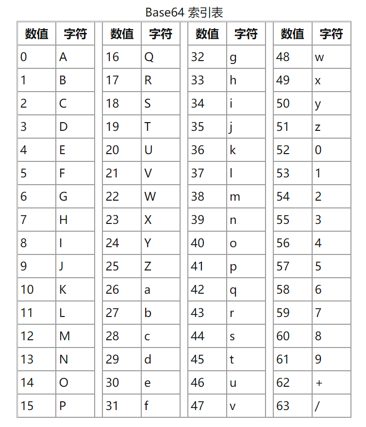

base64 编码是使用64个可打印的字符的ASCII字符（0-9、A-Z、a-z、+、\）将任意字节序列数据编码成ascii码而成的一种算法，另有“=”符号用作后缀补位
## base64 索引表

## 编码
ASCII码一共有256位(00000000-11111111)，因为1个字节有8bit，所以是8bit表示对应一个ASCII码
base64 编码，一共有64个可见字符，那么用二进制表示0-63，则是0 - (26 -1)=>`000000-111111`，所以对应的是6bit表示一个base64码
当ascii码转成base64码时，因为8和6的最小公倍数为24，24/8=3，24/6=4，表示每3个ascii码为1组，转换为4个base64码
```
abc
=>
01100001 01100010 01100011
011000 010110 001001 100011 => 24、22、9、35
YWJj
```
编码过程中，如果字符串不是3的倍数，那么就需要补位，就需要在后面添加=,如果`8n mod 6 =2` 那么需要补两个=，如果`8n mod 6 = 4` 需要补1个=，如果`8n mod 6 = 0` 则不需要=, (n为ascii码数量)
```
abcd
=> 4*8 / 6 = 5 ...... 2 => 8*n mod 6 = 2
=> 当余数=2的时候，要正常编码，bit数一定要为24的倍数，32+m = 24*n (n取最小值2) 所以需要补的bit数为48-32=16
=> 需要补的16 位当中，已经有2位等待补0，那么按6bit一个base64码，需要补4位0，其余12位就补x（也就是两位=）
01100001 01100010 01100011 01100100
011000 010110 001001 100011 011001 00 0000 xxxxxx xxxxxx =>24、22、9、35、25、0、=、=
YWJjZA==
=> 8n mod 6 = 4 的情况，8n = 16 n=2的时候，需要补2个00,然后再补6位x才满足16+8=24，可以被base64编码
ab => YWI=
```
所以记住

- 当`8*n mod 6 = 2`需要补16个bit，4个bit填充0，12个bit填充x，也就是两个=
- `8*n mod 6 = 4`,需要补8个bit，其中2个bit填充0，6个填充x，也就是1个=

mod运算在[数论](https://baike.baidu.com/item/%E6%95%B0%E8%AE%BA/3700?fr=aladdin)中学过，8*n mod 6 这个等式等价于`8 mod 6`,在ascii 和 base64码相互转换，一定要满足待转换数的bit数为`24*n`
## 解码
相信此时您已经了解了编码过程，那么对于解码来说就很简单了
编码过程中，是将3个字符编码成4个base64码，那么解码过程就是将4个base64码解码成3个ascii码（每8个bit一组，组合成一个ascii码）
对应如下：
```
YWJj
011000 010110 001001 100011
01100001 01100010 01100011 => 97 98 99
abc
```
那么如果有=的该怎么计算对应的解码后的字符个数呢？
如`YMI=`base64 编码的字符个数有4个，那么对应解码的字符个数为3个，又因为=为补位，需要减去，那么公式为`n * 6 - 8 * m / 8 => (3 * n / 4)- m(化简后)`（其中m为=个数，n 为base64码个数）
例：`YWJjZA==`解码后字符个数为 3 * 8  / 4 - 2 = 4
```
YWJjZA==
011000 010110 001001 100011 011001 00 0000 xxxxxx xxxxxx
01100001 01100010 01100011 01100100 (后面的0000 xxxxxx xxxxxx 为补位，在解码过程中需要去掉)
=> 97 98 99 100
abcd
```
所以记住，当解码base64码的时候：

- 当编码有1个= ，减去8个bit，如`YMI=`,`(3 * n / 4) - m = 3*4/4-1 = 2 (n=4,m=1)`
- 当编码有2个= ，减去16个bit，如`YWJjZA==`,`(3*n / 4) -m = 3*8/4-2 = 4(n=8,m=2)`
## 参考文档
[https://www.cnblogs.com/vege/p/12675562.html](https://www.cnblogs.com/vege/p/12675562.html)

