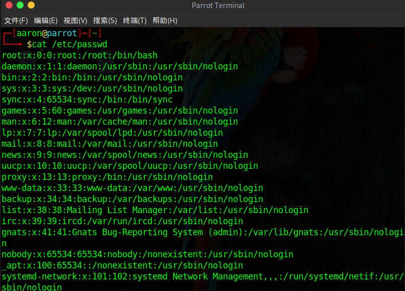
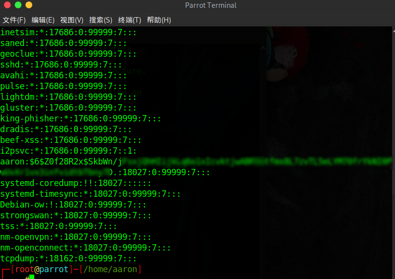
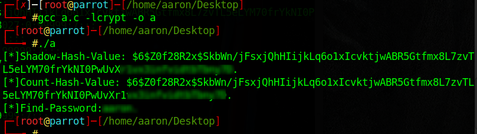

### 账号保存
谈到linux的账号认证，其实就是如何保存于通过口令(password)鉴别，这里首先要讲两个文件，一个是/etc/passwd，另外一个是/etc/shadow文件
我们先来看`/etc/passwd` 文件
#### /ect/passwd

我们来解释一下这张图片，说明一下/etc/passwd文件的格式：**用户名:口令:用户标识号:组标识号:注释性描述:主目录:登录Shell**，我们来说几个重点字段

- 口令： 因为安全问题，放在/etc/shadow中去了
- 用户标识号：uid
- 组标识号：gid
- 主目录：用户主目录
- 登录shell：当为nologin的时候其实是无法登录的
#### /ect/shadow

我们来解释一下这张图片，说明一下/etc/shadow文件的格式：**用户名:$加密方式$盐字符串$密文口令:最后一次修改时间:最小时间间隔:最大时间间隔:警告时间:不活动时间:失效时间:标志**，我们来说几个重点字段。

- 加密方式：6->sha-512加密，1->md5加密，2->Blowfish加密，5->sha-256加密
- 盐：加盐对抗破解的那个随机字符串
- 密文口令：和盐一起经过f(password,key)运算后得到的值
### 认证流程
linxu引导启动后，会读取前文介绍的两个文件，读取到内存中，存入两个数据结构中（passwd结构和spwd结构），使用linux自身的函数获取用户名和密码，对密码进行运算后进行比较。从数学公式来讲，如下：
value = f(InputPasswd,SaltString)
然后比较这个value的值与/etc/shadow中的值保存的是否一致。
### 破解方式
#### 原理介绍
```c
#include <stdio.h>
#include <unistd.h>
#include <stdlib.h>
#include <string.h>

const char *value = "";//这里是/etc/shadow中的hash值
const char *password = "";//明文密码
const char *salt = "";
int main(){
if (strcmp(value,crypt(password,salt)) == 0){//salt是盐的字符串
    printf("[*]Shadow-Hash-Value: %s\n",value);
    printf("[*]Count-Hash-Value: %s\n",crypt(password,salt));
    printf("[*]Find-Password:%s\n", password);
}
return  0;
}
```
#### Test
```c
# gcc a.c -lcrypt -o a
#include <stdio.h>
#include <unistd.h>
#include <stdlib.h>
#include <string.h>

const char *value = "$6$Z0f28R2x$SkbWn/jFsxjQhHIijkLq6o1xIcvktjwABR5Gtfmx8L7zv******************.";//这里是/etc/shadow中的hash值
const char *password = "xx";//明文密码
const char *salt = "$6$Z0f28R2x$";
int main(){
if (strcmp(value,crypt(password,salt)) == 0){//salt是盐的字符串
    printf("[*]Shadow-Hash-Value: %s\n",value);
    printf("[*]Count-Hash-Value: %s\n",crypt(password,salt));
    printf("[*]Find-Password:%s\n", password);
}
return 0;
}

```


