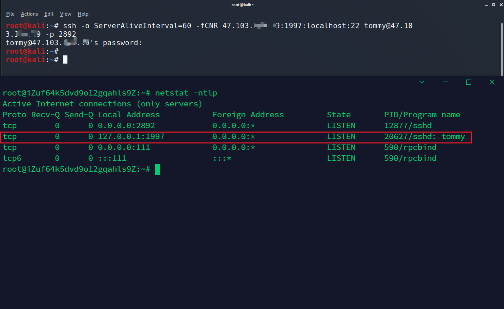
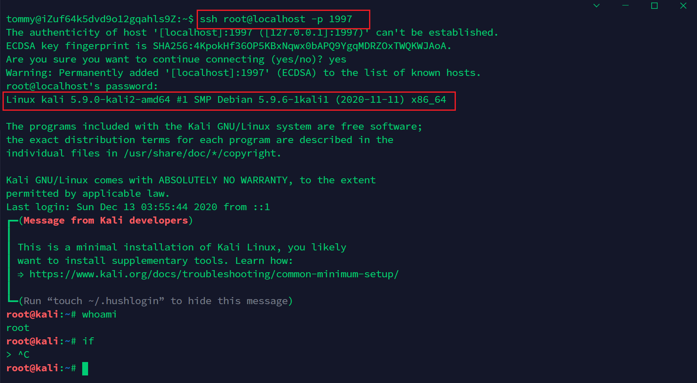
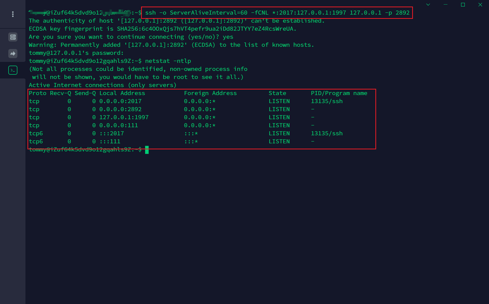
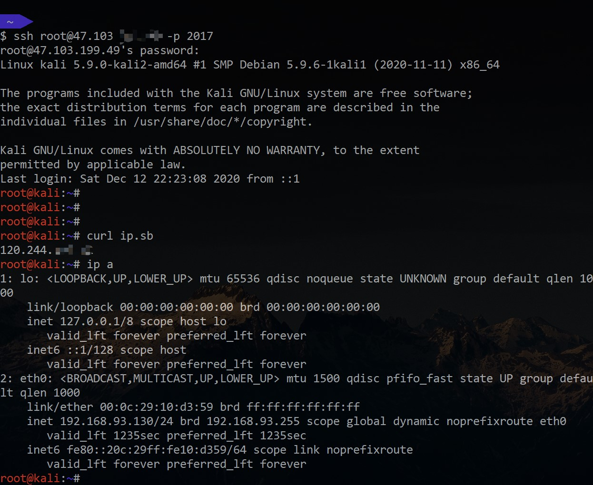
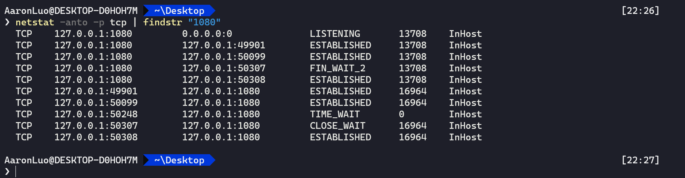
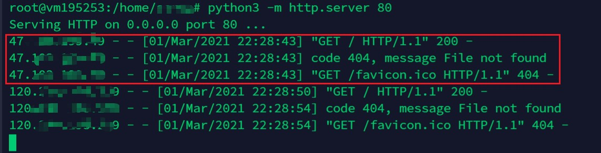

### 背景
说到ssh，没有和服务器打交道的人，都只知道ssh是用于远程连接服务器的一个协议吧，我在这里再粘贴一下百度百科：
SSH 为 Secure Shell 的缩写，由 IETF 的网络小组（Network Working Group）所制定；SSH 为建立在应用层基础上的安全协议。SSH 是较可靠，专为远程登录会话和其他网络服务提供安全性的协议。利用 SSH 协议可以有效防止远程管理过程中的信息泄露问题。SSH最初是UNIX系统上的一个程序，后来又迅速扩展到其他操作平台。SSH在正确使用时可弥补网络中的漏洞。SSH客户端适用于多种平台。几乎所有UNIX平台—包括HP-UX、Linux、AIX、Solaris、Digital UNIX、Irix，以及其他平台，都可运行SSH

这篇文章主要是来聊聊ssh隧道及转发
### 实际问题
事情的起因是因为在做LVS架构加固时，内网某机器需要反向代理另一台公网机器的web服务，该web服务不对外开放，只能本地访问，用户只需要访问内网的web服务，然后建立隧道，从而达到访问外网web服务。
### SSH
先抛开上述问题，我们来聊聊ssh
ssh 用于登录远程主机, 并且在远程主机上执行命令. 它的目的是替换 rlogin和rsh, 同时在不安全的网络之上, 两个互不信任的主机之间, 提供加密的, 安全的通信连接. X11连接和任意 TCP/IP 端口均可以通过此安全通道转发(forward).当用户通过 连接并登录主机 hostname 后, 根据所用的协议版本, 用户必须通过下述方法之一向远程主机证明他/她的身份
ssh 在建立连接的时候会建立安全隧道，客户端和服务端会建立双向连接，那么在建立双向长连接的过程中是不是可以达到端口转发以及响应的目的呢？（其实VPN技术也可以这样简单理解，客户端与服务端建立了双向长连接，一个正向代理）

我们来看一下ssh的相关参数，（我也忘记从哪里抄来的了）
```shell
参数

-a
    禁止转发认证代理的连接.

-A
    允许转发认证代理的连接. 可以在配置文件中对每个主机单独设定这个参数.
    代理转发须谨慎. 某些用户能够在远程主机上绕过文件访问权限 (由于代理的 UNIX 域 socket), 他们可以通过转发的连接访问本地代理. 攻击者不可能从代理获得密钥内容, 但是他们能够操作这些密钥, 利用加载到代理上 的身份信息通过认证.

-b bind_address
    在拥有多个接口或地址别名的机器上, 指定收发接口.

-c blowfish|3des|des
    选择加密会话的密码术. 3des 是默认算法. 3des (triple-des) 用三支不同的密钥做加密-解密-加密三次运算, 被认为比较可靠. blowfish 是一种快速的分组加密术(block cipher), 非常安全, 而且速度比 3des 快的多. des 仅支持 客户端, 目的是能够和老式的不支持 3des 的协议第一版互操作. 由于其密码算法上的弱点, 强烈建议避免使用.

-c cipher_spec
    另外, 对于协议第二版, 这里可以指定一组用逗号隔开, 按优先顺序排列的密码术. 详见 Ciphers

-e ch|^ch|none
    设置 pty 会话的 escape 字符 (默认字符: "`~'") . escape 字符只在行首有效, escape 字符后面跟一个点 ("`.'" ) 表示结束连接, 跟一个 control-Z 表示挂起连接(suspend), 跟 escape 字符自己 表示输出这个字符. 把这个字符设为 ``none 则禁止 escape 功能, 使会话完全透明.

-f
    要求 在执行命令前退至后台. 它用于当 准备询问口令或密语, 但是用户希望它在后台进行. 该选项隐含了 -n 选项. 在远端机器上启动 X11 程序的推荐手法就是类似于 ssh -f host xterm 的命令.

-g
    允许远端主机连接本地转发的端口.

-i identity_file
    指定一个 RSA 或 DSA 认证所需的身份(私钥)文件. 默认文件是协议第一版的 $HOME/.ssh/identity 以及协议第二版的 $HOME/.ssh/id_rsa 和 $HOME/.ssh/id_dsa 文件. 也可以在配置文件中对每个主机单独指定身份文件. 可以同时使用多个 -i 选项 (也可以在配置文件中指定多个身份文件).

-I smartcard_device
    指定智能卡(smartcard)设备. 参数是设备文件, 能够用它和智能卡通信, 智能卡里面存储了用户的 RSA 私钥.

-k
    禁止转发 Kerberos 门票和 AFS 令牌. 可以在配置文件中对每个主机单独设定这个参数.

-l login_name
    指定登录远程主机的用户. 可以在配置文件中对每个主机单独设定这个参数.

-m mac_spec
    另外, 对于协议第二版, 这里可以指定一组用逗号隔开, 按优先顺序排列的 MAC(消息验证码)算法 (message authentication code). 详情以 MACs 为关键字查询.

-n
    把 stdin 重定向到 /dev/null (实际上防止从 stdin 读取数据). 在后台运行时一定会用到这个选项. 它的常用技巧是远程运行 X11 程序. 例如, ssh -n shadows.cs.hut.fi emacs 将会在 shadows.cs.hut.fi 上启动 emacs, 同时自动在加密通道中转发 X11 连接. 在后台运行. (但是如果 要求口令或密语, 这种方式就无法工作; 参见 -f 选项.)

-N
    不执行远程命令. 用于转发端口. (仅限协议第二版)

-o option
    可以在这里给出某些选项, 格式和配置文件中的格式一样. 它用来设置那些没有命令行开关的选项.

-p port
    指定远程主机的端口. 可以在配置文件中对每个主机单独设定这个参数.

-q
    安静模式. 消除所有的警告和诊断信息.

-s
    请求远程系统激活一个子系统. 子系统是 SSH2 协议的一个特性, 能够协助 其他应用程序(如 sftp)把SSH用做安全通路. 子系统通过远程命令指定.

-t
    强制分配伪终端. 可以在远程机器上执行任何全屏幕(screen-based)程序, 所以非常有用, 例如菜单服务. 并联的 -t 选项强制分配终端, 即使 没有本地终端.

-T
    禁止分配伪终端.

-v
    冗详模式. 使 打印关于运行情况的调试信息. 在调试连接, 认证和配置问题时非常有用. 并联的 -v 选项能够增加冗详程度. 最多为三个.

-x
    禁止 X11 转发.

-X
    允许 X11 转发. 可以在配置文件中对每个主机单独设定这个参数.
    应该谨慎使用 X11 转发. 如果用户在远程主机上能够绕过文件访问权限 (根据用户的X授权数据库), 他就可以通过转发的连接访问本地 X11 显示器. 攻击者可以据此采取行动, 如监视键盘输入等.

-C
    要求进行数据压缩 (包括 stdin, stdout, stderr 以及转发 X11 和 TCP/IP 连接 的数据). 压缩算法和 gzip(1) 的一样, 协议第一版中, 压缩级别 ``level 用 CompressionLevel 选项控制. 压缩技术在 modem 线路或其他慢速连接上很有用, 但是在高速网络上反而 可能降低速度. 可以在配置文件中对每个主机单独设定这个参数. 另见 Compression 选项.

-F configfile
    指定一个用户级配置文件. 如果在命令行上指定了配置文件, 系统级配置文件 (/etc/ssh/ssh_config ) 将被忽略. 默认的用户级配置文件是 $HOME/.ssh/config

-L port:host:hostport
    将本地机(客户机)的某个端口转发到远端指定机器的指定端口. 工作原理是这样的, 本地机器上分配了一个 socket 侦听 port 端口, 一旦这个端口上有了连接, 该连接就经过安全通道转发出去, 同时远程主机和 host 的 hostport 端口建立连接. 可以在配置文件中指定端口的转发. 只有 root 才能转发特权端口. IPv6 地址用另一种格式说明: port/host/hostport

-R port:host:hostport
    将远程主机(服务器)的某个端口转发到本地端指定机器的指定端口. 工作原理是这样的, 远程主机上分配了一个 socket 侦听 port 端口, 一旦这个端口上有了连接, 该连接就经过安全通道转向出去, 同时本地主机和 host 的 hostport 端口建立连接. 可以在配置文件中指定端口的转发. 只有用 root 登录远程主机 才能转发特权端口. IPv6 地址用另一种格式说明: port/host/hostport

-D port
    指定一个本地机器动态的应用程序端口转发. 工作原理是这样的, 本地机器上分配了一个 socket 侦听 port 端口, 一旦这个端口上有了连接, 该连接就经过安全通道转发出去, 根据应用程序的协议可以判断出远程主机将和哪里连接. 目前支持 SOCKS4 协议, 将充当 SOCKS4 服务器. 只有 root 才能转发特权端口. 可以在配置文件中指定动态端口的转发.

-1
    强制 只使用协议第一版.

-2
    强制 只使用协议第二版.

-4
    强制 只使用 IPv4 地址.

-6
    强制 只使用 IPv6 地址.
```
其实建立隧道，端口转发只需要以下参数
```shell
-f 后台执行ssh指令
-C 允许压缩数据
-N 不执行远程指令
-R 将远程主机(服务器)的某个端口转发到本地端指定机器的指定端口
-L 本地端口转发
-D 动态端口转发
```
例如：下面的命令，-fCNR 指的是 后台执行shell，并要求数据压缩，并不执行远程命令，将远程服务器的1997端口的流量通过隧道转发到本地的22号端口，-o 参数中的ServerAliveInterval是防止连接不稳定，设置每60秒发送一次数据包
```shell
ssh -o ServerAliveInterval=60 -fCNR 47.103.xx.xx:1997:localhost:22 tommy@47.103.xx.xx -p 2892
```

ssh有一个机制，ssh建立隧道只能在本机的环回地址127.0.0.1上，我们只能登录VPS使用ssh指定port登录内网服务器

#### 内网代理（穿透）
刚刚看了上面的例子，我们可以将远程服务器的端口流量转发到内网服务器的端口上，（remote:1997 => localhost:22）,从而可以从vps上访问内网地址。

使用ssh实现内网穿透有什么好处吗？
SSH 是专为远程登录会话和其他网络服务提供安全性的协议，利用 SSH 协议可以有效防止远程管理过程中的信息泄露问题，白话就是说，ssh的流量有层加密，一般在内网穿透的时候`frp`,`lcx`, `NatByPass`等工具都有明显的特征，在Linux上使用ssh不但可轻松绕过流量检测设备，也可以提供稳定的连接，但是缺点就是很容易暴露，不适合留做后门。

刚刚说了，ssh建立隧道只能在本机的环回地址127.0.0.1上，那么我们一定要登录自己的vps然后才访问吗？答案并不是这样，解决这个问题理论上需要开启一个对外可访问的端口，将该端口的流量转发到sshd的端口
那么使用iptables，firewalld可以吗？答案是不行，iptables，firewalld做转发是不能转发到本地环回地址，因为这是不安全的，如果需要强行修改，需要修改内核
```shell
# 根据实际情况修改
sysctl -w net.ipv4.conf.eth0.route_localnet=1
```
但是这里并不建议修改内核参数，因为修改之后就违背了Linux的安全机制，当时间久远或者服务器交接之后可能就忘了这个安全项，所以需要选用一个安全可靠的方法
这里我们使用ssh 的-L参数，将本地机(客户机)的某个端口转发到本地机器的指定端口（正向代理）
例如下面的命令，对外开放2017端口，并将2017端口的流量转发到1997端口
```shell
ssh -o ServerAliveInterval=60 -fCNL *:2017:localhost:1997 localhost -p 2892
```

现在流程是 remote:2017 => remote_localhost:1997 => localhost:22，在任意一台机器上，访问vps的2017端口，就会将流量先转发到1997端口，然后通过ssh隧道将流量反向转发到内网的kali上，如下图所示

#### ssh动态转发
SSH动态转发是 ssh 创建一个 socks v5 的服务并在 bind_address:bind_port 上侦听，当收到数据后，解析出需要连接的主机和端口并通道加密通道发送给 sshd，sshd 转发数据后并返回结果数据。
SSH动态转发就是SSH服务器使用的是正向匿名代理的作用，由内部机器将数据包通过socks发送到绑定端口，再通过sshd服务去请求目标服务。
ssh的动态转发在流量侧是加密流量，非常适用于外网拿下一台具有访问内网的机器之后，进行代理，攻击内网机器（前提是控制住一台Linux主机）
在linux中，通常使用如下命令，后台执行，再通过proxychains等工具直接代理到内网机器
```shell
nohup ssh -ND 1080 [username]@[ip] -p [port] &
```
在windows中，一般使用如下命令，后台执行
```shell
start /b ssh -ND 1080 [username]@[ip] -p [port]
```
但是在windows 中，只要关闭了`cmd.exe` ，就会关闭该进程，如果将其写入到`.bat`文件中，那么就会有非常丑陋的`dos`框
所以我的做法是写一个vbs，开机自启动bat文件
`run.bat`内容如下
```shell
start /b ssh -ND 1080 [username]@[ip] -p [port]
```
`run.vbs`如下
```shell
Dim WinScriptHost
Set WinScriptHost = CreateObject("WScript.Shell")
WinScriptHost.Run Chr(34) & "<your_run.bat_path>" & Chr(34), 0
Set WinScriptHost = Nothing
```
开机启动项的位置在，打开cmd.exe ，运行shell:startup

我在我的vps上启动一个web服务，前三个`http`请求就是我通过代理去访问的web服务，后三个`http`请求不是通过代理，可以看到，动态转发就是实现了一个匿名正向代理的一个过程

学会ssh动态转发，其实也就不用配置什么ss了，我相信你已经懂了
### 问题解决
回到最开始的问题，我们首先需要配置nginx反向代理，这里配置项就不贴出来，就是在内网开放web服务
然后将本地的端口流量转发到远程端口处（-L参数喔）
我在这里使用autossh, autossh的参数与ssh的参数是一致的，但是不同的是，在隧道断开的时候，autossh会自动重新连接而ssh不会（ssh需要配置-o 参数的
ServerAliveInterval，ServerAliveInterval可以保证每隔多长时间重新连接一次）。另外不同的是我们需要指出的-M参数，这个参数指定一个端口是远程主机用来接收内网机器的信息，如果隧道不正常而返回给内网机器让他实现重新连接。
使用M参数，监听本地端口，当ssh超时则自动重新连接
```shell
autossh -M 14431 -fCNL *:4431:192.168.0.18:8443 admin@xxx.xxx.xxx.xxx
```
使用autossh的好处有如下几点：

- autossh相当于一个守护进程，当ssh连接失效时，autossh 进程则会重新拉起ssh隧道，就不需要定时重连，这样的shell会更稳定
- 当出现断网的时候，如果使用ssh -o ServerAliveInterval 定时重连，则会失效
> ps：使用autossh 需要将自己的公钥写入authorized_keys中


