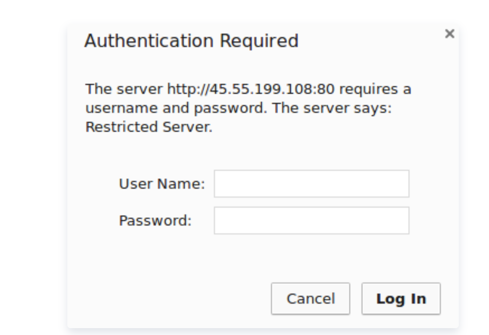
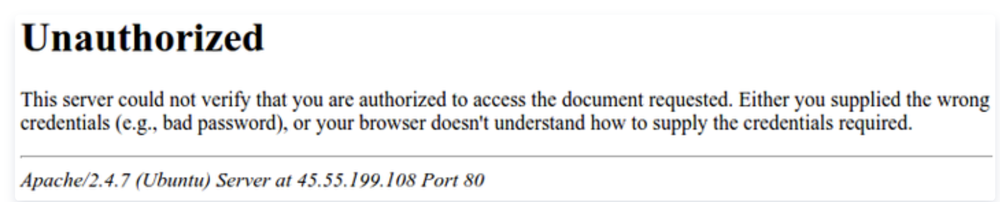

> [https://cloud.tencent.com/developer/article/1358394](https://cloud.tencent.com/developer/article/1358394)


## **介绍**

在运行网站时，网站的某些部分通常会限制访问者。Web应用程序可以提供自己的身份验证和授权方法，但如果Web服务器不足或不可用，也可以使用Web服务器本身来限制访问。

在本指南中，我们将演示如何在Ubuntu 16.04上运行的Apache Web服务器上对资产进行密码保护。

## **先决条件**

要完成本教程，您需要访问Ubuntu 16.04服务器。

此外，在开始之前，您将需要以下内容：

- **一个服务器上的sudo用户**：您可以创建一个具有`sudo`权限用户按照的Ubuntu 16.04服务器初始设置指南进行设置，没有服务器的同学可以在[这里购买](https://cloud.tencent.com/product/cvm?from=10680)，不过我个人更推荐您使用**免费**的腾讯云[开发者实验室](https://cloud.tencent.com/developer/labs?from=10680)进行试验，学会安装后再[购买服务器](https://cloud.tencent.com/product/cvm?from=10680)。
- **Apache2 Web服务器**。
- 使用SSL保护的网站
：如何设置该网站取决于您是否拥有网站的域名。
   - **如果你有域名**，保护你网站的最简单方法是使用[腾讯云SSL证书服务](https://cloud.tencent.com/product/ssl?from=10680)，它提供免费的可信证书。[腾讯云SSL证书安装操作指南](https://cloud.tencent.com/document/product/400/6814?from=10680)进行设置。
   - **如果你没有域名**，建议您先去这里[注册一个域名](https://dnspod.cloud.tencent.com/)，如果你只是使用此配置进行测试或个人使用，则可以使用自签名证书，不需要购买域名。自签名证书提供了相同类型的加密，但没有域名验证公告。关于自签名证书，你可以参考为[Apache创建自签名SSL证书](https://cloud.tencent.com/developer/article/1165840?from=10680)和[如何为Nginx创建自签名SSL证书](https://cloud.tencent.com/developer/article/1160294?from=10680)这两篇文章。

当所有这些都到位后，以`sudo`用户身份登录您的服务器并继续下面。

## **第1步 - 安装Apache Utilities包**

我们将使用名为`apache2-utils`包的一部分的实用程序`htpasswd`来创建文件并管理访问受限内容所需的用户名和密码。

```javascript
sudo apt-get update
sudo apt-get install apache2-utils
```

## **第2步 - 创建密码文件**

我们现在可以访问该`htpasswd`命令。我们可以使用它来创建Apache可用于验证用户身份的密码文件。我们将在`/etc/apache2`配置目录中为此目的创建一个名为`.htpasswd`的隐藏文件。

我们第一次使用此实用程序时，需要添加`-c`选项以创建指定的文件。我们在命令末尾指定用户名（在此示例中为`sammy`）以在文件中创建新条目：

```javascript
sudo htpasswd -c /etc/apache2/.htpasswd sammy
```

系统将要求您提供并确认用户的密码。

省略您要添加的任何其他用户的`-c`参数：

```javascript
sudo htpasswd /etc/apache2/.htpasswd another_user
```

如果我们查看文件的内容，我们可以看到每条记录的用户名和加密密码：

```javascript
cat /etc/apache2/.htpasswd
sammy:$apr1$.0CAabqX$rb8lueIORA/p8UzGPYtGs/
another_user:$apr1$fqH7UG8a$SrUxurp/Atfq6j7GL/VEC1
```

## **第3步 - 配置Apache密码身份验证**

现在我们有一个文件，其中包含Apache可以读取的格式的用户和密码，我们需要配置Apache以在提供受保护内容之前检查此文件。我们可以通过以下两种方式之一完成此操作：直接在站点的虚拟主机文件中，或者将.htaccess文件放在需要限制的目录中。通常最好使用虚拟主机文件，但如果您需要允许非root用户管理自己的访问限制，请检查网站旁边的版本控制限制，或者使用.htaccess文件的Web应用程序已用于其他目的，看看第二个选项。

选择最适合您需求的选项。

### **选项1：在虚拟主机定义中配置访问控制（首选）**

第一个选项是编辑Apache配置并将密码保护添加到虚拟主机文件。这通常会提供更好的性能，因为它避免了读取分布式配置文件的费用。此选项需要访问配置，该配置并非始终可用，但是当您确实有访问权限时，建议您访问。

首先打开要添加限制的虚拟主机文件。对于我们的示例，我们将使用包含通过Ubuntu的apache包安装的默认虚拟主机的`000-default.conf`文件：

```javascript
sudo nano /etc/apache2/sites-enabled/000-default.conf
```

在内部，删除了注释，文件看起来应该类似于：

```javascript
<VirtualHost *:80>
  ServerAdmin webmaster@localhost
  DocumentRoot /var/www/html
  ErrorLog ${APACHE_LOG_DIR}/error.log
  CustomLog ${APACHE_LOG_DIR}/access.log combined
</VirtualHost>
```

身份验证基于每个目录完成。要设置身份验证，您需要使用`<Directory ___>`块来定位要限制的目录。在我们的示例中，我们将限制整个文档根目录，但您可以修改此列表以仅定位Web空间中的特定目录：

```javascript
<VirtualHost *:80>
  ServerAdmin webmaster@localhost
  DocumentRoot /var/www/html
  ErrorLog ${APACHE_LOG_DIR}/error.log
  CustomLog ${APACHE_LOG_DIR}/access.log combined

  <Directory "/var/www/html">
  </Directory>
</VirtualHost>
```

在此目录块中，指定我们希望设置`Basic`身份验证。对于`AuthName`，请选择在提示输入凭据时将显示给用户的领域名称。使用该`AuthUserFile`指令将Apache指向我们创建的密码文件。最后，我们将要求`valid-user`访问此资源，这意味着任何可以使用密码验证其身份的人都将被允许：

```javascript
<VirtualHost *:80>
  ServerAdmin webmaster@localhost
  DocumentRoot /var/www/html
  ErrorLog ${APACHE_LOG_DIR}/error.log
  CustomLog ${APACHE_LOG_DIR}/access.log combined

  <Directory "/var/www/html">
      AuthType Basic
      AuthName "Restricted Content"
      AuthUserFile /etc/apache2/.htpasswd
      Require valid-user
  </Directory>
</VirtualHost>
```

完成后保存并关闭文件。

在重新启动Web服务器之前，可以使用以下命令检查配置：

```javascript
sudo apache2ctl configtest
```

如果所有内容都已检出并获得`Syntax OK`，请重新启动服务器以实施密码策略。由于`systemctl`不显示所有服务管理命令的结果，我们将使用`status`以确保服务器正在运行：

```javascript
sudo systemctl restart apache2
sudo systemctl status apache2
```

现在，您指定的目录现在应该受密码保护。

### **选项2：使用.htaccess文件配置访问控制**

Apache可以使用`.htaccess`文件以允许在内容目录中设置某些配置项。由于Apache必须在涉及目录的每个请求上重新读取这些文件，这会对性能产生负面影响，因此首选选项1，但如果您已经在使用.htaccess文件或需要允许非root用户管理限制，那么`.htaccess`文件合理。

要使用`.htaccess`文件启用密码保护，请打开主Apache配置文件：

```javascript
sudo nano /etc/apache2/apache2.conf
```

找到包含`/var/www`文档根目录的`<Directory>`块。`.htaccess`通过将该块中的`AllowOverride`指令从“None”更改为“All”来打开处理：

```javascript
. . .

<Directory /var/www/>
  Options Indexes FollowSymLinks
  AllowOverride All
  Require all granted
</Directory>

. . .
```

完成后保存并关闭文件。

接下来，我们需要将`.htaccess`文件添加到我们希望限制的目录中。在我们的演示中，我们将限制基于`/var/www/html`的整个文档根目录（整个网站），但您可以将此文件放在您希望限制访问的任何目录中：

```javascript
sudo nano /var/www/html/.htaccess
```

在此文件中，指定我们希望设置`Basic`身份验证。对于`AuthName`，请选择在提示输入凭据时将显示给用户的领域名称。使用该`AuthUserFile`指令将Apache指向我们创建的密码文件。最后，我们将要求`valid-user`访问此资源，这意味着任何可以使用密码验证其身份的人都将被允许：

```javascript
AuthType Basic
AuthName "Restricted Content"
AuthUserFile /etc/apache2/.htpasswd
Require valid-user
```

保存并关闭文件。重新启动Web服务器以使用该`.htaccess`文件密码保护目录中或目录下的所有内容，并使用`systemctl status`以验证重新启动是否成功：

```javascript
sudo systemctl restart apache2
sudo systemctl status apache2
```

## **第4步 - 确认密码验证**

要确认您的内容受到保护，请尝试在网络浏览器中访问受限制的内容。您应该看到一个用户名和密码提示符，如下所示：



如果输入正确的凭据，则可以访问该内容。如果输入错误的凭据或点击“取消”，您将看到“未授权”错误页面：


