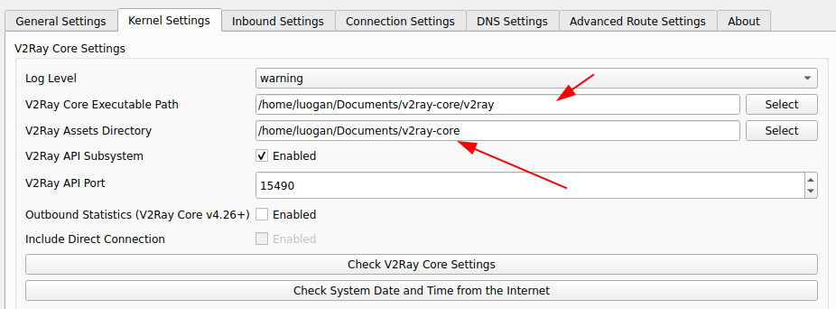
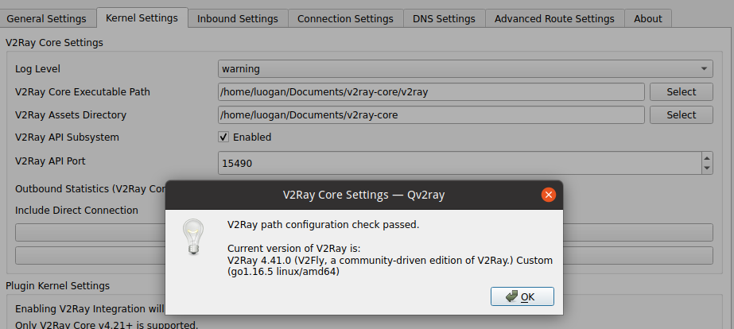
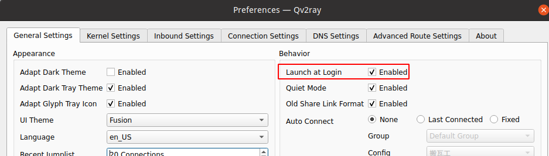

### QV2ray
使用 Qt 框架的跨平台 V2Ray 客户端。支持 Windows, Linux, macOS；插件系统支持 SSR / Trojan / Trojan-Go / NaiveProxy
### 下载及安装
[https://github.com/Qv2ray/Qv2ray/releases](https://github.com/Qv2ray/Qv2ray/releases)
下载最新版，由于我搭建的环境vless协议，所以需要支持最新版的客户端以及v2ray内核
下载最新版v2ray-core
[https://github.com/v2fly/v2ray-core/releases](https://github.com/v2fly/v2ray-core/releases)
下载好之后，需要在Qv2ray 中配置 v2ray-core，如下图所示
第一个路径为v2ray-core中的二进制文件
第二个路径为v2ray-core的路径

然后点击`check V2ray Core Setting`，出现如下所示表示配置成功

然后开启开机启动即可

