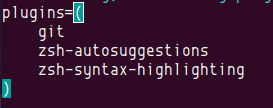

### zsh介绍
zsh是一个Linux下强大的shell, 由于大多数Linux产品安装以及默认使用bash shell, 但是丝毫不影响极客们对zsh的热衷, 几乎每一款Linux产品都包含有zsh，通常可以用apt、urpmi或yum等包管理器进行安装.
zsh是bash的增强版，其实zsh和bash是两个不同的概念，zsh更加强大。
通常zsh配置起来非常麻烦，且相当的复杂，所以oh-my-zsh是为了简化zsh的配置而开发的，因此oh-my-zsh算是zsh的配置.
### 安装
```shell
# 首先查看系统使用的shell
echo $SHELL
# 查看当前系统支持的所有的shell
cat /etc/shells
```

#### 下载zsh
```shell
sudo apt install zsh
```

设置zsh为默认shell
```shell
chsh -s /bin/zsh
reboot
touch ~/.zshrc
```

下载oh-my-zsh
```shell
sh -c "$(wget https://raw.github.com/robbyrussell/oh-my-zsh/master/tools/install.sh -O -)"
```
下载完成之后，就会出现如下图所示的界面
cd ~/.oh-my-zsh/custom/plugins/
接下来就是配置以及git相关的东西了
### 配置
#### 安装插件
```shell
cd ~/.oh-my-zsh/custom/plugins/
git clone https://github.com/zsh-users/zsh-autosuggestions
git clone https://github.com/zsh-users/zsh-syntax-highlighting.git
```
#### 修改配置文件
```shell
vim ~/.zshrc
```

```shell
plugins=(
    git
    zsh-autosuggestions
    zsh-syntax-highlighting
)
```
在~/.zshrc文末添加
```shell
source ~/.oh-my-zsh/custom/plugins/zsh-syntax-highlighting/zsh-syntax-highlighting.zsh
```
#### 主题配置
由于一直玩鸟，所以我选择的shell主题是parrot的shell主题
```shell
vim ~/.zhsrc
```
修改主题为`gnzh`

使用
[https://gist.github.com/Ares-X/52fe7faf9dda8b943c1a7f18654a2dbb#file-gnzh-zsh-theme](https://gist.github.com/Ares-X/52fe7faf9dda8b943c1a7f18654a2dbb#file-gnzh-zsh-theme)
替换`~/.oh-my-zsh/themes` 下的 `gnzh.zsh-theme`
```shell
source ~/.zshrc
```

### 终端
我使用了很多终端工具，最终确定还是比较喜欢Tilix
```shell
sudo apt install tilix
```
修改默认终端
```shell
sudo update-alternatives --config x-terminal-emulator
```

在文件系统中配置open Tilix
我们配置完默认终端之后，在文件系统中右键点击 open terminal 发现并不是我们设置的默认终端
```shell
sudo apt-get install nautilus-actions
```


```
/usr/bin/tilix
--working-directory=%d/%b
```


保存之后，执行如下
```shell
nautilus -q
```
### root用户使用zsh 权限问题
```shell
# 复制相关文件到家目录即可
# 在.zshrc第一行添加
ZSH_DISABLE_COMPFIX=true
```

