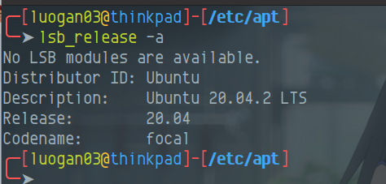
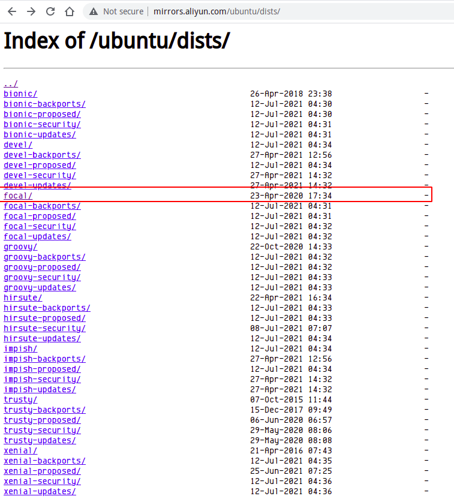

### 背景
换源很简单，修改`/etc/apt/sources.list`将提供的阿里源，清华源复制上去就欧克了，但是在更新源，以及更新软件的时候就会发现为什么换了源之后还是和之前国外源一样很慢很慢。
### Ubuntu代号
Ubuntu各个版本都有代号，比如
```
4.10 Warty Warthog(长疣的疣猪)
5.04 Hoary Hedgehog(灰白的刺猬)
5.10 Breezy Badger(活泼的獾)

6.06(LTS) Dapper Drake(整洁的公鸭)
6.10 Edgy Eft(急躁的水蜥)
7.04 Feisty Fawn(坏脾气的小鹿)
7.10 Gutsy Gibbon(勇敢的长臂猿)

8.04(LTS) Hardy Heron(耐寒的苍鹭)
8.10 Intrepid Ibex (勇敢的野山羊)
9.04 Jaunty Jackalope(得意洋洋的怀俄明野兔)
9.10 Karmic Koala(幸运的考拉)

10.04(LTS) Lucid Lynx(清醒的猞猁)
10.10 Oneiric Ocelot(梦幻的豹猫)
11.04 Natty Narwhal(敏捷的独角鲸)
11.10 Oneiric Ocelot（有梦的虎猫）

12.04(LTS) Precise Pangolin(精准的穿山甲)
12.10 Quantal Quetzal(量子的绿咬鹃)
13.04 Raring Ringtail(铆足了劲的猫熊)
13.10 Saucy Salamander(活泼的蝾螈)

14.04(LTS) Trusty Tahr (可靠的塔尔羊)(LTS)
14.10 Utopic Unicorn(乌托邦独角兽)
15.04 Vivid Vervet (活泼的小猴)
15.10 Wily Werewolf (狡猾的狼人)

16.04(LTS) Xenial Xerus (好客的非洲地松鼠)
16.10 Yakkety Yak（牦牛）
17.04 Zesty Zapus(开心的跳鼠)
17.10 Artful Aardvark(机灵的土豚)

18.04(LTS) Bionic Beaver（仿生海狸）
18.10 Cosmic Cuttlefish（宇宙墨鱼）
19.04 Disco Dingo（舞动的灵犬）
19.10 Eoan Ermine（白貂）

20.04(LTS) Focal Fossa（专注的马达加斯加长尾狸猫）
...
```
再此同时，你要知道如何查看Ubuntu的代号
```shell
lsb_release -a
```



### 换源
去阿里源官网去查看是否有此代号的源，[http://mirrors.aliyun.com/ubuntu/dists/](http://mirrors.aliyun.com/ubuntu/dists/)


可以看到，现在已经有了ubuntu 20.04(代号focal)的源了
在换源过程中，以此为模板，将下面的`TODO`换成你的`CodeName`

```shell
deb http://mirrors.aliyun.com/ubuntu/ TODO main restricted universe multiverse
deb-src http://mirrors.aliyun.com/ubuntu/ TODO main restricted universe multiverse

deb http://mirrors.aliyun.com/ubuntu/ TODO-security main restricted universe multiverse
deb-src http://mirrors.aliyun.com/ubuntu/ TODO-security main restricted universe multiverse

deb http://mirrors.aliyun.com/ubuntu/ TODO-updates main restricted universe multiverse
deb-src http://mirrors.aliyun.com/ubuntu/ TODO-updates main restricted universe multiverse

deb http://mirrors.aliyun.com/ubuntu/ TODO-proposed main restricted universe multiverse
deb-src http://mirrors.aliyun.com/ubuntu/ TODO-proposed main restricted universe multiverse

deb http://mirrors.aliyun.com/ubuntu/ TODO-backports main restricted universe multiverse
deb-src http://mirrors.aliyun.com/ubuntu/ TODO-backports main restricted universe multiverse
```
我的`codename`是`focal`，那么我的源就为如下所示：
```shell
deb http://mirrors.aliyun.com/ubuntu/ focal main restricted universe multiverse
deb-src http://mirrors.aliyun.com/ubuntu/ focal main restricted universe multiverse

deb http://mirrors.aliyun.com/ubuntu/ focal-security main restricted universe multiverse
deb-src http://mirrors.aliyun.com/ubuntu/ focal-security main restricted universe multiverse

deb http://mirrors.aliyun.com/ubuntu/ focal-updates main restricted universe multiverse
deb-src http://mirrors.aliyun.com/ubuntu/ focal-updates main restricted universe multiverse

deb http://mirrors.aliyun.com/ubuntu/ focal-proposed main restricted universe multiverse
deb-src http://mirrors.aliyun.com/ubuntu/ focal-proposed main restricted universe multiverse

deb http://mirrors.aliyun.com/ubuntu/ focal-backports main restricted universe multiverse
deb-src http://mirrors.aliyun.com/ubuntu/ focal-backports main restricted universe multiverse
```
### 更新缓存、升级
```shell
apt update
apt upgrade
```
