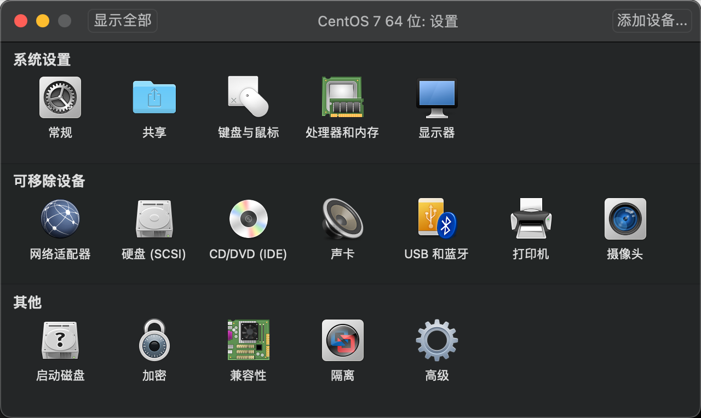
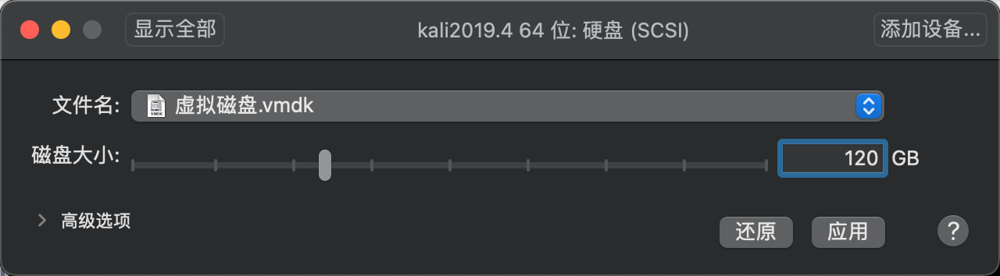
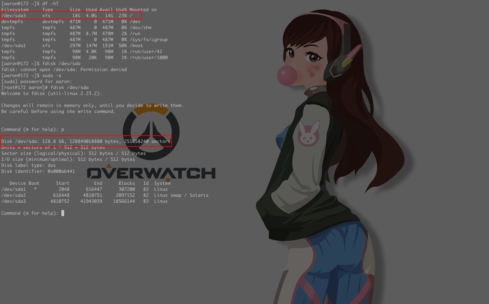
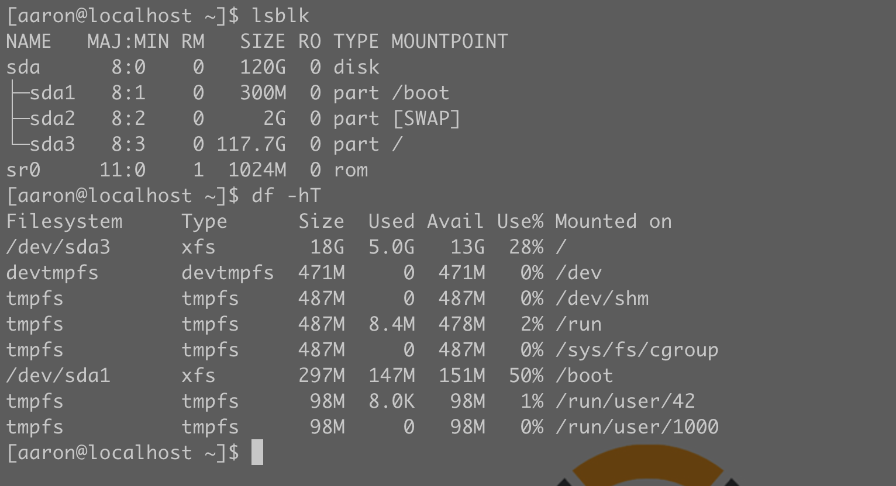
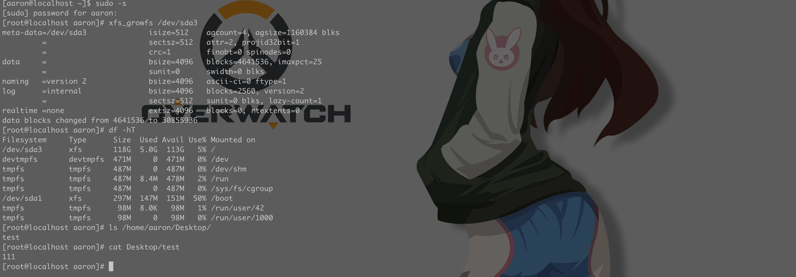
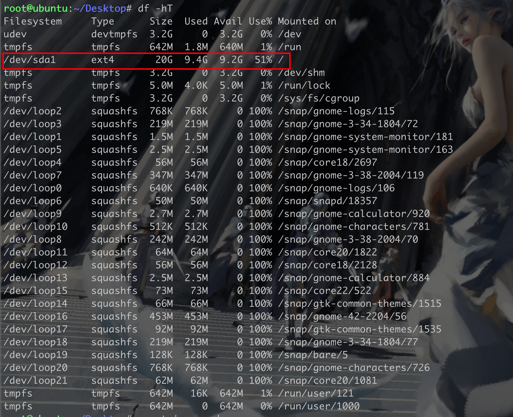
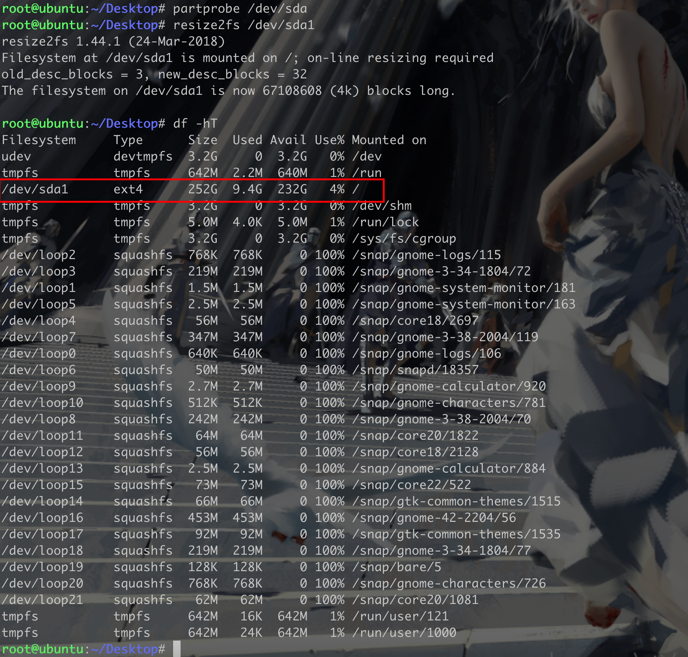

## 前言
由于最近在给公司管培生做培训，需要用到Docker，原以为20个G的CentOS够用了，但是发现还是小瞧了docker的镜像，安装到一半突然告知磁盘不够，所以马上开始紧急扩容
## 0x1 增加虚拟磁盘容量
虚拟机正常关机后，打开此虚拟机的设置，选择硬盘


然后在磁盘大小处填写需要扩展到合适的硬盘大小量，点击应用即可


然后打开虚拟机，可以看到磁盘已经有120个G了，但是根目录只有18个G



## 0x2 使用fdisk 扩容
在/dev/sda 这块磁盘中，可以看到当前挂载到根目录的为/dev/sda3，其他的则为系统所需磁盘
如果需要将磁盘扩展到挂载根目录的需要将/dev/sda3 删除，然后再重新分区
```shell
[root@localhost aaron]# fdisk /dev/sda
Welcome to fdisk (util-linux 2.23.2).

Changes will remain in memory only, until you decide to write them.
Be careful before using the write command.


Command (m for help): p

Disk /dev/sda: 128.8 GB, 128849018880 bytes, 251658240 sectors
Units = sectors of 1 * 512 = 512 bytes
Sector size (logical/physical): 512 bytes / 512 bytes
I/O size (minimum/optimal): 512 bytes / 512 bytes
Disk label type: dos
Disk identifier: 0x000ab441

   Device Boot      Start         End      Blocks   Id  System
/dev/sda1   *        2048      616447      307200   83  Linux
/dev/sda2          616448     4810751     2097152   82  Linux swap / Solaris
/dev/sda3         4810752    41943039    18566144   83  Linux

Command (m for help): d
Partition number (1-3, default 3): 3
Partition 3 is deleted

Command (m for help): n
Partition type:
   p   primary (2 primary, 0 extended, 2 free)
   e   extended
Select (default p): p
Partition number (3,4, default 3):
First sector (4810752-251658239, default 4810752):
Using default value 4810752
Last sector, +sectors or +size{K,M,G} (4810752-251658239, default 251658239):
Using default value 251658239
Partition 3 of type Linux and of size 117.7 GiB is set

Command (m for help): w
The partition table has been altered!

Calling ioctl() to re-read partition table.

WARNING: Re-reading the partition table failed with error 16: Device or resource busy.
The kernel still uses the old table. The new table will be used at
the next reboot or after you run partprobe(8) or kpartx(8)
Syncing disks.
```
上述步骤执行完之后，执行`lsblk`，可以看到当前更改还未生效
```shell
[root@localhost Desktop]# lsblk
NAME   MAJ:MIN RM  SIZE RO TYPE MOUNTPOINT
sda      8:0    0  120G  0 disk
├─sda1   8:1    0  300M  0 part /boot
├─sda2   8:2    0    2G  0 part [SWAP]
└─sda3   8:3    0 17.7G  0 part /
sr0     11:0    1 1024M  0 rom
```
需要重启
```shell
reboot
```
重启之后执行lsblk ，可以看到此时/dev/sda3 分区的大小已经修改为117.7G了，但是我们使用df -hT查看却还是18G


下一步则需要刷新磁盘

```shell
xfs_growfs /dev/sda3
```


至此，磁盘扩容完毕

> Ubuntu 使用xfs_growfs 无法成功

**通知系统内核分区表的变化，输入：**partprobe /dev/sda
**对文件系统进行扩容，输入：**resize2fs /dev/sda1
**查看/dev/sda1是否扩容成功，输入：**df -TH




