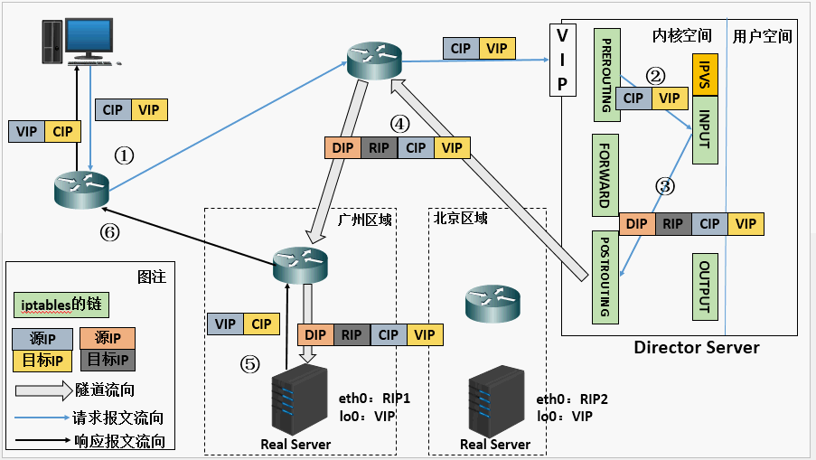

## LVS架构及原理

### 简介

LVS是Linux Virtual Server的简称，也就是Linux虚拟服务器，是一个由章文嵩博士发起的自由软件项目，官方站点是：[http://www.linuxvirtualserver.org](http://www.linuxvirtualserver.org/)。现在LVS已经是Linux标准内核的一部分，在Linux2.4内核以前，使用LVS时必须重新编译内核以支持LVS功能模块，但是从Linux2.4内核心之后，已经完全内置了LVS的各个功能模块，无需给内核打任何补丁，可以直接使用LVS提供的各种功能。

使用LVS技术要达到的目标是：通过LVS提供的负载均衡技术和Linux操作系统实现一个高性能，高可用的服务器群集，它具有良好的可靠性、可扩展性和可操作性。从而以低廉的成本实现最优的服务性能。

### LVS 架构

使用LVS架设的服务器集群系统有三个部分组成：最前端的负载均衡层（Loader Balancer），中间的服务器群组层，用Server Array表示，最底层的数据共享存储层，用Shared Storage表示。在用户看来所有的应用都是透明的，用户只是在使用一个虚拟服务器提供的高性能服务。

LVS的体系架构如图：

LVS的各个层次的详细介绍：

- Load Balancer层：位于整个集群系统的最前端，有一台或者多台负载调度器（Director Server）组成，LVS模块就安装在Director Server上，而Director的主要作用类似于一个路由器，它含有完成LVS功能所设定的路由表，通过这些路由表把用户的请求分发给Server Array层的应用服务器（Real Server）上。同时，在Director Server上还要安装对Real Server服务的监控模块Ldirectord，此模块用于监测各个Real Server服务的健康状况。在Real Server不可用时把它从LVS路由表中剔除，恢复时重新加入。
- Server Array层：由一组实际运行应用服务的机器组成，Real Server可以是WEB服务器、MAIL服务器、FTP服务器、DNS服务器、视频服务器中的一个或者多个，每个Real Server之间通过高速的LAN或分布在各地的WAN相连接。在实际的应用中，Director Server也可以同时兼任Real Server的角色。
- Shared Storage层：是为所有Real Server提供共享存储空间和内容一致性的存储区域，在物理上，一般有磁盘阵列设备组成，为了提供内容的一致性，一般可以通过NFS网络文件系统共享数 据，但是NFS在繁忙的业务系统中，性能并不是很好，此时可以采用集群文件系统，例如Red hat的GFS文件系统，oracle提供的OCFS2文件系统等。

从整个LVS结构可以看出，Director Server是整个LVS的核心，目前，用于Director Server的操作系统只能是Linux和FreeBSD，linux2.6内核不用任何设置就可以支持LVS功能，而FreeBSD作为 Director Server的应用还不是很多，性能也不是很好。对于Real Server，几乎可以是所有的系统平台，Linux、windows、Solaris、AIX、BSD系列都能很好的支持。

### LVS 基本工作原理

1. 当用户向负载均衡调度器（Director Server）发起请求，调度器将请求发往至内核空间
2. PREROUTING链首先会接收到用户请求，判断目标IP确定是本机IP，将数据包发往INPUT链
3. IPVS是工作在INPUT链上的，当用户请求到达INPUT时，IPVS会将用户请求和自己已定义好的集群服务进行比对，如果用户请求的就是定义的集群服务，那么此时IPVS会强行修改数据包里的目标IP地址及端口，并将新的数据包发往POSTROUTING链
4.  POSTROUTING链接收数据包后发现目标IP地址刚好是自己的后端服务器，那么此时通过选路，将数据包最终发送给后端的服务器

### 相关术语

- DS：Director Server。指的是前端负载均衡器节点。
- RS：Real Server。后端真实的工作服务器。
- VIP：向外部直接面向用户请求，作为用户请求的目标的IP地址。
- DIP：Director Server IP，主要用于和内部主机通讯的IP地址。
- RIP：Real Server IP，后端服务器的IP地址。
- CIP：Client IP，客户端的IP地址

### 三种模式及原理

#### LVS-NAT原理和特点

多目标IP的DNAT，通过将请求报文中的目标地址和目标端口修改为某挑出的RS的RIP和PORT实现转发

1. 当用户请求到达Director Server，此时请求的数据报文会先到内核空间的PREROUTING链。 此时报文的源IP为CIP，目标IP为VIP
2. PREROUTING检查发现数据包的目标IP是本机，将数据包送至INPUT链
3. IPVS比对数据包请求的服务是否为集群服务，若是，修改数据包的目标IP地址为后端服务器IP，后将数据包发至POSTROUTING链。 此时报文的源IP为CIP，目标IP为RIP
4. POSTROUTING链通过选路，将数据包发送给Real Server
5. Real Server比对发现目标为自己的IP，开始构建响应报文发回给Director Server。 此时报文的源IP为RIP，目标IP为CIP
6. Director Server在响应客户端前，此时会将源IP地址修改为自己的VIP地址，然后响应给客户端。 此时报文的源IP为VIP，目标IP为CIP

LVS-NAT模式的特性

- RS应该和DIP应该使用私网地址，且RS的网关要指向DIP；
-  请求和响应报文都要经由director转发；极高负载的场景中，director可能会成为系统瓶颈；
- 支持端口映射；
- RS可以使用任意OS；
- RS的RIP和Director的DIP必须在同一IP网络；

> 缺陷：对Director Server压力会比较大，请求和响应都需经过director server

#### LVS-DR原理和特点

通过为请求报文重新封装一个MAC首部进行转发，源MAC是DIP所在的接口的MAC，目标MAC是某挑选出的RS的RIP所在接口的MAC地址；源IP/PORT，以及目标IP/PORT均保持不变；

1. 当用户请求到达Director Server，此时请求的数据报文会先到内核空间的PREROUTING链。 此时报文的源IP为CIP，目标IP为VIP
2. PREROUTING检查发现数据包的目标IP是本机，将数据包送至INPUT链
3. IPVS比对数据包请求的服务是否为集群服务，若是，将请求报文中的源MAC地址修改为DIP的MAC地址，将目标MAC地址修改RIP的MAC地址，然后将数据包发至POSTROUTING链。 此时的源IP和目的IP均未修改，仅修改了源MAC地址为DIP的MAC地址，目标MAC地址为RIP的MAC地址
4. 由于DS和RS在同一个网络中，所以是通过二层来传输。POSTROUTING链检查目标MAC地址为RIP的MAC地址，那么此时数据包将会发至Real Server。
5. RS发现请求报文的MAC地址是自己的MAC地址，就接收此报文。处理完成之后，将响应报文通过lo接口传送给eth0网卡然后向外发出。 此时的源IP地址为VIP，目标IP为CIP
6. 响应报文最终送达至客户端

LVS-DR模式的特性

- 确保前端路由器将目标IP为VIP的请求报文发往Director：
  - 在前端网关做静态绑定；
  - 在RS上使用arptables；
  - 在RS上修改内核参数以限制arp通告及应答级别；

修改RS上内核参数（arp_ignore和arp_announce）将RS上的VIP配置在lo接口的别名上，并限制其不能响应对VIP地址解析请求。

- RS的RIP可以使用私网地址，也可以是公网地址；RIP与DIP在同一IP网络；RIP的网关不能指向DIP，以确保响应报文不会经由Director；
- RS跟Director要在同一个物理网络；
- 请求报文要经由Director，但响应不能经由Director，而是由RS直接发往Client；
- 不支持端口映射；

> 缺陷：RS和DS必须在同一机房中

#### LVS-Tun原理和特点

在原有的IP报文外再次封装多一层IP首部，内部IP首部(源地址为CIP，目标IIP为VIP)，外层IP首部(源地址为DIP，目标IP为RIP)

1. 当用户请求到达Director Server，此时请求的数据报文会先到内核空间的PREROUTING链。 此时报文的源IP为CIP，目标IP为VIP 。
2. PREROUTING检查发现数据包的目标IP是本机，将数据包送至INPUT链
3. IPVS比对数据包请求的服务是否为集群服务，若是，在请求报文的首部再次封装一层IP报文，封装源IP为为DIP，目标IP为RIP。然后发至POSTROUTING链。 此时源IP为DIP，目标IP为RIP
4. POSTROUTING链根据最新封装的IP报文，将数据包发至RS（因为在外层封装多了一层IP首部，所以可以理解为此时通过隧道传输）。 此时源IP为DIP，目标IP为RIP
5. RS接收到报文后发现是自己的IP地址，就将报文接收下来，拆除掉最外层的IP后，会发现里面还有一层IP首部，而且目标是自己的lo接口VIP，那么此时RS开始处理此请求，处理完成之后，通过lo接口送给eth0网卡，然后向外传递。 此时的源IP地址为VIP，目标IP为CIP
6. 响应报文最终送达至客户端

LVS-Tun模式的特性

- DIP, VIP, RIP都应该是公网地址；
- RS的网关不能，也不可能指向DIP；
- 请求报文要经由Director，但响应不能经由Director；
- 不支持端口映射；
- RS的OS得支持隧道功能；

其实企业中最常用的是 DR 实现方式，而 NAT 配置上比较简单和方便，后续实践中会总结 DR 和 NAT 具体使用配置过程

### LVS 十种调度算法

#### 静态调度：

**RR（Round Robin）:轮询调度**

   轮询调度算法的原理是每一次把来自用户的请求轮流分配给内部中的服务器，从1开始，直到N(内部服务器个数)，然后重新开始循环。算法的优点是其简洁性，它无需记录当前所有连接的状态，所以它是一种无状态调度。【提示：这里是不考虑每台服务器的处理能力】

**WRR：weight,加权轮询（以权重之间的比例实现在各主机之间进行调度）**

   由于每台服务器的配置、安装的业务应用等不同，其处理能力会不一样。所以，我们根据服务器的不同处理能力，给每个服务器分配不同的权值，使其能够接受相应权值数的服务请求。

**SH:source hashing：源地址散列，主要实现会话绑定，能够将此前建立的session信息保留了**

源地址散列调度算法正好与目标地址散列调度算法相反，它根据请求的源IP地址，作为散列键（Hash Key）从静态分配的散列表找出对应的服务器，若该服务器是可用的并且没有超负荷，将请求发送到该服务器，否则返回空。它采用的散列函数与目标地址散列调度算法的相同。它的算法流程与目标地址散列调度算法的基本相似，除了将请求的目标IP地址换成请求的源IP地址，所以这里不一个一个叙述。

**DH:Destination hashing:目标地址散列。把同一个IP地址的请求，发送给同一个server**

目标地址散列调度算法也是针对目标IP地址的负载均衡，它是一种静态映射算法，通过一个散列（Hash）函数将一个目标IP地址映射到一台服务器。目标地址散列调度算法先根据请求的目标IP地址，作为散列键（Hash Key）从静态分配的散列表找出对应的服务器，若该服务器是可用的且未超载，将请求发送到该服务器，否则返回空。

#### 动态调度：

**LC（Least-Connection）：最少连接**

最少连接调度算法是把新的连接请求分配到当前连接数最小的服务器，最小连接调度是一种动态调度短算法，它通过服务器当前所活跃的连接数来估计服务器的负载均衡，调度器需要记录各个服务器已建立连接的数目，当一个请求被调度到某台服务器，其连接数加1，当连接中止或超时，其连接数减一，在系统实现时，我们也引入当服务器的权值为0时，表示该服务器不可用而不被调度。

简单算法：active*256+inactive(谁的小，挑谁)

**WLC(Weighted Least-Connection Scheduling)：加权最少连接**

加权最小连接调度算法是最小连接调度的超集，各个服务器用相应的权值表示其处理性能。服务器的缺省权值为1，系统管理员可以动态地设置服务器的权限，加权最小连接调度在调度新连接时尽可能使服务器的已建立连接数和其权值成比例。

简单算法：`（active*256+inactive）/weight`【（活动的连接数+1）/除以权重】（谁的小，挑谁）

**SED(Shortest Expected Delay)：最短期望延迟**

基于wlc算法

简单算法：`（active+1)*256/weight `【（活动的连接数+1）*256/除以权重】

**NQ（never queue）:永不排队（改进的sed）**

无需队列，如果有台realserver的连接数＝0就直接分配过去，不需要在进行sed运算。

**LBLC（Locality-Based Least Connection）：基于局部性的最少连接**

基于局部性的最少连接算法是针对请求报文的目标IP地址的负载均衡调度，不签主要用于Cache集群系统，因为Cache集群中客户请求报文的布标IP地址是变化的，这里假设任何后端服务器都可以处理任何请求，算法的设计目标在服务器的负载基本平衡的情况下，将相同的目标IP地址的请求调度到同一个台服务器，来提高个太服务器的访问局部性和主存Cache命中率，从而调整整个集群系统的处理能力。

基于局部性的最少连接调度算法根据请求的目标IP地址找出该目标IP地址最近使用的RealServer，若该Real Server是可用的且没有超载，将请求发送到该服务器；若服务器不存在，或者该服务器超载且有服务器处于一半的工作负载，则用“最少链接”的原则选出一个可用的服务器，将请求发送到该服务器。

**LBLCR（Locality-Based Least Connections withReplication）：带复制的基于局部性最少连接**

   带复制的基于局部性最少链接调度算法也是针对目标IP地址的负载均衡，该算法根据请求的目标IP地址找出该目标IP地址对应的服务器组，按“最小连接”原则从服务器组中选出一台服务器，若服务器没有超载，将请求发送到该服务器；若服务器超载，则按“最小连接”原则从这个集群中选出一台服务器，将该服务器加入到服务器组中，将请求发送到该服务器。同时，当该服务器组有一段时间没有被修改，将最忙的服务器从服务器组中删除，以降低复制的程度。