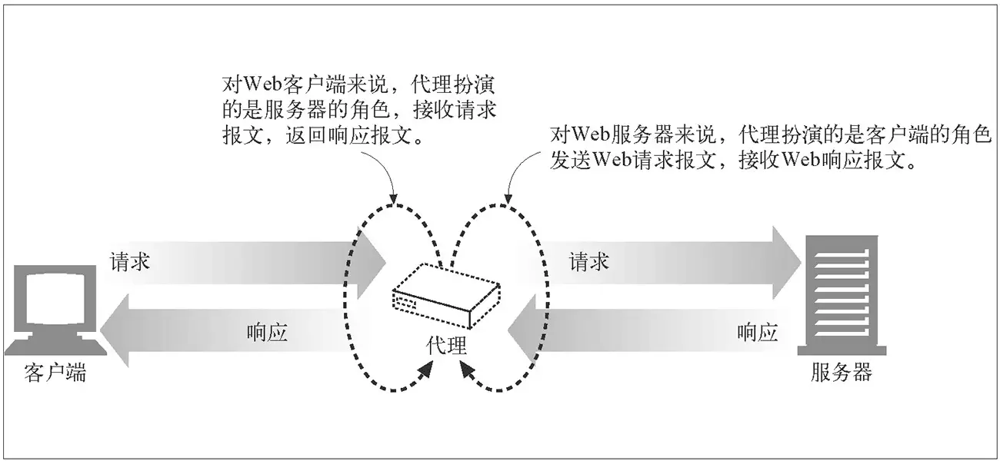
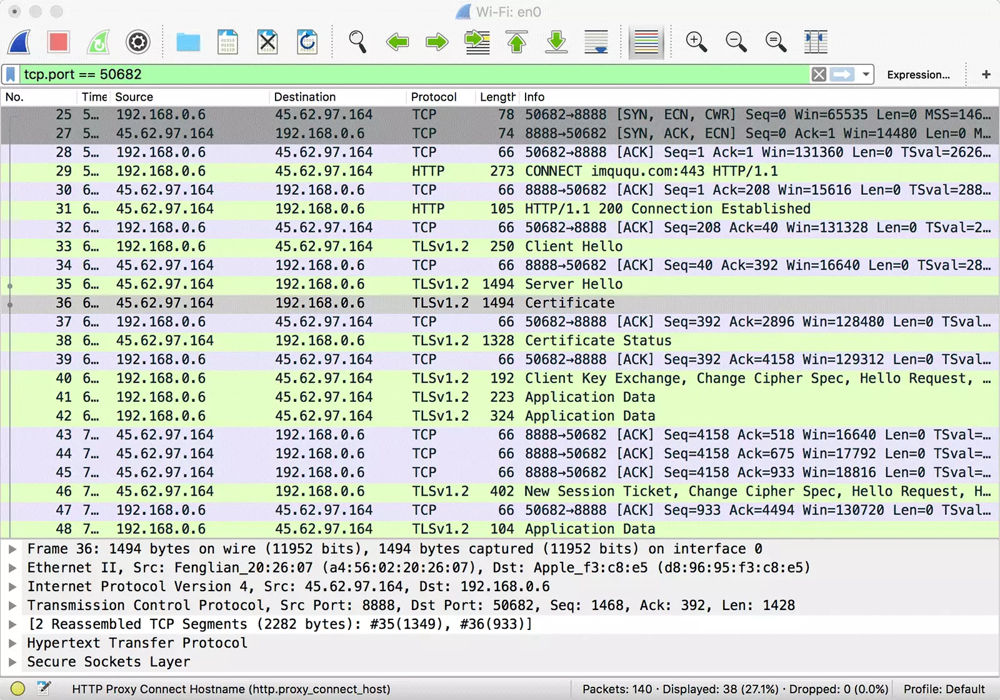
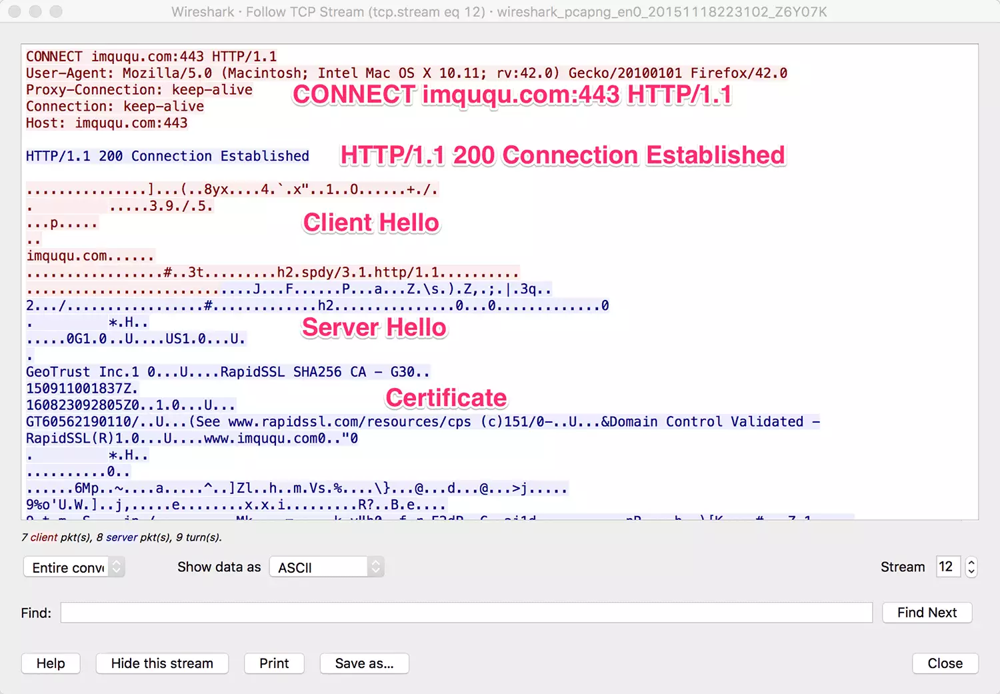
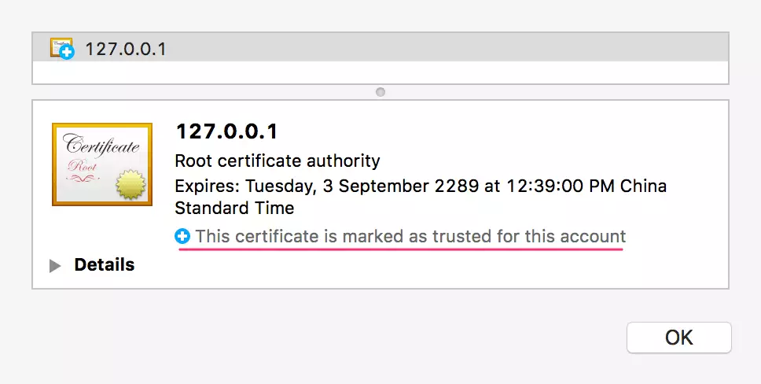

## HTTP代理原理及实现

### 简介

Web 代理是一种存在于网络中间的实体，提供各式各样的功能。现代网络系统中，Web 代理无处不在。

HTTP 代理存在 两种形式

- 第一种[RFC 7230 - HTTP/1.1: Message Syntax and Routing](http://tools.ietf.org/html/rfc7230)（即修订后的 RFC 2616，HTTP/1.1 协议的第一部分）描述的普通代理；这种代理扮演的是「中间人」角色，对于连接到它的客户端来说，它是服务端；对于要连接的服务端来说，它是客户端。它就负责在两端之间来回传送 HTTP 报文
- 第二种是 [Tunneling TCP based protocols through Web proxy servers](https://tools.ietf.org/html/draft-luotonen-web-proxy-tunneling-01)（通过 Web 代理服务器用隧道方式传输基于 TCP 的协议）描述的隧道代理。它通过 HTTP 协议正文部分（Body）完成通讯，以 HTTP 的方式实现任意基于 TCP 的应用层协议代理。这种代理使用 HTTP 的 CONNECT 方法建立连接，但 CONNECT 最开始并不是 RFC 2616 - HTTP/1.1 的一部分，直到 2014 年发布的 HTTP/1.1 修订版中，才增加了对 CONNECT 及隧道代理的描述，详见 [RFC 7231 - HTTP/1.1: Semantics and Content](https://tools.ietf.org/html/rfc7231#section-4.3.6)。实际上这种代理早就被广泛实现

本文描述的第一种代理，对应《HTTP 权威指南》一书中第六章「代理」；第二种代理，对应第八章「集成点：网关、隧道及中继」中的 8.5 小节「隧道」。

### 普通代理

第一种 Web 代理原理特别简单：

> HTTP 客户端向代理发送请求报文，代理服务器需要正确地处理请求和连接（例如正确处理 Connection: keep-alive），同时向服务器发送请求，并将收到的响应转发给客户端。

下面这张图片来自于《HTTP 权威指南》，直观地展示了上述行为：



假如我通过代理访问 A 网站，对于 A 来说，它会把代理当做客户端，完全察觉不到真正客户端的存在，这实现了隐藏客户端 IP 的目的。当然代理也可以修改 HTTP 请求头部，通过 `X-Forwarded-IP` 这样的自定义头部告诉服务端真正的客户端 IP。但服务器无法验证这个自定义头部真的是由代理添加，还是客户端修改了请求头，所以从 HTTP 头部字段获取 IP 时，需要格外小心。

给浏览器显式的指定代理，需要手动修改浏览器或操作系统相关设置，或者指定 PAC（Proxy Auto-Configuration，自动配置代理）文件自动设置，还有些浏览器支持 WPAD（Web Proxy Autodiscovery Protocol，Web 代理自动发现协议）。显式指定浏览器代理这种方式一般称之为正向代理，浏览器启用正向代理后，会对 HTTP 请求报文做一些修改，来规避老旧代理服务器的一些问题

还有一种情况是访问 A 网站时，实际上访问的是代理，代理收到请求报文后，再向真正提供服务的服务器发起请求，并将响应转发给浏览器。这种情况一般被称之为反向代理，它可以用来隐藏服务器 IP 及端口。一般使用反向代理后，需要通过修改 DNS 让域名解析到代理服务器 IP，这时浏览器无法察觉到真正服务器的存在，当然也就不需要修改配置了。反向代理是 Web 系统最为常见的一种部署方式

了解完第一种代理的基本原理后，我们用 Node.js 实现一下它。只包含核心逻辑的代码如下：

```javascript
var http = require('http');
var net = require('net');
var url = require('url');

function request(cReq, cRes) {
    var u = url.parse(cReq.url);

    var options = {
        hostname : u.hostname, 
        port     : u.port || 80,
        path     : u.path,       
        method     : cReq.method,
        headers     : cReq.headers
    };

    var pReq = http.request(options, function(pRes) {
        cRes.writeHead(pRes.statusCode, pRes.headers);
        pRes.pipe(cRes);
    }).on('error', function(e) {
        cRes.end();
    });

    cReq.pipe(pReq);
}

http.createServer().on('request', request).listen(8888, '0.0.0.0');
```

以上代码运行后，会在本地 `8888` 端口开启 HTTP 代理服务，这个服务从请求报文中解析出请求 URL 和其他必要参数，新建到服务端的请求，并把代理收到的请求转发给新建的请求，最后再把服务端响应返回给浏览器。修改浏览器的 HTTP 代理为 `127.0.0.1:8888` 后再访问 HTTP 网站，代理可以正常工作

但是，使用我们这个代理服务后，HTTPS 网站完全无法访问，这是为什么呢？答案很简单，这个代理提供的是 HTTP 服务，根本没办法承载 HTTPS 服务。那么是否把这个代理改为 HTTPS 就可以了呢？显然也不可以，因为这种代理的本质是中间人，而 HTTPS 网站的证书认证机制是中间人劫持的克星。普通的 HTTPS 服务中，服务端不验证客户端的证书，中间人可以作为客户端与服务端成功完成 TLS 握手；但是中间人没有证书私钥，无论如何也无法伪造成服务端跟客户端建立 TLS 连接。当然如果你拥有证书私钥，代理证书对应的 HTTPS 网站当然就没问题了

HTTP 抓包神器 Fiddler 的工作原理也是在本地开启 HTTP 代理服务，通过让浏览器流量走这个代理，从而实现显示和修改 HTTP 包的功能。如果要让 Fiddler 解密 HTTPS 包的内容，需要先将它自带的根证书导入到系统受信任的根证书列表中。一旦完成这一步，浏览器就会信任 Fiddler 后续的「伪造证书」，从而在浏览器和 Fiddler、Fiddler 和服务端之间都能成功建立 TLS 连接。而对于 Fiddler 这个节点来说，两端的 TLS 流量都是可以解密的。

如果我们不导入根证书，Fiddler 的 HTTP 代理还能代理 HTTPS 流量么？实践证明，不导入根证书，Fiddler 只是无法解密 HTTPS 流量，HTTPS 网站还是可以正常访问。这是如何做到的，这些 HTTPS 流量是否安全呢？这些问题将在下一节揭晓

### 隧道代理

第二种 Web 代理的原理也很简单：

> HTTP 客户端通过 CONNECT 方法请求隧道代理创建一条到达任意目的服务器和端口的 TCP 连接，并对客户端和服务器之间的后继数据进行盲转发。

下面这张图片同样来自于《HTTP 权威指南》，直观地展示了上述行为：


假如我通过代理访问 A 网站，浏览器首先通过 CONNECT 请求，让代理创建一条到 A 网站的 TCP 连接；一旦 TCP 连接建好，代理无脑转发后续流量即可。所以这种代理，理论上适用于任意基于 TCP 的应用层协议，HTTPS 网站使用的 TLS 协议当然也可以。这也是这种代理为什么被称为隧道的原因。对于 HTTPS 来说，客户端透过代理直接跟服务端进行 TLS 握手协商密钥，所以依然是安全的，下图中的抓包信息显示了这种场景



可以看到，浏览器与代理进行 TCP 握手之后，发起了 CONNECT 请求，报文起始行如下：

> CONNECT imququ.com:443 HTTP/1.1

对于 CONNECT 请求来说，只是用来让代理创建 TCP 连接，所以只需要提供服务器域名及端口即可，并不需要具体的资源路径。代理收到这样的请求后，需要与服务端建立 TCP 连接，并响应给浏览器这样一个 HTTP 报文：

> HTTP/1.1 200 Connection Established

浏览器收到了这个响应报文，就可以认为到服务端的 TCP 连接已经打通，后续直接往这个 TCP 连接写协议数据即可。通过 Wireshark 的 Follow TCP Steam 功能，可以清楚地看到浏览器和代理之间的数据传递：



可以看到，浏览器建立到服务端 TCP 连接产生的 HTTP 往返，完全是明文，这也是为什么 CONNECT 请求只需要提供域名和端口：如果发送了完整 URL、Cookie 等信息，会被中间人一览无余，降低了 HTTPS 的安全性。HTTP 代理承载的 HTTPS 流量，应用数据要等到 TLS 握手成功之后通过 Application Data 协议传输，中间节点无法得知用于流量加密的 master-secret，无法解密数据。而 CONNECT 暴露的域名和端口，对于普通的 HTTPS 请求来说，中间人一样可以拿到（IP 和端口很容易拿到，请求的域名可以通过 DNS Query 或者 TLS Client Hello 中的 Server Name Indication 拿到），所以这种方式并没有增加安全性。

了解完原理后，再用 Node.js 实现一个支持 CONNECT 的代理也很简单。核心代码如下：

```javascript
var http = require('http');
var net = require('net');
var url = require('url');

function connect(cReq, cSock) {
    var u = url.parse('http://' + cReq.url);

    var pSock = net.connect(u.port, u.hostname, function() {
        cSock.write('HTTP/1.1 200 Connection Established\r\n\r\n');
        pSock.pipe(cSock);
    }).on('error', function(e) {
        cSock.end();
    });

    cSock.pipe(pSock);
}

http.createServer().on('connect', connect).listen(8888, '0.0.0.0');
```

以上代码运行后，会在本地 `8888` 端口开启 HTTP 代理服务，这个服务从 CONNECT 请求报文中解析出域名和端口，创建到服务端的 TCP 连接，并和 CONNECT 请求中的 TCP 连接串起来，最后再响应一个 Connection Established 响应。修改浏览器的 HTTP 代理为 `127.0.0.1:8888` 后再访问 HTTPS 网站，代理可以正常工作。

最后，将两种代理的实现代码合二为一，就可以得到全功能的 Proxy 程序了，全部代码在 50 行以内（当然异常什么的基本没考虑）

```javascript
var http = require('http');
var net = require('net');
var url = require('url');

function request(cReq, cRes) {
    var u = url.parse(cReq.url);

    var options = {
        hostname : u.hostname, 
        port     : u.port || 80,
        path     : u.path,       
        method     : cReq.method,
        headers     : cReq.headers
    };

    var pReq = http.request(options, function(pRes) {
        cRes.writeHead(pRes.statusCode, pRes.headers);
        pRes.pipe(cRes);
    }).on('error', function(e) {
        cRes.end();
    });

    cReq.pipe(pReq);
}

function connect(cReq, cSock) {
    var u = url.parse('http://' + cReq.url);

    var pSock = net.connect(u.port, u.hostname, function() {
        cSock.write('HTTP/1.1 200 Connection Established\r\n\r\n');
        pSock.pipe(cSock);
    }).on('error', function(e) {
        cSock.end();
    });

    cSock.pipe(pSock);
}

http.createServer()
    .on('request', request)
    .on('connect', connect)
    .listen(8888, '0.0.0.0');
```

需要注意的是，大部分浏览器显式配置了代理之后，只会让 HTTPS 网站走隧道代理，这是因为建立隧道需要耗费一次往返，能不用就尽量不用。但这并不代表 HTTP 请求不能走隧道代理，我们用 Node.js 写段程序验证下（先运行前面的代理服务）：

```javascript
var http = require('http');

var options = {
    hostname : '127.0.0.1',
    port     : 8888,
    path     : 'imququ.com:80',
    method     : 'CONNECT'
};

var req = http.request(options);

req.on('connect', function(res, socket) {
    socket.write('GET / HTTP/1.1\r\n' +
                 'Host: imququ.com\r\n' +
                 'Connection: Close\r\n' +
                 '\r\n');

    socket.on('data', function(chunk) {
        console.log(chunk.toString());
    });

    socket.on('end', function() {
        console.log('socket end.');
    });
});

req.end();
```

这段代码运行完，结果如下：

```http
HTTP/1.1 301 Moved Permanently
Server: nginx
Date: Thu, 19 Nov 2015 15:57:47 GMT
Content-Type: text/html
Content-Length: 178
Connection: close
Location: https://imququ.com/

<html>
<head><title>301 Moved Permanently</title></head>
<body bgcolor="white">
<center><h1>301 Moved Permanently</h1></center>
<hr><center>nginx</center>
</body>
</html>

socket end.
```

可以看到，通过 CONNECT 让代理打开到目标服务器的 TCP 连接，用来承载 HTTP 流量也是完全没问题的。

最后，HTTP 的认证机制可以跟代理配合使用，使得必须输入正确的用户名和密码才能使用代理，这部分内容比较简单，这里略过。

### HTTPS代理

普通代理可以用来承载 HTTP 流量；隧道代理可以用来承载任何 TCP 流量，包括 HTTP 和 HTTPS，他们是一个标准的 HTTP 服务，针对浏览器的普通请求和 `CONNECT` 请求，进行不同的处理。Node.js 为创建 HTTP 或 HTTPS Server 提供了高度一致的接口，要将 HTTP 服务升级为 HTTPS 特别方便，只有一点点准备工作要做

我们知道 TLS 有三大功能：内容加密、身份认证和数据完整性。其中内容加密依赖于密钥协商机制；数据完整性依赖于 MAC（Message authentication code）校验机制；而身份认证则依赖于证书认证机制。一般操作系统或浏览器会维护一个受信任根证书列表，包含在列表之中的证书，或者由列表中的证书签发的证书都会被客户端信任

提供 HTTPS 服务的证书可以自己生成，然后手动加入到系统根证书列表中。但是对外提供服务的 HTTPS 网站，不可能要求每个用户都手动导入你的证书，所以更常见的做法是向 CA（Certificate Authority，证书颁发机构）申请。根据证书的不同级别，CA 会进行不同级别的验证，验证通过后 CA 会用他们的证书签发网站证书，这个过程通常是收费的（有免费的证书，最近免费的 [Let's Encrypt](https://letsencrypt.org/) 也很火，这里不多介绍）。由于 CA 使用的证书都是由广泛内置在各系统中的根证书签发，所以从 CA 获得的网站证书会被绝大部分客户端信任。

通过 CA 申请证书很简单，本文为了方便演示，采用自己签发证书的偷懒办法。现在广泛使用的证书是 x509.v3 格式，使用以下命令可以创建：

```shell
openssl genrsa -out private.pem 2048
openssl req -new -x509 -key private.pem -out public.crt -days 99999
```

第二行命令运行后，需要填写一些证书信息。需要注意的是 `Common Name` 一定要填写后续提供 HTTPS 服务的域名或 IP。例如你打算在本地测试，`Common Name` 可以填写 `127.0.0.1`。证书创建好之后，再将 `public.crt` 添加到系统受信任根证书列表中。为了确保添加成功，可以用浏览器验证一下：



接着，可以改造之前的 Node.js 代码了，需要改动的地方不多

```javascript
var http = require('http');
var https = require('https');
var fs = require('fs');
var net = require('net');
var url = require('url');

function request(cReq, cRes) {
    var u = url.parse(cReq.url);

    var options = {
        hostname : u.hostname, 
        port     : u.port || 80,
        path     : u.path,       
        method     : cReq.method,
        headers     : cReq.headers
    };

    var pReq = http.request(options, function(pRes) {
        cRes.writeHead(pRes.statusCode, pRes.headers);
        pRes.pipe(cRes);
    }).on('error', function(e) {
        cRes.end();
    });

    cReq.pipe(pReq);
}

function connect(cReq, cSock) {
    var u = url.parse('http://' + cReq.url);

    var pSock = net.connect(u.port, u.hostname, function() {
        cSock.write('HTTP/1.1 200 Connection Established\r\n\r\n');
        pSock.pipe(cSock);
    }).on('error', function(e) {
        cSock.end();
    });

    cSock.pipe(pSock);
}

var options = {
    key: fs.readFileSync('./private.pem'),
    cert: fs.readFileSync('./public.crt')
};

https.createServer(options)
    .on('request', request)
    .on('connect', connect)
    .listen(8888, '0.0.0.0');
```

可以看到，除了将 `http.createServer` 换成 `https.createServer`，增加证书相关配置之外，这段代码没有任何改变。这也是引入 TLS 层的妙处，应用层不需要任何改动，就能获得诸多安全特性。

运行服务后，只需要将浏览器的代理设置为 `HTTPS 127.0.0.1:8888` 即可，功能照旧。这样改造，只是将浏览器到代理之间的流量升级为了 HTTPS，代理自身逻辑、与服务端的通讯方式，都没有任何变化。

### 参考文章

https://imququ.com/post/web-proxy.html

https://imququ.com/post/web-proxy-2.html