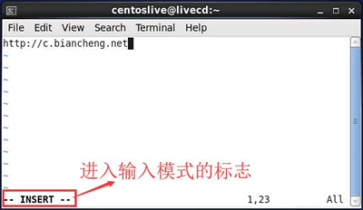

### Linux tar 打包（归档）压缩

归档，也称为打包，指的是一个文件或目录的集合，而这个集合被存储在一个文件中。归档文件没有经过压缩，因此，它占用的空间是其中所有文件和目录的总和。

压缩文件也是一个文件和目录的集合，且这个集合也被存储在一个文件中，但它们的不同之处在于，压缩文件采用了不同的存储方式，使其所占用的磁盘空间比集合中所有文件大小的总和要小。

压缩是指利用算法将文件进行处理，已达到保留最大文件信息，而让文件体积变小的目的。其基本原理为，通过查找文件内的重复字节，建立一个相同字节的词典文件，并用一个代码表示。比如说，在压缩文件中，有不止一处出现了 "C语言中文网"，那么，在压缩文件时，这个词就会用一个代码表示并写入词典文件，这样就可以实现缩小文件体积的目的。

由于计算机处理的信息是以二进制的形式表示的，因此，压缩软件就是把二进制信息中相同的字符串以特殊字符标记，只要通过合理的数学计算，文件的体积就能够被大大压缩。把一个或者多个文件用压缩软件进行压缩，形成一个文件压缩包，既可以节省存储空间，有方便在网络上传送。

对文件进行压缩，很可能损坏文件中的内容，因此，压缩又可以分为有损压缩和无损压缩。无损压缩很好理解，指的是压缩数据必须准确无误；有损压缩指的是即便丢失个别的数据，对文件也不会造成太大的影响。有损压缩广泛应用于动画、声音和图像文件中，典型代表就是影碟文件格式 mpeg、音乐文件格式 mp3 以及图像文件格式 jpg

采用压缩工具对文件进行压缩，生成的文件称为压缩包，该文件的体积通常只有原文件的一半甚至更小。需要注意的是，压缩包中的数据无法直接使用，使用前需要利用压缩工具将文件数据还原，此过程又称解压缩

Linux 下，常用归档命令有 2 个，分别是 tar 和 dd（相对而言，tar 的使用更为广泛）；常用的压缩命令有很多，比如 gzip、zip、bzip2

#### tar打包命令详解

最常用的归档（打包）命令就是 tar，该命令可以将许多文件一起保存到一个单独的磁带或磁盘中进行归档。不仅如此，该命令还可以从归档文件中还原所需文件，也就是打包的反过程，称为解打包。

> 使用 tar 命令归档的包通常称为 tar 包（tar 包文件都是以“.tar”结尾的）。

当 tar 命令用于打包操作时，该命令的基本格式为：

```bash
[root@localhost ~]#tar [选项] 源文件或目录
```

此命令常用的选项及各自的含义如表所示

| 选项    | 含义                                                         |
| ------- | ------------------------------------------------------------ |
| -c      | 将多个文件或目录进行打包。                                   |
| -A      | 追加 tar 文件到归档文件。                                    |
| -f 包名 | 指定包的文件名。包的扩展名是用来给管理员识别格式的，所以一定要正确指定扩展名； |
| -v      | 显示打包文件过程；                                           |

需要注意的是，在使用 tar 命令指定选项时可以不在选项前面输入“-”。例如，使用“cvf”选项和 “-cvf”起到的作用一样。

```bash
tar -cvf anaconda-ks.cfg.tar anaconda-ks.cfg
#把anacondehks.cfg打包为 anacondehks.cfg.tar文件
```

选项 "-cvf" 一般是习惯用法，记住打包时需要指定打包之后的文件名，而且要用 ".tar" 作为扩展名。打包目录也是如此：

```shell
ll -d test/
drwxr-xr-x 2 root root 4096 6月 17 21:09 test/
#test是我们之前的测试目录
tar -cvf test.tar test/
test/
test/test3
test/test2
test/test1
#把目录打包为test.tar文件
# tar命令也可以打包多个文件或目录，只要用空格分开即可。例如:
tar -cvf ana.tar anaconda-ks.cfg /tmp/
#把anaconda-ks.cfg文件和/tmp目录打包成ana.tar文件包
```

打包并压缩目录。
首先声明一点，压缩命令不能直接压缩目录，必须先用 tar 命令将目录打包，然后才能用 gzip 命令或 bzip2 命令对打包文件进行压缩

```shell
ll -d test test.tar
drwxr-xr-x 2 root root 4096 6月 17 21:09 test
-rw-r--r-- 1 root root 10240 6月 18 01:06 test.tar
#我们之前已经把test目录打包成test.tar文件
gzip test.tar
ll test.tar.gz
-rw-r--r-- 1 root root 176 6月 18 01:06 test.tar.gz
#gzip命令会把test.tar压缩成test.tar.gz
```

#### tar命令做解打包操作

当 tar 命令用于对 tar 包做解打包操作时，该命令的基本格式如下：

```shell
[root@localhost ~]#tar [选项] 压缩包
```

当用于解打包时，常用的选项与含义如表 2 所示。

| 选项    | 含义                                                       |
| ------- | ---------------------------------------------------------- |
| -x      | 对 tar 包做解打包操作。                                    |
| -f      | 指定要解压的 tar 包的包名。                                |
| -t      | 只查看 tar 包中有哪些文件或目录，不对 tar 包做解打包操作。 |
| -C 目录 | 指定解打包位置。                                           |
| -v      | 显示解打包的具体过程。                                     |

其实解打包和打包相比，只是把打包选项 "-cvf" 更换为 "-xvf"

```shell
tar -xvf anaconda-ks.cfg. tar
#解打包到当前目录下
```

如果使用 "-xvf" 选项，则会把包中的文件解压到当前目录下。如果想要指定解压位置，则需要使用 "-C(大写)" 选项。例如：

```shell
tar -xvf test.tar -C /tmp
#把文件包test.tar解打包到/tmp/目录下
```

如果只想查看文件包中有哪些文件，则可以把解打包选项 "-x" 更换为测试选项 "-t"。例如：

```shell
tar -tvf test.tar
drwxr-xr-x root/root 0 2016-06-17 21:09 test/
-rw-r-r- root/root 0 2016-06-17 17:51 test/test3
-rw-r-r- root/root 0 2016-06-17 17:51 test/test2
-rw-r-r- root/root 0 2016-06-17 17:51 test/test1
#会用长格式显示test.tar文件包中文件的详细信息
```

#### tar命令做打包压缩（解压缩解打包）操作

你可能会觉得 Linux 实在太不智能了，一个打包压缩，居然还要先打包成 ".tar" 格式，再压缩成 ".tar.gz" 或 ".tar.bz2" 格式。其实 tar 命令是可以同时打包压缩的，前面的讲解之所打包和压缩分开，是为了让大家了解在 Linux 中打包和压缩的不同。

当 tar 命令同时做打包压缩的操作时，其基本格式如下

```shell
tar [选项] 压缩包 源文件或目录
```

此处常用的选项有以下 2 个，分别是：

- -z：压缩和解压缩 ".tar.gz" 格式；
- -j：压缩和解压缩 ".tar.bz2"格式。

压缩与解压缩 ".tar.gz"格式。

```shell
tar -zcvf tmp.tar.gz /tmp/
#把/tmp/目录直接打包压缩为".tar.gz"格式，通过"-z"来识别格式，"-cvf"和打包选项一致
```

解压缩也只是在解打包选项 "-xvf" 前面加了一个 "-z" 选项

```shell
tar -zxvf tmp.tar.gz
#解压缩与解打包".tar.gz"格式
```

前面讲的选项 "-C" 用于指定解压位置、"-t" 用于查看压缩包内容，在这里同样适用。

压缩与解压缩 ".tar.bz2" 格式。

和".tar.gz"格式唯一的不同就是"-zcvf"选项换成了 "-jcvf"，如下所示：

```shell
tar -jcvf tmp.tar.bz2 /tmp/
#打包压缩为".tar.bz2"格式，注意压缩包文件名
tar -jxvf tmp.tar.bz2
#解压缩与解打包".tar.bz2"格式
```

把文件直接压缩成".tar.gz"和".tar.bz2"格式，才是 Linux 中最常用的压缩方式

tar 命令最初被用来在磁带上创建备份，现在可以在任何设备上创建备份。利用 tar 命令可以把一大堆的文件和目录打包成一个文件，这对于备份文件或是将几个文件组合成为一个文件进行网络传输是非常有用的

### Linux zip命令：压缩文件或目录

我们经常会在 Windows 系统上使用 “.zip”格式压缩文件，其实“.zip”格式文件是 Windows 和 Linux 系统都通用的压缩文件类型，属于几种主流的压缩格式（zip、rar等）之一，是一种相当简单的分别压缩每个文件的存储格式

本节要讲的 zip 命令，类似于 Windows 系统中的 winzip 压缩程序，其基本格式如下：

```shell
zip [选项] 压缩包名 源文件或源目录列表
```

注意，zip 压缩命令需要手工指定压缩之后的压缩包名，注意写清楚扩展名，以便解压缩时使用。

该命令常用的几个选项及各自的含义如表所示。

| 选项      | 含义                                                         |
| --------- | ------------------------------------------------------------ |
| -r        | 递归压缩目录，及将制定目录下的所有文件以及子目录全部压缩。   |
| -m        | 将文件压缩之后，删除原始文件，相当于把文件移到压缩文件中。   |
| -v        | 显示详细的压缩过程信息。                                     |
| -q        | 在压缩的时候不显示命令的执行过程。                           |
| -压缩级别 | 压缩级别是从 1~9 的数字，-1 代表压缩速度更快，-9 代表压缩效果更好。 |
| -u        | 更新压缩文件，即往压缩文件中添加新文件。                     |

zip 命令的基本使用

```shell
[root@localhost ~]# zip ana.zip anaconda-ks.cfg
adding: anaconda-ks.cfg (deflated 37%)
#压缩
[root@localhost ~]# ll ana.zip
-rw-r--r-- 1 root root 935 6月 1716:00 ana.zip
#压缩文件生成
```

不仅如此，所有的压缩命令都可以同时压缩多个文件，例如：

```shell
[root@localhost ~]# zip test.zip install.log install.log.syslog
adding: install.log (deflated 72%)
adding: install.log.syslog (deflated 85%)
#同时压缩多个文件到test.zip压缩包中
[root@localhost ~]#ll test.zip
-rw-r--r-- 1 root root 8368 6月 1716:03 test.zip
#压缩文件生成
```

使用 zip 命令压缩目录，需要使用“-r”选项，例如：

```shell
[root@localhost ~]# mkdir dir1
#建立测试目录
[root@localhost ~]# zip -r dir1.zip dir1
adding: dir1/(stored 0%)
#压缩目录
[root@localhost ~]# ls -dl dir1.zip
-rw-r--r-- 1 root root 160 6月 1716:22 dir1.zip
#压缩文件生成
```

### Linux unzip命令：解压zip文件

unzip 命令可以查看和解压缩 zip 文件。该命令的基本格式如下：

```shell
[root@localhost ~]# unzip [选项] 压缩包名
```

此命令常用的选项以及各自的含义如表所示。

| 选项        | 含义                                                         |
| ----------- | ------------------------------------------------------------ |
| -d 目录名   | 将压缩文件解压到指定目录下。                                 |
| -n          | 解压时并不覆盖已经存在的文件。                               |
| -o          | 解压时覆盖已经存在的文件，并且无需用户确认。                 |
| -v          | 查看压缩文件的详细信息，包括压缩文件中包含的文件大小、文件名以及压缩比等，但并不做解压操作。 |
| -t          | 测试压缩文件有无损坏，但并不解压。                           |
| -x 文件列表 | 解压文件，但不包含文件列表中指定的文件。                     |

不论是文件压缩包，还是目录压缩包，都可以直接解压缩

```shell
[root@localhost ~]# unzip dir1.zip
Archive: dir1.zip
creating: dirl/
#解压缩
```

使用 -d 选项手动指定解压缩位置，例如：

```shell
[root@localhost ~]# unzip -d /tmp/ ana.zip
Archive: ana.zip
inflating: /tmp/anaconda-ks.cfg
#把压缩包解压到指定位置
```

### Linux gzip命令：压缩文件或目录

gzip 是 Linux 系统中经常用来对文件进行压缩和解压缩的命令，通过此命令压缩得到的新文件，其扩展名通常标记为“.gz”。

再强调一下，gzip 命令只能用来压缩文件，不能压缩目录，即便指定了目录，也只能压缩目录内的所有文件。

gzip 命令的基本格式如下：

```shell
[root@localhost ~]# gzip [选项] 源文件
```

命令中的源文件，当进行压缩操作时，指的是普通文件；当进行解压缩操作时，指的是压缩文件。该命令常用的选项及含义如表 1 所示。

| 选项  | 含义                                                         |
| ----- | ------------------------------------------------------------ |
| -c    | 将压缩数据输出到标准输出中，并保留源文件。                   |
| -d    | 对压缩文件进行解压缩。                                       |
| -r    | 递归压缩指定目录下以及子目录下的所有文件。                   |
| -v    | 对于每个压缩和解压缩的文件，显示相应的文件名和压缩比。       |
| -l    | 对每一个压缩文件，显示以下字段：<br />压缩文件的大小；<br />未压缩文件的大小；<br />压缩比；<br />未压缩文件的名称。 |
| -数字 | 用于指定压缩等级，-1 压缩等级最低，压缩比最差；-9 压缩比最高。默认压缩比是 -6。 |

【例 1】基本压缩。
gzip 压缩命令非常简单，甚至不需要指定压缩之后的压缩包名，只需指定源文件名即可。我们来试试：

```shell
[root@localhost ~]# gzip install.log
#压缩instal.log 文件
[root@localhost ~]# ls
anaconda-ks.cfg install.log.gz install.log.syslog
#压缩文件生成，但是源文件也消失了
```

【例 2】保留源文件压缩。
在使用 gzip 命令压缩文件时，源文件会消失，从而生成压缩文件。这时有些人会有强迫症，就逼问笔者：能不能在压缩文件的时候，不让源文件消失？好吧，也是可以的，不过很别扭。

```shell
[root@localhost ~]# gzip -c anaconda-ks.cfg >anaconda-ks.cfg.gz
#使用-c选项，但是不让压缩数据输出到屏幕上，而是重定向到压缩文件中，这样可以缩文件的同时不删除源文件
[root@localhost ~]# ls
anaconda-ks.cfg anaconda-ks.cfg.gz install.log.gz install.log.syslog
#可以看到压缩文件和源文件都存在
```

【例 3】 压缩目录。
我们可能会想当然地认为 gzip 命令可以压缩目录。 我们来试试：

```shell
[root@localhost ~]# mkdir test
[root@localhost ~]# touch test/test1
[root@localhost ~]# touch test/test2
[root@localhost ~]# touch test/test3 #建立测试目录，并在里面建立几个测试文件
[root@localhost ~]# gzip -r test/
#压缩目录，并没有报错
[root@localhost ~]# ls
anaconda-ks.cfg anaconda-ks.cfg.gz install.log.gz install.log.syslog test
#但是查看发现test目录依然存在，并没有变为压缩文件
[root@localhost ~]# ls test/
testl .gz test2.gz test3.gz
#原来gzip命令不会打包目录，而是把目录下所有的子文件分别压缩
```

在 Linux 中，打包和压缩是分开处理的。而 gzip 命令只会压缩，不能打包，所以才会出现没有打包目录，而只把目录下的文件进行压缩的情况。

### Linux gunzip命令：解压缩文件或目录

gunzip 是一个使用广泛的解压缩命令，它用于解压被 gzip 压缩过的文件（扩展名为 .gz）。

> 对于解压被 gzip 压缩过的文件，还可以使用 gzip 自己，即 gzip -d 压缩包。

gunzip 命令的基本格式为：

```shell
[root@localhost ~]# gunzip [选项] 文件
```

该命令常用的选项及含义如表所示。

| 选项 | 含义                                               |
| ---- | -------------------------------------------------- |
| -r   | 递归处理，解压缩指定目录下以及子目录下的所有文件。 |
| -c   | 把解压缩后的文件输出到标准输出设备。               |
| -f   | 强制解压缩文件，不理会文件是否已存在等情况。       |
| -l   | 列出压缩文件内容。                                 |
| -v   | 显示命令执行过程。                                 |
| -t   | 测试压缩文件是否正常，但不对其做解压缩操作。       |

【例 1】直接解压缩文件。

```shell
[root@localhost ~]# gunzip install.log.gz
```

当然，"gunzip -r"依然只会解压缩目录下的文件，而不会解打包。要想解压缩".gz"格式，还可以使用 "gzip -d"命令，例如：

```shell
[root@localhost ~]# gzip -d anaconda-ks.cfg.gz
```

【例 2】要解压缩目录下的内容，则需使用 "-r" 选项，例如：

```shell
[root@localhost ~]# gunzip -r test/
```

注意，如果我们压缩的是一个纯文本文件，则可以直接使用 zcat 命令在不解压缩的情况下查看这个文本文件中的内容。例如：

```shell
[root@localhost ~]# zcat anaconda-ks.cfg.gz
```

### Linux bzip2命令：压缩文件（.bz2格式）

bzip2 命令同 gzip 命令类似，只能对文件进行压缩（或解压缩），对于目录只能压缩（或解压缩）该目录及子目录下的所有文件。当执行压缩任务完成后，会生成一个以“.bz2”为后缀的压缩包

".bz2"格式是 Linux 的另一种压缩格式，从理论上来讲，".bz2"格式的算法更先进、压缩比更好；而 ".gz"格式相对来讲的时间更快。

bzip2 命令的基本格式如下：

```shell
[root@localhost ~]# bzip2 [选项] 源文件
```

源文件指的要压缩或解压缩的文件，该命令常用的选项及各自的含义如表 1 所示。

| 选项  | 含义                                                         |
| ----- | ------------------------------------------------------------ |
| -d    | 执行解压缩，此时该选项后的源文件应为标记有 .bz2 后缀的压缩包文件。 |
| -k    | bzip2 在压缩或解压缩任务完成后，会删除原始文件，若要保留原始文件，可使用此选项。 |
| -f    | bzip2 在压缩或解压缩时，若输出文件与现有文件同名，默认不会覆盖现有文件，若使用此选项，则会强制覆盖现有文件。 |
| -t    | 测试压缩包文件的完整性。                                     |
| -v    | 压缩或解压缩文件时，显示详细信息。                           |
| -数字 | 这个参数和 gzip 命令的作用一样，用于指定压缩等级，-1 压缩等级最低，压缩比最差；-9 压缩比最高 |

注意，gzip 只是不会打包目录，但是如果使用“-r”选项，则可以分别压缩目录下的每个文件；而 bzip2 命令则根本不支持压缩目录，也没有“-r”选项。

【例 1】直接压缩文件。

```shell
[root@localhost ~]# bzip2 anaconda-ks.cfg
#压缩成".bz2"格式
```

此压缩命令会在压缩的同时删除源文件。

【例 2】压缩的同时保留源文件。

```bash
[root@localhost ~]# bzip2 -k install.log.syslog
#压缩
[root@localhost ~]# ls
anaconda-ks.cfg.bz2 install.loginstalLlogsyslog install.logsyslogbz2
#压缩文件和源文件都存在
```

### Linux bunzip2命令：bz2格式的解压缩命令

要解压“.bz2”格式的压缩包文件，除了使用“bzip2 -d 压缩包名”命令外，还可以使用 bunzip2 命令。

bunzip2 命令的使用和 gunzip 命令大致相同，bunzip2 命令只能用于解压文件，即便解压目录，也是解压该目录以及所含子目录下的所有文件。

bunzip2 命令的基本格式为：

```shell
[root@localhost ~]# bunzip2 [选项] 源文件
```

此命令常用的选项以及各自的含义，如表 1 所示。

| 选项 | 含义                                                         |
| ---- | ------------------------------------------------------------ |
| -k   | 解压缩后，默认会删除原来的压缩文件。若要保留压缩文件，需使用此参数。 |
| -f   | 解压缩时，若输出的文件与现有文件同名时，默认不会覆盖现有的文件。若要覆盖，可使用此选项。 |
| -v   | 显示命令执行过程。                                           |
| -L   | 列出压缩文件内容。                                           |

先试试使用 bunzip2 命令来进行解压缩，例如：

```shell
[root@localhost ~]# bunzip2 anaconda-ks.cfg.bz2
```

".bz2" 格式也可以使用 "bzip2 -d 压缩包" 命令来进行解压缩，例如：

```shell
[root@localhost ~]# bzip2 -d install.log.syslog.bz2
```

和 ".gz" 格式一样，".bz2" 格式压缩的纯文本文件也可以不解压缩直接查看，使用的命令是 bzcat。例如：

```shell
[root@localhost ~]# bzcat install.log.syslog.bz2
```

## Vim 文本编辑器

Vim 编辑文件时，存在 3 种工作模式，分别是命令模式、输入模式和编辑模式，这 3 种工作模式可随意切换，如图 1 所示


### Vim的命令模式

使用 Vim 编辑文件时，默认处于命令模式。此模式下，可使用方向键（上、下、左、右键）或 k、j、h、i 移动光标的位置，还可以对文件内容进行复制、粘贴、替换、删除等操作。

图 2 所示是在 CentOS 6.x 系统中 Vim 处于命令模式的状态示意图。


### Vim的输入模式

在输入模式下，Vim 可以对文件执行写操作，类似于在 Windows 系统的文档中输入内容。

使 Vim 进行输入模式的方式是在命令模式状态下输入 i、I、a、A、o、O 等插入命令（各指令的具体功能如表 3 所示），当编辑文件完成后按 Esc 键即可返回命令模式。

| 快捷键 | 功能描述                                                     |
| ------ | ------------------------------------------------------------ |
| i      | 在当前光标所在位置插入随后输入的文本，光标后的文本相应向右移动 |
| I      | 在光标所在行的行首插入随后输入的文本，行首是该行的第一个非空白字符，相当于光标移动到行首执行 i 命令 |
| o      | 在光标所在行的下面插入新的一行。光标停在空行首，等待输入文本 |
| O      | 在光标所在行的上面插入新的一行。光标停在空行的行首，等待输入文本 |
| a      | 在当前光标所在位置之后插入随后输入的文本                     |
| A      | 在光标所在行的行尾插入随后输入的文本，相当于光标移动到行尾再执行a命令 |

图 4 所示即为 Vim 处于输入模式状态下的示意图。



### Vim 的编辑模式

编辑模式用于对文件中的指定内容执行保存、查找或替换等操作。

使 Vim 切换到编辑模式的方法是在命令模式状态下按“：”键，此时 Vim 窗口的左下方出现一个“：”符号，这是就可以输入相关指令进行操作了。

指令执行后 Vim 会自动返回命令模式。如想直接返回命令模式，按 Esc 即可。

图 4 所示为 Vim 进入编辑模式后的状态。


### Linux Vim基本操作（文件的打开和编辑）完全攻略（有图有真相）

我们还可以利用下表中打开文件的命令格式，针对特定情形使用适当的打开方式，可以大大提高我们的效率。

| Vi 使用的选项          | 说 明                                             |
| ---------------------- | ------------------------------------------------- |
| vim filename           | 打开或新建一个文件，并将光标置于第一行的首部      |
| vim -r filename        | 恢复上次 vim 打开时崩溃的文件                     |
| vim -R filename        | 把指定的文件以只读方式放入 Vim 编辑器中           |
| vim + filename         | 打开文件，并将光标置于最后一行的首部              |
| vi +n filename         | 打开文件，并将光标置于第 n 行的首部               |
| vi +/pattern filename  | 打幵文件，并将光标置于第一个与 pattern 匹配的位置 |
| vi -c command filename | 在对文件进行编辑前，先执行指定的命令              |

同样，Vim 提供了大量的编辑快捷键，主要可分为以下几类。

#### Vim 插入文本

从命令模式进入输入模式进行编辑，可以按下 I、i、O、o、A、a 等键来完成，使用不同的键，光标所处的位置不同，如表 3 所示。

| 快捷键    | 功能描述                                                     |
| --------- | ------------------------------------------------------------ |
| i         | 在当前光标所在位置插入随后输入的文本，光标后的文本相应向右移动 |
| I         | 在光标所在行的行首插入随后输入的文本，行首是该行的第一个非空白字符，相当于光标移动到行首执行 i 命令 |
| o         | 在光标所在行的下面插入新的一行。光标停在空行首，等待输入文本 |
| O（大写） | 在光标所在行的上面插入新的一行。光标停在空行的行首，等待输入文本 |
| a         | 在当前光标所在位置之后插入随后输入的文本                     |
| A         | 在光标所在行的行尾插入随后输入的文本，相当于光标移动到行尾再执行 a 命令 |

#### Vim 查找文本

| 快捷键 | 功能描述                         |
| ------ | -------------------------------- |
| /abc   | 从光标所在位置向前查找字符串 abc |
| /^abc  | 查找以 abc 为行首的行            |
| /abc$  | 查找以 abc 为行尾的行            |
| ?abc   | 从光标所在为主向后查找字符串 abc |
| n      | 向同一方向重复上次的查找指令     |
| N      | 向相反方向重复上次的查找指定     |

在查找过程中需要注意的是，要查找的字符串是严格区分大小写的，如查找 "shenchao" 和 "ShenChao" 会得到不同的结果。

> 如果想忽略大小写，则输入命令 ":set ic"；调整回来输入":set noic"。
>
> 如果在字符串中出现特殊符号，则需要加上转义字符 "\"。常见的特殊符号有 \、*、?、$ 等。如果出现这些字符，例如，要查找字符串 "10$"，则需要在命令模式中输入 "/10\$"。

#### Vim 替换文本

| 快捷键             | 功能描述                                                     |
| ------------------ | ------------------------------------------------------------ |
| r                  | 替换光标所在位置的字符                                       |
| R                  | 从光标所在位置开始替换字符，其输入内容会覆盖掉后面等长的文本内容，按“Esc”可以结束 |
| :s/a1/a2/g         | 将当前光标所在行中的所有 a1 用 a2 替换                       |
| :n1,n2s/a1/a2/g    | 将文件中 n1 到 n2 行中所有 a1 都用 a2 替换                   |
| :g/a1/a2/g(不支持) | 将文件中所有的 a1 都用 a2 替换                               |

例如，要将某文件中所有的 "root" 替换为 "liudehua"，则有两种输入命令，分别为：

```shell
:1, $s/root/liudehua/g
或
:%s/root/liudehua/g
```

上述命令是在编辑模式下操作的，表示的是从第一行到最后一行，即全文查找 "root"，然后替换成 "liudehua"。如果刚才的命令变成 `:10,20 s/root/liudehua/g`，则只替换从第 10 行到第 20 行的 "root"。

#### Vim删除文本

| 快捷键  | 功能描述                               |
| ------- | -------------------------------------- |
| x       | 删除光标所在位置的字符                 |
| dd      | 删除光标所在行                         |
| ndd     | 删除当前行（包括此行）后 n 行文本      |
| dG      | 删除光标所在行一直到文件末尾的所有内容 |
| D       | 删除光标位置到行尾的内容               |
| :a1,a2d | 函数从 a1 行到 a2 行的文本内容         |

注意，被删除的内容并没有真正删除，都放在了剪贴板中。将光标移动到指定位置处，按下 "p" 键，就可以将刚才删除的内容又粘贴到此处。

#### Vim复制和粘贴文本

| 快捷键    | 功能描述                                                   |
| --------- | ---------------------------------------------------------- |
| p         | 将剪贴板中的内容粘贴到光标后                               |
| P（大写） | 将剪贴板中的内容粘贴到光标前                               |
| y         | 复制已选中的文本到剪贴板                                   |
| yy        | 将光标所在行复制到剪贴板，此命令前可以加数字 n，可复制多行 |
| yw        | 将光标位置的单词复制到剪贴板                               |

#### Vim其他常用快捷键

某些情况下，可能需要把两行进行连接。比如说，下面的文件中有两行文本，现在需要将其合并成一行（实际上就是将两行间的换行符去掉）。可以直接在命令模式中按下 "J" 键，按下前后如图 10 所示。


如果不小心误删除了文件内容，则可以通过 "u" 键来撤销刚才执行的命令。如果要撤销刚才的多次操作，可以多按几次 "u" 键。

#### Vim 保存退出文本

Vim 的保存和退出是在编辑模式中进行的，其常用命令如下表所示

| 命令        | 功能描述                                           |
| ----------- | -------------------------------------------------- |
| :wq         | 保存并退出 Vim 编辑器                              |
| :wq!        | 保存并强制退出 Vim 编辑器                          |
| :q          | 不保存就退出 Vim 编辑器                            |
| :q!         | 不保存，且强制退出 Vim 编辑器                      |
| :w          | 保存但是不退出 Vim 编辑器                          |
| :w!         | 强制保存文本                                       |
| :w filename | 另存到 filename 文件                               |
| :x！        | 保存文本，并退出 Vim 编辑器，更通用的一个 vim 命令 |
| ZZ          | 直接退出 Vim 编辑器                                |

需要注意的是，"w!" 和 "wq!" 等类似的指令，通常用于对文件没有写权限的时候（显示 readonly，如图 12 所示），但如果你是文件的所有者或者 root 用户，就可以强制执行。


#### Vim移动光标快捷键汇总

Vim 文本编辑器中，最简单的移动光标的方式是使用方向键，但这种方式的效率太低，更高效的方式使用快捷键。

Vim 移动光标常用的快捷键及其功能如下面各表所示，需要注意的是，表中所有的快捷键都在命令模式（默认状态）下直接使用。

方向键

| 快捷键 | 功能描述                                               |
| ------ | ------------------------------------------------------ |
| h      | 光标向左移动一位                                       |
| j      | 光标向下移动一行（以回车为换行符），也就是光标向下移动 |
| k      | 光标向上移动一行（也就是向上移动）                     |
| l      | 光标向右移动一位                                       |

最初使用，大家可能觉得比较别扭，但熟能生巧，使用此方式移动光标同样能够提高编辑速度。

光标以单词为单位移动

| 快捷键   | 功能描述                            |
| -------- | ----------------------------------- |
| w 或 W   | 光标移动至下一个单词的单词首        |
| b 或 B   | 光标移动至上一个单词的单词首        |
| e 或 E   | 光标移动至下一个单词的单词尾        |
| nw 或 nW | n 为数字，表示光标向右移动 n 个单词 |
| nb 或 nB | n 为数字，表示光标向左移动 n 个单词 |

光标移动至行首或行尾

| 快捷键 | 功能描述                                 |
| ------ | ---------------------------------------- |
| 0 或 ^ | 光标移动至当前行的行首                   |
| $      | 光标移动至当前行的行尾                   |
| n$     | 光标移动至当前行只有 n 行的行尾，n为数字 |

光标移动至指定字符

一行中，如果需要将光标移动到当前行的某个特点字符，则可以使用表 4 中的快捷键。

| 快捷键 | 功能描述                          |
| ------ | --------------------------------- |
| fx     | 光标移动至当前行中下一个 x 字符处 |
| Fx     | 光标移动至当前行中下一个 x 字符处 |

光标移动到指定行

| 快捷键 | 功能描述                                                 |
| ------ | -------------------------------------------------------- |
| gg     | 光标移动到文件开头                                       |
| G      | 光标移动至文件末尾                                       |
| nG     | 光标移动到第 n 行，n 为数字                              |
| :n     | 编辑模式下使用的快捷键，可以将光标快速定义到指定行的行首 |

光标移动到匹配的括号处

程序员在编辑程序时，经常会为将光标移动到与一个 "(" 匹配的 ")" （对于 [] 和 {} 也是一样的）处而感到头疼。Vim 里面提供了一个非常方便地査找匹配括号的命令，这就是 "%"。

比如，在 /etc/init.d/sshd 脚本文件中（最好还是复制后练习，小心驶得万年船），想迅速地将光标定位到与第 49 行的 "{" 相对应的 "}" 处，则可以将光标先定位在 "{" 处，然后再使用 "％" 命令，使之定位在 "}" 处，如图 6 所示。


### Linux Vim撤销和恢复撤销快捷键用法详解

使用 Vim 编辑文件内容时，经常会有如下 2 种需求：

- 对文件内容做了修改之后，却发现整个修改过程是错误或者没有必要的，想将文件恢复到修改之前的样子。
- 将文件内容恢复之后，经过仔细考虑，又感觉还是刚才修改过的内容更好，想撤销之前做的恢复操作。

基于这 2 种需求，Vim 编辑器提供了撤销和恢复撤销的命令，如表 1 所示。

| 快捷键    | 功能                                                         |
| --------- | ------------------------------------------------------------ |
| u（小写） | undo 的第 1 个字母，功能是撤销最近一次对文本做的修改操作。   |
| Ctrl+R    | Redo 的第 1 个字母，功能是恢复最近一次所做的撤销操作。       |
| U（大写） | 第一次会撤销对一行文本（光标所在行）做过的全部操作，第二次使用该命令会恢复对该行文本做过的所有操作。 |

注意，以上这 3 种命令都必须在 Vim 编辑器处于命令模式时才能使用

下面通过一个例子来演示以上 3 个命令的具体用法。首先，我们新建一个 demo.txt 文件并打开，键入一行内容，例如：

```shell
http://c.biancheng.net
```

然后按“Esc”键，使 Vim 由输入模式转为命令模式，并使用 yy 命令将这一行文本复制到剪贴板中，如此我们就可以在文本任意位置通过键入 p（或大写的 P）命令将复制的内容粘贴到光标所在的位置。

假设我们将光标调整到第一行最后一个字符处，连续按两次 p 命令（粘贴 2 次），则此时文本中的内容变为：
```shell
http://c.biancheng.net
http://c.biancheng.net
http://c.biancheng.net
```


在此基础上，通过 u（小写）命令就可以使文本内容恢复到上一次做粘贴操作之前的样子，其中“上一次”的含义是，恢复操作是可以叠加的，即按一次就会在现有基础上做一次恢复操作。

比如，继续操作 demo.txt 文件，按一次 u，会发现其文本内容变为：

```shell
http://c.biancheng.net
http://c.biancheng.net
```

再按一次 u，文本内容继续恢复为：

```shell
http://c.biancheng.net
```

同样，恢复撤销的操作和撤销操作是相对应的，通过按 Ctrl+R 组合键，可以撤销之前所做的一次恢复操作。例如，继续操作 demo.txt 文件，按一次 Ctrl+R，会发现其文本内容恢复为：

```shell
http://c.biancheng.net
http://c.biancheng.net
```

再按一次 Ctrl+R，文本内容又恢复为：
```shell
http://c.biancheng.net
http://c.biancheng.net
http://c.biancheng.net
```

U（大写）的功能和之前的 2 个命令不同，它的作用是撤销或恢复撤销对光标所在行文本所做的全部操作。比如，我们对 demo.txt 文件内容做如下修改：

```shell
http://c.biancheng.net
http://c.biancheng.net
Linux教程 http://c.biancheng.net/linux_tutorial/
```

可以看到，这里对第三行文本做了 2 处修改（红色标注部分）。在此基础上，如果在命令模式下键入 U（大写），可以看到，之前对第 3 行所做的 2 处修改，全部被恢复了：

```shell
http://c.biancheng.net
http://c.biancheng.net
http://c.biancheng.net
```

如果此时再键入 U（大写），则又会恢复之前对第 3 行文本做过的全部操作：

```shell
http://c.biancheng.net
http://c.biancheng.net
Linux教程 http://c.biancheng.net/linux_tutorial/
```

### Vim多窗口编辑模式

在编辑文件时，有时需要参考另一个文件，如果在两个文件之间进行切换则比较麻烦。可以使用 Vim 同时打开两个文件，每个文件分别占用一个窗口。

例如，在査看 /etc/passwd 时需要参考 /etc/shadow，有两种办法可以实现：

1. 先使用 Vim 打开第一个文件，接着输入命 令 ":sp/etc/shadow" 水平切分窗口，然后按回车键；如果想垂直切分窗口则可以输入 ":vs/etc/shadow";
2. 可以直接执行命令"vim -o 第一个文件名 第二个文件名"，也就是 "vim-o /etc/passwd /etc/shadow"。


切换到另一个文件窗口，可以按 "Ctrl+WW" 快捷键。

如果想将一个文件的内容全部复制到另一个文件中，则可以输入命令 ":r 被复制的文件名"，即可将导入文件的全部内容复制到当前光标所在行下面。

### Vim显示行号

在使用 Vim 进行编辑的过程中，经常会遇到需要同时对连续几行进行操作的情况，这时如果每行都有行号提示，就会非常方便。

在命令模式下输入":set nu"即可显示每一行的行号，如图 1 所示。


如果想要取消行 号，则再次输入":set nonu"即可。

如果希望每次打开文件都默认显示行号，则可以编辑 Vim 的配置文件。每次使用 Vim 打开文件时，Vim 都会到当前登录用户的宿主目录（用户配置文件所在地）中读取 .vimrc 文件，此文件可以对 Vim 进行一些默认配置设定。

如果 .vimrc 文件存在，就先读取其中对 Vim 的设置；否则就采取默认配置。在默认情况下，用户宿主目录中是没有此文件的，需要在当前用户的宿主目录中手工建立，如"vim~/.vimrc"，"~"代表宿主目录，root 的宿主目录为 /root/，普通用户的宿主目录存放在 /home/ 目录下。可以直接使用 Vim 编辑生成此文件，并在此文件中添加一行"set nu"，保存并退出，如图 2 所示。


之后此用户登录，每次 Vim 打开文件时，都会默认显示行号。常见的可以写入 .vimrc 文件中的设置参数如表 3 所示

| 设置参数                    | 含 义                                                        |
| --------------------------- | ------------------------------------------------------------ |
| :set nu :set nonu           | 设置与取消行号。                                             |
| :syn on :syn off            | 是否依据语法显示相关的颜色帮助。在Vim中修改相关的配置文件或Shell脚本文件 时（如前面示例的脚本/etc/init.d/sshd)，默认会显示相应的颜色，用来帮助排错。如果觉得颜色产生了干扰，则可以取消此设置 |
| set hlsearch set nohlsearch | 设置是否将査找的字符串高亮显示。默认是hlsearch高亮显示       |
| set nobackup set backup     | 是否保存自动备份文件。默认是nobackup不自动备份。如果设定了:set backup，则会产生“文件名〜”作为备份文件 |
| set ruler set noruler       | 设置是否显示右下角的状态栏。默认是ruler显示                  |
| set showmode set noshowmode | 设置是否在左下角显示如“一INSERT--”之类的状态栏。默认是showmode显示 |

设置参数实在太多了，这里只列举了常见的几个，可以使用":set all"命令査看所有的设置参数。这些设置参数都可以写入 .vimrc 配置文件中，让它们永久生效，也可在 Vim 中执行，让它们临时生效。

### Vim配置文件（.vimrc）详解

Vim 启动时，会根据配置文件（.vimrc）来设置 Vim，因此我们可以通过此文件来定制适合自己的 Vim。

Vim 配置文件分为系统配置文件和用户配置文件：

- 系统配置文件位于 Vim 的安装目录（默认路径为 /etc/.vimrc）；
- 用户配置文件位于主目录 ~/.vimrc，即通过执行 `vim ~/.vimrc` 命令即可对此配置文件进行合理修改。通常情况下，Vim 用户配置文件需要自己手动创建。


注意，Vim 用户配置文件比系统配置文件的优先级高，换句话说，Vim 启动时，会优先读取 Vim 用户配置文件（位于主目录中的），所以我们只需要修改用户配置文件即可（不建议直接修改系统配置文件）。

Vim 提供的环境配置参数有很多，本节不一一列举，大家可以在 Vim 中输入“：set all”指令来查询，本节仅对常用的几个功能设置做详细介绍。

| 设置参数                                                     | 功能描述                                                     |
| ------------------------------------------------------------ | ------------------------------------------------------------ |
| set fileencodings=utf-8,ucs-bom,gb18030,gbk,gb2312,cp936 set termencoding=utf-8 set encoding=utf-8 | 设置编码格式，encoding 选项用于缓存的文本、寄存器、Vim 脚本文件等；fileencoding 选项是 Vim 写入文件时采用的编码类型；termencoding 选项表示输出到终端时采用的编码类型。 |
| set nu set number                                            | nu 是 number 的缩写，所以上面两个配置命令是完全等效的，二选一即可。取消行号可使用 set nonu。 |
| set cursorline                                               | 突出显示当前行。                                             |
| set mouse=a set selection=exclusive set selectmode=mouse,key | Vim 编辑器里默认是不启用鼠标的，通过此设置即可启动鼠标。     |
| set autoindent                                               | 设置自动缩进，即每行的缩进同上一节相同。                     |
| set tabstop=4                                                | 设置 Tab 键宽度为 4 个空格。                                 |

注意，表中各配置参数前面可以添加冒号（：），也可以省略，两种写法都可以。

通过以上方式，可以对用户配置文件（.vimrc）进行编辑，进而实现对 Vim 的永久自定义。

在 Vim 编辑模式中，通过 “:set nu” 命令也可以让 Vim 显示行号，但只是临时有效，下次使用 Vim 编辑文件还是不显示行号。而本节介绍的编辑配置文件设置 Vim 的方式，对 Vim 的设置是永久的。

## Linux 三剑客(grep,awak,sed)

### Linux grep命令详解：查找文件内容

很多时候，我们并不需要列出文件的全部内容，而是从文件中找到包含指定信息的那些行，要实现这个目的，可以使用 grep 命令。

grep 命令的由来可以追溯到 UNIX 诞生的早期，在 UNIX 系统中，搜索的模式（patterns）被称为正则表达式（regular expressions），为了要彻底搜索一个文件，有的用户在要搜索的字符串前加上前缀 global（全面的），一旦找到相匹配的内容，用户就像将其输出（print）到屏幕上，而将这一系列的操作整合到一起就是 global regular expressions print，而这也就是 grep 命令的全称。

grep命令能够在一个或多个文件中，搜索某一特定的字符模式（也就是正则表达式），此模式可以是单一的字符、字符串、单词或句子。

正则表达式是描述一组字符串的一个模式，正则表达式的构成模仿了数学表达式，通过使用操作符将较小的表达式组合成一个新的表达式。正则表达式可以是一些纯文本文字，也可以是用来产生模式的一些特殊字符。为了进一步定义一个搜索模式，grep 命令支持如表 1 所示的这几种正则表达式的元字符（也就是通配符）

| 通配符 | 功能                                                |
| ------ | --------------------------------------------------- |
| c*     | 将匹配 0 个（即空白）或多个字符 c（c 为任一字符）。 |
| .      | 将匹配任何一个字符，且只能是一个字符。              |
| [xyz]  | 匹配方括号中的任意一个字符。                        |
| [^xyz] | 匹配除方括号中字符外的所有字符。                    |
| ^      | 锁定行的开头。                                      |
| $      | 锁定行的结尾。                                      |

需要注意的是，在基本正则表达式中，如通配符 *、+、{、|、( 和 )等，已经失去了它们原本的含义，而若要恢复它们原本的含义，则要在之前添加反斜杠 \，如 \*、\+、\{、\|、\( 和 \)。

grep 命令是用来在每一个文件或中（或特定输出上）搜索特定的模式，当使用 grep 时，包含指定字符模式的每一行内容，都会被打印（显示）到屏幕上，但是使用 grep 命令并不改变文件中的内容。

grep 命令的基本格式如下：

```shell
[root@localhost ~]# grep [选项] 模式 文件名
```

这里的模式，要么是字符（串），要么是正则表达式。而此命令常用的选项以及各自的含义如表 2 所示。

| 选项 | 含义                                                       |
| ---- | ---------------------------------------------------------- |
| -c   | 仅列出文件中包含模式的行数。                               |
| -i   | 忽略模式中的字母大小写。                                   |
| -l   | 列出带有匹配行的文件名。                                   |
| -n   | 在每一行的最前面列出行号。                                 |
| -v   | 列出没有匹配模式的行。                                     |
| -w   | 把表达式当做一个完整的单字符来搜寻，忽略那些部分匹配的行。 |

注意，如果是搜索多个文件，grep 命令的搜索结果只显示文件中发现匹配模式的文件名；而如果搜索单个文件，grep 命令的结果将显示每一个包含匹配模式的行。

【例 1】假设有一份 emp.data 员工清单，现在要搜索此文件，找出职位为 CLERK 的所有员工，则执行命令如下：

```shell
[root@localhost ~]# grep CLERK emp.data
\#忽略输出内容
```

而在此基础上，如果只想知道职位为 CLERK 的员工的人数，可以使用“-c”选项，执行命令如下：

```shell
[root@localhost ~]# grep -c CLERK emp.data
#忽略输出内容
```

【例 2】搜索 emp.data 文件，使用正则表达式找出以 78 开头的数据行，执行命令如下：

```shell
[root@localhost ~]# grep ^78 emp.data
#忽略输出内容
```

### Linux sed命令完全攻略（超级详细）

我们知道，Vim 采用的是交互式文本编辑模式，你可以用键盘命令来交互性地插入、删除或替换数据中的文本。但本节要讲的 sed 命令不同，它采用的是流编辑模式，最明显的特点是，在 sed 处理数据之前，需要预先提供一组规则，sed 会按照此规则来编辑数据。

sed 会根据脚本命令来处理文本文件中的数据，这些命令要么从命令行中输入，要么存储在一个文本文件中，此命令执行数据的顺序如下：

1. 每次仅读取一行内容；
2. 根据提供的规则命令匹配并修改数据。注意，sed 默认不会直接修改源文件数据，而是会将数据复制到缓冲区中，修改也仅限于缓冲区中的数据；
3. 将执行结果输出。

当一行数据匹配完成后，它会继续读取下一行数据，并重复这个过程，直到将文件中所有数据处理完毕。

sed 命令的基本格式如下：

```shell
[root@localhost ~]# sed [选项] [脚本命令] 文件名
```

| 选项            | 含义                                                         |
| --------------- | ------------------------------------------------------------ |
| -e 脚本命令     | 该选项会将其后跟的脚本命令添加到已有的命令中。               |
| -f 脚本命令文件 | 该选项会将其后文件中的脚本命令添加到已有的命令中。           |
| -n              | 默认情况下，sed 会在所有的脚本指定执行完毕后，会自动输出处理后的内容，而该选项会屏蔽启动输出，需使用 print 命令来完成输出。 |
| -i              | 此选项会直接修改源文件，要慎用。                             |

成功使用 sed 命令的关键在于掌握各式各样的脚本命令及格式，它能帮你定制编辑文件的规则。

