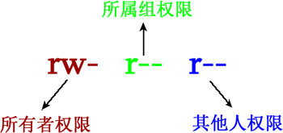

## 文件系统与文件权限

### 文件系统

在linux操作系统中，所有的文件和目录都被组织成一个以`/`结点开始的倒置树状结构，如下图所示


其中，目录就相当于 Windows 中的文件夹，目录中存放的既可以是文件，也可以是其他的子目录，而文件中存储的是真正的信息。

文件系统的最顶层是由根目录开始的，系统使用“/”来表示根目录，在根目录之下的既可以是目录，也可以是文件，而每一个目录中又可以包含（子）目录或文件。如此反复就可以构成一个庞大的文件系统。

> 其实，使用这种树状、具有层次的文件结构主要目的是方便文件系统的管理和维护，想象一下，如果所有的文件都放在一个目录下，其文件系统的管理和维护将变成一场噩梦。

在文件系统中，有两个特殊的目录，一个是用户所在的工作目录，即当前目录，可用一个点“.”表示；另一个是当前目录的上一层目录，也叫父目录，用两个点“..”表示

> 如果一个目录或文件名是以一个点开始，就表示这个目录或文件是一个隐藏目录或文件。即以默认方式査找，不显示该目录或文件。

为了方便管理和维护，Linux 系统采用了文件系统层次标准，也称为 FHS 标准，它规定了根目录下各个目录应该存在哪些类型的文件（或子目录），比如说，在 /bin 和 /sbin 目录中存放的应该是可执行文件。

| 一级目录 | 功能（作用）                                                 |
| -------- | ------------------------------------------------------------ |
| /bin     | 存放系统命令，普通用户和 root 都可以执行。放在 /bin 下的命令在单用户模式下也可以执行 |
| /boot/   | 系统启动目录，保存与系统启动相关的文件，如内核文件和启动引导程序（grub）文件等 |
| /dev/    | 设备文件保存位置根据以上各表列举的各目录及作用，如果我们要做一些实验和练习，需要创建一些临时文件，应该保存在哪里呢？<br/><br/>答案是用户的主目录或 /tmp/ 临时目录。但是要小心有些目录中不能直接修改和保存数据，比如 /proc/fn/sys/ 目录，因为它们是保存在内存中的，如果在这里写入数据，那么你的内存会越来越小，直至死机；/boot/ 目录也不能保存额外数据，因为 /boot/ 目录会单独分区作为启动分区，如果没有空闲空间，则会导致系统不能正常启动。<br/><br/>总之，Linux 要在合理的目录下进行操作和修改。 |
| /etc/    | 配置文件保存位置。系统内所有采用默认安装方式（rpm 安装）的服务配置文件全部保存在此目录中，如用户信息、服务的启动脚本、常用服务的配置文件等 |
| /home/   | 普通用户的主目录（也称为家目录）。在创建用户时，每个用户要有一个默认登录和保存自己数据的位置，就是用户的主目录，所有普通用户的主目录是在 /home/ 下建立一个和用户名相同的目录。如用户 aaron 的主目录就是 /home/aaron |
| /lib/    | 系统调用的函数库保存位置                                     |
| /media/  | 挂载目录。系统建议用来挂载媒体设备，如软盘和光盘             |
| /mnt/    | 挂载目录。早期 Linux 中只有这一个挂载目录，并没有细分。系统建议这个目录用来挂载额外的设备，如 U 盘、移动硬盘和其他操作系统的分区 |
| /misc/   | 挂载目录。系统建议用来挂载 NFS 服务的共享目录。虽然系统准备了三个默认挂载目录 /media/、/mnt/、/misc/，但是到底在哪个目录中挂载什么设备可以由管理员自己决定。例如，笔者在接触 Linux 的时候，默认挂载目录只有 /mnt/，所以养成了在 /mnt/ 下建立不同目录挂载不同设备的习惯，如 /mnt/cdrom/ 挂载光盘、/mnt/usb/ 挂载 U 盘，都是可以的 |
| /opt/    | 第三方安装的软件保存位置。这个目录是放置和安装其他软件的位置，手工安装的源码包软件都可以安装到这个目录中。不过笔者还是习惯把软件放到 /usr/local/ 目录中，也就是说，/usr/local/ 目录也可以用来安装软件 |
| /root/   | root 的主目录。普通用户主目录在 /home/ 下，root 主目录直接在“/”下 |
| /sbin/   | 保存与系统环境设置相关的命令，只有 root 可以使用这些命令进行系统环境设置，但也有些命令可以允许普通用户查看 |
| /srv/    | 服务数据目录。一些系统服务启动之后，可以在这个目录中保存所需要的数据 |
| /tmp/    | 临时目录。系统存放临时文件的目录，在该目录下，所有用户都可以访问和写入。建议此目录中不能保存重要数据，最好每次开机都把该目录清空 |

FHS 针对根目录中包含的子目录仅限于表 1，但除此之外，Linux 系统根目录下通常还包含表 2 中的几个一级目录。

| 一级目录     | 功能（作用）                                                 |
| ------------ | ------------------------------------------------------------ |
| /lost+found/ | 当系统意外崩溃或意外关机时，产生的一些文件碎片会存放在这里。在系统启动的过程中，fsck 工具会检查这里，并修复已经损坏的文件系统。这个目录只在每个分区中出现，例如，/lost+found 就是根分区的备份恢复目录，/boot/lost+found 就是 /boot 分区的备份恢复目录 |
| /proc/       | 虚拟文件系统。该目录中的数据并不保存在硬盘上，而是保存到内存中。主要保存系统的内核、进程、外部设备状态和网络状态等。如 /proc/cpuinfo 是保存 CPU 信息的，/proc/devices 是保存设备驱动的列表的，/proc/filesystems 是保存文件系统列表的，/proc/net 是保存网络协议信息的...... |
| /sys/        | 虚拟文件系统。和 /proc/ 目录相似，该目录中的数据都保存在内存中，主要保存与内核相关的信息 |

Linux /usr目录

usr（注意不是 user），全称为 Unix Software Resource，此目录用于存储系统软件资源。FHS 建议所有开发者，应把软件产品的数据合理的放置在 /usr 目录下的各子目录中，而不是为他们的产品创建单独的目录。

Linux 系统中，所有系统默认的软件都存储在 /usr 目录下，/usr 目录类似 Windows 系统中 C:\Windows\ + C:\Program files\ 两个目录的综合体。

FHS 建议，/usr 目录应具备表 3 所示的子目录。

| 子目录       | 功能（作用）                                                 |
| ------------ | ------------------------------------------------------------ |
| /usr/bin/    | 存放系统命令，普通用户和超级用户都可以执行。这些命令和系统启动无关，在单用户模式下不能执行 |
| /usr/sbin/   | 存放根文件系统不必要的系统管理命令，如多数服务程序，只有 root 可以使用。 |
| /usr/lib/    | 应用程序调用的函数库保存位置                                 |
| /usr/XllR6/  | 图形界面系统保存位置                                         |
| /usr/local/  | 手工安装的软件保存位置。我们一般建议源码包软件安装在这个位置 |
| /usr/share/  | 应用程序的资源文件保存位置，如帮助文档、说明文档和字体目录   |
| /usr/src/    | 源码包保存位置。我们手工下载的源码包和内核源码包都可以保存到这里。不过笔者更习惯把手工下载的源码包保存到 /usr/local/src/ 目录中，把内核源码保存到 /usr/src/linux/ 目录中 |
| /usr/include | C/C++等编程语言头文件的放置目录                              |

Linux /var 目录

/var 目录用于存储动态数据，例如缓存、日志文件、软件运行过程中产生的文件等。通常，此目录下建议包含如表 4 所示的这些子目录。

| var子目录         | 功能（作用）                                                 |
| ----------------- | ------------------------------------------------------------ |
| /var/lib/         | 程序运行中需要调用或改变的数据保存位置。如 [MySQL](http://c.biancheng.net/mysql/) 的数据库保存在 /var/lib/mysql/ 目录中 |
| /var/log/         | 登陆文件放置的目录，其中所包含比较重要的文件如 /var/log/messages, /var/log/wtmp 等。 |
| /var/run/         | 一些服务和程序运行后，它们的 PID（进程 ID）保存位置          |
| /var/spool/       | 里面主要都是一些临时存放，随时会被用户所调用的数据，例如 /var/spool/mail/ 存放新收到的邮件，/var/spool/cron/ 存放系统定时任务。 |
| /var/www/         | RPM 包安装的 Apache 的网页主目录                             |
| /var/nis和/var/yp | NIS 服务机制所使用的目录，nis 主要记录所有网络中每一个 client 的连接信息；yp 是 linux 的 nis 服务的日志文件存放的目录 |
| /var/tmp          | 一些应用程序在安装或执行时，需要在重启后使用的某些文件，此目录能将该类文件暂时存放起来，完成后再行删除 |

根据以上各表列举的各目录及作用，如果我们要做一些实验和练习，需要创建一些临时文件，应该保存在哪里呢？

答案是用户的主目录或 /tmp/ 临时目录。但是要小心有些目录中不能直接修改和保存数据，比如 /proc/fn/sys/ 目录，因为它们是保存在内存中的，如果在这里写入数据，那么你的内存会越来越小，直至死机；/boot/ 目录也不能保存额外数据，因为 /boot/ 目录会单独分区作为启动分区，如果没有空闲空间，则会导致系统不能正常启动。

总之，Linux 要在合理的目录下进行操作和修改。

### 文件权限

Linux 是多用户多任务操作系统，换句话说，Linux 系统支持多个用户在同一时间内登陆，不同用户可以执行不同的任务，并且互不影响。

例如，某台 Linux 服务器上有 4 个用户，分别是 root、www、ftp 和 mysql，在同一时间内，root 用户可能在查看系统日志、管理维护系统；www 用户可能在修改自己的网页程序；ftp 用户可能在上传软件到服务器；mysql 用户可能在执行自己的 SQL 查询，每个用户互不干扰，有条不紊地进行着自己的工作。与此同时，每个用户之间不能越权访问，比如 www 用户不能执行 mysql 用户的 SQL 查询操作，ftp 用户也不能修改 www 用户的网页程序。

不同用户具有不问的权限，毎个用户在权限允许的范围内完成不间的任务，Linux 正是通过这种权限的划分与管理，实现了多用户多任务的运行机制。

因此，如果要使用 Linux 系统的资源，就必须向系统管理员申请一个账户，然后通过这个账户进入系统（账户和用户是一个概念）。通过建立不同属性的用户，一方面可以合理地利用和控制系统资源，另一方面也可以帮助用户组织文件，提供对用户文件的安全性保护。

每个用户都有唯一的用户名和密码。在登录系统时，只有正确输入用户名和密码，才能进入系统和自己的主目录。

用户组是具有相同特征用户的逻辑集合。简单的理解，有时我们需要让多个用户具有相同的权限，比如查看、修改某一个文件的权限，一种方法是分别对多个用户进行文件访问授权，如果有 10 个用户的话，就需要授权 10 次，那如果有 100、1000 甚至更多的用户呢？

显然，这种方法不太合理。最好的方式是建立一个组，让这个组具有查看、修改此文件的权限，然后将所有需要访问此文件的用户放入这个组中。那么，所有用户就具有了和组一样的权限，这就是用户组。

将用户分组是 Linux 系统中对用户进行管理及控制访问权限的一种手段，通过定义用户组，很多程序上简化了对用户的管理工作。

用户和用户组的对应关系有以下 4 种：

1. 一对一：一个用户可以存在一个组中，是组中的唯一成员；
2. 一对多：一个用户可以存在多个用户组中，此用户具有这多个组的共同权限；
3. 多对一：多个用户可以存在一个组中，这些用户具有和组相同的权限；
4. 多对多：多个用户可以存在多个组中，也就是以上 3 种关系的扩展。

用户和组之间的关系可以下图来表示：


和 Windows 系统不同，Linux 系统为每个文件都添加了很多的属性，最大的作用就是维护数据的安全。举个简单的例子，在你的 Linux 系统中，和系统服务相关的文件通常只有 root 用户才能读或写，就拿 /etc/shadow 这个文件来说，此文件记录了系统中所有用户的密码数据，非常重要，因此绝不能让任何人读取（否则密码数据会被窃取），只有 root 才可以有读取权限。

此外，如果你有一个软件开发团队，你希望团队中的每个人都可以使用某一些目录下的文件，而非团队的其他人则不予以开放。通过前面章节的学习我们知道，只需要将团队中的所有人加入新的群组，并赋予此群组读写目录的权限，即可实现要求。反之，如果你的目录权限没有做好，就很难防止其他人在你的系统中乱搞。

比如说，本来 root 用户才能做的开关机、ADSL 拨接程序，新增或删除用户等命令，一旦允许任何人拥有这些权限，系统很可能会经常莫名其妙的挂掉。而且，万一 root 用户的密码被其他人获取，他们就可以登录你的系统，从事一些只有 root 用户才能执行的操作，这是绝对不允许发生的。

因此，在服务器上，绝对不是所有的用户都使用 root 身份登录，而要根据不同的工作需要和职位需要，合理分配用户等级和权限等级。

Linux 系统中，文件或目录的权限信息，可以使用 ls 命令查看，例如：

```bash
[root@localhost ~]# ls -al
total 156
drwxr-x---.   4    root   root     4096   Sep  8 14:06 .
drwxr-xr-x.  23    root   root     4096   Sep  8 14:21 ..
-rw-------.   1    root   root     1474   Sep  4 18:27 anaconda-ks.cfg
-rw-------.   1    root   root      199   Sep  8 17:14 .bash_history
-rw-r--r--.   1    root   root       24   Jan  6  2007 .bash_logout
```

`chgrp `命令用于修改文件（或目录）的所属组。

```
chgrp 理解为是 "change group" 的缩写。
```

chgrp 命令的用法很简单，其基本格式为：

```bash
[root@localhost ~]# chgrp [-R] 所属组 文件名（目录名）
```

-R（注意是大写）选项长作用于更改目录的所属组，表示更改连同子目录中所有文件的所属组信息。

使用此命令需要注意的一点是，要被改变的群组名必须是真实存在的，否则命令无法正确执行，会提示 "invaild group name"。

举个例子，当以 root 身份登录 Linux 系统时，主目录中会存在一个名为 install.log 的文件，我们可以使用如下方法修改此文件的所属组：

```bash
[root@localhost ~]# groupadd group1
#新建用于测试的群组 group1
[root@localhost ~]# chgrp group1 install.log
#修改install.log文件的所属组为group1
[root@localhost ~]# ll install.log
-rw-r--r--. 1 root group1 78495 Nov 17 05:54 install.log
#修改生效
[root@localhost ~]# chgrp testgroup install.log
chgrp: invaild group name 'testgroup'
```

可以看到，在具有 group1 群组的前提下，我们成功修改了 install.log 文件的所属组，但我们再次试图将所属组修改为 testgroup 时，命令执行失败，就是因为系统的 /etc/group 文件中，没有 testgroup 群组。

`chown` 命令，可以认为是 "change owner" 的缩写，主要用于修改文件（或目录）的所有者，除此之外，这个命令也可以修改文件（或目录）的所属组。

当只需要修改所有者时，可使用如下 chown 命令的基本格式：

```bash
[root@localhost ~]# chown [-R] 所有者 文件或目录
```

-R（注意大写）选项表示连同子目录中的所有文件，都更改所有者。

如果需要同时更改所有者和所属组，chown 命令的基本格式为：

```bash
[root@localhost ~]# chown [-R] 所有者:所属组 文件或目录
```

注意，在 chown 命令中，所有者和所属组中间也可以使用点（.），但会产生一个问题，如果用户在设定账号时加入了小数点（例如 zhangsan.temp），就会造成系统误判。因此，建议大家使用冒号连接所有者和所属组。

当然，chown 命令也支持单纯的修改文件或目录的所属组，例如 `chown :group install.log` 就表示修改 install.log 文件的所属组，但修改所属组通常使用 chgrp 命令，因此并不推荐大家使用 chown 命令。

另外需要注意的一点是，使用 chown 命令修改文件或目录的所有者（或所属者）时，要保证使用者用户（或用户组）存在，否则该命令无法正确执行，会提示 "invalid user" 或者 "invaild group"。

其实，修改文件的所有者，更多时候是为了得到更高的权限，举一个实例：

```bash
[root@localhost ~]# touch file
#由root用户创建file文件
[root@localhost ~]# ll file
-rw-r--r--. 1 root root 0 Apr 17 05:12 file
#文件的所有者是root，普通用户user对这个文件拥有只读权限
[root@localhost ~]# chown user file
#修改文件的所有者
[root@localhost ~]# ll file
-rw-r--r--. 1 user root 0 Apr 17 05:12 file
#所有者变成了user用户，这时user用户对这个文件就拥有了读、写权限
```

可以看到，通过修改 file 文件的所有者，user 用户从其他人身份（只对此文件有读取权限）转变成了所有者身份，对此文件拥有读和写权限。

Linux 系统中，用户等级权限的划分是非常清楚的，root 用户拥有最高权限，可以修改任何文件的权限，而普通用户只能修改自己文件的权限（所有者是自己的文件），例如：

```bash
[root@localhost ~]# cd /home/user
#进入user用户的家目录
[root@localhost user]# touch test
#由root用户新建文件test
[root@localhost user]# ll test
-rw-r--r--. 1 root root 0 Apr 17 05:37 test
#文件所有者和所属组都是root用户
[root@localhost user]# su - user
#切换为user用户
[user@localhost ~]$ chmod 755 test
chmod:更改"test"的权限：不允许的操作 #user用户不能修改test文件的权限
[user@localhost ~]$ exit
#退回到root身份
[root@localhost user]# chown user test
#由root用户把test文件的所有者改为user用户
[root@localhost user]# su - user
#切换为user用户
[user@localhost ~]$ chmod 755 test
#user用户由于是test文件的所有者，所以可以修改文件的权限
[user@localhost ~]$ ll test
-rwxr-xr-x. 1 user root 0 Apr 17 05:37 test
#查看权限
```

可以看到，user 用户无权更改所有者为 root 用户文件的权限，只有普通用户是这个文件的所有者，才可以修改文件的权限。

```bash
[root@localhost ~]# chown user:group file
[root@localhost ~]# ll file
-rw-r--r--. 1 user group 0 Apr 17 05:12 file
```

Linux 系统，最常见的文件权限有 3 种，即对文件的读（用 r 表示）、写（用 w 表示）和执行（用 x 表示，针对可执行文件或目录）权限。在 Linux 系统中，每个文件都明确规定了不同身份用户的访问权限，通过 ls 命令即可看到。

除此之外，我们有时会看到 s（针对可执行文件或目录，使文件在执行阶段，临时拥有文件所有者的权限）和 t（针对目录，任何用户都可以在此目录中创建文件，但只能删除自己的文件），文件设置 s 和 t 权限，会占用 x 权限的位置。

```bash
root@localhost ~]# ls -al
total 156
drwxr-x---.   4    root   root     4096   Sep  8 14:06 .
drwxr-xr-x.  23    root   root     4096   Sep  8 14:21 ..
-rw-------.   1    root   root     1474   Sep  4 18:27 anaconda-ks.cfg
-rw-------.   1    root   root      199   Sep  8 17:14 .bash_history
-rw-r--r--.   1    root   root       24   Jan  6  2007 .bash_logout
...
```

可以看到，每行的第一列表示的就是各文件针对不同用户设定的权限，一共 11 位，但第 1 位用于表示文件的具体类型，最后一位此文件受 SELinux 的安全规则管理

因此，为文件设定不同用户的读、写和执行权限，仅涉及到 9 位字符，以 ls 命令输出信息中的 .bash_logout 文件为例，设定不同用户的访问权限是 rw-r--r--，各权限位的含义如下图所示。



从图中可以看到，Linux 将访问文件的用户分为 3 类，分别是文件的所有者，所属组（也就是文件所属的群组）以及其他人。

有关群组的概念，我们已在用户和用户组一章中做了说明。除了所有者，以及所属群组中的用户可以访问文件外，其他用户（其他群组中的用户）也可以访问文件，这部分用户都归为其他人范畴。

很显然，Linux 系统为 3 种不同的用户身份，分别规定了是否对文件有读、写和执行权限。拿图 1 来说，文件所有者拥有对文件的读和写权限，但是没有执行权限；所属群组中的用户只拥有读权限，也就是说，这部分用户只能读取文件内容，无法修改文件；其他人也是只能读取文件。

Linux 系统中，多数文件的文件所有者和所属群组都是 root（都是 root 账户创建的），这也就是为什么，root 用户是超级管理员，权限足够大的原因。

rwx 权限对文件的作用

| rwx权限       | 对文件的作用                                                 |
| ------------- | ------------------------------------------------------------ |
| 读权限（r）   | 表示可读取此文件中的实际内容，例如，可以对文件执行 cat、more、less、head、tail 等文件查看命令。 |
| 写权限（w）   | 表示可以编辑、新增或者修改文件中的内容，例如，可以对文件执行 vim、echo 等修改文件数据的命令。注意，无权限不赋予用户删除文件的权利，除非用户对文件的上级目录拥有写权限才可以。 |
| 执行权限（x） | 表示该文件具有被系统执行的权限。Window系统中查看一个文件是否为可执行文件，是通过扩展名（.exe、.bat 等），但在 Linux 系统中，文件是否能被执行，是通过看此文件是否具有 x 权限来决定的。也就是说，只要文件拥有 x 权限，则此文件就是可执行文件。但是，文件到底能够正确运行，还要看文件中的代码是否正确。 |

对于文件来说，执行权限是最高权限。给用户或群组设定权限时，是否赋予执行权限需要慎重考虑，否则会对系统安装造成严重影响。

rwx 权限对目录的作用

目录，主要用来记录文件名列表，不同的权限对目录的作用如表 2 所示。

| rwx权限       | 对目录的作用                                                 |
| ------------- | ------------------------------------------------------------ |
| 读权限（r）   | 表示具有读取目录结构列表的权限，也就是说，可以看到目录中有哪些文件和子目录。一旦对目录拥有 r 权限，就可以在此目录下执行 ls 命令，查看目录中的内容。 |
| 写权限（w）   | 对于目录来说，w 权限是最高权限。对目录拥有 w 权限，表示可以对目录做以下操作：<br />1. 在此目录中建立新的文件或子目录；<br />2. 删除已存在的文件和目录（无论子文件或子目录的权限是怎样的）；<br />3.对已存在的文件或目录做更名操作；移动此目录下的文件和目录的位置。<br />一旦对目录拥有 w 权限，就可以在目录下执行 touch、rm、cp、mv 等命令。 |
| 执行权限（x） | 目录是不能直接运行的，对目录赋予 x 权限，代表用户可以进入目录，也就是说，赋予 x 权限的用户或群组可以使用 cd 命令。 |

对目录来说，如果只赋予 r 权限，则此目录是无法使用的。很简单，只有 r 权限的目录，用户只能查看目录结构，根本无法进入目录（需要用 x 权限），更不用说使用了。因此，对于目录来说，常用来设定目录的权限其实只有 0（---）、5（r-x）、7（rwx）这 3 种。

`chmod`命令使用数字修改文件权限

Linux 系统中，文件的基本权限由 9 个字符组成，以 rwxrw-r-x 为例，我们可以使用数字来代表各个权限，各个权限与数字的对应关系如下：

```bash
r --> 4
w --> 2
x --> 1
```

由于这 9 个字符分属 3 类用户，因此每种用户身份包含 3 个权限（r、w、x），通过将 3 个权限对应的数字累加，最终得到的值即可作为每种用户所具有的权限。

拿 rwxrw-r-x 来说，所有者、所属组和其他人分别对应的权限值为：

```bash
所有者 = rwx = 4+2+1 = 7
所属组 = rw- = 4+2 = 6
其他人 = r-x = 4+1 = 5
```

所以，此权限对应的权限值就是 765。

使用数字修改文件权限的 chmod 命令基本格式为：

```bash
[root@localhost ~]# chmod [-R] 权限值 文件名
```

-R（注意是大写）选项表示连同子目录中的所有文件，也都修改设定的权限。

例如，使用如下命令，即可完成对 .bashrc 目录文件的权限修改：

```bash
[root@localhost ~]# ls -al .bashrc
-rw-r--r--. 1 root root 176 Sep 22 2004 .bashrc
[root@localhost ~]# chmod 777 .bashrc
[root@localhost ~]# ls -al .bashrc
-rwxrwxrwx. 1 root root 176 Sep 22 2004 .bashrc
```

再举个例子，通常我们以 Vim 编辑 Shell 文件批处理文件后，文件权限通常是 rw-rw-r--（644），那么，如果要将该文件变成可执行文件，并且不让其他人修改此文件，则只需将此文件的权限该为 rwxr-xr-x（755）即可。

`chmod`命令使用字母修改文件权限

既然文件的基本权限就是 3 种用户身份（所有者、所属组和其他人）搭配 3 种权限（rwx），chmod 命令中用 u、g、o 分别代表 3 种身份，还用 a 表示全部的身份（all 的缩写）。另外，chmod 命令仍使用 r、w、x 分别表示读、写、执行权限。

使用字母修改文件权限的 chmod 命令，其基本格式如图 1 所示。


例如，如果我们要设定 .bashrc 文件的权限为 rwxr-xr-x，则可执行如下命令：

```bash
[root@localhost ~]# chmod u=rwx,go=rx .bashrc
[root@localhost ~]# ls -al .bashrc
-rwxr-xr-x. 1 root root 176 Sep 22 2004 .bashrc
```

再举个例子，如果想要增加 .bashrc 文件的每种用户都可做写操作的权限，可以使用如下命令：

```bash
[root@localhost ~]# ls -al .bashrc
-rwxr-xr-x. 1 root root 176 Sep 22 2004 .bashrc
[root@localhost ~]# chmod a+w .bashrc
[root@localhost ~]# ls -al .bashrc
-rwxrwxrwx. 1 root root 176 Sep 22 2004 .bashrc
```

