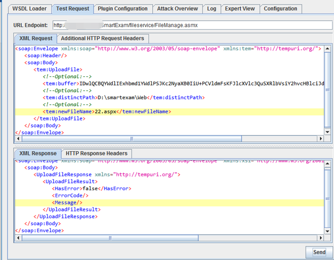

## 前言
随着网络安全变得更加复杂，边界变得更加模糊，在建设企业安全时，需要考虑到要建设规范的应急响应流程，而不是着急忙慌地去点对点地解决问题，这样费力不讨好，而且很容易造成做一次，忘一次；那么在企业安全建设中，“ 规范应急响应流程，提升应急响应能力” 就是应急响应的目标。
## 过程驱动
应急响应是什么时候做？难道是要等到安全事故发生之后才做吗？首先需要明确，如果没有安全事件的发生，我们需要做吗？答案是肯定的，应急响应本身就是防患于未然，当发生安全事件之后，能够及时 发现 ，定位 ，解决，恢复，总结，能在最小损失下完成自救过程。
说到应急响应，首先会想到威胁情报，也可以说情报驱动应急响应。那么什么是威胁情报呢？旨在面临威胁的资产主体提供全面的、准确的、与其相关的、并且能够执行和决策的知识和信息。
那么怎么开展威胁情报工作呢？可以从OODA模型、情报获取、情报分析、情报决策、情报处置这五个方面说起。
### OODA 模型
OODA 模型，又叫博伊德环，它是由Observation(观察)、Orientation(判断)、Decision(决策)、Action(执行)，四个步骤组成，将行动前的动作，进行一步一步分解，这些步骤，可以让我们的行动，有据可依，通过这个循环，则可以让我们的行动更加系统化，理性化


### 情报获取
在做威胁情报收集时，大多数途径是来自于外部互联网漏洞预警，主要包括，Twitter、CNVD，CVE、Microsoft 热更新，Exchange，安全公众号，情报共享群，监管机构预警的漏洞情报


### 情报分析
收集完成情报之后，就需要进行初步筛选，去掉假情报。
一般攻击链较复杂的漏洞，除了直接远程代码执行，任意代码执行，反序列化等高危漏洞，都可根据漏洞利用的难易程度，受影响范围，以及是否公布POC 来进行评判优先级，这样可以尽快分析处理，毕竟每个企业的安全人员都是有限的。


### 情报决策
对筛选出的漏洞进行分析之后，需要根据评判出的优先顺序写出情报分析报告，其中报告需要包括情报来源，情报类型，复现情况，修复方案，受影响的资产（**特别注意互联网暴露面资产**），是否已有poc等，从而得出风险等级，发给领导决策，审阅，一般高危以上的情报，且也有受影响的资产，这时需要找领导沟通之后，尽快做出决策，启动应急响应，注意，无许可不能擅做主张。


### 情报处置
针对已筛选出的情报，且领导也审阅完成，这时就需要根据内部的规范流程，准备好应急响应的方案，受影响的资产，反馈表等，提交给研发团队，对漏洞进行处置，待漏洞处置完成之后还需要验证漏洞的修复情况，直至修复完成，这一步的反馈表，是为了防止有资产更新情况但未发现，需要研发反馈。


## 应急响应
### 生命周期
应急响应的操作步骤，主要为

- 准备：分析资产的风险、组建管理人员，团队、风险加固、保障资源储备、技术支持资源库
- 检测：日常运维监控、事件判断、事件上报
| 事件等级判定： |  |  |  |
| --- | --- | --- | --- |
| 一般事件 | 较大事件 | 重大事件 | 特别重大事件 |
| 恶意程序事件 | 网络攻击事件 | Web攻击事件 | 业务安全事件 |
| 计算机病毒事件 | 拒绝服务攻击事件 | Webshell | 数据泄露 |
| 特洛伊木马事件 | 漏洞攻击事件 | 网页挂马 | 权限泄漏 |
| 勒索事件 | 网络钓鱼事件 | 网页篡改 | 薅羊毛 |
| 僵尸网络事件 | 后门攻击事件 | 网页暗链 | 流程绕过 |
| 挖矿事件 | 网络窃听事件 |  |  |

- 遏制
   - 控制事件蔓延
      - 采取有效措施防止事件进一步扩大
      - 尽可能减少负面影响
   - 遏制效应
      - 采取常规的技术手段处理应急响应事件
      - 尝试快速修复系统，消除应急响应事件带来的影响
   - 遏制监测
      - 确认当前抑制手段是否有效
      - 分析应急事件发生的原因，为消除阶段提供解决方案
- 消除
- 恢复
   - 启动应急预案
      - 协调安全人员
      - 选取应急响应方案
   - 消除威胁
      - 根据应急方案进行恢复处置
      - 恢复信息系统
   - 持续监测
      - 处置成功后续，对信息系统持续监测
      - 确认应急事件已根除
      - 信息系统恢复到正常情况之后的持续监控
- 反思
   - 应急响应报告
      - 由应急响应实施小组报告（撰写）应急响应事件的处置情况
   - 应急事件调查
      - 对应急事件发生的原因进行调查
      - 评估应急事件对信息系统造成的损失
      - 评估应急事件对单位、组织带来的影响
   - 应急响应总结复盘
      - 对存在的风险点进行加固以及整改
      - 评价应急预案的执行情况和后续改进计划
### 应急响应预案
应急响应预案包括的主要内容：

1. 确定风险场景
2. 行动计划
3. 描述可能受到影响的业务
4. 团队和人员的职责
5. 描述使用的预防性策略
6. 联络清单
7. 描述应急响应的策略
8. 所需资源配置
9. 识别和排列关键应用系统

成功预案的特点

1. 清楚、简洁
2. 高级管理层支持/组织/承诺
3. 不断改进和更新恢复策略
4. 及时维护更新
## 应急步骤
### 初步信息搜集
| 客户属性 | 名称/区域/领域 |
| --- | --- |
| 入侵范围 | 主机数/网段 |
| 入侵现象 | cpu过高，勒索界面，异常网络链接，安全设备告警 |
| 需求对接 | 溯源、协助修复... |

> 收集信息：操作系统版本，补丁，数据库版本，中间件/服务器，网络拓扑，受害范围，处置情况，提取日志（主机，安全设备，数据库等）
> 务必亲自求证，眼见为实耳听为虚

### 整体流程


### 可疑信息
> 可疑域名后缀

| 顶级域名  | 申请地区或机构 |  重点关注原因 |
| --- | --- | --- |
| .ru | 俄罗斯 | 俄罗斯盛产黑客 |
| .ws | 东萨摩亚 不知名国家 | 易申请，难追踪注册者 |
| .cc | 科科斯群岛 不知名国家 | 易申请，难追踪注册者 |
| .pw | 帕劳 不知名国家 | 易申请，难追踪注册者 |
| .bz | 伯利兹 不知名国家 | 易申请，难追踪注册者 |
| .su | 苏联 前苏联虽然解体了 | 顶级域名还在使用，且多与黑产有关 |
| .bw | 伯兹瓦纳 不知名国家 | 易申请，难追踪注册者 |
| .gw | 几内亚比绍 不知名国家 | 易申请，难追踪注册者 |
| .ms | 蒙塞拉特岛 不知名国家 | 易申请，难追踪注册者 |
| .mz | 莫桑比克 不知名国家 | 易申请，难追踪注册者 |

> 常见动态域名提供商
> 'f3322.net','3322.org','7766.org','8866.org', '9966.org','8800.org','2288.org','6600.org', 'f3322.org', 'ddns.net', 'xicp.net', 'vicp.net','wicp.net','oicp.net','xicp.net','vicp.cc','eicp.net','uicp.cn','51vip.biz','xicp.cn','uicp.net','vicp.hk','5166.info','coyo.eu','imblog.in','imzone.in','imshop.in','imbbs.in','imwork.net','iego.cn','vicp.co','iego.net','1366.co','1866.co','3utilities.com','bounceme.net','ddnsking.com','gotdns.ch','hopto.org','myftp.biz','myftp.org','myvnc.com','no-ip.biz','no-ip.info','no-ip.org','noip.me','redirectme.net','servebeer.com','serveblog.net','servecounterstrike.com','serveftp.com','servegame.com','servehalflife.com','servehttp.com','serveminecraft.net','servemp3.com','servepics.com','servequake.com','sytes.net','webhop.me','zapto.org','dynamic-dns.net','epac.to','longmusic.com','compress.to','wikaba.com','zzux.com','dumb1.com','1dumb.com','onedumb.com','wha.la','youdontcare.com','yourtrap.com','2waky.com','sexidude.com','mefound.com','organiccrap.com','toythieves.com','justdied.com','jungleheart.com','mrbasic.com','mrbonus.com','x24hr.com','dns04.com','dns05.com','zyns.com','my03.com','fartit.com','itemdb.com','instanthq.com','xxuz.com','jkub.com','itsaol.com','faqserv.com','jetos.com','qpoe.com','qhigh.com','vizvaz.com','mrface.com','isasecret.com','mrslove.com','otzo.com','sellclassics.com','americanunfinished.com','serveusers.com','serveuser.com','freetcp.com','ddns.info','ns01.info','ns02.info','myftp.info','mydad.info','mymom.info','mypicture.info','myz.info','squirly.info','toh.info','xxxy.info','freewww.info','freeddns.com','myddns.com','dynamicdns.biz','ns01.biz','ns02.biz','xxxy.biz','sexxxy.biz','freewww.biz','www1.biz','dhcp.biz','edns.biz','ftp1.biz','mywww.biz','gr8domain.biz','gr8name.biz','ftpserver.biz','wwwhost.biz','moneyhome.biz','port25.biz','esmtp.biz','sixth.biz','ninth.biz','got-game.org','bigmoney.biz','dns2.us','dns1.us','ns02.us','ns01.us','almostmy.com','ocry.com','ourhobby.com','pcanywhere.net','ygto.com','ddns.ms','ddns.us','gettrials.com','4mydomain.com','25u.com','4dq.com','4pu.com','3-a.net','dsmtp.com','mynumber.org','ns1.name','ns2.name','ns3.name','changeip.name','ddns.name','rebatesrule.net','ezua.com','sendsmtp.com','trickip.net','trickip.org','dnsrd.com','lflinkup.com','lflinkup.net','lflinkup.org','lflink.com','dns-dns.com','proxydns.com','myftp.name','dyndns.pro','changeip.net','mysecondarydns.com','changeip.org','dns-stuff.com','dynssl.com','mylftv.com','mynetav.net','mynetav.org','ikwb.com','acmetoy.com','ddns.mobi','dnset.com','authorizeddns.net','authorizeddns.org','authorizeddns.us','cleansite.biz'

### Web 应急响应
#### webshell
网站被植入webshell，意味着网站存在可利用的高危漏洞，攻击者通过利用漏洞入侵网站，写入webshell接管网站的控制权。为了得到权限 ，常规的手段如：前后台任意文件上传，远程命令执行，Sql注入写入文件等。
**排查方式**

1. 隔离web服务器，对服务器状态进行保存备份当前环境
2. 使用webshell扫描工具扫描整站
3. 使用命令快速寻找整站代码中可能存在的webshell危险代码
4. 日志分析
5. 流量分析
> 常见的weshell扫描工具有D盾，河马

**定位时间范围**
在找到webshell之后，通过发现webshell文件创建时间点，去查看相关日期的日志


**Web日志分析**
在相关的日志中找到对应时间节点的web日志，查看具体是哪个api，组件，通过下图可以发现存在可疑的webservice接口


**漏洞分析**

访问webservice接口，发现变量：buffer、distinctpach、newfilename可以在客户端自定义


漏洞复现
尝试对漏洞进行复现，可成功上传webshell，控制网站服务器




**漏洞修复**

1. 清除webshell并对webservice接口进行代码修复
2. 开放ACL，使其对外服务
3. 总结 
### Linux


#### 文件
**ls**
```shell
# 敏感目录的文件分析[/tmp目录，命令目录/usr/bin ,/usr/local/bin/,/usr/local/sbin,/usr/sbin等]
ls
-a   显示所有档案及目录（ls内定将档案名或目录名称为“.”的视为影藏，不会列出）；
-C	 多列显示输出结果。这是默认选项；
-l	 以长格式显示目录下的内容列表。输出的信息从左到右依次包括文件名，文件类型、权限模式、硬连接数、所有者、组、文件大小和文件的最后修改时间等；
-t	 用文件和目录的更改时间排序
```
```shell
# 关注目录、文件
/var/run/utmp 有关当前登录用户的信息记录
/etc/passwd 用户列表
/tmp 临时目录
~/.ssh/authorized_keys 公钥
/usr/bin 系统预装可执行命令的目录
/usr/local/bin 用户自编译可执行程序的目录
/usr/sbin root权限下执行系统命令的目录
/var/spool/cron/* 用户创建的定时任务（crontab）
/etc/crontab 定时任务文件
/etc/cron.d/*  系统自动定期需要做的任务的目录，但是又不是按小时，按天，按星期，按月来执行的
/etc/cron.daily/*  每天执行一次job的目录
/etc/cron.hourly/* 每小时执行一次job的目录
/etc/cron.monthly/* 每个月执行一次job的目录
/etc/cron.weekly/* 每周之行一次job的目录
/etc/rc.local 开机自启动文件
~/.bash_history 历史命令文件
```
**stat**
针对可疑文件可以使用stat进行创建修改时间、访问时间的详细查看，若修改时间距离事件日期接近，有线性关联，说明可能被篡改或者其他
```shell
Access Time：简写为atime，表示文件的访问时间。当文件内容被访问时，更新这个时间。
Modify Time：简写为mtime，表示文件内容的修改时间，当文件的数据内容被修改时，更新这个时间。 
Change Time：简写为ctime，表示文件的状态时间，当文件的状态被修改时，更新这个时间，例如文件的链接数，大小，权限，Blocks数。
#查看文件状态
stat ${filename}
#计算文件hash值
md5sum ./top
```
**find**
```shell
-type	b/d/c/p/l/f查是块设备、目录、字符设备、管道、符号、链接、普通文件
-mtime -n +n 	按文件更改时间来查找文件，-n指n天以内，+n指n天前
-atime -n +n 	按文件访问时间来查找文件，-n指n天以内，+n指n天前
-ctime -n +n 	按文件创建时间来查找文件，-n指n天以内，+n指n天前
# 查找24小时内被修改的php文件
find ./ -mtime 0 -name "*.php"
# 查找72h以内,48h前被修改的文件
find ./ -ctime 2
# 查找2天前被修改的文件
find ./ -ctime +2
# 查看1-5天内被修改的文件
find ./ -ctime +1 -ctime -5
```
#### 进程&&网络
**top**
使用top命令实时动态地查看系统的整体运行情况，主要分析CPU和内存的进程，是一个综合了多方信息监测系统性能和运行信息的实用工具

| 列名 | 含义 |
| --- | --- |
| PID | 进程ID，进程的唯一标识符 |
| USER | 进程所有者的实际用户名 |
| PR | 进程的调度优先级。这个字段的一些值是'rt'。这意味这这些进程运行在实时态 |
| NI | 进程的nice值（优先级）。越小的值意味着越高的优先级 |
| VIRT | 进程使用的虚拟内存 |
| RES | 驻留内存大小。驻留内存是任务使用的非交换物理内存大小 |
| SHR | SHR是进程使用的共享内存 |
| S | 这个是进程的状态。它有以下不同的值:
D – 不可中断的睡眠态 
R – 运行态 
S – 睡眠态 
T – 被跟踪或已停止 
Z – 僵尸态 |
| %CPU | 自从上一次更新时到现在任务所使用的CPU时间百分比 |
| %MEM | 进程使用的可用物理内存百分比 |
| TIME+ | 任务启动后到现在所使用的全部CPU时间，精确到百分之一秒 |
| COMMAND | 运行进程所使用的命令 |


**htop**


**netstat**
netstat用于显示与IP、TCP、UDP和ICMP协议相关的统计数据，一般用于检验本机各端口的网络连接情况

```shell
-a 	显示所有连线中的Socket。 
-n  直接使用IP地址，而不通过域名服务器。
-t 	显示TCP传输协议的连线状况。
-u  显示UDP传输协议的连线状况。
-l  显示侦听服务器套接字
-v  显示指令执行过程。
-p  显示正在使用Socket的程序PID和程序名称。
-s  显示网络工作信息统计表。
```
**ps**
查看进程
```shell
a   显示一个终端的所有进程，除会话引线外
u   显示进程的归属用户及内存的使用情况
x   显示没有控制终端的进程
-l  长格式显示更加详细的信息
-e  显示所有进程
-f  执行完整格式列表
```
```shell
"ps aux" 可以查看系统中所有的进程；
"ps -le" 可以查看系统中所有的进程，而且还能看到进程的父进程的 PID 和进程优先级；
"ps -l" 只能看到当前 Shell 产生的进程
```
```shell
ps aux
```
| 列名 | 含义 |
| --- | --- |
| USER | 该进程是由哪个用户产生的。 |
| PID | 进程的 ID。 |
| %CPU | 该进程占用 CPU 资源的百分比，占用的百分比越高，进程越耗费资源。 |
| %MEM | 该进程占用物理内存的百分比，占用的百分比越高，进程越耗费资源。 |
| VSZ | 该进程占用虚拟内存的大小，单位为 KB。 |
| RSS | 该进程占用实际物理内存的大小，单位为 KB。 |
| TTY | 该进程是在哪个终端运行的。其中，tty1 ~ tty7 代表本地控制台终端（可以通过 Alt+F1 ~ F7 快捷键切换不同的终端），tty1~tty6 是本地的字符界面终端，tty7 是图形终端。pts/0 ~ 255 代表虚拟终端，一般是远程连接的终端，第一个远程连接占用 pts/0，第二个远程连接占用 pts/1，依次増长。 |
| STAT | 进程状态。常见的状态有以下几种：
-D：不可被唤醒的睡眠状态，通常用于 I/O 情况。
-R：该进程正在运行。
-S：该进程处于睡眠状态，可被唤醒。
-T：停止状态，可能是在后台暂停或进程处于除错状态。
-W：内存交互状态（从 2.6 内核开始无效）。
-X：死掉的进程（应该不会出现）。
-Z：僵尸进程。进程已经中止，但是部分程序还在内存当中。
-<：高优先级（以下状态在 BSD 格式中出现）。
-N：低优先级。
-L：被锁入内存。
-s：包含子进程。
-l：多线程（小写 L）。
-+：位于后台。 |
| START | 该进程的启动时间。 |
| TIME | 该进程占用 CPU 的运算时间，注意不是系统时间。 |
| COMMAND | 产生此进程的命令名。 |

"ps aux"命令可以看到系统中所有的进程，"ps -le"命令也能看到系统中所有的进程。由于 "-l" 选项的作用，所以 "ps -le" 命令能够看到更加详细的信息，比如父进程的 PID、优先级等。但是这两个命令的基本作用是一致的，掌握其中一个就足够了。
```shell
ps -le
```
| 列名 | 含义 |
| --- | --- |
| USER | 该进程是由哪个用户产生的。 |
| PID | 进程的 ID。 |
| %CPU | 该进程占用 CPU 资源的百分比，占用的百分比越高，进程越耗费资源。 |
| %MEM | 该进程占用物理内存的百分比，占用的百分比越高，进程越耗费资源。 |
| VSZ | 该进程占用虚拟内存的大小，单位为 KB。 |
| RSS | 该进程占用实际物理内存的大小，单位为 KB。 |
| TTY | 该进程是在哪个终端运行的。其中，tty1 ~ tty7 代表本地控制台终端（可以通过 Alt+F1 ~ F7 快捷键切换不同的终端），tty1~tty6 是本地的字符界面终端，tty7 是图形终端。pts/0 ~ 255 代表虚拟终端，一般是远程连接的终端，第一个远程连接占用 pts/0，第二个远程连接占用 pts/1，依次増长。 |
| STAT | 进程状态。常见的状态有以下几种：
-D：不可被唤醒的睡眠状态，通常用于 I/O 情况。
-R：该进程正在运行。
-S：该进程处于睡眠状态，可被唤醒。
-T：停止状态，可能是在后台暂停或进程处于除错状态。
-W：内存交互状态（从 2.6 内核开始无效）。
-X：死掉的进程（应该不会出现）。
-Z：僵尸进程。进程已经中止，但是部分程序还在内存当中。
-<：高优先级（以下状态在 BSD 格式中出现）。
-N：低优先级。
-L：被锁入内存。
-s：包含子进程。
-l：多线程（小写 L）。
-+：位于后台。 |
| START | 该进程的启动时间。 |
| TIME | 该进程占用 CPU 的运算时间，注意不是系统时间。 |
| COMMAND | 产生此进程的命令名。 |

**pstree**
```shell
pstree [选项] [PID或用户名]
```
```shell
-a	显示启动每个进程对应的完整指令，包括启动进程的路径、参数等。
-c	不使用精简法显示进程信息，即显示的进程中包含子进程和父进程。
-n	根据进程 PID 号来排序输出，默认是以程序名排序输出的。
-p	显示进程的 PID。
-u	显示进程对应的用户名称。
```
在使用 pstree 命令时，如果不指定进程的 PID 号，也不指定用户名称，则会以 init 进程为根进程，显示系统中所有程序和进程的信息；反之，若指定 PID 号或用户名，则将以 PID 或指定用户为根进程，显示 PID 或用户对应的所有程序和进程


**lsof**
lsof 命令，“list opened files”的缩写，直译过来，就是列举系统中已经被打开的文件。通过 lsof 命令，我们就可以根据文件找到对应的进程信息，也可以根据进程信息找到进程打开的文件

```shell
-c 字符串	只列出以字符串开头的进程打开的文件。
+d 目录名	列出某个目录中所有被进程调用的文件。
-u 用户名	只列出某个用户的进程打开的文件。
-p pid	列出某个 PID 进程打开的文件。	
```


**隐藏进程**

```shell
cat /proc/$$/mountinfo
cat /proc/mounts
mount
```
使用mount隐藏进程，可以发现挂载硬盘之后，ps查看进程是无法查看对应的进程详细信息


查看对应挂载信息，可以快速找到隐藏的进程pid


然后使用unmount 取消挂载之后，就可以kill掉这个进程


#### 日志
**CentOS系统日志文件重要日志**

| 日志文件 | 说 明 |
| --- | --- |
| /var/log/cron | 记录与系统定时任务相关的曰志 |
| /var/log/cups/ | 记录打印信息的曰志 |
| /var/log/dmesg | 记录了系统在开机时内核自检的信总。也可以使用dmesg命令直接查看内核自检信息 |
| /var/log/btmp | 记录错误登陆的日志。这个文件是二进制文件，不能直接用Vi查看，而要使用lastb命令查看。命令如下：
 [root@localhost log]#lastb 
root tty1 Tue Jun 4 22:38 - 22:38 (00:00) #
有人在6月4 日 22:38便用root用户在本地终端 1 登陆错误 |
| /var/log/lasllog | 记录系统中所有用户最后一次的登录时间的曰志。这个文件也是二进制文件.不能直接用Vi 查看。而要使用lastlog命令查看 |
| /var/Iog/mailog | 记录邮件信息的曰志 |
| /var/log/messages | 它是核心系统日志文件，其中包含了系统启动时的引导信息，以及系统运行时的其他状态消息。I/O 错误、网络错误和其他系统错误都会记录到此文件中。其他信息，比如某个人的身份切换为 root，已经用户自定义安装软件的日志，也会在这里列出。 |
| /var/log/secure | 记录验证和授权方面的倍息，只要涉及账户和密码的程序都会记录，比如系统的登录、ssh的登录、su切换用户，sudo授权，甚至添加用户和修改用户密码都会记录在这个日志文件中 |
| /var/log/wtmp | 永久记录所有用户的登陆、注销信息，同时记录系统的后动、重启、关机事件。同样，这个文件也是二进制文件.不能直接用Vi查看，而要使用last命令查看 |
| /var/tun/ulmp | 记录当前已经登录的用户的信息。这个文件会随着用户的登录和注销而不断变化，只记录当前登录用户的信息。同样，这个文件不能直接用Vi查看，而要使用w、who、users等命令查看 |

**服务日志**
除系统默认的日志之外，采用 RPM 包方式安装的系统服务也会默认把日志记录在 /var/log/ 目录中（源码包安装的服务日志存放在源码包指定的目录中）。不过这些日志不是由 rsyslogd 服务来记录和管理的，而是各个服务使用自己的日志管理文档来记录自身的日志。以下介绍的日志目录在你的 Linux 上不一定存在，只有安装了相应的服务，日志才会出现。

| 日志文件 | 说明 |
| --- | --- |
| /var/log/httpd/ | RPM包安装的apache取务的默认日志目录 |
| /var/log/mail/ | RPM包安装的邮件服务的额外日志因录 |
| /var/log/samba/ | RPM包安装的Samba服务的日志目录 |
| /var/log/sssd/ | 守护进程安全服务目录 |

### Windows


#### 文件
```shell
C:\Documents and Settings\Administrator\Recent

C:\Documents and Settings\Default User\Recent

%UserProfile%\Recent

文件日期、新增文件、可疑/异常文件、最近使用文件、浏览器下载文件

下载目录

回收站文件

程序临时文件

历史文件记录

应用程序打开历史

搜索历史

快捷方式（LNK）

c:\windows\temp\

Window 2003 C:\Documents and Settings

Window 2008R2 C:\Users\

Temp/tmp目录

开始-运行，输入%UserProfile%\Recent

HKEY_LOCAL_MACHINE\Software\Microsoft\Windows\CurrentVersion\Run

HKEY_LOCAL_MACHINE\Software\Microsoft\Windows\CurrentVersion\Runonce

HKEY_LOCAL_MACHINE\Software\Microsoft\Windows\CurrentVersion\policies\Explorer\Run

HKEY_CURRENT_USER\Software\Microsoft\Windows\CurrentVersion\Run

HKEY_CURRENT_USER\Software\Microsoft\Windows\CurrentVersion\RunOnce

HKLM\Software\Microsoft\Windows\CurrentVersion\RunonceEx

(ProfilePath)\Start Menu\Programs\Startup 启动项

msconfig 启动选项卡

gpedit.msc 组策略编辑器

开始>所有程序>启动

msconfig-启动

C:\Windows\System32\Tasks\

C:\Windows\SysWOW64\Tasks\

C:\Windows\tasks\

schtasks

taskschd.msc

at

开始-设置-控制面板-任务计划
```
#### 进程 && 网络
```shell
tasklist /svc | findstr pid

netstat -ano

tasklist /svc

findstr

wmic process | find "Proccess Id" > proc.csv

Get-WmiObject -Class Win32_Process

Get-WmiObject -Query "select * from win32_service where name='WinRM'" -ComputerName Server01, Server02 | Format-List -Property PSComputerName, Name, ExitCode, Name, ProcessID, StartMode, State, Status

wmic process get caption,commandline /value

wmic process where caption=”svchost.exe” get caption,commandline /value

wmic service get name,pathname,processid,startname,status,state /value

wmic process get CreationDate,name,processid,commandline,ExecutablePath /value

wmic process get name,processid,executablepath| findstr "7766"
```
netstat 详情

| 状态 | 说明 |
| --- | --- |
| CLOSED | 无连接活动或正在进行 |
| LISTEN | 监听中等待连接 |
| SYN_RECV | 服务端接收了SYN |
| SYN_SENT | 请求连接等待确认 |
| ESTABLISHED | 连接建立数据传输 |
| FIN_WAIT1 | 请求中止连接，等待对方FIN |
| FIN_WAIT2 | 同意中止，请稍候 |
| ITMED_WAIT | 等待所有分组死掉 |
| CLOSING | 两边同时尝试关闭 |
| TIME_WAIT | 另一边已初始化一个释放 |
| LAST_ACK | 等待原来的发向远程TCP的连接中断请求的确认 |
| CLOSE-WAIT | 等待关闭连接 |

#### 日志
开审核策略
系统日志，程序日志，安全日志
```shell
eventvwr.msc
```
1）服务器日志：
FTP连接日志和HTTPD事务日志：
```shell
%systemroot%\system32\LogFiles\
```
IIS日志默认存放在System32\LogFiles目录下，使用W3C扩展格式
2）操作系统日志：
[LogParser.exe](http://www.microsoft.com/en-us/download/details.aspx?id=24659)是微软提供的日志分析工具
登录成功的所有事件：
```shell
LogParser.exe -i:EVT –o:DATAGRID "SELECT * FROM c:\Security.evtx where EventID=4624"
```
指定登录时间范围的事件：
```shell
LogParser.exe -i:EVT –o:DATAGRID "SELECT * FROM c:\Security.evtx where TimeGenerated>'2018-06-19 23:32:11 and TimeGenerated< 2018-06-20 23:34:00' and EventID=4624"
```
提取登录成功的用户名和IP：
```shell
LogParser.exe -i:EVT –o:DATAGRID "SELECT EXTRACT_TOKEN(Message,13,' ') as EventType,TimeGenerated as LoginTime,EXTRACT_TOKEN(Strings,5,'|') as Username,EXTRACT_TOKEN(Message,38,' ') as Loginip FROM c:\Security.evtx where EventID=4624"
```
登录失败的所有事件：
```shell
LogParser.exe -i:EVT –o:DATAGRID "SELECT * FROM c:\Security.evtx where EventID=4625"
```
提取登录失败用户名进行聚合统计：
```shell
LogParser.exe -i:EVT "SELECT EXTRACT_TOKEN(Message,13,' ') as EventType,EXTRACT_TOKEN(Message,19,' ') as user,count(EXTRACT_TOKEN(Message,19,' ')) as Times,EXTRACT_TOKEN(Message,39,' ') as Loginip FROM c:\Security.evtx where EventID=4625 GROUP BY Message"
```
系统历史开关机记录：
```shell
LogParser.exe -i:EVT –o:DATAGRID "SELECT TimeGenerated,EventID,Message FROM c:\System.evtx where EventID=6005 or EventID=6006"
```
