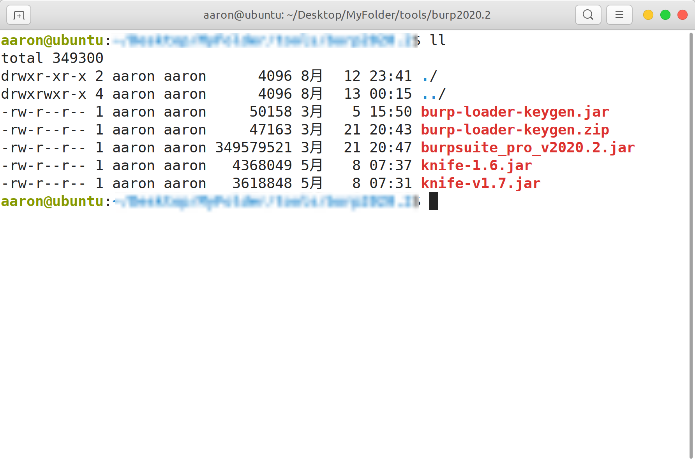
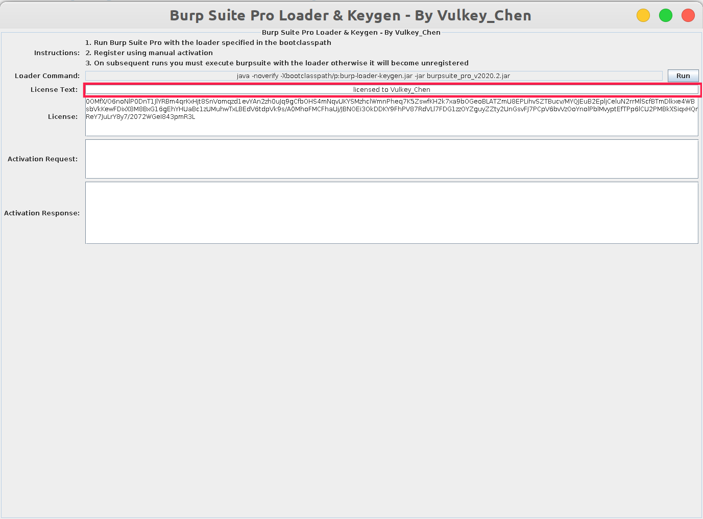
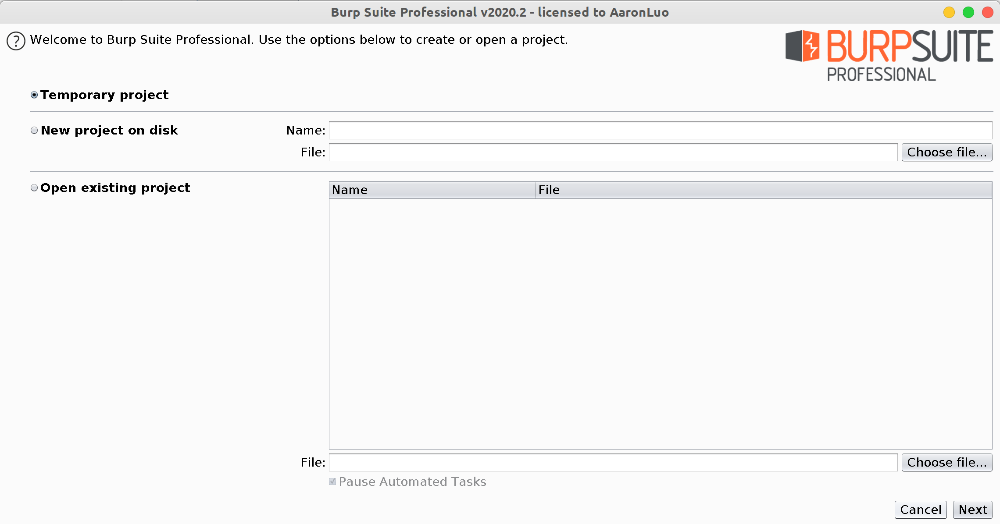
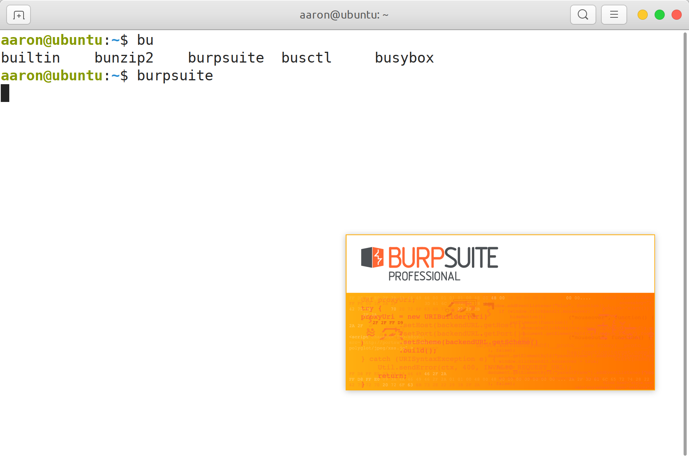

### Ubuntu2020.2桌面版 安装 BurpSuite2020.2

因为工作需要，现在将操作系统换成了Ubuntu 2020.2 Desktop，需要将以前的工具安装到现在的操作系统

#### 安装jdk

jdk需要使用`oracle jdk`，不能使用`openjdk`，`open jdk`支持性没有`oracle jdk`高

```bash
java -version
```

```bash
openjdk version "1.8.0_102" 
OpenJDK Runtime Environment (build 1.8.0_102-b14) 
OpenJDK 64-Bit Server VM (build 25.102-b14, mixed mode)xxxxxxxxxx openjdk version "1.8.0_102" OpenJDK Runtime Environment (build 1.8.0_102-b14) OpenJDK 64-Bit Server VM (build 25.102-b14, mixed mode)java version "1.8.0_261"Java(TM) SE Runtime Environment (build 1.8.0_261-b12)Java HotSpot(TM) 64-Bit Server VM (build 25.261-b12, mixed mode)bash
```

如果是`openjdk`需要卸载`openjdk`

```bash
sudo apt-get remove openjdk*  
```

确认卸载完毕之，去[oracle官网]()下载`oracle jdk `,现在下载`jdk`需要注册，下载好之后，在`/usr`目录下创建一个`java`目录，再将`jdk.tar.gz`放在`/usr/java`目录下，并解压`.tar.gz`，具体操作如下：

```bash
sudo mkdir /usr/java
sudo mv /home/user/Download/jdk.tar.gz /usr/java
cd /usr/java
tar zxvf jdk.tar.gz
sudo rm jdk.tar.gz -f
```

在`/etc/profile`最后一行如下添加环境变量

```bash
export JAVA_HOME=/usr/java/jdk1.8.0_261

export JRE_HOME=${JAVA_HOME}/jre

export CLASSPATH=.:${JAVA_HOME}/lib:${JRE_HOME}/lib

export PATH=${JAVA_HOME}/bin:$PATH
```

添加完成之后，执行`soucre /etc/profile`命令，如果在新打开终端之后，能够访问到`$JAVA_HOME`，需要在`/etc/bash.bashrc`中添加环境变量，桌面版推荐编辑`/etc/bash.bashrc`，编辑完之后，关闭该终端，新打开一个终端，环境变量生效

> [!NOTE]
>
> 还是推荐使用oracle JDK，open JDK 不太好用个人认为

#### 破解burp 

在burpsuite的文件夹中打开终端，使用`sudo java -jar burp-loader-keygen.jar`，这个时候执行`sudo java`会报`command not found`的错误，网上很多文章是说将jdk的路径添加到`security path`,其实这个时候更好的做法是将java软链接到`/usr/bin/`目录下，顺便也将javac软链接到`/usr/bin`中

> [!NOTE]
>
> 其实这里最好的做法是不用sudo，直接以jdk的绝对路径启动就行，2020年那会儿对LInux了解不深，只是觉得需要以root来启动比较安全哈哈哈


> [!TIP]
>
> 这会儿的做法大多数是将其写成一个桌面应用直接点击即可
>
> 不过使用后台任务也不错，这样不用去寻找桌面应用直接在终端点击即可


> [!WARNING]
>
> 使用终端打开一定得切记环境变量，主要是多用户或者root用户无java环境的问题，以及java权限，执行终端burp的权限的问题
>
> 不要再软链接到/usr/bin 目录下

```bash
sudo ln -s /usr/java/jdk/bin/java /usr/bin/
sudo ln -s /usr/java/jdk/bin/javac /usr/bin/
```

当完成以上操作，则可以使用`sudo java`的命令

在普通用户的terminal下，进入burp的文件夹，其中burp的文件目录结构如下图所示：



输入命令

```bash
sudo java -jar burp-loader-keygen.jar
```



其中`License Text`可以修改为`License to <Your name>`，只有这样才能点击`run`按钮启动`burpsuite_pro_v2020.2.jar`

启动之后，将License中的内容粘贴到`Enter license key`中，点击next，这里选择`Manual activation` 

在`Manual  activation`窗口中 点击`Copy request` 复制内容到` Activation Request`中，最后再复制`Activation Response`中的激活码内容到`Manual activation`中的`Paste Response`点击`next`



然后添加快捷方式，首先我们要知道linux下的快捷方式启动需要看`$PATH`，系统的快捷可执行文件都需要软链接到`/usr/bin`目录下

所以在`/usr/bin/`目录下创建`burpsuite`文件

```bash
cd /usr/bin/ && sudo touch burpsuite
sudo vim burpsuite
#按如下方式编辑
sudo java -noverify -Xbootclasspath/p:/<your burpsuite folder absolute path>/burp-loader-keygen.jar -jar <your burpsuite folder absolute path>/burpsuite_pro_v2020.2.jar
#编辑完成之后wq保存，再添加一个x权限
sudo chmod +x burpsuite
```

最后在terminal中输入命令`burpsuite`就可以启动burp了

